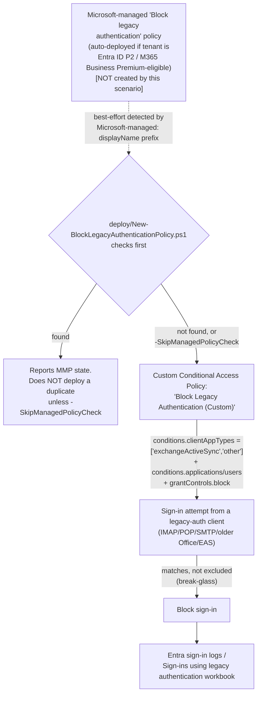

## 1. Problem statement

`scenarios/adaptive-protection/conditional-access-insider-risk-block/reviews.md` (Red Team finding
2) flagged a real, documented Conditional Access gap that scenario deliberately does not close:
legacy authentication protocols (POP, IMAP, SMTP, older non-modern-auth Office clients, Exchange
ActiveSync) have long-standing coverage gaps with several Conditional Access condition types,
including the Insider Risk condition. An Elevated-risk user with a legacy-auth-capable client can
retain access that scenario's own policy intends to block. Microsoft's documented mitigation is a
**separate, dedicated "block legacy authentication" policy** [[1]](#references) — a general
Conditional Access hardening practice, not specific to Adaptive Protection or Insider Risk, and
Microsoft's own recommended prerequisite baseline for *any* other Conditional Access control in a
tenant. This scenario builds it as its own standalone fragment, per `AGENTS.md` §6.

## 2. Design goals

1. **Close the exact gap the sibling scenario flagged**, using Microsoft's own documented
   procedure for it — the "Block legacy authentication with Conditional Access" guide's Users/
   Target resources/Client apps/Grant/Report-only sequence [[1]](#references), reproduced exactly
   rather than a bespoke design.
2. **Do not reinvent a control Microsoft may have already deployed.** This is the load-bearing
   finding of this build's grounding pass (§3): Microsoft now auto-deploys a **Microsoft-managed**
   "Block legacy authentication" Conditional Access policy to eligible tenants
   [[2]](#references). A scenario that blindly creates a second, functionally identical policy
   without checking for this first would be exactly the kind of native-capability duplication
   `AGENTS.md` §5 (Microsoft Product Owner lens) exists to catch. The deploy script checks first.
3. **Still offer a legitimate custom-policy path.** Microsoft's own guidance explicitly suggests
   "duplicating" a Microsoft-managed policy when an organization "need[s] to make more changes
   than what's allowed in the Microsoft-managed policies" [[2]](#references) — so detecting the
   Microsoft-managed policy is not a hard stop, it's an informed decision point. A tenant not yet
   eligible for the Microsoft-managed rollout (§4), or one needing a narrower `Users` scope than
   "all eligible users minus manual exclusions," has a real reason to deploy this scenario's
   custom policy instead of or alongside it.
4. **Start in Report-only, exactly like Microsoft's own guide.** Identical posture default to
   every other Conditional-Access-based scenario in this library.
5. **Never ship without a break-glass exclusion path**, for the same reason
   `conditional-access-insider-risk-block/design.md` §2 goal 5 states — a block control's stakes
   for an accidentally-included account are high enough that the deploy script surfaces a warning
   rather than silently proceeding with an empty exclusion list.

## 3. The Microsoft-managed policy finding (why this scenario checks first)

This build's grounding pass on Microsoft's current "Microsoft-managed Conditional Access
policies" documentation [[2]](#references) found:

- Microsoft **auto-creates** a "Block legacy authentication" policy directly in eligible tenants,
  in **Report-only** state, without any admin action.
- Eligibility requires **Microsoft Entra ID P2** or **Microsoft 365 Business Premium** licensing
  per that page's own Prerequisites section [[2]](#references) — a narrower population than every
  Conditional-Access-capable tenant (P1 alone does not make a tenant eligible for the
  Microsoft-managed rollout, even though P1 alone is sufficient to build this scenario's own
  custom policy — see §4).
- Microsoft **auto-enables** the policy (Report-only → enforcing) **no less than 30 days** after
  it first appears, unless an admin changes its state sooner — with email/Message Center
  notification 2 weeks before enablement.
- Organizations **can exclude identities and change state**, but **can't rename or delete** a
  Microsoft-managed policy.
- Microsoft-managed policy display names **start with the literal string `Microsoft-managed:`**
  — the one confirmed, citable signal this build found for distinguishing one from an
  organization-authored policy at the Graph layer (the "Created by: Microsoft" distinction itself
  is portal-only rendering, not a documented `conditionalAccessPolicy` property — see §6).

**Consequence for this scenario's design:** for any buyer already on Entra ID P2 or Microsoft 365
Business Premium, a policy that blocks legacy authentication is either already present in their
tenant today, or will auto-enable within 30 days regardless of whether they run this scenario at
all. Presenting this scenario as "the way to get this control" without disclosing that would be
inaccurate and would fail the four-lens review's Microsoft Product Owner lens. The deploy script
therefore checks for the Microsoft-managed policy first (best-effort — §6) and reports its state
rather than proceeding blind.

## 4. Licensing floor: this is the library's first Entra ID **P1**-only Conditional Access scenario

Both existing Conditional-Access-based scenarios in this library
(`conditional-access-insider-risk-block`, `conditional-access-insider-risk-step-up-auth`) require
**Microsoft Entra ID P2**, because the Insider Risk condition and (for the step-up sibling) risk
levels are P2-gated features. This scenario's `clientAppTypes` + `block` grant control combination
uses **no risk-based or premium-only condition at all** — Microsoft's own Conditional Access
licensing reference confirms the feature-wide floor is **Microsoft Entra ID P1** (or bundled
Microsoft 365 Business Premium) [[7]](#references), materially cheaper than the P2 floor its two
CA siblings require. `docs/licensing-matrix.md` §9 documents this distinction so a buyer doesn't
assume every Conditional-Access-based scenario in this library needs P2.

A tenant with **neither P1 nor P2** (Microsoft Entra ID Free) cannot deploy this scenario's custom
policy at all — Conditional Access itself requires at least P1. **Security defaults**
[[8]](#references) is Microsoft's documented zero-cost alternative for that tier: a single
tenant-wide on/off toggle that also blocks legacy authentication protocols, with no customization
(no exclusions, no Report-only mode, no per-population scoping). This scenario does not configure
or check security defaults — out of scope, see §7 — but README.md §3/§11 tells a Free-tier buyer
where to look instead of leaving them with a scenario that can't apply to them.

## 5. Architecture

## 6. Key decisions

| Decision | Choice | Rationale |
|---|---|---|
| Check for a Microsoft-managed equivalent first | Best-effort `Microsoft-managed:` displayName prefix + `legacy` substring match, non-blocking (informational stop, not an error) | The only confirmed, citable Graph-visible signal for a Microsoft-managed policy is its naming convention [[2]](#references) — no documented boolean flag exists on the v1.0 `conditionalAccessPolicy` resource (checked directly against the resource reference [[5]](#references)). Disclosed as best-effort, not asserted as exhaustive — see §7 Non-goals and README.md §11. |
| `clientAppTypes` values | `['exchangeActiveSync', 'other']` — NOT `'all'`, `'browser'`, or `'mobileAppsAndDesktopClients'` | Matches Microsoft's own documented portal procedure exactly: "Check only the boxes Exchange ActiveSync clients and Other clients" [[1]](#references), confirmed against the `conditionalAccessConditionSet` resource's `clientAppTypes` enum [[4]](#references). Scoping to only these two client types (rather than blocking all client apps) is what makes this a *legacy-authentication*-specific control instead of a blanket sign-in block — the latter is a materially different, much broader control this scenario deliberately does not build. |
| Deployment path | Custom Conditional Access policy via Microsoft Graph, not the Quick Setup wizard or duplicating the Microsoft-managed policy by default | Consistent with every other Conditional-Access-based scenario in this library — a buyer who already has (or is deploying) their own controls wants each reviewed and deployed independently, not bundled into a wizard action. |
| Target resources | `includeApplications = ['All']` | Matches Microsoft's own documented procedure step exactly [[1]](#references). |
| Users scope | `includeUsers = ['All']` minus `-ExcludeUserIds`/`-ExcludeGroupIds` | Matches Microsoft's documented procedure (include all users, exclude break-glass/emergency-access and service accounts still dependent on legacy protocols) [[1]](#references). |
| Grant control | `builtInControls = ['block']`, `operator = 'OR'` | Matches Microsoft's documented "Block access" grant control choice exactly [[1]](#references). |
| Initial policy state | `enabledForReportingButNotEnforced` (Report-only), matching Microsoft's own documented Step 9 | Every Conditional-Access-based scenario in this library defaults to Report-only first; this one is no exception, and Microsoft's own procedure explicitly recommends it before enabling. |
| Policy identity for idempotency | Exact `displayName` match | Same limitation and same strategy as `conditional-access-insider-risk-block`/`conditional-access-insider-risk-step-up-auth` — Conditional Access policies don't expose a client-choosable GUID at creation. |
| Policy naming | `Block Legacy Authentication (Custom)` | Deliberately distinct from a Microsoft-managed policy's own `Microsoft-managed: ...`-prefixed name, so this script's displayName lookup can never collide with (or be mistaken for) one Microsoft may have already deployed. |

## 7. Non-goals

- **This scenario does not manage, modify, or delete a Microsoft-managed policy.** Microsoft's own
  documentation states organizations can't rename or delete Microsoft-managed policies, and that
  editing one is limited to state and exclusions, done through the Microsoft Entra admin center
  (or, unconfirmed by this build, directly by its own `id` via Graph — see the VERIFY in
  `README.md` §11). Out of scope for this scenario's scripts.
- **This scenario does not configure or check Security defaults.** A separate, simpler, zero-cost
  mechanism for tenants without Entra ID P1/P2 — mutually exclusive in practice with Conditional
  Access (Microsoft recommends disabling security defaults before adopting Conditional Access
  policies [[8]](#references)), and out of this scenario's Conditional-Access-specific scope. See
  §4.
- **This scenario does not script the additional documented "exclude guests/external users"
  nested condition**, for the identical reason and identical unconfirmed-shape caveat as
  `conditional-access-insider-risk-block/design.md` §7 — not independently confirmed against a
  worked example during this build.
- **This scenario does not attempt Exchange-side legacy-auth blocking** (`Set-AuthenticationPolicy`
  / `Set-TransportConfig`, or the Exchange 2019 hybrid authentication-policy mechanism
  [[9]](#references)) — a separate, workload-specific control surface Conditional Access's own
  documented Q&A guidance notes is actually **more effective against brute-force/credential-
  stuffing lockout attempts specifically**, since Conditional Access is evaluated only *after*
  first-factor authentication succeeds (§8, `reviews.md` Red Team). **Built** as
  `scenarios/adaptive-protection/exchange-legacy-auth-block/` — deploy that companion scenario
  alongside this one for layered coverage.
- **This scenario does not script Conditional Access for workload identities / service
  principals.** Service principal sign-ins are never subject to a user-scoped Conditional Access
  policy like this one's [[1]](#references) — a distinct, separate Conditional Access surface
  (Conditional Access for workload identities) this scenario does not configure.

## 8. Residual risk: Conditional Access is a post-authentication control

Microsoft's own community guidance (cited directly, not just the product documentation) states
plainly that "Conditional access policies will not help you [with credential-stuffing lockouts],
as they apply post (first factor) authentication... Even if a CA policy blocks the login attempt,
at this point the attacker knows credentials were successfully verified" [[13]](#references). This scenario's block
happens *after* the identity platform has already validated the username/password (or other
first factor) — it stops the resulting **session**, not the **authentication attempt** itself, and
does not prevent an attacker from confirming valid credentials via a blocked legacy-auth request.
This is a genuine, disclosed limitation carried into `README.md` §11 and `reviews.md` (Red Team),
not a flaw unique to this scenario — it is documented Conditional Access behavior generally.
