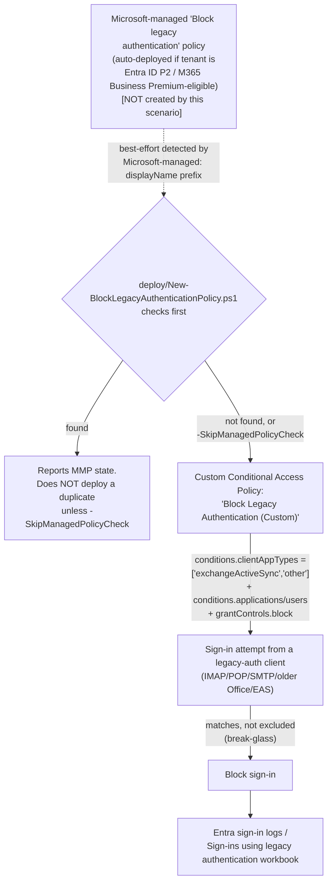

## 1. Scenario summary

Checks whether Microsoft has already auto-deployed its own **Microsoft-managed** "Block legacy
authentication" Conditional Access policy to the tenant, then — only if one isn't already covering
it, or the operator deliberately wants an independent policy — creates or reconciles a custom
Microsoft Entra Conditional Access policy that blocks (or, by default, reports on) sign-in attempts
using legacy authentication protocols (POP, IMAP, SMTP, older non-modern-auth Office clients,
Exchange ActiveSync). Legacy authentication doesn't support multifactor authentication, so an
attacker who obtains valid credentials can use it to bypass every MFA requirement a tenant has
configured elsewhere.

**Who it's for:** any Microsoft 365 tenant with **Microsoft Entra ID P1 or higher** that has not
already confirmed legacy authentication is blocked — including a buyer deploying this library's
own [`adaptive-protection/conditional-access-insider-risk-block`](/scenarios/adaptive-protection/conditional-access-insider-risk-block/), whose own four-lens
review flagged this exact gap as a Red Team finding (`reviews.md` there, Finding 2: legacy-auth
clients may not fully honor that scenario's Insider Risk condition). This scenario is a general
Conditional Access hardening prerequisite, not specific to Adaptive Protection or Insider Risk —
housed alongside this library's other Conditional-Access-based scenarios for discoverability
(`design.md` §1).

## 2. Business/regulatory driver

- **This is one of the highest-leverage, lowest-cost identity controls Microsoft documents.**
  Microsoft's own analysis states more than 97% of credential-stuffing attacks and more than 99%
  of password-spray attacks use legacy authentication protocols specifically **because** those
  protocols don't support multifactor authentication [[1]](#references) — an attacker who already
  has MFA-protected credentials can often still get in through an unblocked legacy-auth path.
- **Prerequisite hardening for every other Conditional Access control in this library.** Both of
  this library's other Conditional-Access-based scenarios
  (`conditional-access-insider-risk-block`, `conditional-access-insider-risk-step-up-auth`) assume
  a baseline of Conditional Access hygiene neither of them scripts — this scenario is that
  baseline.
- **SOC 2 / ISO 27001 / PCI DSS control-automation expectations.** "Legacy/basic authentication is
  disabled" is a commonly-assessed identity control across these frameworks' access-control
  domains; this scenario gives a buyer a scripted, evidenced way to close it.
- **Zero Trust identity guidance.** Microsoft's own Zero Trust identity-protection guidance lists
  blocking legacy authentication as a named recommendation alongside MFA enforcement
  [[1]](#references).

## 3. Prerequisites

Full licensing detail and citations: `docs/licensing-matrix.md` §9 (this scenario's Entra ID P1
requirement — notably **not** P2, unlike this library's other two Conditional-Access-based
scenarios). RBAC detail: `docs/rbac-model.md` §10 (reused unchanged — same Conditional Access
Administrator role and Graph permissions as the sibling scenarios). Summary:

| Requirement | Minimum | Notes |
|---|---|---|
| Conditional Access (custom policy path) | **Microsoft Entra ID P1**, standalone or bundled (e.g. **Microsoft 365 E3/E5**, **Microsoft 365 Business Premium**) | Confirmed directly on Microsoft's Conditional Access licensing reference [[7]](#references) — a materially lower floor than the **P2** this library's other two Conditional-Access-based scenarios require, since this scenario uses no risk-based condition. See `docs/licensing-matrix.md` §9. |
| Microsoft-managed policy eligibility (auto-deployed path, informational only — not required to use this scenario) | **Microsoft Entra ID P2** or **Microsoft 365 Business Premium** | Per Microsoft's own Microsoft-managed-policies prerequisites [[2]](#references) — a tenant on P1 only will never receive the auto-deployed policy and should expect this scenario's custom-policy path to be the one that actually applies. |
| No Conditional Access license at all (Entra ID Free) | **Security defaults** [[8]](#references) | Out of scope for this scenario's scripts — see §11. A Free-tier tenant should enable security defaults instead, which also blocks legacy authentication (with no customization). |
| Role to create/manage this scenario's Conditional Access policy | **Conditional Access Administrator** (Microsoft Entra role) | Same role and Graph permission set as this library's other Conditional-Access-based scenarios — `docs/rbac-model.md` §10. |
| Automation identity for the deploy script | Microsoft Graph app-only certificate authentication, `Policy.ReadWrite.ConditionalAccess` + `Policy.Read.All` application permissions | `docs/automation-surface.md` §3 (surface 3, Microsoft Graph) — identical permission set to the sibling scenarios. |
| Emergency-access (break-glass) account(s) or group | Excluded from this policy before enforcement | §5 Step 4 below; Microsoft's standard, independently-documented Conditional Access deployment practice [[10]](#references). |

> Verify current entitlement names against `docs/licensing-matrix.md` and the Product Terms before
> a sales commitment — SKU names change.

## 4. Architecture



Full rule-by-rule rationale, including the Microsoft-managed-policy finding this scenario's design
is built around, is in `design.md` §3–7.

## 5. Step-by-step implementation

### Step 1 — Assign permissions

In the **Microsoft Entra admin center**, assign administrators who will manage this control the
**Conditional Access Administrator** role [[7]](#references) — `docs/rbac-model.md` §10.

### Step 2 — Identify legacy authentication use before changing anything

Before creating or checking any policy, understand current impact:

1. **Entra admin center** → **Monitoring & health** → **Sign-in logs**, add the **Client App**
   column, filter by the legacy authentication protocols, and repeat on the
   **User sign-ins (non-interactive)** tab [[1]](#references).
2. Or use the **Sign-ins using legacy authentication workbook** [[11]](#references), which
   surfaces the same signal pre-filtered, with up to 90 days of history.

Do this even if a Microsoft-managed policy already exists (Step 3) — the workbook and sign-in logs
are the actual evidence a Report-only policy's impact is safe to promote, regardless of which
policy (Microsoft-managed or custom) is doing the evaluating.

### Step 3 — Check for an existing Microsoft-managed policy (scripted, read-only)

```powershell
Connect-MgGraph -ClientId $AppId -TenantId $TenantId -CertificateThumbprint $Thumbprint

# Dry run - the check itself makes no changes regardless of -WhatIf, but pass it to preview the
# create/update path this run would otherwise take if no managed policy is found.
./deploy/New-BlockLegacyAuthenticationPolicy.ps1 -ExcludeGroupIds $EmergencyAccessGroupId -WhatIf
```

If a Microsoft-managed policy is found, the script stops here (no duplicate is created) and prints
its current state. Manage it directly in the **Microsoft Entra admin center** (exclude break-glass
accounts, or leave/promote its Report-only state) instead of continuing to Step 4 — unless you have
a specific reason to need an independent custom policy (`design.md` §3), in which case re-run with
`-SkipManagedPolicyCheck`.

### Step 4 — Identify and exclude break-glass/emergency-access accounts

Before deploying the custom policy path, identify (or create, per Microsoft's documented pattern
[[10]](#references)) a dedicated **emergency-access** security group, or list individual break-glass
account object IDs, plus any user accounts used as de-facto service accounts still dependent on
legacy protocols pending migration [[1]](#references). Note their object ID(s)/group ID(s).

### Step 5 — Deploy the custom Conditional Access policy (scripted, dry-run capable)

```powershell
./deploy/New-BlockLegacyAuthenticationPolicy.ps1 -ExcludeGroupIds $EmergencyAccessGroupId
```

Creates one Conditional Access policy scoped to all applications, all users except the excluded
break-glass group, restricted to `exchangeActiveSync`/`other` client app types, with a `block`
grant control (§6 for the exact configuration) — in Report-only state.

### Step 6 — Pilot, then enforce

Review the policy's Report-only results in **Entra admin center** → **Conditional Access** →
**Insights and reporting**, cross-referenced against Step 2's workbook/log evidence, for at least a
few days of representative traffic before promoting:

```powershell
./deploy/New-BlockLegacyAuthenticationPolicy.ps1 -ExcludeGroupIds $EmergencyAccessGroupId -Mode Enabled -Force
```

### Step 7 — Validate

```powershell
./validate/Test-BlockLegacyAuthenticationPolicy.ps1 -ExpectedState enabled
```

## 6. Configuration reference

| Setting | Value this scenario uses | Notes |
|---|---|---|
| Policy name | `Block Legacy Authentication (Custom)` | Deliberately distinct from a Microsoft-managed policy's own `Microsoft-managed: ...`-prefixed name — see §11. |
| Target resources | `includeApplications = ['All']` | Matches Microsoft's own documented "All resources" step [[1]](#references). |
| Users | `includeUsers = ['All']` minus `-ExcludeUserIds`/`-ExcludeGroupIds` | Excludes break-glass accounts/group and any legacy-auth-dependent service accounts. Does **not** script Microsoft's additional documented "exclude guests/external user categories" nested condition — see §11. |
| Client apps condition | `clientAppTypes = ['exchangeActiveSync', 'other']` | Matches Microsoft's documented procedure exactly: check **only** Exchange ActiveSync clients and Other clients — deliberately **not** Browser or Mobile apps and desktop clients, which are modern-auth client types [[1]](#references)[[4]](#references). |
| Grant control | `builtInControls = ['block']`, `operator = 'OR'` | Matches Microsoft's documented "Block access" choice [[1]](#references). |
| Initial policy state | `enabledForReportingButNotEnforced` (Report-only) | Matches Microsoft's own documented rollout sequence [[1]](#references). |
| Break-glass exclusion | Not enabled by default — must be supplied via `-ExcludeUserIds`/`-ExcludeGroupIds` | The deploy script **warns** (does not refuse) if both are empty while `-Mode Enabled` — see §11. |
| Microsoft-managed policy pre-check | On by default; skip with `-SkipManagedPolicyCheck` | Best-effort detection by `Microsoft-managed:`-prefixed displayName containing "legacy" — see §11. |

## 7. Validation / how to prove it works

1. **Automated checks** — `./validate/Test-BlockLegacyAuthenticationPolicy.ps1` reports whether a
   Microsoft-managed policy exists and its state, validates this scenario's own custom policy's
   shape if present, and **fails hard if neither exists** — legacy authentication would then be
   completely unrestricted by Conditional Access in that tenant.
2. **Manual checklist** — the same script prints a checklist for everything with no API to query:
   whether the legacy-auth-usage workbook/logs have actually been reviewed, whether break-glass
   accounts are excluded from whichever policy is the tenant's source of truth, and awareness of
   the Microsoft-managed policy's 30-day auto-enable clock if relying on it.
3. **Report-only evidence before enforcement** — **Entra admin center** → **Conditional Access** →
   **Insights and reporting**, filtered to the relevant policy, shows which sign-ins *would* have
   been blocked.
4. **End-to-end functional test (non-production accounts/clients only)** — in a pilot tenant,
   attempt an IMAP or basic-auth SMTP sign-in with a disposable test account while the policy is in
   Report-only, confirm it surfaces in Insights and reporting, then re-test after promoting to
   `-Mode Enabled` and confirm the sign-in is actually blocked.

## 8. Operations & tuning

**KPIs to watch (first 90 days):** count of blocked legacy-auth sign-in attempts (by user and by
protocol), count of Report-only "would-have-been-blocked" events before promotion, and any
help-desk tickets tied to a legitimate account/device that still needs a legacy-auth exception.

**Tuning:** if a specific account genuinely cannot migrate off a legacy protocol yet (e.g. a
multifunction device that sends email via SMTP), add it to the exclusion group rather than
weakening the policy's `clientAppTypes`/grant-control shape — narrow, named exceptions preserve
the control's value for everyone else.

**Incident-response runbook (block event):**
1. **Triage** — the blocked sign-in appears in **Entra sign-in logs**, flagged with this policy's
   (or the Microsoft-managed policy's) name under **Conditional Access**; the **Client App**
   column names the specific legacy protocol used.
2. **Determine intent** — a single blocked attempt from a known user is usually a
   misconfigured device/client, not an attack; a burst of blocked attempts across many accounts in
   a short window, or from an unfamiliar location, is a credential-stuffing/password-spray
   indicator worth escalating — cross-reference with Entra ID Protection risk signals if licensed.
3. **Remediate** — for a legitimate device/client, migrate it to modern authentication if possible;
   if migration isn't immediately possible, add a narrowly-scoped exclusion (§6) rather than
   disabling the policy.

**Review cadence:** quarterly — re-run Step 2's workbook/log review to confirm no new legacy-auth
dependency has appeared, and re-check whether a Microsoft-managed policy has since appeared (e.g.
after a licensing upgrade to P2) that would supersede this scenario's custom policy.

## 9. Rollback / decommission

See `rollback.md` for the full staged procedure (disable → Report-only → permanent removal) for
this scenario's own **custom** policy. This scenario never modifies a Microsoft-managed policy —
Microsoft's own documentation states organizations can't rename or delete one; managing it (state,
exclusions) is a Microsoft Entra admin center action outside this scenario's scripts.

## 10. Cost & licensing notes

- **Entra ID P1 floor, not P2.** Unlike this library's other two Conditional-Access-based
  scenarios, this one needs no risk-based condition — Microsoft's own Conditional Access licensing
  reference confirms P1 (or bundled Microsoft 365 Business Premium) is sufficient
  [[7]](#references). A buyer already licensed at Microsoft 365 E3 (which bundles Entra ID P1)
  needs **no incremental identity license** for this specific scenario.
- **Likely already free for a P2/Business Premium tenant.** If the Microsoft-managed policy is
  found (§5 Step 3), this scenario adds **no incremental cost or new object** — it only confirms
  and documents a control Microsoft already deployed.
- **No PAYG component.** Conditional Access evaluation is a per-user-entitlement feature, not
  consumption-billed.
- **No additional infrastructure cost.** The deploy/validate scripts are one-time or infrequent.

## 11. Known limitations & gotchas

- **Microsoft-managed policy detection is best-effort, not a confirmed Graph flag.** The v1.0
  `conditionalAccessPolicy` resource has no documented boolean property (e.g.
  "isMicrosoftManaged") this scenario's scripts could check directly — the portal's "Created by:
  Microsoft" column is a UI-only rendering. Detection relies on Microsoft's own audit-log guidance
  that "Microsoft-managed policy names start with Microsoft-managed:" [[2]](#references). A tenant
  that has renamed its Microsoft-managed policy (not something Microsoft's own UI allows, per that
  same page — but not independently re-verified for a direct Graph PATCH attempt) would not be
  detected by this heuristic.
- **Conditional Access is a post-authentication control.** As `design.md` §8 documents, blocking
  legacy authentication with Conditional Access stops the resulting session, not the authentication
  attempt itself — Microsoft's own community guidance confirms this does not prevent a
  credential-stuffing/password-spray attempt from confirming valid credentials, only from
  establishing a session with them. Exchange-side authentication policies are a separate,
  workload-specific control that acts earlier — built as the companion scenario
  [`adaptive-protection/exchange-legacy-auth-block`](/scenarios/adaptive-protection/exchange-legacy-auth-block/), not scripted by this scenario itself
  (`design.md` §7).
- **This scenario does not script the "exclude guests/external users" nested Users condition**
  Microsoft's own guide's procedure also recommends for some Conditional Access scenarios — the
  same undocumented `excludeGuestsOrExternalUsers` shape this library's other Conditional-Access
  scenarios also decline to script unverified.
- **This scenario does not check or configure Security defaults.** A tenant without Entra ID P1/P2
  at all should use security defaults instead [[8]](#references) — not something this scenario's
  scripts detect or recommend automatically.
- **Policy identity is by exact `displayName`, not a fixed GUID** — same limitation as this
  library's other Conditional-Access-based scenarios; renaming the policy in the portal breaks
  this script's idempotency detection.
- **VERIFY (pilot tenant, before relying on Graph to manage a Microsoft-managed policy directly):**
  whether `Update-MgIdentityConditionalAccessPolicy`/`Remove-MgIdentityConditionalAccessPolicy`
  actually accept a PATCH (state/exclusions) or reject a DELETE against a Microsoft-managed
  policy's `id` the same way the portal UI restricts renaming/deletion — not independently tested
  during this build; this scenario's own scripts never attempt either against a Microsoft-managed
  policy regardless of the answer (`design.md` §7).
- **VERIFY (pilot tenant):** the exact, byte-precise remainder of a Microsoft-managed policy's
  displayName beyond the confirmed `Microsoft-managed:` prefix (e.g. whether it is exactly
  `Microsoft-managed: Block legacy authentication`) — not independently confirmed word-for-word
  during this build; this scenario's detection regex is deliberately tolerant (prefix + substring
  match) rather than an exact-string comparison, to avoid a false "not found" from a minor wording
  difference.
- **The Microsoft-managed policy's 30-day auto-enable clock is Microsoft's timeline, not this
  scenario's.** A buyer relying on the Microsoft-managed policy alone should not assume it stays in
  Report-only indefinitely — review and act (exclude break-glass, or explicitly disable if not
  ready) before the auto-enable date rather than being surprised by it.

## 12. References

1. Block legacy authentication with Conditional Access (the exact portal procedure — Users/Target
   resources/Client apps/Grant/Report-only sequence — this scenario's deploy script automates;
   attack-statistics; sign-in-log identification steps) — <https://learn.microsoft.com/entra/identity/conditional-access/policy-block-legacy-authentication>
2. Microsoft-managed Conditional Access policies (auto-deployment, 30-day auto-enable, "Created
   by: Microsoft" / `Microsoft-managed:` naming convention, P2/Business Premium eligibility,
   "duplicate if you need more changes" guidance) — <https://learn.microsoft.com/entra/identity/conditional-access/managed-policies>
3. Conditional Access: Conditions — Client apps (portal client-app categories: Browser, Mobile
   apps and desktop clients, Exchange ActiveSync clients, Other clients) — <https://learn.microsoft.com/entra/identity/conditional-access/concept-conditional-access-conditions>
4. conditionalAccessConditionSet resource type (`clientAppTypes` property, Graph v1.0, values
   all/browser/mobileAppsAndDesktopClients/exchangeActiveSync/easSupported/other) — <https://learn.microsoft.com/graph/api/resources/conditionalaccessconditionset>
5. conditionalAccessPolicy resource type (`state` property; no documented Microsoft-managed-policy
   boolean flag) — <https://learn.microsoft.com/graph/api/resources/conditionalaccesspolicy>
6. Create / Update conditionalAccessPolicy (least-privileged permission
   `Policy.ReadWrite.ConditionalAccess` + `Policy.Read.All`) — <https://learn.microsoft.com/graph/api/conditionalaccessroot-post-policies>, <https://learn.microsoft.com/graph/api/conditionalaccesspolicy-update>
7. What is Conditional Access? (License requirements — Microsoft Entra ID P1) — <https://learn.microsoft.com/entra/identity/conditional-access/overview>
8. Security defaults in Microsoft Entra ID (zero-cost alternative for tenants without P1/P2;
   mutual-exclusivity guidance with Conditional Access) — <https://learn.microsoft.com/entra/fundamentals/security-defaults>
9. Block legacy authentication in Exchange 2019 hybrid (a separate, workload-specific,
   earlier-in-the-flow control surface — see the companion scenario
   [`adaptive-protection/exchange-legacy-auth-block`](/scenarios/adaptive-protection/exchange-legacy-auth-block/), which targets pure Exchange Online
   instead) — <https://learn.microsoft.com/exchange/hybrid-deployment/block-legacy-auth-2019-hybrid>
10. Manage emergency access (break-glass) accounts — <https://learn.microsoft.com/entra/identity/role-based-access-control/security-emergency-access>
11. Sign-ins using legacy authentication workbook — <https://learn.microsoft.com/entra/identity/monitoring-health/workbook-legacy-authentication>
12. New- / Update- / Get- / Remove-MgIdentityConditionalAccessPolicy (Microsoft.Graph.Identity.SignIns
    module) — <https://learn.microsoft.com/powershell/module/microsoft.graph.identity.signins/new-mgidentityconditionalaccesspolicy>, <https://learn.microsoft.com/powershell/module/microsoft.graph.identity.signins/update-mgidentityconditionalaccesspolicy>, <https://learn.microsoft.com/powershell/module/microsoft.graph.identity.signins/get-mgidentityconditionalaccesspolicy>, <https://learn.microsoft.com/powershell/module/microsoft.graph.identity.signins/remove-mgidentityconditionalaccesspolicy>
13. Conditional access policy not behaving as expected — Microsoft Q&A (Conditional Access is a
    post-first-factor-authentication control, does not stop credential-stuffing/lockout attempts
    at the identity layer itself) — <https://learn.microsoft.com/answers/a/1903274>
14. `docs/licensing-matrix.md` §9 — Microsoft Entra ID P1 (baseline Conditional Access), new in
    this build.
15. `docs/rbac-model.md` §10 — Microsoft Entra Conditional Access (reused unchanged from the
    sibling scenarios).
16. [`adaptive-protection/conditional-access-insider-risk-block`](/scenarios/adaptive-protection/conditional-access-insider-risk-block/) — the sibling scenario
    whose four-lens review originally flagged this gap.

> Re-verify all links, API behavior, and licensing terms against current Microsoft Learn before a
> customer-facing assessment or sale — Microsoft-managed Conditional Access policies are a
> comparatively new, actively-evolving mechanism that can change tenant eligibility or naming
> conventions faster than most of the Purview portfolio.
