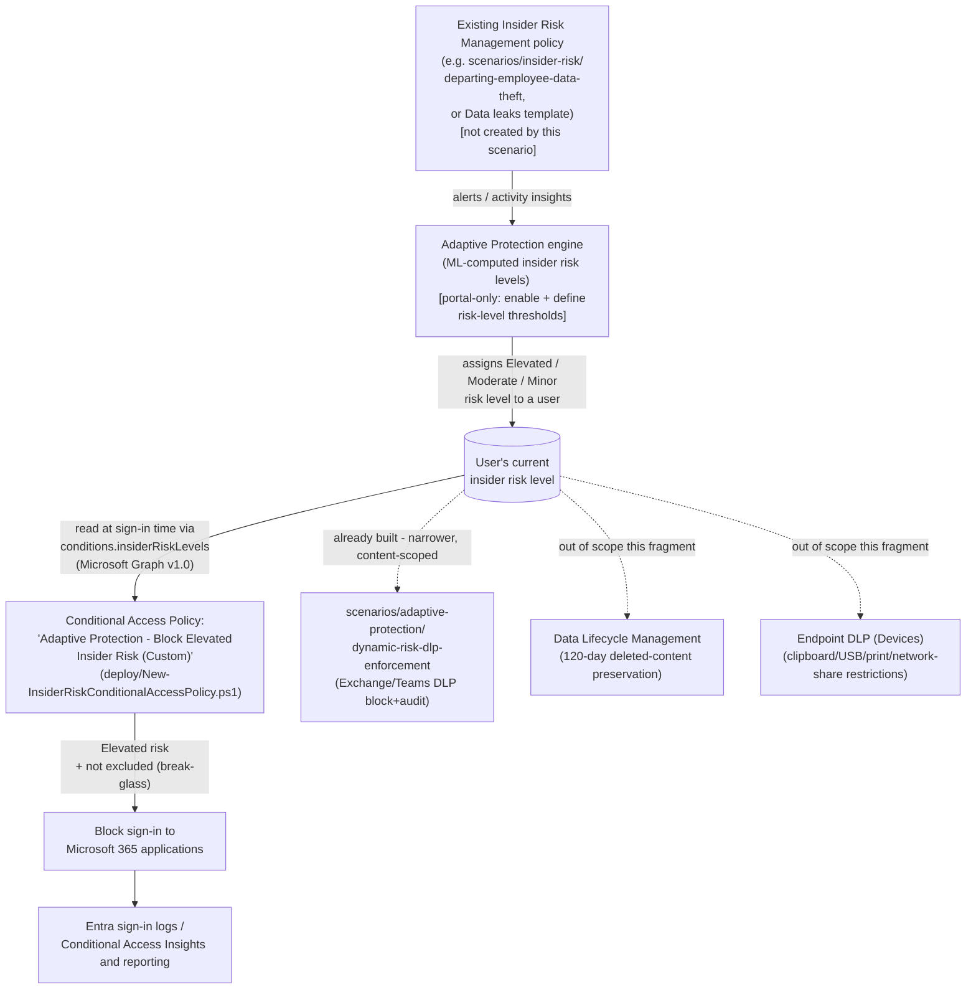

## 1. Problem statement

[`adaptive-protection/dynamic-risk-dlp-enforcement`](/scenarios/adaptive-protection/dynamic-risk-dlp-enforcement/) closes the DLP half of Adaptive
Protection's enforcement surface: an Elevated-risk user is blocked from sharing content
externally over Exchange/Teams. That scenario's own `design.md` §7 (Non-goals) and `README.md`
§11 name the gap directly: an Elevated-risk user blocked from *emailing* or *Teams-sharing* a
file externally can, as of that scenario alone, still walk out with the identical file via a
direct SharePoint/OneDrive download, a USB copy, printing, or an upload to a personal
cloud-storage app — none of which a DLP policy scoped to Exchange/Teams inspects. Conditional
Access closes a materially different, broader channel: instead of blocking one *content
transfer* action, it can block the user's *sign-in to Microsoft 365 applications entirely* the
moment their insider risk level is Elevated — a coarser but much wider net.

## 2. Design goals

1. **Reuse the same live risk-level signal, on a different admin surface.** Exactly like the DLP
   sibling, this scenario does not create a new Insider Risk Management policy or touch Adaptive
   Protection's enable/threshold settings — both remain portal-only prerequisites owned
   elsewhere. This scenario only authors the *Conditional Access* side that reads the same
   Adaptive-Protection-computed insider risk level.
2. **Script the part that has a real, grounded Graph API surface.** Microsoft Graph v1.0's
   `conditionalAccessConditionSet.insiderRiskLevels` property (accepting `minor`/`moderate`/
   `elevated`/`unknownFutureValue`) is confirmed directly on the current, non-beta Microsoft
   Learn resource reference [[3]](#references) — this is a materially different, better-grounded
   position than the DLP sibling scenario assumed when it deferred this exact fragment ("no
   PowerShell/Graph write API... both are portal-only" applied to *Adaptive Protection settings*,
   not to Conditional Access itself, which this build's fresh grounding pass confirms *does*
   have a documented v1.0 Graph condition). See §8 for the correction this supersedes.
3. **Match Microsoft's own documented policy shape, not a bespoke design.** Microsoft's "Block
   access for users with elevated insider risk" guide [[1]](#references) walks the exact
   Users/Target resources/Insider Risk condition/Grant/Report-only sequence this scenario's
   deploy script automates — reproduced deliberately, so a buyer evaluating this scenario can
   cross-check it directly against Microsoft's own guide.
4. **Start in Report-only, exactly like Microsoft's own guide recommends.** Step 7 of Microsoft's
   documented procedure explicitly enables the policy "in Report-only mode" first
   [[1]](#references) — this scenario's script defaults to the same posture (`-Mode ReportOnly`)
   and requires an explicit `-Mode Enabled -Force` to go live, consistent with this library's
   `dynamic-risk-dlp-enforcement` sibling.
5. **Never ship without a break-glass exclusion path.** Unlike a DLP rule (which degrades a
   single action), a Conditional Access block can lock a user out of every Microsoft 365
   application. Emergency-access/break-glass account exclusion is a standard, independently
   documented Conditional Access deployment practice [[7]](#references), not something specific
   to insider risk — but the stakes of skipping it are highest for a *block* control, so the
   deploy script surfaces a warning rather than silently proceeding with an empty exclusion list.

## 3. Why Conditional Access here (not the DLP sibling alone, not Entra ID Protection risk policies)

- **The DLP sibling scenario** blocks a specific *content transfer action* (Exchange send, Teams
  external share). It does not — and by its own documented scope cannot — stop the same
  Elevated-risk user from downloading the identical file directly from SharePoint/OneDrive, or
  copying it to removable media, or printing it. Those are different action types the DLP
  engine's own policy locations don't cover.
- **Conditional Access with the Insider Risk condition** blocks the user's *access to the
  application itself* — the broadest, coarsest possible response: sign-in to Microsoft 365 apps
  and (depending on `includeApplications` scope) any other resource this policy targets. It is
  not content-aware and does not distinguish "sharing a sensitive file" from "reading email" —
  by design, it is meant as a wide net for a user the organization has decided it no longer wants
  actively signed in, not a scoped content-transfer control.
- **Microsoft Entra ID Protection's own user-risk/sign-in-risk Conditional Access conditions**
  (`signInRiskLevels`, `userRiskLevels`) are a *different* risk signal entirely — computed from
  identity-compromise indicators (leaked credentials, anomalous sign-in patterns), not from
  Purview's content/behavior-based insider risk detection. A tenant may run both simultaneously;
  they are complementary, not substitutable, and this scenario does not configure or duplicate
  Entra ID Protection's risk policies.
- **Together with the DLP sibling**, this scenario gives a buyer two independently-scoped
  automated responses to the same Elevated risk-level signal: a narrow one (stop this specific
  external share) and a broad one (stop signing in at all), deployable independently or together
  depending on the org's risk tolerance and the maturity of its feeder IRM policy — see §7.

## 4. Architecture

## 5. Data flow

Identical propagation model to the DLP sibling (`dynamic-risk-dlp-enforcement/design.md` §5):
insider risk *level* computation happens entirely inside the Adaptive Protection/Insider Risk
Management service. This scenario's deploy script never reads or writes that attribute directly
— it creates a Conditional Access policy whose **condition** references it
(`conditions.insiderRiskLevels`). At sign-in evaluation time, the Conditional Access engine looks
up the user's current insider risk level and matches (or doesn't match) the policy accordingly.
No polling, webhook, or export is involved on this scenario's side. The same **up to 36-hour**
propagation delay after Adaptive Protection is first enabled applies here as well
[[6]](#references) — carried into `README.md` §11.

## 6. Key decisions

| Decision | Choice | Rationale |
|---|---|---|
| Condition parameter | Graph `conditions.insiderRiskLevels` (v1.0, `conditionalAccessConditionSet` resource) | Independently confirmed on the current, non-beta Microsoft Learn resource reference [[3]](#references) — not fabricated or inferred by analogy to the DLP sibling's differently-shaped `-SharedByIRMUserRisk` GUID condition (a Security & Compliance PowerShell parameter on a different object type entirely). |
| Deployment path | Custom Conditional Access policy via Microsoft Graph (`New-/Update-MgIdentityConditionalAccessPolicy`), not the Quick Setup portal wizard | Same reasoning as the DLP sibling (`dynamic-risk-dlp-enforcement/design.md` §6): Quick Setup bundles a new auto-created IRM policy, DLP policy, and Data Lifecycle Management policy into one wizard action — wrong fit for a buyer who already has (or is deploying via this library) their own IRM/DLP policies and wants each control reviewed and deployed independently. |
| Target resources | `includeApplications = ['All']` | Matches Microsoft's own documented procedure step ("Target resources: All resources") [[1]](#references) — a buyer wanting a narrower resource scope can override `-DisplayName`'s underlying body before deploy, documented as a tuning option in `README.md` §8, not built in by default, since narrowing risks under-covering the exact "stop signing in anywhere" intent Microsoft's own guide targets. |
| Users scope | `includeUsers = ['All']` minus `-ExcludeUserIds`/`-ExcludeGroupIds`/`-ExcludeGuestOrExternalUserTypes` | Matches Microsoft's documented procedure exactly (Include all users, exclude emergency-access/break-glass **and** the guide's own Users-step guest/external exclusion) [[1]](#references). The guest/external exclusion — Graph's `conditions.users.excludeGuestsOrExternalUsers.guestOrExternalUserTypes` nested condition — was independently confirmed against the `conditionalAccessGuestsOrExternalUsers` resource reference [[12]](#references) and is now scripted, defaulting to the exact three categories Microsoft's guide names: `b2bDirectConnectUser`, `serviceProvider`, `otherExternalUser` [[1]](#references). One byte-level detail remains unconfirmed rather than guessed — the exact separator between multiple values on the wire (this script assumes a bare comma) — flagged in the deploy script's `.NOTES` and README.md §11. |
| Risk level(s) in scope by default | `['elevated']` only | Matches the single risk level Microsoft's own guide documents end-to-end [[1]](#references). Unlike the DLP sibling's two-rule Elevated-block/Moderate-Minor-audit split, this scenario's single Conditional Access policy applies the *same* grant control to every risk level passed in `-RiskLevels` — Conditional Access grant controls are per-policy, not per-condition-value, so replicating the DLP sibling's graduated response needs a second policy (documented as a tuning option, `README.md` §6/§8), not a parameter on this one. |
| Initial policy state | `enabledForReportingButNotEnforced` (Report-only), matching Microsoft's own documented Step 7 | Every step in Microsoft's own guide enables the policy in Report-only mode first [[1]](#references) before any enforcement guidance is given — this scenario does not go further/faster than Microsoft's own recommended default, especially since a wrongly-scoped block has immediate, org-wide sign-in impact, broader than the DLP sibling's single-channel block. |
| Grant control | `builtInControls = ['block']`, `operator = 'OR'` | Matches Microsoft's documented "Block access" grant control choice [[1]](#references) exactly, rather than a softer alternative (e.g. require MFA) — Microsoft's own guide frames this specific policy as a block control; a buyer wanting a softer response for Moderate/Minor risk should deploy a second, separately-controlled policy (§8), not weaken this one's block semantics. |
| Policy identity for idempotency | Exact `displayName` match | Conditional Access policies don't expose a client-choosable GUID at creation the way this library's own JSON-payload-based Intune/macOS device-control scripts do (deploy script `.NOTES`) — displayName matching is the same identity strategy Microsoft's own Graph PowerShell examples use for Conditional Access automation. Documented as a known limitation (`README.md` §11): renaming the policy in the portal breaks this script's own idempotency detection. |
| Policy naming | `Adaptive Protection - Block Elevated Insider Risk (Custom)` | Parallels the DLP sibling's `(Custom)` naming convention, deliberately distinct from Microsoft's own Quick Setup wizard's auto-generated Conditional Access policy name. That exact auto-generated string was **not** independently confirmed during this build — flagged as a VERIFY (`README.md` §11) rather than guessed, so this script never compares against an unconfirmed name. |

## 7. Non-goals

- **This scenario does not create or configure an Insider Risk Management policy**, and **does
  not enable Adaptive Protection or define insider risk level thresholds** — identical non-goals
  to the DLP sibling scenario, for the identical reason (§4 there).
- **This scenario does not script the `excludeGuestsOrExternalUsers.externalTenants` sibling
  property** (scoping the guest/external exclusion to specific external tenant IDs rather than
  applying it across all of them). Microsoft's own guide does not scope by tenant either — see §6
  — and the resource reference documents `externalTenants` as usable only once
  `guestOrExternalUserTypes` is already set [[12]](#references), making it a genuinely separate,
  optional refinement rather than something this scenario's default configuration needs. A buyer
  running a multi-tenant/MSSP posture who wants to scope this exclusion to specific partner
  tenants should add it manually in the portal (or extend the deploy script) rather than assume
  this scenario covers it.
- **This scenario does not modify or manage the DLP sibling's policy.** The two are independent,
  separately-deployed controls reading the same risk-level signal — see §3. A buyer can run
  either alone or both together; neither script checks for or depends on the other's presence.
- **This scenario does not configure Entra ID Protection's own `signInRiskLevels`/
  `userRiskLevels` Conditional Access conditions.** A different, identity-risk-based signal —
  out of scope by module boundary (`AGENTS.md` §2 scopes this library to the Purview portfolio,
  not the broader Entra ID Protection product).
- **This scenario does not configure the Data Lifecycle Management 120-day deleted-content
  preservation policy or Endpoint DLP (Devices)** — both remain out of scope here for the same
  reasons the DLP sibling's own `design.md` §7 already documents; tracked there, not duplicated.

## 8. Correction to the DLP sibling scenario's stated non-goal

`dynamic-risk-dlp-enforcement/design.md` §7 states this integration was, at that build's time,
"a Microsoft-labeled **preview** integration" requiring re-verification of GA status before
scoping — the exact instruction this fragment's `PROGRESS.md` follow-up item carried forward.
This build's fresh grounding pass found **no preview label** on Microsoft's current
"Block access for users with elevated insider risk" guide (a dedicated how-to procedure, not a
"coming soon" notice) or on the `conditionalAccessConditionSet.insiderRiskLevels` Graph v1.0
resource property (last confirmed current, non-beta) [[1]](#references)[[3]](#references) —
independent industry reporting places general availability at June 2024. Tracked as a
`PROGRESS.md` follow-up to backport this correction into the DLP sibling's own docs (this
fragment does not modify that scenario's files directly, per `AGENTS.md` §6 one-fragment
discipline).
