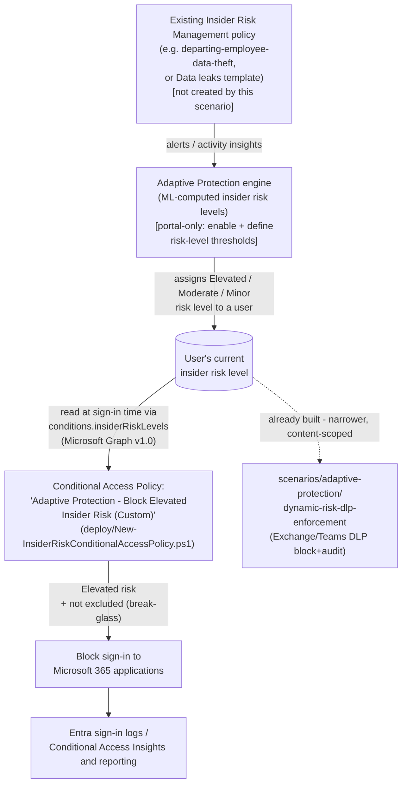

## 1. Scenario summary

Deploys a Microsoft Entra Conditional Access policy that blocks (or, in its default posture,
reports on) sign-in to Microsoft 365 applications for users Microsoft Purview Adaptive
Protection has assigned an **Elevated** insider risk level, using Conditional Access's own
**Insider Risk** condition (`conditions.insiderRiskLevels`). As Insider Risk Management raises or
resets a user's risk level, this policy's evaluation of that user changes on the next sign-in —
no analyst has to manually revoke access.

**Who it's for:** any Microsoft 365 E5 (or Purview Suite) tenant with **Microsoft Entra ID P2**
that already has an Insider Risk Management policy generating risk signal — this library's own
`scenarios/insider-risk/departing-employee-data-theft/`, or Microsoft's built-in **Data leaks**
template — and wants the broadest possible automated response (stop the user signing in at all)
available alongside, or instead of, this library's narrower
`scenarios/adaptive-protection/dynamic-risk-dlp-enforcement/` (which blocks only a specific
Exchange/Teams external share). See `design.md` §3 for exactly how the two differ and when to use
which.

## 2. Business/regulatory driver

Same underlying gap `dynamic-risk-dlp-enforcement/README.md` §2 describes — detection (Insider
Risk Management) and enforcement have historically required a human to notice an alert and
manually act — but this scenario closes it with the widest available lever instead of a
content-scoped one:

- **Faster, broader incident containment.** A DLP block stops one channel; a Conditional Access
  block stops the user's Microsoft 365 session entirely, closing SharePoint/OneDrive downloads,
  removable-media copies via synced files, printing from a signed-in session, and every other
  access path the DLP-only sibling scenario cannot reach (`design.md` §3).
- **SOC 2 / ISO 27001 control-automation expectations.** The same automated detection-to-
  enforcement evidence the DLP sibling scenario supports, extended to the identity layer.
- **A materially different residual-risk profile for CISO sign-off.** Blocking sign-in entirely
  is a bigger business-continuity decision than blocking one export channel — this scenario's
  `README.md` §8 and `reviews.md` (CISO lens) treat that difference explicitly, not as a smaller
  version of the DLP sibling's own considerations.
- **Insurance / cyber-liability underwriting.** As with the DLP sibling, automated risk-adaptive
  access controls are an increasingly specific underwriting question.

## 3. Prerequisites

Full licensing detail and citations: `docs/licensing-matrix.md` §2 (Adaptive Protection row) and
§8 (this scenario's Entra ID P2 requirement, new in this build). RBAC detail:
`docs/rbac-model.md` §10 (Microsoft Entra Conditional Access — new in this build). Summary:

| Requirement | Minimum | Notes |
|---|---|---|
| Adaptive Protection (feeder risk signal) | **Microsoft 365 E5**, **Purview Suite**, or the underlying IRM add-on | Inherits IRM prerequisites — see `dynamic-risk-dlp-enforcement/README.md` §3 |
| **Microsoft Entra ID P2** | Standalone, or bundled in **Microsoft 365 E5** / **Microsoft 365 E5 Security** | Required specifically for the Conditional Access Insider Risk *condition* — a materially narrower requirement than "any Entra P1/P2 for administrative units" already in `docs/licensing-matrix.md` §4; see §8 |
| Insider Risk Management (feeder policy) | Already deployed and generating alerts/insights | Not created by this scenario — see §2 (Non-goals in `design.md` §7) |
| Role to configure Adaptive Protection settings/insider risk levels | **Insider Risk Management** or **Insider Risk Management Admins** role group (Purview) | Same role group the DLP sibling scenario uses — this scenario does not add a new Purview-side role |
| Role to create/manage this scenario's Conditional Access policy | **Conditional Access Administrator** (Microsoft Entra role) | A **separate admin surface from every Purview role group** in `docs/rbac-model.md` §1 — see §10 there (new in this build) |
| Automation identity for the deploy script | Microsoft Graph app-only certificate authentication, `Policy.ReadWrite.ConditionalAccess` + `Policy.Read.All` application permissions | `docs/automation-surface.md` §3 (surface 3, Microsoft Graph) — same app-only certificate pattern as every other Graph-based scenario in this library |
| Feeder Insider Risk Management policy | Already deployed and generating alerts/insights | Not created by this scenario |
| Adaptive Protection enabled, with insider risk levels defined | Portal-only, no PowerShell/Graph surface found during this build | Same portal-only prerequisite as the DLP sibling — see §5 Steps 1–3 there |
| Emergency-access (break-glass) account(s) or group | Excluded from this policy before enforcement | §5 Step 5 below; Microsoft's standard, independently-documented Conditional Access deployment practice [[7]](#references) |

> Verify current entitlement names against `docs/licensing-matrix.md` and the Product Terms
> before a sales commitment — SKU names change.

## 4. Architecture



Full rule-by-rule rationale, including exactly what this scenario can and cannot script and how
it relates to its DLP sibling, is in `design.md` §3–7.

## 5. Step-by-step implementation

This scenario is **portal-first for Adaptive Protection enablement** (identical to the DLP
sibling — not repeated in code here) and **script-first for the Conditional Access policy
itself**, the one piece with a genuinely scriptable, independently-grounded Graph API surface.

### Step 1 — Confirm (or deploy) a feeder Insider Risk Management policy

Same as `dynamic-risk-dlp-enforcement/README.md` §5 Step 1 — use this library's own
`scenarios/insider-risk/departing-employee-data-theft/`, or Microsoft's built-in **Data leaks**
template. Not created by this scenario.

### Step 2 — Assign permissions

Purview portal → **Settings** → **Roles and groups** → **Role groups** → add administrators who
will configure Adaptive Protection to **Insider Risk Management** or **Insider Risk Management
Admins**. Separately, in the **Microsoft Entra admin center**, assign administrators who will
create/manage this scenario's Conditional Access policy the **Conditional Access Administrator**
role [[2]](#references) — a distinct admin surface from every Purview role group above
(`docs/rbac-model.md` §10).

### Step 3 — Configure insider risk levels (portal, not scriptable)

Identical to `dynamic-risk-dlp-enforcement/README.md` §5 Step 3. Both scenarios read the same
tenant-wide insider risk level definitions — configure them once, not per scenario.

### Step 4 — Turn on Adaptive Protection (portal, not scriptable)

Identical to `dynamic-risk-dlp-enforcement/README.md` §5 Step 5. Allow up to **36 hours**
[[6]](#references) before expecting risk levels to be assigned and this scenario's Conditional
Access policy to actually match a user — see §11.

### Step 5 — Identify and exclude break-glass/emergency-access accounts

Before deploying, identify (or create, per Microsoft's documented pattern [[7]](#references)) a
dedicated **emergency-access** security group, or list the individual break-glass account object
IDs. Note their object ID(s)/group ID(s) — needed for Step 6.

### Step 6 — Deploy the Conditional Access policy (scripted, dry-run capable)

```powershell
Connect-MgGraph -ClientId $AppId -TenantId $TenantId -CertificateThumbprint $Thumbprint

# Dry run - shows exactly what would be created, changes nothing
./deploy/New-InsiderRiskConditionalAccessPolicy.ps1 -ExcludeGroupIds $EmergencyAccessGroupId -WhatIf

# Deploy in Report-only mode (Microsoft's own documented default posture)
./deploy/New-InsiderRiskConditionalAccessPolicy.ps1 -ExcludeGroupIds $EmergencyAccessGroupId
```

This creates one Conditional Access policy scoped to all applications, all users except the
excluded break-glass group, with the `insiderRiskLevels = ['elevated']` condition and a `block`
grant control (§6 for the exact configuration) — in Report-only state.

### Step 7 — Pilot, then enforce

**Before enabling enforcement, confirm the feeder IRM policy has already completed at least one
full baseline/tuning cycle** — the same recommendation `dynamic-risk-dlp-enforcement/README.md`
§5 Step 6 makes, and for the identical reason: compounding an untuned detector with an automated
*block-everything* response multiplies business-impact risk. Review the policy's Report-only
results in **Entra admin center** → **Conditional Access** → **Insights and reporting** for at
least the propagation window in §11 before promoting. Once satisfied:

```powershell
./deploy/New-InsiderRiskConditionalAccessPolicy.ps1 -ExcludeGroupIds $EmergencyAccessGroupId -Mode Enabled -Force
```

### Step 8 — Validate

```powershell
./validate/Test-InsiderRiskConditionalAccessPolicy.ps1 -ExpectedState enabled
```

## 6. Configuration reference

| Setting | Value this scenario uses | Notes |
|---|---|---|
| Policy name | `Adaptive Protection - Block Elevated Insider Risk (Custom)` | Deliberately distinct from Microsoft's Quick-Setup-generated name — see §11 |
| Target resources | `includeApplications = ['All']` | Matches Microsoft's own documented "All resources" step [[1]](#references) |
| Users | `includeUsers = ['All']` minus `-ExcludeUserIds`/`-ExcludeGroupIds`/`-ExcludeGuestOrExternalUserTypes` | Excludes break-glass accounts/group **and**, by default, `b2bDirectConnectUser`/`serviceProvider`/`otherExternalUser` guest/external categories — Microsoft's own documented Users-step exclusion, now scripted (`conditions.users.excludeGuestsOrExternalUsers.guestOrExternalUserTypes`) — see §11 for the one unconfirmed formatting detail |
| Insider Risk condition | `insiderRiskLevels = ['elevated']` (default) | Configurable via `-RiskLevels`; adding `moderate`/`minor` applies the **same** block control to those levels too — see §6 note in `design.md` |
| Grant control | `builtInControls = ['block']`, `operator = 'OR'` | Matches Microsoft's documented "Block access" choice [[1]](#references) |
| Initial policy state | `enabledForReportingButNotEnforced` (Report-only) | Matches Microsoft's own documented Step 7 [[1]](#references) |
| Break-glass exclusion | Not enabled by default — must be supplied via `-ExcludeUserIds`/`-ExcludeGroupIds` | The deploy script **warns** (does not refuse) if both are empty while `-Mode Enabled` — see §11 |

## 7. Validation / how to prove it works

1. **Automated checks** — `./validate/Test-InsiderRiskConditionalAccessPolicy.ps1` confirms the
   policy exists with the correct state, `insiderRiskLevels` condition, target-resources/users
   scope, and block grant control. Exits non-zero on a hard failure.
2. **Manual checklist** — the same script prints a checklist for everything with no API to query:
   whether Adaptive Protection is actually turned on, whether Entra ID P2 is licensed, whether a
   feeder IRM policy is in scope, and whether the break-glass exclusion has actually been sign-in
   tested. A policy that passes every automated check can still silently match zero users, or
   worse, block an untested break-glass account, if these aren't confirmed.
3. **Report-only evidence before enforcement** — **Entra admin center** → **Conditional Access**
   → **Insights and reporting**, filtered to this policy, shows which sign-ins *would* have been
   blocked. Confirm this view shows activity (or a deliberate, explained absence of it) before
   promoting to `-Mode Enabled`.
4. **End-to-end functional test (non-production accounts only)** — in a pilot tenant: assign a
   test account a confirmed Elevated insider risk level (via the feeder IRM policy or the
   activities that qualify per Step 3's configuration), then attempt to sign in. Confirm the
   expected outcome: a report-only log entry (before enforcement) or an actual block (after).
   Wait the full 36-hour propagation window (§11) before concluding a test failed.

## 8. Operations & tuning

**KPIs to watch (first 90 days):** the same Adaptive Protection dashboard KPIs
`dynamic-risk-dlp-enforcement/README.md` §8 documents apply identically here (risk-level
assignment counts, false-positive rate, detection-to-enforcement latency, risk-level reset rate)
— review both scenarios' enforcement outcomes together, since they share the same upstream risk
signal.

**Tuning:** as with the DLP sibling, tune the *insider risk level conditions* in Adaptive
Protection settings if too many/few users are receiving a level — not this scenario's Conditional
Access policy, which should stay matched to Microsoft's own documented reference configuration
unless there's a specific, documented reason to diverge.

**Incident-response runbook (block event):**
1. **Triage** — the blocked user sees Entra's standard access-denied page; the sign-in appears in
   **Entra sign-in logs**, flagged with this policy's name under **Conditional Access**. There is
   no separate Purview-side alert for this specific block — cross-reference via the sign-in log,
   not the DLP Alerts dashboard.
2. **Cross-reference the feeder IRM policy's alert** — same manual-correlation caveat the DLP
   sibling's runbook documents: no shared correlation ID links a Conditional Access sign-in block
   to the specific IRM alert that produced the triggering risk level. Match by user and
   timestamp.
3. **Classify and resolve** — identical logic to the DLP sibling's runbook: if the underlying IRM
   alert is a false positive, resolving/dismissing it resets the user's risk level, which lifts
   the Conditional Access block automatically on the next sign-in evaluation — no manual
   Conditional Access exception needed.

**Review cadence:** quarterly, alongside the DLP sibling and the feeder IRM policy, using the
same KPIs.

**A blocked sign-in is a bigger business-continuity event than a blocked share.** Coordinate with
HR/Legal *and* IT service desk before broad enforcement-mode rollout — a user who cannot sign in
at all will call the help desk immediately, unlike a DLP-blocked share that may go unnoticed for
longer. Treat enabling `-Mode Enabled` org-wide as a change requiring service-desk runbook
readiness (§7 lists what they'll see), not only an HR/Legal-notified change. This is a residual
consideration for CISO sign-off — see `reviews.md`, CISO lens.

## 9. Rollback / decommission

See `rollback.md` for the full staged procedure (disable → Report-only → permanent removal).
Quick reference: `./deploy/Remove-InsiderRiskConditionalAccessPolicy.ps1` disables the policy
(reversible in seconds); `-ReportOnly` steps back to reporting-only; `-Purge` permanently deletes
it. None of these actions disable Adaptive Protection itself, the feeder IRM policy, or reset any
user's current insider risk level.

## 10. Cost & licensing notes

- **New incremental license requirement versus the DLP sibling: Microsoft Entra ID P2**, for
  every user in this policy's scope [[2]](#references). This is the first scenario in this
  library to require Entra ID P2 specifically for a *Conditional Access condition* (distinct from
  the more general "P1/P2 for administrative units" prerequisite already in
  `docs/licensing-matrix.md` §4) — see §8 there.
- **No incremental cost beyond that P2 requirement** for a tenant already at E5/Suite for the
  feeder IRM policy — Adaptive Protection's own signal generation is not billed separately per
  consuming policy (inherits `docs/licensing-matrix.md` §2's Adaptive Protection row).
- **No PAYG component.** Conditional Access evaluation is a per-user-entitlement feature, not
  consumption-billed.
- **Sizing note:** every user this policy could plausibly block needs Entra ID P2 *and* the
  qualifying DLP/IRM entitlement the feeder policy needs — a materially broader P2 footprint than
  a buyer might already hold if their only prior Entra P1/P2 use was administrative units for a
  narrow admin population. Confirm P2 coverage for the *entire* population this policy's `Users`
  condition includes before enabling enforcement, not just the IT/security team.
- **No additional infrastructure cost.** The deploy/validate scripts are one-time or infrequent.

## 11. Known limitations & gotchas

- **Up to 36 hours before Adaptive Protection actions apply after first enabling.** Same backend
  processing delay the DLP sibling documents — not a property of this scenario's Conditional
  Access policy [[6]](#references).
- **This scenario's policy will validate and deploy successfully even if Adaptive Protection is
  never turned on** — `insiderRiskLevels` simply never matches any user until both Adaptive
  Protection is enabled and a risk level is defined. The manual checklist in
  `validate/Test-InsiderRiskConditionalAccessPolicy.ps1` exists to catch this "looks configured,
  does nothing" state, the same trap the DLP sibling's own validation script guards against.
- **Policy identity is by exact `displayName`, not a fixed GUID.** Unlike this library's JSON-
  payload-based Intune/macOS device-control scripts (which mint their own fixed GUIDs), a
  Conditional Access policy's `id` is Graph-assigned on creation and cannot be pre-chosen —
  renaming this policy in the portal breaks this script's own idempotency detection on the next
  run (`design.md` §6, "Policy identity for idempotency" row).
- **The "exclude guests/external users" nested Users condition Microsoft's own guide's procedure
  recommends** [[1]](#references) **is now scripted**, defaulting to the same three categories the
  guide names (`b2bDirectConnectUser`, `serviceProvider`, `otherExternalUser` — Graph's
  `excludeGuestsOrExternalUsers.guestOrExternalUserTypes`, confirmed on the
  `conditionalAccessGuestsOrExternalUsers` resource reference [[12]](#references)[[13]](#references)).
  Two things remain genuinely open rather than guessed at: (1) the exact separator between
  multiple values on the wire when more than one is set — this script assumes a bare comma, not
  independently confirmed against a worked multi-value example — **VERIFY** (pilot tenant) before
  relying on this script's own idempotency (match/drift) detection for this one field in
  production; and (2) this scenario does not script the sibling `externalTenants` property
  (scoping the exclusion to specific external tenant IDs) — Microsoft's own guide doesn't scope by
  tenant either, so this is a deliberate non-goal, not a gap — see `design.md` §7.
- **Policy naming deliberately avoids asserting Microsoft's Quick Setup auto-generated name.**
  Unlike the DLP sibling scenario (which independently confirmed and explicitly avoided colliding
  with Microsoft's exact auto-generated DLP policy name), this build could **not** independently
  confirm Microsoft Quick Setup's exact auto-generated Conditional Access policy display name —
  **VERIFY** (pilot tenant, or a future grounding pass) before assuming no collision is possible
  if a tenant later also runs Quick Setup.
- **This scenario blocks sign-in broadly, not by content sensitivity.** Like the DLP sibling's
  own `AccessScope`-only condition, `insiderRiskLevels` alone matches *any* sign-in attempt by an
  Elevated-risk user — it does not distinguish a routine Outlook check from an attempted mass
  download. This is intentional (it matches Microsoft's own documented reference configuration
  [[1]](#references)) but is the broadest, most business-impacting control in this library's
  Adaptive Protection scenarios — see §8's CISO/service-desk coordination note.
- **A Conditional Access block does not retroactively undo anything already accessed** before the
  block took effect — this is a forward-looking access control, not a data-recovery or
  containment-of-already-copied-data mechanism.
- **No PowerShell/Graph write API for enabling Adaptive Protection or defining insider risk
  levels** — identical limitation to the DLP sibling; `design.md` §4/§7.
- **VERIFY (pilot tenant, before production reliance):** confirm Microsoft's documented Users
  step's additional guest/external-category exclusion recommendation (above) doesn't materially
  change expected coverage for your tenant's actual guest population before enabling enforcement.
- **An already-issued sign-in session is not necessarily terminated the instant a user becomes
  Elevated-risk.** Conditional Access (including this policy) is evaluated at sign-in; for
  applications/tenants without **Continuous Access Evaluation (CAE)** enabled, an access token
  issued before the risk-level change can remain valid until it expires (commonly up to an hour)
  rather than being revoked immediately. CAE is a separate, broader Entra capability this scenario
  does not configure — a real, disclosed bypass window for an actively-signed-in user, not a flaw
  specific to this policy. Flagged as a Red Team finding in `reviews.md`.
- **Legacy authentication protocols may not fully honor this condition.** Clients using legacy
  auth (POP/IMAP/older non-modern-auth Office clients) have long-documented Conditional Access
  gaps independent of this scenario. Microsoft's own general guidance is to pair any risk-based
  Conditional Access policy with a separate, dedicated **block legacy authentication** policy
  (`clientAppTypes` scoped to other/legacy clients) — not configured by this scenario, which
  assumes that baseline hardening is already in place. If it isn't, an Elevated-risk user with a
  legacy-auth-capable client may retain access this policy intends to block.
- **This policy's own change-propagation delay is separate from Adaptive Protection's 36-hour
  risk-level delay.** A newly created or updated Conditional Access policy itself can take up to
  roughly 15–30 minutes to apply across Microsoft 365 clients/sessions — a much shorter, different
  delay than the 36-hour window before Adaptive Protection first assigns risk levels after being
  turned on. Don't conflate the two when triaging why a test sign-in wasn't evaluated as expected.

## 12. References

1. Block access for users with elevated insider risk (the exact portal procedure — Users/Target
   resources/Insider Risk condition/Grant/Report-only sequence — this scenario's deploy script
   automates) — <https://learn.microsoft.com/entra/identity/conditional-access/policy-risk-based-insider-block>
2. Protect your tenant with Insider Risk in Conditional Access (Microsoft Entra ID P2 licensing
   requirement; Insider Risk Management/Insider Risk Management Admins + Conditional Access
   Administrator role prerequisites) — <https://learn.microsoft.com/entra/identity/monitoring-health/recommendation-insider-risk-condition>
3. conditionalAccessConditionSet resource type (`insiderRiskLevels` property, Graph v1.0, values
   minor/moderate/elevated/unknownFutureValue) — <https://learn.microsoft.com/graph/api/resources/conditionalaccessconditionset>
4. conditionalAccessPolicy resource type (`state` property: enabled/disabled/
   enabledForReportingButNotEnforced) — <https://learn.microsoft.com/graph/api/resources/conditionalaccesspolicy>
5. Create / Update conditionalAccessPolicy (least-privileged permission
   `Policy.ReadWrite.ConditionalAccess` + `Policy.Read.All`) — <https://learn.microsoft.com/graph/api/conditionalaccessroot-post-policies>, <https://learn.microsoft.com/graph/api/conditionalaccesspolicy-update>
6. Help dynamically mitigate risks with Adaptive Protection (36-hour propagation delay,
   insider risk levels) — <https://learn.microsoft.com/purview/insider-risk-management-adaptive-protection>
7. Manage emergency access (break-glass) accounts — <https://learn.microsoft.com/entra/identity/role-based-access-control/security-emergency-access>
8. New- / Update- / Get- / Remove-MgIdentityConditionalAccessPolicy (Microsoft.Graph.Identity.SignIns
   module) — <https://learn.microsoft.com/powershell/module/microsoft.graph.identity.signins/new-mgidentityconditionalaccesspolicy>, <https://learn.microsoft.com/powershell/module/microsoft.graph.identity.signins/update-mgidentityconditionalaccesspolicy>, <https://learn.microsoft.com/powershell/module/microsoft.graph.identity.signins/get-mgidentityconditionalaccesspolicy>, <https://learn.microsoft.com/powershell/module/microsoft.graph.identity.signins/remove-mgidentityconditionalaccesspolicy>
9. `docs/licensing-matrix.md` §8 — Entra ID P2 (Conditional Access risk-based conditions), new in
   this build.
10. `docs/rbac-model.md` §10 — Microsoft Entra Conditional Access (a sixth RBAC system), new in
    this build.
11. `scenarios/adaptive-protection/dynamic-risk-dlp-enforcement/` — the DLP sibling scenario this
    fragment complements; see `design.md` §3 for how the two differ.
12. conditionalAccessUsers / conditionalAccessGuestsOrExternalUsers resource types
    (`excludeGuestsOrExternalUsers.guestOrExternalUserTypes`/`externalTenants` properties this
    build's `-ExcludeGuestOrExternalUserTypes` parameter scripts) — <https://learn.microsoft.com/graph/api/resources/conditionalaccessusers>, <https://learn.microsoft.com/graph/api/resources/conditionalaccessguestsorexternalusers>
13. conditionalAccessGuestOrExternalUserTypes enum reference (the seven real, client-settable
    values: `internalGuest`/`b2bCollaborationGuest`/`b2bCollaborationMember`/
    `b2bDirectConnectUser`/`otherExternalUser`/`serviceProvider`, plus the server-only
    `unknownFutureValue`) — <https://learn.microsoft.com/graph/api/resources/enums#conditionalaccessguestorexternalusertypes-values>

> Re-verify all links, API behavior, and licensing terms against current Microsoft Learn before a
> customer-facing assessment or sale — Adaptive Protection and its Conditional Access integration
> are comparatively new capabilities that change faster than most in the Purview portfolio.
