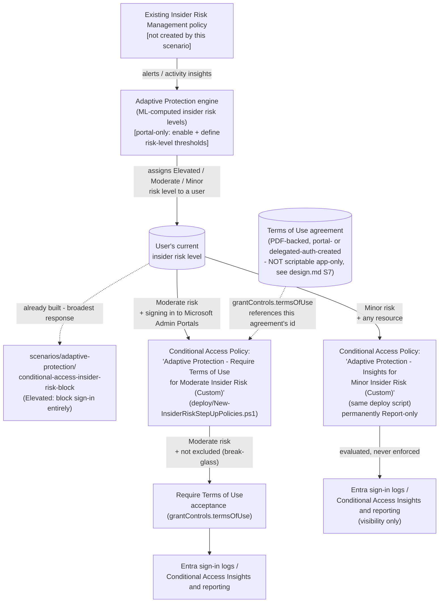

## 1. Problem statement

`scenarios/adaptive-protection/conditional-access-insider-risk-block/` closes the Elevated-risk
half of the Conditional Access side of Adaptive Protection: an Elevated-risk user is blocked from
signing in to Microsoft 365 applications entirely. That scenario's own `design.md` §6 documents,
by design, a **single-policy, single-grant-control** limitation: Conditional Access grant controls
apply per-policy, not per-condition-value, so a buyer wanting a *different*, softer response for
Moderate/Minor risk levels needs a **second, independently-scoped policy** — deferred there as a
tuning option, tracked in `PROGRESS.md` as a follow-up. This fragment closes that follow-up.

## 2. Design goals

1. **Do not guess a grant control Microsoft hasn't documented.** The obvious naive design —
   "require MFA / require compliant device for Moderate/Minor risk" — is exactly that: a guess.
   This build's grounding pass found Microsoft's own **Adaptive Protection configuration guide**
   [[1]](#references), which gives a specific, named Conditional Access recommendation **per
   insider risk level**, materially different from the naive MFA/compliant-device idea:
   - **Moderate** → require **Terms of Use** acceptance at sign-in to **Microsoft Admin Portals**
     (Microsoft's own dedicated, fully-worked how-to guide) [[2]](#references).
   - **Minor** → a Conditional Access policy with the Insider Risk condition, kept permanently in
     **Report-only** mode, for visibility only — Microsoft's guide names no grant control at all
     for this level, only "increased visibility... while preserving their productivity"
     [[1]](#references).
   This scenario reproduces Microsoft's own documented pairing exactly, rather than inventing a
   plausible-sounding alternative — see §3 for why the naive MFA/compliant-device idea was
   rejected.
2. **Reuse the same live risk-level signal**, exactly like the Elevated sibling — this scenario
   creates no Insider Risk Management policy and does not touch Adaptive Protection's enable/
   threshold settings.
3. **Never promote the Minor policy to enforcement.** Microsoft's own guidance for Minor risk is
   visibility-only ("while preserving their productivity") — there is no documented grant control
   to enforce. This scenario's deploy/remove scripts structurally exclude an `Enabled` state for
   the Minor policy (not just a documentation warning — the parameter's `ValidateSet` has no
   `Enabled` value), so a buyer cannot accidentally promote a visibility-only control into an
   enforcement control this scenario was never designed to support. See §6.
4. **Disclose the one real automation gap plainly rather than working around it silently.**
   Creating the Terms of Use **agreement** object itself (the PDF-backed document users accept) is
   documented by Microsoft as supporting only **delegated** permissions
   (`Agreement.ReadWrite.All`, work-or-school account) — **"Application: Not supported"** on the
   `Create agreement` Graph reference [[7]](#references). This library's standard automation
   pattern is app-only certificate authentication (`docs/automation-surface.md` §3), which cannot
   call this specific endpoint. Rather than silently assume a workaround exists, this scenario
   treats agreement creation as a **portal (or one-time delegated-auth) prerequisite**, exactly
   like Adaptive Protection enablement itself — the deploy script accepts an existing agreement's
   `-AgreementId` and never attempts to create one. See §7 (Non-goals) and `README.md` §11.

## 3. Why not "require MFA / require compliant device" for Moderate/Minor

An earlier `PROGRESS.md` follow-up item (written before this build's grounding pass) suggested "a
second Conditional Access policy variant applying a softer grant control (e.g. require MFA /
require compliant device...) scoped to Moderate/Minor risk levels" as the Conditional-Access-side
analog of the DLP sibling's Elevated-block/Moderate-Minor-audit split. That idea is a reasonable
*guess*, but this build's grounding pass found Microsoft has already published a specific,
named recommendation for exactly this situation (§2 point 1) — reproducing Microsoft's own
documented pairing is more defensible for a buyer evaluating this scenario against Microsoft's own
guidance than a plausible-sounding alternative this library invented. MFA/compliant-device step-up
remains a legitimate general Conditional Access pattern (Microsoft documents it extensively for
sign-in-risk and user-risk conditions [[8]](#references)) — just not the one Microsoft names for
the Insider Risk condition specifically. A buyer who prefers MFA/compliant-device over Terms of Use
for Moderate risk can still substitute it by changing the Moderate policy's `grantControls` in the
deploy script's parameters — documented as a tuning option, not built in by default, so this
scenario's default configuration stays cross-checkable against Microsoft's own guide.

## 4. Architecture

## 5. Data flow

Identical propagation model to the Elevated sibling (`conditional-access-insider-risk-block/
design.md` §5): insider risk *level* computation happens entirely inside the Adaptive Protection/
Insider Risk Management service. This scenario's deploy script never reads or writes that
attribute directly — it creates two Conditional Access policies whose **conditions** reference it
(`conditions.insiderRiskLevels`). At sign-in evaluation time, the Conditional Access engine looks
up the user's current insider risk level and matches (or doesn't match) each policy accordingly.
The same **up to 36-hour** propagation delay after Adaptive Protection is first enabled applies
here as well [[6]](#references).

**Terms of Use acceptance is separately, independently tracked** by Microsoft Graph's
`agreementAcceptance` resource [[9]](#references) — a per-user acceptance record distinct from the
Conditional Access policy object itself. This scenario's scripts do not read or manage acceptance
records; `README.md` §7/§8 documents where to find them.

## 6. Key decisions

| Decision | Choice | Rationale |
|---|---|---|
| Moderate risk grant control | `grantControls.termsOfUse = [$AgreementId]` | Matches Microsoft's own dedicated "Require terms of use to be accepted before accessing Microsoft Admin Portals" how-to guide exactly [[2]](#references) — the specific, named recommendation for Moderate insider risk [[1]](#references), not a guessed alternative (§3). |
| Moderate target resources | `includeApplications = ['MicrosoftAdminPortals']` | The documented special Graph value for the Microsoft Admin Portals app grouping [[10]](#references), matching Microsoft's own worked example exactly — not "All resources" (that would over-scope a control Microsoft specifically pairs with admin-portal access only). |
| Minor risk grant control | `grantControls.builtInControls = ['mfa']`, `operator = 'OR'` — a payload container only, **not** the Elevated sibling's `['block']` shape | Microsoft's guide names **no** grant control for Minor risk — only "a policy... in Report-Only mode" for visibility [[1]](#references). Rather than invent a plausible but unconfirmed control, this scenario reuses an already-independently-confirmed-valid `builtInControls` value purely as a payload container for a policy that is structurally never enforced by this script (see next row). **`mfa`, not `block`, was chosen deliberately for its fail-safe profile**: this library's own four-lens review (`reviews.md`, Microsoft Product Owner finding) identified that if this policy's `state` were ever changed to `enabled` outside this scenario's own scripts (a manual portal edit is the only path — see next row), a `block` container would lock out every Minor-risk user tenant-wide, while `mfa` merely adds a second-factor prompt — a far less disruptive worst case for a policy Microsoft's own guidance says should never restrict Minor-risk users' productivity in the first place. Disclosed explicitly in `README.md` §6/§11, not presented as a Microsoft recommendation of its own. |
| Minor risk policy state | Hard-restricted to `ReportOnly`/`Disabled` only — **no `Enabled` option exists in this policy's own parameter set** | Microsoft's documented intent for Minor risk is visibility-only, preserving productivity [[1]](#references) — there is no grant control to "promote to enforcement" the way the Moderate/Elevated policies have. A structural (`ValidateSet`) restriction, not a warning, matching this library's practice of encoding safety constraints in code where the risk of a buyer overriding a warning is meaningful (§2 point 3). |
| Minor target resources | `includeApplications = ['All']` | Matches the intent of Microsoft's own referenced "Conditional Access insights and reporting workbook" — broad visibility across sign-ins, not scoped to a specific app grouping the way the Moderate/ToU policy deliberately is. |
| Agreement (Terms of Use document) creation | **Not scripted** — accepted as an existing `-AgreementId` parameter | Microsoft's own `Create agreement` Graph reference states delegated permissions only, **"Application: Not supported"** [[7]](#references) — this library's standard app-only certificate automation pattern cannot call this endpoint. Documented as a portal (or one-time delegated-auth) prerequisite, not silently worked around. See §7, `README.md` §5 Step 4/§11. |
| Deployment path | Custom Conditional Access policies via Microsoft Graph (`New-/Update-MgIdentityConditionalAccessPolicy`), not the Quick Setup portal wizard | Same reasoning as both siblings (`dynamic-risk-dlp-enforcement/design.md` §6, `conditional-access-insider-risk-block/design.md` §6) — Quick Setup bundles unrelated policy creation into one wizard action, the wrong fit for a buyer assembling this library's independently-reviewed scenarios one at a time. |
| Policy identity for idempotency | Exact `displayName` match, one lookup per policy | Same approach as the Elevated sibling (`conditional-access-insider-risk-block/design.md` §6) — Conditional Access policies don't expose a client-choosable GUID at creation. Documented as a known limitation in `README.md` §11. |
| Single script managing both policies | `deploy/New-InsiderRiskStepUpPolicies.ps1` creates/reconciles both the Moderate and Minor policies (each independently switchable via `-SkipModeratePolicy`/`-SkipMinorPolicy`) | Mirrors the DLP sibling's own precedent of one script managing multiple risk-tiered artifacts (`dynamic-risk-dlp-enforcement/deploy/New-AdaptiveProtectionDlpPolicy.ps1` creates two rules under one script) — here two independent policy *objects* rather than two rules under one policy, since Conditional Access has no native multi-rule policy container, but the "one fragment, one script per direction" shape is preserved rather than doubling the file count for two conceptually-paired artifacts. |
| Break-glass exclusion | `-ExcludeUserIds`/`-ExcludeGroupIds`, applied to both policies | Same standard, independently-documented Conditional Access deployment practice [[5]](#references) every scenario in this library's Conditional Access family follows. Lower stakes than the Elevated sibling's block (neither policy here can lock a user out of Microsoft 365 entirely), but still a standard exclusion for every Conditional Access policy Microsoft's own guides recommend. |

## 7. Non-goals

- **This scenario does not create or configure an Insider Risk Management policy**, and does
  **not** enable Adaptive Protection or define insider risk level thresholds — identical non-goal
  to both siblings.
- **This scenario does not create the Terms of Use agreement object** (the PDF-backed document) —
  Microsoft's `Create agreement` API is delegated-permission-only, not app-only-automatable (§2
  point 4, §6). Creating it is a one-time portal step (or a one-time interactive delegated-auth
  Graph call outside this scenario's app-only automation surface), documented in `README.md` §5
  Step 4, not scripted here.
- **This scenario does not read or export Terms of Use acceptance records**
  (`agreementAcceptance` objects) — out of scope; `README.md` §7 documents where to view them
  natively (Entra admin center reporting).
- **This scenario does not modify the Elevated sibling's block policy.** The three policies
  (Elevated block, Moderate Terms of Use, Minor insights) are independent, separately-deployed
  Conditional Access objects reading the same risk-level signal — a buyer can deploy any subset.
- **This scenario does not modify the DLP sibling's policy or rules.** Independent control
  surfaces, as already documented for the Elevated sibling.
- **This scenario does not configure Microsoft Entra ID Protection's own risk-based Conditional
  Access conditions** (`signInRiskLevels`/`userRiskLevels`) — out of scope by module boundary,
  identical to both siblings.
- **This scenario does not promote the Minor policy to enforcement under any parameter
  combination** — a deliberate, structural non-goal (§6), not an oversight.

## 8. Relationship to the DLP sibling's own Moderate/Minor treatment

For contrast: `dynamic-risk-dlp-enforcement`'s own Moderate+Minor rule **audits** (not blocks) an
external Teams/Exchange share, matching Microsoft's own documented DLP configuration. This
scenario's Conditional Access Moderate/Minor treatment is a **different Microsoft-documented
pairing on a different admin surface** — Terms of Use acknowledgment (Moderate) and Report-only
visibility (Minor) — not a Conditional-Access equivalent of "audit." Conditional Access has no
native "audit an access attempt without prompting anything" grant control; Report-only mode (used
here for Minor) is the closest Conditional-Access-side analog, and is exactly what Microsoft's own
guide recommends for that level [[1]](#references).
