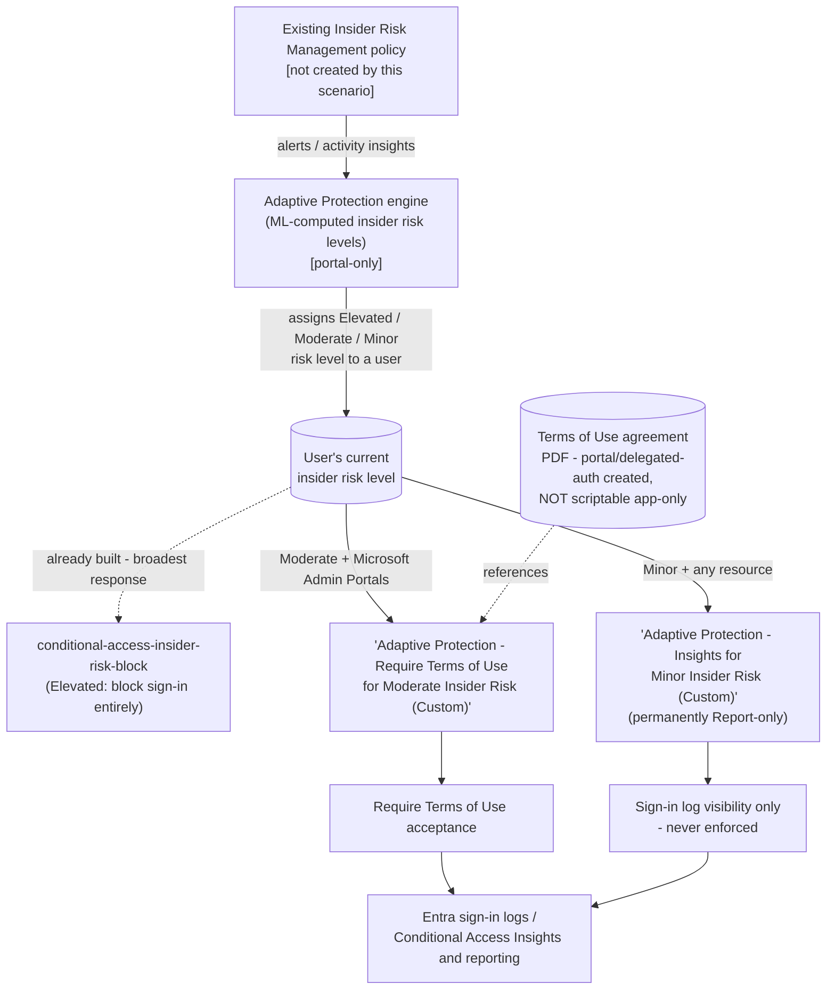

## 1. Scenario summary

Deploys the two Microsoft Entra Conditional Access policies Microsoft's own **Adaptive Protection
configuration guide** documents for **Moderate** and **Minor** insider risk levels: a **Terms of
Use** acceptance requirement scoped to Microsoft Admin Portals (Moderate), and a permanently
**Report-only** visibility policy (Minor). Both read the same live insider risk level Microsoft
Purview Adaptive Protection assigns, via Conditional Access's own Insider Risk condition
(`conditions.insiderRiskLevels`) — the same condition
`scenarios/adaptive-protection/conditional-access-insider-risk-block/` uses for the **Elevated**
risk level's block policy.

**Who it's for:** any Microsoft 365 E5 (or Purview Suite) tenant with **Microsoft Entra ID P2**
that has already deployed (or is deploying via this library) the Elevated-risk block sibling
scenario and wants the full, Microsoft-documented three-tier Conditional Access response — block
(Elevated), require Terms of Use acknowledgment (Moderate), and visibility only (Minor) — instead
of leaving Moderate/Minor risk unaddressed on the identity layer. See `design.md` §3 for why this
scenario reproduces Microsoft's own documented pairing rather than a "require MFA / require
compliant device" alternative that was considered and rejected.

## 2. Business/regulatory driver

Same underlying gap the Elevated sibling's `README.md` §2 describes — detection (Insider Risk
Management) and enforcement have historically required a human to notice and manually act — but
extended to the two lower risk tiers with a **graduated**, not all-or-nothing, response:

- **Proportionate response matching Microsoft's own reference architecture.** A board or auditor
  reviewing this control can cross-check it directly against Microsoft's own published
  Elevated/Moderate/Minor Conditional Access guidance, rather than a bespoke scheme this library
  invented.
- **Early behavioral nudge before risk escalates.** Requiring Terms of Use acknowledgment at
  Moderate risk reminds a user of their security/privacy commitments at the point of admin-portal
  access — before they reach Elevated risk and lose access entirely — without materially disrupting
  productivity.
- **Visibility into Minor-risk activity without alert fatigue.** The Minor policy generates
  Conditional Access sign-in log/Insights data for the lowest-confidence risk tier without
  prompting or restricting the user at all — useful trend data for the quarterly review this
  scenario's `README.md` §8 and the Elevated sibling's own review cadence already establish.
- **SOC 2 / ISO 27001 control-automation and "least disruptive control" expectations.** A graduated
  response is easier to defend to a CISO/board than "block everyone at every risk level" — see §8
  CISO note.

## 3. Prerequisites

Full licensing detail and citations: `docs/licensing-matrix.md` §8 (Entra ID P2 — this scenario
reuses the Elevated sibling's own P2 requirement; the Terms of Use *feature itself* additionally
requires only Entra ID **P1**, already covered by a P2 tenant — see §10 below). RBAC detail:
`docs/rbac-model.md` §10 (Microsoft Entra Conditional Access). Summary:

| Requirement | Minimum | Notes |
|---|---|---|
| Adaptive Protection (feeder risk signal) | **Microsoft 365 E5**, **Purview Suite**, or the underlying IRM add-on | Same as both siblings |
| **Microsoft Entra ID P2** | Standalone, or bundled in **Microsoft 365 E5** / **Microsoft 365 E5 Security** | Required for the Conditional Access Insider Risk *condition* itself, used by both policies this scenario deploys — same requirement as the Elevated sibling, not a new tier |
| Microsoft Entra ID P1 (Terms of Use feature) | Bundled in Entra ID P2 | Confirmed on Microsoft's own Terms of Use prerequisites page [[3]](#references) — already satisfied by the P2 requirement above; called out separately only because a buyer evaluating just the Moderate policy in isolation should know the *feature's own* floor, not just this scenario's overall floor |
| **A Terms of Use agreement object, already created** | PDF document uploaded via portal, or a one-time delegated-auth Graph call | **Not created by this scenario's scripts** — Microsoft's own `Create agreement` Graph API is delegated-permission-only (`Agreement.ReadWrite.All`, work-or-school account); app-only certificate automation cannot call it [[9]](#references). See §5 Step 4 and §11. |
| Role to configure Adaptive Protection settings/insider risk levels | **Insider Risk Management** or **Insider Risk Management Admins** role group (Purview) | Same as both siblings |
| Role to create/manage these Conditional Access policies | **Conditional Access Administrator** (Microsoft Entra role) | Same role as the Elevated sibling — `docs/rbac-model.md` §10 |
| Role to create the Terms of Use agreement | **Conditional Access Administrator** or **Security Administrator** (least-privileged for agreement creation) [[9]](#references) | A delegated (interactive sign-in) operation — see §11 |
| Automation identity for the deploy script | Microsoft Graph app-only certificate authentication, `Policy.ReadWrite.ConditionalAccess` + `Policy.Read.All` application permissions | Same permissions and pattern as the Elevated sibling — covers policy create/update; does **not** cover agreement creation (see row above) |
| Feeder Insider Risk Management policy | Already deployed and generating alerts/insights | Not created by this scenario |
| Adaptive Protection enabled, with insider risk levels defined | Portal-only | Same portal-only prerequisite as both siblings |
| Emergency-access (break-glass) account(s) or group | Excluded from both policies before enforcement | §5 Step 5 below |

> Verify current entitlement names against `docs/licensing-matrix.md` and the Product Terms
> before a sales commitment — SKU names change.

## 4. Architecture



Full rule-by-rule rationale, including why this design was chosen over the naive "require MFA"
alternative, is in `design.md` §2–8.

## 5. Step-by-step implementation

### Step 1 — Confirm (or deploy) a feeder Insider Risk Management policy

Same as both siblings — use `scenarios/insider-risk/departing-employee-data-theft/`, or
Microsoft's built-in **Data leaks** template.

### Step 2 — Assign permissions

Same Purview role-group and **Conditional Access Administrator** assignment as the Elevated
sibling (`README.md` §5 Step 2 there).

### Step 3 — Confirm insider risk levels and Adaptive Protection are enabled (portal, not scriptable)

Identical to both siblings — configure once tenant-wide, not per scenario.

### Step 4 — Create the Terms of Use agreement (portal, or one-time delegated-auth — not this scenario's app-only script)

This is the one step this scenario's automation genuinely cannot perform end-to-end (§11) — create
it once, manually or via a separate interactive session:

1. Prepare a PDF document stating the security/privacy commitments you want Moderate-risk users to
   acknowledge.
2. **Entra admin center** → **Conditional Access** → **Terms of use** → **New terms**. Upload the
   PDF, set a display name and default language, and for **Enforce with Conditional Access policy
   templates**, select **Custom policy** so no policy is auto-created — this scenario's own script
   creates the policy in the next step [[3]](#references).
3. Note the agreement's `Id` (find it later with
   `Get-MgIdentityGovernanceTermsOfUseAgreement | Select-Object DisplayName, Id` if needed).

### Step 5 — Identify and exclude break-glass/emergency-access accounts

Same as both siblings — note object ID(s)/group ID(s) for Step 6.

### Step 6 — Deploy both policies (scripted, dry-run capable)

```powershell
Connect-MgGraph -ClientId $AppId -TenantId $TenantId -CertificateThumbprint $Thumbprint

# Dry run - shows exactly what would be created, changes nothing
./deploy/New-InsiderRiskStepUpPolicies.ps1 -AgreementId $AgreementId -ExcludeGroupIds $EmergencyAccessGroupId -WhatIf

# Deploy both in their default posture: Moderate in Report-only, Minor permanently Report-only
./deploy/New-InsiderRiskStepUpPolicies.ps1 -AgreementId $AgreementId -ExcludeGroupIds $EmergencyAccessGroupId
```

No agreement created yet? Deploy only the Minor policy this run:

```powershell
./deploy/New-InsiderRiskStepUpPolicies.ps1 -SkipModeratePolicy -ExcludeGroupIds $EmergencyAccessGroupId
```

### Step 7 — Pilot, then promote the Moderate policy

Same baseline-cycle and pilot-review recommendation as both siblings. Review **Entra admin
center** → **Conditional Access** → **Insights and reporting** for both policies before promoting.
**The Minor policy is never promoted** — there is no `-Mode Enabled` option for it (§6, §11).
Once satisfied with the Moderate policy's Report-only results:

```powershell
./deploy/New-InsiderRiskStepUpPolicies.ps1 -AgreementId $AgreementId -ExcludeGroupIds $EmergencyAccessGroupId -ModerateMode Enabled -Force
```

### Step 8 — Validate

```powershell
./validate/Test-InsiderRiskStepUpPolicies.ps1 -ExpectedAgreementId $AgreementId -ExpectedModerateState enabled
```

## 6. Configuration reference

| Setting | Moderate policy | Minor policy |
|---|---|---|
| Policy name | `Adaptive Protection - Require Terms of Use for Moderate Insider Risk (Custom)` | `Adaptive Protection - Insights for Minor Insider Risk (Custom)` |
| Target resources | `includeApplications = ['MicrosoftAdminPortals']` — matches Microsoft's own worked example exactly [[3]](#references) | `includeApplications = ['All']` — broad visibility, matching the intent of Microsoft's referenced Insights and reporting workbook [[1]](#references) |
| Users | `includeUsers = ['All']` minus `-ExcludeUserIds`/`-ExcludeGroupIds` | Same |
| Insider Risk condition | `insiderRiskLevels = ['moderate']` (default; configurable via `-ModerateRiskLevels`) | `insiderRiskLevels = ['minor']` (default; configurable via `-MinorRiskLevels`) |
| Grant control | `grantControls.termsOfUse = [<AgreementId>]`, `operator = 'OR'` — matches Microsoft's documented "select the terms of use" grant choice [[3]](#references) | `grantControls.builtInControls = ['mfa']`, `operator = 'OR'` — **a disclosed payload-shape choice, not a Microsoft recommendation**; Microsoft names no control for Minor risk. Deliberately `mfa`, not the Elevated sibling's `block`, for its fail-safe profile if this policy's state is ever changed outside this scenario's scripts (`design.md` §6). Never evaluated in an enforcing state — see next row. |
| Initial / achievable policy states | `-ModerateMode`: `ReportOnly` (default), `Enabled`, or `Disabled` | `-MinorMode`: `ReportOnly` (default) or `Disabled` **only** — `Enabled` is not a valid value; there is no enforcement path for this policy by design |
| Break-glass exclusion | Not enabled by default — supply via `-ExcludeUserIds`/`-ExcludeGroupIds` | Same, shared across both policies |
| Agreement creation | **Out of scope for this script** — pass an existing agreement's `-AgreementId` | N/A |

## 7. Validation / how to prove it works

1. **Automated checks** — `./validate/Test-InsiderRiskStepUpPolicies.ps1` confirms both policies
   exist with correct state, `insiderRiskLevels` condition, target-resources/users scope, and
   grant control — including a hard `FAIL` if the Minor policy is ever found in an `enabled` state
   (which this scenario's own scripts cannot produce, but a manual portal edit could).
2. **Manual checklist** — the same script prints a checklist for everything with no API to query:
   Adaptive Protection enablement, whether the referenced Terms of Use agreement actually exists,
   and functional sign-in testing.
3. **Report-only evidence before enforcement** — **Entra admin center** → **Conditional Access**
   → **Insights and reporting**, filtered to the Moderate policy, shows which sign-ins *would*
   have been prompted for Terms of Use. Confirm this before promoting to `-ModerateMode Enabled`.
4. **Terms of Use acceptance tracking** — **Entra admin center** → **Conditional Access** →
   **Terms of use** → select the agreement → **View acceptance status**, or Microsoft Graph's
   `agreementAcceptance` resource [[10]](#references) — this scenario's scripts do not read or
   export acceptance records; use Microsoft's native reporting.
5. **End-to-end functional test (non-production accounts only)** — in a pilot tenant: assign a
   test account a confirmed Moderate insider risk level, then sign in to a Microsoft Admin Portal
   (e.g. `entra.microsoft.com`). Confirm the expected outcome: a report-only log entry (before
   enforcement) or an actual Terms of Use prompt (after). Wait the full 36-hour propagation window
   (§11) before concluding a test failed.

## 8. Operations & tuning

**KPIs to watch (first 90 days):** the same Adaptive Protection dashboard KPIs the Elevated
sibling's `README.md` §8 documents apply here too — review all three Conditional Access policies'
(Elevated block, Moderate Terms of Use, Minor insights) outcomes together, since they share the
same upstream risk signal. Additionally for this scenario:

- **Terms of Use acceptance rate and time-to-accept** for the Moderate policy — a consistently low
  acceptance rate or long delay may indicate the prompt is being ignored/dismissed without being
  read, or that the population in scope is broader than intended.
- **Minor-risk sign-in volume trend** from the Minor policy's Report-only evaluation data — a
  leading indicator worth reviewing alongside (not instead of) the feeder IRM policy's own alert
  trend.

**Tuning:** as with both siblings, tune the *insider risk level conditions* in Adaptive Protection
settings if too many/few users receive a level — not these policies, which should stay matched to
Microsoft's own documented reference configuration unless there's a specific, documented reason to
diverge (design.md §3 documents how to substitute a different Moderate grant control if a buyer
prefers one).

**Incident-response runbook (Moderate Terms of Use prompt event):**
1. **Triage** — the prompted user sees the Terms of Use dialog on next admin-portal sign-in; the
   sign-in appears in **Entra sign-in logs**, flagged with this policy's name. No separate
   Purview-side alert exists for this specific event — cross-reference by user and timestamp
   against the feeder IRM policy's own alert, same manual-correlation caveat both siblings
   document.
2. **Classify and resolve** — identical logic to both siblings: if the underlying IRM alert is a
   false positive, resolving/dismissing it resets the user's risk level, which stops this policy
   matching them on the next sign-in evaluation — no manual Conditional Access exception needed.
3. **A user who reports being unable to complete admin-portal sign-in** — check whether they
   declined the Terms of Use prompt rather than accepting it (§11); a decline is not satisfied and
   sign-in does not complete, the same as any other unmet Conditional Access grant control. Re-
   attempting sign-in and accepting resolves it; this is expected behavior, not an outage.

**Minor policy requires no runbook** — it never prompts or blocks anyone; its only output is
Insights/reporting trend data, reviewed on the same quarterly cadence as everything else in this
scenario family.

**Review cadence:** quarterly, alongside both siblings and the feeder IRM policy, using the same
KPIs plus the two additions above.

## 9. Rollback / decommission

See `rollback.md` for the full staged procedure. Quick reference:
`./deploy/Remove-InsiderRiskStepUpPolicies.ps1` disables both policies by default (reversible in
seconds); `-Policy Moderate` / `-Policy Minor` targets one; `-ReportOnly` steps back to reporting
only; `-Purge` permanently deletes. None of these actions delete the Terms of Use agreement object,
disable Adaptive Protection, the feeder IRM policy, or reset any user's current insider risk
level.

## 10. Cost & licensing notes

- **No new incremental license requirement versus the Elevated sibling.** This scenario's
  Conditional Access Insider Risk condition needs the same **Microsoft Entra ID P2** the Elevated
  sibling already requires (`docs/licensing-matrix.md` §8) — deploying this scenario alongside the
  Elevated sibling does not add a licensing tier.
- **The Terms of Use feature itself requires only Entra ID P1** [[3]](#references) — a strictly
  *lower* floor than the P2 already required for the underlying Insider Risk condition, so a
  tenant licensed for the Elevated sibling is already covered; called out for a buyer evaluating
  the Moderate policy in isolation, without the Elevated sibling.
- **No incremental cost beyond the existing P2 requirement** for a tenant already at E5/Suite —
  same reasoning as the Elevated sibling's own §10.
- **No PAYG component.** Conditional Access evaluation and Terms of Use attestation are per-user-
  entitlement features, not consumption-billed.
- **Sizing note:** same population-sizing caution as the Elevated sibling (`docs/licensing-matrix.md`
  §8) — every user in scope of either policy needs Entra ID P2, not just the population that
  actually reaches Moderate/Minor risk.
- **No additional infrastructure cost.** The deploy/validate scripts are one-time or infrequent;
  the one manual step (Terms of Use agreement creation) is also one-time per agreement version.

## 11. Known limitations & gotchas

- **This scenario's scripts cannot create the Terms of Use agreement object.** Microsoft's own
  `Create agreement` Graph reference documents delegated permissions only —
  **"Application: Not supported"** [[9]](#references). This library's standard app-only
  certificate automation pattern (`docs/automation-surface.md` §3), used for every other Graph
  call this scenario makes (policy create/update), cannot call this specific endpoint. Create the
  agreement once via the portal or a separate interactive delegated-auth session (§5 Step 4)
  before running the deploy script's Moderate-policy path.
- **The Minor policy's grant control is a disclosed payload-shape choice, not a Microsoft
  recommendation.** Microsoft's Adaptive Protection configuration guide names no specific control
  for Minor risk — only "a policy... in Report-Only mode" for visibility [[1]](#references). This
  scenario's script sets `grantControls.builtInControls = ['mfa']` purely as a payload container,
  deliberately **not** reusing the Elevated sibling's `['block']` shape — `mfa` fails safe (a
  second-factor prompt) rather than `block` (a tenant-wide lockout) in the unlikely event this
  policy's state is ever changed to `enabled` outside this scenario's own scripts (e.g. a manual
  portal edit; `validate/Test-InsiderRiskStepUpPolicies.ps1` hard-fails if it ever finds `block`
  here). This script structurally prevents `-MinorMode` from ever requesting `Enabled` in the
  first place — no such value exists in that parameter's `ValidateSet`. See `design.md` §6.
- **Up to 36 hours before Adaptive Protection actions apply after first enabling** — same
  propagation delay both siblings document [[7]](#references).
- **Both policies will validate and deploy successfully even if Adaptive Protection is never
  turned on** — `insiderRiskLevels` simply never matches any user until Adaptive Protection is
  enabled and a risk level is defined. The manual checklist in
  `validate/Test-InsiderRiskStepUpPolicies.ps1` exists to catch this.
- **Policy identity is by exact `displayName`, not a fixed GUID** — same limitation as the
  Elevated sibling; renaming either policy in the portal breaks this script's idempotency
  detection for that policy.
- **This scenario does not script Microsoft's additional documented "exclude guests/external
  users" nested Users condition**, the same deferred item the Elevated sibling's `README.md` §11
  already tracks (shared `PROGRESS.md` follow-up, not duplicated here).
- **A Conditional Access policy's own change-propagation delay (~15–30 minutes) is separate from
  Adaptive Protection's 36-hour risk-level delay** — same distinction the Elevated sibling's
  `reviews.md` (Blue Team finding) already documents; applies identically here.
- **Legacy authentication protocols may not fully honor either policy's Insider Risk condition** —
  same documented Conditional Access blind spot the Elevated sibling's `README.md` §11 already
  flags; not re-solved by this scenario.
- **Terms of Use acceptance is per-agreement-version, not permanent.** A "major version" update to
  the agreement (per Microsoft's own `New-MgIdentityGovernanceTermsOfUseAgreementFile` schema
  [[9]](#references)) invalidates prior acceptances for that language, re-prompting users on next
  sign-in — expected behavior, not a bug in this scenario's policy, but worth knowing before
  updating the underlying PDF.
- **The Moderate policy only ever evaluates sign-ins to Microsoft Admin Portals** — matching
  Microsoft's own documented scope exactly (§6), but worth stating plainly: for a Moderate-risk
  user who is not an administrator and never signs in to an admin portal, this policy may **never
  trigger at all**. It is not a general "step up authentication for any Moderate-risk activity"
  control — unlike the rejected "require MFA / require compliant device on all resources" idea
  (`design.md` §3), which would have covered every sign-in. If your Moderate-risk population is
  predominantly non-admin users, this policy alone provides little practical coverage for them —
  consider it a complement to, not a substitute for, the DLP sibling's own Moderate/Minor audit
  rule (`dynamic-risk-dlp-enforcement`), which does inspect regular content-sharing activity.
- **Terms of Use is a notice/evidentiary control, not a technical barrier.** Accepting it is a
  single click that does not verify comprehension and does not prevent any actual data-handling
  action — a determined insider loses nothing by clicking through it. Its value is in documented
  notice (useful for HR/Legal and audit evidence — see §8 CISO framing in `reviews.md`) and mild
  behavioral friction, not technical risk reduction. Do not present this policy to a buyer as
  equivalent in strength to the Elevated sibling's block or the DLP sibling's audit/restrict
  actions.
- **An already-issued sign-in session to a Microsoft Admin Portal is not necessarily re-prompted
  the instant a user becomes Moderate-risk**, for the same Continuous Access Evaluation (CAE)
  /token-lifetime reason the Elevated sibling's `reviews.md` (Red Team finding) documents — a
  session already signed in before the risk-level change can remain valid until natural token
  expiry (commonly up to an hour) without CAE. A materially smaller exposure window than the
  Elevated sibling's block bypass (this control never denies access outright, only defers a
  one-time prompt), but a real, disclosed gap, not a flaw unique to this policy.
- **What happens if a user declines the Terms of Use prompt is not separately re-confirmed in this
  build** beyond Microsoft's general documented behavior (the sign-in does not complete until the
  grant control is satisfied) — treat a decline as equivalent to not completing sign-in, and route
  it to the same help-desk runbook as any other Conditional Access grant-control failure (§8).
- **VERIFY (pilot tenant, before production reliance):** whether Entra sign-in logs distinguish a
  "Terms of Use declined" outcome from a "Terms of Use pending/not yet presented" outcome for this
  policy specifically — not independently confirmed during this build; relevant for the help-desk
  runbook in §8 when triaging a user who reports being unable to complete sign-in.
- **VERIFY (pilot tenant, before production reliance):** whether a user who has already accepted
  the current Terms of Use version and is later re-evaluated by this same policy is re-prompted on
  every sign-in or only once per acceptance — not independently confirmed during this build;
  Microsoft's own Terms of Use documentation describes acceptance tracking but not the exact
  re-prompt cadence against a Conditional Access policy re-evaluation.

## 12. References

1. Adaptive Protection configuration guide (the Elevated/Moderate/Minor Conditional Access pairing
   this scenario automates for Moderate and Minor) — <https://learn.microsoft.com/purview/insider-risk-management-adaptive-protection-guide>
2. Block access for users with insider risk (the Elevated sibling's own procedure, referenced for
   contrast) — <https://learn.microsoft.com/entra/identity/conditional-access/policy-risk-based-insider-block>
3. Require terms of use to be accepted before accessing Microsoft Admin Portals (the exact
   portal procedure this scenario's Moderate policy automates, including the P1 license
   prerequisite and agreement-creation steps) — <https://learn.microsoft.com/entra/identity/conditional-access/require-tou>
4. Set up Microsoft Entra terms of use with Conditional Access (general Terms of Use feature
   reference, P1 licensing, PDF-document prerequisite, 40-terms-per-tenant service limit) — <https://learn.microsoft.com/entra/identity/conditional-access/terms-of-use>
5. conditionalAccessConditionSet resource type (`insiderRiskLevels` property, Graph v1.0) — <https://learn.microsoft.com/graph/api/resources/conditionalaccessconditionset>
6. conditionalAccessGrantControls resource type (`termsOfUse`, `builtInControls`, `operator`
   properties) — <https://learn.microsoft.com/graph/api/resources/conditionalaccessgrantcontrols>
7. Help dynamically mitigate risks with Adaptive Protection (36-hour propagation delay) — <https://learn.microsoft.com/purview/insider-risk-management-adaptive-protection>
8. conditionalAccessApplications resource type (`MicrosoftAdminPortals`/`All` special
   includeApplications values) — <https://learn.microsoft.com/graph/api/resources/conditionalaccessapplications>
9. Create agreement (delegated-permission-only — "Application: Not supported" — the grounding for
   this scenario's central automation-gap disclosure) — <https://learn.microsoft.com/graph/api/termsofusecontainer-post-agreements>
10. agreement / agreementAcceptance resource types (Microsoft Entra ID Governance Terms of Use) — <https://learn.microsoft.com/graph/api/resources/agreement>
11. Create / Update conditionalAccessPolicy (least-privileged permission
    `Policy.ReadWrite.ConditionalAccess` + `Policy.Read.All`) — <https://learn.microsoft.com/graph/api/conditionalaccessroot-post-policies>, <https://learn.microsoft.com/graph/api/conditionalaccesspolicy-update>
12. Conditional Access Target resources: Microsoft Admin Portals (the four app IDs the grouping
    expands to) — <https://learn.microsoft.com/entra/identity/conditional-access/concept-conditional-access-cloud-apps#microsoft-admin-portals>
13. `docs/licensing-matrix.md` §8 — Entra ID P2 (Conditional Access risk-based conditions),
    updated in this build to reference both Conditional Access scenarios.
14. `docs/rbac-model.md` §10 — Microsoft Entra Conditional Access.
15. `scenarios/adaptive-protection/conditional-access-insider-risk-block/` — the Elevated sibling
    scenario this fragment complements.
16. `scenarios/adaptive-protection/dynamic-risk-dlp-enforcement/` — the DLP sibling scenario; see
    `design.md` §8 for how its own Moderate/Minor audit treatment differs from this scenario's.

> Re-verify all links, API behavior, and licensing terms against current Microsoft Learn before a
> customer-facing assessment or sale — Adaptive Protection and its Conditional Access integration
> are comparatively new capabilities that change faster than most in the Purview portfolio.
