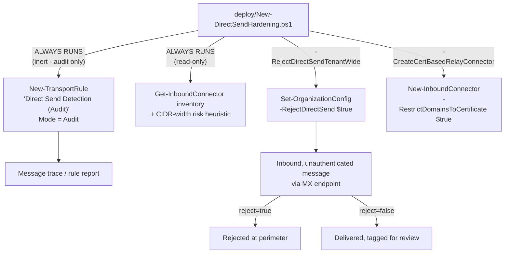

## 1. Problem statement

`scenarios/adaptive-protection/exchange-legacy-auth-block/reviews.md` (Red Team, finding 3) names a
gap that scenario's own `design.md` §8 (Residual risk) discloses but does not close: "This scenario's
SMTP AUTH block pushes a determined attacker/legacy integration toward Direct Send (anonymous relay)
instead, a materially different, unauthenticated abuse surface this scenario does not touch." That
scenario's own Non-goals (§8) name it explicitly and defer it: "This scenario does not script Direct
Send / unauthenticated relay controls." This scenario builds that control as its own standalone
fragment, per `AGENTS.md` §6, and is tracked in `PROGRESS.md` under the follow-ups discovered while
building the Exchange-side legacy authentication block scenario.

## 2. Scope: two related but distinct abuse surfaces

This build's grounding pass confirmed Direct Send and anonymous-relay-via-connector are **not the
same mechanism**, and conflating them would misrepresent the control:

| Surface | Mechanism | Authentication | Scope this scenario covers |
|---|---|---|---|
| **Direct Send** | Unauthenticated SMTP directly to the tenant's MX endpoint (`<domain>-com.mail.protection.outlook.com`), port 25 [[1]](#references) | None, no credential, certificate, or IP allowlist required | Detection (audit rule), tenant-wide reject gate (`RejectDirectSend`) |
| **IP-based relay connector** | An `InboundConnector` with `-RestrictDomainsToIPAddresses $true`, authenticated by source IP address alone [[2]](#references) | Weak if the IP range is broad/shared; Microsoft requires "a static IP address that isn't shared with another organization" [[2]](#references) | Inventory/audit (risk heuristic), migration path to certificate-based |

Both surfaces let a sender relay/send mail through Exchange Online without presenting a credential
in the SMTP-AUTH sense, that shared characteristic ("unauthenticated by the strongest available
definition") is why they're covered in one fragment rather than two, per `AGENTS.md` §6's "or one
clearly-scoped sub-task" allowance. They remain independently controllable (Direct Send has no
connector object at all; the enforcement gate and the connector audit act on entirely separate
Exchange Online objects).

## 3. Design goals

1. **Audit before enforce, the same discipline `exchange-legacy-auth-block` established.** Direct
   Send has no native "who is using this" report (this build's grounding pass found an "SMTP AUTH
   Clients" report in the new EAC [[9]](#references) but no equivalent for Direct Send), a Microsoft
   Q&A accepted answer's own recommended workaround is "a transport rule in audit mode" to see what
   it picks up before disabling [[10]](#references), which this scenario builds as a first-class,
   reusable deploy stage rather than a one-off manual step.
2. **Never invent a Direct Send usage report that doesn't exist.** This scenario's audit rule (Mode
   `Audit`) plus message trace/the rule's own report is the honest substitute, disclosed as such
   rather than presented as a purpose-built Microsoft reporting feature.
3. **Treat the connector audit as a heuristic, not a verdict.** No Microsoft-published "this CIDR
   width is unsafe" threshold was found during this build's grounding pass, the `/24` default is
   this scenario's own disclosed judgment call (§5), never presented as a Microsoft recommendation.
4. **Provide a real, governed exception path** (certificate-based relay), not a binary
   "Direct Send on or off" toggle, the same reasoning `exchange-legacy-auth-block/design.md` §2
   applied to SMTP AUTH exceptions.
5. **Keep this fragment scoped to Direct Send + connector-IP-authentication risk.** Internal-sender
   spoofing via an *already-authenticated* path (a compromised mailbox, a legitimately SPF/DKIM-
   passing third party) is Defender for Office 365 anti-phishing/anti-spoofing territory, a
   different, already-covered Microsoft capability this scenario does not reinvent (`README.md` §11,
   Non-goal below).

## 4. Why an audit-mode transport rule, not a report

Transport rules support a first-class `-Mode` parameter with three documented values: `Audit`,
`AuditAndNotify`, `Enforce` [[6]](#references), `Audit` evaluates the rule's conditions and applies
its actions (here, tagging a header) without any blocking side effect. Combined with
`-HeaderContainsMessageHeader`/`-HeaderContainsWords` matching on
`X-MS-Exchange-Organization-AuthAs: Anonymous`, a header Microsoft's own header-firewall reference
documents as always present once a message's authentication has been evaluated, with `Anonymous` as
one of exactly four possible values (`Anonymous`, `Internal`, `External`, `Partner`)
[[7]](#references), this reconstructs the practical effect of a "Direct Send usage report" from
already-documented primitives, rather than waiting for (or inventing) a purpose-built one.

**The header cannot be forged by an external sender.** Microsoft's header-firewall reference
confirms organization X-headers (`X-MS-Exchange-Organization-*`) on an inbound message from outside
the organization are stripped before the Transport service evaluates and re-inserts its own
`AuthAs` value based on its own authentication assessment [[7]](#references), an external attacker
cannot pre-set `AuthAs: Internal` on a crafted message to evade this scenario's detection rule.

`-SentToScope InOrganization` [[6]](#references) scopes the rule to internal recipients specifically,
matching Direct Send's own confirmed internal-only delivery scope ("Sends email to Microsoft 365 or
Office 365 recipients only. Mail sent to recipients outside your cloud-based organization is
rejected" [[1]](#references)), a message with `AuthAs: Anonymous` sent to an internal recipient via
the tenant's own MX endpoint is Direct Send traffic by definition; the same header value on a message
addressed elsewhere (or arriving via a different, already-authenticated connector) is not what this
rule is built to isolate.

## 5. The connector risk heuristic (disclosed, not authoritative)

Microsoft's own SMTP relay documentation states an IP-based connector requires "a static IP address
that isn't shared with another organization" [[2]](#references) but does not publish a specific CIDR
width beyond which a range should be considered unsafe. This scenario's `-MaxIpRangeCidrBits`
parameter (default `/24`, 256 addresses) is a judgment call, not a Microsoft-sourced number: a range
that size is wide enough to plausibly span a shared cloud egress pool or a misconfigured "just in
case" allowance, while still being narrow enough that a legitimately single-purpose on-premises relay
server rarely needs it. `README.md` §11 and the deploy/validate scripts' own output disclose this
explicitly, every flagged connector is a WARN prompting review, never an automatic FAIL or an
automatic remediation.

## 6. Architecture

## 7. Key decisions

| Decision | Choice | Rationale |
|---|---|---|
| Detection mechanism | Audit-mode transport rule on `AuthAs: Anonymous` + `SentToScope InOrganization` | §4, reconstructs the practical effect of a Direct Send usage report from documented, non-speculative primitives. |
| Connector risk threshold | Disclosed `/24` heuristic, parameterized (`-MaxIpRangeCidrBits`) | §5, no Microsoft-published threshold exists; a parameterized, disclosed default beats a hard-coded, unexplainable one. |
| Enforcement mechanism | `Set-OrganizationConfig -RejectDirectSend $true` | Confirmed, documented, current parameter [[3]](#references), the tenant-wide gate, not a per-message transport rule block (which would duplicate/conflict with a platform-level control Microsoft already provides). |
| Exception mechanism | Certificate-based `InboundConnector` (`-RestrictDomainsToCertificate`) | Microsoft's own documented, stronger alternative to both Direct Send and IP-based relay, doesn't require a static, unshared IP [[2]](#references), closing the connector-audit gap for migrated senders at the same time. |
| Scope boundary | Direct Send + connector-IP-authentication risk only; excludes already-authenticated-path spoofing | §3 goal 5, Defender for Office 365 anti-phishing/anti-spoofing already covers that surface; duplicating it here would violate the Microsoft Product Owner lens's "no reinventing a native capability" standard. |
| Deployment path | Direct Exchange Online PowerShell (`New-/Get-TransportRule`, `New-/Get-InboundConnector`, `Set-/Get-OrganizationConfig`) | Automation surface 1 per `docs/automation-surface.md` §1, the only surface these cmdlets exist on. |

## 8. Non-goals

- **This scenario does not detect or block spoofing that arrives via an already-authenticated path**
  (a compromised mailbox, a legitimately SPF/DKIM-passing third party sending "on behalf of" a
  domain), Defender for Office 365 anti-phishing/anti-spoofing (composite authentication, spoof
  intelligence) already covers this [[8]](#references); this scenario would duplicate, not add to,
  that native capability if it tried.
- **This scenario does not build a Direct Send usage report UI or dashboard**, the audit-mode
  transport rule plus message trace is the substitute; a dashboard is out of scope for this
  fragment's deploy/validate/rollback core per `AGENTS.md` §6.
- **This scenario does not migrate a device/app's own configuration to use the certificate-based
  relay connector once created**, provisioning and installing a client certificate on a scanner or
  LOB app is device/app-specific integration work outside this scenario's scope, the same boundary
  `exchange-legacy-auth-block/README.md` §8 draws for OAuth migration.
- **This scenario does not touch `exchange-legacy-auth-block`'s or `block-legacy-authentication`'s
  own policy objects**, fully independent, complementary controls covering different abuse
  surfaces (authenticated legacy protocols vs. unauthenticated Direct Send/relay).
- **This scenario does not attempt to enumerate or harden on-premises Exchange anonymous relay
  connectors** (`Allow anonymous relay on Exchange servers` [[11]](#references)), that's a hybrid/
  on-premises-only surface with its own separate administration model, out of scope for this
  Exchange Online-only fragment.

## 9. Residual risk

- **The `RejectDirectSend` parameter's exact default/rollout-wave behavior is not independently
  confirmed** (`README.md` §11), this scenario's Step 6 functional test is the mitigation until a
  pilot-tenant or fuller Microsoft Learn pass resolves it.
- **A device/app migrated to certificate-based relay is not automatically narrower in scope than
  Direct Send was**, Microsoft's own comparison table shows SMTP relay can reach external
  recipients [[1]](#references), a materially larger capability than Direct Send's internal-only
  scope. An operator who migrates a sender without also narrowing `-RelaySenderDomains` and the
  connector's accepted-domain association could inadvertently grant more reach than the original
  Direct Send use case needed.
- **The connector risk heuristic can both over- and under-flag.** A narrow, unshared `/28` on a
  compromised or leaked source is still exploitable; a wide `/16` on an isolated, single-tenant
  private network segment may be genuinely low-risk. §5's disclosure stands: every WARN is a
  prompt for human review, not a verdict.
- **This scenario does not detect a *future* admin reverting `RejectDirectSend` or widening a
  connector's IP range**, the quarterly review cadence (`README.md` §8) is the only mitigation,
  the same point-in-time-check limitation this library's other tenant-config scenarios disclose.
