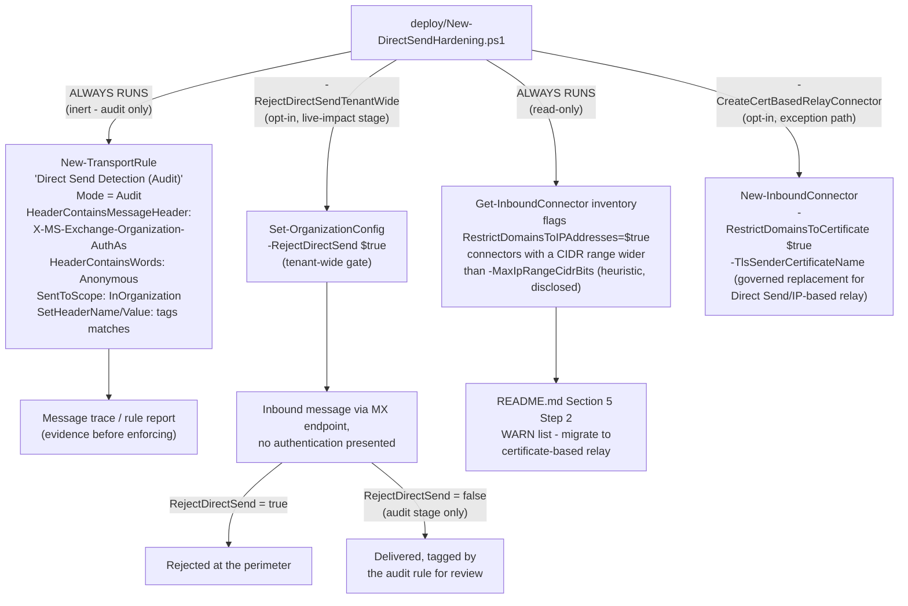

## 1. Scenario summary

Closes a bypass path this library's own `scenarios/adaptive-protection/exchange-legacy-auth-block/`
Red Team review named explicitly (`reviews.md` finding 3 there): blocking authenticated legacy
protocols (SMTP AUTH) does nothing to stop **Direct Send**, Exchange Online's unauthenticated,
internal-recipients-only SMTP path, or a mail flow connector that accepts **anonymous relay** from
an IP range that is broader than it needs to be. This scenario deploys an audit-first detection rule
for Direct Send traffic, an inbound connector risk audit, the tenant-wide `RejectDirectSend`
enforcement gate, and a governed, certificate-based relay exception path for devices/apps that
still need to send mail without authenticating.

**Who it's for:** any Exchange Online tenant that has deployed (or is evaluating)
`exchange-legacy-auth-block`, `block-legacy-authentication`, or any DLP/insider-risk exfiltration
control that assumes outbound authenticated channels are the only channels, Direct Send and
anonymous relay are **inbound-looking, unauthenticated** paths that those controls don't touch, and
that an attacker who has learned a tenant's accepted domain and MX endpoint can use to spoof
internal senders without ever presenting a credential.

## 2. Business/regulatory driver

- **Direct Send is unauthenticated by design, and Microsoft's own guidance says most tenants don't
 need it.** "If your device or application can act as an email server, no Microsoft 365 or Office
 365 settings are required... We recommend Direct Send only for advanced customers willing to take
 on the responsibilities of email server admins". No credential, certificate, or
 IP allowlist is required to use it, only knowledge of the tenant's accepted domain and its MX
 endpoint (`<domain>-com.mail.protection.outlook.com`), which is public DNS information.
- **Microsoft has itself flagged Direct Send as a default-posture risk.** The same reference page
 states: "Most customers don't need to use Direct Send. We're working on an option to disable
 Direct Send by default to protect customers", this scenario deploys the
 documented tenant-wide control (`Set-OrganizationConfig -RejectDirectSend`, §11 VERIFY on rollout
 status) rather than waiting for a Microsoft-driven default change on Microsoft's own timeline, the
 same "control the transition on your terms" posture this library's `exchange-legacy-auth-block`
 scenario took for SMTP AUTH.
- **A documented, real-world abuse pattern.** Direct Send messages sent to internal recipients with
 a spoofed internal `From` address are a known phishing/BEC technique (internal-sender spoofing), 
 the messages arrive looking like they came from a colleague, bypassing the trust signal recipients
 give to "internal" mail, and are addressed directly in Microsoft's own anti-spoofing documentation
 on intra-org spoofing detection (`compauth=fail reason=6xx`).
- **Anonymous relay connectors are a separate, complementary gap.** An `InboundConnector` configured
 with `-RestrictDomainsToIPAddresses $true` authenticates a sender purely by source IP address, 
 Microsoft's own guidance requires "a static IP address that isn't shared with another
 organization" precisely because a shared or overly broad IP range defeats the
 authentication model entirely. This scenario audits existing connectors for that exact weakness
 and recommends migrating to certificate-based authentication (`-RestrictDomainsToCertificate`),
 which Microsoft documents as not requiring a static IP at all.
- **SOC 2 / ISO 27001 / PCI DSS control-automation expectations.** "Inbound mail flow is
 authenticated, not just IP-filtered" and "the tenant does not accept unauthenticated internal-
 looking mail from the open internet" are both defensible, auditable control statements this
 scenario produces evidence for.

## 3. Prerequisites

| Requirement | Minimum | Notes |
|---|---|---|
| Exchange Online (any plan that includes it) | Exchange Online Plan 1/2, or any Microsoft 365/Office 365 plan that bundles it | `Set-OrganizationConfig`, `New-/Get-TransportRule`, and `New-/Get-InboundConnector` are all core Exchange Online administration surfaces, **no incremental license**. |
| Automation identity for the deploy script | Exchange Online app-only certificate authentication (`Connect-ExchangeOnline -AppId... -CertificateThumbprint...`), `Exchange.ManageAsApp` application permission on the **Office 365 Exchange Online** resource, plus an Exchange Online RBAC role/role group granted to the app's service principal | [Automation surface §1/§3](/docs/automation-surface/#1-five-automation-surfaces-not-one-read-this-first) (automation surface 1, Exchange Online PowerShell). |
| Role to run the deploy/validate scripts interactively, or to assign to the app's service principal for unattended use | **Organization Management** (Exchange Online role group), confirmed sufficient by the `exchange-legacy-auth-block` sibling scenario for the same class of tenant-wide `Set-OrganizationConfig`/mail-flow-object cmdlets | [RBAC model §6](/docs/rbac-model/#6-exchange-online-dependency-the-most-common-permissions-gap). Narrower least-privilege roles not independently confirmed, see §11. |
| Verified accepted domain(s) and MX record pointed at Microsoft 365 | At least one [accepted domain](https://learn.microsoft.com/exchange/mail-flow-best-practices/manage-accepted-domains/manage-accepted-domains) with a healthy MX record | Required for Direct Send to function at all, also required context for interpreting this scenario's detection rule and connector audit correctly. |
| Inventory of any device/app currently depending on Direct Send or an existing IP-based relay connector | List of scanners, multifunction devices, or line-of-business apps that send mail without authenticating | §5 Step 2 below. Enforcing `RejectDirectSend` tenant-wide without this step is this scenario's single highest-risk operational mistake, see §8. |

> Verify current entitlement names against [Licensing matrix §4](/docs/licensing-matrix/#4-common-cross-module-prerequisites) and the Product Terms
> before a sales commitment, SKU names change.

## 4. Architecture



Full rationale for the audit-before-enforce sequencing and the connector-risk heuristic is in
`design.md` §3-5.

## 5. Step-by-step implementation

### Step 1, Assign permissions

Add the operating administrator (or the automation app's service principal) to the **Organization
Management** Exchange Online role group, [RBAC model §6](/docs/rbac-model/#6-exchange-online-dependency-the-most-common-permissions-gap).

### Step 2, Deploy the audit-mode detection rule and connector audit (no live impact)

```powershell
Connect-ExchangeOnline -AppId $AppId -CertificateThumbprint $Thumbprint -Organization $TenantDomain
./deploy/New-DirectSendHardening.ps1 -WhatIf
./deploy/New-DirectSendHardening.ps1
```

Creates (or reconciles) the `Direct Send Detection (Audit)` transport rule at `-Mode Audit`
, this **never blocks or modifies mail**, it only tags matching messages and logs
a rule match, which appears in message trace and the rule's own audit report. In the same pass, it
reads every `InboundConnector` and prints a WARN for each one configured with
`-RestrictDomainsToIPAddresses $true` whose `SenderIPAddresses` CIDR range is wider than
`-MaxIpRangeCidrBits` (default `/24`, a disclosed heuristic, not a Microsoft-published threshold,
see `design.md` §5).

Let this stage run for at least the 7-14 days Microsoft's own message trace retention comfortably
covers before moving to Step 3, this is this scenario's evidence-gathering window, the same
"inventory before enforcing" discipline `exchange-legacy-auth-block/README.md` §5 Step 2 uses for
SMTP AUTH.

### Step 3, Review the evidence

```powershell
./validate/Test-DirectSendHardening.ps1
```

Read the flagged connectors and cross-reference the audit rule's matches (Exchange admin center →
**Mail flow** → **Rules** → the rule's own report, or a message trace filtered for the
`X-DirectSendHardening-Detected` header this scenario's rule adds) against your Step 1 inventory.
Confirm every legitimate Direct Send sender and every legitimate IP-based relay connector is
accounted for before enforcing.

### Step 4, Migrate legitimate senders to a governed, certificate-based relay connector (opt-in, per sender)

```powershell
./deploy/New-DirectSendHardening.ps1 -CreateCertBasedRelayConnector `
    -RelayConnectorName 'Contoso Scan-to-Email (Certificate)' `
    -RelaySenderDomains '*.contoso.com' `
    -RelayCertificateSubjectDomain 'contoso.com' -WhatIf
./deploy/New-DirectSendHardening.ps1 -CreateCertBasedRelayConnector `
    -RelayConnectorName 'Contoso Scan-to-Email (Certificate)' `
    -RelaySenderDomains '*.contoso.com' `
    -RelayCertificateSubjectDomain 'contoso.com'
```

Creates a certificate-authenticated `InboundConnector`, 
Microsoft's own documented, stronger alternative to both Direct Send and an IP-based relay
connector, since it authenticates the sender by a TLS certificate whose Subject/SAN matches an
accepted domain rather than by source IP address, and does not require a static, unshared IP
. Run once per distinct sending application/device family that needs to keep
sending unauthenticated mail after Step 5. Each device/app must then present the matching client
certificate, device/app-specific configuration outside this script's scope (§11).

### Step 5, Enforce: reject unauthenticated Direct Send tenant-wide (live-impact stage, opt-in)

```powershell
./deploy/New-DirectSendHardening.ps1 -RejectDirectSendTenantWide -WhatIf
./deploy/New-DirectSendHardening.ps1 -RejectDirectSendTenantWide
```

Sets `Set-OrganizationConfig -RejectDirectSend $true`, Exchange Online rejects
unauthenticated messages sent via the Direct Send path tenant-wide. Devices/apps migrated in Step 4
are unaffected (they now authenticate via the certificate-based connector, a materially different
path Microsoft's own comparison table distinguishes from Direct Send). Any
device/app **not** migrated and still depending on Direct Send starts failing at this step, confirm
Step 3's review found none before proceeding.

### Step 6, Validate

```powershell
./validate/Test-DirectSendHardening.ps1 -ExpectRejectDirectSend
```

## 6. Configuration reference

| Setting | Value this scenario uses | Notes |
|---|---|---|
| Audit rule name | `Direct Send Detection (Audit)` | `-Mode Audit`, never blocks; tags matches with `X-DirectSendHardening-Detected: True`. |
| Audit rule condition | `-HeaderContainsMessageHeader 'X-MS-Exchange-Organization-AuthAs' -HeaderContainsWords 'Anonymous' -SentToScope InOrganization` | `AuthAs: Anonymous` is Microsoft's own documented header value for a message the service could not authenticate; `SentToScope InOrganization` scopes detection to internal recipients, matching Direct Send's own internal-only delivery scope. |
| Connector risk heuristic | `-RestrictDomainsToIPAddresses $true` AND CIDR prefix shorter than `-MaxIpRangeCidrBits` (default `/24`, i.e. 256+ addresses) | This scenario's own disclosed heuristic (`design.md` §5), not a Microsoft-published threshold. A `/24` allows 256 source addresses to relay as the connector's `SenderDomains`; a shared cloud-provider range at that width or wider is a real, documented risk category Microsoft's own guidance warns against generally. |
| Certificate-based relay connector | `New-InboundConnector -RestrictDomainsToCertificate $true -TlsSenderCertificateName <domain>` |, the governed exception path for Step 4. |
| Tenant-wide enforcement | `Set-OrganizationConfig -RejectDirectSend $true` |, confirmed, documented parameter; exact default/rollout-wave behavior not independently confirmed, see §11. |

## 7. Validation / how to prove it works

1. **Automated checks**, `./validate/Test-DirectSendHardening.ps1`:
 - `Get-TransportRule -Identity 'Direct Send Detection (Audit)'`, confirms the rule exists,
 `Mode -eq 'Audit'`, and its condition/action shape matches §6.
 - `Get-InboundConnector`, re-runs the connector risk heuristic and reports every WARN.
 - `-ExpectRejectDirectSend` (optional), confirms `Get-OrganizationConfig |
 Select-Object RejectDirectSend` is `$true`; FAILs if not when passed.
 - `-ExpectedRelayConnectors <names>` (optional), confirms each named certificate-based relay
 connector exists with `RestrictDomainsToCertificate -eq $true`.
2. **Manual checklist**, printed by the same script: Step 2's evidence-gathering window was
 observed before enforcing, every flagged connector in Step 3 was reviewed, and every legitimate
 Direct Send sender was migrated (Step 4) or confirmed retired before Step 5.
3. **End-to-end functional test (non-production sender only)**, before Step 5, send a test message
 via the Direct Send path (MX endpoint, port 25, no auth) to an internal test mailbox and confirm
 delivery with the audit header present; after Step 5, confirm the same attempt is rejected, and
 confirm a certificate-based relay connector's test sender still delivers successfully.

## 8. Operations & tuning

**KPIs to watch (first 90 days):** count of messages tagged by the audit rule before enforcement
(should trend toward zero as legitimate senders are migrated), count of rejected Direct Send attempts
after enforcement (`Search-UnifiedAuditLog` mail-flow/connector events or the SMTP gateway's own
logs, this scenario's config read-backs confirm state, not events, the same class of gap
`exchange-legacy-auth-block/README.md` §8 discloses for its own SMTP AUTH KPIs), and count of
connectors still flagged WARN by the risk heuristic (should shrink as relay is migrated to
certificate-based).

**Important monitoring blind spot after Step 5:** transport rules (including this scenario's audit
rule) evaluate only messages that have already been accepted into the transport pipeline. Once
`RejectDirectSend` is `$true`, a Direct Send attempt is rejected at the SMTP session itself, 
**before** the transport pipeline runs, so the audit rule stops seeing rejected attempts entirely.
Its evidence-gathering value is front-loaded into the Step 2-3 pre-enforcement window; ongoing
post-enforcement monitoring for rejection volume requires `Search-UnifiedAuditLog` mail-flow events
or the SMTP gateway's own logs, the same event-level gap named above. Don't rely on the audit rule's
match count as a post-enforcement KPI, it will read near-zero regardless of actual rejection volume.

**Tuning:** if a legitimate high-volume sender is identified after Step 5 causes a delivery failure,
migrate it to the certificate-based relay connector (Step 4) rather than reverting
`RejectDirectSend` tenant-wide, a single missed sender doesn't justify reopening the whole path.

**Incident-response runbook (a legitimate device/app is unexpectedly blocked after Step 5):**
1. **Triage**, confirm the failure is a Direct Send rejection specifically (message trace shows the
 inbound connection was rejected at the MX endpoint with no authentication presented), not an
 unrelated mail-flow or spam-filtering issue.
2. **Determine intent**, a single affected device shortly after Step 5 is expected if Step 3's
 review missed it; a burst of rejected attempts from many previously-unseen source IPs may
 indicate a spoofing/BEC campaign that has now lost its easiest path in.
3. **Remediate**, migrate the legitimate device/app to the certificate-based relay connector (Step
 4) as a tracked, named exception rather than disabling `RejectDirectSend` tenant-wide.

**Review cadence:** quarterly, re-run the connector audit (new connectors may have been added since
the last review) and confirm the audit rule's match count for internal recipients stays near zero.

## 9. Rollback / decommission

See `rollback.md` for the full staged procedure (disable tenant-wide rejection → remove the audit
rule → remove certificate-based relay connectors → full teardown). Rolling back this scenario has
**no effect** on `exchange-legacy-auth-block` or `block-legacy-authentication`, independent,
complementary controls covering different abuse surfaces (`design.md` §2).

## 10. Cost & licensing notes

- **No incremental license.** `Set-OrganizationConfig`, `New-/Get-TransportRule`, and
 `New-/Get-InboundConnector` are core Exchange Online administration surfaces, included in every
 plan that includes Exchange Online. [Licensing matrix §4](/docs/licensing-matrix/#4-common-cross-module-prerequisites).
- **No PAYG component.** These are tenant configuration objects, not consumption-billed.
- **Real, if modest, migration cost for a buyer with legitimate Direct Send senders.** Migrating a
 scanner/LOB app to certificate-based relay requires provisioning and installing a TLS certificate
 on that device, call this out explicitly in a CISO conversation (§8) rather than presenting Step
 5 as zero-friction.
- **Closes a gap a buyer's existing legacy-authentication controls do not cover**, at effectively no
 incremental cost, the CISO pitch is "the SMTP AUTH block closed one door; this closes the one
 right next to it that never needed a key in the first place."

## 11. Known limitations & gotchas

- **VERIFY (Microsoft Learn or a pilot tenant, before a customer-facing commitment):** the exact
 default value, rollout wave, and full behavioral description of `Set-OrganizationConfig
 -RejectDirectSend`, confirmed as a documented, current Boolean parameter on the
 `Set-OrganizationConfig` reference page, but that page's own parameter entry
 carries no descriptive paragraph explaining default value or edge-case behavior (for example,
 whether it also affects messages that would otherwise match a certificate-based or IP-based relay
 connector, or only messages with no connector match at all). The Direct Send overview page's own
 statement, "We're working on an option to disable Direct Send by default to protect customers"
, is consistent with this parameter being that option, but no Microsoft page
 found during this build's grounding pass names `RejectDirectSend` directly by name outside the
 cmdlet reference itself. Deploy Step 2's audit window and Step 6's functional test exist
 specifically to validate actual behavior in your tenant before relying on this description.
- **The connector risk heuristic (`-MaxIpRangeCidrBits`, default `/24`) is this scenario's own
 judgment call, not a Microsoft-published threshold.** A narrower range can still be shared or
 spoofable; a wider range flagged WARN may be entirely appropriate for a buyer's specific network
 topology. Treat every WARN as "review," not "automatically wrong."
- **This scenario does not detect or block internal-sender spoofing that arrives via an already-
 authenticated path** (a compromised mailbox sending as itself, or a message that passes SPF/DKIM
 from a genuinely authorized third-party sender). That is Defender for Office 365 anti-phishing/
 anti-spoofing territory (composite authentication, spoof intelligence, `README.md` §2
), a separate control this scenario does not duplicate or replace.
- **The audit-mode transport rule detects Direct Send traffic aimed at internal recipients only**
 (`SentToScope InOrganization`), matching Direct Send's own internal-only delivery scope
, it will not surface anonymous-relay abuse aimed at external recipients via an
 IP-based connector; the separate connector audit (§6) is this scenario's control for that surface.
- **A certificate-based relay connector (Step 4) is not itself internal-recipient-only**, unlike
 Direct Send, Microsoft's own comparison table shows SMTP relay can send to any accepted-domain
 address and, depending on configuration, external recipients. This is a
 materially different capability than what it's replacing; scope `-RelaySenderDomains` and the
 connector's accepted-domain association as narrowly as the actual sending application needs.
- **Policy identity is by exact name, not a fixed immutable ID exposed to this script's own
 parameters**, the same class of limitation this library's other named-policy scenarios disclose;
 renaming the audit rule or a relay connector in the portal breaks this script's idempotency
 detection.
- **VERIFY (pilot tenant):** the exact least-privilege Exchange Online management role scoped to
 just transport rules and inbound connectors, as distinct from the confirmed-sufficient but broad
 **Organization Management** role group this scenario's Prerequisites use.
- **Grounding note:** `techcommunity.microsoft.com` (the Exchange Team's own "What is Direct Send and
 how to secure it" blog post, referenced by name in a Microsoft Q&A accepted answer) returned a
 fetch error from this build's network environment and could not be directly reviewed, this
 scenario is grounded instead on the official Microsoft Learn Direct Send reference page
, the `Set-OrganizationConfig`/`New-InboundConnector`/`New-TransportRule` cmdlet
 references, and the anti-spoofing/composite-authentication documentation, all direct-fetched or
 returned in full by Microsoft Learn search during this build. Re-verify the blog post's content
 against a working link before a customer-facing commitment, in case it adds detail not present in
 the reference pages used here.

## 12. References

1. How to set up a multifunction device or application to send email using Microsoft 365 or Office
 365, Direct Send section (features, limitations, setup, "most customers don't need this,"
 default-disable-in-progress statement), <https://learn.microsoft.com/exchange/mail-flow-best-practices/how-to-set-up-a-multifunction-device-or-application-to-send-email-using-microsoft-365-or-office-365>
2. How to set up a multifunction device or application to send email using Microsoft 365 or Office
 365, SMTP relay section (certificate-based vs. IP-based connector, static-unshared-IP
 requirement), same URL as [1], `#smtp-relay-configure-a-connector-to-relay-email-from-your-device-or-application-through-microsoft-365-or-office-365`
3. Set-OrganizationConfig (ExchangePowerShell), `-RejectDirectSend` parameter, <https://learn.microsoft.com/powershell/module/exchangepowershell/set-organizationconfig?view=exchange-ps>
4. Get-OrganizationConfig (ExchangePowerShell), <https://learn.microsoft.com/powershell/module/exchangepowershell/get-organizationconfig?view=exchange-ps>
5. New-InboundConnector / Get-InboundConnector (ExchangePowerShell), `-RestrictDomainsToCertificate`,
 `-RestrictDomainsToIPAddresses`, `-SenderIPAddresses`, `-TlsSenderCertificateName`, <https://learn.microsoft.com/powershell/module/exchangepowershell/new-inboundconnector?view=exchange-ps>
6. New-TransportRule / Set-TransportRule / Get-TransportRule (ExchangePowerShell), `-Mode`
 (`Audit`/`AuditAndNotify`/`Enforce`), `-HeaderContainsMessageHeader`, `-HeaderContainsWords`,
 `-SentToScope`, `-SetHeaderName`, `-SetHeaderValue`, <https://learn.microsoft.com/powershell/module/exchangepowershell/new-transportrule?view=exchange-ps>
7. Header firewall, `X-MS-Exchange-Organization-AuthAs` values (`Anonymous`, `Internal`,
 `External`, `Partner`), <https://learn.microsoft.com/exchange/header-firewall-exchange-2013-help>
8. Anti-spoofing protection for cloud mailboxes, composite authentication, intra-org spoofing
 (`compauth=fail reason=6xx`), <https://learn.microsoft.com/defender-office-365/anti-phishing-protection-spoofing-about>
9. Troubleshoot outbound sending limits and blocked users in Exchange Online, Direct Send/SMTP
 relay/SMTP AUTH sending-limit comparison table, <https://learn.microsoft.com/defender-office-365/outbound-spam-sending-limits-troubleshoot>
10. [Automation surface §1/§3](/docs/automation-surface/#1-five-automation-surfaces-not-one-read-this-first), automation surface 1 (Exchange Online PowerShell), app-only
 authentication pattern.
11. [RBAC model §6](/docs/rbac-model/#6-exchange-online-dependency-the-most-common-permissions-gap), Exchange Online RBAC dependency.
12. `scenarios/adaptive-protection/exchange-legacy-auth-block/`, the sibling scenario whose Red
 Team review (finding 3) named this exact gap.

> Re-verify all links and exact cmdlet parameter behavior against current Microsoft Learn before a
> customer-facing assessment or sale, Direct Send hardening is an actively-evolving area (Microsoft
> states it is "working on an option to disable Direct Send by default," §11).
