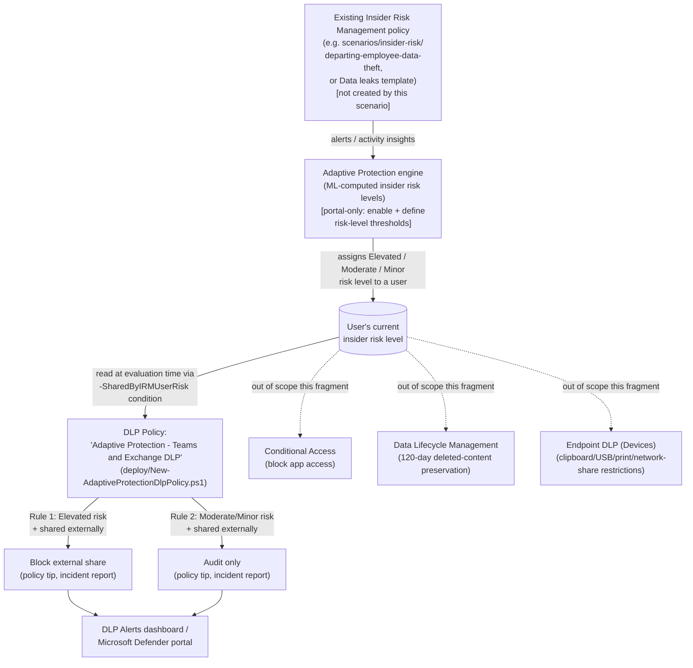

## 1. Problem statement

Every DLP scenario elsewhere in this library (`scenarios/dlp/pci-teams-exfil-block/`,
`scenarios/dlp/endpoint-dlp-usb-block/`) applies the **same** rule to **every** user in scope,
all the time. That's correct for a static regulatory control (PCI card-number handling
shouldn't depend on who's typing), but it's the wrong shape for a different, very common buyer
need: *tighten controls automatically and immediately for the specific users Insider Risk
Management has just identified as risky, without waiting for a human analyst to triage the
alert and hand-build an exception, and without permanently over-restricting the other 99% of
the workforce who aren't a risk today.*

`scenarios/insider-risk/departing-employee-data-theft/` already built the detection half of
this: an IRM policy that scores users and raises alerts. That scenario's own `design.md` §3 and
`README.md` §11 explicitly named this as the next fragment — Adaptive Protection is the
mechanism that consumes an IRM policy's risk-level output and turns it into an *enforcement*
action, closing the gap between "we detected something" and "we did something about it," while
the case is still open and before an analyst has necessarily looked at it.

## 2. Design goals

1. **Reuse an existing IRM signal, don't duplicate it.** This scenario does not create a new
   Insider Risk Management policy — it wires a DLP policy to the *insider risk level* output
   that any already-deployed IRM policy in the tenant produces (this library's own
   `departing-employee-data-theft` scenario, or Microsoft's built-in **Data leaks** template,
   or a buyer's own custom policy). Insider risk *levels* (Elevated/Moderate/Minor) are a
   tenant-wide construct computed by Adaptive Protection from whichever IRM policies are put in
   its scope — not a property of one specific policy — so this scenario's DLP rules work
   against any qualifying feeder policy.
2. **Script the part that has a real, grounded PowerShell surface — and only that part.**
   During this build, `New-DlpComplianceRule`/`Set-DlpComplianceRule`'s `-SharedByIRMUserRisk`
   parameter was independently confirmed on Microsoft Learn: it accepts the three fixed,
   documented risk-level GUIDs and is exactly the "Insider risk level for Adaptive Protection
   is" condition exposed in the portal [[6]](#references)[[7]](#references). This is a
   materially different, better-grounded position than the companion IRM scenario, where no
   PowerShell surface for policy authoring exists at all — here the *enforcement* side (the DLP
   rule) is fully scriptable; only the *risk-level definition/enablement* side (Adaptive
   Protection settings, custom insider risk level thresholds) stays portal-only. `design.md` §5
   draws that line precisely so this scenario doesn't overclaim.
3. **Match Microsoft's own documented rule shape exactly, not a bespoke design.** Microsoft
   publishes the literal condition/action table for the policy Quick Setup creates automatically
   [[3]](#references). This scenario's deploy script reproduces that same two-rule shape
   (Elevated → block; Moderate + Minor → audit) via the **custom setup** path instead of Quick
   Setup, because Quick Setup is a one-click portal wizard that also creates an IRM policy, a
   Conditional Access policy, and a Data Lifecycle Management policy in the same action —  a
   buyer who already has (or is deploying via this library) their own IRM policy needs the
   *custom setup* path (`dlp-adaptive-protection-learn` → "Manual configuration"), which is what
   `deploy/New-AdaptiveProtectionDlpPolicy.ps1` automates.
4. **Start in simulation, exactly like Microsoft's own default.** Every rule in Microsoft's
   documented Quick Setup output ships with **Status: Run the policy in simulation mode**
   [[3]](#references) — not enforcing on day one. This scenario's script defaults to the same
   posture (`-Mode TestWithNotifications`) and requires an explicit `-Mode Enable -Force` to go
   live, consistent with this library's existing DLP scenarios.
5. **Scope narrowly to what's grounded; name what's deferred.** Adaptive Protection also
   supports **Devices** (Endpoint DLP) and **Conditional Access** locations [[1]](#references)
   [[3]](#references). Both are explicitly out of scope for this fragment — see §7 (Non-goals)
   for why; Conditional Access is now built as a sibling scenario
   (`scenarios/adaptive-protection/conditional-access-insider-risk-block/`), see the correction
   note there. (Corrected 2026-09-09 — Conditional Access is no longer Microsoft-labeled
   preview; see §7.)

## 3. Why Adaptive Protection here (not a static DLP rule, not IRM alone)

- A **static DLP rule** (this library's PCI/Teams scenario) can't express "block this
  specifically because Insider Risk Management currently considers this user elevated-risk" —
  it has no concept of a dynamically-changing per-user risk attribute at all.
- **Insider Risk Management alone** (`departing-employee-data-theft`) detects and alerts, but
  every response — pausing access, escalating a case, notifying HR/Legal — is a portal action
  an analyst takes after triage. For a user who is actively exfiltrating data *right now*, the
  time between alert and analyst triage is exactly the window an attacker needs.
- **Adaptive Protection** closes that window by making the enforcement action itself a function
  of the live risk level: the moment Insider Risk Management assigns (or later resets) a user's
  risk level, the already-deployed DLP policy's evaluation of that user changes on the next
  matching activity — no analyst action required for the *first* response
  [[1]](#references)[[2]](#references). A human is still very much in the loop for
  investigation and case management; this scenario only automates the immediate technical
  control, not the human decision about what happens to the user or the case.

## 4. Policy architecture (what's deployed where)

**What this scenario's code deploys vs. what stays portal-only:**

| Component | Mechanism | Scriptable? |
|---|---|---|
| Feeder IRM policy (risk detection) | Built elsewhere in this library, or Microsoft's Data leaks template | No — out of scope for this fragment; see §7 |
| Adaptive Protection: enable + insider risk level thresholds | Purview portal → Insider Risk Management → Adaptive protection → Insider risk levels / Adaptive Protection settings | No — portal-only; no Graph/PowerShell write surface was found or grounded during this build |
| DLP policy + rules using the risk-level condition | `deploy/New-AdaptiveProtectionDlpPolicy.ps1` → `New-/Set-DlpCompliancePolicy`, `New-/Set-DlpComplianceRule -SharedByIRMUserRisk` | **Yes** — this scenario's code, independently grounded [[6]](#references)[[7]](#references) |
| Conditional Access policy using the Insider risk condition | Microsoft Entra admin center | No — different admin surface (Entra, not Purview/EXO); out of scope, see §7 |
| Data Lifecycle Management preservation policy | Purview portal → Data Lifecycle Management | No — separate opt-in; out of scope, see §7 |
| Endpoint DLP (Devices) risk-based restrictions | Purview portal or `EndpointDlpRestrictions` | Deferred — see §7 and `PROGRESS.md` |

## 5. Data flow / where risk-level evaluation happens

Insider risk *level* computation happens entirely inside the Adaptive Protection/Insider Risk
Management service — it is a continuously-updated per-user attribute derived from whichever IRM
policies are in the Adaptive Protection scope, evaluated against admin-defined (or built-in)
Elevated/Moderate/Minor conditions [[2]](#references). This scenario's deploy script never reads
or writes that attribute directly; it only creates a DLP rule whose **condition** references it
by GUID (`-SharedByIRMUserRisk`). At DLP evaluation time — when a user actually shares content
externally via Exchange or Teams — the DLP engine looks up that user's current insider risk
level and matches (or doesn't match) the rule accordingly. There is no polling, webhook, or
export involved on this scenario's side; the coupling is entirely inside the Purview service,
which is precisely what makes the response near-real-time rather than batch/scheduled like the
HR-connector-fed IRM scenario.

**Timing note carried into `README.md` §11:** it can take **up to 36 hours** after Adaptive
Protection is first turned on before risk levels and downstream DLP/Conditional
Access/Data-Lifecycle-Management actions are actually applied to activity
[[1]](#references). This scenario's deploy script has no way to script around that — it is a
backend processing delay in the Adaptive Protection service itself, not a property of the DLP
policy this scenario creates.

## 6. Key decisions

| Decision | Choice | Rationale |
|---|---|---|
| Locations covered | **Exchange + Teams only** (one combined DLP policy) | Matches Microsoft's own "Adaptive Protection policy for Teams and Exchange DLP" Quick Setup output exactly [[3]](#references); Endpoint DLP (Devices) requires an additional, separately-gated prerequisite (Advanced classification scanning and protection, or an explicit File Type condition) [[3]](#references) that this fragment defers rather than bundles in — see §7. |
| Rule shape | Two rules: **Elevated → block external share**; **Moderate + Minor → audit external share** | This is Microsoft's own documented, tested default configuration for the Teams/Exchange policy [[3]](#references) — reproduced exactly rather than inventing a different threshold scheme, so a buyer evaluating this scenario can cross-check it directly against Microsoft's own docs. |
| Condition parameter | `New-DlpComplianceRule -SharedByIRMUserRisk <GUID[]>` | The only Security & Compliance PowerShell parameter found and independently confirmed to implement the portal's "Insider risk level for Adaptive Protection is" condition, with three fixed, documented GUID values for Elevated/Moderate/Minor [[6]](#references)[[7]](#references) — not fabricated or inferred by analogy. |
| Deployment path | **Custom setup**, not Quick Setup | Quick Setup bundles a new auto-created IRM policy, Conditional Access policy, and Data Lifecycle Management policy into one irreversible-feeling wizard action [[1]](#references) — wrong fit for a buyer using this library's own IRM scenario as the feeder policy, or who wants to review/approve each control independently. This scenario's script is the scriptable equivalent of the portal's documented "Manual configuration" / Custom setup Step 3 [[2]](#references)[[3]](#references). |
| Initial policy mode | `TestWithNotifications` (simulation), matching Microsoft's own Quick Setup default | Every rule Microsoft's own Quick Setup creates starts in simulation mode [[3]](#references) — this scenario doesn't go further/faster than Microsoft's own recommended default, especially since a wrongly-tuned Elevated-risk block rule has direct, immediate business impact on a real (if risky) employee's ability to work. |
| Policy naming | `Adaptive Protection - Teams and Exchange DLP (Custom)` | Deliberately distinct from Microsoft's auto-generated Quick Setup name (`Adaptive Protection policy for Teams and Exchange DLP`) to avoid a naming collision or confusion if a tenant later also runs Quick Setup — see `README.md` §11. |
| Priority-content scoping | Not added by default; documented as a tuning option | The Elevated/Moderate rules in §6 of `README.md` match on **any** content shared externally, not just sensitivity-labeled content — matching Microsoft's own default. A buyer who wants to scope this more narrowly (e.g. only when a confidential label is also present, per the Australian Government worked example [[8]](#references)) can add a `ContentContainsSensitiveInformation` or label condition on top — documented as a tuning option in `README.md` §8, not built in, since narrowing it by default would silently diverge from Microsoft's own tested reference configuration. |

## 7. Non-goals

- **This scenario does not create or configure an Insider Risk Management policy.** It assumes
  one already exists and is in Adaptive Protection's scope — see
  `scenarios/insider-risk/departing-employee-data-theft/` for this library's own IRM scenario,
  or Microsoft's built-in **Data leaks** template.
- **This scenario does not enable Adaptive Protection itself, or define/customize insider risk
  level thresholds.** Both are portal-only actions (§4) with no documented Graph/PowerShell
  write surface found during this build.
- **This scenario does not configure Endpoint DLP (Devices) risk-based restrictions.** The
  Devices policy Microsoft's own Quick Setup creates alongside the Teams/Exchange one requires
  either Advanced classification scanning and protection or an explicit File Type condition as
  a prerequisite [[3]](#references), and its restriction-action parameter
  (`-EndpointDlpRestrictions`) already carries an open **VERIFY** in this library
  (`scenarios/dlp/endpoint-dlp-usb-block/README.md` §11) for its exact `Setting`/`Value`
  strings — stacking a second unverified use of that same parameter into a new scenario would
  compound, not close, that gap. Tracked as a follow-up fragment in `PROGRESS.md`.
- **This scenario does not configure the Conditional Access "Insider risk" condition.** That's a
  Microsoft Entra admin center policy, a different admin surface entirely, and (per Microsoft
  Entra's own recommendation page) requires **Microsoft Entra ID P2** specifically —  a license
  this scenario's DLP-only design doesn't otherwise require [[9]](#references). Built as the
  sibling scenario `scenarios/adaptive-protection/conditional-access-insider-risk-block/`
  instead of bundled here. **Correction (2026-09-09):** this bullet
  previously called the integration "a Microsoft-labeled preview integration as of this
  writing" — that was accurate at the time this scenario was first built but is stale. The
  sibling scenario's own build re-grounded GA status and found no preview label on Microsoft's
  current "Block access for users with insider risk" how-to guide or on the Graph v1.0
  `conditionalAccessConditionSet.insiderRiskLevels` resource; independent industry reporting
  places GA at June 2024. Both sources were re-confirmed directly (not just carried over from
  the sibling's own citation) during this correction pass [[14]](#references)[[15]](#references).
- **This scenario does not configure the Data Lifecycle Management 120-day deleted-content
  preservation policy** (also a Microsoft-labeled **preview** integration [[1]](#references))
  that Adaptive Protection can auto-create for Elevated-risk users — a separate opt-in with its
  own retention-policy implications. Built as the sibling scenario
  `scenarios/data-lifecycle-management/adaptive-protection-deleted-content-preservation/` instead
  of bundled here.
- **This scenario does not modify or manage the feeder IRM policy's alert/case workflow.**
  Alert triage, case escalation, and analyst response remain exactly as documented in
  `scenarios/insider-risk/departing-employee-data-theft/README.md` §8 — Adaptive Protection adds
  an automated *technical* first response, not a replacement for human investigation.
