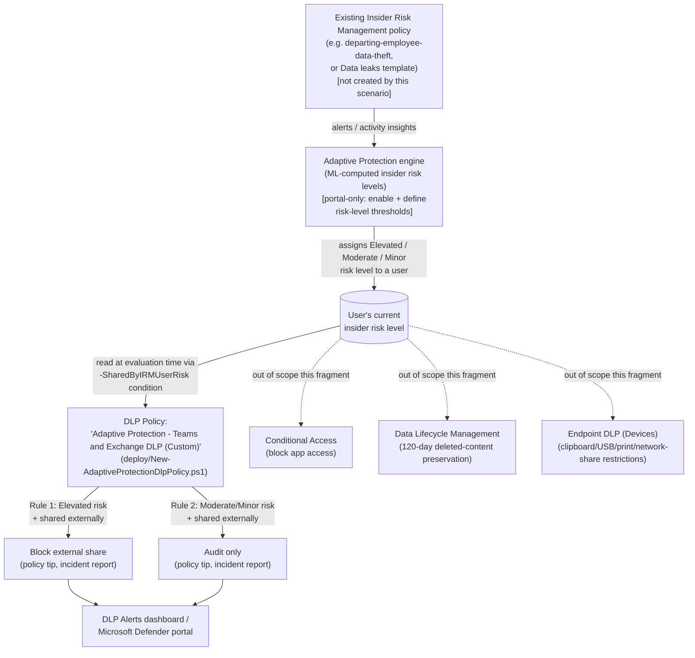

## 1. Scenario summary

Deploys a Microsoft Purview DLP policy whose enforcement action depends on a user's **live
Insider Risk Management insider risk level**, using Adaptive Protection's `SharedByIRMUserRisk`
condition: users assigned **Elevated** risk are automatically blocked from sharing content
externally over Exchange or Teams; users assigned **Moderate** or **Minor** risk are audited
only. As Insider Risk Management raises or resets a user's risk level, the DLP policy's
evaluation of that user changes on the next matching activity, no analyst has to manually
build or lift an exception.

**Who it's for:** any Microsoft 365 E5 (or Purview Suite) tenant that already has an Insider
Risk Management policy generating risk signal, this library's own
`scenarios/insider-risk/departing-employee-data-theft/`, or Microsoft's built-in **Data leaks**
template, and wants the *first* technical response to a risk-level change to be automatic and
immediate, rather than waiting on an analyst to triage the alert and hand-build a DLP exception.

## 2. Business/regulatory driver

No regulation names "Adaptive Protection" as a required control the way PCI DSS names
messaging-technology PAN protection. What it supports is a specific, common gap in mature
security programs: detection (Insider Risk Management) and enforcement (DLP) exist as two
separate systems, and closing the loop between them has historically required a human to notice
an alert and manually tighten a policy. That gap is exactly the highest-risk window, a user
mid-exfiltration is not waiting for an analyst's shift to start. This scenario supports:

- **Faster incident containment.** The technical control tightens the moment risk is detected,
 not after triage, directly reducing the mean time between detection and first response for
 the exact users Insider Risk Management has already flagged.
- **SOC 2 / ISO 27001 control-automation expectations.** Auditors under both frameworks
 increasingly look for evidence that detective controls feed enforcement, not just that both
 exist independently; this scenario is that evidence.
- **Analyst workload reduction.** A blunt, permanent, org-wide DLP tightening in response to a
 handful of flagged users would hurt productivity for everyone; a targeted, per-user, risk-
 level-scoped control (the design Adaptive Protection is built for) achieves the containment
 goal without that cost, a point a CISO can make directly to the board.
- **Insurance / cyber-liability underwriting.** Automated, risk-adaptive controls are
 increasingly a specific underwriting question, distinct from "do you have DLP" or "do you have
 insider risk monitoring" asked separately.

## 3. Prerequisites

Full licensing detail and citations: [Licensing matrix §2](/docs/licensing-matrix/#2-master-capability--license-matrix) (Adaptive Protection and its
constituent DLP/Insider Risk Management rows). Summary for this scenario:

| Requirement | Minimum | Notes |
|---|---|---|
| Adaptive Protection (DLP/label enforcement) | **Microsoft 365 E5**, **Purview Suite**, or the underlying IRM + DLP add-ons | Built on Insider Risk Management + DLP, inherits both prerequisites |
| Insider Risk Management (feeder policy) | **E5/A5/G5**, **Purview Suite**, or the **E5 Insider Risk Management** add-on | This scenario does not create the feeder IRM policy, see `scenarios/insider-risk/departing-employee-data-theft/README.md` §3 for that scenario's own licensing detail |
| DLP for Exchange and Teams | Advanced classification & Teams-scoped DLP → **E5** | [Licensing matrix §2](/docs/licensing-matrix/#2-master-capability--license-matrix), DLP row |
| Role to configure Adaptive Protection settings/insider risk levels | **Insider Risk Management** or **Insider Risk Management Admins** role group | |
| Role to create/manage the DLP policy in this scenario | One of: **Compliance Administrator**, **Compliance Data Administrator**, **DLP Compliance Management**, **Global Administrator** |, same DLP-authoring roles used elsewhere in this library, see [RBAC model](/docs/rbac-model/) |
| Automation identity for the deploy script | App-only certificate authentication to Security & Compliance PowerShell | [Automation surface §3](/docs/automation-surface/#3-authentication-patterns-interactive-vs-unattended), same certificate app-only pattern as every other DLP scenario in this library |
| Feeder Insider Risk Management policy | Already deployed and generating alerts/insights | Not created by this scenario, see §2 (Non-goals in `design.md` §7) |
| Adaptive Protection enabled, with insider risk levels defined | Portal-only, no PowerShell/Graph surface found during this build | §5 Steps 1-3 below |

> Verify current entitlement names against [Licensing matrix](/docs/licensing-matrix/) and the Product Terms
> before a sales commitment, SKU names change.

## 4. Architecture



Full rule-by-rule rationale, including exactly what this scenario can and cannot script, is in
`design.md` §4-6.

## 5. Step-by-step implementation

This scenario is **portal-first for Adaptive Protection enablement** (§6 explains why) and
**script-first for the DLP policy itself**, the one piece of Adaptive Protection with a
genuinely scriptable, independently-grounded PowerShell surface.

### Step 1, Confirm (or deploy) a feeder Insider Risk Management policy

Adaptive Protection needs at least one Insider Risk Management policy already generating
alerts/insights before insider risk levels mean anything. Use
`scenarios/insider-risk/departing-employee-data-theft/` in this library, or Microsoft's built-in
**Data leaks** template (Purview portal → **Insider Risk Management** → **Policies** → **Create
policy**). Not created by this scenario, see `design.md` §7.

### Step 2, Assign permissions

Purview portal → **Settings** → **Roles and groups** → **Role groups** → add administrators who
will configure Adaptive Protection to **Insider Risk Management** or **Insider Risk Management
Admins**; add administrators who will manage the DLP policy to **Compliance Administrator**,
**Compliance Data Administrator**, or **DLP Compliance Management**.

### Step 3, Configure insider risk levels (portal, not scriptable)

Purview portal → **Insider Risk Management** → **Adaptive protection** → **Insider risk
levels**. Select **Edit** for each of **Elevated**, **Moderate**, and **Minor**, and confirm (or
customize) the conditions that assign each level. Use
`deploy/policy/adaptive-protection-config-manifest.json` as the checklist/reference while doing
this, it documents Microsoft's own recommended "minimize false positives" starter configuration
, not a fabricated default. Confirm the feeder policy from Step 1 is selected
on this tab.

### Step 4, Deploy the DLP policy (scripted, dry-run capable)

```powershell
Connect-IPPSSession -AppId $AppId -Certificate $Cert -Organization $TenantDomain

# Dry run - shows exactly what would be created, changes nothing
./deploy/New-AdaptiveProtectionDlpPolicy.ps1 -AdminNotificationEmail 'soc@contoso.com' -WhatIf

# Deploy in simulation mode (Microsoft's own Quick Setup default posture)
./deploy/New-AdaptiveProtectionDlpPolicy.ps1 -AdminNotificationEmail 'soc@contoso.com' -Mode TestWithNotifications
```

This creates one DLP policy scoped to Exchange Online and Microsoft Teams, with two rules keyed
off the `SharedByIRMUserRisk` condition (§6 for the exact configuration).

### Step 5, Turn on Adaptive Protection (portal, not scriptable)

Purview portal → **Insider Risk Management** → **Adaptive protection** → **Adaptive Protection
settings** → toggle **Adaptive Protection** to **On**. Allow up to **36 hours**
 before expecting risk levels to be assigned and this scenario's DLP rules to
actually match a user, see §11.

### Step 6, Pilot, then enforce

**Before enabling enforcement mode, confirm the feeder IRM policy has already completed at
least one full baseline/tuning cycle** (per that scenario's own operations guidance, e.g.
`departing-employee-data-theft/README.md` §8), enabling an automatic block on top of a
*newly deployed and still-tuning* detection policy compounds two unknowns (feeder policy
false-positive rate and this scenario's own scoping) into one harder-to-diagnose outcome. Run a
pilot on non-production test accounts (§7) while the policy is still in `TestWithNotifications`
mode. Once satisfied:

```powershell
./deploy/New-AdaptiveProtectionDlpPolicy.ps1 -AdminNotificationEmail 'soc@contoso.com' -Mode Enable -Force
```

### Step 7, Validate

```powershell
./validate/Test-AdaptiveProtectionDlpPolicy.ps1
```

## 6. Configuration reference

| Setting | Value this scenario uses | Notes |
|---|---|---|
| DLP policy name | `Adaptive Protection - Teams and Exchange DLP (Custom)` | Deliberately distinct from Microsoft's Quick-Setup-generated name, see §11 |
| Policy locations | Exchange Online, Microsoft Teams | Endpoint DLP (Devices) deferred, see §11 and `design.md` §7 |
| Rule 0: `AdaptiveProtection-Block-Elevated` | `SharedByIRMUserRisk = FCB9FA93-6269-4ACF-A756-832E79B36A2A` (Elevated) AND `AccessScope = NotInOrganization` → `BlockAccess = $true` | Approximates Microsoft's documented Quick Setup block rule (Elevated + shared externally → block) using this library's already-reviewed `AccessScope`-only pattern, see §11 VERIFY note |
| Rule 1: `AdaptiveProtection-Audit-ModerateMinor` | `SharedByIRMUserRisk = 797C4446-5C73-484F-8E58-0CCA08D6DF6C, 75A4318B-94A2-4323-BA42-2CA6DB29AAFE` (Moderate, Minor) AND `AccessScope = NotInOrganization` → audit only | Approximates Microsoft's documented Quick Setup audit rule, see §11 VERIFY note |
| Policy-tip wording | Generic ("blocked by a data loss prevention policy"), never states the user was flagged as an insider risk | Deliberate: revealing risk-flag status to the user would tip off a genuinely malicious insider mid-investigation, see `reviews.md`, Red Team lens |
| Initial policy mode | `TestWithNotifications` (simulation) | Matches Microsoft's own Quick Setup default, every rule Microsoft's wizard creates starts this way |
| Incident report severity | `Low` for both rules | Matches Microsoft's documented values |
| User override | Not enabled (default off) | Matches Microsoft's documented values, a flagged-elevated user cannot self-override the block |
| Insider risk level definitions | Elevated = confirmed alert of any severity; Moderate = high-severity alert; Minor = low/medium-severity alert | Microsoft's own "minimize false positives" recommended starting configuration, a starting point, tune per §8 |
| Past activity detection window | 7 days (Microsoft default) | Configurable 5-30 days in Adaptive Protection settings; not overridden by this scenario |
| Insider risk level timeframe (auto-reset) | 7 days (Microsoft default) | How long a level stays assigned before automatically resetting, absent a new qualifying event |
| Adaptive Protection propagation delay | Up to 36 hours after first enabling | Backend processing delay in the Adaptive Protection service itself, not scriptable around |

## 7. Validation / how to prove it works

1. **Automated checks**, `./validate/Test-AdaptiveProtectionDlpPolicy.ps1` confirms the policy
 and both rules exist with the correct locations, `SharedByIRMUserRisk` GUIDs, and block/audit
 behavior. Exits non-zero on a hard failure.
2. **Manual checklist**, the same script prints a checklist for everything with no API to
 query: whether Adaptive Protection is actually turned on, whether insider risk levels are
 defined, and whether a feeder IRM policy is in scope. A policy that passes every automated
 check can still silently match zero users if these portal-only prerequisites aren't met.
3. **End-to-end functional test (non-production accounts only)**, in a pilot tenant: assign a
 test account a confirmed insider risk level (either by waiting for a real detection from the
 feeder IRM policy, or by performing the activities that qualify for a level per your Step 3
 configuration), then attempt to share content externally from that account via Exchange or
 Teams. Confirm the expected rule fires: a block + policy tip for Elevated, or an audit-only
 notification for Moderate/Minor. Wait the full 36-hour propagation window (§11) before
 concluding a test failed.
4. **Cross-check against the portal's own Adaptive Protection view**, Purview portal →
 **Insider Risk Management** → **Adaptive protection** → **Data Loss Prevention** tab should
 list this policy. If it doesn't appear there despite the rule syntax being valid, the
 `SharedByIRMUserRisk` condition was accepted by PowerShell but the policy may not be
 correctly recognized as an Adaptive Protection binding, treat this portal view as the
 authoritative confirmation, not `Get-DlpComplianceRule` output alone.

## 8. Operations & tuning

**KPIs to watch (first 90 days):**
- **Users assigned each risk level vs. block/audit action volume**, the Adaptive Protection
 dashboard (Purview portal → **Insider Risk Management** → **Adaptive protection** →
 **Dashboard**) shows counts by level; cross-reference against how often the Elevated-block
 rule actually fires. A high Elevated-level count with near-zero block events suggests flagged
 users aren't the ones triggering external-share activity, worth investigating whether the
 condition scope (external share only) is too narrow for your risk population.
- **False-positive rate on the Elevated block rule**, every block is, by construction, a
 potential business disruption for a real employee. Track how many blocked attempts, on
 investigation, turn out to be legitimate business activity by a user whose risk level was a
 false positive from the feeder IRM policy, this is a signal to tune the *IRM policy's*
 thresholds, not this scenario's DLP rule.
- **Time from risk-level assignment to first blocked/audited event**, measures how much of the
 detection-to-enforcement gap this scenario is actually closing for a given user.
- **Insider risk level reset rate**, how often a user's Elevated/Moderate/Minor level expires
 (§6, 7-day default) versus how often it's renewed by a new qualifying event before expiring.
 A level that resets and reassigns repeatedly for the same user may indicate a borderline case
 worth a human decision rather than continued automated cycling.

**Tuning:** if too many or too few users are receiving a risk level, adjust the *insider risk
level conditions* in Adaptive Protection settings (§6), not this scenario's DLP rule, which
should stay matched to Microsoft's own documented reference configuration unless there's a
specific, documented reason to diverge (see `design.md` §6, priority-content scoping row, for
one example of a supported divergence: adding a sensitivity-label condition on top).

**Incident-response runbook (Elevated-block event):**
1. **Triage**, the blocked user receives a policy tip; the SOC receives an incident report
 (§6). Open the DLP Alerts dashboard or Microsoft Defender portal to see the specific blocked
 activity.
2. **Cross-reference the feeder IRM policy's alert**, the block exists *because* of a specific
 Insider Risk Management alert; open that alert (per
 `scenarios/insider-risk/departing-employee-data-theft/README.md` §8's own runbook) to see the
 underlying evidence, not just the fact that a block occurred. **This correlation is manual by
 design**, Microsoft does not document a shared correlation ID linking a DLP incident report
 to the specific IRM alert that produced the triggering risk level, so match them by user and
 timestamp rather than expecting an automated cross-reference.
3. **Classify**, is the Elevated risk level itself a true or false positive? If the underlying
 IRM alert is a false positive, the fix is in the feeder policy's tuning, not this scenario's
 DLP rule (see KPI note above), do not weaken this scenario's rule to compensate for a
 different policy's tuning problem.
4. **Resolve**, if the IRM alert is confirmed a false positive, resolving/dismissing it resets
 the user's insider risk level (§6), which lifts the block automatically on the next
 evaluation, no manual DLP exception needed. If it's a true positive, escalate per the feeder
 scenario's own incident-response runbook; this scenario's job (blocking the specific
 activity) is already done.

**Review cadence:** review insider risk level definitions and this policy's rule configuration
quarterly, using the KPIs above and the same cadence recommended for the feeder IRM policy.

**Coordinate with HR/Legal before broad enforcement-mode rollout.** Unlike the audit-only DLP
scenarios elsewhere in this library, the Elevated-block rule here automatically restricts a
*specific, identifiable* employee's ability to communicate externally, driven by an opaque
ML-computed risk score rather than a human decision. Treat enabling `-Mode Enable` org-wide as an
HR/Legal-notified change, not a purely technical deployment step, an employee who is blocked
and later disputes the underlying risk assessment is a personnel/employment-relations matter,
not only a DLP support ticket. This is a residual consideration for CISO sign-off, not something
this scenario's code can mitigate on its own, see `reviews.md`, CISO lens.

## 9. Rollback / decommission

See `rollback.md` for the full staged procedure (disable → simulation → permanent removal).
Quick reference: `./deploy/Remove-AdaptiveProtectionDlpPolicy.ps1` disables the policy
(reversible in seconds); `-Purge` permanently deletes it. Neither action disables Adaptive
Protection itself, the feeder IRM policy, or resets any user's current insider risk level.

## 10. Cost & licensing notes

- **No incremental license cost for a tenant already at E5/Suite for the feeder IRM policy and
 DLP-for-Teams scenarios in this library**, Adaptive Protection is built on those same two
 entitlements, not a separate SKU ([Licensing matrix §2](/docs/licensing-matrix/#2-master-capability--license-matrix), Adaptive Protection row
).
- **No PAYG component for this scenario specifically**, the base M365 Exchange/Teams DLP
 evaluation this scenario relies on is per-user-entitlement, not consumption-billed. (Contrast
 with the feeder IRM policy's own cloud-indicator PAYG carve-out, which is a cost of the
 detection side, not this enforcement scenario.)
- **Sizing note:** every user this policy could plausibly block or audit needs the qualifying
 DLP + Insider Risk Management entitlement, in practice this means the same license population
 as the feeder IRM policy (§3), typically org-wide E5 for a buyer deploying this pattern
 seriously, not a narrow subset.
- **No additional infrastructure cost.** The deploy/validate scripts in this scenario are
 one-time or infrequent (deploy once, validate on a review cadence), unlike the departing-
 employee IRM scenario's daily HR feed, there's no recurring scheduled job here.

## 11. Known limitations & gotchas

- **Up to 36 hours before Adaptive Protection actions apply after first enabling.** This is a
 backend processing delay in the Adaptive Protection service, not a property of the DLP policy
 this scenario deploys, don't conclude a pilot failed before that window has elapsed
.
- **This scenario's DLP policy will validate and deploy successfully even if Adaptive Protection
 is never turned on.** `New-DlpComplianceRule -SharedByIRMUserRisk` doesn't check whether
 Adaptive Protection is enabled or whether any insider risk level is currently defined, the
 rule simply never matches any user until both are true. The manual checklist in
 `validate/Test-AdaptiveProtectionDlpPolicy.ps1` exists specifically to catch this "looks
 configured, does nothing" state.
- **Policy naming deliberately avoids colliding with Quick Setup.** If a tenant later also runs
 Microsoft's Quick Setup wizard (§2 in `design.md`), it will create its own
 `Adaptive Protection policy for Teams and Exchange DLP` policy, a *different* name from this
 scenario's `Adaptive Protection - Teams and Exchange DLP (Custom)`. Running both at once means
 two policies enforcing overlapping logic; if that happens, decide which one is authoritative
 and disable the other rather than leaving both live indefinitely.
- **Insider risk levels are tenant-wide, not policy-specific.** A user's Elevated/Moderate/Minor
 level is computed from *whichever* IRM policies are in Adaptive Protection's scope, if more
 than one feeder policy is later added, this scenario's DLP rule has no way to distinguish
 which feeder policy caused the assignment. Investigate via the feeder policy's own alert, not
 this scenario's DLP rule, when root-causing a block.
- **The `AccessScope NotInOrganization` condition matches any external share**,
 not just sensitivity-labeled or otherwise sensitive content, this is intentional (it matches
 Microsoft's own documented reference configuration), but it means an
 Elevated-risk user is blocked from sharing *anything* externally via Exchange/Teams, not just
 confidential material. A buyer wanting narrower scoping should add a content-sensitivity
 condition on top (`design.md` §6) rather than assume this scenario already does so.
- **This scenario does not configure Endpoint DLP (Devices), Conditional Access, or
 Data Lifecycle Management (preview integration)**, all three are Adaptive
 Protection-integrated but out of scope here; see `design.md` §7 and `PROGRESS.md` for the
 follow-up fragments this build opened. Conditional Access is now built as the sibling scenario
 `scenarios/adaptive-protection/conditional-access-insider-risk-block/`, and Data Lifecycle
 Management as `scenarios/data-lifecycle-management/
 adaptive-protection-deleted-content-preservation/`. **Correction
 (2026-09-09):** this bullet previously called Conditional Access a "preview integration" too, 
 that build's own fresh grounding pass found no preview label on Microsoft's current "Block
 access for users with insider risk" how-to guide or on the Graph v1.0
 `conditionalAccessConditionSet.insiderRiskLevels` resource (independent industry reporting
 places GA at June 2024), both re-confirmed directly during this correction pass
. Data Lifecycle Management's integration remains
 Microsoft-labeled preview, directly re-confirmed by the new sibling scenario's own build, and is
 unaffected by this correction. **This is a real, exploitable
 gap, not a theoretical one:** an Elevated-risk user blocked from emailing or Teams-sharing a file externally can, as
 of this scenario alone, still exfiltrate the identical file via a direct SharePoint/OneDrive
 download, a USB copy, printing, or an upload to a personal cloud-storage app, none of which
 this policy's Exchange/Teams-only scope inspects. Communicate this plainly to a buyer: this
 scenario closes one exfiltration channel for risky users, not all of them, until the Endpoint
 DLP follow-up fragment lands.
- **VERIFY the `AccessScope`-only condition form against a pilot tenant.** This scenario's rules
 use `-AccessScope NotInOrganization` (the same, already-reviewed pattern from
 `scenarios/dlp/pci-teams-exfil-block`) to represent the portal's "Content is shared from
 Microsoft 365 with people outside my organization" condition. Whether the portal's compound
 condition additionally requires a separate `-ContentIsShared` boolean to be a byte-for-byte
 match was not independently confirmed during this build, deploy in `TestWithNotifications`
 mode first and compare the portal-rendered rule condition against what Microsoft's own
 documented Quick Setup output shows (reference 3) before promoting to `-Mode Enable`.
- **No PowerShell/Graph write API for enabling Adaptive Protection or defining insider risk
 levels.** As of this writing, both are portal-only, this library does not fabricate a cmdlet
 for them. `design.md` §4/§6.

## 12. References

1. Help dynamically mitigate risks with Adaptive Protection (insider risk levels, 36-hour/6-hour
 propagation delays, custom setup, disable behavior), <https://learn.microsoft.com/purview/insider-risk-management-adaptive-protection>
2. Permissions for Adaptive Protection (role groups per task), <https://learn.microsoft.com/purview/insider-risk-management-adaptive-protection#permissions-for-adaptive-protection>
3. Learn about Adaptive Protection in Data Loss Prevention (documented Quick Setup rule
 values for Teams/Exchange and Devices policies), <https://learn.microsoft.com/purview/dlp-adaptive-protection-learn>
4. Adaptive Protection configuration guide (recommended Elevated/Moderate/Minor definitions to
 minimize false positives), <https://learn.microsoft.com/purview/insider-risk-management-adaptive-protection-guide>
5. Insider Risk Management policy templates (Data leaks template), <https://learn.microsoft.com/purview/insider-risk-management-policy-templates>
6. New-DlpComplianceRule reference (`-SharedByIRMUserRisk` parameter and GUID values), <https://learn.microsoft.com/powershell/module/exchangepowershell/new-dlpcompliancerule>
7. Set-DlpComplianceRule reference (`-SharedByIRMUserRisk` parameter), <https://learn.microsoft.com/powershell/module/exchangepowershell/set-dlpcompliancerule>
8. Managing insider risk for the Australian Government, worked example of an Adaptive
 Protection DLP rule with an added sensitivity-label condition, <https://learn.microsoft.com/compliance/anz/pspf-insider-risk#adaptive-protection>
9. Microsoft Entra recommendation: Protect your tenant with Insider Risk condition in
 Conditional Access policy (Microsoft Entra ID P2 license requirement for the Conditional
 Access integration this scenario does not configure), <https://learn.microsoft.com/entra/identity/monitoring-health/recommendation-insider-risk-condition>
10. [Licensing matrix §2](/docs/licensing-matrix/#2-master-capability--license-matrix), Adaptive Protection row (E5/Suite, built on IRM + DLP)
11. New-DlpCompliancePolicy / Set-DlpCompliancePolicy reference, <https://learn.microsoft.com/powershell/module/exchangepowershell/new-dlpcompliancepolicy>, <https://learn.microsoft.com/powershell/module/exchangepowershell/set-dlpcompliancepolicy>
12. Remove-DlpCompliancePolicy reference, <https://learn.microsoft.com/powershell/module/exchangepowershell/remove-dlpcompliancepolicy>
13. DLP policy reference, locations table (Exchange, Teams, Devices support for Adaptive
 Protection), <https://learn.microsoft.com/purview/dlp-policy-reference#locations>
14. Block access for users with insider risk (the how-to guide independently re-fetched during
 this scenario's 2026-09-09 correction pass, carries no preview label), <https://learn.microsoft.com/entra/identity/conditional-access/policy-risk-based-insider-block>
15. conditionalAccessConditionSet resource type (`insiderRiskLevels` property, Graph v1.0, 
 independently re-fetched during the same correction pass, confirmed current/non-beta), <https://learn.microsoft.com/graph/api/resources/conditionalaccessconditionset>

> Re-verify all links, cmdlet/API behavior, and licensing terms against current Microsoft Learn
> before a customer-facing assessment or sale, Adaptive Protection is a comparatively new
> capability that changes faster than most in the Purview portfolio.
