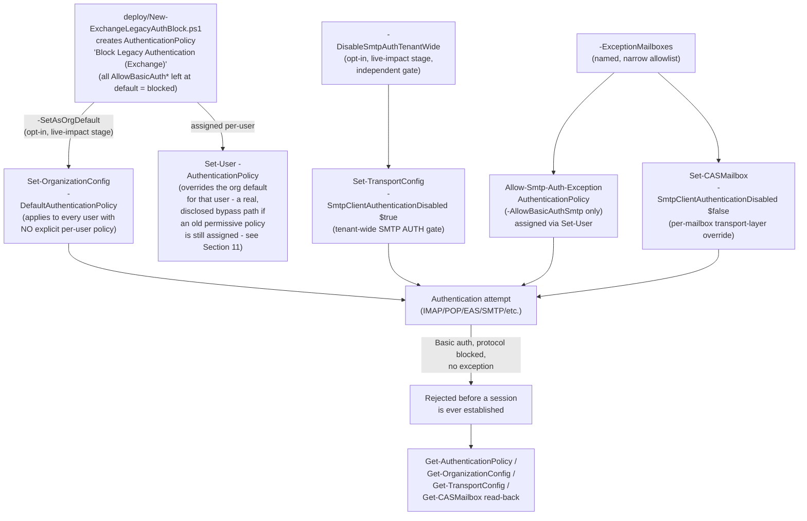

## 1. Problem statement

`scenarios/adaptive-protection/block-legacy-authentication/design.md` §7 (Non-goals) and §8
(Residual risk) explicitly disclose a gap that scenario cannot close: Conditional Access is a
**post-first-factor-authentication** control. Microsoft's own community guidance, quoted directly
in that scenario, states Conditional Access "will not help you [with credential-stuffing
lockouts]... apply post (first factor) authentication... Even if a CA policy blocks the login
attempt, at this point the attacker knows credentials were successfully verified"
[[13]](#references). That scenario's own `design.md` §7 names the mitigation and defers it here:
"Exchange-side authentication policies... a separate, workload-specific control surface
Conditional Access's own documented Q&A guidance notes is actually more effective against
brute-force/credential-stuffing lockout attempts specifically, since Conditional Access is
evaluated only after first-factor authentication succeeds." This scenario builds that control as
its own standalone fragment, per `AGENTS.md` §6.

## 2. Design goals

1. **Close the exact gap the sibling scenario disclosed**, using Exchange Online's own documented
   Authentication Policy mechanism [[1]](#references)[[2]](#references), not a Conditional Access
   workaround.
2. **Target what is actually still exposed, not what Microsoft has already closed.** The
   load-bearing grounding finding of this build (§3): Microsoft has already **permanently**
   disabled Basic authentication tenant-wide for most legacy protocols, with no re-enable path.
   Presenting this scenario as "the way to block legacy auth in Exchange" without disclosing that
   most of the work is already done for free would fail the Microsoft Product Owner lens the same
   way the Conditional Access sibling's own Microsoft-managed-policy finding did. This scenario is
   honest about which protocol is actually still live: **SMTP AUTH**.
3. **Treat SMTP AUTH as the priority, not an afterthought**, because it has a real, dated
   deprecation timeline that has not yet resolved itself (§3) — this is a control worth deploying
   proactively now, not a box to check after Microsoft flips the default.
4. **Provide a real, governed exception path**, not a binary "SMTP AUTH on or off" toggle — a
   buyer with even one multifunction device or line-of-business relay app cannot adopt this
   scenario at all without one, and an ungoverned exception (leaving SMTP AUTH on tenant-wide "just
   in case") defeats the control for everyone.
5. **Never claim a Report-only staging mode that doesn't exist.** Unlike Conditional Access,
   Authentication Policies have no platform-level "log but don't enforce" state (§4) — this
   scenario's own staged-parameter design (policy creation is inert until assigned) is the honest
   substitute, not a fabricated `-Mode ReportOnly`.

## 3. Grounding finding: what's already closed vs. what's still open

Microsoft's "Disable Basic authentication in Exchange Online" reference, direct-fetched via its
GitHub-mirrored source during this build (§8, grounding note), states Basic authentication has been
**permanently disabled tenant-wide, with no re-enable option**, for: Exchange ActiveSync (EAS),
POP, IMAP, Remote PowerShell, Exchange Web Services (EWS), Offline Address Book (OAB),
Autodiscover, and Outlook for Windows/Mac (MAPI/RPC) [[10]](#references). This happened
unconditionally, tenant-wide, independent of whether any Authentication Policy object exists at
all — it is a backend platform change, not something `New-AuthenticationPolicy` implements.

**Authenticated SMTP (SMTP AUTH / Client Submission) is the deliberate exception.** Per Microsoft's
own updated deprecation timeline (Exchange Team blog, corroborated across multiple independent
secondary sources during this build — §8 grounding note):
- SMTP AUTH Basic Authentication will be **disabled by default for existing tenants at the end of
  December 2026** — admins will still be able to re-enable it after that date.
- Tenants **created after December 2026** will have it unavailable by default with **no**
  re-enable option.
- Microsoft will announce a **final removal date** in the second half of 2027.
- This is an **updated** timeline — the deprecation was originally announced for September 2025 and
  has already shifted once, which this scenario's `README.md` §11 flags as a reason to re-verify
  before a customer-facing commitment.

As of this build's date (2026-09-09), the default-disable has **not yet happened**. A tenant that
hasn't explicitly acted is still exposed on this one protocol today, and has no reason to wait for
Microsoft's own December 2026 date — the whole value proposition of this scenario over "just wait"
is (a) closing the gap months earlier, and (b) getting a governed, named exception list instead of
whatever Microsoft's own default-disable rollout leaves in place for mailboxes it may
grandfather or flag differently.

**Consequence for scope:** this scenario's baseline `AuthenticationPolicy` still blocks all twelve
`AllowBasicAuth*` protocols (harmless, explicit redundancy on the eight already-closed ones), but
the scenario's actual value-add — and its README's framing, KPIs, and exception-handling design —
centers on **SMTP**, plus the smaller set of protocols (Outlook Service, Reporting Web Services,
RPC, PowerShell) not individually named on Microsoft's "already disabled" page and therefore not
confirmed moot (`README.md` §11).

## 4. Why there's no "Report-only" mode here (and what replaces it)

Conditional Access has a first-class `enabledForReportingButNotEnforced` state — a policy can
evaluate and log without blocking. **Authentication Policies have no equivalent.** An
`AuthenticationPolicy` object's `AllowBasicAuth*` switches are binary and take effect the moment
the policy is assigned to a user or set as the org default — there is no "simulate this and tell me
who'd be affected" mode documented anywhere in the cmdlet references checked during this build
[[1]](#references)[[2]](#references)[[6]](#references).

This scenario's substitute is **staging by parameter, not by platform state**:
- Creating the baseline policy (`README.md` §5 Step 3) has **zero** effect on any user — an
  unassigned `AuthenticationPolicy` is inert.
- `-SetAsOrgDefault` and `-DisableSmtpAuthTenantWide` are **separate, explicit, opt-in switches**,
  not defaults, so an operator must deliberately choose to move from "object exists" to "object has
  live effect" — and can do so for the SMTP transport gate independently of the policy-assignment
  gate, running each in isolation to observe impact before combining them.
- `README.md` §5 Step 2's inventory (existing `SmtpClientAuthenticationDisabled` overrides, current
  legacy-protocol usage) is this scenario's substitute for a Report-only evaluation window —
  evidence gathered *before* the irreversible-in-the-moment step, not logged *during* a safe
  simulation of it.

This is a materially different, more manual safety model than the Conditional Access sibling's
Report-only-by-default posture, disclosed as such rather than silently presented as equivalent.

## 5. The two independent SMTP AUTH gates (and why both are closed together)

This build's grounding pass found **two textually separate** Microsoft mechanisms that both affect
SMTP AUTH, with no page found stating how they interact if only one is used:

| Gate | Cmdlet | Scope | Source |
|---|---|---|---|
| Authentication Policy | `AllowBasicAuthSmtp` on an assigned `AuthenticationPolicy` | Per-user (via the policy assigned to them, or the org default) | [[1]](#references)[[2]](#references) |
| Transport config | `SmtpClientAuthenticationDisabled` on `Set-TransportConfig` (org-wide) / `Set-CASMailbox` (per-mailbox override) | Org-wide with mailbox-level override; `$null` on the mailbox means "follow the org setting" | [[7]](#references)[[8]](#references)[[9]](#references) |

Microsoft's own dedicated SMTP AUTH guide [[9]](#references) documents the transport-config gate's
org-then-mailbox-override precedence in detail, but neither that page nor the
`Set-AuthenticationPolicy` reference [[2]](#references) states what happens if, say, a mailbox's
assigned `AuthenticationPolicy` allows SMTP but `SmtpClientAuthenticationDisabled` is still `$true`
for it (or the reverse). Rather than guess which one wins, this scenario's design **closes both
gates together** for the baseline (both default-blocked) and **opens both together** for a named
exception mailbox (`README.md` §5 Step 5) — belt-and-suspenders that sidesteps needing to know the
precedence, at the cost of two API calls instead of one per exception. Flagged as an open VERIFY
(`README.md` §11) rather than resolved by assuming a precedence order.

## 6. Architecture

## 7. Key decisions

| Decision | Choice | Rationale |
|---|---|---|
| Baseline policy's `AllowBasicAuth*` values | All left at default (blocked) — no switches passed to `New-AuthenticationPolicy` | Matches Microsoft's own confirmed default behavior for a policy created with no `-AllowBasicAuth*` switches [[1]](#references); the simplest, most conservative baseline. |
| Deployment path | Direct Exchange Online PowerShell (`New-/Set-AuthenticationPolicy`, `Set-OrganizationConfig`, `Set-TransportConfig`, `Set-CASMailbox`) | This is automation surface 1 per `docs/automation-surface.md` §1 — the only surface these cmdlets exist on; no Graph equivalent found during this build's grounding pass. |
| Staging model | Policy creation is inert; `-SetAsOrgDefault`/`-DisableSmtpAuthTenantWide` are separate opt-in switches | §4 — the closest honest substitute for Conditional Access's Report-only mode, which Authentication Policies don't have. |
| Exception mechanism | Both the `AllowBasicAuthSmtp`-only policy AND the `SmtpClientAuthenticationDisabled:$false` mailbox override, applied together | §5 — sidesteps an undocumented precedence question rather than guessing which single gate is authoritative. |
| Scope of protocols emphasized | SMTP AUTH is the headline; the eight already-permanently-disabled protocols are covered but disclosed as largely redundant | §3 — avoids overselling a control Microsoft has already deployed for free, the same honesty standard the Conditional Access sibling's Microsoft-managed-policy finding set. |
| Policy identity for idempotency | Exact `-Identity`/name match (`Get-AuthenticationPolicy -Identity <Name>`) | Authentication Policies expose no separate, pre-choosable GUID at creation distinct from their name — same class of limitation as the Conditional Access sibling's `displayName`-based identity strategy. |
| RBAC role documented in Prerequisites | **Organization Management** (confirmed-sufficient, broad) rather than a hypothesized narrower role | Microsoft's own cmdlet reference pages for `New-/Set-/Remove-AuthenticationPolicy` don't name a specific role — they defer to a generic permissions-lookup pointer. Recommending a broad-but-confirmed role beats guessing a narrower, unconfirmed one. Flagged as an open VERIFY, not silently narrowed. |

## 8. Non-goals

- **This scenario does not manage or migrate pre-existing per-user `AuthenticationPolicy`
  assignments** made by other automation or a different admin before this scenario was deployed —
  out of scope; `README.md` §11 documents the audit check (`-CheckUserOverrides`) instead.
- **This scenario does not script Direct Send / unauthenticated relay controls.** A materially
  different Exchange Online surface (anonymous relay via a mail flow connector) with its own
  separate configuration and abuse profile — not an authenticated-legacy-protocol concern this
  scenario's scope covers.
- **This scenario does not touch the Conditional Access sibling scenario's policy, or any
  Microsoft-managed Conditional Access policy.** Fully independent controls, deliberately layered
  (`README.md` §2/§9), not merged into one fragment per `AGENTS.md` §6.
- **This scenario does not build an OAuth migration path for exception mailboxes.** Migrating a
  scan-to-email device or line-of-business app off SMTP AUTH onto OAuth 2.0 client-credentials flow
  is device/app-specific integration work outside this scenario's scope — `README.md` §8 names it
  as the goal for shrinking the exception list over time, not something this scenario automates.
- **This scenario does not attempt on-premises/hybrid Exchange's `-BlockLegacyAuth*`/
  `-BlockModernAuth*` parameter family** [[12]](#references) — those parameters are documented as
  on-premises-only (Exchange 2019 CU2+/CU13+); this scenario targets pure Exchange Online via the
  cloud-only `-AllowBasicAuth*` switches.

## 9. Residual risk

Even with both gates closed and the org default assigned, this scenario does not eliminate every
legacy-authentication risk:
- **A user with a pre-existing explicit policy assignment is not covered by the org default** (§5
  in `README.md`) — a real, disclosed bypass this scenario's validate script surfaces but cannot
  auto-remediate without risking an intentional, still-needed exception.
- **Exception mailboxes remain a real, if narrowed, attack surface** — an `-ExceptionMailboxes`
  entry is still SMTP-AUTH-reachable by design; its credential hygiene (strong, rotated, ideally
  service-principal-based where the sending app supports it) matters more, not less, once it's one
  of the few mailboxes left standing.
- **This scenario does not detect a *future* admin re-enabling SMTP AUTH or reverting the org
  default** — `README.md` §8's quarterly review cadence is the only mitigation, the same
  point-in-time-check limitation the Conditional Access sibling's own Red Team finding raised
  about its Microsoft-managed-policy detection.
- **No Microsoft-side audit trail exists for a rejected SMTP AUTH attempt — a grounded, structural
  gap, not an unbuilt script.** A follow-up grounding pass (`reviews.md`, Blue Team finding 1)
  confirmed neither `Search-UnifiedAuditLog` (activity-after-authentication only) nor Entra ID
  sign-in logs (never reached — this scenario's gates reject the connection at the
  pre-authentication step [[10]](README.md#references)) capture this event, and the Exchange SMTP
  AUTH Clients report tracks successful submissions only. `README.md` §8 documents the realistic
  substitute (the affected device/app's own logs, or a synthetic canary probe watching for `535
  5.7.139`). No future `Export-*.ps1` companion script can close this gap — there is no API to call.
