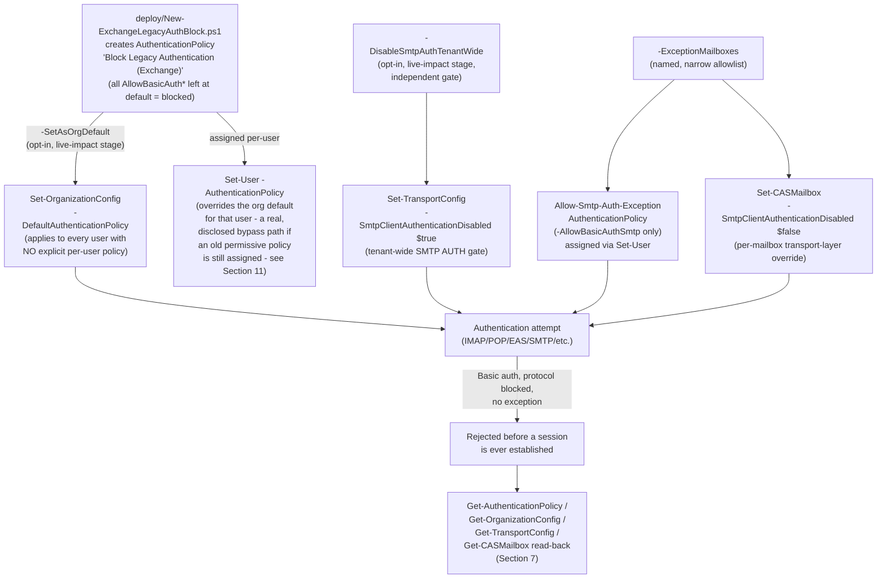

## 1. Scenario summary

Deploys Exchange Online's own, workload-level legacy-authentication controls — an
**Authentication Policy** (`New-/Set-AuthenticationPolicy`) assigned tenant-wide as the default and
to explicit users, plus the tenant-wide **Authenticated SMTP (SMTP AUTH)** toggle
(`Set-TransportConfig -SmtpClientAuthenticationDisabled`) — with a narrow, named, per-mailbox
exception path for devices/apps that still need SMTP AUTH. Unlike Conditional Access, these
controls are evaluated **inside Exchange Online itself, before a session is ever established**.

**Who it's for:** any Exchange Online tenant that wants legacy-authentication coverage that
doesn't depend on Conditional Access licensing or evaluation order — including a buyer deploying
this library's own `scenarios/adaptive-protection/block-legacy-authentication/`, whose own
`design.md` §7/§8 and `reviews.md` (Red Team) flagged this exact companion control as a documented,
more-effective mitigation for credential-stuffing/password-spray lockout attempts specifically,
and deferred it to this dedicated fragment. Especially relevant for any tenant that still has
**Authenticated SMTP (SMTP AUTH)** enabled — the one legacy-authentication protocol Microsoft has
**not yet** force-disabled tenant-wide (see §2).

## 2. Business/regulatory driver

- **Exchange-side controls act before first-factor authentication completes — Conditional Access
  does not.** Microsoft's own community guidance states plainly that Conditional Access policies
  "apply post (first factor) authentication... Even if a CA policy blocks the login attempt, at
  this point the attacker knows credentials were successfully verified"
  [[13]](#references). The controls in this scenario are evaluated inside the Exchange Online
  authentication stack itself, closing the exact gap the sibling scenario's own `design.md` §8
  discloses.
- **SMTP AUTH has a live, ticking deprecation clock — but it isn't disabled yet.** Microsoft has
  already **permanently** disabled Basic authentication tenant-wide, with no re-enable option, for
  Exchange ActiveSync, POP, IMAP, Remote PowerShell, Exchange Web Services, Offline Address Book,
  Autodiscover, and Outlook for Windows/Mac (MAPI/RPC) [[10]](#references). **Authenticated SMTP
  (SMTP AUTH / Client Submission) is the one protocol Microsoft has deliberately left
  admin-controlled** during an extended deprecation runway: per Microsoft's own updated timeline,
  SMTP AUTH Basic Authentication is scheduled to be **disabled by default for existing tenants at
  the end of December 2026** (admins can still re-enable it after that date), with a final removal
  date to be announced in the second half of 2027; tenants created after December 2026 will have it
  unavailable by default with no re-enable option [[11]](#references). As of this build's date
  (2026-09-09), that default flip has **not yet happened** — a tenant that hasn't explicitly
  disabled SMTP AUTH today is still exposed on the one legacy-auth protocol left standing, and
  waiting for Microsoft's own timeline means staying exposed for months longer than necessary.
- **A real, currently-exploited attack surface.** SMTP AUTH is a documented target for
  password-spray and credential-stuffing campaigns (the same attacker motivation the Conditional
  Access sibling scenario's own attack-statistics citation names for legacy auth generally
  [[13 in sibling]](#references)) precisely because it is Basic Authentication — no MFA challenge,
  a single username/password pair, scriptable at scale.
- **SOC 2 / ISO 27001 / PCI DSS control-automation expectations.** Same driver as the Conditional
  Access sibling scenario (§2 there) — "legacy/basic authentication is disabled" is a commonly
  assessed control; this scenario closes it at the workload layer specifically, which several
  frameworks' control language distinguishes from an identity-layer (Conditional Access) control.
- **Defense-in-depth, not a duplicate.** This scenario does not replace
  `block-legacy-authentication` — it closes a gap that scenario's own four-lens review disclosed it
  cannot close (`design.md` §8 there). Deploy both for layered coverage.

## 3. Prerequisites

| Requirement | Minimum | Notes |
|---|---|---|
| Exchange Online (any plan that includes it) | Exchange Online Plan 1/2, or any Microsoft 365/Office 365 plan that bundles it | Authentication Policies, `Set-TransportConfig`, and `Set-CASMailbox` are all core Exchange Online administration surfaces — **no incremental license** beyond Exchange Online itself. Unlike the Conditional Access sibling scenario, this scenario needs no Entra ID P1/P2. |
| Automation identity for the deploy script | Exchange Online app-only certificate authentication (`Connect-ExchangeOnline -AppId ... -CertificateThumbprint ...`), `Exchange.ManageAsApp` application permission on the **Office 365 Exchange Online** resource, plus an Exchange Online RBAC role/role group granted to the app's service principal | `docs/automation-surface.md` §1/§3 (automation surface 1, Exchange Online PowerShell). This library's confirmed working role for authentication-policy cmdlets is **Organization Management** — see §11 for the narrower-role VERIFY. |
| Role to run the deploy/validate scripts interactively, or to assign to the app's service principal for unattended use | **Organization Management** (Exchange Online role group) | Confirmed sufficient by this build (it is Exchange Online's superset administrative role group); the exact least-privilege granular Exchange management role scoped to just Authentication Policies is not independently confirmed — see §11 and `docs/rbac-model.md` §6. |
| Tenant SMTP AUTH inventory before enforcing | List of mailboxes/devices/apps that currently authenticate via SMTP AUTH (multifunction devices/scan-to-email, line-of-business apps, monitoring tools) | §5 Step 2 below. Disabling SMTP AUTH tenant-wide without this step is this scenario's single highest-risk operational mistake — see §8. |

> Verify current entitlement names against `docs/licensing-matrix.md` §4 and the Product Terms
> before a sales commitment — SKU names change.

## 4. Architecture



Full rationale for the two independent, both-must-be-closed SMTP AUTH gates (AuthenticationPolicy
vs. transport config) is in `design.md` §4–5.

## 5. Step-by-step implementation

### Step 1 — Assign permissions

Add the operating administrator (or the automation app's service principal) to the **Organization
Management** Exchange Online role group — `docs/rbac-model.md` §6. See §11 for the narrower-role
open question.

### Step 2 — Inventory current SMTP AUTH and legacy-protocol use before changing anything

Before disabling anything tenant-wide:

```powershell
Connect-ExchangeOnline -AppId $AppId -CertificateThumbprint $Thumbprint -Organization $TenantDomain

# Mailboxes with an explicit SMTP AUTH override already set (True/False, not $null = "follows org default")
Get-CASMailbox -ResultSize Unlimited | Where-Object { $null -ne $_.SmtpClientAuthenticationDisabled } |
    Select-Object DisplayName, PrimarySmtpAddress, SmtpClientAuthenticationDisabled

# Sign-ins/authentications actually using Basic/legacy protocols in the last 90 days - cross-check
# against the Conditional Access sibling's own Step 2 (Entra sign-in logs / legacy-auth workbook),
# which covers the same underlying signal from the identity-platform side.
```

Do this even if you plan to enforce immediately — this is the evidence a change is safe, and the
list of mailboxes that need the §5 Step 5 exception path.

### Step 3 — Create the Authentication Policy (no live impact yet)

```powershell
./deploy/New-ExchangeLegacyAuthBlock.ps1 -WhatIf
./deploy/New-ExchangeLegacyAuthBlock.ps1
```

Creates (or reconciles) one `AuthenticationPolicy` named `Block Legacy Authentication (Exchange)`
with every `AllowBasicAuth*` switch left at its default (blocked) — matching Microsoft's own
documented default behavior for a policy created with no `-AllowBasicAuth*` switches
[[1]](#references). **Creating this policy alone has zero effect on any user** — an
`AuthenticationPolicy` object only takes effect once assigned (Step 4). This is the scenario's own
safe staging point; Authentication Policies have no native Report-only mode the way Conditional
Access does (`design.md` §3).

### Step 4 — Assign the policy tenant-wide (live-impact stage, opt-in)

```powershell
./deploy/New-ExchangeLegacyAuthBlock.ps1 -SetAsOrgDefault -WhatIf
./deploy/New-ExchangeLegacyAuthBlock.ps1 -SetAsOrgDefault
```

Sets the policy as the tenant's `DefaultAuthenticationPolicy` [[6]](#references) — applies to every
user **without an explicit per-user policy assignment already in place**. Run
`./validate/Test-ExchangeLegacyAuthBlock.ps1 -CheckUserOverrides` first (§7) to find any user who
already has a conflicting explicit policy — the org default does not override one.

### Step 5 — Disable Authenticated SMTP tenant-wide, with named exceptions (live-impact stage, opt-in)

```powershell
./deploy/New-ExchangeLegacyAuthBlock.ps1 -DisableSmtpAuthTenantWide `
    -ExceptionMailboxes 'scan-to-email@contoso.com','relay-app@contoso.com' -WhatIf
./deploy/New-ExchangeLegacyAuthBlock.ps1 -DisableSmtpAuthTenantWide `
    -ExceptionMailboxes 'scan-to-email@contoso.com','relay-app@contoso.com'
```

Sets `Set-TransportConfig -SmtpClientAuthenticationDisabled $true` tenant-wide [[7]](#references) —
the second, independent SMTP AUTH gate alongside the policy's own `AllowBasicAuthSmtp`. For each
`-ExceptionMailboxes` entry: assigns a separate, narrowly-scoped `Allow-Smtp-Auth-Exception`
policy (only `AllowBasicAuthSmtp` enabled — every other protocol still blocked) via `Set-User
-AuthenticationPolicy`, **and** sets `Set-CASMailbox -SmtpClientAuthenticationDisabled $false` for
that mailbox [[8]](#references) — both gates opened deliberately, since Microsoft does not document
how the two interact if only one is opened (§11 VERIFY).

### Step 6 — Validate

```powershell
./validate/Test-ExchangeLegacyAuthBlock.ps1
```

## 6. Configuration reference

| Setting | Value this scenario uses | Notes |
|---|---|---|
| Baseline policy name | `Block Legacy Authentication (Exchange)` | All `AllowBasicAuth*` switches omitted at creation = blocked by default for every protocol [[1]](#references). |
| Exception policy name | `Allow-Smtp-Auth-Exception` | Only `-AllowBasicAuthSmtp` set; every other protocol stays blocked. One shared policy object, assigned to as many exception mailboxes as needed. |
| Tenant default assignment | `Set-OrganizationConfig -DefaultAuthenticationPolicy 'Block Legacy Authentication (Exchange)'` | Applies to every user with no explicit per-user override [[6]](#references). |
| SMTP AUTH transport-layer gate | `Set-TransportConfig -SmtpClientAuthenticationDisabled $true` (tenant-wide), `$false` per exception mailbox via `Set-CASMailbox` | Independent of the AuthenticationPolicy's own `AllowBasicAuthSmtp` — this scenario closes both gates [[7]](#references)[[8]](#references)[[9]](#references). |
| Exception mailbox assignment | `Set-User -Identity <mailbox> -AuthenticationPolicy 'Allow-Smtp-Auth-Exception'` | [[5]](#references). |
| Staging model | Policy creation (Step 3) is a no-op until assigned; `-SetAsOrgDefault` and `-DisableSmtpAuthTenantWide` are separate, explicit, opt-in switches | No native Report-only concept for Authentication Policies — `design.md` §3 explains why this staged-parameter design is the closest equivalent. |

## 7. Validation / how to prove it works

1. **Automated checks** — `./validate/Test-ExchangeLegacyAuthBlock.ps1`:
   - `Get-AuthenticationPolicy -Identity 'Block Legacy Authentication (Exchange)'`
     [[3]](#references) — confirms every `AllowBasicAuth*` is `$false`/unset.
   - `Get-OrganizationConfig | Select-Object DefaultAuthenticationPolicy` — confirms tenant-wide
     assignment, if `-SetAsOrgDefault` was used.
   - `Get-TransportConfig | Select-Object SmtpClientAuthenticationDisabled` — confirms the SMTP
     AUTH tenant-wide gate, if `-DisableSmtpAuthTenantWide` was used.
   - `-CheckUserOverrides` (optional, `Get-User -ResultSize Unlimited | Where-Object
     AuthenticationPolicy`) — flags any user with an explicit policy assignment other than this
     scenario's own two policies, since those users are **not** covered by the org default (§11).
   - Fails hard if the baseline policy doesn't exist, or exists but any `AllowBasicAuth*` is
     enabled.
2. **Manual checklist** — printed by the same script: Step 2's SMTP AUTH inventory reviewed,
   exception mailboxes tested end-to-end, and awareness of Microsoft's own December 2026 SMTP AUTH
   default-disable date (this scenario should already be ahead of it).
3. **End-to-end functional test (non-production account only)** — attempt an SMTP AUTH send with a
   disposable test mailbox's credentials before and after Step 5; confirm rejection
   (`535 5.7.139 Authentication unsuccessful` per Microsoft's documented SMTP AUTH error code
   [[9]](#references)) after enforcement, and confirm an `-ExceptionMailboxes` entry still
   succeeds.

## 8. Operations & tuning

**KPIs to watch (first 90 days):** count of rejected SMTP AUTH attempts, help-desk tickets tied to a
multifunction device or line-of-business app that stopped sending mail, and count of mailboxes on
the `Allow-Smtp-Auth-Exception` policy (should shrink over time as devices/apps migrate to OAuth,
not grow).

**Grounded, no scriptable source exists for the first KPI — read this before building anything
against it.** A dedicated follow-up grounding pass (`reviews.md`, Blue Team finding 1) confirmed
there is **no PowerShell/Graph-queryable event log for a rejected SMTP AUTH attempt**, for a
disclosed structural reason, not a documentation gap this repo could close by trying harder:
- `Search-UnifiedAuditLog` records mailbox/application **activity that happens after
  authentication succeeds** (`MailItemsAccessed`, `Send`, etc.) — Microsoft's own "Audit log
  activities" reference [[17]](#references) has no RecordType/Operation for a rejected or blocked
  authentication attempt of any protocol.
- Entra ID sign-in logs do record legacy-protocol authentication under a filterable
  **"Authenticated SMTP"** client app [[18]](#references) (`clientAppUsed: SMTP` in the underlying
  Microsoft Graph `signIn` schema [[19]](#references)) — but only for attempts that actually reach
  Entra ID. Both of this scenario's blocking mechanisms reject the connection **before** that point:
  Microsoft's "Disable Basic authentication in Exchange Online" reference states blocked Basic Auth
  "is blocked at the first pre-authentication step ... before the request reaches Microsoft Entra
  ID" [[10]](#references). A **rejected** attempt therefore never creates a sign-in log entry —
  the sign-in-log legacy-authentication workbook is a *pre-deployment discovery* tool (find who
  still uses SMTP AUTH before you block it), not a post-deployment rejection audit trail.
- The Exchange admin center's **SMTP AUTH Clients report** (`Reports > Mail Flow`)
  [[20]](#references) is built from actual message volume/TLS usage per sender — **successful
  submissions only**; it cannot surface a rejected attempt either.

**The real event source is the SMTP gateway itself.** Your SMTP AUTH-issuing device/app (or the
sending client) will surface the connection failure locally — the wire-level signature is SMTP
error code `535 5.7.139` [[9]](#references). Design your rejection-volume monitoring around that
device/app's own logs (or a synthetic canary probe that attempts SMTP AUTH from a known-bad
credential on a schedule and alerts on anything *other* than `535 5.7.139`), not around a
Microsoft-side audit log — none exists for this event.

**Tuning:** if a device/app cannot migrate to OAuth immediately, add it to
`-ExceptionMailboxes` rather than re-enabling SMTP AUTH tenant-wide — narrow, named, mailbox-scoped
exceptions preserve the control's value for everyone else. Review the exception list on the same
quarterly cadence as the Conditional Access sibling scenario (§8 there).

**Incident-response runbook (a legitimate mailbox/app is unexpectedly blocked):**
1. **Triage** — confirm the failure is `535 5.7.139` (SMTP AUTH specifically) or a general Basic
   Auth rejection on another protocol, not an unrelated mail-flow issue.
2. **Determine intent** — a single affected device/app after a planned rollout is expected; a burst
   of rejected authentication attempts across many previously-unaffected mailboxes may indicate a
   credential-stuffing/password-spray campaign that has now lost its easiest path in — cross-
   reference with the Conditional Access sibling's own Entra sign-in log guidance.
3. **Remediate** — migrate the device/app to OAuth if possible (§11); if not immediately possible,
   add it to `-ExceptionMailboxes` as a temporary, tracked exception rather than disabling the
   tenant-wide control.

**Review cadence:** quarterly, aligned with the Conditional Access sibling scenario — re-run Step
2's inventory and re-validate the exception list is still the minimum necessary.

## 9. Rollback / decommission

See `rollback.md` for the full staged procedure (remove tenant-wide default assignment → re-enable
SMTP AUTH tenant-wide → remove the exception policy → remove the baseline policy). Rolling back
this scenario has **no effect** on `block-legacy-authentication`'s own Conditional Access policy or
(if present) Microsoft's auto-deployed Microsoft-managed Conditional Access policy — the two
scenarios are independent, complementary controls (`design.md` §6).

## 10. Cost & licensing notes

- **No incremental license.** Authentication Policies, `Set-TransportConfig`, and `Set-CASMailbox`
  are core Exchange Online administration surfaces, included in every plan that includes Exchange
  Online — unlike the Conditional Access sibling scenario, this scenario needs **no** Entra ID
  P1/P2. `docs/licensing-matrix.md` §4.
- **No PAYG component.** These are tenant configuration objects, not consumption-billed.
- **Real, if modest, migration cost for a buyer still relying on SMTP AUTH.** A device/app that
  cannot move to OAuth may need a hardware/firmware update or a paid relay service — call this out
  explicitly in a CISO conversation rather than presenting this scenario as zero-friction (§8).
- **Time-boxed urgency, not a discretionary nice-to-have.** Microsoft's own SMTP AUTH default-
  disable date (end of December 2026 [[11]](#references)) means a buyer who does nothing gets a
  version of this control anyway, on Microsoft's timeline, without the named-exception governance
  this scenario provides — the CISO pitch is "control the transition on your terms, before
  Microsoft controls it on theirs."

## 11. Known limitations & gotchas

- **The org default does not override an existing explicit per-user policy assignment.** If any
  user in the tenant already has an `AuthenticationPolicy` assigned directly (e.g. a legacy,
  more-permissive policy from before this scenario, or one assigned by a different automation), the
  org default set in §5 Step 4 has **no effect on that user** — they keep their existing, possibly
  permissive, policy [[6]](#references). `validate/Test-ExchangeLegacyAuthBlock.ps1
  -CheckUserOverrides` surfaces this; it is a real, disclosed bypass path this scenario cannot close
  by itself (Red Team finding, `reviews.md`).
- **VERIFY (pilot tenant, before production reliance):** the exact interaction between the
  `AuthenticationPolicy`'s own `AllowBasicAuthSmtp` switch and the independent
  `SmtpClientAuthenticationDisabled` transport-layer setting when only one of the two is
  opened for an exception mailbox — Microsoft's own reference pages document each mechanism
  separately (`Set-AuthenticationPolicy` [[2]](#references), the dedicated SMTP AUTH guide
  [[9]](#references)) but neither states which one wins, or whether both must agree, if they
  disagree. This scenario's exception path deliberately opens **both** gates together to avoid
  depending on an answer to this question — see §5 Step 5 and `design.md` §5.
- **VERIFY (pilot tenant):** the exact least-privilege Exchange Online management role scoped to
  just Authentication Policy cmdlets, as distinct from the confirmed-sufficient but broad
  **Organization Management** role group this scenario's Prerequisites use — Microsoft's own
  cmdlet reference pages for `New-/Set-/Remove-AuthenticationPolicy` defer to "Find the
  permissions required to run any Exchange cmdlet" rather than naming a specific role directly.
- **Which of the twelve `AllowBasicAuth*` protocols are already moot is not individually confirmed
  for all twelve.** Microsoft's own "Disable Basic authentication" overview names Exchange
  ActiveSync, POP, IMAP, Remote PowerShell, Exchange Web Services, Offline Address Book,
  Autodiscover, and Outlook for Windows/Mac as **already permanently disabled tenant-wide**, with
  no re-enable option [[10]](#references) — this scenario's baseline policy still blocks those
  redundantly (harmless — a second, explicit gate on an already-closed door) alongside SMTP,
  Outlook Service, Reporting Web Services, RPC, and PowerShell, which are **not** individually named
  on that page as already force-disabled and so remain live, meaningful protocols this policy
  covers. Confirm the current state of each protocol against Microsoft Learn before presenting this
  scenario's baseline policy as covering only "already-moot" ground.
- **This scenario does not disable or migrate `Set-User -AuthenticationPolicy` assignments made
  by other automation or a different admin.** Reconciling every existing per-user assignment in a
  large tenant is out of scope — this scenario creates and assigns the policy objects; a tenant
  with pre-existing per-user policy sprawl should audit `Get-User -ResultSize Unlimited |
  Where-Object AuthenticationPolicy` (the same check `-CheckUserOverrides` runs) before relying on
  the org default alone.
- **No Microsoft-side audit log exists for a rejected SMTP AUTH attempt — grounded and closed, not
  a documentation gap.** See §8's KPIs section for the full grounding: neither
  `Search-UnifiedAuditLog` nor Entra ID sign-in logs (nor the SMTP AUTH Clients report) capture a
  connection this scenario's own gates reject at the pre-authentication step. Monitor rejection
  volume via the affected device/app's own logs or a synthetic canary probe instead — there is no
  Microsoft cmdlet or API this scenario (or any future companion script) could call to get this
  signal.
- **This scenario does not script Direct Send / unauthenticated relay controls.** Direct Send
  (anonymous relay via an Exchange Online mail flow connector, commonly used by
  scan-to-email/line-of-business apps as an *alternative* to SMTP AUTH) is a materially different,
  separately-configured Exchange Online surface with its own abuse profile — out of scope for this
  scenario, which covers **authenticated** legacy protocols only (`design.md` §7).
- **Policy identity is by exact name, not a fixed immutable ID exposed to this script's own
  parameters** — same class of limitation as the Conditional Access sibling scenario; renaming
  either policy in the portal or via `Set-AuthenticationPolicy` breaks this script's idempotency
  detection.
- **Grounding note:** `learn.microsoft.com` and `techcommunity.microsoft.com` were not directly
  fetchable from this build's network environment. Cmdlet syntax and parameter behavior were
  grounded via direct fetches of the equivalent Microsoft Learn PowerShell reference pages mirrored
  in the public `MicrosoftDocs/office-docs-powershell` GitHub repository (not a Learn URL, but the
  same source content Learn is generated from); the SMTP AUTH deprecation timeline and the
  already-permanently-disabled protocol list were grounded via WebSearch, corroborated across
  multiple independent secondary sources citing the same official Microsoft pages, following the
  same practice this library used for `security-policy-violations-by-priority-users` when direct
  Learn access was unavailable. Re-verify all cited URLs and exact parameter behavior directly
  against Microsoft Learn before a customer-facing commitment.

## 12. References

1. New-AuthenticationPolicy (ExchangePowerShell) — default-blocked `AllowBasicAuth*` behavior,
   full switch list — <https://learn.microsoft.com/powershell/module/exchangepowershell/new-authenticationpolicy?view=exchange-ps>
2. Set-AuthenticationPolicy (ExchangePowerShell) — `-AllowBasicAuth*:$false` block syntax — <https://learn.microsoft.com/powershell/module/exchangepowershell/set-authenticationpolicy?view=exchange-ps>
3. Get-AuthenticationPolicy (ExchangePowerShell) — <https://learn.microsoft.com/powershell/module/exchangepowershell/get-authenticationpolicy?view=exchange-ps>
4. Remove-AuthenticationPolicy (ExchangePowerShell) — <https://learn.microsoft.com/powershell/module/exchangepowershell/remove-authenticationpolicy?view=exchange-ps>
5. Set-User (ExchangePowerShell) — `-AuthenticationPolicy` parameter — <https://learn.microsoft.com/powershell/module/exchangepowershell/set-user?view=exchange-ps>
6. Set-OrganizationConfig (ExchangePowerShell) — `-DefaultAuthenticationPolicy` parameter — <https://learn.microsoft.com/powershell/module/exchangepowershell/set-organizationconfig?view=exchange-ps>
7. Set-TransportConfig (ExchangePowerShell) — `-SmtpClientAuthenticationDisabled` parameter — <https://learn.microsoft.com/powershell/module/exchangepowershell/set-transportconfig?view=exchange-ps>
8. Set-CASMailbox (ExchangePowerShell) — mailbox-level `-SmtpClientAuthenticationDisabled` override — <https://learn.microsoft.com/powershell/module/exchangepowershell/set-casmailbox?view=exchange-ps>
9. Enable or disable SMTP AUTH in Exchange Online (org-then-mailbox-override pattern, `535
   5.7.139` error code) — <https://learn.microsoft.com/exchange/clients-and-mobile-in-exchange-online/authenticated-client-smtp-submission>
10. Disable Basic authentication in Exchange Online (already-permanently-disabled protocol list) — <https://learn.microsoft.com/exchange/clients-and-mobile-in-exchange-online/disable-basic-authentication-in-exchange-online>
11. Updated Exchange Online SMTP AUTH Basic Authentication Deprecation Timeline (Microsoft
    Community Hub / Exchange Team Blog — December 2026 default-disable date, 2027 H2 final-removal
    announcement) — <https://techcommunity.microsoft.com/blog/exchange/updated-exchange-online-smtp-auth-basic-authentication-deprecation-timeline/4489835>
12. Block legacy authentication in Exchange 2019 hybrid (the on-premises/hybrid-specific
    `-BlockLegacyAuth*`/`-BlockModernAuth*` parameter family — not used by this scenario, which
    targets pure Exchange Online via `-AllowBasicAuth*`) — <https://learn.microsoft.com/exchange/hybrid-deployment/block-legacy-auth-2019-hybrid>
13. Conditional access policy not behaving as expected — Microsoft Q&A (Conditional Access is a
    post-first-factor-authentication control; the reason this scenario exists as a companion, not a
    duplicate) — <https://learn.microsoft.com/answers/a/1903274>
14. `docs/automation-surface.md` §1/§3 — automation surface 1 (Exchange Online PowerShell),
    app-only authentication pattern.
15. `docs/rbac-model.md` §6 — Exchange Online RBAC dependency.
16. `scenarios/adaptive-protection/block-legacy-authentication/` — the Conditional Access sibling
    scenario whose four-lens review and `design.md` §7 deferred this fragment.
17. Audit log activities (Microsoft Purview) — the Exchange mailbox/admin activity reference
    confirming no RecordType/Operation exists for a rejected authentication attempt of any protocol
    — <https://learn.microsoft.com/purview/audit-log-activities>
18. Customize and filter activity logs in Microsoft Entra ID — the "Authenticated SMTP" sign-in-log
    client-app filter, documented as a pre-deployment discovery tool for legacy-auth usage —
    <https://learn.microsoft.com/entra/identity/monitoring-health/howto-customize-filter-logs>
19. signIn resource type (Microsoft Graph) — `clientAppUsed` schema (`SMTP` is the underlying value
    behind the portal's "Authenticated SMTP" label) — <https://learn.microsoft.com/graph/api/resources/signin>
20. SMTP AUTH clients report in the new EAC in Exchange Online — message-volume/TLS-usage report
    scoped to successful submissions only, not rejected attempts — <https://learn.microsoft.com/exchange/monitoring/mail-flow-reports/mfr-smtp-auth-clients-report>

> Re-verify all links, exact cmdlet parameter behavior, and the SMTP AUTH deprecation timeline
> against current Microsoft Learn before a customer-facing assessment or sale — this is an
> actively-evolving deprecation with dates that have already shifted once (originally announced for
> September 2025, updated to the December 2026 timeline cited here).
