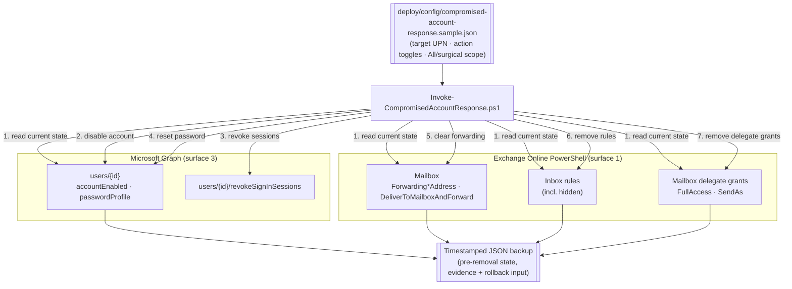

## 1. Scenario summary

Scripts the **containment** half of a confirmed mailbox compromise, as the deliberate,
**mutating** counterpart to this library's read-only `scenarios/audit/premium-audit-investigation/`.
From one config naming the target account, it: disables the Entra ID account, revokes all active
sign-in sessions/refresh tokens, resets the password, clears mailbox forwarding, removes Inbox rules
(including hidden ones), and removes non-owner mailbox delegate grants (`FullAccess`/`SendAs`), 
backing up everything it's about to change to a timestamped JSON evidence file first.

**Who it's for:** a SOC / incident-response administrator who has already confirmed (via
`premium-audit-investigation`, a Defender/Entra ID Protection alert, or a user report) that an
account is compromised and needs to shut down attacker access and persistence in one repeatable run,
instead of reconstructing the containment checklist from memory under incident pressure.

## 2. Business/regulatory driver

Business Email Compromise (BEC) is one of the most common and costly attack patterns against
Microsoft 365 tenants; Microsoft's own guidance frames rapid containment as the priority once a
compromise is suspected, "you need to block access to the account as soon as possible," because
attackers plant forwarding rules and delegate grants specifically to **regain control after the
obvious symptoms are cleaned up** [[1]](#references). Automating containment:

- **shortens time-to-contain**, the six-plus manual steps Microsoft documents run as one config-
  driven command instead of a checklist executed by hand mid-incident, when mistakes are most likely;
- **closes persistence gaps consistently**, hidden Inbox rules and delegate grants are easy to miss
  by hand (`Get-InboxRule` without `-IncludeHidden` silently omits attacker-hidden rules
  [[1]](#references)); a script never forgets the flag;
- **produces a defensible record**, the pre-removal export gives the case file (and, if needed,
  legal/regulatory breach-notification narrative) a concrete "what did we remove and when."

## 3. Prerequisites

Full licensing detail: `docs/licensing-matrix.md`. RBAC: `docs/rbac-model.md`. Automation surface:
`docs/automation-surface.md` (surfaces 1 and 3). Summary:

| Requirement | Minimum | Notes |
|---|---|---|
| License | Any Microsoft 365/Office 365 plan with Exchange Online + Entra ID, **no Purview Audit entitlement required** | Unlike its investigation sibling, this scenario doesn't call the Audit Search API; it's cataloged alongside it as the operate/incident-response counterpart |
| Graph permissions | `User.EnableDisableAccount.All` + `User.Read.All` (disable), `User.RevokeSessions.All` (revoke sessions), `User-PasswordProfile.ReadWrite.All` (password reset) | Least-privileged per-property grants [[2]](#references)[[3]](#references); Microsoft's own compromised-account article instead connects once with the broader `User.ReadWrite.All` [[1]](#references), either works, the table above is the least-privilege breakdown |
| Entra ID role (delegated) | **Privileged Authentication Administrator** to disable/reset an admin account; **User Administrator** is the least-privileged role for a non-admin account | `accountEnabled` and `passwordProfile` are both Microsoft Entra "sensitive properties", see [Who can perform sensitive actions](https://learn.microsoft.com/entra/identity/role-based-access-control/privileged-roles-permissions#who-can-perform-sensitive-actions) [[4]](#references) |
| Exchange Online role | **Mail Recipients** role (default in the **Recipient Management**/**Organization Management** role groups) | Covers `Set-Mailbox`, `Remove-InboxRule`, `Remove-MailboxPermission`, `Remove-RecipientPermission`, the exact cmdlet-to-role mapping isn't itemized on each cmdlet's own reference page; confirm with `Get-ManagementRoleEntry "*\Remove-InboxRule"` against your tenant before relying on this (VERIFY, §11) |
| Auth (this scenario) | `Connect-MgGraph -Scopes 'User.EnableDisableAccount.All','User.Read.All','User.RevokeSessions.All','User-PasswordProfile.ReadWrite.All'` **and** `Connect-ExchangeOnline` | Two surfaces, two sessions, the script opens neither; `docs/automation-surface.md` §3 |
| PowerShell modules | `Microsoft.Graph.Users`, `Microsoft.Graph.Users.Actions`, `ExchangeOnlineManagement` | `#Requires` lines in `deploy/Invoke-CompromisedAccountResponse.ps1` |

> Verify current role/permission names against `docs/rbac-model.md` (and your own tenant's role
> assignments) before a customer-facing deployment, Entra ID role names and Graph permission
> granularity have changed over time.

## 4. Architecture



Read-then-back-up-then-mutate, in that order, for every action, see `design.md` §3 for the full
surface/cmdlet table. Every mutating step is idempotent (skips what's already applied) and gated by
`-WhatIf`/`ShouldProcess`.

## 5. Step-by-step implementation

### Portal path (for a first manual walkthrough)

Follow Microsoft's own documented sequence directly, this scenario's script automates exactly these
steps [[1]](#references):

1. **Microsoft Entra admin center** → **Users** → the affected user → **Block sign-in** (disables the
   account), or use **Reset password** if you can't disable it yet.
2. **Microsoft Entra admin center** → the user → **Revoke sessions** (or the Graph/PowerShell
   equivalent below, there's no separate portal button beyond block-sign-in in some tenants).
3. **Microsoft Entra admin center** → the user → **Authentication methods**, review and remove any
   attacker-added MFA method (Step 3, not scripted, see `design.md` §7).
4. **Microsoft Entra admin center** → **Enterprise applications** → **Consent and permissions**, 
   review and revoke any suspicious app consent (Step 4, not scripted).
5. **Microsoft Entra admin center** → the user → **Assigned roles**, remove any role that shouldn't
   be there (Step 5, not scripted).
6. **Exchange admin center** → **Recipients** → the mailbox → **Mail flow settings**, clear
   forwarding; and → **Mailbox features** → review/remove Inbox rules and delegate access.

### Script path (repeatable, parameterized, `-WhatIf` preview)

```powershell
# Connect both surfaces first (the script opens neither)
Connect-MgGraph -Scopes 'User.EnableDisableAccount.All','User.Read.All','User.RevokeSessions.All','User-PasswordProfile.ReadWrite.All'
Connect-ExchangeOnline

# 0. Readiness check (both connections, config, current-state read)
./validate/Test-CompromisedAccountResponse.ps1 -ConfigPath ./deploy/config/compromise-jdoe.json

# 1. Preview every action this run would take - nothing is changed
./deploy/Invoke-CompromisedAccountResponse.ps1 -ConfigPath ./deploy/config/compromise-jdoe.json -WhatIf

# 2. Contain: backup -> disable -> revoke sessions -> reset password -> clear forwarding ->
#    remove Inbox rules -> remove delegate grants
./deploy/Invoke-CompromisedAccountResponse.ps1 -ConfigPath ./deploy/config/compromise-jdoe.json -BackupDir ./out/jdoe
```

## 6. Configuration reference

| Setting | Value this scenario uses | Notes |
|---|---|---|
| `targetUserPrincipalName` | the compromised account's UPN | Required |
| `actions.disableAccount` | `true`/`false` | `Update-MgUser -AccountEnabled $false` [[1]](#references)[[2]](#references), skipped if already disabled |
| `actions.revokeSessions` | `true`/`false` | `Revoke-MgUserSignInSession` [[1]](#references)[[5]](#references), always safe to re-run |
| `actions.resetPassword` | `true`/`false` | `Update-MgUser -PasswordProfile @{ForceChangePasswordNextSignIn=$true; Password=...}` [[1]](#references); new password printed once to console, never written to disk |
| `newPassword` | optional; generated if omitted | Never emailed to the user, hand off out-of-band [[1]](#references) |
| `actions.clearForwarding` | `true`/`false` | `Set-Mailbox -ForwardingAddress $null -ForwardingSmtpAddress $null -DeliverToMailboxAndForward $false` [[1]](#references)[[8]](#references), skipped if already clear |
| `inboxRules.mode` | `"All"` (default) or `"ByIdentity"` | `Get-InboxRule -IncludeHidden` to detect, `Remove-InboxRule` to remove [[1]](#references)[[9]](#references); design.md §4 on why "All" is the sensible default |
| `inboxRules.identities` | rule `Identity` values | Only used when `mode` is `"ByIdentity"` |
| `delegatePermissions.fullAccess` / `.sendAs` | `"All"` (default), `"None"`, or a trustee-identity array | `Get-MailboxPermission`/`Remove-MailboxPermission` and `Get-RecipientPermission`/`Remove-RecipientPermission` [[6]](#references)[[7]](#references), this scenario's own extension, `design.md` §5 |
| `backupDir` | output directory for the pre-removal JSON export | Default `./out`; treat as evidence, same handling as `premium-audit-investigation`'s exports |

## 7. Validation / how to prove it works

1. **Readiness**, `./validate/Test-CompromisedAccountResponse.ps1` confirms both Graph and Exchange
   Online connections, the required scopes/role access, and that the target account/mailbox resolve.
   Exits non-zero on failure.
2. **Dry run first**, `-WhatIf` prints every action it would take (current state + what would
   change) without touching the tenant; review it before the real run, especially the Inbox-rule and
   delegate-grant lists in `"All"` mode.
3. **Post-run state check**, re-run `Test-CompromisedAccountResponse.ps1` (or just the read-only
   detection half of the deploy script's own output) and confirm: `accountEnabled` is `false`,
   `signInSessionsValidFromDateTime` is more recent than the incident start, forwarding properties are
   blank, `Get-InboxRule -IncludeHidden` returns none (or only the explicitly-kept identities in
   surgical mode), and no non-owner `FullAccess`/`SendAs` grants remain.
4. **Idempotency**, re-running the same config a second time makes no further changes and reports
   every action as already-applied/skipped (no errors).
5. **Evidence check**, confirm the timestamped backup JSON under `backupDir` captures the pre-removal
   state (account, forwarding, every rule, every delegate grant) before trusting the run as
   reversible.

## 8. Operations & tuning

**Incident containment runbook:**
1. Confirm compromise first (this scenario assumes it, see `premium-audit-investigation` or your
   detection source). Don't run this against an account you're still triaging.
2. `-WhatIf` the run, review the printed Inbox-rule/delegate-grant lists for anything the investigator
   already knows is legitimate; switch to `"ByIdentity"`/an explicit trustee array if so.
3. Run for real. Record the printed generated password and relay it to the user **out-of-band**
   (phone, in person), never through the mailbox you just locked down [[1]](#references).
4. Complete Microsoft's Steps 3-5 manually (§5), MFA-registered-device review, OAuth app consent
   review, admin-role review, this script does not touch them (`design.md` §7).
5. Hand the backup JSON to the case file alongside any `premium-audit-investigation` export.
6. **Confirm the change independently, don't just trust the script's own success output**, search the
   audit log for the `Disable account.`/`Update user.` and `Set-Mailbox` operations this run should
   have produced (`Search-UnifiedAuditLog` or `premium-audit-investigation`'s own query), and check
   Entra ID sign-in logs for continued (now-failing) sign-in attempts against the account, ideally
   from the same suspicious IP the investigation flagged.
7. When the investigation concludes, follow Microsoft's own "after the investigation" steps: reset
   the password again, re-enable the account, and check the Restricted entities page if the mailbox
   was used to send spam [[1]](#references), see `rollback.md`.

**Governance:** running this script disables an account, invalidates its credential, and deletes mail
artifacts, the same power a rogue or compromised admin could abuse against an arbitrary user under
the pretext of "incident response." Restrict who holds the Entra ID roles in §3 (Privileged
Authentication Administrator especially), and treat every run, success or failure, as an event
worth alerting on in its own right (the audit records checked in step 6 above double as that alert
source).

**Tuning:** in a tenant with frequent false-positive compromise alerts, prefer `"ByIdentity"`/an
explicit trustee array over blanket `"All"` removal to avoid unnecessarily destroying legitimate
rules on a borderline call, see `design.md` §4 for the tradeoff this scenario's default makes.

## 9. Rollback / decommission

See `rollback.md`. This scenario is **destructive by design** (that's the point of containment), 
"rollback" means restoring specific pre-removal state from the backup JSON if the compromise call
turns out to be a false positive, and re-enabling the account once the investigation concludes.

## 10. Cost & licensing notes

- **No incremental license cost.** Every action uses baseline Exchange Online + Entra ID
  capabilities already included in any Microsoft 365/Office 365 plan, no Purview Audit entitlement,
  no add-on SKU (contrast `premium-audit-investigation`, which needs Audit Premium for crucial
  events).
- **Cost is investigator time and user disruption**, not a meter. Automating containment reduces the
  first; the account being unusable until the investigation concludes is an intentional, unavoidable
  cost of containment, not a defect.

## 11. Known limitations & gotchas

- **Destructive by design.** Unlike every read-only scenario in this library's `audit/` module, this
  one changes tenant state on purpose. Don't point it at an account until compromise is confirmed.
- **`"All"` mode removes legitimate rules and delegate grants too.** `design.md` §4 explains why this
  is the sensible default rather than a bug, a compromised mailbox's own rule history isn't a
  trustworthy source for "which rules are safe."
- **Steps 3-5 aren't scripted.** MFA-registered-device review, OAuth app consent review, and
  admin-role review are documented as manual portal follow-ups (§5, §8), this script's containment is
  incomplete without them for an account that had elevated access or registered MFA methods an
  attacker could have modified.
- **The generated password is shown once, in the console, and nowhere else.** If you lose it, run the
  script again (idempotent, a second password reset just rotates the credential again) rather than
  looking for it in a log or the backup file, where it deliberately isn't written.
- **VERIFY (your tenant), exact Exchange Online RBAC role for the mailbox cmdlets.** Microsoft's own
  reference pages for `Remove-InboxRule`, `Set-Mailbox`, `Remove-MailboxPermission`, and
  `Remove-RecipientPermission` state only "you need to be assigned permissions" without naming a
  specific role; this README's Prerequisites table names **Mail Recipients**
  (Recipient Management/Organization Management role groups) as the documented least-privilege
  candidate based on the general "Modify existing mail users and mail contacts" role description
  [[10]](#references), not a per-cmdlet confirmation. Confirm with
  `Get-ManagementRoleEntry "*\<CmdletName>"` against your tenant before relying on a narrower role
  than Organization Management.
- **VERIFY (your tenant), Exchange Online RBAC propagation delay.** Newly assigned Exchange Online
  roles can take time to propagate; if a mutating call fails with an access-denied error immediately
  after granting a role, wait and retry before assuming the role mapping above is wrong.
- **`Get-RecipientPermission` vs. `Get-EXORecipientPermission`.** Microsoft recommends the REST-backed
  `Get-EXORecipientPermission` cmdlet over the classic `Get-RecipientPermission` in Exchange Online
  PowerShell [[7]](#references); this scenario's detection step still uses `Get-RecipientPermission`
  for symmetry with `Remove-RecipientPermission` (which has no `EXO`-prefixed counterpart), see the
  script's `.NOTES`.
- **Password complexity/history is enforced server-side.** A generated password that fails your
  tenant's password policy or reuse restriction causes `Update-MgUser` to fail with an error; the
  script does not pre-validate against policy, re-run with a different `newPassword` if that happens.
- **The printed password can leak through session recording, not just the backup file.** The script
  never writes the password to disk, but `Write-Host` output can still be captured by a PowerShell
  transcript (`Start-Transcript`), a CI/CD job log, or a recorded terminal session if the operator has
  one of those running. Disable transcript/session logging before the password-reset step, or redirect
  that one line to an already-secured channel, if your environment normally records console output.
- **Mailbox-level scope only.** This scenario cleans up per-mailbox persistence (forwarding, Inbox
  rules, delegate grants). A compromise that also reaches organization-wide mail flow (transport
  rules, inbound connectors) is out of scope, see the on-premises/tenant-wide connector-hardening
  scenarios elsewhere in this library's `dlp/` and `adaptive-protection/` modules for that surface.
- **Overlaps, but doesn't replace, Microsoft Entra ID Protection's automatic risk remediation.** A
  Microsoft Entra ID P2 (or Suite) tenant with risk-based Conditional Access can already force a
  secure password change or block access automatically when a user is flagged as risky, including
  automatic session revocation [[11]](#references), the identity half of Steps 1/2. This scenario adds
  value where ID Protection's remediation doesn't reach: the mailbox-level cleanup (forwarding, Inbox
  rules, delegate grants) in Step 6, and a scripted path for tenants without ID Protection P2, or for
  a manually-confirmed compromise that automatic risk detection didn't itself flag.

## 12. References

1. Respond to a compromised cloud email account (the six-step containment playbook this scenario
   automates: disable account, revoke sessions, review MFA devices, review app consent, review admin
   roles, review mail forwarders/Inbox rules), <https://learn.microsoft.com/defender-office-365/responding-to-a-compromised-email-account>
2. Update user (`accountEnabled`, `passwordProfile` properties; least-privileged permissions per
   property), <https://learn.microsoft.com/graph/api/user-update?view=graph-rest-1.0>
3. Manage passwords with Microsoft Graph PowerShell (`Update-MgUser -PasswordProfile` worked example), <https://learn.microsoft.com/microsoft-365/enterprise/manage-passwords-with-microsoft-365-powershell?view=o365-worldwide>
4. Privileged roles and permissions in Microsoft Entra ID, who can perform sensitive actions / who
   can reset passwords, <https://learn.microsoft.com/entra/identity/role-based-access-control/privileged-roles-permissions>
5. revokeSignInSessions action (`Revoke-MgUserSignInSession`; `User.RevokeSessions.All`), <https://learn.microsoft.com/graph/api/user-revokesigninsessions?view=graph-rest-1.0>
6. Manage permissions for recipients in Exchange Online (`Add-MailboxPermission`/`Remove-MailboxPermission` for FullAccess), <https://learn.microsoft.com/exchange/recipients-in-exchange-online/manage-permissions-for-recipients>
7. Remove-RecipientPermission (SendAs removal; recommends `Get-EXORecipientPermission` over
   `Get-RecipientPermission`), <https://learn.microsoft.com/powershell/module/exchangepowershell/remove-recipientpermission?view=exchange-ps>
8. Set-Mailbox (`ForwardingAddress`, `ForwardingSmtpAddress`, `DeliverToMailboxAndForward`), <https://learn.microsoft.com/powershell/module/exchangepowershell/set-mailbox?view=exchange-ps>
9. Remove-InboxRule / Get-InboxRule (`-IncludeHidden`), <https://learn.microsoft.com/powershell/module/exchangepowershell/remove-inboxrule?view=exchange-ps>
10. Permissions in Exchange Online, roles and role groups (**Mail Recipients** role;
    **Recipient Management**/**Organization Management** role groups), <https://learn.microsoft.com/exchange/permissions-exo/permissions-exo>
11. Risk-based access policies, Microsoft Entra ID Protection automatic risk remediation (require
    password change, block access, session revocation), <https://learn.microsoft.com/entra/id-protection/concept-identity-protection-policies>

> Re-verify all links, cmdlet syntax, and role/permission names against current Microsoft Learn before
> a customer-facing deployment. This scenario is destructive by design once run for real, always
> `-WhatIf` first.
