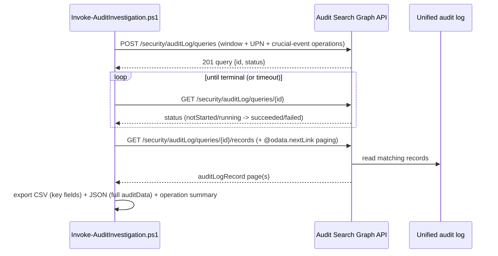

## 1. Problem statement

When an account is compromised or an insider is suspected, an investigator needs to reconstruct that
account's activity — mailbox access, sending/impersonation, inbox-rule and delegate changes, file
exfiltration, sign-ins, privilege changes — quickly, completely, and defensibly. Doing this by hand
in the portal, one search at a time under incident pressure, is slow and inconsistent. This scenario
automates a **read-only** audit-log investigation: from a config, it runs a curated crucial-events
query via the Audit Search Graph API, waits for it, and exports the records for the case file — the
same way every time.

## 2. Design goals

1. **Fast, consistent triage.** One config → one command → a curated crucial-events export. Re-running
   the same config reproduces the same evidence set (audit records are immutable).
2. **Read-only and safe.** The scenario only searches and exports already-recorded events; it never
   changes mailbox, identity, or policy state. `-WhatIf` previews the query without creating the job.
3. **Scale via async + paging.** Use the async query API and follow `@odata.nextLink` so large
   investigations don't truncate (the classic cmdlet caps at 50,000 records).
4. **Evidence-grade output.** Export a triage CSV (key fields) and a full JSON (`auditData`), with the
   output treated as sensitive evidence.
5. **Exploit Premium where it matters.** Center the preset on crucial events like `MailItemsAccessed`
   (Premium-only) and lean on Premium's longer retention window.

## 3. Why the Audit Search Graph API (not Search-UnifiedAuditLog)

Two surfaces read the unified audit log:
- **`Search-UnifiedAuditLog`** (Exchange Online PowerShell) is the classic, synchronous surface. It
  works and is great for quick ad-hoc checks, but it returns ≤5,000 records per call (50,000 max per
  search with paging), is delegated-only in practice, and blocks the session while it runs.
- **The Audit Search Graph API** (`/security/auditLog/queries`, v1.0 `security` namespace) is the
  modern surface: an **async job** you poll, with server-side execution (survives a closed session),
  proper **paging** over records, **app-only** auth for unattended/scheduled hunts, and fine-grained
  **service-scoped permissions** (`AuditLogsQuery-Exchange.Read.All`, etc.). Those properties — scale,
  paging, app-only, least-privilege scoping — are exactly what a repeatable investigation workflow
  needs, so this scenario uses the Graph API and notes the cmdlet as the classic alternative.

## 4. Workflow

The job is asynchronous by design — Microsoft runs it server-side so it survives a closed session.
The script polls the status until it leaves the running set, then pages all records before exporting.

## 5. The crucial-events preset

The default `operationFilters` is an account-compromise triage preset, chosen to map onto the attack
techniques an investigator most needs to see:

| Technique | Operations |
|---|---|
| Mailbox reading (what was seen) | `MailItemsAccessed` *(Premium crucial event)* |
| Sending / impersonation | `Send`, `SendAs`, `SendOnBehalf` |
| Persistence via mail flow | `New-InboxRule`, `Set-InboxRule`, `UpdateInboxRules`, `Add-MailboxPermission` |
| Exfiltration / oversharing | `FileDownloaded`, `FileSyncDownloadedFull`, `AnonymousLinkCreated`, `SharingInvitationCreated` |
| Access | `UserLoggedIn`, `UserLoginFailed` |
| Privilege / identity change | `Add member to role.`, `Update user.` |

The preset is a starting point, not a fixed control — investigators trim or extend it per incident.
`MailItemsAccessed` is explicitly a Premium crucial event, which is why this scenario is framed as
"Premium."

## 6. Key decisions

| Decision | Choice | Rationale |
|---|---|---|
| Surface | Audit Search Graph API (async), Graph PowerShell SDK | Scale, paging, app-only auth, service-scoped permissions (§3) |
| Read-only posture | No tenant mutation; `-WhatIf` previews the query | An investigation must not alter what it investigates |
| Date range | `lookbackDays` relative, or explicit ISO dates | Convenient default + precise control; Premium retention widens the window |
| Output | CSV (key fields) + JSON (full `auditData`) | Triage-friendly + deep-analysis-complete; both timestamped |
| Polling | Until status leaves the running set, with a timeout | Async jobs need bounded waiting; unknown terminal values handled defensively (VERIFY) |
| Preset | Account-compromise crucial events, incl. `MailItemsAccessed` | Maps to real BEC/insider techniques; Premium-centered |

## 7. Non-goals

- **Responding/remediating** (disabling the account, revoking sessions, deleting malicious rules) —
  this scenario investigates; response is a separate, mutating workflow (and a different tool).
- **Real-time alerting / SIEM streaming** — for continuous streaming use the Office 365 Management
  Activity API or a Sentinel connector; this is an on-demand investigation.
- **Retention-policy configuration** — creating audit log **retention policies** (a Premium feature)
  is a separate scenario; here retention is a prerequisite/《given》.
- **The classic `Search-UnifiedAuditLog` path** — noted as the alternative surface (§3), not the one
  this scenario scripts.
- **Deleting/managing saved queries at scale** — the scenario runs investigations; saved-query
  lifecycle (jobs auto-retain 30 days) is left to the portal.
