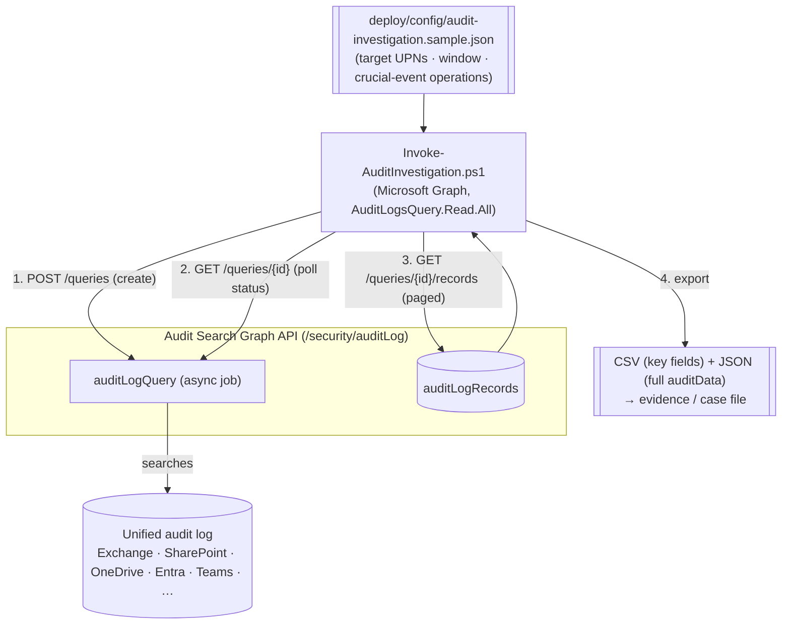

## 1. Scenario summary

Runs a **read-only forensic investigation** of a potentially compromised (or insider-risk) account
using the Microsoft Purview **Audit Search Graph API** (v1.0 `security` namespace): it creates an
async audit-log query scoped to a target user, a time window, and a curated set of **crucial events**
(mailbox access, sending/impersonation, malicious inbox rules and delegate grants, file
download/oversharing, sign-ins, and privilege/identity changes), waits for the job to complete,
retrieves the records (paged), and **exports** them to CSV and JSON for the case file. The whole
investigation is driven by a version-controlled config so triage runs are consistent and repeatable
across incidents.

**Who it's for:** a SOC / incident-response / insider-risk / compliance investigator who needs to
reconstruct "what did this account do" quickly and defensibly, and wants the audit-search-and-export
mechanics automated (and re-runnable) rather than hand-clicked in the portal under time pressure.

## 2. Business/regulatory driver

When an account is compromised or an insider is suspected, the audit log is the primary source of
truth: it "captures, records, and retains thousands of user and admin operations" so security ops,
IT, insider-risk, and legal teams can reconstruct activity [[1]](#references). Speed and completeness
matter — breach-notification clocks (GDPR 72 hours, many U.S. state laws, sector rules) start early,
and regulators/insurers expect a defensible investigation record. Automating the search-and-export:
- **shortens time-to-triage** — a curated crucial-events query runs in one command instead of many
  portal searches;
- **is consistent and defensible** — the same config produces the same scoped investigation, with an
  exported evidence set, every time;
- **exploits Audit (Premium)** — Premium unlocks **crucial events** such as **`MailItemsAccessed`**
  (which mailbox items an attacker actually read — central to scoping a BEC/mailbox compromise) and
  **long retention** (up to 1 year, 10 years with the add-on) so investigations can reach back far
  enough [[2]](#references)[[3]](#references).

## 3. Prerequisites

Full licensing detail: `docs/licensing-matrix.md`. RBAC: `docs/rbac-model.md`. Automation surface:
`docs/automation-surface.md` (surface 3 — Microsoft Graph). Summary:

| Requirement | Minimum | Notes |
|---|---|---|
| Audit tier | **Audit (Standard)** for search/export + Graph API + 180-day retention; **Audit (Premium)** for crucial events (`MailItemsAccessed`), 1-year (10-year add-on) retention, high-bandwidth API | Premium comes with M365/O365 E5, Purview Suite, or the E5 eDiscovery & Audit add-on [[2]](#references)[[3]](#references) |
| Graph permission | **AuditLogsQuery.Read.All** (all workloads), or a service-scoped variant (`AuditLogsQuery-Exchange.Read.All`, `-SharePoint.Read.All`, `-Entra.Read.All`, …) | Delegated or Application; least-privileged is `AuditLogsQuery-Entra.Read.All` [[4]](#references) |
| Auth (this scenario) | `Connect-MgGraph -Scopes 'AuditLogsQuery.Read.All'` (delegated) or app-only certificate | Microsoft Graph PowerShell SDK — `docs/automation-surface.md` §3 |
| Classic alternative role | **View-Only Audit Logs** / **Audit Logs** (for `Search-UnifiedAuditLog`) | The classic EXO cmdlet path — see §11 |
| Auditing enabled | On by default; individual services (e.g. Power BI) may need auditing turned on | Record availability is typically 60–90 min after an event [[5]](#references) |

> Verify current entitlement names against `docs/licensing-matrix.md` (dated 2026-09-02) and the
> Product Terms before a sales commitment — SKU names and the crucial-events list change.

## 4. Architecture



The query is an **async job**: create it, poll until its status is terminal, then page the records.
The export is the deliverable — a timestamped CSV (triage-friendly key fields) plus JSON (the full
`auditData` per record for deep analysis). Read-only throughout — no tenant state changes. Full
rationale: `design.md`.

## 5. Step-by-step implementation

### Portal path (for a first manual walkthrough)

1. In the [Microsoft Purview portal](https://purview.microsoft.com) → **Audit** → **New search**
   [[5]](#references).
2. Set the **date range**, **users** (the target UPN), and **activities** (the crucial events), then
   **Search**. The job runs server-side and is kept for 30 days [[6]](#references).
3. When it completes, review results and **Export** to CSV [[7]](#references).

### Script path (repeatable, parameterized, `-WhatIf` preview)

```powershell
# Connect (delegated - or app-only with a certificate)
Connect-MgGraph -Scopes 'AuditLogsQuery.Read.All'

# 0. Readiness check (connectivity, scope, config, + a live probe query)
./validate/Test-AuditInvestigation.ps1 -ConfigPath ./deploy/config/compromise-jdoe.json

# 1. Preview the query body (creates nothing)
./deploy/Invoke-AuditInvestigation.ps1 -ConfigPath ./deploy/config/compromise-jdoe.json -WhatIf

# 2. Run the investigation: create query -> poll -> retrieve -> export CSV/JSON
./deploy/Invoke-AuditInvestigation.ps1 -ConfigPath ./deploy/config/compromise-jdoe.json -OutDir ./out/jdoe
```

The script uses the **Audit Search Graph API** (v1.0 `security` namespace) via the Microsoft Graph
PowerShell SDK (`Invoke-MgGraphRequest`) — automation surface 3 per `docs/automation-surface.md`.

## 6. Configuration reference

| Setting | Value this scenario uses | Notes |
|---|---|---|
| Create query | `POST /security/auditLog/queries` | Async job; body below [[4]](#references) |
| Poll | `GET /security/auditLog/queries/{id}` | Read `status` until terminal |
| Records | `GET /security/auditLog/queries/{id}/records` | Paged via `@odata.nextLink` [[8]](#references) |
| `displayName` | investigation label | Optional |
| `filterStartDateTime` / `filterEndDateTime` | ISO 8601 UTC, or derived from `lookbackDays` | The window; Premium retention lets it reach back up to 1 year [[3]](#references) |
| `userPrincipalNameFilters[]` | the target account(s) | The "who" |
| `operationFilters[]` | crucial-events preset (MailItemsAccessed, Send/SendAs, New-/Set-InboxRule, Add-MailboxPermission, FileDownloaded, AnonymousLinkCreated, UserLoggedIn/UserLoginFailed, role/user changes) | The "what" — trim to the incident [[9]](#references) |
| `recordTypeFilters[]` | optional workload filter | e.g. `exchangeItem`, `sharePointFileOperation`, `azureActiveDirectory` [[4]](#references) |
| `keywordFilter`, `ipAddressFilters[]`, `objectIdFilters[]` | optional | Non-indexed keyword; source IP; file/object path [[4]](#references) |
| Export | CSV (key fields) + JSON (full `auditData`) | Timestamped under the output dir |

Record fields exported (CSV): `createdDateTime, userPrincipalName, userId, operation, service,
auditLogRecordType, clientIp, objectId`; JSON keeps the full record incl. `auditData`
[[8]](#references). Exact bodies and Learn sources are in the script `.NOTES`.

## 7. Validation / how to prove it works

1. **Readiness** — `./validate/Test-AuditInvestigation.ps1` confirms Graph connectivity, an
   `AuditLogsQuery*` scope, a well-formed config, and runs a **1-hour probe query** that proves the
   API + permission + audit availability end-to-end. Exits non-zero on failure.
2. **Known-event test** — perform a benign, identifiable action as a test user (e.g. create and
   delete an inbox rule), wait ~60–90 minutes for ingestion [[5]](#references), then run the
   investigation scoped to that user/operation and confirm the record appears in the export.
3. **Completeness/paging** — for a broad query, confirm the exported record count matches the portal
   search count and that paging followed `@odata.nextLink` (no silent truncation).
4. **Crucial-event (Premium) test** — for a Premium-licensed user, confirm `MailItemsAccessed`
   records are returned (they are not available under Standard) — evidence the Premium tier is active
   [[2]](#references).
5. **Repeatability** — re-run with the same config/window and confirm the same record set (audit
   records are immutable), demonstrating the investigation is reproducible for the case file.

## 8. Operations & tuning

**Investigation runbook (suspected account compromise):**
1. Scope tight first — run with the target UPN + the crucial-events preset over the suspected window.
2. Triage the CSV: look for **`New-InboxRule`/`UpdateInboxRules`** (auto-forward/hide — classic BEC),
   **`Add-MailboxPermission`/`SendAs`** (delegate abuse), **`MailItemsAccessed`** (what was read),
   **`FileDownloaded`/`AnonymousLinkCreated`** (exfil/oversharing), and **`UserLoginFailed` →
   `UserLoggedIn`** patterns with unusual `clientIp`.
3. Pivot: widen to related users/IPs/objects found in step 2 with follow-on queries.
4. Preserve: keep the JSON export as evidence; if litigation is anticipated, hand off to the
   eDiscovery legal-hold scenario in this library.

**Tuning / limits:** broad operation sets over long windows return large result sets and slower jobs;
each admin can run up to **10 search jobs** concurrently (one unfiltered) [[6]](#references). Prefer
narrow, iterative queries. Record availability lags events by ~60–90 minutes [[5]](#references), so
don't conclude "no activity" immediately after an incident.

**Automation:** run app-only (certificate) on a schedule for recurring hunts (e.g. daily
mailbox-rule-creation sweep), writing exports to a secured evidence store.

## 9. Rollback / decommission

See `rollback.md`. This scenario is **read-only** — it creates a transient search job and reads
records; there is no tenant state to undo. The only cleanup is the **exported evidence files** (secure
and dispose per your IR data-handling policy) and, optionally, deleting the saved query. Completed
search jobs are retained by the service for 30 days [[6]](#references).

## 10. Cost & licensing notes

- **Per-user entitlement, no consumption meter.** Audit search/export and the Graph API are included
  in the audit entitlement; **crucial events + long retention are the Premium (E5/Suite) delta**
  [[2]](#references)[[3]](#references). No Azure PAYG meter for running queries.
- **10-year retention is an add-on.** Reaching back beyond 1 year needs the 10-Year Audit Log
  Retention add-on license per user [[3]](#references).
- **Cost is investigator time + evidence storage.** Automation cuts the search labor; secure storage
  and handling of exported PII/sensitive records is the ongoing cost and risk to plan for.

## 11. Known limitations & gotchas

- **Read-only, but the output is sensitive.** The investigation changes nothing in the tenant, yet
  the **export can contain highly sensitive content and PII** (subjects, file paths, IPs, and
  workload `auditData`). Treat the output directory as evidence: restrict access, store per IR
  policy, and dispose when the matter closes (`rollback.md`).
- **VERIFY — audit query status enum.** The script polls until the status leaves the running set
  (`notStarted/running/queued/inProgress`) and expects a `succeeded`-like terminal value before
  reading records; confirm the exact `auditLogQueryStatus` values for your tenant/region
  [[4]](#references).
- **Ingestion latency.** Records typically appear 60–90 minutes after the event (longer for some
  services) — "no results" right after an incident may just mean the data hasn't landed
  [[5]](#references).
- **Crucial events need Premium.** `MailItemsAccessed` and other crucial events are **not** available
  under Audit (Standard), and only for appropriately-licensed users — a Standard-only tenant will get
  an incomplete picture of mailbox access [[2]](#references).
- **Retention boundary.** Queries can't return data older than the user's retention (180 days
  Standard; up to 1 year Premium; 10 years with the add-on) [[3]](#references).
- **Concurrency/size limits.** Up to 10 concurrent jobs per admin (one unfiltered); very broad
  queries are slow and large [[6]](#references). The classic `Search-UnifiedAuditLog` caps at 50,000
  records per search — the Graph API is the better path for large investigations [[10]](#references).
- **Classic alternative.** `Search-UnifiedAuditLog` (EXO PowerShell, View-Only Audit Logs role) is the
  synchronous classic surface; this scenario uses the async Graph API for scale, paging, and app-only
  auth — see `design.md` [[10]](#references).
- **Region availability.** The Audit Search Graph API is available in the global/GCC deployments noted
  on the reference pages; confirm availability for sovereign clouds before relying on it
  [[4]](#references).

## 12. References

1. Learn about auditing solutions in Microsoft Purview (overview) — <https://learn.microsoft.com/purview/audit-solutions-overview>
2. Auditing solutions — Audit (Standard) vs (Premium) capability comparison (crucial events, retention) — <https://learn.microsoft.com/purview/audit-solutions-overview#comparison-of-key-capabilities>
3. Microsoft Purview service description — Audit (Premium) (1-year/10-year retention, crucial events, high-bandwidth API) — <https://learn.microsoft.com/office365/servicedescriptions/microsoft-365-service-descriptions/microsoft-365-tenantlevel-services-licensing-guidance/microsoft-purview-service-description#microsoft-purview-audit-premium>
4. Create auditLogQuery (`POST /security/auditLog/queries`; body fields; recordTypeFilters enum; AuditLogsQuery permissions) — <https://learn.microsoft.com/graph/api/security-auditcoreroot-post-auditlogqueries?view=graph-rest-1.0>
5. Search the audit log — before you search (ingestion latency, Search-UnifiedAuditLog) — <https://learn.microsoft.com/purview/audit-search#before-you-search-the-audit-log>
6. Search the audit log (server-side jobs, 30-day retention of jobs, 10 concurrent per admin) — <https://learn.microsoft.com/purview/audit-search>
7. Export audit records — <https://learn.microsoft.com/purview/audit-log-export-records>
8. List auditLogRecords (`GET /security/auditLog/queries/{id}/records`; record fields) — <https://learn.microsoft.com/graph/api/security-auditlogquery-list-records?view=graph-rest-1.0>
9. Audit log activities (operation/activity names) — <https://learn.microsoft.com/purview/audit-log-activities>
10. Search-UnifiedAuditLog (classic EXO cmdlet; 5,000/search default, 50,000 max; roles) — <https://learn.microsoft.com/powershell/module/exchange/search-unifiedauditlog>

> Re-verify all links, the API version, request/response shapes, the status enum, and the crucial-
> events/licensing details against current Microsoft Learn before a customer-facing deployment. The
> investigation is read-only; the exported evidence is sensitive — handle it accordingly.
