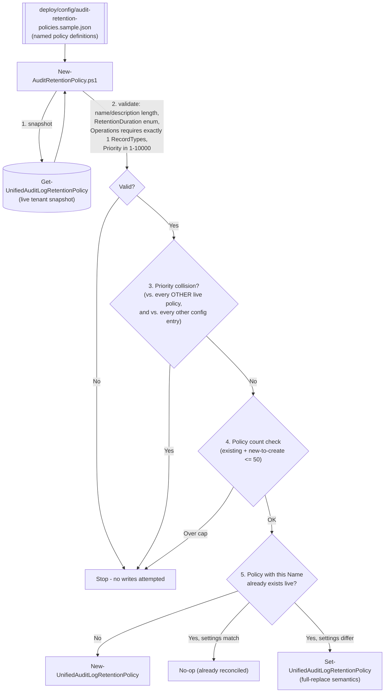

## 1. Problem statement

Microsoft Purview Audit (Premium) gives every appropriately-licensed organization a **default**
audit log retention policy: Microsoft Entra ID, Exchange, OneDrive, and SharePoint audit records
are retained for one year automatically, and everything else defaults to 180 days. That default is
tenant-wide, un-editable, and often wrong for a specific buyer's needs in two directions at once:

- **Too short** for a workload or a specific set of users the default doesn't cover at all (Teams,
  Power BI, Dynamics 365, third-party connectors, or any other non-Entra/Exchange/OneDrive/
  SharePoint workload) or where a regulatory/legal-hold driver needs longer retention than the
  180-day fallback.
- **Too long/expensive to search** for high-volume, low-investigative-value activity (a noisy
  service-account operation, a chatty automated process) that a buyer would rather retain for a
  shorter, cheaper, faster-to-search window.

[`audit/premium-audit-investigation`](/scenarios/audit/premium-audit-investigation/) already assumes the data it searches is still
retained when an investigator needs it. This scenario is the **configuration counterpart**: it
authors the custom audit log retention policies that make that assumption true for the workloads,
users, and activities a buyer actually cares about, using the same automation-first,
version-controlled-config pattern as every other scenario in this library.

## 2. Design goals

1. Manage **multiple named policies as one reconciled set**, driven by a version-controlled JSON
   config — not a single ad hoc `New-UnifiedAuditLogRetentionPolicy` call — because a real
   deployment is rarely just one policy, and Microsoft caps an organization at **50** audit log
   retention policies total, making "what do we already have, and does this collide with it"
   a first-class concern the script must check, not the operator.
2. Idempotent, full reconciliation: running the script twice with the same config must not error
   and must not create a duplicate policy. Because `Set-UnifiedAuditLogRetentionPolicy`'s
   `-Operations`/`-RecordTypes`/`-UserIds` are documented **overwrite** semantics (the values you
   specify replace any existing entries, not merge with them), a get-or-create-then-set pattern is
   both idempotent and correctly self-healing if a policy's live settings drift from the config.
3. Enforce the two hard tenant-wide constraints Microsoft documents **before** attempting a write,
   not after a cmdlet throws: **Priority must be globally unique** across every custom policy in
   the tenant (not just this config file), and the **total policy count must not exceed 50**. Both
   are checked pre-flight against a live `Get-UnifiedAuditLogRetentionPolicy` snapshot.
4. Ship a dry-run path (`-WhatIf`, `SupportsShouldProcess`) that reports every create/update it
   would perform, with no tenant-state change — matching `AGENTS.md` §4 and every other scenario in
   this repo.
5. Be explicit about the one governing constraint this design **cannot** work around: the
   PowerShell `-RetentionDuration` enum (`ThreeMonths`/`SixMonths`/`NineMonths`/`TwelveMonths`/
   `TenYears`) is narrower than the portal's duration picker (adds `7 Days`/`30 Days`/`3 Years`/
   `5 Years`/`7 Years`) — confirmed by directly comparing the official `New-`/
   `Set-UnifiedAuditLogRetentionPolicy` cmdlet references against the official
   `audit-log-retention-policies` conceptual page, both fetched during this build (not a VERIFY —
   both sources are Microsoft Learn, and they disagree on cmdlet surface vs. portal surface, not on
   a fact either page states inconsistently with itself). A buyer who needs one of those five
   durations must use the portal for that specific policy; this script cannot create or edit it.

## 3. Why Security & Compliance PowerShell (not Graph, not the portal only)

- Audit log retention policy objects (`UnifiedAuditLogRetentionPolicy`) are Security & Compliance
  PowerShell objects — `New-`/`Set-`/`Get-`/`Remove-UnifiedAuditLogRetentionPolicy` — automation
  surface 2 per `docs/automation-surface.md` §1, the same surface every DLP/DLM/records-management
  scenario in this library already uses. No Microsoft Graph endpoint for this object was found
  during this build's grounding pass (the sibling `premium-audit-investigation` scenario's own
  Graph surface, the Audit Search Graph API, is a different object entirely — it *searches* the
  audit log, it does not configure how long records are *kept*).
- The portal ("Create audit retention policy" flyout, **Audit** solution → **Audit retention
  policies** dashboard) is the only surface that exposes the five durations PowerShell's enum
  doesn't (§2 point 5) — but it authors one policy at a time, by hand, with no config-as-code
  audit trail. A buyer managing more than a handful of policies, or wanting the same reviewable,
  re-runnable deployment discipline as every other control in this library, needs the scripted
  path for the four durations it *does* cover.
- Microsoft's own documentation states the inverse constraint too: a policy created via
  `New-UnifiedAuditLogRetentionPolicy` for a record type/activity combination **not available in
  the portal's own policy-creation tool becomes portal-view-and-delete-only** — it can no longer be
  *edited* from the dashboard, only from `Set-UnifiedAuditLogRetentionPolicy`. This is a real
  operational trap for a buyer who scripts a policy today and expects a portal admin to be able to
  tune it tomorrow — called out explicitly in `README.md` §8 and §11.

## 4. Reconciliation logic

Every entry in the config is validated and cross-checked **before any cmdlet runs** — a single bad
entry (a duplicate priority, an `Operations` value paired with two `RecordTypes`) stops the whole
run rather than partially applying a config and leaving the tenant in a mixed state.

## 5. Key decisions

| Decision | Choice | Rationale |
|---|---|---|
| Deploy surface | Security & Compliance PowerShell (`Connect-IPPSSession`) | §3 — the only automation surface for this object. |
| Config shape | A JSON array of named policy definitions, reconciled as a set | Matches the tenant-wide 50-policy cap and global-priority-uniqueness constraint — both are set-level properties, not single-policy properties, so a set-level config and a set-level pre-flight check are the natural fit. |
| Idempotency mechanism | Get-by-`-Identity` (Name) → compare → `Set-` (full replace) or `New-` | `Set-`'s documented overwrite semantics make "re-apply the whole config" both idempotent and self-healing against drift, without needing a separate diff/patch mechanism. |
| Priority handling | Required, explicit, per-entry in the config — **not** auto-assigned | Auto-incrementing priority risks silently reordering an existing policy's effective precedence on a re-run, which is a change with real data-retention consequences the operator must decide, not the script. |
| `TenYears` license check | Documented as a manual prerequisite, not verified in-script | No cmdlet or Graph endpoint was found during this build's grounding pass that reports whether a specific user holds the 10-Year Audit Log Retention add-on; fabricating a check against an unconfirmed API would violate `AGENTS.md` §4. `README.md` §3/§11 flag this as a manual confirmation step instead. |
| The 5 portal-only durations (`7 Days`/`30 Days`/`3 Years`/`5 Years`/`7 Years`) | Explicitly out of scope for this script; documented, not silently dropped | §2 point 5 — a real, sourced gap between the PowerShell surface and the portal surface, not something this design can close by inventing an unconfirmed enum value. |

## 6. Data flow

`New-AuditRetentionPolicy.ps1` never touches audit *records* — it only authors the **policy
objects** that govern how long records already flowing into the unified audit log are kept. Per
Microsoft's own documentation, a policy's effect on retention is evaluated **when an audit item
enters the auditing pipeline**, based on the licensing defaults or the applicable policy at that
time; a later policy change "changes the expiration time of the audit data after updating," but
the same source also states such changes "don't update any previously committed items" — an
internally ambiguous pair of statements in Microsoft's own conceptual page that this build could
not resolve to one precise, unambiguous rule. `README.md` §11 flags this explicitly as a
**VERIFY** (confirm the actual retroactive-vs-forward-only behavior for an edited policy against a
pilot tenant) rather than asserting either reading as fact.

## 7. Non-goals

- This scenario does not create the **default** Audit (Premium) retention policy — it's automatic,
  tenant-wide, and Microsoft explicitly states it can't be modified (only shortened for specific
  users via a custom policy, which this script *can* author).
- This scenario does not create or manage the **10-Year Audit Log Retention add-on** license
  assignment itself — that's a licensing/assignment action in the Microsoft 365 admin center, a
  dependency this scenario assumes is already in place for any `TenYears` policy (§5).
- This scenario does not script the five portal-only durations (`7 Days`/`30 Days`/`3 Years`/
  `5 Years`/`7 Years`) — no PowerShell path for them was found; see §2 point 5 and `README.md` §11.
- This scenario does not perform the **search** half of the audit story — that's
  [`audit/premium-audit-investigation`](/scenarios/audit/premium-audit-investigation/), which this scenario is the retention-side
  companion to, not a replacement for.
- This scenario does not implement a "disable without delete" state. Unlike this library's DLP/DLM
  scenarios (which stage `TestWithNotifications` → `Enable`), Microsoft documents no `-Enabled`/
  `Mode` parameter for `UnifiedAuditLogRetentionPolicy` objects — the only lifecycle actions are
  create, edit, and delete. `README.md` §9/§11 and `rollback.md` treat deletion as the only "off"
  switch.
