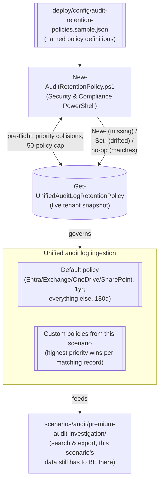

## 1. Scenario summary

Creates and manages **custom Microsoft Purview audit log retention policies**, extending
retention beyond the tenant's automatic one-year Entra/Exchange/OneDrive/SharePoint default (e.g.
to Microsoft Teams, or to a specific regulated user group) and shortening it for noisy,
low-investigative-value activity, as a version-controlled, idempotently-reconciled set, using
Security & Compliance PowerShell.

**Who it's for:** an org that has run `scenarios/audit/premium-audit-investigation/` (or plans to)
and needs the data that investigation searches to actually still be *retained* when it's needed, 
plus any compliance/records team that wants an as-code, reviewable definition of "how long do we
keep which audit activity" instead of a set of hand-clicked portal policies nobody has a change
log for.

## 2. Business/regulatory driver

Audit records are worthless to an investigator, an auditor, or a regulator if they've already
expired. Retention duration is itself a compliance control, referenced (without a specific number)
by GDPR Article 5(1)(e) (storage limitation, cuts both ways: keep long enough to investigate, not
indefinitely for its own sake), HIPAA's six-year documentation-retention expectation, PCI DSS
Requirement 10 (audit trail retention, at minimum, PCI DSS explicitly expects audit trail history
availability for at least one year, with three months immediately available for analysis), and
SOC 2 CC7 (monitoring). Two concrete drivers this scenario addresses directly:

- **Closing the Teams gap.** Audit (Premium)'s default one-year retention policy covers only
  Entra ID, Exchange, OneDrive, and SharePoint. Microsoft Teams, a primary channel for regulated
  communication in many of this library's buyer profiles (see
  `scenarios/dlp/pci-teams-exfil-block/`, `scenarios/communication-compliance/
  harassment-and-code-of-conduct/`), silently falls back to the 180-day default unless a custom
  policy extends it. A buyer who has deployed Teams-focused DLP/Communication Compliance controls
  but never extended Teams' own audit retention has a real gap between "we can detect this" and
  "we can still prove it happened three months from now."
- **Cost/noise control.** Audit storage and search performance both benefit from *not* retaining
  every high-volume, low-value operation (a service account's routine search queries, for example)
  at the full default duration. A shorter, deliberate retention window for specifically-identified
  noisy activity is a legitimate, documented use of this same mechanism, not a compliance
  shortcut, since it only ever shortens retention *below* what a workload already gets by default,
  never below any applicable legal-hold or regulatory floor the buyer must separately track.

## 3. Prerequisites

Full licensing detail: `docs/licensing-matrix.md`. RBAC: `docs/rbac-model.md`. Automation surface:
`docs/automation-surface.md` (surface 2, Security & Compliance PowerShell). Summary:

| Requirement | Minimum | Notes |
|---|---|---|
| Audit tier | **Audit (Premium)** for the concept of custom retention policies at all; per-user retention beyond 180 days additionally requires that specific user hold an Audit (Premium)-qualifying license | Microsoft 365/Office 365 E5, Purview Suite, or the E5 eDiscovery & Audit add-on [[1]](#references) |
| 10-year retention | A separate **10-Year Audit Log Retention add-on** license, per user, in addition to the E5-family license | Only needed for `TenYears` policies; this scenario's scripts cannot verify the add-on is assigned, confirm manually (§11) [[2]](#references) |
| Role to create/edit retention policies | **Organization Configuration** role in the Microsoft Purview portal | Confirmed included by default in the **Compliance Data Administrator** Purview role group; likely also covered by broader groups (Organization Management), this build independently confirmed only the Compliance Data Administrator grant [[3]](#references)[[4]](#references) |
| **Not sufficient alone** | The **Audit Manager** role group (`docs/rbac-model.md`'s Audit row) grants audit **search/export** configuration, not retention-policy creation, these are two distinct roles/role groups for two distinct Audit capabilities | See §11; this distinction is now also reflected directly in `docs/rbac-model.md`'s Audit row |
| Automation identity | App registration with Security & Compliance PowerShell access (certificate app-only), granted a role group containing Organization Configuration | `docs/automation-surface.md` §3, surface 2, same `Connect-IPPSSession` pattern as every DLP/DLM scenario in this repo |
| Tenant-wide caps | Up to **50** custom audit log retention policies per organization; **Priority** (1-10000) must be globally unique across all of them | Enforced pre-flight by `deploy/New-AuditRetentionPolicy.ps1` before any write, see §6 [[3]](#references) |

> Verify current entitlement names against `docs/licensing-matrix.md` (dated 2026-09-02) and the
> Product Terms before a sales commitment, SKU names change.

## 4. Architecture



`New-AuditRetentionPolicy.ps1` authors policy **objects**; it never touches audit records
directly. Full reconciliation flow: `design.md` §4.

## 5. Step-by-step implementation

### Portal path (for a first manual walkthrough / to confirm the five extra durations)

1. Sign in to the [Microsoft Purview portal](https://purview.microsoft.com) with an account
   holding the **Organization Configuration** role → **Audit** solution card → **Create audit
   retention policy** [[3]](#references).
2. Set **Policy name** (unique, ≤64 chars, unchangeable after creation), **Description**
   (≤256 chars), **Users** (blank = all users), **Record type** (blank = all types; selecting one
   type reveals an **Activities** picker), **Duration** (`7 Days`/`30 Days`/`6 Months`/`9 Months`/
   `1 Year`/`3 Years`/`5 Years`/`7 Years`/`10 Years`, the portal's full list, wider than the
   PowerShell enum §6 uses), and **Priority** (1 = highest, 10000 = lowest, globally unique)
   [[3]](#references).
3. **Save**. The policy appears in the **Audit retention policies** dashboard.

### Script path (idempotent, parameterized, dry-run capable)

```powershell
# 1. Connect (certificate app-only, see docs/automation-surface.md §3)
Connect-IPPSSession -AppId $AppId -Certificate $Cert -Organization $TenantDomain

# 2. Dry run, validates the config, checks priority/cap constraints, makes no changes
./deploy/New-AuditRetentionPolicy.ps1 -ConfigPath ./deploy/config/audit-retention-policies.sample.json -WhatIf

# 3. Apply, creates missing policies, updates drifted ones, no-ops on already-matching ones
./deploy/New-AuditRetentionPolicy.ps1 -ConfigPath ./deploy/config/audit-retention-policies.sample.json

# 4. Validate
./validate/Test-AuditRetentionPolicy.ps1 -ConfigPath ./deploy/config/audit-retention-policies.sample.json
```

The deploy script uses `New-`/`Set-UnifiedAuditLogRetentionPolicy` (Security & Compliance
PowerShell), automation surface 2 per `docs/automation-surface.md` §1. **Only** the four
PowerShell-supported durations can be authored this way, see §6 and §11 for the five the portal
alone can create.

## 6. Configuration reference

| Setting | PowerShell (`-RetentionDuration`) | Portal-only additions | Notes |
|---|---|---|---|
| Retention duration | `ThreeMonths`, `SixMonths`, `NineMonths`, `TwelveMonths`, `TenYears` | `7 Days`, `30 Days`, `3 Years`, `5 Years`, `7 Years` | Confirmed by directly comparing the official cmdlet reference's enum against the official portal-duration list, a real cmdlet-vs-portal gap, not a VERIFY (§11) |
| `Name` | Required, unique, ≤64 chars, **unchangeable after creation** | | Both surfaces |
| `Description` | Optional, ≤256 chars | | |
| `Priority` | Required, `1`, `10000` integer, **globally unique** across every policy in the org (1 = highest) | | Enforced pre-flight by `deploy/New-AuditRetentionPolicy.ps1` against the live tenant, not just the config file |
| `RecordTypes` | Optional; blank = all record types | See [`AuditLogRecordType`](https://learn.microsoft.com/office/office-365-management-api/office-365-management-activity-api-schema#auditlogrecordtype) for the enum | Can't combine with `Operations` if more than one `RecordTypes` value is set |
| `Operations` | Optional; requires **exactly one** `RecordTypes` value | See [Audited activities](https://learn.microsoft.com/purview/audit-log-activities) for the values | |
| `UserIds` | Optional; blank = all users | | |
| Tenant cap | **50** custom policies (default policy not counted) | | Checked pre-flight |
| Lifecycle | Create, edit, delete only, **no** enable/disable/simulation mode | | Unlike this repo's DLP/DLM scenarios, see `design.md` §7 |

Full cmdlet parameter grounding: `deploy/New-AuditRetentionPolicy.ps1`'s inline comments and
`.NOTES` cite the exact Microsoft Learn reference pages.

## 7. Validation / how to prove it works

1. **Automated config check**, `./validate/Test-AuditRetentionPolicy.ps1 -ConfigPath <config>`
   confirms every configured policy exists with matching settings, confirms no tenant-wide
   priority collisions exist, and warns when headroom under the 50-policy cap is low. Exits
   non-zero on any hard failure (safe for a CI-style pre-flight/drift check).
2. **Portal cross-check**, Purview portal → **Audit** → **Audit retention policies** dashboard;
   confirm each policy's settings render correctly. **Caveat:** if a policy uses a `RecordTypes`/
   `Operations` combination not offered by the portal's own creation wizard, the dashboard permits
   view-and-delete only, editing must go back through `Set-UnifiedAuditLogRetentionPolicy`
   (§11, and the "Create policy" tool warning Microsoft documents directly) [[3]](#references).
3. **Retention-in-practice test (longest-lead-time check, start this first)**, perform a
   representative activity matching a newly-widened policy (e.g. a Teams action for the sample
   config's `Extended-Teams-Audit-1Year` policy) and, after the policy's original shorter
   retention window would have expired the record under the *old* rule, confirm via
   `scenarios/audit/premium-audit-investigation/` (or `Search-UnifiedAuditLog`) that the record is
   still retrievable. This is the only test that actually proves retention, not just
   policy-object configuration, but by construction it can't be run start-to-finish until the
   original (shorter) window has passed.
4. **Idempotency test**, re-run `deploy/New-AuditRetentionPolicy.ps1` with an unchanged config
   twice in a row; confirm the second run reports `[UNCHANGED]` for every policy and makes no
   calls.
5. **Priority-collision rejection test**, temporarily edit the sample config so two entries share
   a `priority`, run with `-WhatIf`, and confirm the script throws before making any change (not a
   partial-apply).

## 8. Operations & tuning

**Review cadence:** review this config alongside every other Purview policy in this library on the
same quarterly cadence, a retention duration decided today may need to widen (a new regulatory
driver, a legal hold) or narrow (a workload that turned out to be pure noise) later. Re-run
`validate/Test-AuditRetentionPolicy.ps1` at each review to catch configuration drift (a portal
admin who edited a policy directly, bypassing this scenario's config file).

**Coordinating with `premium-audit-investigation`:** before scoping any forensic investigation to
a window longer than 180 days, confirm the target user/workload is actually covered by a
qualifying license and/or one of this scenario's custom policies, otherwise the investigation
will come back empty for reasons that have nothing to do with whether the activity happened.

**Priority planning:** reserve a numbering convention up front (e.g., user-scoped narrow policies
in the 1-999 range, workload-wide broad policies in the 1000+ range) so a new policy's priority
doesn't have to be renumbered around existing ones, `New-AuditRetentionPolicy.ps1`'s pre-flight
check will catch a collision, but it can't suggest the "right" number for your organization's
priority scheme.

**KPI to watch:** headroom under the 50-policy cap (`validate/Test-AuditRetentionPolicy.ps1`'s
`[WARN]` at ≤5 remaining), an organization that hits the cap loses the ability to add any new
targeted retention policy until an existing one is consolidated or removed.

## 9. Rollback / decommission

See `rollback.md`. There is **no staged disable state** for this object type, only create, edit,
and delete. `./deploy/Remove-AuditRetentionPolicy.ps1` deletes named policies (from a config file
or by `-Name`); removal can take up to 30 minutes to fully apply, and never affects already-
retained audit records or the tenant's default policy.

## 10. Cost & licensing notes

- **No PAYG component.** Audit log retention policies are a configuration object, not a
  consumption-billed resource, no Azure meter. Cost is entirely the **per-user licensing** that
  the retention duration in question requires (§3).
- **The real cost driver is the license tier, not the policy count.** Fifty policies referencing
  only E5-licensed users cost nothing beyond the E5 estate already in place; a `TenYears` policy
  requires the separate per-user add-on regardless of how many policies reference that user.
- **Shortening retention saves nothing directly** (no metered audit-storage cost was found in
  Microsoft's licensing documentation as of this build) but reduces the volume an investigator has
  to search through and the corresponding time cost of an investigation, an operational, not a
  license, saving.

## 11. Known limitations & gotchas

- **PowerShell cannot create five of the portal's nine durations.** `-RetentionDuration` accepts
  only `ThreeMonths`/`SixMonths`/`NineMonths`/`TwelveMonths`/`TenYears`; the portal additionally
  offers `7 Days`/`30 Days`/`3 Years`/`5 Years`/`7 Years`. Confirmed by directly comparing the
  official `New-`/`Set-UnifiedAuditLogRetentionPolicy` cmdlet references against the official
  `audit-log-retention-policies` conceptual page (both fetched this build), this is a real,
  sourced gap, not a guess. A buyer needing one of those five durations must use the portal for
  that specific policy; `deploy/New-AuditRetentionPolicy.ps1` will reject any config entry that
  requests one.
- **A PowerShell-authored policy can become portal-edit-locked.** If a policy's `RecordTypes`/
  `Operations` combination isn't offered by the portal's own **Create audit retention policy**
  tool, the dashboard permits view-and-delete only, future edits must go back through
  `Set-UnifiedAuditLogRetentionPolicy`, not the portal UI. A buyer whose compliance team expects
  to hand-tune policies in the portal should know this before scripting one outside the portal's
  own vocabulary [[3]](#references).
- **VERIFY, retroactive vs. forward-only retention-duration changes.** Microsoft's own
  conceptual documentation states both that a retention-policy change "changes the expiration time
  of the audit data after updating" *and*, in the same section, that such changes "don't update
  any previously committed items", two statements this build could not reconcile to one precise
  rule. Confirm the actual behavior (does shortening a policy immediately mark older-than-new-
  window records for early expiry, or only affect records committed after the edit?) against a
  pilot tenant before relying on a retention *shortening* for cost/noise control in production, 
  see `design.md` §6.
- **`TenYears` license assignment is not verified by this scenario's scripts.** No cmdlet or Graph
  endpoint for checking a specific user's 10-Year Audit Log Retention add-on assignment was found
  during this build's grounding pass. `deploy/New-AuditRetentionPolicy.ps1` only warns; confirm
  license assignment manually (Microsoft 365 admin center → the user → Licenses) before relying on
  a `TenYears` policy.
- **The Organization Configuration role is distinct from the Audit Manager role group already
  documented in `docs/rbac-model.md`.** Creating/editing retention policies needs **Organization
  Configuration** (confirmed included in the **Compliance Data Administrator** role group);
  configuring/running audit **search** needs the separate **Audit Manager** role group. A buyer's
  existing Audit Manager assignees cannot manage retention policies without an additional role, 
  this distinction has been backported into `docs/rbac-model.md`'s Audit row (§4).
- **`$null`-clearing extrapolated from one documented example.** This scenario's scripts pass
  `$null` (not an empty array) to clear a previously-set `RecordTypes`/`Operations`/`UserIds`
  value on update. Microsoft's own worked example documents this convention only for `-UserIds`;
  applying it to `-RecordTypes`/`-Operations` here is this build's own extrapolation by analogy
  (same parameter type, same documented "blank = applies to all" default), not independently
  confirmed for those two parameters specifically, confirm against a pilot tenant before relying
  on a config change that narrows-then-widens a policy's `RecordTypes`/`Operations` scope.
- **This scenario does not perform the audit search itself.** It only configures retention. Use
  `scenarios/audit/premium-audit-investigation/` (or `Search-UnifiedAuditLog`) to actually query
  the data these policies keep around for longer.

## 12. References

1. Microsoft Purview service description, Audit (Premium) (licensing table, default one-year retention scope, add-on licensing), <https://learn.microsoft.com/office365/servicedescriptions/microsoft-365-service-descriptions/microsoft-365-tenantlevel-services-licensing-guidance/microsoft-purview-service-description#microsoft-purview-audit-premium>
2. Learn about auditing solutions in Microsoft Purview, Audit (Premium) section (10-year retention add-on, non-retroactive on already-generated logs), <https://learn.microsoft.com/purview/audit-solutions-overview#audit-premium>
3. Manage audit log retention policies (portal walkthrough, PowerShell walkthrough and examples, 50-policy cap, Priority 1-10000 uniqueness rule, Name/Description length limits, Organization Configuration role requirement, dashboard edit-lock behavior for PowerShell-only policies, default-policy behavior), <https://learn.microsoft.com/purview/audit-log-retention-policies>
4. Roles and role groups in Microsoft Defender for Office 365 and Microsoft Purview, Compliance Data Administrator role group's default roles list (confirms Organization Configuration is included), <https://learn.microsoft.com/defender-office-365/scc-permissions#role-groups-in-microsoft-defender-for-office-365-and-microsoft-purview>
5. New-UnifiedAuditLogRetentionPolicy reference (full parameter set, RetentionDuration enum, Operations/RecordTypes mutual-exclusivity rule, worked examples), <https://learn.microsoft.com/powershell/module/exchangepowershell/new-unifiedauditlogretentionpolicy>
6. Set-UnifiedAuditLogRetentionPolicy reference (Identity parameter, overwrite semantics for RecordTypes/Operations/UserIds, worked $null-clearing example), <https://learn.microsoft.com/powershell/module/exchangepowershell/set-unifiedauditlogretentionpolicy>
7. Remove-UnifiedAuditLogRetentionPolicy reference (Identity, ForceDeletion, up-to-30-minutes removal behavior), <https://learn.microsoft.com/powershell/module/exchangepowershell/remove-unifiedauditlogretentionpolicy>
8. Get-UnifiedAuditLogRetentionPolicy reference and usage (does not return the tenant's default policy), cited via reference 3's PowerShell section, <https://learn.microsoft.com/powershell/module/exchangepowershell/get-unifiedauditlogretentionpolicy>
9. AuditLogRecordType enum reference (valid RecordTypes values), <https://learn.microsoft.com/office/office-365-management-api/office-365-management-activity-api-schema#auditlogrecordtype>
10. Audit log activities (valid Operations values), <https://learn.microsoft.com/purview/audit-log-activities>
11. Search the audit log, before you search (retention windows by license tier, reused for cross-reference with `premium-audit-investigation`), <https://learn.microsoft.com/purview/audit-search#before-you-search-the-audit-log>
12. Connect-IPPSSession reference (app-only certificate auth), <https://learn.microsoft.com/powershell/module/exchangepowershell/connect-ippssession>

> Re-verify all links, the `-RetentionDuration` enum, the 50-policy cap, and the Organization
> Configuration role mapping against current Microsoft Learn and a pilot tenant before a
> customer-facing deployment, retention behavior on policy edits is explicitly flagged as
> unresolved in §11 and should not be asserted to a customer without pilot-tenant confirmation.
