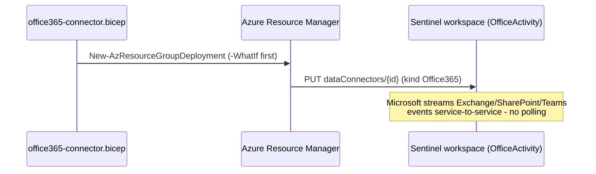
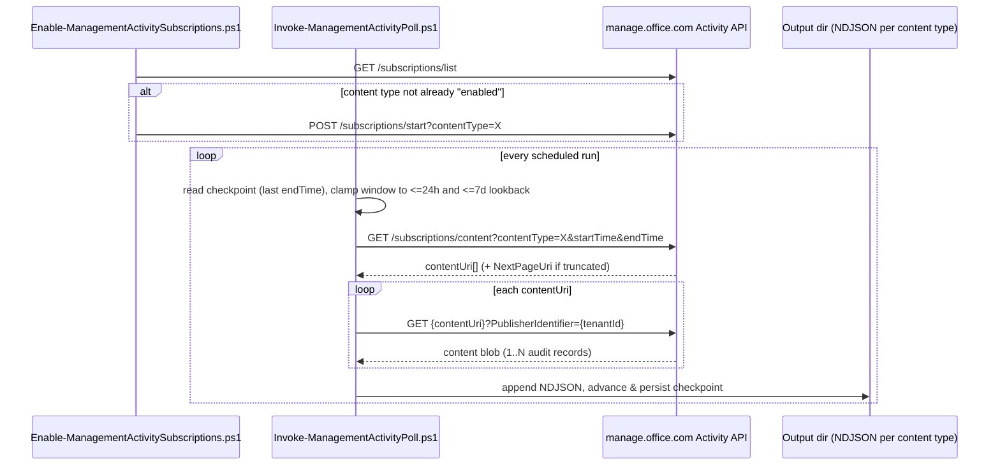

## 1. Problem statement

`audit/premium-audit-investigation` is deliberately **on-demand**: an investigator runs a scoped
query after something has already happened. That leaves a gap this scenario closes, **continuous,
unattended streaming** of Microsoft 365 audit/DLP events into a SIEM, so analytics rules can alert
on new activity within minutes instead of waiting for someone to go looking. Two genuinely different
mechanisms do this, and a buyer needs to pick correctly rather than default to whichever one a blog
post mentioned:

1. **The native Microsoft Sentinel data connector**, the fast path when Sentinel is (or will be)
   the SIEM. Fully managed, service-to-service, no code to operate.
2. **The Office 365 Management Activity API directly**, a subscribe-and-poll REST surface that
   works with *any* SIEM (Splunk, QRadar, a non-Sentinel Log Analytics pipeline) and is the only
   path to **`DLP.All`** events (detected sensitive-information matches), which the native Sentinel
   connector does not carry.

## 2. Design goals

1. **Pick the right mechanism, not just any mechanism.** Document what each path actually covers
   (workloads, content types, cost) so the choice is a reasoned one, not a coin flip.
2. **Idempotent by construction.** Bicep's declarative model and the subscription API's own
   "already subscribed" semantics mean re-running either deploy script converges to the same state
   rather than erroring or duplicating.
3. **Safe against the API's own throttling rules.** The Management Activity API enforces a
   **15-minute cooldown between `/start` requests** for the same content type, the subscription
   script checks `/subscriptions/list` first and only calls `/start` when actually needed, so a
   re-run (or a misconfigured scheduler) doesn't trip it.
4. **Resumable collection, not a fire-and-forget poller.** The poll script persists a checkpoint
   (last successful `endTime`) so a scheduled run that fails or is delayed picks up exactly where
   it left off, bounded by the API's **7-day content-retrieval window**, not by re-scanning from
   the beginning or silently dropping the gap.
5. **Author-only, no live tenant.** Both paths ship as declarative/parameterized artifacts
   (`-WhatIf` for the PowerShell paths, native ARM what-if for the Bicep path), nothing here
   connects to a real tenant or subscribes anything by default.

## 3. The two paths, contrasted

| | **A, Sentinel native connector** | **B, Management Activity API (custom)** |
|---|---|---|
| Mechanism | `Microsoft.SecurityInsights/dataConnectors`, `kind: Office365` (portal name: **Microsoft 365 (formerly, Office 365)**) [[8]](#references) | App-registration + OAuth2 client-credentials against `manage.office.com`, subscribe (`/start`) then poll (`/content`) [[1]](#references)[[2]](#references) |
| Coverage | **Exchange, SharePoint, Teams** admin/user activity only, three independent `state: Enabled/Disabled` toggles [[8]](#references) | Any subscribed **content type**: `Audit.AzureActiveDirectory`, `Audit.Exchange`, `Audit.SharePoint`, `Audit.General` (Teams, Power Platform, etc.), **`DLP.All`** [[1]](#references) |
| Destination | `OfficeActivity` table in the Sentinel/Log Analytics workspace, ready for KQL [[9]](#references) | Raw JSON content blobs your script retrieves and forwards, no built-in table; you choose the sink |
| Cost | **Free data source**, no per-GB Log Analytics ingestion charge for `OfficeActivity` (Exchange/SharePoint/Teams) [[10]](#references) | No API charge; you pay for wherever you land the data (Log Analytics ingestion via the Logs Ingestion API, Splunk indexing, storage, etc.) |
| Best for | "We run Sentinel and just want Exchange/SharePoint/Teams audit events in it" | Non-Sentinel SIEMs, or any workflow that needs **`DLP.All`** (detected sensitive-info matches) or **Entra ID audit** (`Audit.AzureActiveDirectory`) events this connector doesn't carry |
| Operating model | Fully managed by Microsoft once connected, no polling loop to run | You own the scheduled poll (Azure Automation, Function, cron) and its checkpoint/resume logic |

**They are not mutually exclusive.** A Sentinel-centric buyer commonly runs **both**: Path A for the
free, zero-maintenance `OfficeActivity` coverage, and Path B scoped to just `DLP.All` (and/or
`Audit.AzureActiveDirectory`) for the events Path A doesn't carry, landed in Sentinel via the
**Logs Ingestion API** (out of scope here, see §7) or forwarded to a separate DLP-events pipeline.

> Related, narrower connector: **Microsoft Purview Information Protection (Preview)**, which streams
> label/protection events specifically (via this same Management Activity API, under the hood) into
> a `MicrosoftPurviewInformationProtection` table, a different, richer schema than `OfficeActivity`
> for IP-specific analysis, with known duplication against `OfficeActivity` and unpopulated label
> names [[11]](#references)[[12]](#references). Out of scope here (a candidate for a dedicated
> Information Protection scenario); mentioned so it isn't mistaken for this scenario's Path A.

## 4. Workflow

## 5. Key decisions

| Decision | Choice | Rationale |
|---|---|---|
| Two artifacts, not one | Bicep (Path A) + PowerShell pair (Path B) | The two mechanisms have nothing in common technically (ARM resource vs. REST subscribe/poll), forcing them into one script would obscure the real choice in §3 |
| Pull, not push/webhook | Path B polls `/content` on a schedule rather than standing up a webhook receiver | A webhook needs a hosted, internet-reachable endpoint (infrastructure this author-only library doesn't provision); polling is stateless infrastructure-wise and easier to reason about for a buyer's first deployment. `design.md` §7 notes the webhook alternative |
| Checkpoint file, not "last 24h every run" | Persist `lastEndTimeUtc` per content type | Makes reruns resumable and avoids re-downloading/re-forwarding the same blobs on every scheduled tick; bounded by the 7-day content-retrieval window so a stale checkpoint is detectable, not silently wrong |
| `PublisherIdentifier` always sent | Every `/content` and blob-retrieval call includes it | Microsoft's own troubleshooting guidance: omitting it puts the caller in the shared general-purpose throttling pool instead of a tenant-dedicated one [[3]](#references) |
| Output format | NDJSON (one content blob's records per line-delimited batch), one file per content type per run | Forwarder-agnostic hand-off, Splunk HEC, the Log Analytics Logs Ingestion API, or a file-tail agent can all consume NDJSON without a custom parser |
| `-WhatIf` semantics | Path A: native ARM what-if (`New-AzResourceGroupDeployment -WhatIf`). Path B: script-level `[CmdletBinding(SupportsShouldProcess)]` previewing the subscription/poll calls it would make | Each path uses its platform's own idiomatic dry-run rather than a bespoke one |

## 6. Non-goals

- **Hosting a webhook receiver.** Push-mode notification delivery is real and documented
  [[2]](#references), but requires infrastructure (a reachable HTTPS endpoint) this author-only
  scenario doesn't provision. The poll (`/content`) mode this scenario builds is the
  infrastructure-free alternative Microsoft documents side by side with it.
- **A specific downstream SIEM forwarder** (Splunk HEC, the Log Analytics Logs Ingestion API,
  syslog/CEF). The poll script's NDJSON output is the documented hand-off point; wiring a specific
  forwarder is a follow-up, product-specific fragment.
- **Sentinel analytics rules / workbooks on top of `OfficeActivity`.** Out of scope, this scenario
  gets the data flowing; detection content is a separate fragment.
- **Provisioning the Sentinel workspace itself, or onboarding Sentinel onto it.** Both paths assume
  an existing Log Analytics workspace with Sentinel already enabled, matching this library's existing
  Purview↔Sentinel precedent [[13]](#references).
- **The Microsoft Purview Information Protection (Preview) connector**, noted in §3 for
  disambiguation, not built here.
- **DLP sensitive-content detail beyond what `DLP.All` carries.** Retrieving DLP policy match
  *content* (not just the event) needs the separate "Read DLP sensitive data" application permission
  and is out of scope; the config flags this explicitly (§ README §6).

## 7. Forward hand-off (documented, not built)

Landing Path B's NDJSON output in Sentinel itself (rather than a third-party SIEM) is the natural
next step for a Sentinel-centric buyer who still needs `DLP.All`/Entra-audit coverage: the
**Log Analytics Logs Ingestion API** accepts custom-table writes via a Data Collection Rule, and
Path B's `-OutDir` output is already record-per-line JSON, matching what that API expects. Not built
here, it needs a Data Collection Endpoint/Rule and a destination table schema decision that belongs
in a dedicated follow-up scenario once a concrete buyer target (custom table vs. Auxiliary Logs)
is chosen.

## 8. Other scenarios feeding this same output directory

Rather than every solution-specific scenario in this library building its own SIEM hand-off, a
scenario whose own product surface has no Management Activity API path can instead emit NDJSON
using this scenario's exact per-run-file convention (`<label>-<runStamp>.ndjson`) into Path B's own
`-OutDir`, one shared directory, one downstream forwarder, no per-scenario pipeline duplication.
`data-security-investigations/post-breach-investigation-and-purge/deploy/
Export-DsiActivityAuditTrail.ps1`'s `-NdjsonOutDir` parameter is the first instance of this pattern
(its own `design.md` §5); its `DSI-Activity` label is deliberately hyphenated, not dot-separated, to
avoid being mistaken for a genuine Management Activity API content type (this scenario's own
content types use dots, `Audit.Exchange`, `DLP.All`), DSI records never pass through that API.
