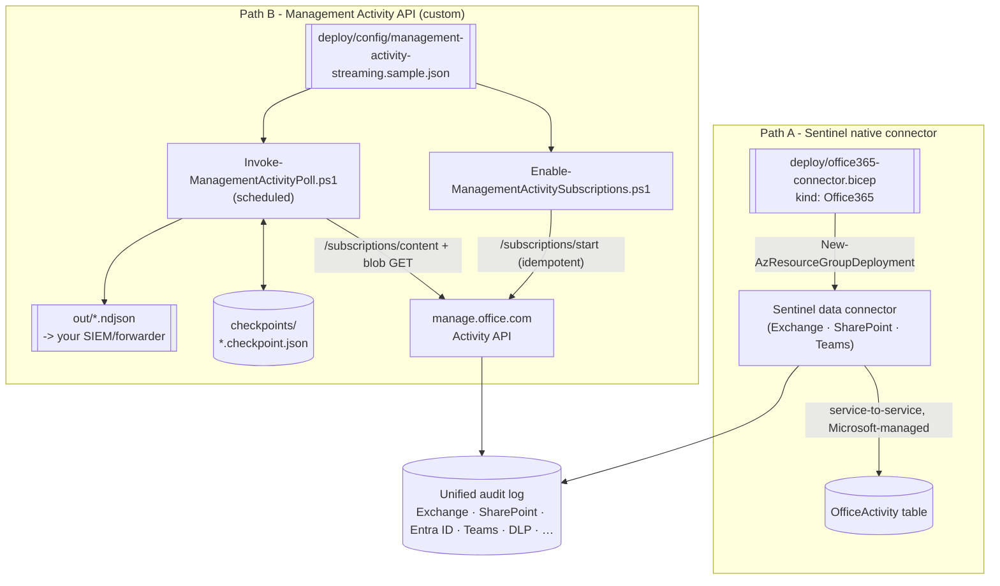

## 1. Scenario summary

Turns the **on-demand** investigation in `audit/premium-audit-investigation` into **continuous**
audit streaming, via two independently deployable paths: (A) the native **Microsoft Sentinel**
data connector for Exchange/SharePoint/Teams activity (`OfficeActivity` table, free, zero
maintenance), and (B) a subscribe-and-poll pipeline against the raw **Office 365 Management
Activity API** for any SIEM, and for the **Entra ID audit** and **`DLP.All`** events Path A doesn't
carry.

**Who it's for:** a SOC engineer standing up (or extending) continuous Microsoft 365 log ingestion, 
already running Sentinel and just wants Exchange/SharePoint/Teams flowing in for free (Path A);
running a non-Sentinel SIEM, or needing DLP/Entra-audit events specifically (Path B); or both.

## 2. Business/regulatory driver

On-demand investigation (this library's `premium-audit-investigation`) answers "what happened after
the fact." Continuous streaming answers "tell me the moment it happens", the difference between a
forensic report and a working detection program. Regulators and frameworks that expect **continuous
monitoring and timely detection** (SOC 2 CC7.2, ISO 27001 A.8.16, PCI-DSS Requirement 10) are
satisfied by log data landing in a SIEM with alerting, not by an admin's ability to run a query after
being told something is wrong. Two mechanisms exist because they solve different parts of that
requirement, see §3 for which one (or both) a given buyer needs.

## 3. Prerequisites

Full licensing detail: [Licensing matrix](/docs/licensing-matrix/). RBAC: [RBAC model](/docs/rbac-model/). Automation surface:
[Automation surface §4](/docs/automation-surface/#4-routing-table-which-surface-for-which-purview-task) ("Audit search (API, high volume/bulk export)" row cites this exact
API). Summary:

| Requirement | Path A (Sentinel connector) | Path B (Management Activity API) |
|---|---|---|
| SIEM | An existing Microsoft Sentinel workspace (Log Analytics workspace with Sentinel enabled) | Any, the API is SIEM-agnostic |
| Tenant role to connect | **Security Administrator** (or equivalent) on the M365 tenant, **Sentinel Contributor** (read/write) on the workspace | An Entra app registration granted the **Application** permission **"Read activity data for an organization"** (`ActivityFeed.Read`) on **Office 365 Management APIs**, admin-consented. Add **"Read Data Loss Prevention (DLP) policy events"** only if subscribing to `DLP.All` |
| Deployment auth | Azure RBAC **Contributor** (or narrower) on the resource group, for the Bicep deployment | OAuth2 **client-credentials** grant (certificate preferred over secret in production, [Automation surface §3](/docs/automation-surface/#3-authentication-patterns-interactive-vs-unattended)) |
| Audit prerequisite | **Unified audit logging** turned on for the tenant (shared prerequisite, both paths read from the same underlying audit pipeline) | Same |
| Cost | **Free**, `OfficeActivity` (Exchange/SharePoint/Teams) is an excluded/free Log Analytics data source | No API charge; you pay for wherever the NDJSON output lands (ingestion, storage) |

> Verify current entitlement names and role requirements against [Licensing matrix](/docs/licensing-matrix/) and
> [RBAC model](/docs/rbac-model/) (dated 2026-09-02) before a sales commitment.

## 4. Architecture



Path A is fully managed once deployed, Microsoft streams events server-to-server, no polling loop
to operate. Path B is a scheduled pull: the subscription script (run once, or re-run safely) ensures
content types are enabled; the poll script (run on a schedule) lists and retrieves new content since
its last checkpoint and exports NDJSON for a downstream forwarder. Full rationale and the two-path
comparison: `design.md` §3.

## 5. Step-by-step implementation

### Path A, Sentinel native connector

**Portal path:**
1. In [Microsoft Sentinel](https://portal.azure.com) → **Data connectors**, search **Microsoft 365
 (formerly, Office 365)** → **Open connector page**.
2. Under **Configuration**, select the workloads to stream (**Exchange**, **SharePoint**,
 **Teams**) → **Apply Changes**.

**Script path (repeatable IaC, native what-if):**
```powershell
# 1. Preview (creates/changes nothing)
New-AzResourceGroupDeployment -WhatIf -ResourceGroupName <rg> `
  -TemplateFile ./deploy/office365-connector.bicep `
  -workspaceName <sentinelWorkspaceName> -tenantId <tenantGuid>

# 2. Apply
New-AzResourceGroupDeployment -ResourceGroupName <rg> `
  -TemplateFile ./deploy/office365-connector.bicep `
  -workspaceName <sentinelWorkspaceName> -tenantId <tenantGuid>
```
Uses the `Microsoft.SecurityInsights/dataConnectors` ARM resource, `kind: Office365`
, Azure Resource Manager (not a Purview automation surface), authenticated with
the deploying user's/service principal's own Azure RBAC on the resource group.

### Path B, Management Activity API (custom)

```powershell
$secret = Read-Host -AsSecureString -Prompt 'Client secret'

# 0. Readiness check (token, subscription status, checkpoint freshness)
./validate/Test-ManagementActivityStreaming.ps1 -TenantId $tid -ClientId $cid -ClientSecret $secret -SkipCheckpointCheck

# 1. Ensure subscriptions are active (idempotent - preview first)
./deploy/Enable-ManagementActivitySubscriptions.ps1 -TenantId $tid -ClientId $cid -ClientSecret $secret -WhatIf
./deploy/Enable-ManagementActivitySubscriptions.ps1 -TenantId $tid -ClientId $cid -ClientSecret $secret

# 2. Poll once (or schedule this - Azure Automation runbook / Function timer trigger / cron)
./deploy/Invoke-ManagementActivityPoll.ps1 -TenantId $tid -ClientId $cid -ClientSecret $secret -OutDir ./out
```

Uses the **Office 365 Management Activity API**, a separate REST surface from Microsoft Graph, at
`manage.office.com` (or the government-cloud equivalent), authenticated with an app registration's
OAuth2 client-credentials grant. See [Automation surface §4](/docs/automation-surface/#4-routing-table-which-surface-for-which-purview-task) for how this surface relates to
the Graph-based Audit Search API used by `premium-audit-investigation`.

## 6. Configuration reference

| Setting | Path | Value this scenario uses | Notes |
|---|---|---|---|
| Connector kind | A | `Office365` | Portal calls it "Microsoft 365 (formerly, Office 365)"; the ARM/Bicep `kind` is still literally `Office365` |
| Data types | A | `exchange`, `sharePoint`, `teams`, each independently `Enabled`/`Disabled` | No `entra`/`dlp` data type exists on this connector kind, that's the coverage gap Path B fills |
| Destination table | A | `OfficeActivity` | Free Log Analytics data source |
| Content types | B | `Audit.AzureActiveDirectory`, `Audit.Exchange`, `Audit.SharePoint`, `Audit.General`, `DLP.All` | Config-driven list; trim to avoid double-collecting what Path A already streams (design.md §3) |
| Subscribe | B | `POST /activity/feed/subscriptions/start?contentType=X` | Idempotent in this script, checks `/subscriptions/list` first; 15-minute cooldown between `/start` calls per content type |
| List content | B | `GET /activity/feed/subscriptions/content?contentType=X&startTime&endTime` | Window ≤24h, lookback ≤7 days (both hard API limits) |
| Retrieve blob | B | `GET {contentUri}?PublisherIdentifier={tenantId}` | `PublisherIdentifier` always included, dedicated throttling pool |
| Pagination | B | `NextPageUri` response header | Not `@odata.nextLink`, a different convention from Microsoft Graph |
| Output | B | NDJSON, one file per content type per run | Forwarder-agnostic hand-off (design.md §6) |
| Checkpoint | B | `checkpoints/<contentType>.checkpoint.json`, `lastEndTimeUtc`, `lastRunUtc` | Advances only after a successful export |

## 7. Validation / how to prove it works

**Path A:**
1. After deployment, confirm the connector shows **Connected** on the Sentinel **Data connectors**
 page, or inspect the deployed resource (`Get-AzResource -ResourceType
 Microsoft.SecurityInsights/dataConnectors`).
2. Generate a benign, identifiable event (e.g. a test SharePoint file access), wait for the ~60-90
 minute typical ingestion latency shared with the underlying audit log, then
 query `OfficeActivity | where TimeGenerated > ago(2h)` in the workspace and confirm it appears.

**Path B:**
1. **Readiness**, `./validate/Test-ManagementActivityStreaming.ps1` confirms token acquisition and
 that every configured content type shows `status: enabled`.
2. **First poll**, run `Invoke-ManagementActivityPoll.ps1` once; confirm a checkpoint file is
 created per content type and (if any events occurred in the window) an NDJSON export file is
 non-empty.
3. **Pipeline health over time**, re-run `Test-ManagementActivityStreaming.ps1` (without
 `-SkipCheckpointCheck`) after the poll script has been scheduled for a day; confirm every content
 type's checkpoint is fresh (within `-MaxStaleHours`).
4. **Known-event test**, perform a benign action matching one of the subscribed content types (a
 sign-in for `Audit.AzureActiveDirectory`, a file share for `Audit.SharePoint`), wait for
 ingestion latency, run the poll, and confirm the record appears in that run's NDJSON.

## 8. Operations & tuning

- **First content lag.** A newly-started Path B subscription can take **up to 12 hours** before its
 first content blobs appear, don't conclude the pipeline is broken before then.
- **Scheduling cadence (Path B).** Poll at least once every few hours; the 24-hour-per-call window
 and 7-day retrieval ceiling mean an outage longer than 7 days creates a **permanent gap** (the
 script's stale-checkpoint warning surfaces this, README §7 item 3, `validate/` check 3).
- **Throttling (Path B).** Baseline **2,000 requests/minute** per tenant, roughly double for
 Microsoft 365/Office 365 E5 tenants; always send `PublisherIdentifier` for a
 dedicated pool rather than the shared general pool. A sustained `AF429`
 response means back off, not retry-in-a-tight-loop.
- **Ordering is not guaranteed.** Content blobs are not necessarily sequential, a later-arriving
 blob can contain earlier events than one already processed. Downstream
 analytics should key off event timestamps inside each record, not blob-arrival order.
- **Avoid double-collection.** If both paths are deployed, don't subscribe Path B to
 `Audit.Exchange`/`Audit.SharePoint` content that duplicates what Path A already streams into
 `OfficeActivity`, unless the destination pipelines are genuinely separate and dedup is handled
 downstream (design.md §3).
- **Other scenarios can share this scenario's `-OutDir`.** `data-security-investigations/
 post-breach-investigation-and-purge/deploy/Export-DsiActivityAuditTrail.ps1`'s own
 `-NdjsonOutDir` parameter writes `DSI-Activity-<runStamp>.ndjson` files using the exact same
 per-run-file convention `Invoke-ManagementActivityPoll.ps1` uses here, point it at this
 scenario's `-OutDir` to have one downstream forwarder pick up both feeds. DSI records reach that
 directory via `Search-UnifiedAuditLog`, not the Management Activity API, they are not a Path B
 content type and are not subject to this API's 24-hour/7-day window limits (that scenario's own
 `README.md` §11).
- **DLP.All is sensitive.** Detected sensitive-information events can themselves carry excerpts of
 matched content, treat Path B's `DLP.All` export files with the same handling discipline as the
 audit-investigation exports in this library's `premium-audit-investigation/rollback.md`.
 **Restrict filesystem access to `-OutDir`** (NTFS/POSIX ACLs, or a private storage container if the
 scheduled poll runs in Azure Automation/Functions) the same way you would any other directory
 holding unified-audit-log content, the NDJSON files are plaintext, at rest, for as long as they
 sit there before a downstream forwarder picks them up.
- **429 handling is built in.** Every raw REST call in `Invoke-ManagementActivityPoll.ps1` honors
 `Retry-After`/backs off exponentially on a 429/AF429 response, and each content type fails
 independently (checkpoint not advanced) rather than aborting the whole run, see the script's
 `.DESCRIPTION` and [Automation surface §5](/docs/automation-surface/#5-throttling-scale-and-resilience-patterns).

## 9. Rollback / decommission

See `rollback.md`.

## 10. Cost & licensing notes

- **Path A is free at the data-ingestion layer**, `OfficeActivity` (Exchange/SharePoint/Teams) is
 an explicitly excluded/free Log Analytics data source; the only cost is the
 Sentinel workspace itself (already a sunk cost if Sentinel is in use).
- **Path B has no API charge**, but every record you retrieve is a record you must land somewhere, 
 Log Analytics per-GB ingestion (if forwarded via the Logs Ingestion API), a third-party SIEM's own
 indexing cost, or storage, depending on where the NDJSON output is forwarded.
- **No license SKU gates either path** beyond unified audit logging itself and (for `DLP.All`) the
 separate DLP-events read permission, this is not an Audit (Premium) feature the way crucial
 events in `premium-audit-investigation` are.

## 11. Known limitations & gotchas

- **Path A does not cover Entra ID audit or DLP events.** Its three data types are Exchange,
 SharePoint, and Teams only, a buyer who also needs those needs Path B (or the
 separate, dedicated Microsoft Entra ID Sentinel connector for `AuditLogs`/`SigninLogs`, not built
 here).
- **This is not the Microsoft Purview Information Protection (Preview) connector.** That connector
 streams label/protection-specific events (via the same underlying Management Activity API) into a
 different table (`MicrosoftPurviewInformationProtection`), has documented event duplication against
 `OfficeActivity`, and doesn't populate label names without an enrichment KQL join
, out of scope here; see `design.md` §3.
- **No webhook/push mode built.** Path B polls; Microsoft also documents a webhook push mode
 requiring a hosted, internet-reachable endpoint, deliberately out of scope for this author-only
 library (`design.md` §6).
- **VERIFY, connector resource naming (Path A).** The Bicep template derives a deterministic name
 via `guid()` so re-deployments target the same resource; Microsoft's `Office365`-kind reference
 page doesn't state an explicit naming contract for this resource type, see the `.bicep` file's
 own header comment.
- **VERIFY, 15-minute `/start` cooldown edge case (Path B).** Whether the cooldown is measured from
 the previous `/start` call's timestamp regardless of outcome, or only from a successful one, isn't
 documented, `Enable-ManagementActivitySubscriptions.ps1` sidesteps this by skipping `/start`
 entirely whenever `/subscriptions/list` already shows `enabled` for that content type.
- **Ingestion latency is shared, not additive.** Both paths read from the same underlying audit
 pipeline (~60-90 minutes typical for core services), streaming doesn't make
 events appear faster than the audit log itself produces them; it removes the need for a human to
 go looking once they do.
- **Sentinel's Azure-portal experience is being retired in favor of the Defender portal** (after
 March 31, 2027), the data connector itself is unaffected, but screenshots/menu
 paths in buyer-facing walkthroughs should be re-checked against whichever portal the buyer's
 Sentinel instance actually uses.

## 12. References

1. Office 365 Management Activity API reference (subscriptions, content types, pagination via NextPageUri, content not guaranteed sequential), <https://learn.microsoft.com/office/office-365-management-api/office-365-management-activity-api-reference>
2. Office 365 Management Activity API reference, List available content (startTime/endTime ≤24h apart, ≤7-day lookback), <https://learn.microsoft.com/office/office-365-management-api/office-365-management-activity-api-reference#list-available-content>
3. Office 365 Management Activity API FAQs and troubleshooting (15-min /start cooldown, PublisherIdentifier throttling pool, app registration + three permissions, AF429), <https://learn.microsoft.com/office/office-365-management-api/troubleshooting-the-office-365-management-activity-api>
4. Get started with Office 365 Management APIs (app registration, admin consent, unified audit logging prerequisite), <https://learn.microsoft.com/office/office-365-management-api/get-started-with-office-365-management-apis>
5. Search the audit log, before you search (ingestion latency), <https://learn.microsoft.com/purview/audit-search#before-you-search-the-audit-log>
6. Management Activity API throttling limits (2,000 req/min baseline, ~2x for E5), <https://learn.microsoft.com/office/office-365-management-api/troubleshooting-the-office-365-management-activity-api#frequently-asked-questions-about-the-office-365-management-activity-api>
7. Content retrieval window (7 days after notification), <https://learn.microsoft.com/office/office-365-management-api/troubleshooting-the-office-365-management-activity-api#frequently-asked-questions-about-the-office-365-management-activity-api>
8. Connect Office 365 logs to Microsoft Sentinel (portal steps, workload toggles), <https://learn.microsoft.com/azure/sentinel/connect-office-365>
9. Microsoft.SecurityInsights dataConnectors resource format, Office365 kind (exchange/sharePoint/teams data types, tenantId), <https://learn.microsoft.com/azure/templates/microsoft.securityinsights/2024-03-01/dataconnectors>
10. Microsoft Sentinel pricing and billing, free data sources (Office 365 Audit Logs), <https://learn.microsoft.com/azure/sentinel/billing#free-data-sources>
11. Stream data from Microsoft Purview Information Protection to Microsoft Sentinel (preview, prerequisites, gathered via Office Management API), <https://learn.microsoft.com/azure/sentinel/connect-microsoft-purview>
12. Microsoft Purview Information Protection connector, known issues and limitations (label names, duplication with OfficeActivity), <https://learn.microsoft.com/azure/sentinel/connect-microsoft-purview#known-issues-and-limitations>
13. Integrate Microsoft Sentinel and Microsoft Purview, prerequisites (existing Sentinel workspace + Purview onboarded), <https://learn.microsoft.com/azure/sentinel/purview-solution>
14. Connect Microsoft Sentinel to other Microsoft services with an API-based data connector, prerequisites (Security Administrator, Log Analytics read/write), <https://learn.microsoft.com/azure/sentinel/connect-services-api-based#prerequisites>
15. Microsoft Sentinel in the Azure portal retirement timeline (March 31, 2027), <https://learn.microsoft.com/azure/sentinel/overview#microsoft-sentinel-in-the-azure-portal-retirement-timeline>
16. ARM/Bicep deployment what-if operation (`New-AzResourceGroupDeployment -WhatIf`), <https://learn.microsoft.com/azure/azure-resource-manager/bicep/deploy-what-if>

> Re-verify all links, the API version/resource schema, throttling figures, and connector coverage
> against current Microsoft Learn before a customer-facing deployment. `DLP.All` exports can contain
> sensitive content, handle output accordingly (§8).
