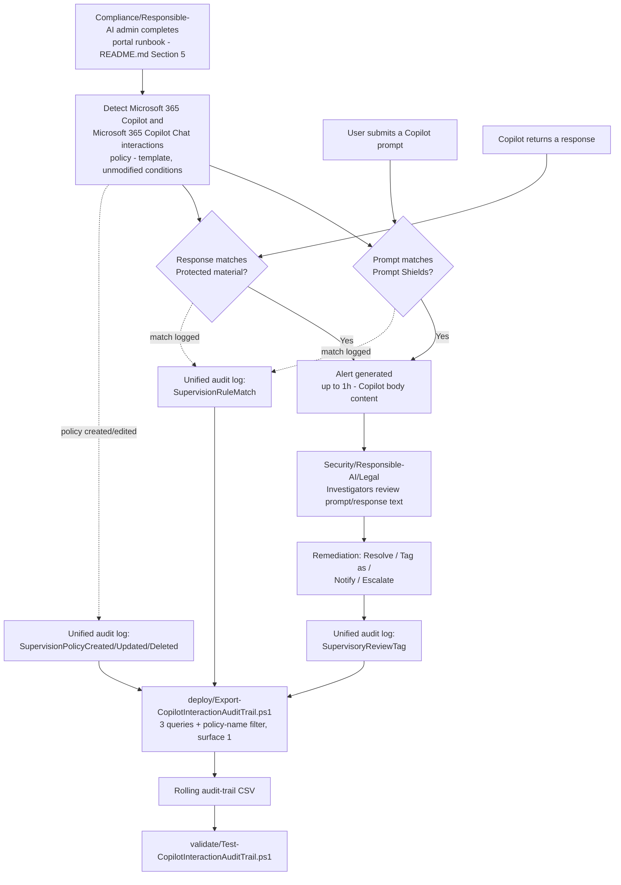

## 1. Problem statement

An organization rolling out Microsoft 365 Copilot needs a way to detect two AI-specific risks that
none of its existing Communication Compliance policies (if any) are built to catch: **users
attempting to jailbreak Copilot** (prompt injection to bypass its built-in safeguards) and
**Copilot generating responses containing copyrighted or branded material** it shouldn't
reproduce. Microsoft ships a purpose-built policy template for exactly this —
**Detect Microsoft 365 Copilot and Microsoft 365 Copilot Chat interactions** — combining two Azure
AI Content Safety classifiers (Prompt Shields, Protected material) that don't exist anywhere else
in Communication Compliance's classifier catalog. This scenario stands that template up correctly,
scoped and reviewed the same way this repo's other Communication Compliance scenario
([`communication-compliance/harassment-and-code-of-conduct`](/scenarios/communication-compliance/harassment-and-code-of-conduct/)) already established, and
layers the same scriptable audit-trail export on top.

## 2. Why this is a template deployment, not a custom policy (unlike the harassment scenario)

`harassment-and-code-of-conduct/design.md` §3 built a **custom** policy because that scenario
needed to combine four trainable classifiers with a custom keyword dictionary — a combination the
built-in "Detect inappropriate text" template doesn't offer. This scenario is different: the
**Detect Microsoft 365 Copilot and Microsoft 365 Copilot Chat interactions** template's fixed
configuration —

> Location: Microsoft 365 Copilot and Microsoft 365 Copilot Chat · Direction: Inbound, Outbound,
> Internal · Review Percentage: 100% · Conditions: Prompt Shields, Protected material classifiers
> [[3]](#references)

— is already exactly this scenario's target configuration, with no additional condition this
scenario needs to add. Using the template directly (rather than rebuilding the same thing as a
custom policy) is the correct, lower-effort, more-maintainable choice: Microsoft owns keeping the
template's classifier pairing current, and a future product change to the template's defaults is
something a buyer inherits automatically rather than having to notice and manually replicate in a
hand-built custom policy. `README.md` §5 documents the **Customize policy** option for the one
place a buyer may legitimately want to deviate (§8 below).

## 3. The no-write-API constraint still applies

Communication Compliance has no documented PowerShell, Graph, or REST write API for policy
creation or management, template-based or custom — the same "PowerShell isn't supported..."
statement `harassment-and-code-of-conduct/design.md` §2 already grounded against appears verbatim
on the same two Microsoft Learn pages [[9]](#references) [[10]](#references), and neither page nor
the dedicated `communication-compliance-copilot` article documents an exception for
template-based policy creation. This scenario ships the same two-part solution shape as its
sibling: a precise portal runbook (`README.md` §5) plus one genuinely scriptable, genuinely useful
piece of automation — an audit-trail export reusing the identical, already-grounded
`Search-UnifiedAuditLog` surface (§7 below), because Communication Compliance's audit footprint is
recorded identically regardless of which template or location produced the underlying policy.

## 4. Why Communication Compliance for this control, not DLP or Insider Risk Management

This repo already has three other Copilot-focused controls, and this scenario is deliberately the
fourth, different one:

| Scenario | Control type | What it does | What it misses |
|---|---|---|---|
| [`dspm-for-ai/copilot-sensitive-data-exposure`](/scenarios/dspm-for-ai/copilot-sensitive-data-exposure/) | Preventive (DLP) | Excludes labeled/sensitive content from Copilot grounding and web search | Says nothing about a user's own prompt intent, or what Copilot's response itself contains |
| [`dspm-for-ai/copilot-prompt-full-block`](/scenarios/dspm-for-ai/copilot-prompt-full-block/) | Preventive (DLP) | Fully blocks a prompt containing a sensitive-information-type match before Copilot processes it | Blocks on *sensitive data* in the prompt, not on jailbreak *intent* or on copyrighted material in a *response* |
| `scenarios/insider-risk/` (Risky AI usage template, not yet built in this repo) | Risk-scoring | Aggregates AI-related signals (including these same two classifiers, via the IRM integration in §8) into a per-user risk score | Doesn't itself review or remediate a specific interaction — a scoring/triage layer, not an investigation workflow |
| **This scenario** | **Detective (Communication Compliance)** | Reviews the actual prompt/response text for jailbreak attempts and protected-material exposure, with a human investigator workflow | Cannot block anything — the response has already reached the user by the time an Investigator sees it (§9, Non-goals) |

Communication Compliance is the only one of the four with **Prompt Shields** and **Protected
material** as available conditions at all — these two classifiers are documented as configurable
in Communication Compliance specifically, evaluating "generative AI prompts ONLY" (Prompt Shields)
and "generative AI responses ONLY" (Protected material), respectively [[6]](#references). DLP has
no equivalent condition for either; it matches sensitive-information-types and labels, not
jailbreak-attempt or copyright-similarity signals.

## 5. Classifier scope: what Prompt Shields and Protected material actually cover here

| Classifier | Evaluates | Detects | Language/format limits |
|---|---|---|---|
| Prompt Shields | **Prompts only** [[6]](#references) | User prompt-injection ("jailbreak") attempts — attempts to override system instructions, embed fake conversation turns, invoke a no-restrictions persona, or use encoding to evade filters [[4]](#references) | English only, per the classifier definition table [[6]](#references) |
| Protected material | **Responses only** [[6]](#references) | Known copyrighted/branded text content (lyrics, articles, recipes, licensed web content) that a Copilot response reproduces | English only, per the classifier definition table [[6]](#references) |

Two consequences this scenario's docs make explicit rather than leaving implicit:

- **A user pasting copyrighted or sensitive content INTO a prompt is not what either classifier
  here is built to catch.** Prompt Shields looks for jailbreak *intent*, not sensitive or protected
  *content*, in a prompt. That is `copilot-sensitive-data-exposure`'s and `copilot-prompt-full-block`'s
  job (§4 above), not this scenario's.
- **Neither classifier carries the Severity column** the LLM-based content-safety classifiers
  (Hate/Sexual/Violence/Self-harm) do — that column and its severity-4-or-higher threshold are
  documented specifically for the content-safety-classifier family, not for Prompt Shields/Protected
  material [[7]](#references). Alert triage for this policy has no built-in severity ranking to sort
  by — see `README.md` §8.

## 6. Reviewer role choice: Investigators, following the same reasoning as the harassment scenario

Same conclusion as `harassment-and-code-of-conduct/design.md` §5, for an analogous reason: an
Investigator assessing whether a flagged Copilot interaction is a genuine jailbreak attempt (versus
a security researcher's authorized red-team prompt, or a false positive) needs to read the actual
prompt/response text, not just metadata. This scenario assigns reviewers directly to
**Communication Compliance Investigators**. Given the Responsible-AI and IP-risk nature of this
policy's matches, its reviewer pool is more naturally the Security/Responsible-AI/Legal function
than the HR/Legal pairing the harassment scenario uses — `README.md` §3 reflects that.

## 7. The audit-trail script: same surface, new scenario, not a duplicate

`Export-CopilotInteractionAuditTrail.ps1` queries the identical three `Search-UnifiedAuditLog`
categories `harassment-and-code-of-conduct/deploy/Export-CommunicationComplianceAuditTrail.ps1`
already grounded (`SupervisionRuleMatch`; `RecordType Discovery` +
`SupervisionPolicyCreated`/`Updated`/`Deleted`; `RecordType AeD` + `SupervisoryReviewTag`) — this is
not a gap in this build's research, it is the correct outcome of Communication Compliance recording
its audit footprint identically regardless of which policy, template, or location produced the
event [[11]](#references). Reusing the same three-query shape (rather than inventing a
Copilot-specific audit surface that doesn't exist) is the same "don't fabricate an API" discipline
`AGENTS.md` §4 requires. What is genuinely new in this scenario's script, not copied:

- **`-PolicyNameFilter`**, defaulted to this scenario's own policy name, so a tenant running both
  this scenario and `harassment-and-code-of-conduct` side by side (a realistic, expected deployment
  — they are independent policies with no overlap in classifiers or location) gets two separate,
  correctly-attributed rolling CSVs rather than one merged file an investigator would have to
  manually re-split by policy name. `Search-UnifiedAuditLog`'s `AuditData` JSON payload carries the
  policy name; this script parses it and filters client-side rather than assuming a
  server-side `-PolicyName` parameter exists on `Search-UnifiedAuditLog` itself — no such parameter
  is documented [[11]](#references) [[12]](#references), so client-side filtering (not a fabricated
  server-side one) is the only grounded option.
- **A `CopilotContext` derived column**, best-effort-parsed from `AuditData` where present, so an
  export consumer doesn't have to manually unpack the JSON blob to tell whether a given row was a
  prompt-side or response-side match. Documented as best-effort in the script's own `.NOTES` — the
  exact shape of `AuditData` for this specific classifier pairing was not independently confirmed
  against a worked example in this build's grounding pass, so this script never fails or drops a
  row over a parse miss (see `README.md` §11 VERIFY).

## 8. Non-goals

- **The Insider Risk Management "Risky Agents" or "Risky AI usage" policy templates.** Whether this
  scenario's fixed "Microsoft 365 Copilot and Microsoft 365 Copilot Chat" location also reaches
  Copilot Studio-built or Microsoft Foundry agent interactions is an open VERIFY (`README.md` §11) —
  Microsoft's general channel-detection overview describes a same-sounding "Microsoft Copilot
  experiences" location as covering Copilot Studio agents too, but no worked example in this build's
  grounding pass confirmed the two phrasings denote the same location. If agent-specific risk is the
  actual concern, IRM's dedicated **Risky Agents** template is the purpose-built control for that
  surface — not something this scenario asserts it already covers.
- **The Insider Risk Management "Risky AI usage" policy template integration.** Microsoft documents
  an optional path where these same two classifiers (Prompt Shields, Protected material detection)
  feed IRM's risk-scoring templates via the **Policy indicators** setting on *Data leaks*, *Data
  leaks by risky users*, *Data leaks by priority users*, or *Risky AI usage* templates
  [[8]](#references) — a standalone Insider Risk Management scenario this repo doesn't yet have
  (tracked in `PROGRESS.md`), not part of this Communication-Compliance-only fragment.
- **Extending this policy (or an existing one) to Enterprise AI apps / Other AI apps locations.**
  Both require enabling **pay-as-you-go billing** — Microsoft 365 Copilot itself has no PAYG
  requirement, but connected/third-party generative AI applications do [[2]](#references). Mixing a
  PAYG-gated location into this scenario's licensing story would materially change its cost section
  (`README.md` §10) for a location this scenario doesn't target — a deliberate scope boundary, not
  an oversight. `README.md` §8 documents the **Add a generative AI app as a location for an existing
  policy** path as a forward reference for a buyer who wants that later, with the PAYG cost called
  out explicitly at that point.
- **Adding Copilot as a location to the existing `harassment-and-code-of-conduct` policy.** Microsoft
  documents this as a supported, simple edit (§8 above) — an organization that already has that
  policy deployed could extend it to also apply its Threat/Harassment/Discrimination/Profanity
  classifiers to Copilot prompts/responses. This scenario deliberately keeps the two policies
  separate rather than folding one into the other, because they detect materially different risk
  categories (interpersonal conduct vs. AI-safety/IP) with different natural reviewer pools
  (HR/Legal vs. Security/Responsible-AI/Legal) — see `README.md` §8 for this as a documented,
  optional alternative a buyer can choose instead.
- **The preview LLM-based content-safety classifiers (Hate/Sexual/Violence/Self-harm).** These do
  cover Microsoft 365 Copilot as one of their three supported workloads [[7]](#references), but they
  are a distinct, already-covered concern this repo's `harassment-and-code-of-conduct` follow-up
  backlog already tracks as its own candidate fragment — not duplicated here.
- **Reproducing Copilot's own built-in Responsible AI runtime protections** (block lists,
  Responsible-AI classifier filtering inside Copilot itself, hidden-Unicode-instruction
  sanitization) [[5]](#references) as part of this scenario. Those are Microsoft product-side
  mitigations this scenario's Communication Compliance layer sits behind and monitors, not something
  this repo configures.
- **SIEM/Sentinel wiring** — same documented native path (`OfficeActivity`/Sentinel) as
  `harassment-and-code-of-conduct/design.md` §7 already establishes; this scenario's CSV is
  SIEM-ingestible by the same mechanism, not rebuilt here.

## 9. Key decisions

| Decision | Choice | Rationale |
|---|---|---|
| Policy creation method | Portal wizard, **from the built-in template** (not a custom policy), documented as a runbook | The template's fixed configuration already exactly matches this scenario's target — §2. No write API exists either way — §3. |
| Classifiers | Prompt Shields + Protected material (the template's fixed pair, unchanged) | The only two Communication Compliance classifiers with dedicated jailbreak/copyright-detection semantics — §5. Not customized further; the template's own defaults are exactly this scenario's target, unlike the harassment scenario's need to add a custom keyword dictionary the template concept didn't offer. |
| Reviewer role | Communication Compliance Investigators, drawn from Security/Responsible-AI/Legal (not HR/Legal) | Full content access needed for the same reason as `harassment-and-code-of-conduct/design.md` §5; different natural reviewer pool given the AI-safety/IP nature of the matches — §6. |
| Location scope | Microsoft 365 Copilot and Microsoft 365 Copilot Chat only (the template default) | No PAYG requirement, unlike Enterprise/Other AI apps locations — §8, Non-goals. |
| Scriptable deliverable | Audit-trail export, same 3-query `Search-UnifiedAuditLog` shape as the harassment scenario, with a policy-name filter and a best-effort prompt/response context column added | Same grounded audit surface, correctly reused rather than reinvented — §7. |
| Relationship to `harassment-and-code-of-conduct` | Separate, independent policy (not merged, not built by adding Copilot as a location to the existing one) | Materially different risk categories and reviewer pools — §8, Non-goals. Documented as an alternative a buyer can choose instead. |

## 10. Data flow / where each piece runs

## References

See `README.md` §12 for the full, numbered source list this design references by bracketed number.
