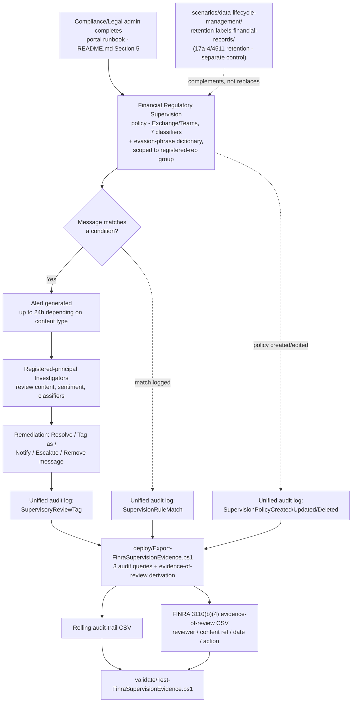

## 1. Problem statement

A broker-dealer, investment adviser, or bank with FINRA/SEC-registered personnel must supervise the
business communications of its registered representatives for signs of stock manipulation, money
laundering, undisclosed gifts/entertainment, collusion, unauthorized disclosure of confidential
information, and unresolved customer complaints — and must be able to **prove**, on demand from an
examiner, who reviewed what, when, and what action was taken. This is not a "nice to have" control:
FINRA Rule 3110(b)(4) makes documented supervisory review of correspondence and internal
communications a binding obligation, and the SEC's 2021–2024 "off-channel communications"
enforcement sweep (§2) shows what happens when firms cannot produce that evidence. This scenario
stands up a Communication Compliance policy scoped to the firm's actual FINRA-registered population
(not "all users" — §3), wires FINRA-registration-aware reviewers into the workflow, and layers a
scriptable audit-trail/evidence-of-review export on top, mirroring the shape
`scenarios/communication-compliance/harassment-and-code-of-conduct/` already established for this
module's no-write-API constraint (§2 there, restated at §7 here).

## 2. Why this scenario looks different from the DLP/Information Protection scenarios in this repo

Identical constraint to the sibling scenario, restated because it governs every design choice below:
Microsoft Purview Communication Compliance has **no documented PowerShell, Graph, or REST write API**
for policy creation or management. Microsoft's own `communication-compliance-policies` and
`communication-compliance-configure` articles both state, verbatim, in an `Important` call-out that
appears on both pages:

> "PowerShell isn't supported for creating and managing Communication Compliance policies. To create
> and manage these policies, use the policy management controls in the Communication Compliance
> solution." [[12]](#12-references) [[13]](#12-references)

This is the current, correct state of the product, confirmed independently by this build via
WebSearch corroboration across multiple secondary sources referencing the same two Microsoft Learn
pages (this build's network environment cannot fetch `learn.microsoft.com` directly — see the
Grounding note at the end of this file). Inventing a write API to make this scenario look more
"scriptable" would violate `AGENTS.md` §4's no-invented-cmdlets rule.

**Cross-cutting doc-drift found and fixed as part of this fragment:** `docs/automation-surface.md`
§4's routing table had a stale row claiming Communication Compliance policy config runs through
"Surface 2" (Security & Compliance PowerShell) via unnamed "Communication-compliance-specific S&C
cmdlets" — directly contradicting the no-write-API finding both this scenario and its
`harassment-and-code-of-conduct` sibling independently confirm, and citing cmdlets this build could
not identify by name (a red flag for a fabricated-sounding row, per `AGENTS.md` §4). Corrected in
place to state the portal-only reality and point at both scenarios' own grounding, rather than left
as a silent inconsistency for a future reader to trip over.

**What this scenario ships instead**, per `AGENTS.md` §9's definition of done:

1. A precise, repeatable **portal runbook** (`README.md` §5), backed by a structured, versioned,
   explicitly non-executable JSON manifest at
   `deploy/policy/financial-regulatory-supervision-manifest.json` — same "reference manifest, not an
   API payload" pattern as the harassment sibling and `scenarios/insider-risk/
   departing-employee-data-theft/`.
2. One genuinely scriptable deliverable with a documented, grounded API:
   `deploy/Export-FinraSupervisionEvidence.ps1`. This is **not a copy of the sibling's audit-trail
   script** — it reuses the same three `Search-UnifiedAuditLog` query categories (identical
   Communication-Compliance-wide operations, not policy-specific, so re-deriving them per scenario
   would be pointless duplication — `design.md` §5 below), but adds a second, derived output this
   scenario specifically needs and the sibling does not: a **FINRA Rule 3110(b)(4) evidence-of-review
   log**, reshaping the raw `ReviewTag` audit events into the four fields Rule 3110(b)(4) requires a
   firm to document (reviewer, content reviewed, date, action taken) — §5.

## 3. Population scope: FINRA-registered/supervised persons, not "All users"

This is the sharpest design difference from `harassment-and-code-of-conduct`, which correctly scopes
to **All users** per Microsoft's own planning guidance for a harassment/discrimination policy. FINRA
Rule 3110's supervisory obligation attaches to the firm's **registered representatives and associated
persons conducting the firm's securities business** — a facilities coordinator or an HR generalist
with no securities-business communications is not within Rule 3110(b)(4)'s scope, and scoping this
policy to "All users" would (a) generate irrelevant alert volume with no supervisory value and (b)
misrepresent the control's regulatory basis to an examiner who asks "who is this policy actually
supervising?" `deploy/policy/financial-regulatory-supervision-manifest.json`'s `usersInScope` is
therefore an **adaptive scope or explicit group** (the firm's own registered-representative
population, sourced from its own broker-dealer/registration system — not something this scenario can
derive from Microsoft 365 identity data alone) rather than "all users." See §7 (Non-goals) for what
this scenario deliberately does not attempt to automate (deriving that population).

## 4. Why Communication Compliance (not DLP, not Insider Risk Management) for this control

Same reasoning as `harassment-and-code-of-conduct/design.md` §3, restated for the financial context:

- **DLP** can block a message in real time on deterministic sensitive-information-type/pattern
  matches, but has no trainable-classifier concept for "this message describes a plan to manipulate a
  stock price" or "this message discusses laundering proceeds" — those require the nuanced,
  natural-language classifiers Communication Compliance ships, not a DLP rule.
- **Insider Risk Management** scores cumulative user risk from many signal types and can *consume*
  Communication Compliance's Threat/Harassment/Discrimination-classifier signals via a documented
  integration, but its own policy templates target data theft/leakage/security-policy violations —
  not the specific regulatory-collusion/stock-manipulation/money-laundering classifier family this
  scenario needs.
- **Communication Compliance** is Microsoft's purpose-built solution here: its "Regulatory compliance"
  classifier family (Corporate sabotage, Customer complaints, Gifts & entertainment, Money
  laundering, [Workplace/Regulatory] collusion — naming VERIFY below, Stock manipulation,
  Unauthorized disclosure) exists specifically for "regulated customers such as banking or financial
  services who have specific regulatory compliance obligations" (Microsoft's own classifier
  description, corroborated across multiple independent secondary sources — see §12 sourcing note).

Communication Compliance remains **detective, not preventive** here too — it reviews messages *after*
they're sent. For the preventive half of this problem (blocking messages that reference specific
restricted-list tickers before they leave the firm), see the cross-link to
`scenarios/information-barriers/segregate-trading-and-research/` in §7.

## 5. Classifier and custom-dictionary selection

Seven Microsoft-provided trainable classifiers, combined as OR conditions in one custom policy (not
a built-in template — see §8):

| Classifier | What it detects |
|---|---|
| Corporate sabotage | Explicit mentions of deliberately destroying, damaging, or sabotaging corporate assets/property — Microsoft frames this for NERC Critical Infrastructure Protection and similar sector regulation, not solely broker-dealer supervision, but it is part of the same "Regulatory compliance" classifier family this scenario draws from |
| Customer complaints | Language indicating a customer complaint — relevant to FINRA's own complaint-handling and reporting obligations (Rule 4530) as well as CFPB-style complaint-detection requirements |
| Gifts & entertainment | Language about exchanging gifts/entertainment for services — maps to FINRA Rule 3220 (Influencing or Rewarding Employees of Others) and firm gifts-and-entertainment policies |
| Money laundering | Signs of concealing or disguising the origin/destination of proceeds — the classifier Microsoft explicitly frames as extending Communication Compliance's scope to regulated banking/financial-services customers |
| [Workplace/Regulatory] collusion | Signs of price fixing, sharing trade secrets, or coordinated buying strategies, plus messages referencing secretive/concealing behavior — **naming VERIFY**: this build's grounding found this classifier referred to as "Regulatory collusion" in one context and "Workplace collusion" in another (both from independent secondary sources describing the same Communication Compliance classifier family, since this build's network cannot directly fetch the canonical Microsoft Learn classifier-definitions page — §12). Confirm the exact current portal-UI label at deploy time before finalizing customer-facing documentation, the same discipline the harassment sibling applies to its own "Harassment"/"Targeted harassment" naming question. |
| Stock manipulation | Recommendations to buy/sell/hold stock in order to manipulate price — the core classifier for FINRA/SEC market-manipulation supervision |
| Unauthorized disclosure | Sharing of information explicitly designated confidential/internal-only — the classifier most directly relevant to insider-trading and material-non-public-information (MNPI) leakage supervision |

**Why not the built-in "Detect financial regulatory compliance" policy template directly:** this
build's WebSearch-only grounding (§12) consistently confirms that template's *existence* and general
purpose ("quickly create a policy to check communications for references to standard financial terms
associated with regulatory standards"), and that a related "Detect conflict of interest" template
also exists — but could not confirm, without a direct Microsoft Learn fetch or a pilot tenant, the
**exact classifier set each of the two templates bundles by default** (e.g., whether Corporate
sabotage ships under one, the other, both, or neither). Rather than guess a bundling and risk
silently omitting a classifier this scenario needs, this scenario follows the harassment sibling's
own precedent: build a **custom policy** that explicitly selects all seven classifiers above by name,
which is correct regardless of how Microsoft's two templates happen to bundle them. A future revision
that can directly confirm each template's exact classifier list may simplify §5's portal runbook to
start from the built-in template and add only the missing classifiers, without changing the
resulting policy's actual classifier set.

**Why a custom keyword dictionary, and why it is evasion-phrase-only, not a ticker/term list:** the
seven classifiers above already cover explicit stock-manipulation, money-laundering, and collusion
language far more robustly than a static word list could. This scenario's own keyword dictionary
(`deploy/policy/finra-supervision-evasion-phrases.txt`) is scoped, like the harassment sibling's, to
**concealment/evasion phrasing** the classifiers are not designed to flag on their own — "let's take
this offline," "don't put that in an email," "call me instead" — the exact phrasing regulators cite
in off-channel-communications enforcement actions (§2) as evidence traders knew to route sensitive
discussion around a monitored channel. It deliberately does **not** contain restricted-list ticker
symbols or company names: a firm's actual restricted/watch list is itself confidential
supervisory information, and shipping a mechanism that would encourage loading it into a keyword
dictionary this repository publishes openly would be actively harmful — see the Red Team finding in
`reviews.md`.

## 6. Reviewer role choice, and the FINRA-registration gap Communication Compliance cannot close

Same **Investigators**, not **Analysts**, choice as the harassment sibling, for the same
full-content-visibility reason (`README.md` §3, `docs/rbac-model.md` §4) — a supervisory reviewer who
can only see "a message matched the Stock manipulation classifier" without reading the message cannot
form the substantive judgment Rule 3110(b)(4) requires.

**What this scenario cannot verify, and says so rather than guessing:** FINRA Rule 3110(b)(4) requires
that review of correspondence and internal communications be conducted by a **registered principal**,
and that the evidence of review identify the reviewer, the content reviewed, the review date, and any
action taken as a result. Microsoft Purview's Communication Compliance Investigators role group has
**no native concept of FINRA registration status** — assigning an unregistered employee to
Investigators satisfies Purview's own RBAC model perfectly while **not** satisfying Rule 3110(b)(4)'s
registered-principal requirement. This is an organizational/compliance dependency this scenario's
technical grounding cannot resolve on the buyer's behalf (`README.md` §3, gating prerequisite, same
pattern as the harassment sibling's employment-counsel dependency) — confirm every named Investigator
assigned to this policy holds the registration (or documented principal-delegation under the firm's
own written supervisory procedures) Rule 3110(b)(4) requires, separately from configuring Purview.

## 7. Non-goals

- **Deriving the FINRA-registered-person population from Microsoft 365 identity data.** This scenario
  assumes the firm already has (or maintains, in its own broker-dealer registration/HR system) an
  authoritative list of registered representatives, and that this list is kept current in whatever
  Entra ID group or adaptive-scope query `deploy/policy/financial-regulatory-supervision-manifest.json`
  targets. Reconciling that group against FINRA's own registration data (e.g., via BrokerCheck/CRD)
  is outside this scenario's scope — a natural candidate for an HR-connector-style reconciliation
  script, the same class of gap `scenarios/insider-risk/departing-employee-data-theft/`'s HR-connector
  follow-up already tracks for a different population.
- **Third-party financial messaging connectors** (Bloomberg Message/Mail, ICE Chat, Reuters Eikon
  Messenger, Symphony, and the ~30 others Microsoft documents a native data-connector path for). Real
  trading-floor communication in many firms happens substantially over these platforms, not Exchange/
  Teams — omitting them is a genuine, disclosed scope boundary (§11 Known limitations), not an
  oversight, and each connector has its own distinct setup workflow that deserves its own scoped
  fragment rather than being bolted onto this one (`PROGRESS.md`).
- **SEC Rule 17a-4 / FINRA Rule 4511 books-and-records retention of the underlying communications.**
  This scenario's audit-trail/evidence-of-review export is a **supervision and review-evidence**
  record — it is not, and does not attempt to be, the multi-year immutable retention system of record
  those rules require for the communications themselves. `scenarios/data-lifecycle-management/
  retention-labels-financial-records/` already builds exactly that (a regulatory-record retention
  label with WORM-style immutability) — deploy both scenarios together for a complete regulatory
  posture; this scenario's own README §8 cross-links the two explicitly so a reader doesn't mistake
  one for the other.
- **Preventive, real-time blocking of messages referencing restricted-list securities.**
  `scenarios/information-barriers/segregate-trading-and-research/` is the preventive control for
  segregating trading/research communication entirely; a DLP policy matching specific restricted-list
  tickers in real time is a plausible companion fragment this scenario does not build (`PROGRESS.md`).
- **The "Detect conflict of interest" built-in policy template**, as its own standalone scenario — a
  candidate follow-up once its exact classifier bundling can be confirmed (§5).
- **Trade-surveillance/market-abuse analytics** (correlating message content against actual trade
  blotters, FINRA CAT reporting, or similar) — a fundamentally different product category outside
  Microsoft Purview entirely.
- **SIEM/Sentinel wiring** — same scope boundary as the harassment sibling: this scenario's exported
  CSVs are SIEM-ingestible, and Microsoft documents a native Sentinel/`OfficeActivity` integration
  path; building a Sentinel workbook is not part of this fragment.
- **Reproducing the remediation-action API surface** (Resolve/Tag as/Escalate/Notify/Remove) as
  scriptable automation — same no-write-API boundary as §2, distinct from the policy-authoring gap.

## 8. Key decisions

| Decision | Choice | Rationale |
|---|---|---|
| Policy creation method | Portal wizard (custom policy, not a built-in template), documented as a runbook | No write API exists (§2); a custom policy guarantees the exact seven-classifier set regardless of how Microsoft's built-in templates happen to bundle them (§5) |
| Population scope | The firm's FINRA-registered/supervised-person group (adaptive scope or explicit group), not All users | Rule 3110(b)(4) attaches to the firm's securities-business personnel, not the whole workforce — §3 |
| Reviewer role | Communication Compliance Investigators (full content), gated on the reviewer separately holding an appropriate FINRA registration | Full content is needed for a substantive supervisory judgment (§6); Purview's RBAC cannot itself confirm FINRA registration status, so this is a named, gating prerequisite rather than an assumption |
| Review percentage | 100%, shipped as this scenario's default, with an explicit note that regulators deliberately do **not** mandate a fixed sampling rate | Rule 3110(b)(4)'s evidence-of-review requirement means an *unreviewed* match is a documented supervisory gap, not merely a missed alert — a materially different risk posture from the harassment sibling's alert-fatigue framing (`README.md` §8) |
| Custom keyword dictionary content | Evasion/concealment phrasing only (e.g., "let's discuss offline"), never restricted-list tickers or company names | The classifiers already cover explicit stock-manipulation/money-laundering language; a restricted list is itself confidential supervisory information that must never be embedded in a keyword dictionary this repo publishes openly (§5, `reviews.md` Red Team) |
| Scriptable deliverable | `Export-FinraSupervisionEvidence.ps1` — the sibling's three-category audit-trail export, plus a derived FINRA Rule 3110(b)(4) evidence-of-review CSV from the `ReviewTag` category | The three query categories are Communication-Compliance-wide, not policy-specific, so re-deriving them would be pure duplication; the evidence-of-review derivation is this scenario's own genuine incremental value (§2) |
| 17a-4/4511 retention | Explicitly out of scope here; cross-linked to `retention-labels-financial-records` | Avoids conflating a supervision/review-evidence tool with a books-and-records retention system — §7 |

## 9. Data flow / where each piece runs

## 10. Grounding note (this build's environment)

This build's cloud execution environment blocks direct `WebFetch` access to `learn.microsoft.com` and
every other external domain tested (`sec.gov`, `finra.org`, `smarsh.com` all returned
`EGRESS_BLOCKED`) — only `WebSearch` was reachable. Every Microsoft product fact in this scenario
(classifier names/descriptions, policy-template names, storage limits, the no-write-API statement)
and every regulatory fact (FINRA Rule 3110(b)(4)'s four evidence-of-review elements, SEC Rule 17a-4's
retention structure, the SEC/CFTC off-channel-communications enforcement figures) was corroborated
across **multiple independent secondary sources** returned by WebSearch rather than a single
canonical-page fetch. Facts that could not be corroborated this way, or where independent sources
disagreed (the collusion classifier's exact current name), are flagged inline as **VERIFY** rather
than asserted as certain, per `AGENTS.md` §4. Re-verify against a direct Microsoft Learn fetch or a
pilot tenant before a customer-facing commitment.
