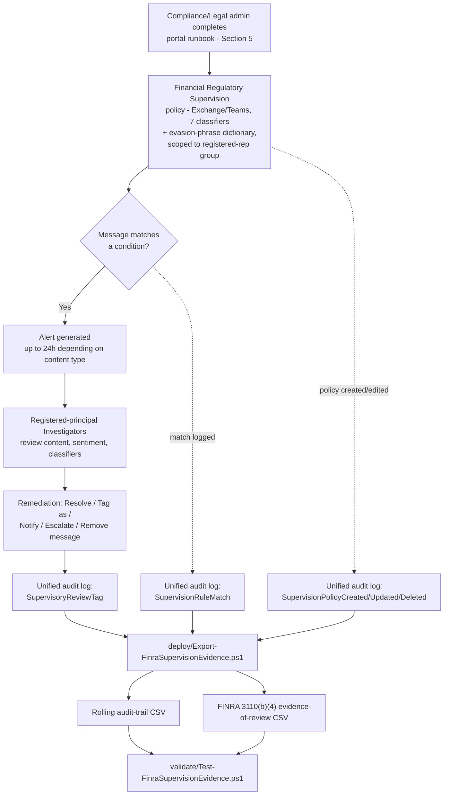

> **Scope note (read before implementation):** Microsoft Purview Communication Compliance has **no
> documented PowerShell, Graph, or REST write API** for policy creation or management — the same
> constraint `scenarios/communication-compliance/harassment-and-code-of-conduct/` already documents
> (§2 there, `design.md` §2 here). Sections 5–6 below describe a precise **portal runbook** for the
> policy itself, backed by a structured reference manifest, and a genuinely scriptable **audit-trail
> and evidence-of-review export** for the one piece of this solution reachable through a documented
> API.

## 1. Scenario summary

Deploys a Microsoft Purview Communication Compliance policy that detects signs of stock manipulation,
money laundering, undisclosed gifts/entertainment, collusion, unauthorized disclosure, corporate
sabotage, and unresolved customer complaints across the Exchange Online and Microsoft Teams
communications of a firm's FINRA-registered representatives, routes matches to registered-principal
reviewers, and layers a scriptable export on top that reshapes the native audit trail into the
evidence-of-review record FINRA Rule 3110(b)(4) requires.

**Who it's for:** a broker-dealer, investment adviser, or bank's Compliance/Legal function that must
supervise its registered representatives' electronic business communications under FINRA Rule 3110
and produce documented review evidence for an examiner — using its existing Microsoft 365 tenant
rather than standing up a separate archiving/surveillance platform.

## 2. Business/regulatory driver

**FINRA Rule 3110 (Supervision)** sets the minimum standard for a member firm's supervisory system.
**Rule 3110(b)(4)** specifically requires firms to have supervisory procedures for the review of
incoming and outgoing correspondence and internal communications relating to the firm's investment
banking or securities business, conducted by a **registered principal**, with the review **evidenced
in writing (electronically or on paper)** — and that evidence must identify **the reviewer, the
correspondence/communication reviewed, the review date, and any action taken as a result of a
significant issue found** [[9]](#12-references). **SEC Rule 17a-4** separately requires broker-dealers
to preserve business communications for a defined retention period (originals of received / copies of
sent communications, at least three years, the first two years in an easily accessible place), in a
non-rewriteable/non-erasable (WORM) format or an equivalent audit-trail alternative
[[10]](#12-references) — see §8 for why this scenario does not attempt to be that retention system.

**Why this is not a theoretical risk.** Between December 2021 and August 2024, the SEC and CFTC
brought a sustained enforcement sweep against Wall Street firms for failing to supervise and preserve
**"off-channel" communications** — business discussions conducted over employees' personal phones via
SMS/iMessage/WhatsApp, entirely outside any firm-monitored channel. JPMorgan's initial $125 million
settlement (December 2021) was followed by a $1.1 billion combined settlement with 16 firms
(September 2022), a $549 million SEC/CFTC combined settlement with 13 firms (August 2023), and further
rounds through August 2024 — over **$3 billion** in combined SEC/CFTC penalties across more than 100
firms in under three years [[11]](#12-references). **The uncomfortable corollary for this scenario:**
supervising Exchange/Teams perfectly does nothing to address the off-channel gap that actually drove
those fines — see §11.

## 3. Prerequisites

Full licensing detail and citations: `docs/licensing-matrix.md`. Summary for this scenario:

| Requirement | Minimum | Notes |
|---|---|---|
| Communication Compliance license (users in scope) | **Microsoft Purview Suite** (formerly Microsoft 365 E5 Compliance), **Office 365 E5/A5/G5**, **Microsoft 365 E5/A5/G5**, or **Office 365 E3 + the Advanced Compliance add-on** | See `docs/licensing-matrix.md`'s Communication Compliance row; confirm current SKU names against the Product Terms before a sales commitment |
| Policy authoring role | **Communication Compliance** or **Communication Compliance Admins** role group | See §5 — policy authoring is portal-only |
| Reviewer role (this scenario) | **Communication Compliance Investigators** (full message content) | See `design.md` §6 for why Investigators, not Analysts, is required |
| Reviewer registration (organizational, not a Purview setting) | Each named Investigator on this policy must separately hold an appropriate **FINRA registration** (e.g., a Series 24 principal, or a documented delegated-review designee under the firm's written supervisory procedures) | **Gating prerequisite.** Purview's RBAC model has no concept of FINRA registration status — assigning an unregistered reviewer satisfies Purview but not Rule 3110(b)(4). See `design.md` §6. Confirm before go-live, not after. |
| Registered-representative population source | An authoritative, current list of the firm's FINRA-registered/supervised persons, reflected in an Entra ID group or adaptive-scope query | This scenario does not derive or reconcile this population from Microsoft 365 identity data alone — see `design.md` §7 (Non-goals) |
| Reviewer mailbox | Reviewers must have a mailbox **hosted on Exchange Online** | Required by the policy-creation workflow itself |
| Audit log | Enabled (default for most tenants) | Communication Compliance alerts and remediation history depend on it |
| Automation identity (audit-trail/evidence-of-review script only) | App registration or account holding **Exchange.ManageAsApp** plus the **View-Only Audit Logs** (or **Audit Logs**) Exchange Online role | `Search-UnifiedAuditLog` requires an **Exchange Online** RBAC role — see `docs/rbac-model.md` §6 and `docs/automation-surface.md` §3 |
| Dependency (not deployed by this scenario) | The firm's own written supervisory procedures (WSPs) documenting the review percentage, escalation path, and registered-principal assignments this policy implements | This scenario ships a defensible technical default (§8); the WSP itself is the firm's own compliance/legal artifact |
| Complementary control (separate scenario) | `scenarios/data-lifecycle-management/retention-labels-financial-records/` for SEC 17a-4/FINRA 4511 books-and-records retention of the underlying communications | See §8 — this scenario does not replace it |

> Verify current entitlement names against `docs/licensing-matrix.md` and the Product Terms before a
> sales commitment — SKU names change.

## 4. Architecture



Communication Compliance has no write API (`design.md` §2), so the policy itself is created and
operated entirely through the Purview portal. The scripted export runs independently on its own
schedule, reading (never writing) the unified audit log.

## 5. Step-by-step implementation

### Portal path — creating the policy (there is no script path for this part; see §2/`design.md` §2)

1. Before starting, review `deploy/policy/financial-regulatory-supervision-manifest.json` — the
   recommended policy name, locations, classifiers, and reviewers. **Policy names cannot be changed
   after creation** — confirm before proceeding.
2. Confirm audit logging is on (§3), the registered-representative group/adaptive scope is current,
   and permissions are assigned: at least one person in **Communication Compliance Admins** (or
   **Communication Compliance**) to create the policy, and named, FINRA-registered principals assigned
   to **Communication Compliance Investigators**.
3. Sign in to the [Microsoft Purview portal](https://purview.microsoft.com) → **Communication
   Compliance** → **Policies** → **Create policy** → **Custom policy** (not the built-in "Detect
   financial regulatory compliance" template — `design.md` §5 explains why this scenario needs the
   custom-policy path to guarantee its exact seven-classifier set).
4. **Name and describe your policy**: `Financial Regulatory Compliance Supervision - Registered
   Representatives` (from the manifest) → **Next**.
5. **Choose users and reviewers**:
   - Users in scope: the firm's registered-representative group/adaptive scope from the manifest's
     `usersInScope` — **not All users** (`design.md` §3).
   - Reviewers: add the named, FINRA-registered principals from the manifest's
     `reviewers.placeholderMembers` (replaced with real accounts) → **Next**.
6. **Choose locations to detect communications**: select **Exchange** and **Teams** (per the
   manifest's `locations`; add **Viva Engage** only if the firm actually conducts registered-rep
   business communication there) → **Next**.
7. **Choose conditions and review percentage**:
   - Communication direction: **Inbound**, **Outbound**, and **Internal** (desk-to-desk internal chat
     is exactly where collusion/stock-manipulation language is most likely to appear).
   - Conditions: add the **Corporate sabotage**, **Customer complaints**, **Gifts & entertainment**,
     **Money laundering**, **[Workplace/Regulatory] collusion** (naming VERIFY — §11), **Stock
     manipulation**, and **Unauthorized disclosure** trainable classifiers as OR conditions, plus
     **Message/Attachment contains any of these words** using the custom keyword dictionary imported
     from `deploy/policy/finra-supervision-evasion-phrases.txt`.
   - Enable **Use OCR to extract text from images**.
   - Review percentage: **100%** (see §8 for why this scenario does not treat this the same way the
     harassment sibling treats its own alert-volume lever).
   - Leave **Filter out messages from email blasting services** checked (default) → **Next**.
8. **Review and finish** → **Create policy**. Allow up to ~1 hour for text content and up to 24
   hours for attachments/OCR before the policy begins detecting.
9. **Enable username anonymization.** **Settings** → **Communication Compliance** → **Privacy** tab →
   check **Show anonymized versions of usernames** → **Save** (tenant-wide, not per-policy).
10. **Create a notice template**, if the firm's escalation path uses the **Notify** remediation
    action. **Settings** → **Communication Compliance** → **Notice templates** tab → **Create notice
    template**.
11. **Document the review-percentage and escalation decisions in the firm's WSPs.** Rule 3110(b)(4)
    compliance rests on the firm's own written supervisory procedures matching what this policy
    actually does — a policy configured correctly but undocumented in the WSPs is still an
    examination finding waiting to happen.

### Script path — the audit-trail and evidence-of-review export (idempotent, parameterized, dry-run capable)

```powershell
# 1. Connect (certificate app-only — see docs/automation-surface.md Section 3). The connecting identity
#    needs Exchange.ManageAsApp PLUS the View-Only Audit Logs Exchange Online role (docs/rbac-model.md Section 6).
Connect-ExchangeOnline -AppId $AppId -Certificate $Cert -Organization $TenantDomain

# 2. Dry run - queries the last 7 days across all 3 categories, reports what would be merged, writes nothing
./deploy/Export-FinraSupervisionEvidence.ps1 `
    -AuditTrailCsvPath './out/finra-audit-trail.csv' `
    -EvidenceOfReviewCsvPath './out/finra-evidence-of-review.csv' -WhatIf

# 3. First real run - a one-time backfill covering the full default retention window
./deploy/Export-FinraSupervisionEvidence.ps1 `
    -StartDate (Get-Date).AddDays(-180) -EndDate (Get-Date) `
    -AuditTrailCsvPath './out/finra-audit-trail.csv' `
    -EvidenceOfReviewCsvPath './out/finra-evidence-of-review.csv'

# 4. Recurring run (schedule daily - overlapping windows are safe, see design.md Section 8)
./deploy/Export-FinraSupervisionEvidence.ps1 `
    -AuditTrailCsvPath './out/finra-audit-trail.csv' `
    -EvidenceOfReviewCsvPath './out/finra-evidence-of-review.csv'

# 5. Validate
./validate/Test-FinraSupervisionEvidence.ps1 `
    -AuditTrailCsvPath './out/finra-audit-trail.csv' `
    -EvidenceOfReviewCsvPath './out/finra-evidence-of-review.csv'
```

Uses `Search-UnifiedAuditLog` — automation surface 1 per `docs/automation-surface.md` §1 — because
Communication Compliance has no surface of its own for anything, including its own audit footprint.

## 6. Configuration reference

| Setting | Value this scenario uses | Notes |
|---|---|---|
| Policy type | Custom policy (not a template) | Guarantees the exact 7-classifier set — `design.md` §5 |
| Locations | Exchange Online, Microsoft Teams (Viva Engage optional) | `design.md` §5 |
| Direction | Inbound, Outbound, Internal | Internal desk-to-desk chat is a primary collusion/stock-manipulation surface |
| Users in scope | The firm's registered-representative group/adaptive scope, **not All users** | `design.md` §3 |
| Trainable classifiers | Corporate sabotage, Customer complaints, Gifts & entertainment, Money laundering, [Workplace/Regulatory] collusion, Stock manipulation, Unauthorized disclosure | `design.md` §5 |
| Custom keyword dictionary | `deploy/policy/finra-supervision-evasion-phrases.txt` | Evasion/concealment phrases only — never restricted-list tickers/company names — `design.md` §5 |
| OCR | Enabled | |
| Review percentage | 100% | Rule 3110(b)(4)'s evidence-of-review requirement, not just an alert-volume preference — `design.md` §8, §8 below |
| Filter email blasts | On (default) | |
| Reviewer role | Communication Compliance Investigators, each separately FINRA-registered | `design.md` §6 |
| Username anonymization | On (tenant-wide setting) | |
| Audit-trail script query categories | `PolicyMatch` (`SupervisionRuleMatch`), `PolicyUpdate` (`RecordType Discovery` + 3 operations), `ReviewTag` (`RecordType AeD` + `SupervisoryReviewTag`) | Identical to the harassment sibling's script — Communication-Compliance-wide, not policy-specific — `design.md` §2 |
| Evidence-of-review derivation | From `ReviewTag` rows: Reviewer, review Date, a best-available content reference, and the raw `AuditData` action-taken field | See §11 for the one unconfirmed field this derivation flags rather than guesses |
| Script idempotency | Merge + de-duplicate by `(CreationDate, Operations, UserIds, hash(AuditData))` for both output files | Same rolling-history pattern as the harassment sibling's script |

## 7. Validation / how to prove it works

1. **Automated file-integrity check** — `./validate/Test-FinraSupervisionEvidence.ps1` confirms both
   CSVs' schema, no duplicate composite-key rows, valid Category/Operation values, and sorted
   timestamps; exits non-zero on any hard failure.
2. **Manual verification checklist** — the same script prints a checklist (policy exists, correct
   locations/classifiers/population scope/reviewers, registered-principal confirmation, anonymization
   configured, storage-limit healthy, WSPs updated to match) — none of these have a read API to check
   programmatically (`design.md` §2).
3. **Functional test (policy match)** — from a test account, use the portal's **Test conditions
   (preview)** feature on the policy's Conditions page to test sample text against the configured
   classifiers before or after policy creation, without sending a live message. Do not use real
   restricted-list tickers or actual firm-confidential terms for testing.
4. **Evidence for an examiner** — the native **Alerts** dashboard and **Reports** page are
   Communication Compliance's primary evidence surfaces; this scenario's evidence-of-review CSV is a
   **secondary, complementary** artifact specifically shaped to Rule 3110(b)(4)'s four required
   fields, not a replacement for the native alert record (which retains the actual message content).
   **Do not rely on the evidence-of-review CSV alone as complete Rule 3110(b)(4) evidence.** Its
   `ContentReference` field is explicitly a reference to the review *action*, not the reviewed
   message's own content (§11) — on its own, the CSV proves "this reviewer reviewed something on this
   date," not "they reviewed the right thing." An examiner-ready evidence package needs both this CSV
   *and* the native alert record (or an export of it) retained for the same period, not one or the
   other.
5. **Functional test (evidence-of-review script)** — in the portal, resolve or tag a test alert. Wait
   for audit-log ingestion, then re-run the deploy script with a `-StartDate` covering that window.
   Expect a new row in the evidence-of-review CSV naming the reviewer and the review date.

## 8. Operations & tuning

**Why review percentage is treated differently here than in the harassment sibling.** The harassment
scenario frames its own 100% review percentage as a documented, revisitable alert-volume lever — the
cost of lowering it is more unreviewed harassment, a serious but operational risk. Here, an unreviewed
match under a FINRA-registered-person population is a **documented supervisory-review gap under Rule
3110(b)(4) itself** — regulators do not mandate a specific fixed sampling rate (this build's WebSearch
grounding: enforcement focuses on outcomes and a reasonably designed system, not a tick-box
percentage), but whatever percentage the firm's own WSPs commit to must actually be implemented and
evidenced. This scenario ships **100%** as its default because it is the simplest position to defend
to an examiner; lowering it is a firm's own WSP decision requiring Compliance/Legal sign-off, not a
default this scenario recommends.

**KPIs to watch (first 30 days):**
- **Classifier match volume, per classifier** — establish a baseline; a sudden spike in Stock
  manipulation or Money laundering matches from a specific desk warrants immediate escalation, not
  routine triage.
- **Evidence-of-review completeness** — every `SupervisionRuleMatch` should eventually produce a
  corresponding `SupervisoryReviewTag` event; a growing gap between matches and reviews is a Rule
  3110(b)(4) exposure, not just an operational backlog.
- **Storage-limit indicator** — same 100 GB / 1,000,000-message per-policy limit as every
  Communication Compliance policy; reaching it auto-deactivates the policy with no in-band alert
  outside the Communication Compliance/Communication Compliance Admins role groups.

**Alert-volume tuning, if 100% proves operationally unsustainable at trading-floor volume:** the same
levers Microsoft documents for the harassment sibling apply technically (sentiment triage, combining
classifiers, OCR scope) — but any reduction below 100% here must be a **documented WSP decision with
Compliance/Legal sign-off**, not a unilateral engineering tuning choice, given the regulatory stakes.

**Review cadence:** daily triage is the practical minimum given Rule 3110(b)(4)'s expectation of
timely review; monthly reconciliation of the evidence-of-review CSV against the firm's WSP-committed
review percentage; **quarterly reconciliation of Communication Compliance Investigators role-group
membership against the firm's current FINRA registration roster** — a reviewer who held a valid
registration when first assigned can later leave the firm, transfer to a non-supervisory role, or have
their registration suspended, and nothing in Purview's own RBAC model will flag that drift (`design.md`
§6). Treat this reconciliation as an operational control, not a one-time onboarding check; immediately
upon any storage-limit-approaching warning.

**Cross-link — retention is a separate control.** This scenario's evidence-of-review export proves
*who reviewed what, when*; it is not the system of record for SEC 17a-4/FINRA 4511's multi-year
immutable retention of the underlying communications. Deploy
`scenarios/data-lifecycle-management/retention-labels-financial-records/` alongside this scenario for
that separate, equally mandatory obligation — see `design.md` §7/§8.

**Incident-response runbook (alert triage):**
1. **Triage by classifier.** A Stock manipulation or Money laundering match is a different urgency
   tier from a Gifts & entertainment match — escalate the former to Legal/senior Compliance
   immediately, not into a routine queue.
2. **Examine message details** — sender, recipient, sentiment evaluation, OCR-matched image text —
   before deciding a remediation action.
3. **Remediate and document**: Resolve, Tag as, Notify (using the notice template from §5), or
   Escalate, per Microsoft's documented remediation-action set. Every action must be capturable in the
   evidence-of-review CSV's action-taken field (§11 — one unconfirmed `AuditData` field flagged there).
4. **For a Teams message requiring removal**, use the **Remove message** remediation action
   (Investigators only).

## 9. Rollback / decommission

See `rollback.md` for the full staged procedure. Quick reference: use **Pause policy** in the portal
for a reversible stop; **Delete** only when permanently retiring the control — Delete **permanently
removes all captured messages, attachments, and alerts**.

## 10. Cost & licensing notes

- **No PAYG component for this scenario.** Communication Compliance's PAYG billing tier applies to
  non-Microsoft-365 generative-AI-application detection, not to this scenario's Exchange/Teams scope.
- **No additional Azure subscription required.**
- **Sizing is narrower than the harassment sibling by design.** Because this policy scopes to the
  firm's registered-representative population rather than All users (`design.md` §3), licensing needs
  only cover that subset at E5-tier (or the Advanced Compliance add-on) — not the entire workforce.
- **Third-party connector licensing (Bloomberg, ICE Chat, etc.) is separate** and out of scope for
  this scenario (`design.md` §7) if the firm needs those channels supervised too.

## 11. Known limitations & gotchas

- **Off-channel communications are entirely invisible to this control — and that is exactly the gap
  that drove over $3 billion in SEC/CFTC penalties since 2021 (§2).** A registered representative
  texting a client or colleague from a personal phone is completely outside Communication Compliance's
  visibility (it only sees Microsoft 365-native and connector-configured channels). This scenario is
  necessary but not sufficient — pair it with a firm-wide policy prohibiting unsupervised personal-
  device business communication, enforced through HR/compliance training and, ideally, a compliant
  mobile-messaging archiving solution for any personal-device use the firm does permit.
- **This scenario cannot script policy creation, condition tuning, reviewer assignment, or population
  scoping.** No write API exists (`design.md` §2). Purview's RBAC also cannot verify FINRA registration
  status for reviewers (`design.md` §6) — that verification is entirely the firm's own responsibility.
- **Naming inconsistency, unconfirmed by direct fetch:** this build found the collusion-related
  classifier referred to as both "Regulatory collusion" and "Workplace collusion" across independent
  secondary sources (this build's network cannot directly fetch the canonical Microsoft Learn
  classifier-definitions page — `design.md` §10). **VERIFY** the exact current portal-UI label at
  deploy time before finalizing customer-facing documentation.
- **This build's classifier-to-template mapping is inferred, not confirmed.** Microsoft documents a
  built-in "Detect financial regulatory compliance" template (and a related "Detect conflict of
  interest" template) but this build could not confirm, without a direct Learn fetch or pilot tenant,
  exactly which of the seven classifiers each template bundles by default. This scenario sidesteps the
  question by building a custom policy naming all seven explicitly (`design.md` §5) — this does not
  depend on resolving the template question, but a future revision should still confirm it for anyone
  choosing to start from a template instead.
- **The evidence-of-review CSV's "action taken" field is best-effort, not guaranteed-complete.** This
  build could not confirm the exact `AuditData` JSON property name Microsoft populates for the
  specific remediation action (Resolve/Tag/Escalate/etc.) on a `SupervisoryReviewTag` event, beyond
  confirming the event itself fires and its top-level schema. **VERIFY (pilot tenant):** the script
  parses `AuditData` defensively and surfaces the raw JSON alongside any recognized action-related
  property, rather than guessing a field name that might not exist — see the script's own `.NOTES`.
- **Trainable classifiers have a minimum word-count requirement** that varies by content language — a
  very short message may not trigger a classifier match; the keyword dictionary partially mitigates
  this for known evasion phrasing only.
- **"Limited support for evasive typing"** is Microsoft's own documented limitation for all trainable
  classifiers, not specific to this scenario's classifier set.
- **Storage-limit auto-deactivation is a silent failure mode**, identical to the harassment sibling's
  own finding — monitor actively (§8); "no alerts" does not mean "no problems."
- **Detection latency is not real-time**: up to 1 hour for text, up to 24 hours for attachments/OCR.
- **This scenario is not the SEC 17a-4/FINRA 4511 retention system of record** — see §8's cross-link to
  `retention-labels-financial-records`. Confusing the two in a customer-facing narrative
  misrepresents the firm's actual regulatory posture.
- **Restricted-list/watch-list confidentiality:** never load a firm's actual restricted-list tickers,
  issuer names, or deal codenames into the custom keyword dictionary described in this scenario. The
  list itself is confidential supervisory information; a keyword dictionary that reveals what the firm
  is watching for is a liability, not a control (`design.md` §5, `reviews.md` Red Team).

## 12. References

1. Communication Compliance — regulatory compliance classifier family (Corporate sabotage, Customer
   complaints, Gifts & entertainment, Money laundering, collusion, Stock manipulation, Unauthorized
   disclosure) — corroborated via WebSearch across multiple independent secondary sources summarizing
   `learn.microsoft.com/purview/communication-compliance-policies` and
   `learn.microsoft.com/purview/communication-compliance` (not directly fetchable from this build's
   network — `design.md` §10).
2. "Detect financial regulatory compliance" and "Detect conflict of interest" built-in policy
   templates — corroborated via WebSearch summarizing the same Communication Compliance policies page;
   exact per-template classifier bundling not independently confirmed — `design.md` §5.
3. Create and manage Communication Compliance policies (policy templates, PowerShell-not-supported
   statement, storage limits, pause/copy) — <https://learn.microsoft.com/purview/communication-compliance-policies>
4. Get started with Communication Compliance (step-by-step policy workflow, notice templates/
   anonymization, test policy) — <https://learn.microsoft.com/purview/communication-compliance-configure>
5. Investigate and remediate Communication Compliance alerts (Analysts vs. Investigators permissions,
   remediation actions) — <https://learn.microsoft.com/purview/communication-compliance-investigate-remediate>
6. Use Communication Compliance reports and audits (Discovery/AeD RecordType worked examples for
   `SupervisionPolicy*`/`SupervisoryReviewTag`) — <https://learn.microsoft.com/purview/communication-compliance-reports-audits>
7. Use Communication Compliance with SIEM solutions (`SupervisionRuleMatch` worked example) —
   <https://learn.microsoft.com/purview/communication-compliance-siem>
8. Audit log activities — Communication compliance activities table —
   <https://learn.microsoft.com/purview/audit-log-activities#communication-compliance-activities>
9. FINRA Rule 3110 (Supervision), specifically 3110(b)(4) (review of correspondence/internal
   communications — registered-principal review, four required evidence-of-review elements) —
   corroborated via WebSearch across multiple independent secondary sources summarizing
   <https://www.finra.org/rules-guidance/rulebooks/finra-rules/3110> (not directly fetchable from this
   build's network — `design.md` §10). Re-verify the rule's current text directly before a
   customer-facing compliance assessment.
10. SEC Rule 17a-4 electronic recordkeeping requirements for broker-dealers (3-year retention, 2-year
    easily-accessible requirement, WORM/audit-trail-alternative storage) — corroborated via WebSearch
    summarizing <https://www.sec.gov/investment/amendments-electronic-recordkeeping-requirements-broker-dealers>
    (not directly fetchable from this build's network — `design.md` §10).
11. SEC/CFTC "off-channel communications" enforcement sweep, December 2021 – August 2024 (JPMorgan
    $125M; 16-firm $1.1B settlement; 13-firm $549M SEC/CFTC settlement; further 2024 rounds; >$3
    billion combined penalties across 100+ firms) — corroborated via WebSearch across multiple
    independent law-firm and industry secondary sources reporting on the same SEC/CFTC enforcement
    actions.
12. Create and manage Communication Compliance policies / Get started with Communication Compliance —
    explicit "PowerShell isn't supported" statements — <https://learn.microsoft.com/purview/communication-compliance-policies#create-and-manage-policies>,
    <https://learn.microsoft.com/purview/communication-compliance-configure#notes-and-tips-on-creating-communication-compliance-policies>
13. FINRA Rule 3220 (Influencing or Rewarding Employees of Others) and Rule 4530 (customer complaint
    reporting) — cited for the Gifts & entertainment and Customer complaints classifiers' regulatory
    mapping (§2); re-verify current rule text before a customer-facing citation.

> This scenario's regulatory-driver research relied on WebSearch corroboration rather than a direct
> Microsoft Learn/SEC/FINRA fetch — see `design.md` §10 for the environment limitation and what that
> means for re-verification before a customer-facing sale.
