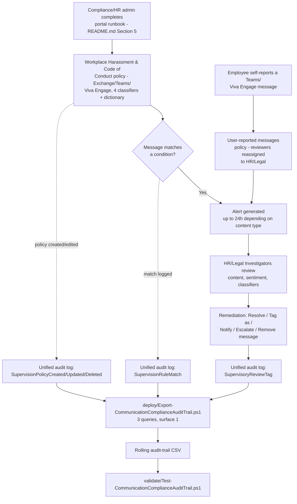

## 1. Problem statement

An enterprise with a legal and internal-policy obligation to prevent and promptly correct
workplace harassment needs a way to detect potentially harassing, discriminatory, threatening, or
profane communications across email, Teams, and Viva Engage *before* they surface only through a
reactive complaint, while keeping the review process itself privacy-respecting, role-separated,
and defensible if the tenant's process is ever examined as part of a harassment claim. Microsoft
Purview Communication Compliance ships purpose-built trainable classifiers and a role-based
review workflow for exactly this. This scenario stands one up correctly, wires HR/Legal into the
review workflow with the correct role (not just any Communication Compliance role), and layers
scriptable audit-trail monitoring on top of a solution that is otherwise entirely portal-driven.

## 2. Why this scenario looks different from the DLP/Information Protection scenarios in this repo

Every DLP and Information Protection scenario in this repo ships a `deploy/*.ps1` that
idempotently **creates** a Purview object against a documented Security & Compliance PowerShell
write API (`New-DlpCompliancePolicy`, `New-AutoSensitivityLabelPolicy`, etc.). Communication
Compliance has **no such API**. Microsoft's own `communication-compliance-policies` and
`communication-compliance-configure` articles both state this explicitly, in an `Important` call-out
that appears twice, word for word:

> "PowerShell isn't supported for creating and managing Communication Compliance policies. To
> create and manage these policies, use the policy management controls in the Communication
> Compliance solution." [[12]](#references) [[13]](#references)

`docs/automation-surface.md`'s own routing table (§4) has no row for Communication Compliance for
the same reason every other no-write-API module in this repo (Compliance Manager, Insider Risk
Management policy authoring) has none.

This is the current, correct state of the product, not a gap in this build's research, and
inventing a `New-CommunicationCompliancePolicy` cmdlet, or a REST endpoint that doesn't exist,
would violate `AGENTS.md` §4's no-invented-cmdlets rule for zero real benefit: a fabricated script
would fail on first use and cost the buyer more time than a correctly-labeled manual runbook.

**A documentation-adjacent nuance worth recording, not hiding:** the older `New-`/
`Get-SupervisoryReviewPolicyV2` cmdlets (Communication Compliance's pre-rebrand name, "Supervisory
Review") are still present in the current `ExchangeOnlineManagement`/Security & Compliance
PowerShell module reference [[14]](#references), and `Get-SupervisoryReviewPolicyV2` is even used
in Microsoft's own `communication-compliance-reports-audits` article, but only to read a policy's
`ReviewMailbox` property for a storage-size check, never to create or edit a policy. This scenario
does not use `New-SupervisoryReviewPolicyV2` to create the policy itself: Microsoft's current,
actively-maintained guidance is unambiguous that policy authoring is portal-only, and a legacy
cmdlet still existing in a module reference is not the same as it being a supported path, using
it against the explicit current guidance above would be exactly the kind of "technically works,
not actually correct" shortcut `AGENTS.md` §4 exists to prevent.

**What this scenario ships instead**, to still meet `AGENTS.md` §9's definition of done:

1. A precise, repeatable **portal runbook** (`README.md` §5, backed by a structured, versioned,
   explicitly non-executable JSON manifest at
   `deploy/policy/communication-compliance-policy-manifest.json`, the same "reference manifest,
   not an API payload" pattern this repo established in
   `scenarios/insider-risk/departing-employee-data-theft/` and
   `scenarios/compliance-manager/assess-against-iso27001/` for other no-write-API Purview
   surfaces) plus one genuinely uploadable artifact the portal wizard actually consumes: a custom
   keyword dictionary text file (§4 below).
2. One genuinely scriptable, genuinely useful piece of real automation, with a documented,
   grounded API: `deploy/Export-CommunicationComplianceAuditTrail.ps1`, which pulls the five
   Communication-Compliance-specific unified-audit-log operations Microsoft's own docs document
   across three worked-example query shapes (§4).

## 3. Why Communication Compliance (not DLP, not Insider Risk Management) for this control

This repo's `scenarios/dlp/pci-teams-exfil-block/design.md` §3 already establishes the pattern for
choosing between these three controls for a given problem; the same reasoning applies in reverse
here:

- **DLP** inspects content and can block a message in real time, but its rule engine matches
  patterns/sensitive-information-types deterministically, it has no trainable-classifier concept
  for "this message is harassing" and cannot itself distinguish a professional disagreement from a
  targeted personal attack. Wrong tool for nuanced, human-judgment-requiring language.
- **Insider Risk Management** scores cumulative user risk from many signal types (including a
  Communication Compliance integration, §6 below) but its own policy templates target data
  theft/leakage/security-policy violations, not interpersonal conduct, as the primary detection
  surface.
- **Communication Compliance** is the Purview solution purpose-built for this: Microsoft-trained
  classifiers for Discrimination, Harassment, Profanity, and Threat language, a review workflow
  with role-separated reviewers, pseudonymization by design, and a documented audit trail, see
  Microsoft's own framing: "you can check user communications in your organization for human
  resources concerns such as harassment" [[1]](#references).

Communication Compliance is explicitly **detective, not preventive**, it reviews messages *after*
they're sent, for human reviewers to act on; it cannot block a message before delivery the way DLP
can. This is a deliberate, documented trade-off (§7, Non-goals), not an oversight.

## 4. Classifier and custom-dictionary selection

Four Microsoft-provided trainable classifiers are combined as OR conditions:

| Classifier | What it detects | Documented expected volume [[8]](#references) |
|---|---|---|
| Discrimination | Explicit discriminatory language (particularly sensitive to language targeting Black/African American communities relative to other groups, per Microsoft's own classifier definition) | Low |
| Harassment | Offensive content targeting race, color, religion, national origin, also labeled "Targeted harassment" on some Microsoft Learn pages and in the portal's Filters UI (§11 VERIFY, a documented naming inconsistency, not this scenario's error) | Low |
| Profanity | Profane content likely to offend most people | Medium |
| Threat | Content aimed at committing violence or physical harm to a person or property | Low |

**Why not the preview LLM-based content-safety classifiers (Hate/Sexual/Violence/Self-harm)
instead:** those classifiers are Microsoft 365 Copilot, Teams, and Viva Engage only, they do not
cover Exchange Online [[9]](#references). Since this scenario's location scope explicitly includes
Exchange (harassment over email is exactly as real a risk as harassment over Teams), the
trainable-classifier family is the only one with full coverage across all three in-scope
locations. The content-safety classifiers are a candidate follow-up for Teams/Viva
Engage-specific, higher-accuracy detection (`PROGRESS.md`), not a substitute here.

**Why not a custom trainable classifier:** Communication Compliance explicitly does not support
them, "Custom trainable classifiers aren't supported" [[8]](#references), only the fixed catalog
above (plus keyword dictionaries and sensitive information types) is available as a condition.

**Why a custom keyword dictionary, and why it deliberately does not contain slurs or profanity:**
the Profanity/Harassment/Discrimination classifiers already cover explicit offensive language more
robustly than a static word list could (they're trained on natural-language patterns, not exact
string matches, and cover multiple languages [[8]](#references)). A keyword list's marginal value
over an already-classifier-covered condition set is catching **organization-specific evasion or
concealment phrasing** a classifier isn't designed to flag, "don't tell HR," "keep this between
us," "delete this after reading." `deploy/policy/code-of-conduct-evasion-phrases.txt` is scoped to
exactly that gap, both because it's the higher-value use of a keyword list here and because
shipping a slur/profanity word list in a public-facing reference repository serves no one.

## 5. Reviewer role choice: Investigators, not Analysts

Communication Compliance's permission model draws a sharp line: **Analysts** can investigate
alerts and see message metadata; **Investigators** can additionally see full message *content*
[[6]](#references). For most compliance scenarios, starting reviewers at the narrower Analyst role
and escalating to Investigator only when needed is the safer default. This scenario deliberately
assigns HR/Legal reviewers directly to **Communication Compliance Investigators** instead, because
a harassment investigation that cannot see the actual message text is not a credible
investigation, an HR reviewer who can only see "a message matching the Harassment classifier was
sent" without being able to read it cannot make a defensible remediation decision. The privacy
cost of this broader role is mitigated, not eliminated, by:

- Username pseudonymization (`deploy/policy/communication-compliance-policy-manifest.json`'s
  `privacySettings`), reviewers see a pseudonym until a case genuinely requires revealing
  identity.
- Narrow role-group membership, only named HR/Legal stakeholders, not a broad admin group.
- The audit trail this scenario's script exports, which records every review-tag/resolution action
  taken (`ReviewTag` category, §8 below) as an accountability mechanism for reviewer conduct
  itself.

## 6. Integration awareness: Insider Risk Management (documented, not built here)

Microsoft documents an optional integration where Communication Compliance signals feed Insider
Risk Management's risky-user detection (a dedicated auto-created "Insider risk trigger" policy,
using the Threat/Harassment/Discrimination classifiers) [[10]](#references). This scenario's own
policy is a standalone Communication Compliance deployment and does not configure that IRM
integration, see §7, Non-goals. A buyer who has also deployed
`scenarios/insider-risk/departing-employee-data-theft/` should be aware the two solutions *can* be
wired together but are independent unless that specific IRM-side option is explicitly selected.

## 7. Non-goals

- **The FINRA/SEC-oriented "Regulatory compliance" policy template** (Customer complaints, Gifts &
  entertainment, Money laundering, Regulatory collusion, Stock manipulation, Unauthorized
  disclosure classifiers), a different regulatory driver (broker-dealer supervision) from this
  scenario's HR/code-of-conduct focus. A natural sibling scenario, tracked in `PROGRESS.md`.
- **The "Detect Microsoft 365 Copilot and Microsoft 365 Copilot Chat interactions" policy
  template** (Prompt Shields/Protected material classifiers), a DSPM-for-AI-adjacent concern, not
  this scenario's interpersonal-conduct focus.
- **Configuring the Insider Risk Management integration** described in §6, a deliberate, separate
  opt-in with its own policy-template implications, better scoped as its own follow-up once
  concretely needed.
- **SIEM/Sentinel wiring.** This scenario's audit-trail script produces a CSV a SIEM connector can
  ingest, and Microsoft documents a native Sentinel/`OfficeActivity` integration path
  [[11]](#references), matching the same scope boundary `scenarios/dlp/pci-teams-exfil-block/`
  already established (document the native alert surface and the SIEM path; don't build a
  Sentinel workbook as part of this fragment).
- **Third-party source connectors** (e.g. Instant Bloomberg), requires a connector configured
  outside this scenario; out of scope.
- **Reproducing the exact remediation-action API surface** (Resolve/Tag as/Escalate/Notify/Power
  Automate/Remove from Teams) as scriptable automation. These are portal-only reviewer actions
  with no documented write API of their own, distinct from, and not to be confused with, the
  policy-authoring write-API gap this scenario's §2 already covers.

## 8. Key decisions

| Decision | Choice | Rationale |
|---|---|---|
| Policy creation method | Portal wizard (custom policy, not a template), documented as a runbook, not a script | No write API exists, see §2. A custom policy (not the "Detect inappropriate text" template) is needed to combine the classifier set with a custom keyword dictionary in one policy. |
| Reference manifest format | Structured JSON, explicitly labeled non-executable | Matches the precedent set by `departing-employee-data-theft` and `assess-against-iso27001` for other portal-only Purview surfaces. |
| Scriptable deliverable | Audit-trail export across 3 query categories / 5 documented operations, via `Search-UnifiedAuditLog` (automation surface 1) | The only Communication-Compliance-adjacent surface with a real, grounded, multi-example-documented API, see §4 of the deploy script's own header and this file's §2. |
| Query shape | Three separate `Search-UnifiedAuditLog` calls, each mirroring one of Microsoft's own worked examples (`Operations SupervisionRuleMatch` alone; `RecordType Discovery` + the three `SupervisionPolicy*` operations; `RecordType AeD` + `SupervisoryReviewTag`) | Microsoft's own reports-audits and SIEM articles show three distinct RecordType/Operations pairings, not one unified call covering all five operation values, reproducing that exact shape avoids guessing at an unverified combined-query behavior. |
| Idempotency model | De-duplicate by a composite key (`CreationDate` + `Operations` + `UserIds` + a stable hash of the full `AuditData` JSON payload) on every run | Same rolling-history model as `assess-against-iso27001`'s audit-trail script, this script's job is to accumulate discrete events across overlapping date-range calls, not replace a single daily snapshot. |
| Reviewer role | Communication Compliance Investigators (full content access), not Analysts | See §5, a metadata-only view is not sufficient for a credible HR investigation. |
| Custom keyword dictionary content | Evasion/concealment phrases only, no slurs/profanity | See §4, classifiers already cover that ground; a public repo shouldn't ship a slur list either way. |
| Review percentage | 100% | Microsoft's own planning guidance for harassment/discrimination-focused policies (`README.md` §8); a documented, revisitable lever if alert volume becomes unmanageable. |

## 9. Data flow / where each piece runs

