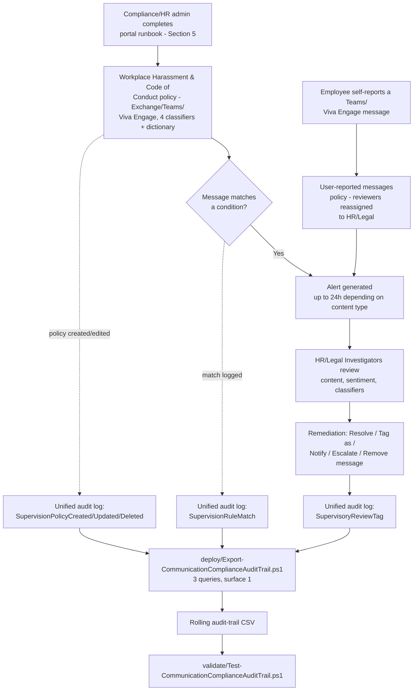

> **Scope note (read before implementation):** Microsoft Purview Communication Compliance has **no
> documented PowerShell, Graph, or REST write API** for policy creation or management — Microsoft's
> own docs state this explicitly (§2 below, `design.md` §2). Sections 5–6 below therefore describe
> a precise **portal runbook** for the policy itself, backed by a structured reference manifest, and
> a genuinely scriptable **audit-trail export** for the one piece of this solution that *is*
> reachable through a documented API. This is the same shape this repo already established for
> Compliance Manager ([`compliance-manager/assess-against-iso27001`](/scenarios/compliance-manager/assess-against-iso27001/)) and Insider Risk
> Management policy authoring ([`insider-risk/departing-employee-data-theft`](/scenarios/insider-risk/departing-employee-data-theft/)) — not a
> shortcut for this scenario.

## 1. Scenario summary

Deploys a Microsoft Purview Communication Compliance policy that detects potentially harassing,
discriminatory, threatening, or profane language across Exchange Online email, Microsoft Teams
chat/channel messages, and Viva Engage conversations, routes matches to a role-scoped HR/Legal
review workflow with full message-content access, and layers a scriptable, idempotent audit-trail
export on top for drift detection and retention beyond Communication Compliance's native reporting
window.

**Who it's for:** an enterprise HR/Legal/Compliance function that wants to move from a purely
reactive (complaint-driven) posture on workplace harassment and code-of-conduct violations to
proactive detection across its Microsoft 365 communication channels, with a review process that is
itself privacy-respecting, role-separated, and defensible.

## 2. Business/regulatory driver

**Title VII of the Civil Rights Act of 1964** (42 U.S.C. § 2000e-2) prohibits harassment based on
race, color, religion, sex, or national origin that is severe or pervasive enough to create a
hostile work environment. Under the Supreme Court's *Faragher v. City of Boca Raton* and
*Burlington Industries v. Ellerth* framework, an employer facing a hostile-work-environment claim
involving a supervisor can raise an affirmative defense only by showing it **exercised reasonable
care to prevent and promptly correct** harassing behavior. Detective monitoring of the channels
where harassment actually happens today — email, Teams, and enterprise social — is direct evidence
of that "reasonable care" element, not just a compliance nicety.

> **VERIFY at deploy time — currency note:** the EEOC's April 2024 sub-regulatory *Enforcement
> Guidance on Harassment in the Workplace* (which explicitly discussed virtual/remote-work
> harassment) was **rescinded by a 2–1 EEOC Commission vote on January 23, 2026**
> [[15]](#references). This scenario's regulatory driver rests on the underlying Title VII statute
> and the *Faragher*/*Ellerth* case-law framework above, neither of which depends on that
> sub-regulatory guidance's status — but do not cite the rescinded 2024 guidance itself as current
> authority in a customer-facing compliance narrative. Confirm the EEOC's current sub-regulatory
> guidance position before referencing anything beyond the statute and case law directly.

Two secondary drivers this control also supports:
- **General code-of-conduct enforcement** — profanity and hostile language that doesn't rise to a
  legally protected-characteristic-based harassment claim is still a professionalism and culture
  problem most organizations' own internal conduct policies separately prohibit.
- **Evidentiary readiness** — Communication Compliance's built-in audit trail and this scenario's
  exported history give HR/Legal a documented record of detection and response if a harassment
  claim is ever litigated or investigated by a regulator.

## 3. Prerequisites

Full licensing detail and citations: `docs/licensing-matrix.md`. Summary for this scenario:

| Requirement | Minimum | Notes |
|---|---|---|
| Communication Compliance license (users in scope) | **Microsoft Purview Suite** (formerly Microsoft 365 E5 Compliance), **Office 365 E5/A5/G5**, **Microsoft 365 E5/A5/G5**, or **Office 365 E3 + the Advanced Compliance add-on** | See `docs/licensing-matrix.md`'s Communication Compliance row; confirm current SKU names against the Product Terms before a sales commitment [[7]](#references) |
| Policy authoring role | **Communication Compliance** or **Communication Compliance Admins** role group | See §5 — policy authoring is portal-only; these role groups also grant the **Communication Compliance** left-nav item itself [[6]](#references) |
| Reviewer role (this scenario) | **Communication Compliance Investigators** (full message content) — not Analysts (metadata only) | See `design.md` §5 for why Investigators is the deliberate choice for a credible HR investigation. Cross-ref `docs/rbac-model.md` §4 |
| Reviewer mailbox | Reviewers must have a mailbox **hosted on Exchange Online** | Required by the policy-creation workflow itself [[3]](#references) |
| Audit log | Enabled (default for most tenants) | Communication Compliance alerts and remediation history depend on it — confirm via `Search-UnifiedAuditLog` or the audit log search settings before creating the policy [[3]](#references) |
| Automation identity (audit-trail script only) | App registration or account holding **Exchange.ManageAsApp** plus the **View-Only Audit Logs** (or **Audit Logs**) Exchange Online role | `Search-UnifiedAuditLog` requires an **Exchange Online** RBAC role — a Purview-only role is explicitly documented as insufficient. See `docs/rbac-model.md` §6 and `docs/automation-surface.md` §3 |
| Viva Engage native mode (only if Viva Engage is in scope) | Tenant's Viva Engage network in **Native Mode** | Required for Communication Compliance to check Viva Engage private messages/community conversations [[4]](#references) |
| Dependency (not deployed by this scenario) | Named HR/Legal stakeholders to populate as reviewers | This scenario does not create or manage user accounts — see `deploy/policy/communication-compliance-policy-manifest.json`'s `reviewers.placeholderMembers` |
| Dependency (not deployed by this scenario) | Employment-counsel review of monitoring-notice/consent obligations, and an updated acceptable-use/monitoring policy communicated to staff | Reading employee message content (§5, Investigators role) can trigger jurisdiction-specific employee-monitoring notice or consent requirements this scenario's technical grounding cannot determine on the buyer's behalf — see §11 VERIFY |

> Verify current entitlement names against `docs/licensing-matrix.md` (dated 2026-09-02) and the
> Product Terms before a sales commitment — SKU names change.

## 4. Architecture



Communication Compliance has no write API (`design.md` §2), so the policy itself is created and
operated entirely through the Purview portal. The one scripted piece — the audit-trail export —
runs independently on its own schedule, reading (never writing) the unified audit log.

## 5. Step-by-step implementation

### Portal path — creating the policy (there is no script path for this part; see §2/`design.md` §2)

0. **(Optional, one-time, tenant-wide)** If the tenant has [eDiscovery compliance
   boundaries](https://learn.microsoft.com/purview/ediscovery-set-up-compliance-boundaries)
   configured, run this once (Security & Compliance PowerShell) so Investigators/Admins can access
   the policy's scoped review mailbox — skip if the tenant has no compliance boundaries:
   ```powershell
   Connect-IPPSSession -AppId $AppId -Certificate $Cert -Organization $TenantDomain
   New-ComplianceSecurityFilter -FilterName "CC_mailbox" `
       -Users <HR/Legal reviewer + admin aliases> `
       -Filters "Mailbox_Name -like 'SupervisoryReview{*}'" -Action All
   ```
   [[5]](#references)
1. Before starting, review `deploy/policy/communication-compliance-policy-manifest.json` — the
   recommended policy name, locations, classifiers, and reviewers. **Policy names cannot be changed
   after creation** [[3]](#references) — confirm before proceeding.
2. Confirm audit logging is on (§3) and permissions are assigned: at minimum, one person in
   **Communication Compliance Admins** (or **Communication Compliance**) to create the policy, and
   named HR/Legal stakeholders assigned to **Communication Compliance Investigators**
   [[6]](#references).
3. Sign in to the [Microsoft Purview portal](https://purview.microsoft.com) → **Communication
   Compliance** → **Policies** → **Create policy** → **Custom policy** (not a template — this
   scenario's classifier + custom-dictionary combination needs the custom-policy path)
   [[3]](#references).
4. **Name and describe your policy**: `Workplace Harassment and Code of Conduct - All Users`
   (from the manifest) → **Next**.
5. **Choose users and reviewers**:
   - Users in scope: **All users** (Microsoft's own planning guidance: "most organizations should
     include all users in Communication Compliance policies optimized for harassment or
     discrimination detection" [[2]](#references)).
   - Reviewers: add the named HR/Legal stakeholders from the manifest's
     `reviewers.placeholderMembers` (replaced with real accounts). Each reviewer receives an
     automatic email notifying them of the assignment [[3]](#references) → **Next**.
6. **Choose locations to detect communications**: select **Exchange**, **Teams**, and **Viva
   Engage** (per the manifest's `locations`) → **Next**.
7. **Choose conditions and review percentage**:
   - Communication direction: **Inbound**, **Outbound**, and **Internal** (all three).
   - Conditions: add the **Discrimination**, **Harassment** (may display as "Targeted harassment" —
     §11), **Profanity**, and **Threat** trainable classifiers as OR conditions, plus **Message/
     Attachment contains any of these words** using a custom keyword dictionary imported from
     `deploy/policy/code-of-conduct-evasion-phrases.txt` [[8]](#references).
   - Enable **Use OCR to extract text from images** (catches screenshotted harassing content)
     [[3]](#references).
   - Review percentage: **100%**.
   - Leave **Filter out messages from email blasting services** checked (default) [[3]](#references)
     → **Next**.
8. **Review and finish** → **Create policy**. Allow up to ~1 hour for text content and up to 24
   hours for attachments/OCR before the policy begins detecting [[3]](#references).
9. **Reassign the User-reported messages policy's reviewers.** This system policy is auto-created
   by the tenant's Communication Compliance license (up to 30 days after purchase) and its default
   reviewers/creator fall back to the **Communication Compliance Admins** role group or, if empty,
   a **randomly selected Global Administrator** [[3]](#references). Go to **Communication
   Compliance** → **Policies** → **User-reported messages** → **Edit**, and assign the same
   HR/Legal reviewers as step 5. This lets employees self-report inappropriate Teams/Viva Engage
   messages directly — Microsoft's own guidance: "Admins should immediately assign custom
   reviewers to this policy" [[3]](#references).
10. **Enable username anonymization.** **Settings** (top-right) → **Communication Compliance** →
    **Privacy** tab → check **Show anonymized versions of usernames** → **Save**
    [[3]](#references). This is a tenant-wide setting, not per-policy.
11. **Create a notice template.** **Settings** → **Communication Compliance** → **Notice
    templates** tab → **Create notice template** — used by reviewers when the **Notify**
    remediation action is the appropriate response to a lower-severity match [[3]](#references).

### Script path — the audit-trail export (idempotent, parameterized, dry-run capable)

```powershell
# 1. Connect (certificate app-only — see docs/automation-surface.md §3). The connecting identity
#    needs Exchange.ManageAsApp PLUS the View-Only Audit Logs Exchange Online role (docs/rbac-model.md §6).
Connect-ExchangeOnline -AppId $AppId -Certificate $Cert -Organization $TenantDomain

# 2. Dry run — queries the last 7 days across all 3 categories, reports what would be merged, writes nothing
./deploy/Export-CommunicationComplianceAuditTrail.ps1 -OutputCsvPath './out/cc-audit-trail.csv' -WhatIf

# 3. First real run — a one-time backfill covering the full default retention window
./deploy/Export-CommunicationComplianceAuditTrail.ps1 `
    -StartDate (Get-Date).AddDays(-180) -EndDate (Get-Date) `
    -OutputCsvPath './out/cc-audit-trail.csv'

# 4. Recurring run (schedule daily or weekly — overlapping windows are safe, see design.md §8)
./deploy/Export-CommunicationComplianceAuditTrail.ps1 -OutputCsvPath './out/cc-audit-trail.csv'

# 5. Validate
./validate/Test-CommunicationComplianceAuditTrail.ps1 -AuditTrailCsvPath './out/cc-audit-trail.csv'
```

The audit-trail script uses Exchange Online PowerShell's `Search-UnifiedAuditLog` — automation
surface 1 per `docs/automation-surface.md` §1, because Communication Compliance has no surface of
its own for anything, including its own audit footprint (`design.md` §2 and §4).

## 6. Configuration reference

| Setting | Value this scenario uses | Notes |
|---|---|---|
| Policy type | Custom policy (not a template) | Needed to combine classifiers with a custom keyword dictionary in one policy — `design.md` §8 |
| Locations | Exchange Online, Microsoft Teams, Viva Engage | Matches the built-in "Detect inappropriate text" template's location set |
| Direction | Inbound, Outbound, Internal | Full coverage |
| Users in scope | All users | Microsoft's own planning guidance for harassment/discrimination policies [[2]](#references) |
| Trainable classifiers | Discrimination, Harassment ("Targeted harassment"), Profanity, Threat | `design.md` §4 for selection rationale |
| Custom keyword dictionary | `deploy/policy/code-of-conduct-evasion-phrases.txt` | Evasion/concealment phrases only — not a slur/profanity duplicate list, `design.md` §4 |
| OCR | Enabled | Screenshotted harassing content |
| Review percentage | 100% | A documented, revisitable alert-volume lever — §8 |
| Filter email blasts | On (default) | Reduces newsletter/spam false positives |
| Reviewer role | Communication Compliance Investigators | Full content access — `design.md` §5 |
| Username anonymization | On (tenant-wide setting) | Settings > Communication Compliance > Privacy |
| User-reported messages reviewers | Reassigned to the same HR/Legal reviewers | Default falls back to Communication Compliance Admins/Global Admin — step 9 |
| Audit-trail script query categories | `PolicyMatch` (`SupervisionRuleMatch`), `PolicyUpdate` (`RecordType Discovery` + 3 operations), `ReviewTag` (`RecordType AeD` + `SupervisoryReviewTag`) | `design.md` §4/§8 — 3 separate calls, matching Microsoft's own worked examples |
| Audit-trail script idempotency | Merge + de-duplicate by `(CreationDate, Operations, UserIds, hash(AuditData))` | Rolling-history pattern, same as `assess-against-iso27001`'s audit-trail script |

Full cmdlet parameter grounding: `deploy/Export-CommunicationComplianceAuditTrail.ps1`'s inline
comments and its `.NOTES` block cite the exact Microsoft Learn reference pages.

## 7. Validation / how to prove it works

1. **Automated file-integrity check** — `./validate/Test-CommunicationComplianceAuditTrail.ps1
   -AuditTrailCsvPath './out/cc-audit-trail.csv'` confirms the CSV's schema, no duplicate
   composite-key rows, valid Category/Operation values, and sorted timestamps; exits non-zero on
   any hard failure (safe for a CI-style pre-flight).
2. **Manual verification checklist** — the same script prints a checklist (policy exists, correct
   locations/classifiers/reviewers, User-reported messages reviewers reassigned, anonymization and
   notice template configured, storage limit healthy) because none of these have a read API to
   check programmatically (`design.md` §2).
3. **Functional test (policy match)** — from a test account, send a Teams chat message or email
   containing test profanity-classifier-triggering language (do not use real slurs or threats for
   testing — Microsoft's **Test conditions (preview)** feature on the policy's Conditions page lets
   you test sample text against the configured classifiers before or after policy creation without
   sending a live message [[3]](#references)). Wait up to 1 hour (text) or 24 hours (attachments),
   then confirm an alert appears in **Communication Compliance** → **Alerts** for an HR/Legal
   Investigator.
4. **Functional test (user-reported message)** — from a test Teams account, use **Report this
   message** on a test chat message. Confirm the reassigned HR/Legal reviewers (not the default
   fallback) see it in the **User-reported messages** policy's alert queue.
5. **Evidence for HR/Legal or an auditor** — the native **Alerts** dashboard and **Reports** page
   are Communication Compliance's primary evidence surfaces; this scenario's audit-trail CSV is a
   **secondary**, complementary artifact proving who could edit the policy, when messages matched,
   and when a reviewer took a remediation action — not a replacement for the native alert record
   itself, which retains the actual message content.
6. **Functional test (audit-trail script)** — in the Purview portal, edit the policy (e.g. toggle
   OCR off then back on). Wait for audit-log ingestion, then re-run the deploy script with a
   `-StartDate` covering that window. Expect: a new row with `Category = PolicyUpdate` and
   `Operation = SupervisionPolicyUpdated`.

## 8. Operations & tuning

**KPIs to watch (first 30 days):**
- **Classifier match volume, per classifier.** Microsoft's own documented expected-volume table
  (`design.md` §4) sets a rough baseline: Discrimination/Harassment/Threat are documented as
  typically **Low** volume; Profanity as **Medium**. A Profanity volume far above that baseline in
  a specific team or channel is worth investigating for a culture issue, not just tuning out as
  noise.
- **Review-tag volume and reviewer turnaround time** (`ReviewTag` category in the audit-trail CSV)
  — a growing backlog of unaddressed alerts undermines the "promptly correct" element of the
  *Faragher*/*Ellerth* affirmative defense (§2) as much as not detecting the harassment at all.
- **`PolicyUpdate` event volume/content** — the audit-trail script's inline `Write-Warning` fires
  on every detected policy change; review each against what was actually intended.
- **Storage-limit indicator** — each policy has a hard **100 GB or 1,000,000-message** limit;
  reaching it **auto-deactivates the policy with no in-band alert to anyone outside the
  Communication Compliance/Communication Compliance Admins role groups** [[3]](#references). A
  policy that silently stops protecting because nobody was watching the 80/90/95% notification
  emails is a real, documented failure mode — see §11 and the Red Team finding in `reviews.md`.

**Alert-volume tuning (if 100% review percentage proves unsustainable):** Microsoft's own
best-practices guidance recommends, in order: use **sentiment evaluation** to triage
negative-sentiment messages first; **report false positives as misclassified** to improve future
accuracy; **combine classifiers** (e.g. Threat + Profanity, or Harassment + Profanity) to raise the
match threshold; and only then consider **lowering the review percentage** below 100%
[[9]](#references). Lowering review percentage is the last lever, not the first, for a
harassment-focused policy — a sampled 10% review means 90% of genuine matches go unreviewed.

**Consider a phased pilot before "All users."** Microsoft's own planning guidance recommends
scoping harassment/discrimination policies to all users (§3, §6), and this scenario follows that
recommendation as its target end state — but a tenant deploying this for the first time, with no
existing baseline for its own Profanity-classifier volume, should weigh a 2–4 week pilot scoped to
**Select users** (one business unit) before expanding to **All users**, so HR/Legal can validate
signal-to-noise and staff the review workload realistically before it's tenant-wide. Record this as
a deliberate, time-boxed exception in `deploy/policy/communication-compliance-policy-manifest.json`
if taken — don't let a "temporary" pilot scope quietly become the permanent one.

**Cross-policy resolution (preview):** on by default — resolving a match in this policy
auto-resolves the same underlying message match in any other policy where it was also detected.
Understand this setting before assuming every "Resolved" count in a report represents an
independently reviewed decision [[6]](#references).

**Review cadence:** daily triage of new alerts is the practical minimum for a harassment-focused
policy given the "promptly correct" legal standard (§2); weekly review of the **Reports** page
trends; monthly review of classifier-volume baselines against Microsoft's documented expectations;
immediately upon any audit-trail `PolicyUpdate` or storage-limit-approaching warning.

**Incident-response runbook (alert triage):**
1. **Triage by classifier and sentiment.** A **Threat** classifier match is a different urgency
   tier than a **Profanity** match — treat a Threat match as a potential physical-safety concern
   requiring immediate escalation to Security/Legal (and, per the organization's own policy,
   potentially law enforcement), not a routine HR queue item.
2. **Examine message details** — sender, recipient, sentiment evaluation, and (if OCR-matched) the
   extracted image text — before deciding a remediation action [[6]](#references).
3. **Remediate**: **Resolve** (including "misclassified" if the match was a false positive —
   improves future classifier accuracy), **Tag as** Compliant/Noncompliant/Questionable, **Notify**
   (using the notice template from §5 step 11), or **Escalate**/**Escalate for investigation** for
   HR/Legal case management, per Microsoft's documented remediation-action set [[6]](#references).
4. **For a Teams message requiring removal**, use the **Remove message** remediation action
   (Investigators only) [[6]](#references) — note the documented limitation that a message sent
   *before* the reporting user joined the chat cannot be removed via Teams message remediation
   [[3]](#references).
5. **Document** — every remediation action is captured in the unified audit log as a
   `SupervisoryReviewTag` event and merged into this scenario's audit-trail CSV; do not delete rows
   from it.

## 9. Rollback / decommission

See `rollback.md` for the full staged procedure (pause → revoke access → delete, handled
independently from the audit-trail script's own rollback). Quick reference: use **Pause policy**
in the portal for a reversible stop; **Delete** only when permanently retiring the control — Delete
**permanently removes all captured messages, attachments, and alerts** [[3]](#references).

## 10. Cost & licensing notes

- **No PAYG component for this scenario.** Communication Compliance's pay-as-you-go billing tier
  applies to detecting risky interactions in **non-Microsoft-365 generative AI applications**
  (third-party AI apps, Microsoft Copilot Studio, Security Copilot) — this scenario's scope
  (Exchange/Teams/Viva Engage) has **no PAYG billing requirement** [[7]](#references). Cost is the
  marginal cost of moving any currently-lower-tier users who need harassment/code-of-conduct
  monitoring up to a qualifying E5-tier license or the Advanced Compliance add-on (§3).
- **No additional Azure subscription required.**
- **Sizing note:** given Microsoft's own "include all users" recommendation (§8), this control
  typically pushes toward tenant-wide E5-tier licensing rather than a narrow subset, unlike some of
  this library's other scenarios that can be scoped to a specific team.

## 11. Known limitations & gotchas

- **This scenario cannot script policy creation, condition tuning, or reviewer assignment.** This
  is not a scoping shortcut — no such API exists as of this writing (`design.md` §2). Every DLP/
  Information Protection scenario in this library ships a `New-*`/`Set-*` deploy script; this one
  cannot, and says so rather than fabricating one.
- **This is a detective, not a preventive, control.** Unlike [`dlp/pci-teams-exfil-block`](/scenarios/dlp/pci-teams-exfil-block/),
  this scenario cannot block a harassing message before delivery — the recipient(s) already saw it
  before a reviewer ever triages the alert. Pair with clear internal reporting channels and manager
  training as complementary, non-technical controls.
- **Classifier naming inconsistency across Microsoft's own docs.** Some Microsoft Learn pages and
  the classifier-definitions reference use "Harassment"; others (the policy-template table, the
  Alerts-page Filters UI) use "Targeted harassment" for what appears to be the same underlying
  classifier. This scenario standardizes on "Harassment" per the dedicated classifier-definitions
  page but flags this explicitly rather than asserting certainty — **VERIFY** the exact label shown
  in the tenant's current portal UI at deploy time.
- **Off-platform harassment is invisible to this control.** Communication Compliance only sees
  Microsoft 365-native and configured third-party-connector channels — personal phones, SMS,
  personal social media, and in-person conduct are entirely outside its visibility. This control is
  one input to an HR program, not the program itself.
- **Teams meetings (audio/video) are not covered unless transcription is used.** Communication
  Compliance analyzes **text** — a harassing comment made verbally in a Teams meeting is only
  detectable if the meeting was transcribed and Teams is selected as an in-scope location; a
  non-transcribed voice/video meeting is entirely outside this control's visibility, distinct from
  (and narrower than) the general "off-platform" gap above.
- **Treat the exact custom keyword dictionary contents as sensitive, not public.** This repo ships
  `deploy/policy/code-of-conduct-evasion-phrases.txt` openly for transparency and reference, but a
  real tenant's deployed dictionary — especially once extended with organization-specific terms —
  should not be broadly published internally or externally: publishing the exact phrase list a
  monitoring control looks for materially helps a bad-faith actor evade it, undermining the
  keyword-dictionary condition's entire purpose (`design.md` §4).
- **Trainable classifiers have a minimum word-count requirement** that varies by content language
  [[8]](#references) — a very short, one- or two-word harassing Teams message may not trigger a
  classifier match. The custom keyword dictionary (§4) partially mitigates this for known phrases
  but cannot cover every short-form case.
- **"Limited support for evasive typing"** is Microsoft's own documented limitation — letter/number
  substitution and similar adversarial-input evasion has "basic" coverage today, with improvements
  documented as an ongoing roadmap item, not a solved problem [[1]](#references).
- **Storage-limit auto-deactivation (§8) is a silent failure mode.** A policy that reaches its 100
  GB / 1,000,000-message limit stops generating alerts entirely, with notification emails going
  only to the Communication Compliance/Communication Compliance Admins role groups — a policy could
  be dark for weeks before anyone outside that group notices no alerts have arrived. Monitor this
  actively (§8), don't assume "no alerts" means "no problems."
- **Detection latency is not real-time.** Email/Teams/Viva Engage body content: up to 1 hour;
  attachments and OCR: up to 24 hours; policies created before July 31, 2022 (not applicable to a
  new deployment, but relevant if inheriting an existing tenant's older policy): up to 24 hours for
  everything [[3]](#references).
- **VERIFY (jurisdiction-specific, outside this build's grounding scope):** many jurisdictions have
  employee-monitoring notice or consent requirements that may apply to reviewing message content
  under this scenario's Investigator-role design. Confirm applicable notice/consent obligations
  with employment counsel for every jurisdiction the in-scope user population spans before go-live
  — this is a legal determination this scenario's technical grounding cannot make on the buyer's
  behalf.
- **EEOC guidance currency (§2):** confirm the current status of federal and any applicable state
  harassment sub-regulatory guidance before finalizing a customer-facing regulatory-driver
  narrative — this area moved materially between this scenario's grounding pass and its publication
  (the 2024 EEOC guidance's January 2026 rescission) and can move again.

## 12. References

1. Learn about Communication Compliance (limitations table — evasive typing, 12 languages, feedback
   loop) — <https://learn.microsoft.com/purview/communication-compliance-solution-overview>
2. Plan for Communication Compliance (all-users recommendation for harassment/discrimination
   policies, adaptive scopes, licensing note) — <https://learn.microsoft.com/purview/communication-compliance-plan>
3. Create and manage Communication Compliance policies (policy templates, PowerShell-not-supported
   statement, User-reported messages policy defaults, OCR, storage limits, pause/copy, condition
   builder, alert policy defaults) — <https://learn.microsoft.com/purview/communication-compliance-policies>
4. Get started with Communication Compliance (step-by-step policy workflow, Viva Engage Native Mode
   requirement, compliance boundaries, notice templates/anonymization, test policy) — <https://learn.microsoft.com/purview/communication-compliance-configure>
5. (see reference 4) Step 6 — Update compliance boundaries for Communication Compliance policies
   (`New-ComplianceSecurityFilter`)
6. Investigate and remediate Communication Compliance alerts (Analysts vs. Investigators
   permissions, remediation actions, sentiment evaluation, cross-policy resolution, Power Automate) — <https://learn.microsoft.com/purview/communication-compliance-investigate-remediate>
7. Microsoft Purview service description — Communications Compliance (licensing table, PAYG scope
   for non-M365 AI data) — <https://learn.microsoft.com/office365/servicedescriptions/microsoft-365-service-descriptions/microsoft-365-tenantlevel-services-licensing-guidance/microsoft-purview-service-description#microsoft-purview-communications-compliance>
8. Create and manage Communication Compliance policies — trainable classifier table and volume
   guidance (Discrimination/Harassment/Profanity/Threat descriptions, custom classifiers not
   supported, word-count requirement) — <https://learn.microsoft.com/purview/communication-compliance-policies#use-microsoft-provided-trainable-classifiers> and <https://learn.microsoft.com/purview/communication-compliance-alerts-best-practices>
9. Best practices for managing the volume of alerts in Communication Compliance (sentiment
   evaluation, combine classifiers, review percentage, content-safety classifiers Teams/Viva
   Engage/Copilot-only scope) — <https://learn.microsoft.com/purview/communication-compliance-alerts-best-practices>
10. Create and manage Communication Compliance policies — Integrate with Insider Risk Management
    (Insider risk trigger policy, Threat/Harassment/Discrimination classifiers) — <https://learn.microsoft.com/purview/communication-compliance-policies#integrate-communication-compliance-with-microsoft-purview-insider-risk-management>
11. Use Communication Compliance with SIEM solutions (SupervisionRuleMatch, ComplianceSupervisionExchange, Sentinel/OfficeActivity integration) — <https://learn.microsoft.com/purview/communication-compliance-siem>
12. Create and manage Communication Compliance policies — explicit "PowerShell isn't supported"
    statement — <https://learn.microsoft.com/purview/communication-compliance-policies#create-and-manage-policies>
13. Get started with Communication Compliance — explicit "PowerShell isn't supported" restatement — <https://learn.microsoft.com/purview/communication-compliance-configure#notes-and-tips-on-creating-communication-compliance-policies>
14. New-SupervisoryReviewPolicyV2 reference (legacy cmdlet name, not the current supported policy-
    authoring path — see `design.md` §2) — <https://learn.microsoft.com/powershell/module/exchangepowershell/new-supervisoryreviewpolicyv2>
15. U.S. EEOC — EEOC Commission Votes to Rescind 2024 Harassment Guidance (January 23, 2026) — <https://www.eeoc.gov/newsroom/eeoc-commission-votes-rescind-2024-harassment-guidance>
16. Search-UnifiedAuditLog reference — <https://learn.microsoft.com/powershell/module/exchangepowershell/search-unifiedauditlog>
17. Manage audit log retention policies (180-day Standard default, 1-year E5 default for Entra/
    Exchange/OneDrive/SharePoint, up to 10 years with Audit Premium retention policies) — <https://learn.microsoft.com/purview/audit-log-retention-policies>
18. Audit log activities — Communication compliance activities table — <https://learn.microsoft.com/purview/audit-log-activities#communication-compliance-activities>
19. Use Communication Compliance reports and audits (Export policy updates/review activities,
    Discovery/AeD RecordType worked examples, `Get-SupervisoryReviewPolicyV2` mailbox-size check) — <https://learn.microsoft.com/purview/communication-compliance-reports-audits>

> Re-verify all links, the licensing model, and the regulatory-driver currency note (§2, §11)
> against current Microsoft Learn and EEOC guidance before a customer-facing assessment or sale —
> both product behavior and the applicable regulatory guidance landscape change over time, and this
> build already caught one material change (the January 2026 EEOC guidance rescission) mid-research.
