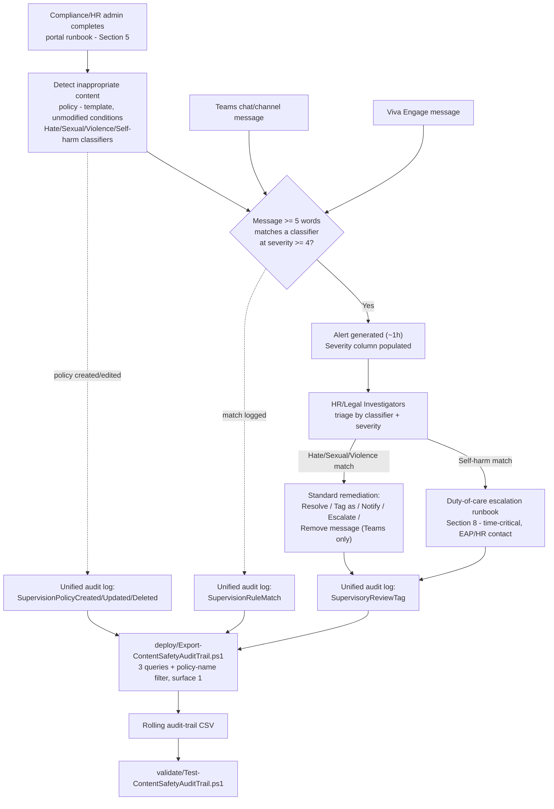

> **Scope note (read before implementation):** Microsoft Purview Communication Compliance has **no
> documented PowerShell, Graph, or REST write API** for policy creation or management, including
> policies created from a built-in template, Microsoft's own docs state this explicitly (§2 below,
> `design.md` §3). Section 5 below therefore describes a precise **portal runbook** for the policy
> itself, backed by a structured reference manifest, and a genuinely scriptable **audit-trail
> export** for the one piece of this solution that *is* reachable through a documented API. Same
> shape this repo already established for `scenarios/communication-compliance/
> harassment-and-code-of-conduct/` and `scenarios/communication-compliance/
> copilot-interaction-detection/`, not a shortcut for this scenario.

## 1. Scenario summary

Deploys Microsoft Purview Communication Compliance's built-in **Detect inappropriate content**
policy template, which applies four **Azure AI Content Safety large-language-model classifiers, 
Hate, Sexual, Violence, Self-harm, Microsoft's severity-ranked (preview) detection layer, distinct
from the pattern-based trainable classifiers this repo's `harassment-and-code-of-conduct` scenario
already uses**, to Microsoft Teams and Viva Engage communications, and layers a scriptable,
idempotent audit-trail export plus a deliberate duty-of-care escalation runbook for Self-harm
matches on top.

**Who it's for:** an enterprise that has deployed `harassment-and-code-of-conduct` (or wants a
Teams/Viva-Engage-specific, severity-ranked complement to it) and additionally needs a documented
control for two risks that scenario's trainable-classifier set does not itself detect: **sexual
content** exchanged over internal chat, and, the differentiator this scenario is built around, 
**employee self-harm risk signals** surfaced through workplace messaging, which carry a distinct
duty-of-care obligation and response process, not just a standard conduct-violation remediation.

## 2. Business/regulatory driver

**Workplace violence prevention and duty of care.** Employers in most jurisdictions carry a
statutory or common-law duty of care for employee health and safety at work, in the US, OSHA's
General Duty Clause; in the EU, the Framework Directive 89/391/EEC's employer duty-of-care
obligations; in the UK, the Health and Safety at Work etc. Act 1974. A messaging-borne threat of
violence (this scenario's **Violence** classifier) is squarely inside that obligation's scope, and
overlaps, deliberately, see §4 below, with `harassment-and-code-of-conduct`'s own **Threat**
trainable classifier as a second, differently-built detection layer for the same underlying risk.

**Psychological safety / self-harm duty of care, the driver this scenario exists primarily to
serve.** No other scenario in this repo detects employee self-harm risk signals in workplace
messaging. A message expressing suicidal ideation or self-harm intent, sent over Teams or Viva
Engage, is simultaneously the single highest-stakes and most time-sensitive signal a workplace
monitoring control can surface, a documented, ignored, or slowly-triaged self-harm signal is a
materially worse legal and human position than not having deployed detection at all (§8 develops
this as a gating operational requirement, not an optional nicety).

**This scenario is a detection-and-escalation aid, not a wellbeing program, and should not be
represented as one.** Deploying this policy and then treating "we have self-harm detection" as
evidence the organization has addressed employee mental-health risk would be a compliance-theater
framing this scenario's own docs reject (§11 restates this as a standing limitation, not a one-time
caveat), a preview classifier with disclosed word-count and language-coverage gaps (§11) will miss
real signals, and this control's value is entirely contingent on the duty-of-care runbook (§8)
actually being followed every time an alert does fire.

> **VERIFY (jurisdiction-specific, outside this build's grounding scope):** the exact scope of an
> employer's duty-of-care obligation for employee mental-health/self-harm risk signals surfaced by a
> messaging-monitoring tool varies by jurisdiction and is actively developing case law and
> regulation in several markets (e.g., psychosocial-hazard frameworks referenced in Australian
> work-health-and-safety guidance, ISO 45003 psychological-health-and-safety-at-work guidance).
> Confirm applicable obligations with employment counsel before citing this scenario as satisfying a
> specific legal requirement, the same caution `harassment-and-code-of-conduct/README.md` §11
> already applies to its own EEOC-guidance currency risk, and `copilot-interaction-detection/
> README.md` §2 applies to AI-governance regulatory citations.

**Regulatory-compliance and business-conduct evidence.** Same general Communication Compliance
framing already established by this repo's sibling scenarios: "detect regulatory compliance ... and
business conduct violations such as sensitive or confidential information, harassing or threatening
language, and sharing of adult content" [[1]](#references), this scenario is the severity-ranked,
Teams/Viva-Engage-specific instance of that framing.

## 3. Prerequisites

Full licensing detail and citations: `docs/licensing-matrix.md` (Communication Compliance row).
Summary for this scenario:

| Requirement | Minimum | Notes |
|---|---|---|
| Communication Compliance license (reviewed users) | **Microsoft Purview Suite** (formerly Microsoft 365 E5 Compliance), **Office 365 E5/A5/G5**, **Microsoft 365 E5/A5/G5**, or **Office 365 E3 + the Advanced Compliance add-on** | `docs/licensing-matrix.md`; confirm current SKU names against the Product Terms before a sales commitment [[9]](#references) |
| Policy authoring role | **Communication Compliance** or **Communication Compliance Admins** role group | Policy authoring from a template is portal-only, see §5 [[10]](#references) |
| Reviewer role (this scenario) | **Communication Compliance Investigators** (full message content), not Analysts (metadata only) | See `design.md` §5. Cross-ref `docs/rbac-model.md` §4 |
| Reviewer mailbox | Reviewers must have a mailbox **hosted on Exchange Online** | Required by the policy-creation workflow itself, same as every other Communication Compliance policy [[10]](#references) |
| Duty-of-care escalation contact (this scenario's own dependency, not deployed by it) | A named Employee Assistance Program (EAP) / HR duty-of-care contact, reachable outside normal Communication Compliance reviewer rotation, confirm after-hours/weekend coverage explicitly, not just a weekday business-hours contact | Communication Compliance has no classifier-specific auto-routing capability (`design.md` §6), this is a *process* prerequisite this scenario's runbook depends on, not a technical one; see §8 for why business-hours-only coverage is a disclosed, material gap |
| Audit log | Enabled (default for most tenants) | Communication Compliance alerts and remediation history depend on it |
| PAYG billing | **Not documented as required** for this scenario's scope (Teams, Viva Engage) | Distinct from the Enterprise AI apps/Other AI apps generative-AI locations, which do carry a PAYG requirement (`copilot-interaction-detection/README.md` §3), no PAYG statement was found specific to the content-safety classifier family on Teams/Viva Engage in this build's grounding pass; confirm against the Product Terms before a sales commitment rather than treating this as a guarantee |
| Automation identity (audit-trail script only) | App registration or account holding **Exchange.ManageAsApp** plus the **View-Only Audit Logs** (or **Audit Logs**) Exchange Online role | `Search-UnifiedAuditLog` requires an **Exchange Online** RBAC role. See `docs/rbac-model.md` §6 and `docs/automation-surface.md` §3 |

> Verify current entitlement names against `docs/licensing-matrix.md` and the Product Terms before a
> sales commitment, SKU names change.

## 4. Architecture



Communication Compliance has no write API (§2, `design.md` §3), so the policy itself is created and
operated entirely through the Purview portal. The one scripted piece, the audit-trail export, 
runs independently on its own schedule, reading (never writing) the unified audit log. The
Self-harm-escalation split shown above (**F1** vs. **F2**) is a *process* control this scenario's
runbook (§8) imposes on top of Communication Compliance's standard investigator workflow, the
product itself has no classifier-specific routing capability (`design.md` §6).

## 5. Step-by-step implementation

### Portal path, creating the policy (there is no script path for this part; see §2/`design.md` §3)

1. Before starting, review `deploy/policy/content-safety-policy-manifest.json`, the recommended
   policy name, scope, and reviewers. **Policy names cannot be changed after creation**
   [[10]](#references), confirm before proceeding.
2. Confirm audit logging is on (§3) and permissions are assigned: at minimum, one person in
   **Communication Compliance Admins** to create the policy, named HR/Legal stakeholders assigned to
   **Communication Compliance Investigators**, and, the prerequisite specific to this scenario, a
   confirmed, reachable EAP/HR duty-of-care escalation contact (§3, §8) [[10]](#references).
3. Sign in to the [Microsoft Purview portal](https://purview.microsoft.com) → **Communication
   Compliance** → **Policies** → **Create policy** → select the **Detect inappropriate content**
   template [[3]](#references).
4. **Name and describe your policy**: `Teams and Viva Engage Content Safety Detection - All Users`
   (from the manifest) → **Next**.
5. **Choose users and reviewers**:
   - Users in scope: **All users** (this scenario's default, matching `harassment-and-code-of-conduct`'s
     own all-users scoping rationale, a self-harm or violence risk signal is not one to leave a
     coverage gap in for any subset of the workforce).
   - Reviewers: add the named HR/Legal stakeholders from the manifest's `reviewers.placeholderMembers`
     (replaced with real accounts), this scenario's default reviewer pool is the **same** HR/Legal
     function `harassment-and-code-of-conduct` uses, deliberately, so a single trained reviewer team
     handles both policies' overlapping risk categories (`design.md` §4). Each reviewer receives an
     automatic email notifying them of the assignment [[10]](#references) → **Next**.
6. **Review the settings chosen for you by the template**: Location = **Microsoft Teams, Viva
   Engage**; Direction = Inbound, Outbound, Internal; Review Percentage = 100%; Conditions = **Hate**,
   **Violence**, **Sexual**, **Self-harm** classifiers [[3]](#references). Do not change these unless
   the tenant has a specific, documented reason (§8), they are exactly this scenario's target
   configuration (`design.md` §2).
7. Select **Create policy** to accept the template as-is, or **Customize policy** only if a
   documented deviation is needed [[3]](#references).
8. **Review and finish** → **Create policy**. Allow up to ~1 hour for Teams/Viva Engage body content
   before the policy begins detecting [[11]](#references).
9. **Enable username anonymization** (if not already on tenant-wide from another Communication
   Compliance policy). **Settings** → **Communication Compliance** → **Privacy** tab → check
   **Show anonymized versions of usernames** → **Save** [[10]](#references). Tenant-wide, not
   per-policy, skip if `harassment-and-code-of-conduct` or `copilot-interaction-detection` already
   enabled it.
10. **Confirm the duty-of-care escalation runbook (§8) is staffed and acknowledged by the reviewer
    team before this policy goes active**, this is a go-live precondition for this scenario, not an
    operational nicety (`reviews.md`, CISO lens).

### Script path, the audit-trail export (idempotent, parameterized, dry-run capable)

```powershell
# 1. Connect (certificate app-only, see docs/automation-surface.md §3). The connecting identity
#    needs Exchange.ManageAsApp PLUS the View-Only Audit Logs Exchange Online role (docs/rbac-model.md §6).
Connect-ExchangeOnline -AppId $AppId -Certificate $Cert -Organization $TenantDomain

# 2. Dry run, queries the last 7 days across all 3 categories, reports what would be merged, writes nothing
./deploy/Export-ContentSafetyAuditTrail.ps1 -OutputCsvPath './out/content-safety-audit-trail.csv' -WhatIf

# 3. First real run, a one-time backfill covering the full default retention window
./deploy/Export-ContentSafetyAuditTrail.ps1 `
    -StartDate (Get-Date).AddDays(-180) -EndDate (Get-Date) `
    -OutputCsvPath './out/content-safety-audit-trail.csv'

# 4. Recurring run (schedule daily or weekly, overlapping windows are safe, see design.md §7)
./deploy/Export-ContentSafetyAuditTrail.ps1 -OutputCsvPath './out/content-safety-audit-trail.csv'

# 5. Validate
./validate/Test-ContentSafetyAuditTrail.ps1 -AuditTrailCsvPath './out/content-safety-audit-trail.csv'
```

The audit-trail script uses Exchange Online PowerShell's `Search-UnifiedAuditLog`, automation
surface 1 per `docs/automation-surface.md` §1, because Communication Compliance has no surface of
its own for anything, including its own audit footprint (`design.md` §3).

## 6. Configuration reference

| Setting | Value this scenario uses | Notes |
|---|---|---|
| Policy type | Template (**Detect inappropriate content**), unmodified | The template's fixed defaults already match this scenario's target, `design.md` §2 |
| Locations | Microsoft Teams, Viva Engage only | **Not** Exchange (unsupported for this classifier family, §11) and **not** the Copilot generative-AI locations by template default (§11 documents the optional edit to add one) |
| Direction | Inbound, Outbound, Internal | Full coverage, template default |
| Users in scope | All users | See §5, a self-harm/violence risk control is not one to leave scoped out for any subset of the workforce |
| Conditions | Hate, Violence, Sexual, Self-harm (Azure AI Content Safety LLM classifiers, preview) | `design.md` §5 for exactly what each does and does not cover |
| Minimum message length to evaluate | **Documented inconsistently by Microsoft: "three or more words" in one section of the same source page, "five or more words" in another** | See §11, a genuine, disclosed source inconsistency, not resolved by guessing which figure is current |
| Message length ceiling | Up to 10,000 characters per message | [[4]](#references) |
| Severity threshold for alert + Severity column | 4 or higher (on Azure AI Content Safety's 0-7, trimmed-to-0/2/4/6 scale) | [[4]](#references)[[12]](#references), a materially different triage mechanism from `harassment-and-code-of-conduct`'s trainable classifiers, which carry no severity score at all |
| Review percentage | 100% | Template default; a documented, revisitable lever if alert volume becomes unmanageable, §8 |
| Reviewer role | Communication Compliance Investigators | Full content access, `design.md` §5 |
| Reviewer pool (this scenario's default) | Same HR/Legal pool as `harassment-and-code-of-conduct` | Deliberate reuse, not a new pool, `design.md` §4 |
| Duty-of-care escalation path (Self-harm matches) | Process control layered on top of the standard workflow, §8 | Not a Communication Compliance product feature; this scenario's own runbook |
| Username anonymization | On (tenant-wide setting) | Settings > Communication Compliance > Privacy, shared with any other Communication Compliance policy in the tenant |
| OCR / attachments / meeting transcripts | Not evaluated by this classifier family | [[4]](#references), a materially narrower content surface than the trainable-classifier family, which does support OCR |
| Feedback loop (misclassification reporting to Microsoft) | **Not yet supported** for this classifier family | [[4]](#references), unlike the trainable classifiers, which do support it (`harassment-and-code-of-conduct/README.md`'s classifier table) |
| Audit-trail script query categories | `PolicyMatch` (`SupervisionRuleMatch`), `PolicyUpdate` (`RecordType Discovery` + 3 operations), `ReviewTag` (`RecordType AeD` + `SupervisoryReviewTag`) | Identical grounded shape to both sibling scenarios, `design.md` §7 |
| Audit-trail script policy-name filter | `-PolicyNameFilter 'Teams and Viva Engage Content Safety Detection - All Users'` (default) | Client-side filter, same pattern as `copilot-interaction-detection`, `design.md` §7 |
| Audit-trail script idempotency | Merge + de-duplicate by `(CreationDate, Operations, UserIds, hash(AuditData))` | Same rolling-history pattern as both sibling scenarios' audit-trail scripts |

Full cmdlet parameter grounding: `deploy/Export-ContentSafetyAuditTrail.ps1`'s inline comments and
its `.NOTES` block cite the exact Microsoft Learn reference pages.

## 7. Validation / how to prove it works

1. **Automated file-integrity check**, `./validate/Test-ContentSafetyAuditTrail.ps1
   -AuditTrailCsvPath './out/content-safety-audit-trail.csv'` confirms the CSV's schema, no
   duplicate composite-key rows, valid Category/Operation/ContentSafetyContext values, and sorted
   timestamps; exits non-zero on any hard failure (safe for a CI-style pre-flight).
2. **Manual verification checklist**, the same script prints a checklist (policy exists, correct
   template/location/conditions/reviewers, anonymization configured, storage limit healthy, **and the
   duty-of-care escalation contact is confirmed staffed**, §8) because none of these have a read API
   to check programmatically (`design.md` §3).
3. **Functional test (non-crisis-simulating, benign example)**, from a test account, send a Teams
   chat message using clearly non-harmful test language that nonetheless matches one of the four
   classifiers' general subject area (e.g., a message discussing a fictional/gaming scenario
   involving violence, which Microsoft's own severity-level documentation describes as typically
   scoring Low, not necessarily triggering the severity-4 alert threshold [[12]](#references)), 
   **do not send a real or simulated self-harm-intent message as a test, under any circumstances**
   (§11 gating warning). Confirm the intended detection behavior against the documented severity
   threshold rather than assuming any borderline test message will or won't alert.
4. **Functional test (audit-trail script)**, in the Purview portal, edit the policy (e.g. add a
   reviewer). Wait for audit-log ingestion, then re-run the deploy script with a `-StartDate`
   covering that window. Expect: a new row with `Category = PolicyUpdate` and
   `Operation = SupervisionPolicyUpdated`.
5. **Duty-of-care runbook drill (recommended, not a technical test)**, before go-live, run a
   tabletop exercise with the reviewer team and the EAP/HR escalation contact confirming each knows
   their role if a genuine Self-harm-classifier alert arrives, this is the single most important
   "does it work" question for this scenario, and it has no automated check (§8, `reviews.md` CISO
   lens).
6. **Evidence for an audit committee or compliance review**, the native **Alerts** dashboard
   (including its **Severity** column, unique to this classifier family among this repo's
   Communication Compliance scenarios) is the primary evidence surface; this scenario's audit-trail
   CSV is a **secondary**, complementary artifact proving who could edit the policy and when a
   reviewer took a remediation action, not a replacement for the native alert record itself, which
   retains the actual message text.

## 8. Operations & tuning

**Establish and staff the Self-harm duty-of-care escalation path BEFORE this policy goes
active, this is this scenario's single gating operational requirement, not a tunable KPI.**
Communication Compliance has no classifier-specific auto-routing capability: a Self-harm match
lands in the same Investigator alert queue as a Hate, Sexual, or Violence match, with no
product-level urgency differentiation beyond the shared Severity column [[10]](#references). This
scenario's runbook therefore requires the reviewer team to:

1. **Triage every new alert by classifier first, severity second.** A **Self-harm** classifier match
, at any severity level Communication Compliance surfaces as an alert, is treated as
   **time-critical** and routed immediately to the named EAP/HR duty-of-care contact (§3), in
   parallel with (not instead of) standard Investigator review. Do not wait for a scheduled daily
   triage cycle for a Self-harm match.

   **This requires the duty-of-care escalation contact (§3) to be reachable outside standard
   business hours, not just during them.** Detection latency for Teams/Viva Engage body content is
   already up to ~1 hour (§6); if the escalation contact is only monitored 9-to-5 on weekdays, a
   message sent Friday evening could go unaddressed until Monday, a gap of days, not hours, for
   exactly the signal this scenario exists to catch quickly. Before go-live, confirm with the named
   contact (or the organization's crisis-response/EAP function generally) whether after-hours and
   weekend coverage exists; if it does not, document that gap explicitly as a known, accepted
   residual risk rather than letting the runbook silently imply 24/7 coverage it doesn't have
   (`reviews.md`, Red Team finding).
2. **Do not treat a Self-harm match as a conduct violation.** The standard remediation vocabulary, 
   Resolve, Tag as Noncompliant, Notify, Escalate, is built for policy-violation triage, not a
   welfare check. A Self-harm-classifier alert's outcome should be a human welfare response
   coordinated with HR/EAP, documented separately from (though still tagged/resolved within,
   for audit-trail completeness) the standard Communication Compliance workflow.
3. **Hate, Sexual, and Violence classifier matches** follow the same remediation workflow this
   repo's other Communication Compliance scenarios already document: Resolve, Tag as
   Compliant/Noncompliant/Questionable, Notify, Escalate, or (Teams only) Remove message
   [[13]](#references).
4. **Document the escalation, even when it turns out to be a false positive or a non-crisis
   context** (e.g., a message discussing self-harm in a clinical/educational/support-group context
   the classifier flagged without intent present), a documented "reviewed, no welfare concern
   found" outcome is the defensible record; silence on a flagged self-harm signal is not.

**KPIs to watch (first 30 days):**
- **Self-harm match volume and time-to-first-human-contact**, the single most important metric this
  scenario produces. Track from alert-generation timestamp to the duty-of-care contact's first
  documented action, not just to Investigator triage.
- **Hate/Violence match volume by team or business unit**, an unexpectedly concentrated pattern is
  worth investigating as a workplace-culture signal, not just a series of individually-triaged
  alerts (same framing `harassment-and-code-of-conduct/README.md` §8 already establishes for its own
  overlapping Threat/Discrimination classifiers).
- **Sexual-classifier match volume**, the one classifier in this policy with no direct counterpart
  in `harassment-and-code-of-conduct`'s trainable-classifier set; establish a baseline over the first
  30 days rather than assuming any particular volume is normal.
- **Overlap rate with `harassment-and-code-of-conduct` alerts** (if that scenario is also deployed), 
  a message matching both policies (e.g., a threatening message catching both the Threat trainable
  classifier and this policy's Violence LLM classifier) is expected and not a bug (`design.md` §4);
  track it to confirm the two policies are behaving as complementary, not redundant, layers.
- **Storage-limit indicator**, the same hard **100 GB or 1,000,000-message** per-policy limit as
  every other Communication Compliance policy in this repo; reaching it **auto-deactivates the
  policy with no in-band alert to anyone outside the Communication Compliance/Communication
  Compliance Admins role groups** [[10]](#references). Monitor actively, the consequence of a
  silently-deactivated Self-harm detection control is materially worse than for a general
  conduct-monitoring policy.

**Short messages bypass this classifier family entirely, consider a compensating custom keyword
dictionary if that risk is material for this tenant.** Whether the true minimum is three or five
words (§11's disclosed source inconsistency), a short, unambiguous message, "going to hurt him",
"want to end it", can fall under either threshold and never reach the classifier at all. This is a
genuine, exploitable detection gap, not just a documentation nit: an evasive or simply terse sender
is not detected by word-count alone. `harassment-and-code-of-conduct/deploy/policy/
code-of-conduct-evasion-phrases.txt` already establishes the pattern for this repo, a custom
keyword dictionary targeting known short-form crisis/threat phrasing, as a compensating control
layered onto a classifier-only policy. This scenario does not ship one by default (the template's
fixed classifier set is deliberately used unmodified, `design.md` §2), but a tenant with a confirmed
short-message risk profile should use **Customize policy** (§5, step 7) to add one, following the
same non-slur, evasion-focused content discipline `harassment-and-code-of-conduct/design.md` §4
already establishes, adapted for short crisis/threat phrasing rather than concealment phrasing.

**No feedback loop to Microsoft for misclassified items (yet).** Unlike the trainable classifiers
(`harassment-and-code-of-conduct`'s **Report as Misclassified** action improves future accuracy),
this preview classifier family does not yet support submitting corrections back to Microsoft
[[4]](#references), a documented false positive today does not improve the model tomorrow; plan
reviewer workload accordingly rather than expecting the false-positive rate to self-improve over
time the way it might for the trainable-classifier scenario.

**Lower the default alert-aggregation threshold, same reasoning as `copilot-interaction-detection`
applied to its own security-sensitive matches.** Communication Compliance's system-generated alert
policy defaults to a **4-activity threshold within a 60-minute window** [[10]](#references), for a
policy whose most important signal (Self-harm) should ideally not wait for a fourth matching
activity in an hour before the first alert fires, lower this policy's alert-policy threshold to
Microsoft's documented **minimum of 3** activities on the **Alert policies** page. A true
single-event alert is not configurable (3 is the floor), but 3 is materially better than the
default 4 for this scenario's risk profile.

**Consider a phased pilot before "All users" only if the Self-harm duty-of-care runbook is not yet
staffed**, otherwise, deploy to All users from day one; unlike `harassment-and-code-of-conduct`'s
and `copilot-interaction-detection's` optional pilot recommendation, narrowing this scenario's scope
means narrowing self-harm-risk coverage, which is a materially different trade-off than narrowing a
general conduct-monitoring policy's blast radius. Do not default to a pilot here without a specific
reason.

**Alternative/complementary path: add Copilot as a location.** Microsoft documents that Azure AI
classifiers for this family also apply to Microsoft 365 Copilot [[4]](#references), even though the
**Detect inappropriate content** template's own fixed location list is Teams/Viva Engage only
[[3]](#references), adding **Microsoft Copilot experiences** as a location to this policy (or a new
one) via **Edit** → **Choose locations to detect communications** is a documented, supported edit
[[7]](#references), matching the same "add a location to an existing policy" pattern
`copilot-interaction-detection/README.md` §8 documents in reverse. Not deployed by this scenario's
default configuration, see `design.md` §8.

**Review cadence:** Self-harm matches, immediate, always (§8 item 1). Daily triage of all other new
alerts. Weekly review of the Reports page trends. Monthly review of match-volume baselines and the
Self-harm-runbook drill cadence (recommend quarterly tabletop exercises, not just a one-time go-live
drill). Immediately upon any audit-trail `PolicyUpdate` or storage-limit-approaching warning.

**Incident-response runbook (alert triage):**
1. **Triage by classifier first** (§8 above), Self-harm routes to the duty-of-care path in
   parallel with standard review; Hate/Sexual/Violence follow the standard workflow.
2. **Examine the message details**, sender, direction, severity, and the full flagged text, 
   before deciding a remediation action [[13]](#references).
3. **Remediate**: **Resolve** (including "misclassified" if a false positive), **Tag as**
   Compliant/Noncompliant/Questionable, **Notify**, **Escalate**/**Escalate for investigation**, or
   (Teams only) **Remove message** [[13]](#references). A Self-harm match's remediation tag should
   reflect the welfare-check outcome (§8 item 2), not just a conduct-violation disposition.
4. **For a Violence-classifier match indicating a credible threat**, treat it as a security incident
   per the organization's existing threat-management process, in addition to Communication
   Compliance remediation, cross-reference `scenarios/insider-risk/` if deployed.
5. **Document**, every remediation action is captured in the unified audit log as a
   `SupervisoryReviewTag` event and merged into this scenario's audit-trail CSV; do not delete rows
   from it. For a Self-harm escalation specifically, also document the duty-of-care contact's
   response per the org's own HR/EAP record-keeping process (outside Communication Compliance).

## 9. Rollback / decommission

See `rollback.md` for the full staged procedure (pause → revoke access → delete, handled
independently from the audit-trail script's own rollback). Quick reference: use **Pause policy** in
the portal for a reversible stop; **Delete** only when permanently retiring the control, Delete
**permanently removes all captured messages and alerts** [[10]](#references). **Do not pause or
delete this policy without a documented decision that accounts for the loss of self-harm-risk
detection coverage**, see `rollback.md` for why this scenario's rollback carries a materially
different risk calculus than a general conduct-monitoring policy's.

## 10. Cost & licensing notes

- **No PAYG component documented for this scenario's scope.** Teams and Viva Engage are core
  Microsoft 365 workloads, distinct from the PAYG-gated Enterprise AI apps/Other AI apps generative-AI
  locations (`copilot-interaction-detection/README.md` §10), no PAYG requirement was found specific
  to the content-safety classifier family on these locations during this build's grounding pass;
  confirm against the Product Terms before a sales commitment (§3).
- **No additional Azure subscription required.** These classifiers run as part of the Communication
  Compliance service, not a separately-billed Azure AI Content Safety resource the buyer provisions
  directly.
- **Sizing note:** given this scenario's "all users" default (§5/§8), cost is primarily the
  Communication Compliance E5-tier entitlement itself, typically already satisfied by a tenant
  running `harassment-and-code-of-conduct` or `copilot-interaction-detection` in this repo. The
  incremental cost of deploying this scenario alongside either sibling is the operational cost of
  reviewer workload and the duty-of-care escalation process (§8), not incremental licensing.

## 11. Known limitations & gotchas

- **This scenario cannot script policy creation, condition tuning, or reviewer assignment.** Same
  documented gap as both sibling scenarios, no such API exists as of this writing (`design.md` §3).
- **Genuine, disclosed source inconsistency in Microsoft's own documentation: the minimum message
  length these classifiers evaluate is stated as "three or more words" in one section of
  `communication-compliance-policies` and "five or more words" in a different section of the
  *same* live page** [[4]](#references). This build's grounding pass confirmed both figures appear
  verbatim on the current page, not a stale-cache artifact from comparing two different page
  versions. This scenario does not silently pick one; **VERIFY the actual behavior against a test
  message in the tenant at deploy time** rather than relying on either published figure.
- **Preview status.** These are explicitly "content safety classifiers (preview)", subject to
  change, and evaluated as a materially newer, less broadly production-hardened capability than the
  trainable-classifier family `harassment-and-code-of-conduct` uses [[3]](#references).
- **Narrower workload coverage than `harassment-and-code-of-conduct`.** Exchange is not a supported
  location for this classifier family, only Microsoft 365 Copilot, Teams, and Viva Engage
  [[4]](#references). A threatening or self-harm-risk message sent by email is invisible to this
  specific policy; `harassment-and-code-of-conduct`'s Exchange-inclusive trainable classifiers remain
  the only coverage for that channel in this repo.
- **No coverage for OCR images, attachments, or Teams meeting transcripts.** [[4]](#references), a
  materially narrower content surface than the trainable-classifier family, which does support OCR.
  A self-harm or violent-threat image, or a spoken threat in a Teams meeting, is not detected by this
  policy.
- **No feedback loop to Microsoft yet** (§8), unlike the trainable classifiers.
- **Language support is not confirmed to match Purview's general "12 languages" claim for
  Communication Compliance overall.** The underlying Azure AI Content Safety text models are
  documented as "specially trained and tested" on eight languages (Chinese, English, French, German,
  Spanish, Italian, Japanese, Portuguese), with broader but lower-quality support in "many other
  languages" [[5]](#references), this scenario does not assert a specific supported-language count
  for the Purview-configured classifiers specifically, since no worked example in this build's
  grounding pass confirmed whether Purview's general Communication Compliance language-support claim
  applies identically to this preview classifier family. **VERIFY** actual non-English detection
  behavior in the tenant before relying on it for a non-English-majority workforce.
- **No Communication Compliance product capability routes a Self-harm match differently from a
  Hate/Sexual/Violence match.** The duty-of-care escalation split this scenario's runbook (§8)
  depends on is entirely a **process control this scenario's own docs establish**, it does not
  exist as a technical safeguard inside Communication Compliance itself, and depends entirely on
  reviewers correctly following the runbook every time. A reviewer team that has not internalized §8
  will not be technically prevented from mishandling a Self-harm alert.
- **This is a detective, not a preventive, control**, same as both sibling scenarios. By the time an
  Investigator (or the duty-of-care contact) sees a Self-harm alert, the message has already been
  sent; this policy does not intervene in real time. Pair with the organization's existing crisis
  hotline/EAP promotion as the actual preventive/supportive layer, this scenario is a detection and
  escalation aid, not a substitute for one.
- **Storage-limit auto-deactivation is a silent failure mode**, identical risk to both sibling
  scenarios, with a materially worse consequence given this scenario's Self-harm coverage; monitor
  actively (§8).
- **VERIFY:** the exact shape of the `AuditData` JSON payload for a `SupervisionRuleMatch` event
  specific to this four-classifier pairing was not independently confirmed against a worked example
  in this build's grounding pass (same disclosed gap pattern as `copilot-interaction-detection/
  README.md` §11). `deploy/Export-ContentSafetyAuditTrail.ps1`'s best-effort `ContentSafetyContext`
  and `SeverityHint` derived columns are deliberately non-blocking, a parse miss never fails or
  drops a row, but should not be treated as fully confirmed until validated against a real tenant's
  actual audit-log output.
- **Do not use a real or simulated self-harm-intent message to functionally test this policy**, even
  from a test account, §7 documents a safer validation approach. Testing a detection control for a
  crisis signal is not the same as testing a spam filter; treat any message that could be construed
  as expressing self-harm intent with the same seriousness as a genuine one, regardless of sender
  context.
- **VERIFY (jurisdiction-specific):** see §2, confirm applicable duty-of-care obligations with
  employment counsel before citing this scenario as satisfying a specific legal requirement.

## 12. References

1. Communication Compliance solution overview, <https://learn.microsoft.com/purview/communication-compliance-solution-overview>
2. Create and manage Communication Compliance policies, "PowerShell isn't supported..." statement, <https://learn.microsoft.com/purview/communication-compliance-policies#create-and-manage-policies>
3. Create and manage Communication Compliance policies, policy template table (Inappropriate content row: location, direction, review percentage, conditions), <https://learn.microsoft.com/purview/communication-compliance-policies#choose-a-policy-template>
4. Create and manage Communication Compliance policies, Content safety classifiers based on large language models, and Considerations when using classifiers (workload scope, word-count figures, OCR/attachment/transcript exclusions, character limit, no feedback loop), <https://learn.microsoft.com/purview/communication-compliance-policies#content-safety-classifiers-based-on-large-language-models>, <https://learn.microsoft.com/purview/communication-compliance-policies#policy-settings>
5. Language support for Azure AI Content Safety (eight specially-trained languages; broader but lower-quality support elsewhere), <https://learn.microsoft.com/azure/ai-services/content-safety/language-support>
6. Communication Compliance, Limitations of Communication Compliance (evasive-typing coverage, "12 languages supported today" general product claim), <https://learn.microsoft.com/purview/communication-compliance-solution-overview#limitations-of-communication-compliance>
7. Get started with Communication Compliance, Choose locations to detect communications (generative AI channel options, including Microsoft Copilot experiences), <https://learn.microsoft.com/purview/communication-compliance-configure#step-5-required-create-a-communication-compliance-policy>
8. Create and manage Communication Compliance policies, Integrate Communication Compliance with Microsoft Purview Insider Risk Management (documented but not configured by this scenario), <https://learn.microsoft.com/purview/communication-compliance-policies#integrate-communication-compliance-with-microsoft-purview-insider-risk-management>
9. Microsoft Purview service description, Communications Compliance (licensing table), <https://learn.microsoft.com/office365/servicedescriptions/microsoft-365-service-descriptions/microsoft-365-tenantlevel-services-licensing-guidance/microsoft-purview-service-description#microsoft-purview-communications-compliance>
10. Create and manage Communication Compliance policies (policy templates, storage limits, pause/copy, alert policy default threshold/window/minimum), <https://learn.microsoft.com/purview/communication-compliance-policies>
11. Create and manage Communication Compliance policies, Policy activity detection / time-to-detection table (Teams body content, Viva Engage body content: 1 hour), <https://learn.microsoft.com/purview/communication-compliance-policies#policy-activity-detection>
12. Harm categories in Azure AI Content Safety, severity levels (full 0-7 scale, trimmed to 0/2/4/6), <https://learn.microsoft.com/azure/ai-services/content-safety/concepts/harm-categories#severity-levels>
13. Investigate and remediate Communication Compliance alerts (Analysts vs. Investigators permissions, remediation actions), <https://learn.microsoft.com/purview/communication-compliance-investigate-remediate>
14. Assign permissions in Communication Compliance (role-group action matrix), <https://learn.microsoft.com/purview/communication-compliance-permissions>
15. Search-UnifiedAuditLog reference, <https://learn.microsoft.com/powershell/module/exchangepowershell/search-unifiedauditlog>
16. Audit log activities, Communication compliance activities table, <https://learn.microsoft.com/purview/audit-log-activities#communication-compliance-activities>
17. Use Communication Compliance with SIEM solutions (SupervisionRuleMatch worked example), <https://learn.microsoft.com/purview/communication-compliance-siem>
18. Use Communication Compliance reports and audits (Discovery/AeD RecordType + Operations worked examples), <https://learn.microsoft.com/purview/communication-compliance-reports-audits>
19. Manage audit log retention policies (180-day Standard default, 1-year E5 default), <https://learn.microsoft.com/purview/audit-log-retention-policies>
20. Detect channel signals with Communication Compliance, Viva Engage detection latency, Native Mode requirement, <https://learn.microsoft.com/purview/communication-compliance-channels#viva-engage>

> Re-verify all links, cmdlet/API behavior, and licensing terms against current Microsoft Learn
> before a customer-facing assessment or sale, this module changes faster than most in the
> Purview portfolio, and this scenario's classifier family is explicitly preview.
