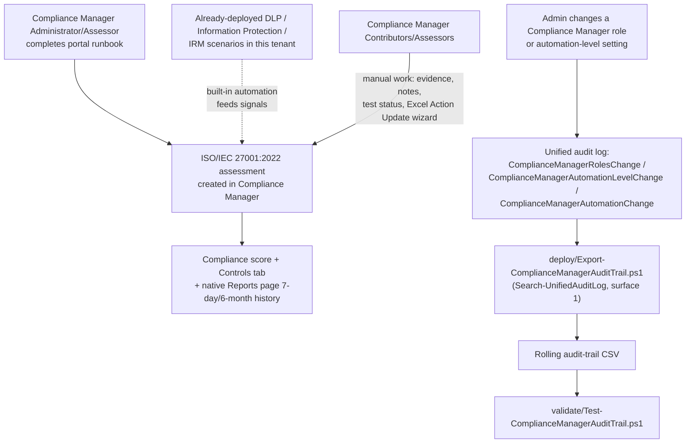

## 1. Problem statement

A security/compliance team that has already implemented technical controls elsewhere in this
library (DLP, sensitivity labels, retention, Insider Risk Management) needs a single, scored,
audit-ready view of how those controls — plus everything else ISO/IEC 27001:2022's Annex A
covers — map to a recognized management-system standard, for a certification audit, a customer
security questionnaire, or an internal ISMS (Information Security Management System) review.
Microsoft Purview Compliance Manager ships a **premium regulatory template** for exactly this
purpose. This scenario stands one up correctly, operates it, and — where Compliance Manager's own
automation surface allows — layers scriptable monitoring on top of a solution that is otherwise
entirely portal-driven.

## 2. Why this scenario looks different from every other scenario in this repo

Every other scenario in `scenarios/` ships a `deploy/*.ps1` that idempotently **creates** a
Purview object (a DLP policy, a scan, a glossary term) against a documented write API. Compliance
Manager has **no such API**. As of this build (grounded via the Microsoft Learn MCP tool against
the current `compliance-manager-assessments`, `compliance-manager-update-actions`, and
`compliance-manager-setup` articles — see `README.md` §12), assessment creation, control-mapping,
and improvement-action status/evidence updates are **exclusively portal- and Excel-wizard-driven**:

- **Create an assessment**: a multi-step guided wizard in the Purview portal (**Assessments** →
  **Add assessment**). No REST, Graph, or PowerShell equivalent is documented.
- **Bulk-update improvement actions** (status, evidence, notes): **Export actions** downloads an
  Excel file from the portal; you edit the **Action Update** tab by hand; **Update actions**
  re-uploads it through a portal wizard that validates the file server-side. This is the closest
  thing Compliance Manager has to a "bulk API," and it is still two manual portal button-clicks
  bracketing the edit, not a callable endpoint.
- **`docs/automation-surface.md`'s own routing table (§4) confirms this** — it lists a surface for
  every other Risk & Compliance module (DLP, retention, IRM, Communication Compliance, eDiscovery,
  Information Barriers, Audit) but has no row for Compliance Manager, because none of the four
  automation surfaces reach it.

**This is not a gap in this scenario's research — it is the current, correct state of the
product**, and pretending otherwise (inventing a `New-ComplianceManagerAssessment` cmdlet, or
guessing the Action Update Excel's exact column schema so a script could "generate" it) would
violate `AGENTS.md` §4's no-invented-cmdlets rule for zero real benefit: a fabricated script that
doesn't match the portal wizard's actual validation would fail on first use and cost the buyer
more time than a correctly-labeled manual runbook. See the Microsoft Product Owner lens in
`reviews.md` for why building a portal runbook instead of a fake script is the right call, not a
shortcut.

**What this scenario ships instead**, to still meet `AGENTS.md` §9's definition of done:

1. A precise, repeatable **portal runbook** (`README.md` §5, backed by a structured, versioned,
   explicitly-non-executable JSON manifest at `deploy/policy/iso27001-assessment-manifest.json` —
   the same "reference manifest, not an API payload" pattern this repo already established in
   `scenarios/insider-risk/departing-employee-data-theft/` for Insider Risk Management policy
   authoring, which has the identical no-write-API constraint).
2. One genuinely scriptable, genuinely useful piece of real automation that **does** have a
   documented, grounded API: `deploy/Export-ComplianceManagerAuditTrail.ps1`, which pulls the
   three Compliance Manager operations Microsoft's audit log **does** document (§4 below) — not a
   simulation of assessment progress, but real drift detection for the two things about
   Compliance Manager's own configuration that, if changed quietly, would make an otherwise-solid
   ISO 27001 assessment untrustworthy as evidence.

## 3. Design goals

1. Stand up a **dedicated ISO/IEC 27001:2022 assessment** (not just rely on the default Data
   Protection Baseline assessment, which blends NIST CSF/ISO/FedRAMP/GDPR elements and is not
   itself sufficient evidence for an ISO 27001 audit — see §5 below) with a deliberate grouping
   strategy and a minimal, correct services scope.
2. Make the connection between this assessment and this library's **already-built technical
   controls** explicit, so a buyer who has already deployed
   `scenarios/dlp/pci-teams-exfil-block/`, `scenarios/information-protection/
   auto-label-confidential-sharepoint/`, `scenarios/dlp/endpoint-dlp-usb-block/`, or
   `scenarios/insider-risk/departing-employee-data-theft/` understands that those controls feed
   Compliance Manager's **built-in automation** directly (§6 below) rather than treating this
   assessment as a from-scratch effort.
3. Give the security team a way to detect the two categories of **silent, score-invalidating
   configuration drift** Compliance Manager's own Reports page (which tracks improvement-action
   score changes, not administrative changes — see `README.md` §11) does not surface: who can
   edit the assessment (`ComplianceManagerRolesChange`), and whether the org-wide or per-action
   trust level of automated testing itself was weakened (`ComplianceManagerAutomationLevelChange`,
   `ComplianceManagerAutomationChange`).
4. Never fabricate what isn't documented: no invented Compliance Manager cmdlet, no guessed Excel
   column schema, no assumed REST endpoint. Where Microsoft's own docs don't specify a detail
   (e.g., whether score changes and assessment-creation events themselves are separately
   audit-logged with their own operation names), this scenario says so explicitly rather than
   guessing — see `README.md` §11.
5. Everything that **is** scripted is idempotent, parameterized, and has a dry-run path per
   `AGENTS.md` §4 — same standard as every other scenario in this repo, even though the
   "deployable object" here is a CSV report, not a Purview policy.

## 4. What Compliance Manager's audit log actually documents (the grounding this scenario's code rests on)

Microsoft's `audit-log-activities` reference (fetched directly, current as of this build) lists
exactly **three** Compliance-Manager-specific operations recorded in the unified audit log:

| Friendly name | Operation | What it means |
|---|---|---|
| Roles change | `ComplianceManagerRolesChange` | An admin changed a user's Compliance Manager role (Administration / Contribution / Assessor / Reader, tenant-wide or scoped to a specific assessment/regulation). |
| Tenant automation level change | `ComplianceManagerAutomationLevelChange` | An admin changed the org-wide automated-testing trust level across **all** improvement actions. |
| Testing source automation change | `ComplianceManagerAutomationChange` | An admin changed the automated-testing source settings for a specific improvement action (e.g. switched it from automatic to manual testing, or vice versa). |

Nothing else about Compliance Manager is separately audit-logged under its own operation name in
this reference — **assessment creation/deletion and improvement-action status changes are not in
this list**. This scenario's audit-trail script therefore cannot (and does not claim to) detect
"someone marked action X as Passed" — that is what the native **Reports** page's 7-day (extendable
to 6-month) history report already covers natively inside Compliance Manager, with no script
needed. What this script covers is the two things the Reports page does **not** track: who has
edit access, and whether the automated-testing trust boundary itself was loosened. See
`README.md` §11 for this distinction spelled out for a buyer evaluating what this script does and
doesn't replace.

**A narrower but important gap within that "who has edit access" claim** (raised in the Red Team
lens, `reviews.md`): `ComplianceManagerRolesChange` only fires for an **explicit, assessment-level
or Compliance-Manager-scoped** role assignment. A user who gets Administration-equivalent access
implicitly through the Global Administrator, Compliance Administrator, Compliance Data
Administrator, or Security Administrator **Entra ID role** generates no such event — and Microsoft
confirms these users don't even appear on the Compliance Manager **User access** settings page
[[3]](#references, `README.md`). This script's audit trail is therefore a record of explicit
Compliance Manager role grants, not a complete record of everyone who could edit this assessment —
`scenarios/compliance-manager/entra-privileged-role-monitoring/` now scripts the Entra
directory role-assignment cross-check this gap requires, as a companion scenario rather than a
change to this one's own script; see `README.md` §11.

## 5. Why a dedicated assessment instead of extending the Data Protection Baseline

Every tenant already has the **Data Protection Baseline** default assessment (free at every
subscription level), which draws elements from NIST CSF, ISO, FedRAMP, and GDPR — not a complete,
citable ISO/IEC 27001:2022 control set, and not swappable into one. Building on it instead of a
dedicated ISO 27001 assessment would produce a compliance score that mixes frameworks in a way no
auditor can cleanly map back to Annex A, and — like the tenant's default (weak) Teams DLP policy
in `scenarios/dlp/pci-teams-exfil-block/design.md` §3a — the baseline assessment is a starting
point Microsoft explicitly documents as such, not a substitute for the framework-specific premium
template. This scenario deploys a dedicated, named ISO/IEC 27001:2022 assessment for the same
class of reason that scenario deploys a dedicated DLP policy: a shared, generic default should not
silently carry one control's specific evidentiary weight.

## 5b. Why :2022, not :2013 (re-grounded 2026-09-10, supersedes this scenario's original VERIFY)

The original build of this scenario (`reviews.md`, Microsoft Product Owner finding 2) flagged the
:2013-vs-:2022 template choice as an open VERIFY rather than a decision, because its Microsoft
Learn search at the time only surfaced :2013 documentation. A fresh grounding pass (Microsoft
Learn MCP, re-fetched 2026-09-10) resolves this:

1. **Both templates exist side by side today.** Compliance Manager's `compliance-manager-
   regulations-list` article lists **ISO/IEC 27001:2013** and **ISO/IEC 27001:2022** as two
   separate entries under Premium regulations → Global — confirmed by direct fetch, not merely a
   search snippet [[17]](#references, `README.md`).
2. **The industry-wide transition window has closed.** The International Accreditation Forum's
   mandatory transition document (IAF MD 26) set the following, now-elapsed deadlines: certification
   bodies stopped conducting **initial or recertification** audits against ISO/IEC 27001:2013 after
   **April 30, 2024**, and every ISO/IEC 27001:2013 certificate had to **expire or be reissued**
   against :2022 by **October 31, 2025** [[18]](#references, `README.md`). As of this build's date (2026-09-10),
   both deadlines are in the past — an organization pursuing a *new* certification, or maintaining
   an existing one, has no path that still ends in a valid :2013 certificate.
3. **Microsoft's own certification has already moved.** The Office 365/Microsoft 365 ISO/IEC 27001
   certificate Microsoft cites from its own compliance offering page is now the **"Microsoft 365 -
   ISO 27001:2022 Certificate (2024-2027)"** [[19]](#references, `README.md`) — Microsoft assesses its own cloud
   infrastructure against :2022, not :2013, as of the 2024-2027 cycle.

**Conclusion:** this scenario now targets **ISO/IEC 27001:2022** as the regulation/template
(`README.md` §5 step 4, manifest `regulation`/`assessmentName`). The :2013 template is left in
place in Microsoft's catalog (likely for tenants with assessments already built against it, or as
a historical reference) but is not the correct choice for a new assessment as of this build — a
buyer who already has a live :2013 assessment from an earlier deployment of this scenario should
plan a controlled migration (create the new :2022 assessment per the runbook, carry over
evidence/notes manually per improvement action — Compliance Manager does not document an
assessment-to-assessment copy/upgrade path — then retire the :2013 assessment per `rollback.md`),
not an in-place edit: an assessment's regulation/template is set at creation and is not
documented as changeable afterward, the same "effectively permanent" constraint that already
governs this assessment's name and group (`README.md` §5, steps 4-5).

**One residual citation gap, disclosed rather than papered over:** unlike :2013 (which has a
dedicated, citable "ISO/IEC 27001:2013 Information Security Management Standards" page under
`learn.microsoft.com/compliance/regulatory/offering-iso-27001` that explicitly names the
Compliance Manager premium template), this grounding pass found **no equivalent dedicated page
under that same `/compliance/regulatory/` path branded for :2022** — the only ":2022"-titled page
found lives under `/azure/compliance/offerings/offering-iso-27001` and documents **Azure's own**
ISO/IEC 27001:2022 certification, not the Compliance Manager customer-facing premium template
specifically. This scenario therefore cites `compliance-manager-regulations-list` (which does
directly name the :2022 template) as the primary source for the template's existence, rather than
reusing the :2013 page's URL as if it also covered :2022 — see `README.md` §11 and §12.

## 6. How this assessment gets its evidence (design intent, not a verified per-control map)

Compliance Manager's own **built-in automation** (grounded in `README.md` §12, "Working with
improvement actions" reference) detects signals from other Purview solutions the tenant
subscribes to — **Data Lifecycle Management, Information Protection, Data Loss Prevention,
Communication Compliance, and Insider Risk Management** (plus Microsoft Priva, in preview) — and
automatically tests the improvement actions those signals map to. This scenario does not, and as
of this build cannot, verify or reproduce Microsoft's proprietary per-control mapping between a
specific improvement action and a specific tenant setting (that mapping is rendered inside the
Compliance Manager UI per action, not published as a document this scenario can fetch and cite).
What is grounded and safe to state as design intent: a tenant that has already deployed this
library's `scenarios/dlp/`, `scenarios/information-protection/`, and `scenarios/insider-risk/`
scenarios has already moved the needle on some unknown-but-nonzero subset of this assessment's
improvement actions before a human opens the **Improvement actions** tab — deploying those
scenarios first, then creating this assessment, is the recommended order (`README.md` §5).

## 7. Non-goals

- **Generating the "Action Update" bulk-import Excel file.** Its exact column schema is defined
  inside the file Compliance Manager itself generates via **Export actions** — Microsoft's public
  docs describe the *workflow* (export → edit the **Action Update** tab per its own embedded **How
  to update actions** instructions → upload) but not the column names/types in prose this scenario
  could ground a generator script against. Fabricating that schema risks shipping a script that
  silently produces a file the portal's upload wizard rejects. See `README.md` §11 (VERIFY) and
  `PROGRESS.md` for this as a tracked follow-up once a real exported file can be inspected.
- **Reproducing Microsoft's per-control ISO 27001 Annex A improvement-action mapping.** Out of
  reach for the reason in §6 above — this scenario documents the *mechanism* (built-in automation
  from named Purview solutions) without asserting a specific control-by-control table.
- **Multicloud (AWS/GCP/Azure via Defender for Cloud) service scoping.** This scenario scopes the
  assessment to **Microsoft 365** only, matching the rest of this library's tenant-only scope
  (`AGENTS.md` §5, "author-only reference for the buyer's tenant"). A buyer with a multicloud
  estate can add services later by editing the assessment (`README.md` §5) — deferred as a
  follow-up in `PROGRESS.md`.
- **The Compliance Manager premium-assessments trial vs. a paid license decision.** Documented as
  a prerequisite (`README.md` §3) with both paths cited; this scenario doesn't recommend one over
  the other, since it is a commercial decision outside this scenario's scope.

## 8. Key decisions

| Decision | Choice | Rationale |
|---|---|---|
| Assessment creation method | Portal wizard, documented as a runbook, not a script | No write API exists — see §2. Faking one would violate `AGENTS.md` §4. |
| Reference manifest format | Structured JSON, explicitly labeled non-executable | Matches the precedent `scenarios/insider-risk/departing-employee-data-theft/deploy/policy/departing-employee-policy-manifest.json` already set for a portal-only Purview surface — gives a diffable source of truth for review, per its own `_comment` field pattern. |
| Scriptable deliverable | Audit-trail export for the 3 documented Compliance Manager operations, via `Search-UnifiedAuditLog` (automation surface 1) | The only Compliance-Manager-adjacent surface with a real, grounded API — see §4. Chosen over inventing anything closer to "deploy the assessment" because it's real, not because it's the most obviously on-theme. |
| Idempotency model for the audit-trail script | De-duplicate by a composite key (`CreationDate` + `Operations` + `UserIds` + a stable hash of the full `AuditData` JSON payload) on every run, not a `RunId`-replace pattern | Unlike `scenarios/data-estate-insights/classification-coverage-report/` (which computes one fresh KPI snapshot per run and replaces that day's row), this script's job is to accumulate a **rolling history** of discrete events across overlapping date-range calls (e.g. a daily scheduled run whose window overlaps the prior run's tail) — replace-by-RunId would be wrong here because two different runs can legitimately both need to report on the *same* underlying event without one being "stale." A flat `ObjectId` property is deliberately not assumed to exist on the cmdlet's output — see `README.md` §11. |
| Assessment grouping strategy | A dedicated group (e.g. `Security & Compliance Assessments`) documented in the manifest, not the assessment's own auto-created group | Groups can't be deleted and an assessment's group can't be changed after creation (`README.md` §12) — planning this before clicking **Create assessment** avoids a permanent, uncorrectable structural mistake. |
| Services scope | Microsoft 365 only, at initial creation | Matches this library's tenant-only, author-only scope (`AGENTS.md` §5) — see Non-goals §7. |

## 9. Data flow / where each piece runs

