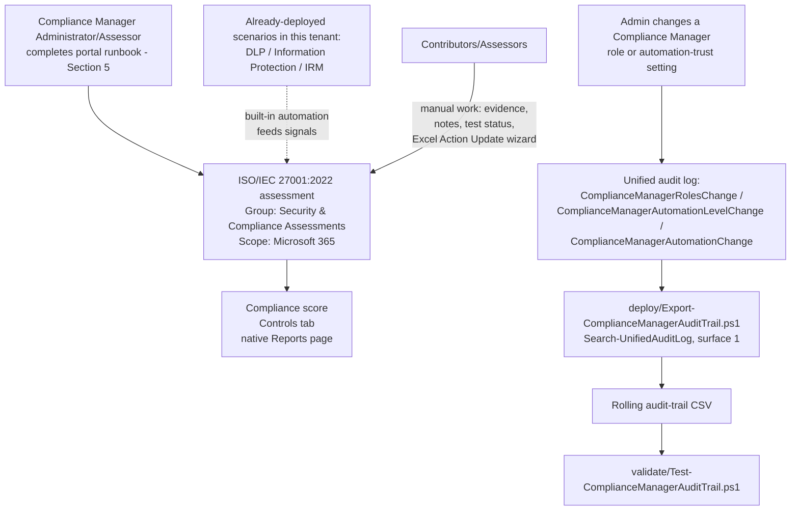

## 1. Scenario summary

Stands up a dedicated **Microsoft Purview Compliance Manager** assessment against the
**ISO/IEC 27001:2022** premium regulatory template, gives it a deliberate grouping and role
structure, and layers one genuinely scriptable piece of monitoring on top: a rolling export of the
only Compliance-Manager-specific events Microsoft's audit log documents (role changes and
automated-testing trust changes). Because Compliance Manager itself has no write API, most of this
scenario is a precise, repeatable **portal runbook** rather than a script, see §5 and `design.md`
§2 for why that is the correct, current-best-practice shape for this scenario, not a shortcut.

**Who it's for:** a security/compliance team pursuing ISO/IEC 27001:2022 certification (or
maintaining an existing ISMS) that wants a single, scored, audit-ready view of how Microsoft 365
controls map to Annex A, and, ideally, a team that has already deployed some of this library's
DLP/Information Protection/Insider Risk Management scenarios and wants Compliance Manager's
built-in automation to give them credit for that work.

## 2. Business/regulatory driver

**ISO/IEC 27001:2022** is the current edition of the internationally recognized standard for an
Information Security Management System (ISMS), and the one this scenario targets: the industry-wide
IAF-mandated transition window closed October 31, 2025, every ISO/IEC 27001:2013 certificate had
to expire or be reissued against:2022 by that date, and certification bodies stopped conducting
initial/recertification audits against:2013 after April 30, 2024. Compliance
Manager's template catalog still lists:2013 alongside:2022 (see §11), but:2013 is not the
correct choice for a new assessment as of this build, see `design.md` §5b for the full grounding
behind this scenario's switch from an earlier draft that recommended:2013. An organization
pursuing certification, renewing an existing certificate, or answering a customer/partner security
questionnaire that asks "are you ISO 27001 certified / aligned?" needs a control-by-control,
evidenced answer, not a narrative claim. Compliance Manager's ISO/IEC 27001:2022 premium template
exists specifically to produce that evidence for the Microsoft 365 portion of the estate: a scored
assessment, per-control status, and an exportable report an internal auditor or external
QSA-equivalent assessor can review.

This is a governance/evidence control, not a technical control, it does not itself reduce risk
the way a DLP policy or a sensitivity label does. Its value is making the technical controls this
library already ships (and any others the tenant has) **legible against a named standard**, which
is what a certification body, a customer questionnaire, or a board audit committee actually asks
for.

## 3. Prerequisites

Full licensing detail and citations: [Licensing matrix](/docs/licensing-matrix/). Summary for this scenario:

| Requirement | Minimum | Notes |
|---|---|---|
| Compliance Manager base access | **Office 365 / Microsoft 365** license (any tier) | Compliance Manager itself is available at all subscription levels; only premium regulatory templates require more |
| ISO/IEC 27001:2022 premium template | **A5/E5/G5** (3 free premium templates of choice, post-Dec-2022 licensing change) **or** the purchased **Compliance Manager premium assessment add-on**, **or** a **90-day premium assessments trial** (25 templates) | ISO 27001 was an *included* template before the December 2022 licensing change; it now counts against the free-3 allotment like any other premium template, do not assume a pre-2022 deployment guide's licensing claim still holds. **VERIFY:** whether:2013 and:2022 (listed as two separate catalog entries, §11) consume one shared license slot as a "regulation family" (the way Microsoft documents for CMMC's five levels) or two independent slots, not stated either way in the regulations-list/licensing references this scenario cites |
| Role to create/administer the assessment | **Compliance Manager Administration** (or **Compliance Manager Assessor** to create; **Global Administrator** also works) | See §"Create assessments" role requirement, and [RBAC model §4](/docs/rbac-model/#4-purview-role-groups-by-module-representative-not-exhaustive) for the Purview role-group mapping |
| Role to edit/test without creating | **Compliance Manager Contribution** (create + edit) or **Compliance Manager Assessor** (edit only, no create) | Assign the narrowest role per person, see `deploy/policy/iso27001-assessment-manifest.json` |
| Role for read-only visibility | **Compliance Manager Reader** | Entra mapping: Global Reader / Security Reader also grants read access |
| Automation identity (audit-trail script only) | App registration or account holding the **View-Only Audit Logs** (or **Audit Logs**) Exchange Online role, in addition to `Exchange.ManageAsApp` | `Search-UnifiedAuditLog` requires an **Exchange Online** RBAC role, a Purview-only role (even Compliance Administrator) is explicitly documented as insufficient. See [RBAC model §6](/docs/rbac-model/#6-exchange-online-dependency-the-most-common-permissions-gap) and [Automation surface §3](/docs/automation-surface/#3-authentication-patterns-interactive-vs-unattended) |
| Dependency (not deployed by this scenario) | Nothing hard-required, but strongly recommended: this library's `scenarios/dlp/`, `scenarios/information-protection/`, and `scenarios/insider-risk/` scenarios already deployed | Reduces the manual-testing backlog via Compliance Manager's built-in automation, see `design.md` §6 and the `recommendedDeploymentOrder` in the manifest |

> Verify current entitlement names against [Licensing matrix](/docs/licensing-matrix/) (dated 2026-09-02) and the
> Product Terms before a sales commitment, SKU names and the premium-template licensing model
> have changed before (the December 2022 change cited above) and can change again.

## 4. Architecture



Compliance Manager has no write API (`design.md` §2), so the assessment itself is created and
operated entirely through the Purview portal. The one scripted piece, the audit-trail export, 
runs independently on its own schedule, reading (never writing) the unified audit log.

## 5. Step-by-step implementation

### Portal path, creating the assessment (there is no script path for this part; see §2/`design.md` §2)

1. Before starting, decide the group name and role assignments, see
 `deploy/policy/iso27001-assessment-manifest.json` for this scenario's recommended values.
 **Both decisions are effectively permanent**: an assessment's group can't be changed after
 creation, and groups themselves can't be deleted.
2. **(Recommended order, not required)** Deploy this library's DLP, Information Protection, and
 Insider Risk Management scenarios first if not already in place, see the manifest's
 `recommendedDeploymentOrder` and `design.md` §6. Compliance Manager's built-in automation
 detects signals from Data Lifecycle Management, Information Protection, DLP, Communication
 Compliance, and Insider Risk Management, so controls already live in the
 tenant reduce the manual-testing backlog before a human opens the assessment.
3. Sign in to the [Microsoft Purview portal](https://purview.microsoft.com) → **Compliance
 Manager** → **Assessments** → **Add assessment**.
4. On **Base your assessment on a regulation** → **Select regulation** → search for and select
 **ISO/IEC 27001:2022** (not the separately listed **ISO/IEC 27001:2013** entry, §2/§11 explain
 why:2022 is the correct choice for a new assessment as of this build) → **Save** → confirm →
 **Next**.
5. On **Add name and group**: enter a unique assessment name (this scenario's default:
 `ISO/IEC 27001:2022 - Microsoft 365 Estate`, assessment names must be unique tenant-wide and
 effectively can't be renamed without deleting and recreating). Choose **Create new group**
 with the name from the manifest (`Security & Compliance Assessments`) unless an existing group
 is the deliberate, planned target → **Next**.
6. On **Select services**: select **Microsoft 365** only, per this scenario's scope (`design.md`
 §7, multicloud scoping via Defender for Cloud is a documented but explicitly out-of-scope
 extension) → **Next**.
7. **Review and finish**: confirm the regulation, name, group, and services → **Create
 assessment** → **Done**.
8. From the new assessment's details page → **Manage user access**: assign
 Contributor/Assessor/Reader roles per the manifest's `roleAssignments`, do not leave every
 stakeholder at Administration by default.
9. **Do not** rely on the tenant's default **Data Protection Baseline** assessment as a substitute
 for step 4-7, it blends NIST CSF/ISO/FedRAMP/GDPR elements and is not itself a citable
 ISO/IEC 27001:2022 control set (`design.md` §5).

### Ongoing portal work, testing and evidencing controls (also has no script path)

10. **Improvement actions** tab of the assessment: for actions with **Automatic** testing type,
 confirm they've picked up a status from the built-in automation signals described in step 2
 before doing any manual work on them.
11. For actions requiring manual work: assign an owner, complete implementation, upload evidence,
 and submit for testing, a **Compliance Manager Assessor** validates and sets the test status
 to Pass/Fail.
12. For bulk updates (many actions' status/evidence/notes at once): use **Export actions** →
 edit the downloaded Excel file's **Action Update** tab per its own embedded instructions →
 **Update actions** to re-upload. This wizard-and-Excel round trip is Microsoft's own documented
 mechanism, there is no faster scripted path as of this writing (`design.md` §2, §7 Non-goals)
.

### Script path, the audit-trail export (idempotent, parameterized, dry-run capable)

```powershell
# 1. Connect (certificate app-only, see docs/automation-surface.md §3). The connecting identity
#    needs Exchange.ManageAsApp PLUS the View-Only Audit Logs Exchange Online role (docs/rbac-model.md §6).
Connect-ExchangeOnline -AppId $AppId -Certificate $Cert -Organization $TenantDomain

# 2. Dry run, queries the last 7 days, reports what would be merged, writes nothing
./deploy/Export-ComplianceManagerAuditTrail.ps1 -OutputCsvPath './out/compliance-manager-audit-trail.csv' -WhatIf

# 3. First real run, a one-time backfill covering the full default retention window
./deploy/Export-ComplianceManagerAuditTrail.ps1 `
    -StartDate (Get-Date).AddDays(-180) -EndDate (Get-Date) `
    -OutputCsvPath './out/compliance-manager-audit-trail.csv'

# 4. Recurring run (schedule daily or weekly, overlapping windows are safe, see design.md §8)
./deploy/Export-ComplianceManagerAuditTrail.ps1 -OutputCsvPath './out/compliance-manager-audit-trail.csv'

# 5. Validate
./validate/Test-ComplianceManagerAuditTrail.ps1 -AuditTrailCsvPath './out/compliance-manager-audit-trail.csv'
```

The audit-trail script uses Exchange Online PowerShell's `Search-UnifiedAuditLog`, automation
surface 1 per [Automation surface §1](/docs/automation-surface/#1-five-automation-surfaces-not-one-read-this-first), because Compliance Manager has no surface of its
own for anything, including its own audit footprint (design.md §2 and §4).

## 6. Configuration reference

| Setting | Value this scenario uses | Notes |
|---|---|---|
| Regulation/template | ISO/IEC 27001:2022 | Premium template, see §3 licensing. Not:2013, see §2/§11 |
| Assessment name | `ISO/IEC 27001:2022 - Microsoft 365 Estate` | Effectively permanent once created |
| Group | `Security & Compliance Assessments` (new) | Permanent, group membership can't be changed after assessment creation |
| Services in scope | Microsoft 365 only | Multicloud is an explicit non-goal, `design.md` §7 |
| Recommended role split | Administration: 1-2 people · Contribution/Assessor: control owners · Reader: auditors/leadership | See `deploy/policy/iso27001-assessment-manifest.json` |
| Audit-trail script operations filter | `ComplianceManagerRolesChange`, `ComplianceManagerAutomationLevelChange`, `ComplianceManagerAutomationChange` | The only 3 Compliance-Manager-specific operations Microsoft's audit-log-activities reference documents (`design.md` §4) |
| Audit-trail script idempotency | Merge + de-duplicate by `(CreationDate, Operations, UserIds, hash(AuditData))` | Not a RunId-replace pattern, see `design.md` §8 for why. Does not assume an ungrounded flat `ObjectId` field; a best-effort `AuditDataObjectId` is still surfaced as a display-only column (§11) |
| Audit-trail script default window | Last 7 days (`-StartDate`/`-EndDate`) | Suitable for a daily/weekly scheduled run; overlap with the prior run is safe |

Full cmdlet parameter grounding: `deploy/Export-ComplianceManagerAuditTrail.ps1`'s inline comments
and its `.NOTES` block cite the exact Microsoft Learn reference pages.

## 7. Validation / how to prove it works

1. **Automated file-integrity check**, `./validate/Test-ComplianceManagerAuditTrail.ps1
 -AuditTrailCsvPath './out/compliance-manager-audit-trail.csv'` confirms the CSV's schema, no
 duplicate composite-key rows, valid Operation values, and sorted timestamps; exits non-zero on
 any hard failure (safe for a CI-style pre-flight).
2. **Manual verification checklist**, the same script prints a checklist (assessment exists,
 correct regulation/group/services, role assignments match the manifest, at least some
 improvement actions show automation-sourced status) because none of these have a read API to
 check programmatically (`design.md` §2).
3. **Functional test (audit-trail script)**, in the Purview portal, change a test user's
 Compliance Manager role (e.g. grant then immediately revoke Reader access on the assessment).
 Wait ~60 minutes for audit-log ingestion, then re-run the deploy script with a `-StartDate`
 covering that window. Expect: a new row with `Operation = ComplianceManagerRolesChange` and the
 test user in `UserIds`.
4. **Evidence for an internal or external auditor**, the assessment's own **Export actions**
 report (§5, step 12) is the primary evidence artifact Compliance Manager is built to produce
; this scenario's audit-trail CSV is a **secondary**, complementary artifact
 proving who could edit the assessment and whether its automated-testing trust boundary was
 altered during the audit period, not a replacement for the native export.

## 8. Operations & tuning

**Review cadence:** run the audit-trail export on a **recurring schedule**, daily is cheap and
safe (overlapping-window de-duplication makes over-frequent runs harmless), weekly is the
practical minimum given Audit (Standard)'s 180-day retention window (§11). Review the **Controls**
tab and compliance-score trend at least **monthly**; review **role assignments**
(`ComplianceManagerRolesChange` events) and any `ComplianceManagerAutomationLevelChange`/
`ComplianceManagerAutomationChange` event **immediately** when the audit-trail script's built-in
warning fires (deploy script `.NOTES`), not on the monthly cadence, an automation-trust change is
a control-integrity event, not routine drift. **Daily**, also: run
`scenarios/compliance-manager/entra-privileged-role-monitoring/deploy/
Export-EntraPrivilegedRoleAuditTrail.ps1`, that scenario now scripts the quarterly Entra
directory role-assignment cross-check this operations section used to describe as a manual task
(§11), closing this scenario's own Red Team finding 1 with a real, dailyable control instead of a
portal-only recommendation. **Quarterly**, also: run **Export actions** (§5 step 12) and retain
the output outside Compliance Manager as a durable evidence snapshot, the native Reports page's
own history only covers 6 months (§11).

**KPIs to watch:**
- **Compliance score trend** (native Reports page, up to 6 months of history), a flat or
 declining score after a security-awareness or tooling push is a signal the assessment isn't
 being actively worked, not that the estate got less compliant.
- **Ratio of automated vs. manual improvement-action status**, a low automated-status ratio
 months after deploying this library's DLP/Information Protection/IRM scenarios (§5, step 2)
 suggests either those controls aren't actually configured as expected, or the mapping between
 them and this template's actions is thinner than assumed, investigate rather than assume.
- **`ComplianceManagerRolesChange` event volume**, a spike outside a planned onboarding/offboarding
 event is worth investigating; Compliance Manager role membership is a meaningful privilege (up to
 and including Administration, which can edit any assessment).
- **Any `ComplianceManagerAutomationLevelChange`/`ComplianceManagerAutomationChange` event at all**
, treat as a near-zero-tolerance signal. These operations exist specifically because someone can
 quietly downgrade what "Passed" means for this assessment's improvement actions; the audit-trail
 script's inline `Write-Warning` on match (deploy script) exists to make this impossible to miss
 in a scheduled-run log.

**Incident-response runbook (automation-trust change detected):**
1. **Triage**, pull the full `AuditData` JSON for the flagged row (the audit-trail CSV's
 `AuditData` column) to see exactly what was changed and by whom.
2. **Classify**, was this a planned, documented change (e.g. deliberately moving an action from
 automatic to manual testing because the automated signal proved unreliable) or unplanned?
3. **Planned:** document the change and its rationale alongside the assessment (evidence/notes on
 the affected improvement action) so a future auditor sees the reasoning, not just the change.
4. **Unplanned:** escalate to whoever owns Compliance Manager Administration; treat as a potential
 attempt to game the compliance score, and review recent `ComplianceManagerRolesChange` events
 for the same user to see if their access was also recently, unexpectedly broadened.
5. **Document**, every reviewed event, planned or not, is retained in the audit-trail CSV as
 Requirement-adjacent evidence; do not delete rows from it.

## 9. Rollback / decommission

See `rollback.md` for the full procedure, the assessment (portal-only, staged: scope-down →
revoke access → delete) and the audit-trail script (schedule + role removal) are rolled back
independently.

## 10. Cost & licensing notes

- **Premium-template licensing, not PAYG.** ISO/IEC 27001:2022 is a premium regulatory template, 
 cost is either 1 of the tenant's 3 free A5/E5/G5 premium-template slots, a purchased **Compliance
 Manager premium assessment add-on**, or a time-boxed free trial (§3). There is no Azure
 consumption/PAYG component for Compliance Manager itself.
- **No additional cost for the audit-trail script** beyond the Exchange Online role assignment, 
 `Search-UnifiedAuditLog` is included in Audit (Standard), itself included at no extra cost for
 most Microsoft 365 organizations.
- **Sizing note:** the premium-template allotment is per-regulation, not per-assessment, creating
 multiple ISO 27001 assessments (e.g. one per subsidiary) from the same template consumes only one
 slot. Plan the grouping strategy (§5, step 1) with this in mind before
 creating more assessments than the org actually needs.

## 11. Known limitations & gotchas

- **This scenario cannot script assessment creation, control mapping, or improvement-action
 updates.** This is not a scoping shortcut, no such API exists as of this writing (`design.md`
 §2). Every other module in this library ships a `New-*`/`Set-*` deploy script; this one cannot,
 and says so rather than fabricating one.
- **The audit-trail script does not track compliance score or improvement-action status changes**
, only the 3 documented Compliance-Manager-specific audit operations (role changes, automation-
 trust changes). Score/status history is the native **Reports** page's job (up to 6 months of
 history), not this script's (`design.md` §4).
- **The audit-trail script cannot see Compliance Manager access granted implicitly via an Entra
 ID role.** Global Administrator, Compliance Administrator, Compliance Data Administrator, and
 Security Administrator all grant Administration-equivalent Compliance Manager access without an
 explicit per-assessment role assignment, and Microsoft's own docs confirm users who have access
 this way don't even appear on the **User access** settings page. Their access
 is an Entra directory role assignment, not a `ComplianceManagerRolesChange` event, so this
 scenario's audit-trail script has no visibility into who holds it or when it changed. This gap
 is now closed by a companion scenario:
 `scenarios/compliance-manager/entra-privileged-role-monitoring/` scripts exactly this
 cross-check via Entra's own directory audit log (Microsoft Graph, `Get-MgAuditLogDirectoryAudit`)
, deploy it alongside this scenario rather than relying on the quarterly manual check this
 limitation used to describe as the only mitigation. See [RBAC model §3](/docs/rbac-model/#3-microsoft-entra-roles-that-map-into-purview) for the
 underlying four-role mapping.
- **The Reports page's own score/action-history is not preserved by this scenario beyond its
 native retention.** The native Reports page's detailed history view covers up to 6 months
 (§7/§8) but this scenario doesn't export or archive it, a change older than 6 months is gone
 from Compliance Manager itself, not just from this scenario's tooling. Run **Export actions**
 (§5 step 12) on a periodic (e.g. quarterly) cadence and retain the output outside Compliance
 Manager if a longer durable evidence trail is required for certification purposes.
- **VERIFY:** whether assessment creation/deletion and improvement-action status changes are
 separately audit-logged under an operation name not listed in Microsoft's public
 `audit-log-activities` reference (e.g. logged but undocumented, or logged under a more generic
 operation this scenario's `-Operations` filter would miss). This scenario's audit-trail script
 deliberately filters only the 3 documented operations rather than guessing at additional ones, 
 confirm against a pilot tenant (generate a test assessment, then search the full unfiltered audit
 log for the time window) before asserting to a customer/auditor that this script's silence on
 assessment-lifecycle events proves nothing happened.
- **Audit (Standard) default retention is 180 days** (1 year for Entra ID/Exchange/OneDrive/
 SharePoint under an E5-tier license; up to 10 years with Audit Premium retention policies)
. A buyer needing a longer evidentiary window than the audit-trail CSV's own
 accumulated history covers must either run the export on a schedule from day one, or purchase
 Audit (Premium) with a custom retention policy.
- **The "Action Update" Excel bulk-import file's exact column schema is not scripted here.** See
 `design.md` §7 (Non-goals) for why fabricating it would violate `AGENTS.md` §4, this is a
 tracked follow-up in `PROGRESS.md` once a real exported file can be inspected.
- **Compliance Manager's Regulations page lists both ISO/IEC 27001:2013 and ISO/IEC 27001:2022 as
 separate premium templates** (confirmed by direct fetch of `compliance-manager-regulations-list`,
 2026-09-10), do not select:2013 by mistake when following §5 step 4; they are two distinct,
 independently-licensed catalog entries, not one template with a version dropdown. This scenario
 originally recommended:2013 (its first Microsoft Learn grounding pass only surfaced:2013
 documentation) and was corrected to:2022 once the industry-wide certification transition
 deadline (October 31, 2025, `design.md` §5b) made:2013 the wrong default for a new assessment.
 A tenant with a pre-existing:2013 assessment from an earlier deployment of this scenario is not
 automatically upgraded, see `design.md` §5b for the recommended migration path (Compliance
 Manager documents no assessment-to-assessment copy/upgrade action).
- **No dedicated Microsoft Learn page under `/compliance/regulatory/` is branded for the:2022
 Compliance-Manager template specifically**, unlike:2013's own
 `compliance/regulatory/offering-iso-27001` page. The only ":2022"-titled Learn page found during
 this grounding pass (`azure/compliance/offerings/offering-iso-27001`) documents Azure's own
 ISO/IEC 27001:2022 certification, not the customer-facing Compliance Manager premium template, 
 this scenario cites `compliance-manager-regulations-list` for the template's existence instead of
 reusing the:2013 page's URL as if it also covered:2022. See `design.md` §5b.
- **VERIFY:** whether the:2013 and:2022 templates consume one shared premium-license slot as a
 "regulation family" (the documented behavior for CMMC's five levels) or two independent slots, 
 not stated either way in the sources this scenario cites. Relevant only to a tenant that
 deliberately keeps both templates active (e.g. during a:2013→:2022 assessment migration); see §3.
- **This scenario doesn't verify Microsoft's per-control improvement-action mapping.** `design.md`
 §6 explains why that specific claim can't be grounded from public docs, treat the "deploy
 DLP/IP/IRM scenarios first" recommendation as directionally correct, not as a guarantee of any
 specific score uplift.
- **A high compliance score is not proof of certification-readiness.** Microsoft's own FAQ states
 this explicitly: the score measures progress on recommended actions, not an absolute compliance
 guarantee, do not let this scenario's tooling imply otherwise to a board or
 customer.

## 12. References

1. ISO/IEC 27001:2013 Information Security Management Standards, Use Compliance Manager to assess your risk, <https://learn.microsoft.com/compliance/regulatory/offering-iso-27001>
2. Build and manage assessments in Compliance Manager (create-assessment wizard, groups can't be deleted/reassigned, Data Protection Baseline default, Export an assessment report, Delete an assessment), <https://learn.microsoft.com/purview/compliance-manager-assessments>
3. Get started with Compliance Manager (role types table incl. Entra role mapping, Compliance Manager Administration/Contribution/Assessor/Reader), <https://learn.microsoft.com/purview/compliance-manager-setup>
4. (see reference 2) Data Protection Baseline default assessment section
5. Learn about regulations in Compliance Manager (premium licensing, 3-free-templates allotment, per-regulation not per-assessment), <https://learn.microsoft.com/purview/compliance-manager-regulations>
6. Working with improvement actions in Compliance Manager (automated testing/monitoring, built-in automation from DLM/Information Protection/DLP/Communication Compliance/IRM/Priva, Secure Score automation, Defender for Cloud automation, connectors), <https://learn.microsoft.com/purview/compliance-manager-improvement-actions>
7. (see reference 6) Assign improvement action to assessor for completion; Improvement action details page
8. Update improvement actions and bring compliance data into Compliance Manager (Export actions / Action Update tab / Update actions wizard, the bulk-update workflow), <https://learn.microsoft.com/purview/compliance-manager-update-actions>
9. Microsoft Purview service description, Compliance Manager, <https://learn.microsoft.com/office365/servicedescriptions/microsoft-365-service-descriptions/microsoft-365-tenantlevel-services-licensing-guidance/microsoft-purview-service-description#microsoft-purview-compliance-manager>
10. Compliance Manager regulations list (December 2022 licensing change, included vs. premium templates, GCC/DoD), <https://learn.microsoft.com/purview/compliance-manager-regulations-list>
11. Learn about auditing solutions in Microsoft Purview (Audit Standard vs. Premium, licensing), <https://learn.microsoft.com/purview/audit-solutions-overview>
12. Manage audit log retention policies (180-day Standard default since Oct 17 2023, 1-year E5 default for Entra/Exchange/OneDrive/SharePoint, up to 10 years with Premium retention policies), <https://learn.microsoft.com/purview/audit-log-retention-policies>
13. Compliance Manager frequently asked questions (a high score is not proof of compliance), <https://learn.microsoft.com/purview/compliance-manager-faq>
14. Audit log activities, Compliance Manager activities table (the 3 documented operations), <https://learn.microsoft.com/purview/audit-log-activities#compliance-manager-activities>
15. Search-UnifiedAuditLog reference, <https://learn.microsoft.com/powershell/module/exchangepowershell/search-unifiedauditlog>
16. Search the audit log for deleted mailbox items, permissions section (View-Only Audit Logs / Audit Logs Exchange Online role requirement), <https://learn.microsoft.com/purview/audit-log-search-deleted-mailbox-items#verify-administrator-permissions>
17. Compliance Manager regulations list, Premium regulations / Global section, lists ISO/IEC 27001:2013 and ISO/IEC 27001:2022 as separate entries (direct fetch, 2026-09-10; same URL as reference 10), <https://learn.microsoft.com/purview/compliance-manager-regulations-list#premium-regulations>
18. IAF MD 26:2023, Transition Requirements for ISO/IEC 27001 (International Accreditation Forum mandatory document: initial/recertification audits to:2013 stopped after April 30, 2024; all:2013 certificates expire or are reissued against:2022 by October 31, 2025), <https://iaf.nu/iaf_system/uploads/documents/IAF_MD26_Issue_2_15012023.pdf>
19. Microsoft 365 - ISO 27001:2022 Certificate (2024-2027), Microsoft's own current Office 365/Microsoft 365 ISO/IEC 27001 certification cycle, linked from reference 1's FAQ, <https://servicetrust.microsoft.com/DocumentPage/6af50cea-280c-4859-acff-bd1ea8e2660a>

> Re-verify all links and the premium-template licensing model against current Microsoft Learn
> before a customer-facing assessment or sale, Compliance Manager's regulation catalog and
> licensing rules have changed materially before (the December 2022 change cited above) and can
> change again.
