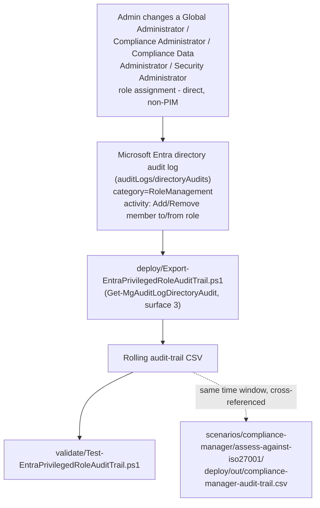

## 1. Problem statement

`scenarios/compliance-manager/assess-against-iso27001/`'s own Red Team review (`reviews.md` finding
1 in that scenario) surfaced a real, disclosed gap: its
`deploy/Export-ComplianceManagerAuditTrail.ps1` only detects an **explicit** Compliance Manager
role grant (`ComplianceManagerRolesChange`). Four Entra ID roles, **Global Administrator**,
**Compliance Administrator**, **Compliance Data Administrator**, and **Security Administrator**, 
grant Compliance Manager Administration-equivalent access **implicitly**, and Microsoft's own
documentation confirms users who hold Compliance Manager access this way don't even appear on the
Compliance Manager **User access** settings page. That scenario's own audit trail has zero
visibility into who holds this implicit access or when it changed, it can only point at a
separate signal (`rbac-model.md` §3, the Entra directory audit log) that isn't wired up anywhere in
this library. This scenario builds that missing piece.

The same four roles carry implicit access into **every other Purview module**, not just Compliance
Manager, `rbac-model.md` §3's own mapping table lists them once, as a shared cross-module
population. This scenario is filed under `scenarios/compliance-manager/` because that's the
specific, disclosed gap that prompted it (and it directly closes that scenario's Red Team finding, 
§7 below), but its value and its script are module-agnostic: any scenario in this library whose
technical control assumes "only people with an explicit Purview role grant can touch this" has the
same blind spot for these four roles.

## 2. Why this is a genuinely different automation surface, not a copy of the Compliance Manager script

`Export-ComplianceManagerAuditTrail.ps1` reads the **Microsoft 365 unified audit log**
(`Search-UnifiedAuditLog`, Exchange Online PowerShell, automation surface 1), Purview's own audit
system, retained 180 days by default under Audit (Standard). Entra ID role assignment/removal is
recorded in a **completely separate system**: the **Microsoft Entra directory audit log**
(`/auditLogs/directoryAudits`, Microsoft Graph, automation surface 3), which is part of Entra ID
itself, not Purview, and whose default retention is far shorter, as little as **7 days** on
Microsoft Entra ID Free, 30 days on P1/P2 (README.md §11). These are genuinely different products
with different APIs, different retention models, and different licensing floors; treating them as
interchangeable would be exactly the kind of unfounded assumption `AGENTS.md` §4 rules out. This
scenario's script is therefore a new, independently-grounded automation surface for this library, 
its first use of `Get-MgAuditLogDirectoryAudit` / `/auditLogs/directoryAudits`, not a
copy-and-rename of the Compliance Manager script.

**This is not a reinvention of Microsoft's own native "Roles are being assigned outside of
Privileged Identity Management" PIM security alert** (a real, High-severity, built-in PIM alert
Microsoft ships). That native alert is gated: Microsoft's own configuration guidance lists a
separate, dedicated Low-severity alert, *"The organization doesn't have Microsoft Entra ID P2 or
Microsoft Entra ID Governance"*, that fires specifically because the primary alert **doesn't
function at all** without one of those two licenses. This library's own [Licensing matrix](/docs/licensing-matrix/)
and `rbac-model.md` scope most scenarios to broadly-available tiers precisely because a
sophisticated-buyer-but-not-necessarily-P2-licensed tenant (the SMB/mid-market segment
`AGENTS.md` §3's "Scale" axis calls out) is a real target audience, for that tenant, this
scenario's script is the *only* available detective control for this risk, not a redundant one.
For a tenant that **does** hold P2/Governance, this script remains complementary: PIM's alert is
portal/email-only with no documented queryable export, while this script produces a durable,
scriptable CSV, useful as a second, independent evidence trail even where the native alert also
fires.

A tenant with **Microsoft Purview Audit (Premium)** can alternatively rely on that product's own
default retention policy, which retains **AzureActiveDirectory**-workload audit records (i.e.
Entra ID events, surfaced *through* the unified audit log) for one year (§10). That's a genuine,
grounded alternative for **retention**, but it doesn't change which **API** exposes the event
data cleanly: `Search-UnifiedAuditLog`'s `-RecordType`/`-Operations` filter values for Entra
role-assignment change events specifically are not confirmed by Microsoft's `audit-log-activities`
reference the way the three Compliance Manager operations are (that reference documents Entra role
activities by *activity name*, e.g. "Add member to role", not by a `RecordType`/`Operations` pair
the way it does for e.g. eDiscovery or eDiscovery-adjacent events elsewhere in this library), so
this scenario targets Graph's native `directoryAudits` resource, which documents `activityDisplayName`
and `category` directly, rather than guessing at an unconfirmed unified-audit-log operation name.
See §9 (Non-goals) for this as an explicit, disclosed choice.

## 3. What's in scope, and what isn't (grounded, not guessed)

Microsoft's `reference-audit-activities` page lists Entra role-assignment activities under **two
different categories/services**, both under the `RoleManagement` audit category:

| Family | Example activity names | Source service | This scenario's scope |
|---|---|---|---|
| **Core Directory** (direct/permanent assignment, non-PIM) | `Add member to role`, `Add member to role scoped over Restricted Management Administrative Unit`, `Add scoped member to role`, `Remove member from role`, `Remove member from role scoped over Restricted Management Administrative Unit`, `Remove scoped member from role` | Core Directory | **In scope**, this is what a Global Administrator (or anyone with `RoleManagement.ReadWrite.Directory`) triggers via `Add-EntraDirectoryRoleMember`/the Entra portal's direct "Add assignment" flow with no PIM eligibility step, at tenant scope or scoped to an administrative unit |
| **Privileged Identity Management (PIM)** | `Add member to role in PIM completed (permanent)`, `...(timebound)`, `Add eligible member to role`, `Remove eligible member from role`, and roughly 30 more distinct activity names for request/approve/deny/expire/cancel lifecycle events | Privileged Identity Management (PIM) | **Out of scope for this fragment**, see §9 |

This scenario's `deploy/Export-EntraPrivilegedRoleAuditTrail.ps1` filters to exactly the six
documented Core Directory activity names in the table above, the same level of precision the
Compliance Manager sibling script applies to its own three operations (`AGENTS.md` §4: no
invented or overbroad filters). All six are grounded directly against the same canonical
`reference-audit-activities` Core Directory table, including the two scoped variants is
completing coverage of an already-fully-documented activity family, not extending into
unconfirmed territory (§4a discusses one genuinely unconfirmed adjacent activity name that was
deliberately **not** added this same way).

## 4. How the client-side role-name filter works (grounded against the documented schema)

`Get-MgAuditLogDirectoryAudit -Filter "category eq 'RoleManagement' and activityDateTime ge... and
activityDateTime le..." -All` returns every Core-Directory-and-PIM RoleManagement event in the
window, this script does not further narrow the server-side `$filter` to `activityDisplayName`
because Microsoft's own `$filter` reference for this specific resource documents only `eq`, `ge`,
`le`, and `startswith` as supported operators, without confirming that combining `eq` on two
different fields (`category` and `activityDisplayName`) with `and` is supported the same way the
`category`+`activityDateTime` combination is (that specific combination **is** grounded, a
Microsoft troubleshooting article's own worked example filters `/auditLogs/directoryAudits` on
`loggedByService eq '...' and activityDateTime ge...`, the same shape this script uses). Narrowing
by `ActivityDisplayName` and by the monitored role names therefore happens **client-side**, in
PowerShell, after the broader server-side pull, see the deploy script's `$monitoredActivities` /
`Get-RoleDisplayNameFromTargetResources` logic.

The role name itself comes from the event's `targetResources` array (documented `targetResource`
resource type: `type` can be `Role`; each entry carries its own `displayName`). This script assumes
**at least one `Role`-typed entry exists** on a matching "Add/Remove member to/from role" event, 
directly consistent with the documented schema, but does **not** assume a fixed array position or
that a `User`-typed entry (the affected principal) is always present, since no worked JSON example
for this specific activity was found to confirm either. Both extraction functions
(`Get-RoleDisplayNameFromTargetResources`, `Get-PrincipalDisplayNameFromTargetResources`) filter the
array by `.Type` rather than indexing by position, and fail soft (return `$null`, surfaced as an
empty CSV column) rather than throwing, see README.md §11's VERIFY item.

## 4a. An unresolved naming discrepancy against Microsoft's own detection guidance (disclosed, not guessed past)

Microsoft's own **"Security operations for privileged accounts in Microsoft Entra ID"** guidance
recommends detecting exactly this scenario's target risk ("roles assigned outside of PIM") by
filtering the audit log to `Service = PIM`, `Category = Role management`, `Activity type = "Add
member to role (permanent)"`, a **differently-named** activity from the plain `Add member to
role` (Core Directory service) this scenario's script filters on. Two readings are both plausible
from the public documentation: (a) this is the same underlying event, surfaced under a different
service tag/display convention in that specific guidance article, or (b) it is a genuinely distinct
event, e.g. specifically the "permanent, active, directly-created-through-the-PIM-blade" case, as
opposed to a role assignment made through the classic Entra roles blade with no PIM involvement at
all. No source this build located resolves which. Rather than widen `$monitoredActivities` to a
wildcard/fuzzy match that would guess at the answer (`AGENTS.md` §4), this script's activity list
stays exactly the six names directly confirmed on the canonical Core Directory table (§3), and this
discrepancy is carried as an explicit VERIFY in `README.md` §11 and the deploy script's `.NOTES`.
**Practical consequence if reading (b) is correct:** a role assigned permanently through the PIM
blade itself (as opposed to the classic Entra roles blade) might log only under the `(permanent)`-
suffixed name and be missed by this script's current filter, a real, bounded gap, not a
theoretical one, and the reason this is flagged as a VERIFY rather than closed with an assumption.

## 4b. A separate gap this scenario originally did not close: role-assignable groups, now closed by a companion script (§10)

Microsoft's own `groups-concept` documentation states plainly that a **role-assignable group**
(an Entra ID P1/P2 feature, `isAssignableToRole: true`) can hold one of this scenario's four
monitored roles, and that an organization is expected to rely on **the group's own membership
governance and auditing** to control who effectively holds that role, not a fresh "Add member to
role" event per person added to the group. Concretely: if `Compliance Data Administrator` is
assigned to a role-assignable group (a legitimate, Microsoft-recommended practice for managing a
role across many people), adding a new member to that group generates a `GroupManagement`-category
"Add member to group" audit event, not a `RoleManagement`-category "Add member to role" event, 
**invisible to `Export-EntraPrivilegedRoleAuditTrail.ps1`'s `category eq 'RoleManagement'` filter
entirely.** This was a genuine, disclosed gap when this scenario first shipped, see the Red Team
finding in `reviews.md` round 1. **It is now closed** by
`deploy/Export-RoleAssignableGroupMembershipAuditTrail.ps1` (§10 below), which first enumerates
which groups are role-assignable and hold one of the four monitored roles (`GET
/groups?$filter=isAssignableToRole eq true` plus a directory-role-assignment cross-reference), then
separately monitors `GroupManagement` category membership-change events for exactly that set of
groups, the same two-phase approach this section originally scoped as future work. README.md §11's
matching limitation is updated in place to point at the companion script instead of describing the
gap as unmitigated.

## 5. Idempotency model, a genuine simplification over the Compliance Manager sibling, not a shortcut

`Export-ComplianceManagerAuditTrail.ps1` has no confirmed flat unique-ID field on
`Search-UnifiedAuditLog`'s output, so it de-duplicates on a composite key that folds in a hash of
the full `AuditData` JSON payload (that scenario's `design.md` §8). The Microsoft Graph
`directoryAudit` resource is different: its reference page directly documents an `id` property, 
*"Indicates the unique ID for the activity. This is a GUID."* This script therefore de-duplicates
on that documented `Id` field alone. This is a **grounded difference in the two underlying APIs**,
not an inconsistency between the two scripts, each script's idempotency key matches what its own
API actually documents as stable, which is exactly the "don't invent, don't assume, ground each
claim against its own source" discipline `AGENTS.md` §4 asks for.

## 6. Key decisions

| Decision | Choice | Rationale |
|---|---|---|
| Automation surface | Graph PowerShell SDK (`Microsoft.Graph.Reports`), surface 3 | The only surface with a documented API for Entra ID's own directory audit log, see §2. |
| Default lookback window | 24 hours (vs. the Compliance Manager sibling's 7 days) | Matches this log's much shorter worst-case retention (7 days on Entra ID Free), a weekly cadence risks missing events entirely on a Free-tier tenant; README.md §8. |
| Server-side filter scope | `category eq 'RoleManagement'` + date range only | The one compound-`and` `$filter` shape this script can point at a real Microsoft worked example for (§4), avoids assuming a second, unconfirmed `eq` clause is supported. |
| Role/activity narrowing | Client-side, after the broader pull | Consistent with the filter-scope decision above; correctness depends on the documented `targetResource`/`activityDisplayName` schema, not an unconfirmed server-side compound filter. |
| Idempotency key | The record's own documented `Id` (GUID) | Genuinely simpler and more precise than the Compliance Manager sibling's composite-hash approach, because this API (unlike `Search-UnifiedAuditLog`) documents a stable unique ID, see §5. |
| PIM-mediated role activation | Explicitly out of scope for this fragment | A large (~30-activity-name), structurally different event family under the same `RoleManagement` category, see §9. |
| Role list | Parameterized (`-PrivilegedRoleDisplayNames`), defaulting to the 4 roles `rbac-model.md` §3 documents | Reusable by a future scenario needing to monitor a different role's implicit access to a different module, without editing this script. |

## 7. Closing the loop with `assess-against-iso27001`

Now that this scenario exists, `assess-against-iso27001/README.md` §8 and §11, and its `design.md`
§4, are updated in this same fragment to point at
`scenarios/compliance-manager/entra-privileged-role-monitoring/` instead of describing the gap as
unmitigated, the quarterly "cross-check Entra directory role-assignment history" operational
mitigation that scenario's own Red Team round recommended is now a real, scriptable, dailyable
control instead of a manual portal task. `assess-against-iso27001`'s own audit-trail script and
manifest are otherwise untouched, this is a documentation cross-link, not a code change to that
scenario.

## 8. Data flow / where each piece runs

## 9. Non-goals

- **Privileged Identity Management (PIM) eligible/time-bound role activations.** A structurally
 different, much larger family of activity names under the same `RoleManagement` audit category
 (§3), a buyer running these four roles through PIM (Microsoft's own recommended practice for
 exactly this population) needs PIM's own alerting (**PIM alerts**, "Roles are being assigned
 outside of Privileged Identity Management" and related built-in alert types) as the primary
 control for that path; this script's scope is the direct/permanent-assignment path PIM alerting
 does *not* fully replace (a role can still be assigned directly, bypassing PIM, by anyone who
 already holds `RoleManagement.ReadWrite.Directory` or the Privileged Role Administrator role).
 Tracked as a follow-up in `PROGRESS.md`.
- **Reproducing or replacing `Export-ComplianceManagerAuditTrail.ps1`.** That script is untouched, 
 this scenario is a companion, cross-referenced signal, not a rewrite (§7).
- **Alerting/SIEM routing beyond `Write-Warning` console output.** Same accepted scope boundary
 this library already draws elsewhere (e.g. `assess-against-iso27001/reviews.md` Blue Team finding
 2), wiring a specific SIEM/alerting product is out of a single scenario's scope.
- **Writing/removing Entra role assignments.** This scenario is read-only by design (§1), it
 monitors a change, it does not gate or reverse one. A buyer wanting a preventive (not just
 detective) control should pair this with Conditional Access-based step-up authentication for
 privileged roles and/or PIM's approval workflow, both outside this fragment's scope.

## 10. The role-assignable-group companion script (`Export-RoleAssignableGroupMembershipAuditTrail.ps1`)

Closes §4b's gap with a second, standalone script in this same scenario folder, not a rewrite of
`Export-EntraPrivilegedRoleAuditTrail.ps1`, which is untouched (§7's "don't reproduce/replace the
sibling script" principle applies equally to this companion's relationship with its own sibling).

**Two phases, both re-run on every invocation, no cached discovery state:**

1. **Discovery.** `Get-MgGroup -Filter "isAssignableToRole eq true" -All` lists every role-assignable
 group in the tenant, a plain `eq` filter on a boolean property, confirmed by two independent
 Microsoft Learn sources to work **without** the `ConsistencyLevel: eventual`/`$count` advanced-
 query headers some other `$filter` operators on directory objects require (`graph/filter-query-
 parameter`'s own worked example is literally `~/groups?$filter=isAssignableToRole eq true`; the
 general advanced-query guidance separately confirms `eq` filters "work by default" while `ne`/
 `not`/`endswith` do not). For each of the four monitored role names,
 `Get-MgRoleManagementDirectoryRoleDefinition -Filter "DisplayName eq '<role>'"` resolves the role
 definition Id, then `Get-MgRoleManagementDirectoryRoleAssignment -Filter "roleDefinitionId eq
 '<id>'" -All` lists its active assignments, both filter shapes directly confirmed by Microsoft's
 own "List Microsoft Entra role assignments" worked PowerShell examples. A client-side join (any
 assignment whose `PrincipalId` is also a role-assignable group's `Id`) produces the monitored-
 group set. Re-running discovery every invocation (rather than caching it in a config file) means a
 group newly assigned to, or removed from, a monitored role between runs is picked up
 automatically on the very next scheduled run, with no separate reconciliation step needed.

2. **Audit export.** For the discovered group set, `Get-MgAuditLogDirectoryAudit` is called with the
 **same** grounded server-side filter shape as the sibling script (`category eq 'GroupManagement'`
 + date range only, §4's reasoning for not guessing at a wider compound filter applies here
 identically), narrowing client-side to `Add member to group`/`Remove member from group` events
 whose `targetResources` array contains a `Group`-typed entry matching one of the monitored group
 Ids.

**A grounding improvement this companion surfaced, not just a gap-fill:** confirming the
`targetResources` shape for `Add member to group` required finding a genuinely new source, 
Microsoft's `Get-EntraAuditDirectoryLog` reference page's Example 9 is a **directly worked example**
combining `activityDisplayName eq 'Add member to group'` with
`targetResources/any(r:r/type eq 'User')` and `targetResources/any(r:r/id eq '$groupId' and r/type
eq 'Group')` in one compound `$filter`. Two things follow from this single source: (a) it confirms a
`Group`-typed `targetResources` entry carries a stable `id` property, not just `displayName`, a
materially stronger match key than the sibling script had available for its own `Role`-typed targets
(which only `displayName` was confirmed for); this companion matches by `GroupId`, not by name. (b)
It demonstrates that Microsoft Graph's `directoryAudits` resource **does** support combining
`activityDisplayName eq` with two `targetResources/any(...)` lambda clauses via `and`, a materially
more precise compound filter than either sibling script in this scenario uses. This companion
deliberately does **not** adopt that fuller server-side filter, for a disclosed, narrow reason: the
worked example is for `Get-EntraAuditDirectoryLog` (the newer `Microsoft.Entra.Reports` module),
while this scenario's automation surface choice (§6) is `Get-MgAuditLogDirectoryAudit`
(`Microsoft.Graph.Reports`) for consistency with the sibling script. Both cmdlets front the same
underlying `/auditLogs/directoryAudits` REST resource and `$filter` grammar, so the shape should
carry over, but this build did not find an independent worked example confirming the identical
`targetResources/any(...)` lambda syntax specifically through `Get-MgAuditLogDirectoryAudit`, so
narrowing to the monitored group set stays client-side here, matching this scenario's existing
no-unconfirmed-compound-filter discipline (§4) rather than extrapolating a confirmed-for-one-cmdlet
shape onto a sibling cmdlet without its own worked example. Tracked as a narrow follow-up in
`PROGRESS.md`: if a worked `Get-MgAuditLogDirectoryAudit`-specific example for the same lambda shape
surfaces, both this companion and (for its own `Role`-typed narrowing) the sibling script could move
part of their client-side narrowing server-side.

**Idempotency and output shape:** identical de-duplication-by-`Id` model as the sibling script (§5), 
same API, same documented stable-Id guarantee. Each CSV row carries the `RoleDisplayName` the group
held **at discovery time for that run**, so the file is self-documenting about why a given group was
in scope, not just that its membership changed.

**Non-goals inherited from the sibling script, unchanged:** PIM-mediated activation monitoring,
alerting/SIEM routing beyond console output, and writing/removing group memberships or role
assignments, see §9 above, which this companion does not restate but fully inherits.

**Boundary with the sibling script, confirmed not to have a gap (reviews.md round 2, Red Team
finding 1):** a role **assigned to or removed from a role-assignable group itself** (the
group-to-role assignment/unassignment, as distinct from who is *inside* the group) is a
`RoleManagement`-category "Add/Remove member to/from role" event whose `targetResources` includes
a `Role`-typed entry, `Export-EntraPrivilegedRoleAuditTrail.ps1` already catches this today,
because its filter does not care whether the affected principal is a user or a group. Only the
group's own **membership** (who's inside an already-role-assigned group) needed this companion's
separate `GroupManagement`-category watcher. The two scripts' coverage is complementary, not
overlapping and not gapped, once this distinction is made explicit.

**One disclosed residual gap, not closed by this fragment (reviews.md round 2, Red Team finding 2),
carried into README.md §11 and PROGRESS.md rather than silently accepted:** Phase 1 discovery is a
poll, not an event trigger, an attacker who completes the entire "create role-assignable group →
assign it a monitored role → add self as member" sequence between two scheduled runs has a
detection-window gap bounded by the run interval, the same class of trade-off this scenario's
daily-cadence guidance already manages for direct role assignment.

**Round 2 Red Team finding 3, partially closed by a later fragment:** a member added via a
documented-but-differently-named **bulk import** activity (`"Bulk import group members - finished
(bulk)"`, plus its `"Bulk remove group members - finished (bulk)"` counterpart) was not monitored at
all as of round 2. A direct fetch of Microsoft's `reference-audit-activities.md` source (not just a
web search) confirmed both as real, distinct `GroupManagement`-category activity names, an
unambiguous fact no worked example was needed for, so both are now in `$monitoredActivities`
(closing the "not monitored at all" half of the gap). What remains open, disclosed rather than
guessed at: no Microsoft worked example confirms these two activities' `targetResources` carry the
same Group-typed-plus-User-typed shape the singular activities are confirmed to use, so
`Get-GroupTargetFromTargetResources` fails soft (skips the record) if that assumption doesn't hold
for a given tenant/event. `Get-PrincipalDisplayNameFromTargetResources` was also widened to collect
every User-typed target rather than only the first, since a bulk event may legitimately affect more
than one member per record, a shape-agnostic improvement, not a guess about the bulk case
specifically. See README.md §11 and the deploy script's `.NOTES` for the still-open VERIFY.
