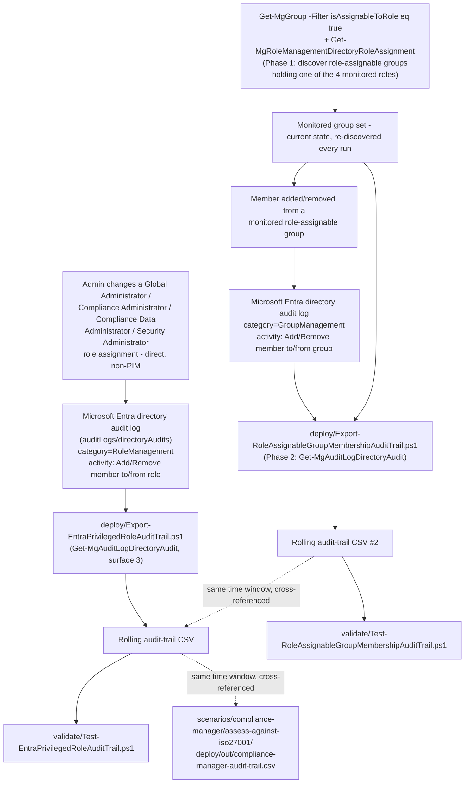

## 1. Scenario summary

Closes a specific, disclosed blind spot in `scenarios/compliance-manager/assess-against-iso27001/`:
its audit-trail script can only see an **explicit** Compliance Manager role grant, not the
**implicit** Compliance Manager Administration-equivalent access that **Global Administrator**,
**Compliance Administrator**, **Compliance Data Administrator**, and **Security Administrator**
Entra ID roles carry automatically. This scenario ships a rolling, idempotent export of direct
(non-PIM) assignment/removal events for those four roles, read from Microsoft Entra ID's own
directory audit log via Microsoft Graph, a separate system from the Microsoft 365 unified audit
log every other audit-trail script in this library reads.

**Who it's for:** a security/compliance team that has already deployed
`scenarios/compliance-manager/assess-against-iso27001/` (or any other scenario whose technical
control assumes "only people with an explicit Purview role grant can touch this") and wants
real visibility into a population of accounts that can bypass that assumption entirely, without
generating a single Purview-specific audit event.

This scenario ships **two** scripts. `Export-EntraPrivilegedRoleAuditTrail.ps1` covers **direct**
role assignment/removal for the four roles. `Export-RoleAssignableGroupMembershipAuditTrail.ps1`
closes a gap the first script's own Red Team review disclosed (`reviews.md` round 1, finding 1):
one of the four roles assigned to an Entra ID P1/P2 **role-assignable group** instead of directly to
a user generates a completely different, invisible-to-the-first-script audit event when someone is
added to or removed from that group. The second script discovers which role-assignable groups
currently hold one of the four roles, then monitors exactly those groups' own membership, see §4/§5
below and `design.md` §10.

## 2. Business/regulatory driver

Least-privilege and separation-of-duties controls (ISO/IEC 27001:2022 Annex A access-control
requirements, consolidated under the Organizational Controls theme, A.5, in the 2022 revision's
93-control structure, not the 2013 edition's separate 14-domain "A.9 Access Control" clause, plus
SOC 2 CC6 and equivalent frameworks) require an organization to know **who can access or modify a
control's evidence**, not just who the control's own tooling reports as having access. Compliance
Manager's own **User access** settings page, the surface `assess-against-iso27001/README.md` §5
step 8 uses to assign roles, provably does not list users who hold Compliance Manager access
implicitly through one of the four Entra roles above [[2]](#references). An auditor asking "who
could have altered this assessment's evidence during the audit period" deserves a complete answer,
not one scoped to only the access grants Compliance Manager's own UI happens to surface. This
scenario produces that complete answer for the one population Compliance Manager's UI misses.

## 3. Prerequisites

Full licensing detail and citations: `docs/licensing-matrix.md`. Summary for this scenario:

| Requirement | Minimum | Notes |
|---|---|---|
| Reading the Entra directory audit log itself | **No premium license required** | Available at every Entra ID tier, including Free, only the **retention window** differs by tier (§11) [[6]](#references) |
| Automation identity's Graph application permission | **`AuditLog.Read.All`** (least-privileged; `Directory.Read.All` also works but is broader) | Application permission on the app registration, admin-consented tenant-wide, see `docs/rbac-model.md` §8 and `docs/automation-surface.md` §3 [[4]](#references) |
| Additional permissions for `Export-RoleAssignableGroupMembershipAuditTrail.ps1` only | **`Group.Read.All`** and **`RoleManagement.Read.Directory`** | Needed for Phase 1 discovery (listing role-assignable groups and their current role assignments), not needed by `Export-EntraPrivilegedRoleAuditTrail.ps1`, which only reads the audit log. `Group.Read.All` is directly listed on the `Get-MgGroup` cmdlet's own Application-permissions table (the cmdlet this script actually calls) [[15]](#references); `RoleManagement.Read.Directory` is the least-privileged application permission documented for `Get-MgRoleManagementDirectoryRoleAssignment`/`Get-MgRoleManagementDirectoryRoleDefinition` [[16]](#references) |
| Automation identity's Entra role (delegated/interactive use only) | **Reports Reader**, **Security Reader**, or **Security Administrator** | Only required for **delegated** (signed-in user) calls to this API; **not** required for the app-only pattern this scenario's script defaults to, Microsoft's own permissions table lists this role requirement specifically under "delegated access using work or school accounts" [[4]](#references) |
| Longer retention (optional) | **Microsoft Entra ID P1/P2** (30 days) or **Microsoft Purview Audit (Premium)** (1 year, `AzureActiveDirectory` workload, via the E5/Purview Suite/E5 eDiscovery-and-Audit-add-on license already covering `assess-against-iso27001`) | Neither is required to *run* this scenario, only to extend the underlying log's own retention beyond Free tier's 7 days (§11) [[7]](#references)[[8]](#references) |
| Dependency (not deployed by this scenario) | `scenarios/compliance-manager/assess-against-iso27001/` strongly recommended, not required | This scenario closes a specific gap that scenario's own Red Team review disclosed, see `design.md` §1/§7. The script itself has no hard dependency and is useful standalone for any module relying on `rbac-model.md` §3's four-role mapping |

> Verify current entitlement names and retention figures against `docs/licensing-matrix.md` and
> the cited Microsoft Learn pages before a sales commitment, Entra ID's audit-log retention model
> is tied to licensing tier and has changed before.

## 4. Architecture



This scenario ships two standalone, read-only scripts, there is no assessment or policy object to
create in the portal for either. See `design.md` §2 for why this scenario uses a different Graph API
from every other audit-trail script in this library, and `design.md` §10 for the second script's own
two-phase (discover, then monitor) design.

## 5. Step-by-step implementation

### App registration and permission grant (one-time)

1. Register (or reuse) an Entra app registration for unattended automation, see
   `docs/automation-surface.md` §3's "App-only setup" steps.
2. Grant it the **`AuditLog.Read.All`** Microsoft Graph **Application** permission (both scripts)
   plus, if running `Export-RoleAssignableGroupMembershipAuditTrail.ps1`, **`Group.Read.All`** and
   **`RoleManagement.Read.Directory`**, and complete tenant-wide admin consent
   [[4]](#references)[[15]](#references)[[16]](#references). No Exchange/Purview role group
   assignment is needed for either script, unlike surfaces 1/2 in this library, surface 3's app-only
   calls are governed purely by the consented Graph permission(s) (`docs/rbac-model.md` §8).
3. Generate and attach a certificate per `docs/automation-surface.md` §3 (CBA is this library's
   default pattern; a client secret is acceptable only for a quick POC).

### Script path, the audit-trail export (idempotent, parameterized, dry-run capable)

```powershell
# 1. Connect (certificate app-only, see docs/automation-surface.md §3)
Connect-MgGraph -ClientId $AppId -TenantId $TenantId -CertificateThumbprint $Thumbprint

# 2. Dry run, queries the last 24 hours, reports what would be merged, writes nothing
./deploy/Export-EntraPrivilegedRoleAuditTrail.ps1 -OutputCsvPath './out/entra-privileged-role-audit-trail.csv' -WhatIf

# 3. First real run, a one-time backfill covering the tenant's actual retention window
#    (30 days shown; use 7 on Entra ID Free, see Section 11)
./deploy/Export-EntraPrivilegedRoleAuditTrail.ps1 `
    -StartDate (Get-Date).AddDays(-30) -EndDate (Get-Date) `
    -OutputCsvPath './out/entra-privileged-role-audit-trail.csv'

# 4. Recurring run, schedule DAILY, not weekly (Section 8 explains why this cadence differs
#    from the Compliance Manager sibling script's weekly-safe default)
./deploy/Export-EntraPrivilegedRoleAuditTrail.ps1 -OutputCsvPath './out/entra-privileged-role-audit-trail.csv'

# 5. Validate
./validate/Test-EntraPrivilegedRoleAuditTrail.ps1 -AuditTrailCsvPath './out/entra-privileged-role-audit-trail.csv'
```

The script uses the Microsoft Graph PowerShell SDK's `Microsoft.Graph.Reports` module, 
automation surface 3 per `docs/automation-surface.md` §1, because Entra ID's own directory audit
log has no Exchange/Security & Compliance PowerShell surface; it is exclusively a Graph resource.
Throttling: the script calls the SDK cmdlet directly (never a raw REST call), so it inherits the
SDK's automatic retry-with-backoff on `Retry-After` per `docs/automation-surface.md` §5 without
needing its own 429-handling, expected daily event volume for a 4-role population is low enough
that this is a defense-in-depth note, not an anticipated real bottleneck.

### Companion script path, role-assignable-group membership (`design.md` §10)

Run alongside (not instead of) the script above, same daily cadence, same certificate/app
registration (with the two additional permissions from §3):

```powershell
# 1. Connect (same app registration, now also holding Group.Read.All and RoleManagement.Read.Directory)
Connect-MgGraph -ClientId $AppId -TenantId $TenantId -CertificateThumbprint $Thumbprint

# 2. Dry run, discovers the current monitored group set, queries the last 24 hours, reports what
#    would be merged, writes nothing
./deploy/Export-RoleAssignableGroupMembershipAuditTrail.ps1 -OutputCsvPath './out/role-assignable-group-membership-audit-trail.csv' -WhatIf

# 3. First real run, a one-time backfill covering the tenant's actual retention window
./deploy/Export-RoleAssignableGroupMembershipAuditTrail.ps1 `
    -StartDate (Get-Date).AddDays(-30) -EndDate (Get-Date) `
    -OutputCsvPath './out/role-assignable-group-membership-audit-trail.csv'

# 4. Recurring run, schedule DAILY, same reasoning as the sibling script (Section 8)
./deploy/Export-RoleAssignableGroupMembershipAuditTrail.ps1 -OutputCsvPath './out/role-assignable-group-membership-audit-trail.csv'

# 5. Validate
./validate/Test-RoleAssignableGroupMembershipAuditTrail.ps1 -AuditTrailCsvPath './out/role-assignable-group-membership-audit-trail.csv'
```

This script additionally uses `Microsoft.Graph.Groups` (`Get-MgGroup`) and
`Microsoft.Graph.Identity.Governance` (`Get-MgRoleManagementDirectoryRoleDefinition`,
`Get-MgRoleManagementDirectoryRoleAssignment`) for its Phase 1 discovery, on top of the same
`Microsoft.Graph.Reports` call the sibling script uses for Phase 2. All calls go through SDK
cmdlets, same throttling note as above applies to all three.

## 6. Configuration reference

| Setting | Value this scenario uses | Notes |
|---|---|---|
| Graph resource | `/auditLogs/directoryAudits` (`Get-MgAuditLogDirectoryAudit`) | `design.md` §2 |
| Server-side filter | `category eq 'RoleManagement' and activityDateTime ge <start> and activityDateTime le <end>` | `design.md` §4, the one compound-`and` shape grounded against a Microsoft worked example |
| Monitored activities (client-side filter) | `Add member to role`, `Add member to role scoped over Restricted Management Administrative Unit`, `Add scoped member to role`, `Remove member from role`, `Remove member from role scoped over Restricted Management Administrative Unit`, `Remove scoped member from role` | Core Directory category only, PIM-mediated activation is out of scope, `design.md` §3/§9 |
| Monitored roles (`-PrivilegedRoleDisplayNames`) | `Global Administrator`, `Compliance Administrator`, `Compliance Data Administrator`, `Security Administrator` | Matches `docs/rbac-model.md` §3's mapping table; parameterized, override for a different role population |
| Default lookback window | 24 hours (`-StartDate`/`-EndDate`) | Shorter than the Compliance Manager sibling's 7-day default, matches this log's shorter worst-case retention, `design.md` §6 |
| Idempotency | De-duplicate by the record's own documented `Id` (GUID) on every merge | Simpler than the Compliance Manager sibling's composite-hash key, `design.md` §5 |

Full cmdlet parameter grounding: `deploy/Export-EntraPrivilegedRoleAuditTrail.ps1`'s inline comments
and its `.NOTES` block cite the exact Microsoft Learn reference pages.

**`Export-RoleAssignableGroupMembershipAuditTrail.ps1` (companion script):**

| Setting | Value this scenario uses | Notes |
|---|---|---|
| Phase 1 discovery filters | `isAssignableToRole eq true` (`Get-MgGroup`); `DisplayName eq '<role>'` (`Get-MgRoleManagementDirectoryRoleDefinition`); `roleDefinitionId eq '<id>'` (`Get-MgRoleManagementDirectoryRoleAssignment`) | All three directly confirmed by Microsoft worked examples, `design.md` §10 |
| Phase 2 Graph resource | `/auditLogs/directoryAudits` (`Get-MgAuditLogDirectoryAudit`), same resource as the sibling script | `design.md` §10 |
| Phase 2 server-side filter | `category eq 'GroupManagement' and activityDateTime ge <start> and activityDateTime le <end>` | Same grounded shape as the sibling script's own filter, applied to a different category |
| Monitored activities (client-side filter) | `Add member to group`, `Remove member from group` (Core Directory), `Bulk import group members - finished (bulk)`, `Bulk remove group members - finished (bulk)` (Microsoft Entra (AAD) Management UX) | All four are confirmed real `GroupManagement`-category activity names, `design.md` §10; the bulk pair's `targetResources` shape is a disclosed open VERIFY, §11 |
| Monitored roles (`-PrivilegedRoleDisplayNames`) | Same 4 roles as the sibling script | Keep the two scripts' role lists in sync if customized |
| Default lookback window | 24 hours (`-StartDate`/`-EndDate`) | Same reasoning as the sibling script |
| Idempotency | De-duplicate by the record's own documented `Id` (GUID) on every merge | Same model as the sibling script, `design.md` §5/§10 |
| Discovery caching | **None**, Phase 1 re-runs on every invocation | A group added to or removed from a monitored role between runs is picked up automatically on the next run |

## 7. Validation / how to prove it works

1. **Automated file-integrity check**, `./validate/Test-EntraPrivilegedRoleAuditTrail.ps1
   -AuditTrailCsvPath './out/entra-privileged-role-audit-trail.csv'` confirms the CSV's schema, no
   duplicate `Id` rows, valid activity/role values, and sorted timestamps; exits non-zero on any
   hard failure (safe for a CI-style pre-flight).
2. **Manual spot-check checklist**, the same script prints a checklist for cross-referencing one
   row against the Entra admin center's own Audit logs blade directly, since this script's
   `targetResources` parsing rests on a documented-but-not-independently-worked-example schema
   (§11).
3. **Functional test**, in a test tenant, add then immediately remove a test user from one of the
   four monitored roles (or a role you temporarily add to `-PrivilegedRoleDisplayNames` for the
   test if you don't want to touch a real privileged role). Wait a few minutes for audit-log
   ingestion (Entra ID's directory audit log ingests faster than Audit (Standard)'s unified audit
   log, but no specific SLA is documented, re-run with a widened `-StartDate` if the event doesn't
   appear immediately), then re-run the deploy script. Expect: two new rows, `Add member to role`
   then `Remove member from role`, with the test user in `PrincipalDisplayName`.
4. **The cross-reference this scenario exists to enable**, run this script and
   `assess-against-iso27001`'s `Export-ComplianceManagerAuditTrail.ps1` over the same time window.
   A row here for one of the four roles with **no** corresponding `ComplianceManagerRolesChange`
   row there is exactly the previously-invisible access grant this scenario surfaces, confirming
   you can now see it is the real proof this scenario delivers value, not just that the script
   runs.
5. **`Export-RoleAssignableGroupMembershipAuditTrail.ps1`'s own file-integrity check**, 
   `./validate/Test-RoleAssignableGroupMembershipAuditTrail.ps1 -AuditTrailCsvPath
   './out/role-assignable-group-membership-audit-trail.csv'`, same schema/duplicate/timestamp checks
   as the sibling script's validate script, plus a `GroupId`-non-empty check.
6. **The cross-reference this companion exists to enable**, in a test tenant, create (or reuse) a
   role-assignable group, assign it one of the four monitored roles, then add and remove a test user
   from the group's membership. Confirm: (a) `Export-EntraPrivilegedRoleAuditTrail.ps1`'s own output
   shows **nothing** for this change (the RoleManagement-category filter genuinely can't see it), and
   (b) `Export-RoleAssignableGroupMembershipAuditTrail.ps1`'s output shows the add/remove pair with
   the correct `GroupDisplayName`/`RoleDisplayName`. That contrast, visible here, invisible there, 
   is the proof this companion closes the disclosed gap rather than merely duplicating coverage.

## 8. Operations & tuning

**Review cadence:** run this script **daily**, not weekly, unlike the Compliance Manager sibling
, because the underlying Entra directory audit log's own retention can be as short as **7 days**
on Microsoft Entra ID Free (§11); a weekly cadence risks a missed prior run silently losing events
forever, not just delaying their discovery. Overlapping-window de-duplication (by `Id`) makes daily
runs safe even when nothing changed. **Immediately** (not on the daily cadence) review any
`Write-Warning` the script emits, every matched row is, by construction, a change to one of the
four most powerful role assignments in the tenant. Treat **any** Global Administrator role change
as a near-zero-tolerance signal per the script's own differentiated warning severity.

**KPIs to watch:**
- **Event volume outside a planned onboarding/offboarding/access-review window**, the primary
  signal this script exists to produce. A tenant with disciplined change management should see
  this CSV grow rarely and predictably.
- **Any row this scenario surfaces with no corresponding `ComplianceManagerRolesChange` row in
  `assess-against-iso27001`'s own audit trail for the same principal/window**, direct proof of
  the blind spot this scenario closes; investigate every such row as a genuine "who granted
  themselves audit-evidence access without Compliance Manager knowing" event.
- **Gaps in the CSV's own coverage**, if the daily schedule itself fails to run (e.g. certificate
  expiry, a Graph API throttling response), the script produces no output at all for that day,
  which is silent unless the schedule's own job-failure alerting is wired up separately (§11).
  **Wire this up from day one**, whatever scheduler runs this daily (Azure Automation runbook,
  Task Scheduler, a CI pipeline's scheduled trigger) should alert a human on job failure, not just
  on the script's own `Write-Warning` output; a run that never happened produces no warning either.

**Incident-response runbook (unplanned privileged-role change detected):**
1. **Triage**, pull the full row (`InitiatedBy`, `ActivityDateTime`, `Result`, `ResultReason`,
   `CorrelationId`) to see exactly who made the change, when, and whether Entra itself reports it
   as successful.
2. **Classify**, does this match a documented onboarding/offboarding/access-review event, or is it
   unplanned?
3. **Planned:** document the change and its business justification in whatever change-management
   record the organization already keeps for privileged access, this scenario's CSV is evidence
   of *when* the change happened, not a substitute for a change-approval record.
4. **Unplanned:** escalate immediately to whoever owns Entra ID Global Administrator/Privileged Role
   Administrator oversight. Check whether the same principal also appears in
   `assess-against-iso27001`'s own audit trail around the same time (a coordinated attempt to both
   gain and cover implicit Compliance Manager access). Consider whether the initiating account
   itself needs its access reviewed or suspended pending investigation.
5. **Document**, every reviewed event, planned or not, is retained in this CSV as evidence; do not
   delete rows from it.

**`Export-RoleAssignableGroupMembershipAuditTrail.ps1` operations note:** run on the **same daily
schedule** as the sibling script, they share the same underlying log and retention constraints.
Its console `Write-Warning` output includes **two** distinct signal types worth distinguishing in
an on-call runbook: a `"Monitored group discovered"` warning (Phase 1, informational; a group is
now in scope, not itself an incident) and a `"Monitored-group membership change detected"` warning
(Phase 2, the actual signal this script exists to produce, follow the same incident-response
runbook above). A tenant with **zero** role-assignable groups holding any of the four roles will
never see either warning, that is the expected, healthy state for most tenants (§11).

## 9. Rollback / decommission

See `rollback.md` for the full procedure, there is no portal object to roll back for either script
in this scenario (both are read-only); decommissioning means stopping the schedule(s), deciding the
CSVs' retention fate, and revoking the app registration's Graph permission grants.

## 10. Cost & licensing notes

- **No incremental license cost for the core capability.** Reading the Entra directory audit log
  via Graph requires only the `AuditLog.Read.All` application permission, available at every
  Entra ID tier, including Free [[4]](#references)[[6]](#references).
- **The only cost lever is retention, and it's optional.** A tenant already licensed for
  `assess-against-iso27001` (A5/E5/G5 or the Compliance Manager premium add-on) very likely already
  holds the Microsoft 365 E5/Purview Suite/E5 eDiscovery-and-Audit-add-on tier that also grants
  Purview Audit (Premium)'s 1-year `AzureActiveDirectory`-workload retention [[8]](#references), 
  meaning most buyers of the sibling scenario get this scenario's extended-retention option "for
  free" on licensing they already carry. A buyer without that tier still gets full value from this
  script by simply running it daily from day one and letting the CSV itself become the durable
  record, at no incremental license cost.
- **Sizing note:** this script's own compute/storage cost is negligible, a small daily CSV append
  for a population of, at most, a handful of privileged-role changes per day in a healthy tenant.
  The companion script's Phase 1 discovery calls (`Get-MgGroup`, `Get-MgRoleManagementDirectory*`)
  add a small, fixed daily cost independent of tenant size (bounded by the tenant's 500-role-
  assignable-group maximum [[1]](#references)), not a per-user cost.

## 11. Known limitations & gotchas

- **A role assigned to a role-assignable group is covered by the companion script, not by
  `Export-EntraPrivilegedRoleAuditTrail.ps1` itself.** If one of the four monitored roles is
  assigned to an Entra ID P1/P2 **role-assignable group** (a legitimate, Microsoft-recommended
  practice), adding a new member to that group generates a `GroupManagement`-category "Add member
  to group" event, not a `RoleManagement`-category "Add member to role" event, **entirely invisible
  to `Export-EntraPrivilegedRoleAuditTrail.ps1`'s own filter**. Run
  `Export-RoleAssignableGroupMembershipAuditTrail.ps1` (§5/§7/§8, `design.md` §10) alongside it to
  close this gap, it was a disclosed, unmitigated limitation in this scenario's first release (see
  the Red Team finding in `reviews.md` round 1) and is now closed by that companion script (`reviews.md`
  round 2). The companion's own limitations (below) still apply, it is not a substitute for
  confirming, at deploy time, that both scripts are actually scheduled and running.
- **The companion script's Phase 1 discovery is current-state-only, re-evaluated fresh on every
  run.** If a role-assignable group held a monitored role for part of a search window but had the
  role removed before the run that covers that window, membership changes that occurred while the
  role was still assigned won't be included in that run's output (the group is no longer in the
  monitored set by the time discovery runs). For a tenant with frequent role-to-group reassignment,
  consider a shorter interval between runs to narrow this window; for the common case (role-to-group
  assignments are infrequent, deliberate changes), this is a low-probability edge case, not a
  routine gap. See `design.md` §10.
- **The companion script does not distinguish a tenant-wide role assignment to a group from one
  scoped to an administrative unit, and does not separately alert on PIM-mediated group-role
  activation start/end**, see the deploy script's `.NOTES` VERIFY items and `design.md` §10's
  "Non-goals inherited from the sibling script."
- **The companion script's detection window is bounded by its own run interval, not real-time.**
  An attacker who creates a new role-assignable group, assigns it a monitored role, and adds
  themselves to it entirely between two scheduled runs has a window (24 hours at the default daily
  cadence) before the next Phase 1 discovery picks up the new group. This is the same inherent
  trade-off every poll-based control in this scenario carries (§8's "run daily, not weekly"
  guidance), a buyer with a lower risk tolerance can narrow this window with a shorter schedule
  interval (e.g. hourly). See `reviews.md` round 2, Red Team finding 2.
- **The companion script now also monitors bulk group-membership import/remove activities, with one
  disclosed residual gap.** Microsoft's `reference-audit-activities` page documents
  `"Bulk import group members - finished (bulk)"` and `"Bulk remove group members - finished
  (bulk)"` (under the Microsoft Entra (AAD) Management UX audit source) as activity names distinct
  from the two single-member activities (`Add member to group`/`Remove member from group`), 
  confirmed via a direct fetch of Microsoft's docs source, so both are now in
  `$monitoredActivities`. **Not yet confirmed:** whether a bulk activity's `targetResources` carries
  the same Group-typed-plus-User-typed shape the two single-member activities are confirmed to use, 
  no Microsoft worked example addresses the bulk case specifically. The extraction logic fails soft
  (skips the record) rather than guessing at an unconfirmed shape (`AGENTS.md` §4), so a bulk-added
  member of a monitored role-assignable group could still go undetected by this script if the real
  shape turns out to differ, confirming or refuting this needs a pilot-tenant test (see
  `validate/Test-RoleAssignableGroupMembershipAuditTrail.ps1`'s manual checklist). See `reviews.md`
  round 3, Red Team finding 3 (revisited).
- **VERIFY (pilot tenant or a future Microsoft Learn pass):** Microsoft's own "Security operations
  for privileged accounts" guidance names a differently-suffixed activity ("Add member to role
  (permanent)", tagged `Service = PIM`) for detecting roles assigned outside PIM, not confirmed to
  be the same event as, or different from, the plain "Add member to role" this script filters on.
  See `design.md` §4a and the deploy script's `.NOTES`, not resolved by guessing.
- **This scenario is not a reinvention of Microsoft's own native "Roles are being assigned outside
  of Privileged Identity Management" PIM alert**, that alert requires **Entra ID P2 or Entra ID
  Governance** to function at all (Microsoft's own PIM alert configuration guidance documents a
  separate alert that fires specifically because the tenant lacks that license). This script is
  the equivalent detective control for tenants below that licensing floor, and a complementary,
  durable CSV export even for tenants above it (PIM's own alert is portal/email-only). See
  `design.md` §2.
- **This scenario does not cover Privileged Identity Management (PIM)-mediated role activation**, 
  eligible assignments, time-bound activations, and the ~30 other PIM-specific activity names under
  the same `RoleManagement` audit category. A tenant running these four roles through PIM (which
  Microsoft recommends) needs **PIM's own built-in alerting** as the primary control for that path.
  This script covers the direct/permanent-assignment path specifically, see `design.md` §9.
- **The server-side query only narrows by `category` and date range, not by `activityDisplayName`
  or role name**, those narrow client-side, after a potentially larger pull. For a very
  high-churn tenant (frequent role changes of any kind across the whole `RoleManagement` category,
  including group-role and application-role management events also filed under it), this means more
  data crosses the wire than strictly necessary. Not a correctness issue, `design.md` §4 explains
  why the narrower compound filter isn't used without a grounded worked example confirming it's
  supported for this resource.
- **VERIFY (pilot tenant):** the exact `targetResources` array shape for "Add member to role"/
  "Remove member from role" events. Microsoft's `targetResource` resource-type reference documents
  `type`/`displayName` per entry, including a `Role` type, but no worked JSON example for this
  specific activity confirms array ordering or that a `User`-typed entry (the affected principal)
  is always present. The deploy script filters by `.Type` rather than assuming position, and fails
  soft (empty column) rather than guessing, but confirm against a real tenant's audit-log entry
  before treating `PrincipalDisplayName` as guaranteed-populated in an automated alerting pipeline.
- **No alert routing beyond console `Write-Warning` output.** Same accepted scope boundary this
  library draws elsewhere (`assess-against-iso27001/reviews.md` Blue Team finding 2), a buyer
  relying on a scheduled task/pipeline needs that warning to actually reach a human, which this
  scenario doesn't build; see `docs/automation-surface.md` §4 if building a custom pipeline.
- **Entra directory audit log retention is short and licensing-tiered**: **7 days** on Microsoft
  Entra ID Free, **30 days** on P1/P2 [[6]](#references). This is dramatically shorter than Audit
  (Standard)'s 180-day default that every other audit-trail script in this library relies on, run
  this script **daily**, not weekly, from day one if continuous coverage matters (§8), or pair it
  with Purview Audit (Premium)'s 1-year `AzureActiveDirectory`-workload retention if already
  licensed (§10).
- **This script is detective, not preventive.** It never blocks or reverses a role change, see
  `design.md` §9 for the preventive controls (Conditional Access step-up auth, PIM approval
  workflow) this scenario deliberately doesn't build.

## 12. References

1. Microsoft Purview Compliance Manager, assess-against-iso27001 (the sibling scenario this one
   closes a Red Team finding for), `scenarios/compliance-manager/assess-against-iso27001/README.md`
2. Get started with Compliance Manager (role types, and users with implicit access via Entra roles
   not appearing on the User access settings page), <https://learn.microsoft.com/purview/compliance-manager-setup>
3. directoryAudit resource type (`id`, `activityDisplayName`, `category`, `targetResources`,
   `initiatedBy` properties), <https://learn.microsoft.com/graph/api/resources/directoryaudit>
4. List directoryAudits (permissions table: `AuditLog.Read.All` least-privileged; delegated-access
   role requirement: Reports Reader / Security Administrator / Security Reader), <https://learn.microsoft.com/graph/api/directoryaudit-list>
5. Get-MgAuditLogDirectoryAudit reference (`-Filter`/`-All`/`-PageSize` parameters,
   `Microsoft.Graph.Reports` module), <https://learn.microsoft.com/powershell/module/microsoft.graph.reports/get-mgauditlogdirectoryaudit>
6. Microsoft Entra data retention (7 days Free / 30 days P1-P2 for audit logs), <https://learn.microsoft.com/entra/identity/monitoring-health/reference-reports-data-retention>
7. Microsoft Entra audit log categories and activities (Core Directory RoleManagement: "Add member
   to role" / "Remove member from role"; PIM RoleManagement activity family), <https://learn.microsoft.com/entra/identity/monitoring-health/reference-audit-activities>
8. Manage audit log retention policies (Purview Audit (Premium) default 1-year retention for the
   `AzureActiveDirectory` workload), <https://learn.microsoft.com/purview/audit-log-retention-policies>
9. targetResource resource type (`type`/`displayName` per target, including `Role`), <https://learn.microsoft.com/graph/api/resources/targetresource>
10. How to investigate the Conditional Access block policy alert (worked example combining `eq` and
    `ge` with `and` directly against `/auditLogs/directoryAudits`, grounding this scenario's filter
    composition), <https://learn.microsoft.com/entra/identity/monitoring-health/scenario-health-conditional-access-block-policy>
11. Assign Microsoft Entra roles in Privileged Identity Management (PIM time-bound/eligible
    assignment model, cited for this scenario's Non-goals), <https://learn.microsoft.com/entra/id-governance/privileged-identity-management/pim-how-to-add-role-to-user>
12. Configure security alerts for Microsoft Entra roles in Privileged Identity Management (the
    native "Roles are being assigned outside of Privileged Identity Management" High-severity
    alert, and the P2/Governance licensing gate on it), <https://learn.microsoft.com/entra/id-governance/privileged-identity-management/pim-how-to-configure-security-alerts>
13. Security operations for privileged accounts in Microsoft Entra ID (the differently-suffixed
    "Add member to role (permanent)" detection guidance underlying this scenario's §11 VERIFY item)
, <https://learn.microsoft.com/entra/architecture/security-operations-privileged-accounts>
14. Use Microsoft Entra groups to manage role assignments (role-assignable groups; membership
    governance is expected to happen at the group level; 500 role-assignable group maximum per
    tenant, grounds the companion script's discovery design), <https://learn.microsoft.com/entra/identity/role-based-access-control/groups-concept>
15. Get-MgGroup reference (Application permissions table, listing `Group.Read.All`), <https://learn.microsoft.com/powershell/module/microsoft.graph.groups/get-mggroup>
16. Get-MgRoleManagementDirectoryRoleAssignment reference (permissions table: `RoleManagement.Read.Directory`
    least-privileged application permission), <https://learn.microsoft.com/powershell/module/microsoft.graph.identity.governance/get-mgrolemanagementdirectoryroleassignment>
17. List Microsoft Entra role assignments (worked PowerShell examples: `Get-MgRoleManagementDirectoryRoleAssignment
    -Filter "PrincipalId eq '<group id>'"` for a group; role-definition-then-assignment pattern), <https://learn.microsoft.com/entra/identity/role-based-access-control/view-assignments>
18. Use the `$filter` query parameter (worked example: `~/groups?$filter=isAssignableToRole eq true`
    as a default, non-advanced-query `eq` filter), <https://learn.microsoft.com/graph/filter-query-parameter>
19. Advanced query capabilities on Microsoft Entra ID objects (`eq` filters work by default; `ne`/
    `not`/`endswith` require `ConsistencyLevel: eventual` + `$count`), <https://learn.microsoft.com/graph/aad-advanced-queries>
20. Get-EntraAuditDirectoryLog reference, Example 9 (worked filter confirming the `targetResources`
    `Group`-type entry's `id` property for "Add member to group" events), <https://learn.microsoft.com/powershell/module/microsoft.entra.reports/get-entraauditdirectorylog>

> Re-verify all links and the retention/licensing figures against current Microsoft Learn before a
> customer-facing deployment, Entra ID's audit-log retention model is tied to licensing tier and
> has changed before, and can change again.
