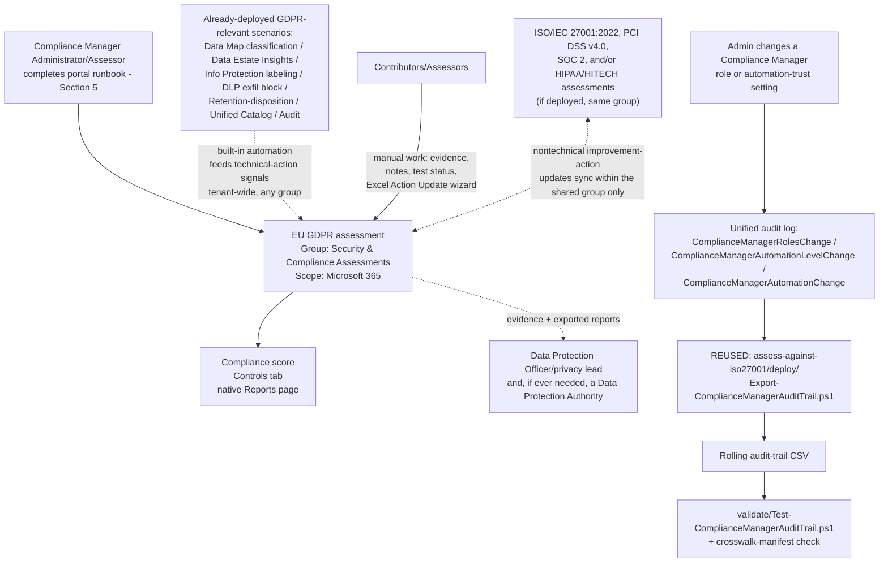

## 1. Scenario summary

Stands up a dedicated **Microsoft Purview Compliance Manager** assessment against the **EU GDPR
(General Data Protection Regulation)** premium template, places it correctly relative to this
library's other Compliance Manager assessments, and cross-references it against the GDPR-relevant
technical controls this library already ships (Data Map classification, Information Protection
labeling, DLP exfiltration blocking, Data Lifecycle Management retention, Unified Catalog data
inventory, Audit). Like [`compliance-manager/assess-against-iso27001`](/scenarios/compliance-manager/assess-against-iso27001/), `scenarios/
compliance-manager/pci-dss-assessment/`, [`compliance-manager/soc2-assessment`](/scenarios/compliance-manager/soc2-assessment/), and
[`compliance-manager/hipaa-hitech-assessment`](/scenarios/compliance-manager/hipaa-hitech-assessment/), Compliance Manager itself has no write API,
so most of this scenario is a precise, repeatable **portal runbook** — see §2 and `design.md` §2.

**Who it's for:** any organization — regardless of where it is headquartered — that offers goods or
services to people in the EU/EEA, or monitors the behavior of EU/EEA residents, and needs an
internal, evidenced readiness view of how its Microsoft 365 estate maps to GDPR's Data Subject
Request, Breach Notification, and Data Protection Impact Assessment obligations, its Article 5
processing principles, and its Article 30/37 accountability and governance requirements. This is
also for a team that understands (or needs this scenario to make explicit) that a Compliance Manager
score is **not** a GDPR certification, is **not** a substitute for the organization's own required
Article 30 Records of Processing Activities or Article 35 DPIAs, and does not by itself establish a
lawful basis for any processing activity (§11).

## 2. Business/regulatory driver

The **General Data Protection Regulation (GDPR)** (Regulation (EU) 2016/679) gives individuals
("data subjects") rights to manage the personal data organizations collect about them, and imposes
obligations on the organizations ("controllers" and "processors") that process it
[[1]](#references). Unlike every other regulation this library's Compliance Manager scenarios cover
— HIPAA (a US federal law), PCI DSS (a card-network contractual scheme), SOC 2 (a US/AICPA
attestation), and ISO/IEC 27001 (a voluntary international standard) — GDPR applies **extraterritorially**:
it reaches any organization that offers goods or services to people in the EU/EEA or monitors their
behavior, regardless of where the organization itself is located [[1]](#references). Noncompliance
carries real regulatory exposure: fines of up to €20 million or 4% of annual global turnover
(whichever is greater), enforcement by national Data Protection Authorities (DPAs), and — for a
breach likely to result in a high risk to individuals' rights and freedoms — a mandatory 72-hour
notification obligation to the relevant DPA [[1]](#references)[[2]](#references).

GDPR compliance work is organized, per Microsoft's own overview of the regulation, into three core
compliance areas [[1]](#references):

1. **Data Subject Requests (DSR)** — formal requests by a data subject to access, correct, restrict,
   export, or delete their personal data (six activities: Discovery, Access, Rectification,
   Restriction, Export, Deletion).
2. **Breach notification** — notifying the appropriate DPA within 72 hours of becoming aware of a
   personal data breach likely to result in a high risk to individuals, and notifying affected
   individuals without undue delay [[2]](#references).
3. **Data Protection Impact Assessment (DPIA)** — a required risk assessment for processing
   operations "likely to result in a high risk to the rights and freedoms of natural persons"
   [[3]](#references).

Alongside these three areas, GDPR's Article 5 sets out six processing principles (lawfulness/
fairness/transparency, purpose limitation, data minimization, accuracy, storage limitation, and
integrity/confidentiality), Article 30 requires controllers and processors to maintain a Record of
Processing Activities, Article 37 conditionally requires designating a Data Protection Officer, and
Article 46 restricts transfers of personal data outside the EU/EEA absent appropriate safeguards
[[1]](#references)[[4]](#references). Compliance Manager's EU GDPR premium template exists to give an
organization's Microsoft 365-based controls a scored, evidenced internal readiness view against this
structure [[5]](#references) — it does not itself demonstrate legal compliance, and this scenario
does not present it as though it does (§11).

## 3. Prerequisites

Full licensing detail and citations: `docs/licensing-matrix.md`. Summary for this scenario (identical
role/licensing model to `assess-against-iso27001/README.md` §3, `pci-dss-assessment/README.md` §3,
`soc2-assessment/README.md` §3, and `hipaa-hitech-assessment/README.md` §3 — Compliance Manager's RBAC
and premium-template licensing are tenant-wide, not per-regulation):

| Requirement | Minimum | Notes |
|---|---|---|
| Compliance Manager base access | **Office 365 / Microsoft 365** license (any tier) | Available at all subscription levels; only premium regulatory templates require more [[6]](#references) |
| EU GDPR premium template | **A5/E5/G5** (3 free premium templates of choice) **or** the purchased **Compliance Manager premium assessment add-on**, **or** a **90-day premium assessments trial** (25 templates) | **Licensing-history caveat, unique to this scenario among this library's five Compliance Manager scenarios:** GDPR was one of a small set of templates (with NIST 800-53 and ISO 27001) included by default **before** Microsoft's December 2022 licensing change. Since that change, continued use of GDPR counts against the same 3-free-premium-template allotment as any other premium template — there is no separate "free GDPR" entitlement any more. Confirm the tenant's current Regulation licenses used counter reflects this rather than assuming a legacy free grant still applies [[7]](#references)[[8]](#references) |
| Role to create/administer the assessment | **Compliance Manager Administration** (or **Compliance Manager Assessor** to create; **Global Administrator** also works) | `docs/rbac-model.md` §4 for the Purview role-group mapping [[9]](#references) |
| Role to edit/test without creating | **Compliance Manager Contribution** (create + edit) or **Compliance Manager Assessor** (edit only, no create) | Assign the narrowest role per person — see `deploy/policy/gdpr-assessment-manifest.json` |
| Role for read-only visibility | **Compliance Manager Reader** | Extend to the organization's Data Protection Officer (if designated — see below) if they are not already a Contributor |
| Organizational designation (not a Compliance Manager role, and unlike HIPAA, **conditional**) | A **Data Protection Officer (DPO)** under GDPR Article 37, if the organization's core activities involve large-scale systematic monitoring of data subjects, large-scale processing of special-category/criminal-conviction data, or processing by a public authority | Determine applicability first — Article 37 does **not** require a DPO for every organization the way HIPAA requires a Privacy Officer and Security Officer for every covered entity/business associate [[10]](#references) |
| Automation identity (audit-trail script only) | App registration or account holding the **View-Only Audit Logs** (or **Audit Logs**) Exchange Online role, plus `Exchange.ManageAsApp` | Same requirement as the four sibling scenarios — `docs/rbac-model.md` §6 and `docs/automation-surface.md` §3 |
| Prerequisite (not deployed by this scenario) | Reviewed Article 28 processor-agreement terms with Microsoft (Online Services Terms / Data Protection Addendum) and, for cross-border transfers, the Standard Contractual Clauses Microsoft incorporates into its Volume Licensing agreements | A contractual, not a technical, prerequisite — see §2, §11. This scenario does not create or track these agreements itself [[11]](#references) |
| Dependency (not deployed by this scenario) | Nothing hard-required, but strongly recommended: [`data-map/scan-azure-sql-and-classify-pii-ruleset`](/scenarios/data-map/scan-azure-sql-and-classify-pii-ruleset/) (+ siblings), [`data-estate-insights/sensitivity-label-coverage-report`](/scenarios/data-estate-insights/sensitivity-label-coverage-report/), [`information-protection/auto-label-confidential-sharepoint`](/scenarios/information-protection/auto-label-confidential-sharepoint/) (+ Exchange sibling), [`dlp/exchange-pii-exfil-block`](/scenarios/dlp/exchange-pii-exfil-block/) (+ Part 2), [`data-lifecycle-management/event-based-retention-and-disposition`](/scenarios/data-lifecycle-management/event-based-retention-and-disposition/), [`unified-catalog/governance-domain-hierarchy`](/scenarios/unified-catalog/governance-domain-hierarchy/) and `.../manage-data-products/`, [`audit/premium-audit-investigation`](/scenarios/audit/premium-audit-investigation/), [`audit/compromised-account-incident-response`](/scenarios/audit/compromised-account-incident-response/) | Reduces the manual-testing backlog and maps directly to GDPR's own structure — see the manifest's `controlCrosswalk` and `design.md` §7 |
| Recommended (not required) | [`compliance-manager/assess-against-iso27001`](/scenarios/compliance-manager/assess-against-iso27001/), [`compliance-manager/pci-dss-assessment`](/scenarios/compliance-manager/pci-dss-assessment/), [`compliance-manager/soc2-assessment`](/scenarios/compliance-manager/soc2-assessment/), and/or [`compliance-manager/hipaa-hitech-assessment`](/scenarios/compliance-manager/hipaa-hitech-assessment/) already deployed | Not a hard dependency, but if present, this scenario's group-placement decision (§5, `design.md` §6) gets meaningfully better — join, don't duplicate |

> Verify current entitlement names against `docs/licensing-matrix.md` and the Product Terms before a
> sales commitment — SKU names and the premium-template licensing model change over time.

## 4. Architecture



## 5. Step-by-step implementation

### Portal path — creating the assessment (there is no script path for this part; see §2/`design.md` §2)

1. Before starting, decide the group and role assignments — see `deploy/policy/gdpr-assessment-
   manifest.json`. **Both decisions are effectively permanent**: an assessment's group can't be
   changed after creation, and groups themselves can't be deleted [[12]](#references).
2. **Check whether [`compliance-manager/assess-against-iso27001`](/scenarios/compliance-manager/assess-against-iso27001/), `scenarios/compliance-
   manager/pci-dss-assessment/`, [`compliance-manager/soc2-assessment`](/scenarios/compliance-manager/soc2-assessment/), and/or `scenarios/
   compliance-manager/hipaa-hitech-assessment/` (or any other Compliance Manager assessment using
   the `Security & Compliance Assessments` group) are already deployed in this tenant.** If yes, plan
   to **add** this assessment to that group in step 6 below, not create a new one — see `design.md`
   §6 for exactly what that buys you (nontechnical improvement-action sharing, not the broader
   "everything syncs" read a quick skim might suggest).
3. **(Recommended order, not required)** Deploy this library's GDPR-relevant technical scenarios
   first if not already in place — see the manifest's `recommendedDeploymentOrder` and `design.md`
   §7's control crosswalk. Compliance Manager's built-in automation detects signals from Data
   Lifecycle Management, Information Protection, DLP, and Insider Risk Management
   [[13]](#references), and those signals sync to this assessment **regardless of which group it
   ends up in** (`design.md` §6) — so deployment order matters, group choice doesn't, for this part.
4. Sign in to the [Microsoft Purview portal](https://purview.microsoft.com) → **Compliance
   Manager** → **Assessments** → **Add assessment**.
5. On **Base your assessment on a regulation** → **Select regulation** → search for **GDPR** →
   **confirm you select "EU GDPR (General Data Protection Regulation)"**, listed under the
   **Europe, Middle East, and Africa (EMEA)** category — the catalog separately lists a **"UK Data
   Protection Act"** template (the UK's own post-Brexit implementing statute, which itself
   incorporates "UK GDPR"); it is a different jurisdiction and regulator (the UK Information
   Commissioner's Office, not an EU/EEA DPA) and is **not** interchangeable with this template if
   the organization has UK-specific obligations too (§11) → **Save** → confirm → **Next**
   [[7]](#references).
6. On **Add name and group**: enter a unique assessment name (this scenario's default: `EU GDPR -
   Microsoft 365 Estate`). If step 2 found an existing `Security & Compliance Assessments` group,
   choose it under **Add to existing group**. Otherwise choose **Create new group** with that same
   name (so a future assessment finds it) → **Next**.
7. On **Select services**: select **Microsoft 365** only, per this scenario's scope (`design.md` §8
   — Microsoft documents that a single EU GDPR assessment can span Microsoft 365, Azure, AWS, and
   GCP together, but multicloud scoping is an explicit out-of-scope extension for this scenario) →
   **Next**.
8. **Review and finish**: confirm the regulation (EU GDPR), name, group, and services → **Create
   assessment** → **Done** [[12]](#references).
9. From the new assessment's details page → **Manage user access**: assign Contributor/Assessor/
   Reader roles per the manifest's `roleAssignments` [[9]](#references).
10. **Determine whether Article 37 requires this organization to designate a Data Protection
    Officer** (§3) — large-scale systematic monitoring, large-scale special-category data processing,
    or public-authority processing. Unlike the HIPAA/HITECH sibling scenario's blanket officer
    designation, this is **conditional**: document the determination either way rather than assuming
    a DPO is (or isn't) required.
11. **Do not** rely on the tenant's default **Data Protection Baseline** assessment as a substitute
    for steps 4–8. Unlike the reasoning in the four sibling scenarios' own `design.md` §5, the
    Baseline's own documented composition **does** explicitly draw on GDPR as one of its four source
    frameworks (alongside NIST CSF, ISO, and FedRAMP) — but it *blends* those elements into a
    cross-framework composite score, not a citable, complete, GDPR-only control set (`design.md` §5).

### Ongoing portal work — testing and evidencing controls (also has no script path)

12. **Improvement actions** tab: for actions with **Automatic** testing type, confirm they've picked
    up a status from the built-in automation signals described in step 3 before doing any manual
    work on them [[13]](#references).
13. For actions requiring manual work: assign an owner, complete implementation, upload evidence,
    submit for testing — a **Compliance Manager Assessor** validates and sets Pass/Fail
    [[14]](#references). For actions mapped to **Data Subject Rights**, confirm the evidence
    documents an actual, repeatable process (not just a one-time test) — Discovery, Access,
    Rectification, Restriction, Export, and Deletion are all six activities a real DSR intake process
    must handle [[15]](#references).
14. For bulk updates: use **Export actions** → edit the **Action Update** tab per its embedded
    instructions → **Update actions** to re-upload — Microsoft's own documented mechanism, with no
    faster scripted path as of this writing (`design.md` §2, §8 Non-goals) [[16]](#references).
15. **If this assessment shares its group with `assess-against-iso27001`, `pci-dss-assessment`,
    `soc2-assessment`, and/or `hipaa-hitech-assessment`**: when you complete a **nontechnical**
    improvement action common across them (e.g. a documented information security policy, a
    personnel background-check policy, an incident response plan), verify the update is reflected in
    the other assessment(s) too — this is the concrete payoff of the group-placement decision from
    step 6 (`design.md` §6), and is worth spot-checking once so the team trusts it's actually
    working.
16. **If a Data Protection Authority ever opens an inquiry, or a business partner requests
    due-diligence evidence**: grant the relevant contacts **Compliance Manager Reader** access (or
    export the relevant reports for them, §7) rather than treating this assessment's score as
    something you hand over in place of the organization's own required Article 30 Records of
    Processing Activities (§11) or direct evidence of a lawful basis for processing.

### Script path — the audit-trail export (reused, not duplicated — see `design.md` §2)

```powershell
# 1. Connect (certificate app-only — see docs/automation-surface.md §3). The connecting identity
#    needs Exchange.ManageAsApp PLUS the View-Only Audit Logs Exchange Online role (docs/rbac-model.md §6).
Connect-ExchangeOnline -AppId $AppId -Certificate $Cert -Organization $TenantDomain

# 2. If scenarios/compliance-manager/assess-against-iso27001/, .../pci-dss-assessment/,
#    .../soc2-assessment/, and/or .../hipaa-hitech-assessment/ are ALSO deployed in this tenant, run
#    only ONE instance of Export-ComplianceManagerAuditTrail.ps1 (any copy — they're identical; see
#    design.md Section 2) against a single shared CSV path. The commands below assume this is the
#    only Compliance Manager assessment in the tenant so far.

# 3. Dry run — queries the last 7 days, reports what would be merged, writes nothing
./deploy/Export-ComplianceManagerAuditTrail.ps1 -OutputCsvPath './out/compliance-manager-audit-trail.csv' -WhatIf

# 4. First real run — a one-time backfill covering the full default retention window
./deploy/Export-ComplianceManagerAuditTrail.ps1 `
    -StartDate (Get-Date).AddDays(-180) -EndDate (Get-Date) `
    -OutputCsvPath './out/compliance-manager-audit-trail.csv'

# 5. Recurring run (schedule daily or weekly — overlapping windows are safe, see design.md §4).
#    Retain the accumulated CSV per the organization's own Article 5(1)(e) storage-limitation
#    record-retention schedule (README.md Section 8) — GDPR does not prescribe a fixed number of
#    years the way HIPAA's 45 CFR Section 164.316(b)(2)(i) does.
./deploy/Export-ComplianceManagerAuditTrail.ps1 -OutputCsvPath './out/compliance-manager-audit-trail.csv'

# 6. Validate the audit trail AND this scenario's own control-crosswalk manifest
./validate/Test-ComplianceManagerAuditTrail.ps1 -AuditTrailCsvPath './out/compliance-manager-audit-trail.csv'
```

## 6. Configuration reference

| Setting | Value this scenario uses | Notes |
|---|---|---|
| Regulation/template | EU GDPR (General Data Protection Regulation) | Premium template, EMEA category — do **not** select the separately-listed "UK Data Protection Act" template (§11) |
| Assessment name | `EU GDPR - Microsoft 365 Estate` | Effectively permanent once created |
| Group | `Security & Compliance Assessments` (join if present, else create new) | Buys nontechnical improvement-action sharing with `assess-against-iso27001`/`pci-dss-assessment`/`soc2-assessment`/`hipaa-hitech-assessment` — `design.md` §6 |
| Services in scope | Microsoft 365 only | Multicloud is documented as a genuinely available option for this template, but is an explicit non-goal here — `design.md` §8 |
| Recommended role split | Administration: 1–2 people (ideally the Data Protection Officer, if designated, or a delegate from Legal/Privacy) · Contribution/Assessor: control owners across IT/Security/Legal/Privacy · Reader: leadership and the Data Protection Officer if not already a Contributor | See `deploy/policy/gdpr-assessment-manifest.json` |
| Control crosswalk | 6 categories mapped to GDPR's own published structure (Data Subject Rights, Data Processing Principles, Breach Notification, Data Protection Impact Assessment, Cross-Border Data Transfers, Accountability & Governance), correlated against this library's own scenarios | `deploy/policy/gdpr-assessment-manifest.json`'s `controlCrosswalk` — this library's own correlation, not Microsoft's mapping (`design.md` §7) |
| DPO designation | Documented as conditional (Article 37 applicability criteria), never assumed | Genuine contrast with HIPAA's blanket officer-designation requirement — §3, §11 |
| Audit-trail script | Reused from `assess-against-iso27001/deploy/`, not duplicated | Tenant-wide operations — `design.md` §2/§4 |
| Audit-trail script idempotency | Merge + de-duplicate by `(CreationDate, Operations, UserIds, hash(AuditData))` | Identical model to the four sibling scenarios — see that scenario's `design.md` §8 |
| Validate script additions | Crosswalk manifest structural check (6 categories + articleCitation/coverage completeness) + stale-scenario-path check | New in this scenario — see `validate/Test-ComplianceManagerAuditTrail.ps1`'s `.DESCRIPTION` |

## 7. Validation / how to prove it works

1. **Automated file-integrity + manifest check** — `./validate/Test-ComplianceManagerAuditTrail.ps1
   -AuditTrailCsvPath './out/compliance-manager-audit-trail.csv'` confirms the audit-trail CSV's
   schema/de-duplication/sort order (identical checks to the four sibling scenarios) **and**
   structurally validates this scenario's own `controlCrosswalk` manifest (all 6 categories present,
   each with an `articleCitation` and a `coverage` string, every referenced `scenarios/...` path
   actually existing in this repository); exits non-zero on any hard failure.
2. **Manual verification checklist** — the same script prints a checklist (assessment exists,
   correct regulation **and not the UK Data Protection Act lookalike**, group placement correct, role
   assignments match, Article 37 DPO applicability determined and documented, group-sharing actually
   works for a shared nontechnical action, licensing counter reflects the post-2022 model, and —
   critically — that this assessment isn't being mis-presented as "GDPR certified") because none of
   these have a read API to check programmatically (`design.md` §2).
3. **Functional test (audit-trail script)** — identical procedure to the four sibling scenarios:
   change a test user's Compliance Manager role, wait ~60 minutes for audit-log ingestion, re-run
   with a `-StartDate` covering that window, expect a new row with `Operation =
   ComplianceManagerRolesChange`.
4. **Group-sharing functional test** — if `assess-against-iso27001`, `pci-dss-assessment`,
   `soc2-assessment`, and/or `hipaa-hitech-assessment` are also deployed: pick one nontechnical
   improvement action common across them, update its implementation status and notes in this GDPR
   assessment, then confirm within a few minutes that the same update appears in the other
   assessment(s). This is the one behavior in this scenario that's easy to configure wrong (wrong
   group choice) without any error message telling you so.
5. **Evidence for a Data Protection Authority inquiry (if ever needed) or a business partner's own
   due-diligence review** — the assessment's own **Export actions** report (§5, step 14) is the
   primary evidence artifact; this scenario's audit-trail CSV is a secondary, complementary artifact.
   **Neither one is a GDPR certification** nor a substitute for the organization's own required
   Article 30 Records of Processing Activities, Article 35 DPIAs, or documented Article 6 lawful
   basis for each processing activity — see §11.

## 8. Operations & tuning

**Review cadence:** run the audit-trail export on a **recurring schedule** — daily is cheap and safe,
weekly is the practical minimum given Audit (Standard)'s 180-day retention (§11). Unlike the
HIPAA/HITECH sibling, GDPR does not prescribe a fixed retention period for accountability evidence
the way HIPAA's Security Rule prescribes six years — Article 5(2)'s accountability principle requires
being able to **demonstrate** compliance, and Article 5(1)(e)'s storage-limitation principle requires
the organization to have (and follow) its own documented retention schedule. Align the archived CSV's
retention with that schedule rather than assuming Audit (Standard)'s native window is sufficient, and
rather than inventing a specific number of years this scenario has no grounded basis to assert.
Review the **Controls** tab and compliance-score trend at least **monthly**. Review role-assignment
and automation-trust events **immediately** on the audit-trail script's own warning, not on the
monthly cadence — identical operational posture to the four sibling scenarios.

**KPIs to watch:** identical four KPIs to the sibling scenarios (compliance score trend,
automated-vs-manual improvement-action ratio, `ComplianceManagerRolesChange` volume, any
automation-trust-change event at all — near-zero tolerance), plus two new ones specific to this
scenario:

- **Group-sharing drift** — if a nontechnical improvement action common to this assessment and
  `assess-against-iso27001`/`pci-dss-assessment`/`soc2-assessment`/`hipaa-hitech-assessment` is
  updated in one but the update doesn't appear in the other(s) within a reasonable time, treat it as
  a signal the assessments may no longer share a group, not as a Compliance Manager bug.
- **Data Subject Request volume and SLA** — [`ediscovery/gdpr-dsr-fulfillment`](/scenarios/ediscovery/gdpr-dsr-fulfillment/) now
  provides the request-tracking/SLA layer this section originally flagged as missing (§11,
  `design.md` §7 updated accordingly). If DSR volume grows past what that scenario's flat-file
  ledger can support (its own README.md §10/§11 name the point at which Microsoft Priva's
  purpose-built Subject Rights Requests workflow becomes the better answer), treat that as a signal
  this assessment's score will not surface on its own.

**Incident-response runbook (automation-trust change detected):** identical to
`assess-against-iso27001/README.md` §8 steps 1–5 — triage the `AuditData` JSON, classify
planned/unplanned, document or escalate accordingly. **If the automation-trust change coincides with
a suspected or confirmed personal data breach**: separately trigger this library's `scenarios/audit/
compromised-account-incident-response/` runbook and the organization's own Article 33/34 breach-
notification procedure (the 72-hour DPA notification clock starts when the organization becomes aware
of the breach, not when this assessment's audit trail happens to be reviewed) — this scenario's audit
trail is evidence for that response, not a substitute for it.

## 9. Rollback / decommission

See `rollback.md` for the full procedure. Because this scenario may share a group with
`assess-against-iso27001`, `pci-dss-assessment`, `soc2-assessment`, and/or `hipaa-hitech-assessment`,
its rollback has one extra consideration those scenarios' own rollback docs already describe:
deleting this assessment does not delete or affect the shared group or the other assessment(s) in
it.

## 10. Cost & licensing notes

- **Premium-template licensing, not PAYG** — identical model to the four sibling scenarios: 1 of the
  tenant's 3 free A5/E5/G5 premium-template slots, a purchased add-on, or a time-boxed trial
  [[6]](#references)[[7]](#references).
- **Licensing-history caveat, unique to this scenario:** if this organization has used Compliance
  Manager's GDPR template since before December 2022, confirm it is now correctly counted against
  the tenant's 3-free-premium-template allotment — it is **no longer** a separately-included free
  template the way it (along with NIST 800-53 and ISO 27001) used to be [[8]](#references).
- **Don't select the wrong lookalike template.** EU GDPR and the separately-listed "UK Data
  Protection Act" template are billed as **separate** premium-template slots — accidentally
  activating one when only the other's jurisdiction applies consumes a second of the tenant's 3 free
  slots for a materially different regulator's requirements (§11).
- **No additional cost for the audit-trail script** beyond the Exchange Online role assignment, and
  **zero incremental cost if `assess-against-iso27001`, `pci-dss-assessment`, `soc2-assessment`,
  and/or `hipaa-hitech-assessment` already run it** — this scenario reuses that script rather than
  running an additional copy (`design.md` §2).
- **Sizing note:** identical to the sibling scenarios — the premium-template allotment is
  per-regulation, not per-assessment.
- **GDPR's own Article 42/43 certification mechanism has no separate Compliance Manager licensing
  cost** — it is a national supervisory-authority or accredited-certification-body process entirely
  outside Compliance Manager, not a purchasable SKU. It is not something this scenario configures or
  progresses toward (§11).

## 11. Known limitations & gotchas

- **A high compliance score is not proof of GDPR compliance.** Microsoft's own Compliance Manager FAQ
  states this explicitly for the product generally: "Your compliance score measures your progress in
  completing recommended actions … It doesn't express an absolute measure of organizational
  compliance with regard to a particular standard or regulation" [[17]](#references). For GDPR
  specifically, a high score says nothing about whether every processing activity has a documented
  Article 6 lawful basis, or whether the organization's Article 30 Record of Processing Activities is
  actually complete and current.
- **GDPR's Article 42/43 certification mechanism is real, but fragmented — a third distinct shape
  among this library's five Compliance Manager scenarios.** HIPAA has no HHS-approved certification
  standard for anyone; SOC 2 and ISO 27001 each have a mature, real third-party
  attestation/certification process. GDPR's own text describes a certification mechanism (Article 42)
  issued by certification bodies (Article 43) or a competent supervisory authority, but current
  practice is fragmented across individual national supervisory authorities and accredited
  certification bodies rather than a single unified EU-wide seal. This Compliance Manager assessment
  is not, and does not progress toward, any Article 42/43 certification — do not let a customer
  conversation, an internal deck, or this scenario's own tooling output imply "GDPR certified" status.
- **Compliance Manager's regulation catalog separately lists a "UK Data Protection Act" template**
  in the same EMEA category as EU GDPR. It is not a near-identical-name trap the way HIPAA/HITECH vs.
  HITRUST is, but it is a materially different jurisdiction (UK Information Commissioner's Office,
  not an EU/EEA DPA) that this assessment does not cover — an organization with both EU and UK
  obligations needs to evaluate both templates, not assume this one substitutes for the other.
- **GDPR's Article 37 Data Protection Officer designation is conditional, not universal** — a real
  contrast with HIPAA's blanket Privacy Officer/Security Officer designation requirement for every
  covered entity/business associate. Determine applicability (large-scale systematic monitoring,
  large-scale special-category data processing, or public-authority processing) before assuming a DPO
  must (or need not) be named.
- **The December 2022 Compliance Manager licensing change specifically affected GDPR** (along with
  NIST 800-53 and ISO 27001): a template that used to be included by default for E5-tier customers
  now draws from the same 3-free-premium-template allotment as every other premium template. An
  organization that adopted this template years ago should re-confirm its current licensing status
  rather than assume nothing changed.
- **This scenario cannot script assessment creation, control mapping, or improvement-action
  updates** — identical constraint and reasoning to the four sibling scenarios (`design.md` §2).
- **The audit-trail script here is the same file as the four sibling scenarios', not an independent
  implementation** — deliberate, not an oversight; see `design.md` §2. It inherits those scripts' own
  limitations verbatim: it does not track compliance score or improvement-action status changes (only
  the 3 documented role/automation-trust operations), and it cannot see Compliance Manager access
  granted implicitly via the Global Administrator, Compliance Administrator, Compliance Data
  Administrator, or Security Administrator Entra ID roles — see `assess-against-iso27001/README.md`
  §11 for the full statement of both limitations, which apply here without modification.
- **The `controlCrosswalk` in `deploy/policy/gdpr-assessment-manifest.json` is this library's own
  scenario-to-article correlation, not Microsoft's published improvement-action mapping** — see
  `design.md` §7. The Data Subject Rights category's technical building block is now
  [`ediscovery/gdpr-dsr-fulfillment`](/scenarios/ediscovery/gdpr-dsr-fulfillment/), which adds the request-tracking/SLA layer this
  section previously flagged as missing on top of the same eDiscovery mechanics — it still has no
  rectification/restriction technical fulfillment, because no Purview-native control exists for
  either (that sibling's `design.md` §6 states why, rather than this assessment repeating an
  unresolved gap). The Cross-Border Data Transfers category has little to no direct technical
  coverage from this Microsoft 365/Purview-only library — cross-border transfer safeguards are
  contractual instruments between the organization and Microsoft, not a Purview policy.
- **Audit (Standard) default retention is 180 days** (1 year for Entra ID/Exchange/OneDrive/
  SharePoint under an E5-tier license; up to 10 years with Audit Premium retention policies)
  [[18]](#references). Unlike HIPAA's specific 6-year documentation-retention citation, GDPR imposes
  no single fixed retention figure for accountability evidence — align the archived audit-trail CSV
  with the organization's own documented Article 5(1)(e) record-retention schedule rather than
  assuming Audit (Standard)'s native window is sufficient, and rather than this scenario inventing a
  number it has no grounded basis to assert.
- **This scenario does not script Data Subject Request fulfillment, breach notification, or Data
  Protection Impact Assessments as end-to-end workflows** — it maps the technical building blocks
  that support each (`design.md` §7), not the organizational/legal process itself. Notifying a Data
  Protection Authority within 72 hours, notifying affected individuals, and preparing a DPIA's
  necessity/proportionality/risk analysis remain the organization's own responsibility.
- **The "Action Update" Excel bulk-import file's exact column schema is not scripted here** — same
  tracked follow-up as the four sibling scenarios (`PROGRESS.md`).
- **This scenario does not select or scope which GDPR compliance area applies within the Compliance
  Manager wizard.** No worked example or documented control was found during this build showing a
  per-area (Data Subject Requests / Breach Notification / DPIA / processing principles) selection
  step in the assessment-creation flow — the template appears to map the full published control set
  once selected, the same all-or-nothing pattern the PCI DSS, SOC 2, and HIPAA/HITECH sibling
  scenarios document for their own regulations. **VERIFY (pilot tenant):** whether Compliance
  Manager's Controls/Improvement actions views let you filter or tag improvement actions by GDPR
  compliance area after creation.

## 12. References

1. General Data Protection Regulation — overview, terminology, six key principles, extraterritorial scope, fines, DSR/breach-notification/DPIA structure, Data Protection Officer (Article 37), cross-border transfer basis — <https://learn.microsoft.com/compliance/regulatory/gdpr>
2. GDPR Breach Notification — 72-hour Data Protection Authority notification requirement, individual notification without undue delay — <https://learn.microsoft.com/compliance/regulatory/gdpr-breach-notification>
3. Data Protection Impact Assessment for the GDPR — Article 35 DPIA requirement and required contents — <https://learn.microsoft.com/compliance/regulatory/gdpr-data-protection-impact-assessments>
4. Data Subject Requests and the GDPR and CCPA — the six DSR activities (Discovery, Access, Rectification, Restriction, Export, Deletion) — <https://learn.microsoft.com/compliance/regulatory/gdpr-data-subject-requests>
5. (see reference 1) "Use Microsoft Purview Compliance Manager to assess your risk" — prebuilt assessment for E5 customers
6. Microsoft Purview service description — Compliance Manager — <https://learn.microsoft.com/office365/servicedescriptions/microsoft-365-service-descriptions/microsoft-365-tenantlevel-services-licensing-guidance/microsoft-purview-service-description#microsoft-purview-compliance-manager>
7. Compliance Manager regulations list — EMEA category lists "EU GDPR (General Data Protection Regulation)" and, separately, "UK Data Protection Act" as distinct premium templates; 3-free-templates allotment (direct fetch, 2026-09-16) — <https://learn.microsoft.com/purview/compliance-manager-regulations-list#premium-regulations>
8. Compliance Manager frequently asked questions — "What changed with template licensing in December 2022?" (GDPR, NIST 800-53, and ISO 27001 moved from included-by-default to counting against the 3-free-premium-template allotment) — <https://learn.microsoft.com/purview/compliance-manager-faq#are-there-licensing-requirements-for-using-compliance-manager>
9. Get started with Compliance Manager (role types table incl. Entra role mapping) — <https://learn.microsoft.com/purview/compliance-manager-setup>
10. (see reference 1) GDPR FAQs — "Does my business need to appoint a Data Protection Officer (DPO)?" (Article 37 conditional criteria)
11. (see reference 1) GDPR FAQs — "Under what basis does Microsoft facilitate the transfer of personal data outside of the EU?" (Standard Contractual Clauses, EU-U.S. Data Privacy Framework)
12. Build and manage assessments in Compliance Manager (create-assessment wizard, Groups for assessments — technical-vs-nontechnical improvement-action sync scope, one-assessment-per-product-per-regulation-per-group rule, groups can't be deleted, Data Protection Baseline default composition explicitly naming GDPR, Export an assessment report, Delete an assessment) — <https://learn.microsoft.com/purview/compliance-manager-assessments>
13. Working with improvement actions in Compliance Manager (built-in automation from DLM/Information Protection/DLP/Insider Risk Management; automated testing/monitoring) — <https://learn.microsoft.com/purview/compliance-manager-improvement-actions>
14. (see reference 13) "Assign improvement action to assessor for completion"
15. (see reference 4) DSR FAQs — "What actions complete a DSR?" (six activities)
16. Update improvement actions and bring compliance data into Compliance Manager (Export actions / Action Update tab / Update actions wizard) — <https://learn.microsoft.com/purview/compliance-manager-update-actions>
17. Compliance Manager frequently asked questions — "If I have a high score, does it mean I'm fully compliant?" — <https://learn.microsoft.com/purview/compliance-manager-faq>
18. Manage audit log retention policies (180-day Standard default, 1-year E5 default for Entra/Exchange/OneDrive/SharePoint, up to 10 years with Audit Premium retention policies) — <https://learn.microsoft.com/purview/audit-log-retention-policies>
19. Audit log activities — Compliance Manager activities table (the 3 documented operations) — <https://learn.microsoft.com/purview/audit-log-activities#compliance-manager-activities>
20. Search-UnifiedAuditLog reference — <https://learn.microsoft.com/powershell/module/exchangepowershell/search-unifiedauditlog>
21. GDPR Article 37 (Designation of the data protection officer) — full text — <https://gdpr-info.eu/art-37-gdpr/>
22. GDPR Article 42 (Certification) — full text — <https://gdpr-info.eu/art-42-gdpr/>
23. `scenarios/compliance-manager/assess-against-iso27001/README.md`, `scenarios/compliance-manager/pci-dss-assessment/README.md`, `scenarios/compliance-manager/soc2-assessment/README.md`, and `scenarios/compliance-manager/hipaa-hitech-assessment/README.md` — this library's sibling Compliance Manager assessments, cross-referenced throughout this scenario for the shared group/audit-trail-script pattern.

> Re-verify all links, the EU-GDPR-vs-UK-Data-Protection-Act catalog-naming detail, and the
> premium-template licensing model against current Microsoft Learn before a customer-facing
> assessment or sale — Compliance Manager's regulation catalog and licensing rules have changed
> materially before (most recently for this exact template, in December 2022) and can change again.
