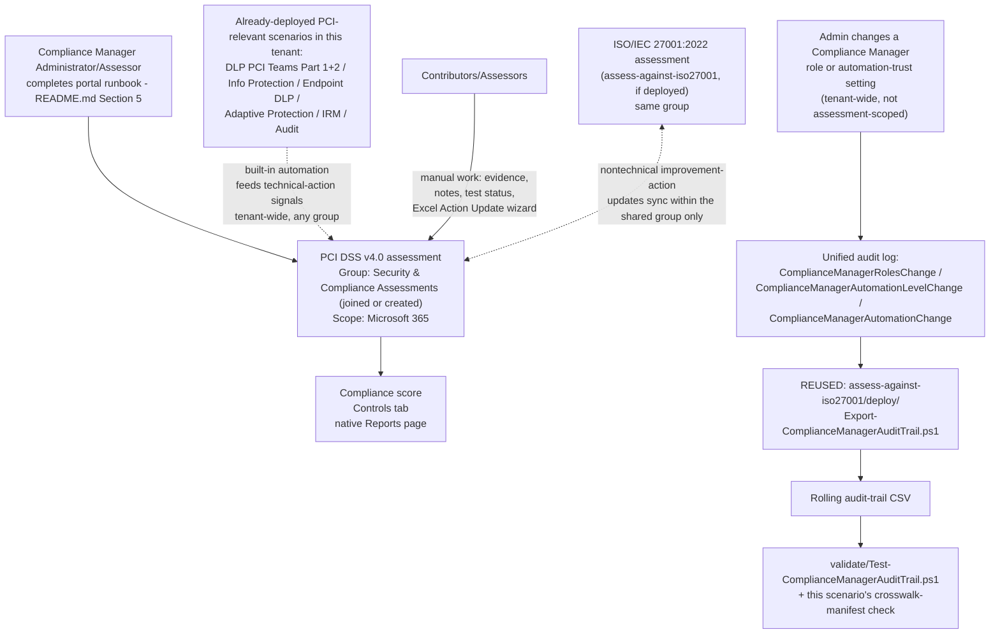

## 1. Problem statement

An organization that stores, processes, or transmits cardholder data must be able to answer "are
you PCI DSS compliant?" with evidence, not a narrative claim, for an acquiring bank, a card
network, a customer security questionnaire, or its own internal risk committee. This library
already ships technical controls squarely aimed at PCI DSS's cardholder-data-protection
requirements (`scenarios/dlp/pci-teams-exfil-block/` and its Part 2, `scenarios/information-
protection/auto-label-confidential-sharepoint/`, `scenarios/dlp/endpoint-dlp-usb-block/`). This
scenario stands up the Microsoft Purview Compliance Manager **PCI DSS v4.0 premium template** to
give those controls, and the rest of the Microsoft 365 estate, a scored, audit-ready view against
PCI DSS's 12 requirements, and correctly scopes what that view is (and is not) worth toward actual
PCI DSS validation.

## 2. Why this scenario looks different from most other scenarios in this repo

Identical starting constraint to `scenarios/compliance-manager/assess-against-iso27001/` (see that
scenario's `design.md` §2 for the full grounding): Compliance Manager has **no write API**.
Assessment creation, control mapping, and improvement-action status/evidence updates are portal-
and Excel-wizard-driven only, confirmed again during this build against the current
`compliance-manager-assessments`, `compliance-manager-improvement-actions`, and
`compliance-manager-setup` articles. `docs/automation-surface.md` §4 still has no routing-table row
for Compliance Manager. Fabricating a `New-ComplianceManagerAssessment`-style cmdlet or a payload
shape for the Excel "Action Update" bulk-import file would violate `AGENTS.md` §4 for the same
reason it would have for the ISO 27001 scenario.

**A second, scenario-specific reason this folder does not ship a second copy of the audit-trail
script**: the three Compliance-Manager-specific audit operations Microsoft documents
(`ComplianceManagerRolesChange`, `ComplianceManagerAutomationLevelChange`,
`ComplianceManagerAutomationChange`, §4 below) are **tenant-wide** events, not scoped to a single
assessment. `scenarios/compliance-manager/assess-against-iso27001/deploy/
Export-ComplianceManagerAuditTrail.ps1` already queries and reports on all of them, for every
Compliance Manager assessment in the tenant, with no assessment-name parameter to narrow it. A
second, byte-for-byte-identical script in this folder would be pure duplication with zero
functional difference, the kind of copy `AGENTS.md`'s "don't duplicate... three similar lines is
better than a premature abstraction" principle argues against, except here it would be a
~150-line file, not three lines. This scenario's `README.md` §5 documents reusing that existing
script directly (and copying it verbatim into this folder only if `assess-against-iso27001` is not
also purchased/deployed) rather than maintaining two copies of security-relevant audit code that
could silently drift apart. See the Microsoft Product Owner lens in `reviews.md` for why this is a
deliberate design decision, not a shortfall against `AGENTS.md` §9's "working, idempotent,
parameterized code" checklist item, the working code exists and is reused, not absent.

**What this scenario ships that is genuinely new**, to still meet `AGENTS.md` §9's definition of
done in full:

1. A precise, repeatable **portal runbook** (`README.md` §5) backed by a structured, versioned,
   explicitly-non-executable reference manifest at `deploy/policy/pci-dss-assessment-manifest.json`
, same pattern as the ISO 27001 scenario, extended with a **PCI DSS v4.0 control crosswalk**
   this library's own scenarios map against (manifest's `controlCrosswalk`, §7 below) and an
   explicit group-placement decision grounded in Microsoft's documented (and more nuanced than it
   first appears, §6 below) improvement-action-sharing behavior.
2. A validate script (`validate/Test-ComplianceManagerAuditTrail.ps1`, reused and extended with a
   `-CrosswalkManifestPath` check) that adds PCI-DSS-specific structural validation of this
   scenario's own manifest on top of the audit-trail file-integrity checks it already performs for
   the ISO 27001 scenario.

## 3. Design goals

1. Stand up a **dedicated PCI DSS v4.0 assessment**, not the tenant's default Data Protection
   Baseline (§5 below, identical reasoning to the ISO 27001 scenario), and explicitly **not** the
   deprecated PCI DSS v3.2.1 template that Compliance Manager's regulation catalog also lists
   (§11), with a deliberate group-placement decision and a minimal, correct services scope.
2. Make explicit which of this library's already-built scenarios contribute to which PCI DSS
   requirement goal, using this library's own crosswalk (§7) rather than fabricating Microsoft's
   internal mapping.
3. State plainly, up front, what this assessment is **not**: a PCI DSS Self-Assessment
   Questionnaire (SAQ) or a QSA-conducted Report on Compliance (RoC). This is the single most
   important scoping statement in this scenario, see `README.md` §2/§11 and the CISO lens in
   `reviews.md`.
4. Avoid duplicating the tenant-wide audit-trail script this scenario shares with
   `assess-against-iso27001`, reuse it explicitly rather than re-shipping it (§2 above).
5. Never fabricate what isn't documented, same standard as every other scenario in this library.

## 4. What Compliance Manager's audit log actually documents (identical grounding to the ISO 27001 scenario)

Re-confirmed during this build against the current `audit-log-activities` reference: exactly three
Compliance-Manager-specific operations exist in the unified audit log, and none of them are
scoped to a single assessment:

| Friendly name | Operation | What it means |
|---|---|---|
| Roles change | `ComplianceManagerRolesChange` | An admin changed a user's Compliance Manager role, tenant-wide or scoped to a specific assessment/regulation. |
| Tenant automation level change | `ComplianceManagerAutomationLevelChange` | An admin changed the org-wide automated-testing trust level across **all** improvement actions, in **every** assessment. |
| Testing source automation change | `ComplianceManagerAutomationChange` | An admin changed the automated-testing source setting for a specific improvement action, which may be shared across multiple assessments (§6). |

Because none of these three operations carry an assessment-scoping field a filter could target,
one running instance of the export script covers this PCI DSS assessment, the ISO 27001 assessment,
and any other Compliance Manager assessment the tenant creates, see §2 above for why this scenario
reuses rather than duplicates it.

## 5. Why a dedicated assessment instead of extending the Data Protection Baseline

Identical reasoning to `scenarios/compliance-manager/assess-against-iso27001/design.md` §5: the
tenant's default Data Protection Baseline assessment blends NIST CSF/ISO/FedRAMP/GDPR elements and
is not itself a citable, audit-mappable PCI DSS v4.0 control set. A dedicated, named PCI DSS v4.0
assessment is Microsoft's own documented intended use of the premium template, not a deviation from
it.

## 6. Group placement, what it actually buys you (and what it doesn't)

Microsoft's `compliance-manager-assessments` reference ("Groups for assessments") documents a
distinction this scenario's design leans on directly, and which is easy to get wrong:

> "Any updates in details or status that you make to a **technical** improvement action will be
> picked up by assessments **across all groups**. **Nontechnical** improvement action updates will
> be recognized by assessments **within the group** where you apply them."

This means:

- **Technical** improvement actions (e.g., a DLP policy is turned on, a sensitivity label is
  auto-applied, MFA is enforced) already sync to **every** assessment in the tenant, regardless of
  which group either assessment belongs to. Placing this PCI DSS assessment in the same group as
  `assess-against-iso27001` buys **nothing** for these, they were already shared.
- **Nontechnical** improvement actions (documentation and operational actions, e.g., "a written
  information security policy exists," "a personnel background-check policy is documented," "an
  incident response plan is maintained") sync **only within a shared group**. PCI DSS Requirement
  12 and ISO/IEC 27001:2022's Annex A both require overlapping documentation of this kind (security
  policy, risk assessment, incident response, personnel security). Placing both assessments in the
  same group (`deploy/policy/pci-dss-assessment-manifest.json`'s `group.strategy:
  joinExistingIfPresent`) is what lets completing that documentation work **once** credit both
  assessments, the genuine, narrower benefit group placement provides, correctly scoped rather
  than oversold.

A second grounded rule from the same reference governs whether this is even possible: a group can
contain multiple assessments for the same **product** (Microsoft 365) only if each is for a
**different regulation**. PCI DSS v4.0 + ISO/IEC 27001:2022 in one group is explicitly the
supported case (different regulations), not an edge case Microsoft's documentation leaves
ambiguous. Microsoft also documents that **groups can't be deleted** once created, regardless of
how many assessments remain in them, see `rollback.md` for what this means for decommissioning.

## 7. The control crosswalk, design intent, not Microsoft's own mapping

`deploy/policy/pci-dss-assessment-manifest.json`'s `controlCrosswalk` maps PCI DSS v4.0's 6 control
goals (Build and Maintain a Secure Network and Systems; Protect Account Data; Maintain a
Vulnerability Management Program; Implement Strong Access Control Measures; Regularly Monitor and
Test Networks; Maintain an Information Security Policy, structure per the official PCI Security
Standards Council standard, `README.md` §12) against **this library's own scenarios**. This is the
same category of claim `assess-against-iso27001/design.md` §6 makes and bounds identically:
Microsoft's proprietary per-improvement-action-to-control mapping is rendered inside the Compliance
Manager UI per action, not published as a document this scenario can fetch and cite, so this
crosswalk is offered as this library's own correlation (useful for briefing a QSA/ISA on what this
tenant's Microsoft 365 controls already contribute, and for sequencing deployment, `README.md`
§5), not as a reproduction of Microsoft's internal automation logic. Two of the six goals (Build and
Maintain a Secure Network and Systems; Maintain a Vulnerability Management Program) have no
Microsoft 365/Purview-only coverage in this library at all, that's stated plainly in the manifest
rather than stretched to look like coverage that doesn't exist.

## 8. Non-goals

- **Generating the "Action Update" bulk-import Excel file.** Same constraint and same reasoning as
  `assess-against-iso27001/design.md` §7.
- **Reproducing Microsoft's per-control PCI DSS improvement-action mapping.** Out of reach for the
  reason in §7 above.
- **Multicloud (AWS/GCP/Azure via Defender for Cloud) service scoping.** Scoped to Microsoft 365
  only, matching this library's tenant-only scope (`AGENTS.md` §5) and the ISO 27001 scenario's
  identical non-goal.
- **Producing or substituting for a PCI DSS SAQ or QSA Report on Compliance.** This assessment is
  an internal tracking and evidence tool. It does not itself satisfy an acquirer's or card
  network's PCI DSS validation requirement, see `README.md` §2/§11. This is a non-goal in the
  strongest possible sense: presenting it otherwise to a customer would be actively misleading.
- **Re-implementing the audit-trail export as a second, independent script.** Deliberately reused
  from `assess-against-iso27001` instead, see §2 above.

## 9. Key decisions

| Decision | Choice | Rationale |
|---|---|---|
| Assessment creation method | Portal wizard, documented as a runbook, not a script | No write API exists, see §2. |
| Regulation template | PCI DSS v4.0, explicitly not v3.2.1 | v3.2.1 is a retired PCI SSC standard still listed in Compliance Manager's catalog, see `README.md` §11. |
| Audit-trail script | Reused from `assess-against-iso27001/deploy/`, not duplicated | The 3 monitored operations are tenant-wide, not assessment-scoped, see §2/§4. Copy it into this folder verbatim only if that scenario isn't also deployed. |
| Group placement | Join the existing `Security & Compliance Assessments` group if present; create it if not | Buys shared credit specifically for **nontechnical** improvement actions across regulations, see §6. Not a claim of broader technical-control sharing, which already happens tenant-wide regardless of group. |
| Crosswalk format | This library's own scenario-to-PCI-goal correlation, explicitly labeled as such | Microsoft's own per-action mapping isn't published in a fetchable form, see §7. |
| Services scope | Microsoft 365 only | Matches this library's tenant-only, author-only scope (`AGENTS.md` §5). |
| Framing of the assessment's evidentiary weight | Explicitly not a substitute for a PCI DSS SAQ or QSA RoC | Prevents this scenario's tooling from being read as a compliance shortcut it cannot be, see §8, `README.md` §2/§11. |

## 10. Data flow / where each piece runs

