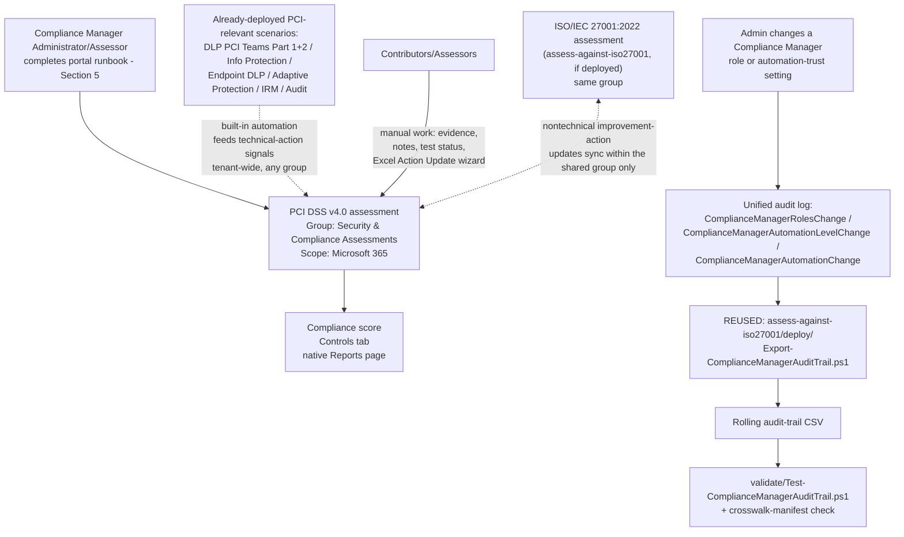

## 1. Scenario summary

Stands up a dedicated **Microsoft Purview Compliance Manager** assessment against the **PCI DSS
v4.0** premium regulatory template, places it correctly relative to this library's other
Compliance Manager assessment, and cross-references it against the PCI-relevant technical controls
this library already ships (DLP PAN-in-Teams blocking, sensitivity labeling, Endpoint DLP, Adaptive
Protection, Insider Risk Management, Audit). Like `scenarios/compliance-manager/
assess-against-iso27001/`, Compliance Manager itself has no write API, so most of this scenario is
a precise, repeatable **portal runbook** — see §5 and `design.md` §2.

**Who it's for:** a security/compliance team responsible for an in-scope PCI cardholder data
environment (CDE) that wants a single, scored, audit-ready internal view of how its Microsoft 365
controls map to PCI DSS v4.0 — and, critically, a team that already understands (or needs this
scenario to make explicit) that this internal view is **not** the same instrument as a PCI DSS
Self-Assessment Questionnaire (SAQ) or a QSA's Report on Compliance (RoC).

## 2. Business/regulatory driver

**PCI DSS v4.0** (the Payment Card Industry Data Security Standard, currently at revision 4.0.1) is
mandatory for any organization that stores, processes, or transmits payment cardholder data —
membership isn't optional the way some other frameworks in this library's regulatory-driver axis
are [[1]](#references). Compliance is demonstrated to an acquiring bank or card network through a
**Self-Assessment Questionnaire (SAQ)** for lower-volume merchants, or a **Qualified Security
Assessor (QSA)**-conducted **Report on Compliance (RoC)** for Level 1 merchants and most service
providers [[2]](#references). Compliance Manager's PCI DSS v4.0 premium template exists to give the
Microsoft 365 portion of that estate a scored, evidenced internal assessment a QSA or internal
auditor can review [[3]](#references) — it does not itself produce an SAQ or RoC, and this scenario
does not present it as though it does (§11).

This scenario's driver is squarely **regulatory/contractual** (the DLP-Teams-PAN control it
cross-references most directly maps to PCI DSS Requirement 4 — protecting cardholder data in
transit — per `scenarios/dlp/pci-teams-exfil-block/README.md` §2), and its value is the same
governance/evidence function `assess-against-iso27001/README.md` §2 describes: making already-built
technical controls **legible against a named standard**, which is what an assessor, an acquirer
questionnaire, or a board audit committee actually asks for.

## 3. Prerequisites

Full licensing detail and citations: `docs/licensing-matrix.md`. Summary for this scenario
(identical role/licensing model to `assess-against-iso27001/README.md` §3 — Compliance Manager's
RBAC and premium-template licensing are tenant-wide, not per-regulation):

| Requirement | Minimum | Notes |
|---|---|---|
| Compliance Manager base access | **Office 365 / Microsoft 365** license (any tier) | Available at all subscription levels; only premium regulatory templates require more [[8]](#references) |
| PCI DSS v4.0 premium template | **A5/E5/G5** (3 free premium templates of choice) **or** the purchased **Compliance Manager premium assessment add-on**, **or** a **90-day premium assessments trial** (25 templates) | Compliance Manager's catalog lists PCI DSS v4.0 **and** the retired PCI DSS v3.2.1 as two separate premium templates — select v4.0 only; see §11 [[9]](#references) |
| Role to create/administer the assessment | **Compliance Manager Administration** (or **Compliance Manager Assessor** to create; **Global Administrator** also works) | `docs/rbac-model.md` §4 for the Purview role-group mapping [[4]](#references) |
| Role to edit/test without creating | **Compliance Manager Contribution** (create + edit) or **Compliance Manager Assessor** (edit only, no create) | Assign the narrowest role per person — see `deploy/policy/pci-dss-assessment-manifest.json` |
| Role for read-only visibility | **Compliance Manager Reader** | Extend to an engaged QSA/ISA if they need portal visibility, not just the exported evidence |
| Automation identity (audit-trail script only) | App registration or account holding the **View-Only Audit Logs** (or **Audit Logs**) Exchange Online role, plus `Exchange.ManageAsApp` | Same requirement as `assess-against-iso27001/README.md` §3 — `docs/rbac-model.md` §6 and `docs/automation-surface.md` §3 |
| Dependency (not deployed by this scenario) | Nothing hard-required, but strongly recommended: `scenarios/dlp/pci-teams-exfil-block/` (+ Part 2), `scenarios/information-protection/auto-label-confidential-sharepoint/`, `scenarios/dlp/endpoint-dlp-usb-block/`, `scenarios/adaptive-protection/dynamic-risk-dlp-enforcement/`, `scenarios/insider-risk/departing-employee-data-theft/`, `scenarios/audit/premium-audit-investigation/` | Reduces the manual-testing backlog and maps directly to PCI DSS goals 2, 4, 5, 6 — see the manifest's `controlCrosswalk` and `design.md` §7 |
| Recommended (not required) | `scenarios/compliance-manager/assess-against-iso27001/` already deployed | Not a hard dependency, but if present, this scenario's group-placement decision (§5, `design.md` §6) gets meaningfully better — join, don't duplicate |

> Verify current entitlement names against `docs/licensing-matrix.md` and the Product Terms before
> a sales commitment — SKU names and the premium-template licensing model change over time.

## 4. Architecture



## 5. Step-by-step implementation

### Portal path — creating the assessment (there is no script path for this part; see §2/`design.md` §2)

1. Before starting, decide the group and role assignments — see
   `deploy/policy/pci-dss-assessment-manifest.json`. **Both decisions are effectively permanent**:
   an assessment's group can't be changed after creation, and groups themselves can't be deleted
   [[5]](#references).
2. **Check whether `scenarios/compliance-manager/assess-against-iso27001/` (or any other
   Compliance Manager assessment using the `Security & Compliance Assessments` group) is already
   deployed in this tenant.** If yes, plan to **add** this assessment to that group in step 5
   below, not create a new one — see `design.md` §6 for exactly what that buys you (nontechnical
   improvement-action sharing, not the broader "everything syncs" read a quick skim might suggest).
3. **(Recommended order, not required)** Deploy this library's PCI-relevant technical scenarios
   first if not already in place — see the manifest's `recommendedDeploymentOrder` and
   `design.md` §7's control crosswalk. Compliance Manager's built-in automation detects signals from
   Data Lifecycle Management, Information Protection, DLP, Communication Compliance, and Insider
   Risk Management [[10]](#references), and those signals sync to this assessment **regardless of
   which group it ends up in** (`design.md` §6) — so deployment order matters, group choice doesn't,
   for this part.
4. Sign in to the [Microsoft Purview portal](https://purview.microsoft.com) → **Compliance
   Manager** → **Assessments** → **Add assessment**.
5. On **Base your assessment on a regulation** → **Select regulation** → search for **PCI DSS** →
   **you will see two results: "PCI DSS v3.2.1" and "PCI DSS v4.0."** Select **PCI DSS v4.0** —
   v3.2.1 is a retired PCI Security Standards Council revision still listed in the catalog (§11)
   — → **Save** → confirm → **Next** [[5]](#references).
6. On **Add name and group**: enter a unique assessment name (this scenario's default:
   `PCI DSS v4.0 - Microsoft 365 Estate`). If step 2 found an existing `Security & Compliance
   Assessments` group, choose it under **Add to existing group**. Otherwise choose **Create new
   group** with that same name (so a future assessment finds it) → **Next**.
7. On **Select services**: select **Microsoft 365** only, per this scenario's scope (`design.md`
   §8 — multicloud scoping via Defender for Cloud is a documented but explicitly out-of-scope
   extension) → **Next**.
8. **Review and finish**: confirm the regulation (PCI DSS v4.0), name, group, and services →
   **Create assessment** → **Done** [[5]](#references).
9. From the new assessment's details page → **Manage user access**: assign
   Contributor/Assessor/Reader roles per the manifest's `roleAssignments` [[4]](#references).
10. **Do not** rely on the tenant's default **Data Protection Baseline** assessment as a substitute
    for steps 4–8 — see `design.md` §5 (identical reasoning to
    `assess-against-iso27001/design.md` §5).

### Ongoing portal work — testing and evidencing controls (also has no script path)

11. **Improvement actions** tab: for actions with **Automatic** testing type, confirm they've
    picked up a status from the built-in automation signals described in step 3 before doing any
    manual work on them [[10]](#references).
12. For actions requiring manual work: assign an owner, complete implementation, upload evidence,
    submit for testing — a **Compliance Manager Assessor** validates and sets Pass/Fail
    [[11]](#references).
13. For bulk updates: use **Export actions** → edit the **Action Update** tab per its embedded
    instructions → **Update actions** to re-upload — Microsoft's own documented mechanism, with no
    faster scripted path as of this writing (`design.md` §2, §8 Non-goals) [[12]](#references).
14. **If this assessment shares its group with `assess-against-iso27001`**: when you complete a
    **nontechnical** improvement action common to both regulations (e.g. a documented information
    security policy, a personnel background-check policy), verify the update is reflected in the
    other assessment too — this is the concrete payoff of the group-placement decision from step 6
    (`design.md` §6), and is worth spot-checking once so the team trusts it's actually working.

### Script path — the audit-trail export (reused, not duplicated — see `design.md` §2)

```powershell
# 1. Connect (certificate app-only — see docs/automation-surface.md §3). The connecting identity
#    needs Exchange.ManageAsApp PLUS the View-Only Audit Logs Exchange Online role (docs/rbac-model.md §6).
Connect-ExchangeOnline -AppId $AppId -Certificate $Cert -Organization $TenantDomain

# 2. If scenarios/compliance-manager/assess-against-iso27001/ is ALSO deployed in this tenant, run
#    only ONE instance of Export-ComplianceManagerAuditTrail.ps1 (either copy — they're identical;
#    see design.md Section 2) against a single shared CSV path. The commands below assume this is
#    the only Compliance Manager assessment in the tenant so far.

# 3. Dry run — queries the last 7 days, reports what would be merged, writes nothing
./deploy/Export-ComplianceManagerAuditTrail.ps1 -OutputCsvPath './out/compliance-manager-audit-trail.csv' -WhatIf

# 4. First real run — a one-time backfill covering the full default retention window
./deploy/Export-ComplianceManagerAuditTrail.ps1 `
    -StartDate (Get-Date).AddDays(-180) -EndDate (Get-Date) `
    -OutputCsvPath './out/compliance-manager-audit-trail.csv'

# 5. Recurring run (schedule daily or weekly — overlapping windows are safe, see design.md §4)
./deploy/Export-ComplianceManagerAuditTrail.ps1 -OutputCsvPath './out/compliance-manager-audit-trail.csv'

# 6. Validate the audit trail AND this scenario's own control-crosswalk manifest
./validate/Test-ComplianceManagerAuditTrail.ps1 -AuditTrailCsvPath './out/compliance-manager-audit-trail.csv'
```

## 6. Configuration reference

| Setting | Value this scenario uses | Notes |
|---|---|---|
| Regulation/template | PCI DSS v4.0 | Premium template — do **not** select the separately-listed, retired PCI DSS v3.2.1 (§11) |
| Assessment name | `PCI DSS v4.0 - Microsoft 365 Estate` | Effectively permanent once created |
| Group | `Security & Compliance Assessments` (join if present, else create new) | Buys nontechnical improvement-action sharing with `assess-against-iso27001` — `design.md` §6 |
| Services in scope | Microsoft 365 only | Multicloud is an explicit non-goal — `design.md` §8 |
| Recommended role split | Administration: 1–2 people · Contribution/Assessor: control owners across IT/Security/Legal/Finance · Reader: auditors/QSA/leadership | See `deploy/policy/pci-dss-assessment-manifest.json` |
| Control crosswalk | 6 PCI DSS goals mapped to this library's scenarios | `deploy/policy/pci-dss-assessment-manifest.json`'s `controlCrosswalk` — this library's own correlation, not Microsoft's mapping (`design.md` §7) |
| Audit-trail script | Reused from `assess-against-iso27001/deploy/`, not duplicated | Tenant-wide operations — `design.md` §2/§4 |
| Audit-trail script idempotency | Merge + de-duplicate by `(CreationDate, Operations, UserIds, hash(AuditData))` | Identical model to `assess-against-iso27001` — see that scenario's `design.md` §8 |
| Validate script additions | Crosswalk manifest structural check + stale-scenario-path check | New in this scenario — see `validate/Test-ComplianceManagerAuditTrail.ps1`'s `.DESCRIPTION` |

## 7. Validation / how to prove it works

1. **Automated file-integrity + manifest check** — `./validate/Test-ComplianceManagerAuditTrail.ps1
   -AuditTrailCsvPath './out/compliance-manager-audit-trail.csv'` confirms the audit-trail CSV's
   schema/de-duplication/sort order (identical checks to `assess-against-iso27001`) **and**
   structurally validates this scenario's own `controlCrosswalk` manifest (all 6 PCI DSS goals
   present, every referenced `scenarios/...` path actually exists in this repo); exits non-zero on
   any hard failure.
2. **Manual verification checklist** — the same script prints a checklist (assessment exists,
   correct regulation **and not the v3.2.1 lookalike**, group placement correct, role assignments
   match, group-sharing actually works for a shared nontechnical action, and — critically — that
   this assessment isn't being mis-presented as an SAQ/RoC substitute) because none of these have a
   read API to check programmatically (`design.md` §2).
3. **Functional test (audit-trail script)** — identical procedure to
   `assess-against-iso27001/README.md` §7: change a test user's Compliance Manager role, wait ~60
   minutes for audit-log ingestion, re-run with a `-StartDate` covering that window, expect a new
   row with `Operation = ComplianceManagerRolesChange`.
4. **Group-sharing functional test** — if `assess-against-iso27001` is also deployed: pick one
   nontechnical improvement action common to both assessments, update its implementation status and
   notes in this PCI DSS assessment, then confirm within a few minutes that the same update appears
   in the ISO 27001 assessment. This is the one behavior in this scenario that's easy to configure
   wrong (wrong group choice) without any error message telling you so.
5. **Evidence for a QSA, ISA, or internal auditor** — the assessment's own **Export actions** report
   (§5, step 13) is the primary evidence artifact; this scenario's audit-trail CSV is a secondary,
   complementary artifact. **Neither one is a PCI DSS SAQ or RoC** — see §11.

## 8. Operations & tuning

**Review cadence:** run the audit-trail export on a **recurring schedule** — daily is cheap and
safe, weekly is the practical minimum given Audit (Standard)'s 180-day retention (§11). Review the
**Controls** tab and compliance-score trend at least **monthly**. Review role-assignment and
automation-trust events **immediately** on the audit-trail script's own warning, not on the monthly
cadence — identical operational posture to `assess-against-iso27001/README.md` §8. PCI DSS's own
Requirement 12 domain (Maintain an Information Security Policy) explicitly expects a formally
managed, ongoing compliance program — **VERIFY** the exact review-frequency obligation your
organization's merchant/service-provider level and QSA/ISA require against the current PCI DSS v4.0
standard [[2]](#references); this scenario deliberately does not hard-code an assumed cadence
(e.g. "quarterly") into its tooling, since that obligation depends on facts (merchant level,
service-provider status) outside this scenario's scope to assume.

**KPIs to watch:** identical four KPIs to `assess-against-iso27001/README.md` §8 (compliance score
trend, automated-vs-manual improvement-action ratio, `ComplianceManagerRolesChange` volume,
any automation-trust-change event at all — near-zero tolerance), plus one new one specific to this
scenario:

- **Group-sharing drift** — if a nontechnical improvement action common to both this assessment and
  `assess-against-iso27001` is updated in one but the update doesn't appear in the other within a
  reasonable time, treat it as a signal the two assessments may no longer share a group (perhaps
  because one was deleted and recreated — `rollback.md`), not as a Compliance Manager bug.

**Incident-response runbook (automation-trust change detected):** identical to
`assess-against-iso27001/README.md` §8 steps 1–5 — triage the `AuditData` JSON, classify
planned/unplanned, document or escalate accordingly.

## 9. Rollback / decommission

See `rollback.md` for the full procedure. Because this scenario may share a group with
`assess-against-iso27001`, its rollback has one extra consideration that scenario's rollback
doesn't: deleting this assessment does not delete or affect the shared group or the other
assessment in it.

## 10. Cost & licensing notes

- **Premium-template licensing, not PAYG** — identical model to `assess-against-iso27001/README.md`
  §10: 1 of the tenant's 3 free A5/E5/G5 premium-template slots, a purchased add-on, or a time-boxed
  trial [[8]](#references)[[9]](#references).
- **Don't pay for two PCI DSS templates.** PCI DSS v4.0 and the retired PCI DSS v3.2.1 are billed as
  **separate** premium-template slots even though they're the same underlying regulation at
  different revisions — accidentally activating both consumes 2 of the tenant's 3 free slots for no
  benefit (§11).
- **No additional cost for the audit-trail script** beyond the Exchange Online role assignment, and
  **zero incremental cost if `assess-against-iso27001` already runs it** — this scenario reuses that
  script rather than running a second copy (`design.md` §2).
- **Sizing note:** identical to `assess-against-iso27001/README.md` §10 — the premium-template
  allotment is per-regulation, not per-assessment.

## 11. Known limitations & gotchas

- **This assessment is not a PCI DSS SAQ or QSA Report on Compliance, and does not substitute for
  either.** This is the single most important limitation in this scenario. A Compliance Manager
  score, however complete, is an internal tracking and evidence tool — it is not the instrument
  submitted to an acquirer or card network to demonstrate PCI DSS validation
  [[1]](#references)[[7]](#references). Do not let a customer conversation, an internal deck, or
  this scenario's own tooling output imply otherwise.
- **Compliance Manager's regulation catalog lists two separate PCI DSS templates** — "PCI DSS
  v3.2.1" and "PCI DSS v4.0" — both under the same `offering-pci-dss` Microsoft Learn reference
  page. PCI DSS v3.2.1 was retired by the PCI Security Standards Council; PCI DSS v4.0 (revision
  4.0.1) is the current mandatory standard Microsoft's own Azure/OneDrive/SharePoint PCI attestation
  is issued against [[6]](#references). Select v4.0 — see §5 step 5 and §10 for the cost
  consequence of getting this wrong.
- **This scenario cannot script assessment creation, control mapping, or improvement-action
  updates** — identical constraint and reasoning to `assess-against-iso27001/README.md` §11
  (`design.md` §2).
- **The audit-trail script here is the same file as `assess-against-iso27001`'s, not an
  independent implementation** — deliberate, not an oversight; see `design.md` §2. It inherits that
  script's own limitations verbatim: it does not track compliance score or improvement-action
  status changes (only the 3 documented role/automation-trust operations), and it cannot see
  Compliance Manager access granted implicitly via the Global Administrator, Compliance
  Administrator, Compliance Data Administrator, or Security Administrator Entra ID roles — see
  `assess-against-iso27001/README.md` §11 for the full statement of both limitations, which apply
  here without modification.
- **The `controlCrosswalk` in `deploy/policy/pci-dss-assessment-manifest.json` is this library's own
  scenario-to-PCI-goal correlation, not Microsoft's published improvement-action mapping** — see
  `design.md` §7. Two of PCI DSS's six control goals (Build and Maintain a Secure Network and
  Systems; Maintain a Vulnerability Management Program) have no coverage from this Microsoft
  365/Purview-only library at all — stated plainly in the manifest rather than glossed over.
- **The exact PCI DSS Requirement 12.4 formal-review-cadence obligation is not hard-coded into this
  scenario's tooling** — deliberately left to the operator's own PCI scope determination rather than
  assumed (§8). **VERIFY** against the current PCI DSS v4.0 standard and your organization's
  merchant/service-provider level before committing to a specific review interval in a customer
  conversation.
- **Audit (Standard) default retention is 180 days** (1 year for Entra ID/Exchange/OneDrive/
  SharePoint under an E5-tier license; up to 10 years with Audit Premium retention policies)
  [[13]](#references) — identical caveat to `assess-against-iso27001/README.md` §11.
- **The "Action Update" Excel bulk-import file's exact column schema is not scripted here** — same
  tracked follow-up as `assess-against-iso27001` (`PROGRESS.md`).
- **A high compliance score is not proof of compliance.** Microsoft's own FAQ states this
  explicitly [[14]](#references) — this repeats `assess-against-iso27001/README.md` §11's identical
  caution because it is at least as important here, given PCI DSS's contractual (not just
  regulatory) stakes.

## 12. References

1. Payment Card Industry (PCI) Data Security Standard (DSS) — Office 365/Microsoft 365 applicability, in-scope services, customer responsibility for their own PCI DSS compliance — <https://learn.microsoft.com/compliance/regulatory/offering-pci-dss>
2. PCI Security Standards Council — official PCI DSS v4.0.1 standard and Quick Reference Guide (SAQ/RoC/QSA terminology, the 6 control goals/12 requirements structure) — <https://docs-prv.pcisecuritystandards.org/PCI%20DSS/Standard/PCI-DSS-v4_0_1.pdf> and <https://docs-prv.pcisecuritystandards.org/PCI%20DSS/Supporting%20Document/PCI-DSS-v4_x-QRG.pdf>
3. (see reference 1) "Use Microsoft Purview Compliance Manager to assess your risk" section
4. Get started with Compliance Manager (role types table incl. Entra role mapping) — <https://learn.microsoft.com/purview/compliance-manager-setup>
5. Build and manage assessments in Compliance Manager (create-assessment wizard, Groups for assessments — technical-vs-nontechnical improvement-action sync scope, one-assessment-per-product-per-regulation-per-group rule, groups can't be deleted, Data Protection Baseline default, Export an assessment report, Delete an assessment) — <https://learn.microsoft.com/purview/compliance-manager-assessments>
6. Payment Card Industry (PCI) Data Security Standard (DSS) — Microsoft and PCI DSS (Azure/OneDrive/SharePoint/Azure Communication Service certified under PCI DSS v4.0.1) — <https://learn.microsoft.com/compliance/regulatory/offering-pci-dss#microsoft-and-pci-dss>
7. (see reference 1) "It's important to understand that PCI DSS compliance status... doesn't automatically translate to PCI DSS certification for the services that customers build or host on these platforms" (Frequently asked questions)
8. Microsoft Purview service description — Compliance Manager — <https://learn.microsoft.com/office365/servicedescriptions/microsoft-365-service-descriptions/microsoft-365-tenantlevel-services-licensing-guidance/microsoft-purview-service-description#microsoft-purview-compliance-manager>
9. Compliance Manager regulations list (premium regulations, including both "PCI DSS v3.2.1" and "PCI DSS v4.0" as separate catalog entries; December 2022 licensing change; 3-free-templates allotment) — <https://learn.microsoft.com/purview/compliance-manager-regulations-list>
10. Working with improvement actions in Compliance Manager (built-in automation from DLM/Information Protection/DLP/Communication Compliance/IRM; automated testing/monitoring) — <https://learn.microsoft.com/purview/compliance-manager-improvement-actions>
11. (see reference 10) "Assign improvement action to assessor for completion"
12. Update improvement actions and bring compliance data into Compliance Manager (Export actions / Action Update tab / Update actions wizard) — <https://learn.microsoft.com/purview/compliance-manager-update-actions>
13. Manage audit log retention policies (180-day Standard default, 1-year E5 default for Entra/Exchange/OneDrive/SharePoint, up to 10 years with Audit Premium retention policies) — <https://learn.microsoft.com/purview/audit-log-retention-policies>
14. Compliance Manager frequently asked questions (a high score is not proof of compliance) — <https://learn.microsoft.com/purview/compliance-manager-faq>
15. Audit log activities — Compliance Manager activities table (the 3 documented operations) — <https://learn.microsoft.com/purview/audit-log-activities#compliance-manager-activities>
16. Search-UnifiedAuditLog reference — <https://learn.microsoft.com/powershell/module/exchangepowershell/search-unifiedauditlog>
17. `scenarios/dlp/pci-teams-exfil-block/README.md` — this library's primary PCI DSS Requirement 4 technical control, cross-referenced throughout this scenario.

> Re-verify all links, the two-PCI-DSS-templates catalog detail, and the premium-template licensing
> model against current Microsoft Learn before a customer-facing assessment or sale — Compliance
> Manager's regulation catalog and licensing rules have changed materially before and can change
> again.
