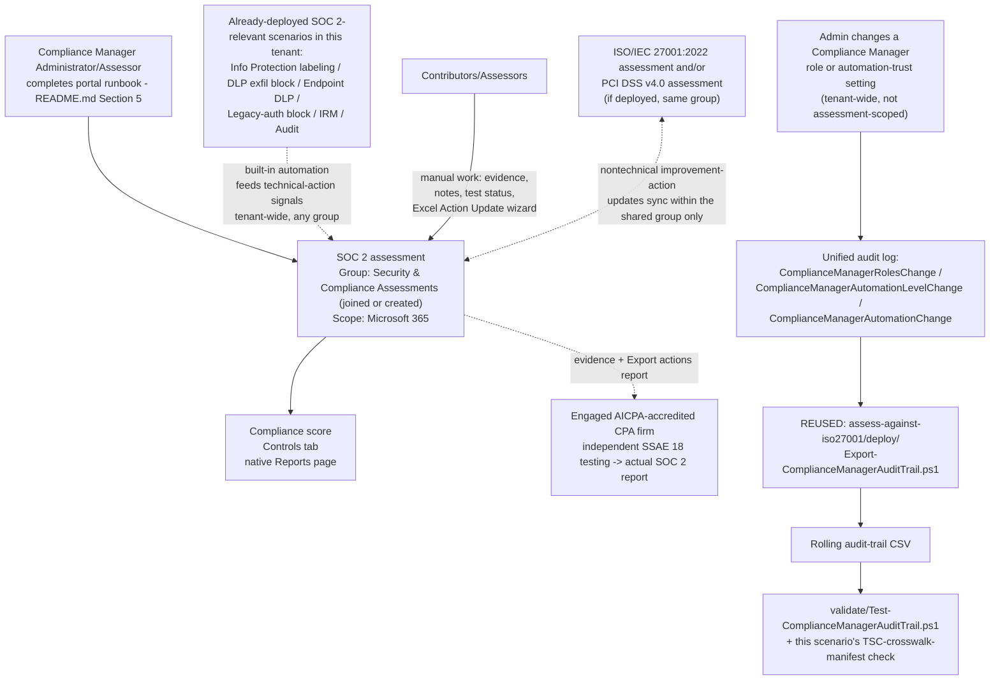

## 1. Problem statement

A Microsoft 365-based SaaS provider, ISV, or MSP regularly has to answer "can you show us your SOC
2 report?" from enterprise customers during procurement or vendor-security review. This library
already ships technical controls squarely aimed at the kind of security, confidentiality, and
privacy controls a SOC 2 report evaluates (`scenarios/information-protection/*`, `scenarios/dlp/*`,
`scenarios/adaptive-protection/*`, `scenarios/insider-risk/*`, `scenarios/audit/*`). This scenario
stands up the Microsoft Purview Compliance Manager **SOC 2 premium template** to give those controls
, and the rest of the Microsoft 365 estate, a scored, evidence-ready internal readiness view against
the AICPA 2017 Trust Services Criteria (TSC), and correctly scopes what that view is (and is not)
worth toward an actual SOC 2 report.

## 2. Why this scenario looks identical in shape to its two Compliance Manager siblings

Identical starting constraint to `scenarios/compliance-manager/assess-against-iso27001/` and
`scenarios/compliance-manager/pci-dss-assessment/` (see either scenario's `design.md` §2 for the
full grounding): Compliance Manager has **no write API**. Assessment creation, control mapping, and
improvement-action status/evidence updates are portal- and Excel-wizard-driven only, re-confirmed
during this build against the current `compliance-manager-assessments`, `compliance-manager-
improvement-actions`, and `compliance-manager-setup` articles. [Automation surface §4](/docs/automation-surface/#4-routing-table-which-surface-for-which-purview-task) still
has no routing-table row for Compliance Manager. Fabricating a `New-ComplianceManagerAssessment`-
style cmdlet or a payload shape for the Excel "Action Update" bulk-import file would violate
`AGENTS.md` §4 for the same reason it would have for either sibling scenario.

**The same reason this folder does not ship a third, independent copy of the audit-trail script's
logic** (it ships a copy of the file, not a reimplementation): the three Compliance-Manager-specific
audit operations Microsoft documents (`ComplianceManagerRolesChange`,
`ComplianceManagerAutomationLevelChange`, `ComplianceManagerAutomationChange`, §4 below) are
**tenant-wide** events, not scoped to a single assessment. `scenarios/compliance-manager/
assess-against-iso27001/deploy/Export-ComplianceManagerAuditTrail.ps1` (already duplicated once,
verbatim, into `pci-dss-assessment/deploy/`) already queries and reports on all of them, for every
Compliance Manager assessment in the tenant, with no assessment-name parameter to narrow it. A third
byte-for-byte-identical script in this folder would be pure duplication with zero functional
difference, the kind of copy `AGENTS.md`'s "don't duplicate... three similar lines is better than a
premature abstraction" principle argues against, except here it would be a ~150-line file, not three
lines. This scenario's `README.md` §5 documents reusing whichever copy is already deployed (and
copying it verbatim into this folder only if neither sibling is also purchased/deployed) rather than
maintaining three copies of security-relevant audit code that could silently drift apart.

**What this scenario ships that is genuinely new**, to still meet `AGENTS.md` §9's definition of
done in full:

1. A precise, repeatable **portal runbook** (`README.md` §5) backed by a structured, versioned,
 explicitly-non-executable reference manifest at `deploy/policy/soc2-assessment-manifest.json`, 
 same pattern as the ISO 27001 and PCI DSS scenarios, extended with a **SOC 2 Trust Services
 Criteria (TSC) crosswalk** this library's own scenarios map against (manifest's
 `controlCrosswalk`, §7 below) and an explicit group-placement decision that now accounts for a
 **three-way** group membership (ISO 27001 + PCI DSS + SOC 2), not just two.
2. A validate script (`validate/Test-ComplianceManagerAuditTrail.ps1`, reused and extended with a
 `-CrosswalkManifestPath` check) that adds SOC-2-specific structural validation of this scenario's
 own manifest on top of the audit-trail file-integrity checks it already performs for the ISO
 27001 and PCI DSS scenarios. Its manifest-shape check is structurally different from PCI DSS's
 (5 named TSC categories, one flagged `mandatory`, rather than 6 numbered goals) because SOC 2's
 own published structure is categorical, not numbered, reusing PCI DSS's exact goal-numbering
 check would have silently mismatched SOC 2's real shape.
3. An explicit **Type I vs. Type II** framing (`README.md` §2/§8) not present in either sibling
 scenario, because it materially changes this scenario's operational guidance: a Type II report's
 6-12 month period of performance requires a longer sustained evidence-collection window than
 PCI DSS's or ISO 27001's assessments call for by default.

## 3. Design goals

1. Stand up a **dedicated SOC 2 assessment**, not the tenant's default Data Protection Baseline
 (§5 below, identical reasoning to the ISO 27001 and PCI DSS scenarios), and explicitly **not**
 the "System and Organization Controls (SOC) 1" template that Compliance Manager's regulation
 catalog also lists alongside it (§11), with a deliberate group-placement decision and a minimal,
 correct services scope.
2. Make explicit which of this library's already-built scenarios contribute to which SOC 2 Trust
 Services Criteria category, using this library's own crosswalk (§7) rather than fabricating
 Microsoft's internal mapping.
3. State plainly, up front, what this assessment is **not**: a SOC 2 report (Type I or Type II).
 This is the single most important scoping statement in this scenario, see `README.md` §2/§11
 and the CISO lens in `reviews.md`.
4. Avoid duplicating the tenant-wide audit-trail script this scenario shares with its two siblings, 
 reuse it explicitly rather than re-shipping it (§2 above).
5. Never fabricate what isn't documented, same standard as every other scenario in this library,
 including where the Compliance Manager wizard does **not** expose a documented TSC-category
 selection step (§11's VERIFY item).

## 4. What Compliance Manager's audit log actually documents (identical grounding to both sibling scenarios)

Re-confirmed during this build against the current `audit-log-activities` reference: exactly three
Compliance-Manager-specific operations exist in the unified audit log, and none of them are
scoped to a single assessment:

| Friendly name | Operation | What it means |
|---|---|---|
| Roles change | `ComplianceManagerRolesChange` | An admin changed a user's Compliance Manager role, tenant-wide or scoped to a specific assessment/regulation. |
| Tenant automation level change | `ComplianceManagerAutomationLevelChange` | An admin changed the org-wide automated-testing trust level across **all** improvement actions, in **every** assessment. |
| Testing source automation change | `ComplianceManagerAutomationChange` | An admin changed the automated-testing source setting for a specific improvement action, which may be shared across multiple assessments (§6). |

Because none of these three operations carry an assessment-scoping field a filter could target, one
running instance of the export script covers this SOC 2 assessment, the ISO 27001 assessment, the
PCI DSS assessment, and any other Compliance Manager assessment the tenant creates, see §2 above
for why this scenario reuses rather than duplicates it.

## 5. Why a dedicated assessment instead of extending the Data Protection Baseline

Identical reasoning to `scenarios/compliance-manager/assess-against-iso27001/design.md` §5 and
`scenarios/compliance-manager/pci-dss-assessment/design.md` §5: the tenant's default Data Protection
Baseline assessment blends NIST CSF/ISO/FedRAMP/GDPR elements and is not itself a citable, audit-
mappable SOC 2 Trust Services Criteria control set. A dedicated, named SOC 2 assessment is
Microsoft's own documented intended use of the premium template, not a deviation from it.

## 6. Group placement, what it actually buys you, now across three assessments

Microsoft's `compliance-manager-assessments` reference ("Groups for assessments") documents a
distinction this scenario's design leans on directly, and which is easy to get wrong, the same
quote `assess-against-iso27001/design.md` §6 and `pci-dss-assessment/design.md` §6 already cite:

> "Any updates in details or status that you make to a **technical** improvement action will be
> picked up by assessments **across all groups**. **Nontechnical** improvement action updates will
> be recognized by assessments **within the group** where you apply them."

This means, unchanged from the two-assessment case the sibling scenarios document:

- **Technical** improvement actions (e.g., a DLP policy is turned on, a sensitivity label is
 auto-applied, MFA is enforced) already sync to **every** assessment in the tenant, regardless of
 which group any of them belongs to. Placing this SOC 2 assessment in the same group as the ISO
 27001 and/or PCI DSS assessments buys **nothing** for these, they were already shared.
- **Nontechnical** improvement actions (documentation and operational actions, e.g., "a written
 information security policy exists," "a personnel background-check policy is documented," "an
 incident response plan is maintained") sync **only within a shared group**. SOC 2's Security
 Common Criteria, PCI DSS Requirement 12, and ISO/IEC 27001:2022's Annex A all require overlapping
 documentation of this kind. Placing all three assessments in the same group
 (`deploy/policy/soc2-assessment-manifest.json`'s `group.strategy: joinExistingIfPresent`) is what
 lets completing that documentation work **once** credit all three, the genuine, narrower benefit
 group placement provides, correctly scoped rather than oversold.

The grounded rule governing whether a **third** assessment can join the same group as the other two
still holds exactly as documented: a group can contain multiple assessments for the same **product**
(Microsoft 365) only if each is for a **different regulation**. ISO/IEC 27001:2022 + PCI DSS v4.0 +
SOC 2 in one group is three distinct regulations against the same product, the same explicitly
supported case the two-assessment scenarios already establish, not a new edge case introduced by
adding a third. Microsoft also documents that **groups can't be deleted** once created, regardless
of how many assessments remain in them, see `rollback.md` for what this means for decommissioning.

## 7. The control crosswalk, design intent, not Microsoft's own mapping

`deploy/policy/soc2-assessment-manifest.json`'s `controlCrosswalk` maps the AICPA 2017 Trust
Services Criteria's 5 categories (Security, Availability, Processing Integrity, Confidentiality,
Privacy, structure per the official AICPA guide, `README.md` §12) against **this library's own
scenarios**. This is the same category of claim `assess-against-iso27001/design.md` §6 and
`pci-dss-assessment/design.md` §7 make and bound identically: Microsoft's proprietary per-
improvement-action-to-control mapping is rendered inside the Compliance Manager UI per action, not
published as a document this scenario can fetch and cite, so this crosswalk is offered as this
library's own correlation (useful for briefing an engaged CPA firm on what this tenant's Microsoft
365 controls already contribute, and for sequencing deployment, `README.md` §5), not as a
reproduction of Microsoft's internal automation logic. Two of the five categories (Availability,
Processing Integrity) have no Microsoft 365/Purview-only coverage in this library at all, that's
stated plainly in the manifest rather than stretched to look like coverage that doesn't exist. The
**Security** category is marked `mandatory: true` in the manifest because, unlike the other four
categories (which an organization selects based on its own service commitments to its customers),
Security's Common Criteria are present in every SOC 2 report regardless of scope, a fact this
crosswalk states explicitly rather than treating all five categories as equally optional.

## 8. Non-goals

- **Generating the "Action Update" bulk-import Excel file.** Same constraint and same reasoning as
 `assess-against-iso27001/design.md` §7 and `pci-dss-assessment/design.md` §8.
- **Reproducing Microsoft's per-control SOC 2 improvement-action mapping.** Out of reach for the
 reason in §7 above.
- **Multicloud (AWS/GCP/Azure via Defender for Cloud) service scoping.** Scoped to Microsoft 365
 only, matching this library's tenant-only scope (`AGENTS.md` §5) and both sibling scenarios'
 identical non-goal.
- **Producing or substituting for an actual SOC 2 report (Type I or Type II).** This assessment is
 an internal readiness-tracking and evidence tool. It does not itself satisfy a customer's or
 auditor's requirement for an independent CPA firm's attestation, see `README.md` §2/§11. This is
 a non-goal in the strongest possible sense: presenting it otherwise to a customer would be
 actively misleading.
- **Re-implementing the audit-trail export as a third, independent script.** Deliberately reused
 from `assess-against-iso27001`/`pci-dss-assessment` instead, see §2 above.
- **Scripting Trust Services Criteria category selection within the assessment.** No documented
 wizard step or API for this was found during this build (§11's VERIFY item), not fabricated.

## 9. Key decisions

| Decision | Choice | Rationale |
|---|---|---|
| Assessment creation method | Portal wizard, documented as a runbook, not a script | No write API exists, see §2. |
| Regulation template | System and Organization Controls (SOC) 2, explicitly not SOC 1 | SOC 1 addresses a different Trust Services scope (financial-reporting internal controls), see `README.md` §11. |
| Audit-trail script | Reused from `assess-against-iso27001`/`pci-dss-assessment`'s `deploy/`, not duplicated | The 3 monitored operations are tenant-wide, not assessment-scoped, see §2/§4. Copy it into this folder verbatim only if neither sibling is also deployed. |
| Group placement | Join the existing `Security & Compliance Assessments` group if present; create it if not | Buys shared credit specifically for **nontechnical** improvement actions across regulations, see §6. Not a claim of broader technical-control sharing, which already happens tenant-wide regardless of group. |
| Crosswalk format | This library's own scenario-to-TSC-category correlation, explicitly labeled as such, with Security marked mandatory | Microsoft's own per-action mapping isn't published in a fetchable form, see §7. |
| Services scope | Microsoft 365 only | Matches this library's tenant-only, author-only scope (`AGENTS.md` §5). |
| Framing of the assessment's evidentiary weight | Explicitly not a substitute for an actual SOC 2 report | Prevents this scenario's tooling from being read as a compliance shortcut it cannot be, see §8, `README.md` §2/§11. |
| Type I/Type II treatment | Not a separate template selection; addressed as operational guidance instead (longer evidence-collection window for Type II) | No documented distinct Compliance Manager template exists for Type I vs. Type II, see `README.md` §11. |

## 10. Data flow / where each piece runs

