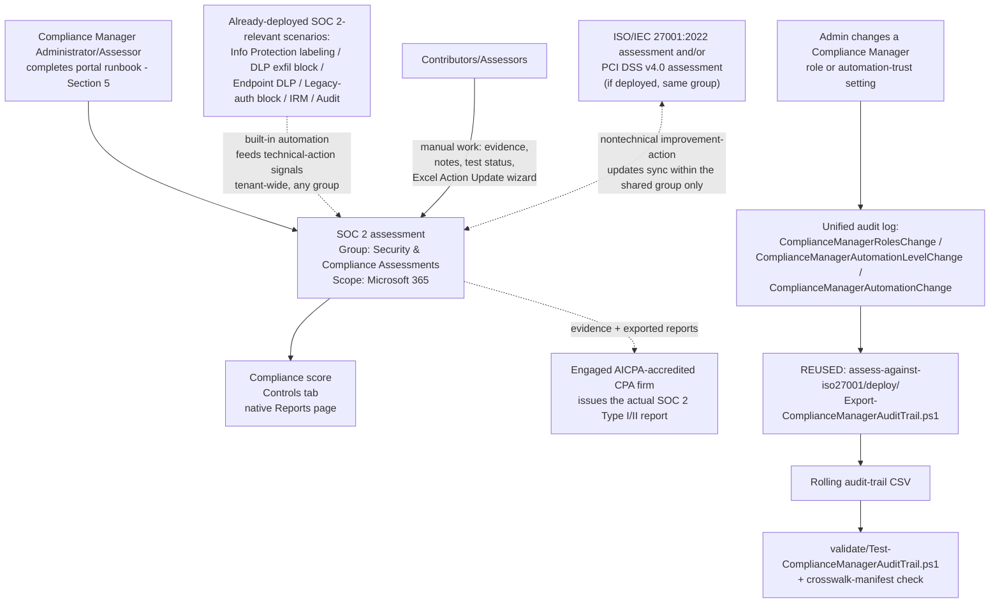

## 1. Scenario summary

Stands up a dedicated **Microsoft Purview Compliance Manager** assessment against the **System and
Organization Controls (SOC) 2** premium regulatory template, places it correctly relative to this
library's other Compliance Manager assessments, and cross-references it against the SOC 2-relevant
technical controls this library already ships (Information Protection labeling, DLP exfiltration
blocking, Adaptive Protection access control, Insider Risk Management, Audit). Like
`scenarios/compliance-manager/assess-against-iso27001/` and `scenarios/compliance-manager/
pci-dss-assessment/`, Compliance Manager itself has no write API, so most of this scenario is a
precise, repeatable **portal runbook** — see §5 and `design.md` §2.

**Who it's for:** a Microsoft 365-based SaaS provider, ISV, or MSP (or an enterprise IT/security
team supporting one) that needs to demonstrate to **its own customers** — usually through a vendor
security-review or procurement questionnaire — that its service is built on well-governed
technical and organizational controls. Critically, this is also for a team that already understands
(or needs this scenario to make explicit) that a Compliance Manager assessment is **not** itself a
SOC 2 report: only an independent, AICPA-accredited CPA firm performing an actual SSAE 18
attestation engagement can issue one.

## 2. Business/regulatory driver

**SOC 2** (System and Organization Controls 2) is an American Institute of Certified Public
Accountants (AICPA) attestation framework built on the **2017 Trust Services Criteria (TSC)** —
Security, Availability, Processing Integrity, Confidentiality, and Privacy [[1]](#references). Unlike
PCI DSS or HIPAA, SOC 2 is not a legal mandate; it's a **contractual/commercial** driver — enterprise
customers, especially in SaaS procurement, routinely require a current SOC 2 report (Type I or Type
II) as a condition of doing business, and Microsoft's own Office 365 and Azure services carry their
own SOC 2 Type 2 attestations for exactly this reason [[2]](#references). A **Type I** report opines
on whether controls are suitably designed at a single point in time; a **Type II** report — the one
most enterprise buyers actually ask for — opines on whether those controls **operated effectively
over a period of performance**, typically 6–12 months [[3]](#references). That distinction drives
this scenario's operational emphasis (§8): a Type II report needs sustained evidence, not a
point-in-time snapshot.

Compliance Manager's SOC 2 premium template exists to give an organization's Microsoft 365-based
controls a scored, evidenced internal readiness view before and during a CPA firm's audit fieldwork
[[4]](#references) — it does not itself produce a SOC 2 report, and this scenario does not present
it as though it does (§11). This scenario's driver is squarely **commercial/contractual** — closing
enterprise deals that gate on a SOC 2 report — and its value is the same governance/evidence function
`assess-against-iso27001/README.md` §2 and `pci-dss-assessment/README.md` §2 describe: making
already-built technical controls **legible against a named framework**, which is exactly what a
customer's vendor-security questionnaire or an engaged CPA firm's request-for-evidence list actually
asks for.

## 3. Prerequisites

Full licensing detail and citations: `docs/licensing-matrix.md`. Summary for this scenario
(identical role/licensing model to `assess-against-iso27001/README.md` §3 and `pci-dss-assessment/
README.md` §3 — Compliance Manager's RBAC and premium-template licensing are tenant-wide, not
per-regulation):

| Requirement | Minimum | Notes |
|---|---|---|
| Compliance Manager base access | **Office 365 / Microsoft 365** license (any tier) | Available at all subscription levels; only premium regulatory templates require more [[5]](#references) |
| SOC 2 premium template | **A5/E5/G5** (3 free premium templates of choice) **or** the purchased **Compliance Manager premium assessment add-on**, **or** a **90-day premium assessments trial** (25 templates) | Compliance Manager's catalog lists "System and Organization Controls (SOC) 1" and "System and Organization Controls (SOC) 2" as two separate premium templates in its Global category — select **SOC 2**, not SOC 1; see §11 [[6]](#references) |
| Role to create/administer the assessment | **Compliance Manager Administration** (or **Compliance Manager Assessor** to create; **Global Administrator** also works) | `docs/rbac-model.md` §4 for the Purview role-group mapping [[7]](#references) |
| Role to edit/test without creating | **Compliance Manager Contribution** (create + edit) or **Compliance Manager Assessor** (edit only, no create) | Assign the narrowest role per person — see `deploy/policy/soc2-assessment-manifest.json` |
| Role for read-only visibility | **Compliance Manager Reader** | Extend to the engaged CPA firm if they need portal visibility, not just exported evidence |
| Automation identity (audit-trail script only) | App registration or account holding the **View-Only Audit Logs** (or **Audit Logs**) Exchange Online role, plus `Exchange.ManageAsApp` | Same requirement as `assess-against-iso27001/README.md` §3 and `pci-dss-assessment/README.md` §3 — `docs/rbac-model.md` §6 and `docs/automation-surface.md` §3 |
| Dependency (not deployed by this scenario) | Nothing hard-required, but strongly recommended: `scenarios/information-protection/auto-label-confidential-sharepoint/` (+ Exchange sibling), `scenarios/information-protection/auto-label-eu-personal-data-sharepoint/` (+ Exchange sibling), `scenarios/dlp/exchange-pii-exfil-block/` (+ Part 2), `scenarios/dlp/endpoint-dlp-usb-block/`, `scenarios/adaptive-protection/block-legacy-authentication/`, `scenarios/insider-risk/departing-employee-data-theft/`, `scenarios/audit/premium-audit-investigation/` | Reduces the manual-testing backlog and maps directly to the Security, Confidentiality, and Privacy TSC categories — see the manifest's `controlCrosswalk` and `design.md` §7 |
| Recommended (not required) | `scenarios/compliance-manager/assess-against-iso27001/` and/or `scenarios/compliance-manager/pci-dss-assessment/` already deployed | Not a hard dependency, but if present, this scenario's group-placement decision (§5, `design.md` §6) gets meaningfully better — join, don't duplicate |

> Verify current entitlement names against `docs/licensing-matrix.md` and the Product Terms before
> a sales commitment — SKU names and the premium-template licensing model change over time.

## 4. Architecture



## 5. Step-by-step implementation

### Portal path — creating the assessment (there is no script path for this part; see §2/`design.md` §2)

1. Before starting, decide the group and role assignments — see
   `deploy/policy/soc2-assessment-manifest.json`. **Both decisions are effectively permanent**: an
   assessment's group can't be changed after creation, and groups themselves can't be deleted
   [[8]](#references).
2. **Check whether `scenarios/compliance-manager/assess-against-iso27001/` and/or `scenarios/
   compliance-manager/pci-dss-assessment/` (or any other Compliance Manager assessment using the
   `Security & Compliance Assessments` group) are already deployed in this tenant.** If yes, plan to
   **add** this assessment to that group in step 6 below, not create a new one — see `design.md` §6
   for exactly what that buys you (nontechnical improvement-action sharing, not the broader
   "everything syncs" read a quick skim might suggest).
3. **(Recommended order, not required)** Deploy this library's SOC 2-relevant technical scenarios
   first if not already in place — see the manifest's `recommendedDeploymentOrder` and `design.md`
   §7's control crosswalk. Compliance Manager's built-in automation detects signals from Data
   Lifecycle Management, Information Protection, DLP, Communication Compliance, and Insider Risk
   Management [[9]](#references), and those signals sync to this assessment **regardless of which
   group it ends up in** (`design.md` §6) — so deployment order matters, group choice doesn't, for
   this part.
4. Sign in to the [Microsoft Purview portal](https://purview.microsoft.com) → **Compliance
   Manager** → **Assessments** → **Add assessment**.
5. On **Base your assessment on a regulation** → **Select regulation** → search for **SOC** → **you
   will see two results: "System and Organization Controls (SOC) 1" and "System and Organization
   Controls (SOC) 2."** Select **SOC 2** — SOC 1 covers a different Trust Services scope (a service
   organization's effect on a customer's **financial reporting** controls, per SSAE 18) and is the
   wrong template for a general security/confidentiality/privacy readiness assessment (§11) — →
   **Save** → confirm → **Next** [[8]](#references).
6. On **Add name and group**: enter a unique assessment name (this scenario's default: `SOC 2 -
   Microsoft 365 Estate`). If step 2 found an existing `Security & Compliance Assessments` group,
   choose it under **Add to existing group**. Otherwise choose **Create new group** with that same
   name (so a future assessment finds it) → **Next**.
7. On **Select services**: select **Microsoft 365** only, per this scenario's scope (`design.md`
   §8 — multicloud scoping via Defender for Cloud is a documented but explicitly out-of-scope
   extension) → **Next**.
8. **Review and finish**: confirm the regulation (SOC 2), name, group, and services → **Create
   assessment** → **Done** [[8]](#references).
9. From the new assessment's details page → **Manage user access**: assign
   Contributor/Assessor/Reader roles per the manifest's `roleAssignments` [[7]](#references).
10. **Do not** rely on the tenant's default **Data Protection Baseline** assessment as a substitute
    for steps 4–8 — see `design.md` §5 (identical reasoning to `assess-against-iso27001/design.md`
    §5 and `pci-dss-assessment/design.md` §5).

### Ongoing portal work — testing and evidencing controls (also has no script path)

11. **Improvement actions** tab: for actions with **Automatic** testing type, confirm they've
    picked up a status from the built-in automation signals described in step 3 before doing any
    manual work on them [[9]](#references).
12. For actions requiring manual work: assign an owner, complete implementation, upload evidence,
    submit for testing — a **Compliance Manager Assessor** validates and sets Pass/Fail
    [[10]](#references).
13. For bulk updates: use **Export actions** → edit the **Action Update** tab per its embedded
    instructions → **Update actions** to re-upload — Microsoft's own documented mechanism, with no
    faster scripted path as of this writing (`design.md` §2, §8 Non-goals) [[11]](#references).
14. **If this assessment shares its group with `assess-against-iso27001` and/or
    `pci-dss-assessment`**: when you complete a **nontechnical** improvement action common across
    them (e.g. a documented information security policy, a personnel background-check policy, an
    incident response plan), verify the update is reflected in the other assessment(s) too — this
    is the concrete payoff of the group-placement decision from step 6 (`design.md` §6), and is
    worth spot-checking once so the team trusts it's actually working.
15. **When a CPA firm engagement begins**: grant the engaged firm's contacts **Compliance Manager
    Reader** access (or export the relevant reports for them, §7) rather than treating this
    assessment's score as something you hand over in place of direct evidence review — the CPA firm
    still performs its own independent testing regardless of what this assessment shows
    (§2, §11).

### Script path — the audit-trail export (reused, not duplicated — see `design.md` §2)

```powershell
# 1. Connect (certificate app-only — see docs/automation-surface.md §3). The connecting identity
#    needs Exchange.ManageAsApp PLUS the View-Only Audit Logs Exchange Online role (docs/rbac-model.md §6).
Connect-ExchangeOnline -AppId $AppId -Certificate $Cert -Organization $TenantDomain

# 2. If scenarios/compliance-manager/assess-against-iso27001/ and/or .../pci-dss-assessment/ are
#    ALSO deployed in this tenant, run only ONE instance of Export-ComplianceManagerAuditTrail.ps1
#    (any copy — they're identical; see design.md Section 2) against a single shared CSV path. The
#    commands below assume this is the only Compliance Manager assessment in the tenant so far.

# 3. Dry run — queries the last 7 days, reports what would be merged, writes nothing
./deploy/Export-ComplianceManagerAuditTrail.ps1 -OutputCsvPath './out/compliance-manager-audit-trail.csv' -WhatIf

# 4. First real run — a one-time backfill covering the full default retention window
./deploy/Export-ComplianceManagerAuditTrail.ps1 `
    -StartDate (Get-Date).AddDays(-180) -EndDate (Get-Date) `
    -OutputCsvPath './out/compliance-manager-audit-trail.csv'

# 5. Recurring run (schedule daily or weekly — overlapping windows are safe, see design.md §4).
#    Keep this running for the full duration of any SOC 2 Type II period of performance (§8).
./deploy/Export-ComplianceManagerAuditTrail.ps1 -OutputCsvPath './out/compliance-manager-audit-trail.csv'

# 6. Validate the audit trail AND this scenario's own control-crosswalk manifest
./validate/Test-ComplianceManagerAuditTrail.ps1 -AuditTrailCsvPath './out/compliance-manager-audit-trail.csv'
```

## 6. Configuration reference

| Setting | Value this scenario uses | Notes |
|---|---|---|
| Regulation/template | System and Organization Controls (SOC) 2 | Premium template — do **not** select the separately-listed SOC 1 template (§11) |
| Assessment name | `SOC 2 - Microsoft 365 Estate` | Effectively permanent once created |
| Group | `Security & Compliance Assessments` (join if present, else create new) | Buys nontechnical improvement-action sharing with `assess-against-iso27001`/`pci-dss-assessment` — `design.md` §6 |
| Services in scope | Microsoft 365 only | Multicloud is an explicit non-goal — `design.md` §8 |
| Recommended role split | Administration: 1–2 people · Contribution/Assessor: control owners across IT/Security/Engineering/HR · Reader: engaged CPA firm/leadership | See `deploy/policy/soc2-assessment-manifest.json` |
| Control crosswalk | 5 AICPA 2017 Trust Services Criteria categories mapped to this library's scenarios | `deploy/policy/soc2-assessment-manifest.json`'s `controlCrosswalk` — this library's own correlation, not Microsoft's mapping (`design.md` §7) |
| Audit-trail script | Reused from `assess-against-iso27001/deploy/`, not duplicated | Tenant-wide operations — `design.md` §2/§4 |
| Audit-trail script idempotency | Merge + de-duplicate by `(CreationDate, Operations, UserIds, hash(AuditData))` | Identical model to `assess-against-iso27001`/`pci-dss-assessment` — see that scenario's `design.md` §8 |
| Validate script additions | Crosswalk manifest structural check (5 TSC categories) + stale-scenario-path check | New in this scenario — see `validate/Test-ComplianceManagerAuditTrail.ps1`'s `.DESCRIPTION` |

## 7. Validation / how to prove it works

1. **Automated file-integrity + manifest check** — `./validate/Test-ComplianceManagerAuditTrail.ps1
   -AuditTrailCsvPath './out/compliance-manager-audit-trail.csv'` confirms the audit-trail CSV's
   schema/de-duplication/sort order (identical checks to `assess-against-iso27001`/
   `pci-dss-assessment`) **and** structurally validates this scenario's own `controlCrosswalk`
   manifest (all 5 TSC categories present, `Security` flagged mandatory, every referenced
   `scenarios/...` path actually exists in this repo); exits non-zero on any hard failure.
2. **Manual verification checklist** — the same script prints a checklist (assessment exists,
   correct regulation **and not the SOC 1 lookalike**, group placement correct, role assignments
   match, group-sharing actually works for a shared nontechnical action, and — critically — that
   this assessment isn't being mis-presented as a substitute for an actual SOC 2 report) because
   none of these have a read API to check programmatically (`design.md` §2).
3. **Functional test (audit-trail script)** — identical procedure to
   `assess-against-iso27001/README.md` §7 and `pci-dss-assessment/README.md` §7: change a test
   user's Compliance Manager role, wait ~60 minutes for audit-log ingestion, re-run with a
   `-StartDate` covering that window, expect a new row with `Operation =
   ComplianceManagerRolesChange`.
4. **Group-sharing functional test** — if `assess-against-iso27001` and/or `pci-dss-assessment` are
   also deployed: pick one nontechnical improvement action common across them, update its
   implementation status and notes in this SOC 2 assessment, then confirm within a few minutes that
   the same update appears in the other assessment(s). This is the one behavior in this scenario
   that's easy to configure wrong (wrong group choice) without any error message telling you so.
5. **Evidence for the engaged CPA firm or a customer's vendor-security reviewer** — the assessment's
   own **Export actions** report (§5, step 13) is the primary evidence artifact; this scenario's
   audit-trail CSV is a secondary, complementary artifact. **Neither one is a SOC 2 report** — see
   §11.

## 8. Operations & tuning

**Review cadence:** run the audit-trail export on a **recurring schedule** — daily is cheap and
safe, weekly is the practical minimum given Audit (Standard)'s 180-day retention (§11). This matters
more here than for the ISO 27001/PCI DSS siblings: **if this tenant is preparing for a SOC 2 Type II
report**, the audit trail needs to cover the **full period of performance** (typically 6–12 months
[[3]](#references)), which exceeds the 180-day Standard default — start the recurring schedule
before the period of performance begins, or run periodic backfills to bridge the gap, and consider
Audit Premium retention policies if a longer native retention window is preferable to relying on
this script's own accumulated CSV (`docs/licensing-matrix.md`). Review the **Controls** tab and
compliance-score trend at least **monthly**. Review role-assignment and automation-trust events
**immediately** on the audit-trail script's own warning, not on the monthly cadence — identical
operational posture to `assess-against-iso27001/README.md` §8 and `pci-dss-assessment/README.md` §8.

**KPIs to watch:** identical four KPIs to `assess-against-iso27001/README.md` §8 (compliance score
trend, automated-vs-manual improvement-action ratio, `ComplianceManagerRolesChange` volume, any
automation-trust-change event at all — near-zero tolerance), plus one new one specific to this
scenario:

- **Group-sharing drift** — if a nontechnical improvement action common to this assessment and
  `assess-against-iso27001`/`pci-dss-assessment` is updated in one but the update doesn't appear in
  the other(s) within a reasonable time, treat it as a signal the assessments may no longer share a
  group (perhaps because one was deleted and recreated — `rollback.md`), not as a Compliance Manager
  bug.
- **Evidence-window continuity** — if a SOC 2 Type II period of performance is underway, treat any
  gap in the audit-trail CSV's coverage (a missed scheduled run, a deleted output file) as a
  potential hole in the evidence a CPA firm may later ask about — closing it retroactively is not
  always possible once the audit-log retention window has expired (§11).

**Incident-response runbook (automation-trust change detected):** identical to
`assess-against-iso27001/README.md` §8 steps 1–5 — triage the `AuditData` JSON, classify
planned/unplanned, document or escalate accordingly.

## 9. Rollback / decommission

See `rollback.md` for the full procedure. Because this scenario may share a group with
`assess-against-iso27001` and/or `pci-dss-assessment`, its rollback has one extra consideration
those scenarios' own rollback docs already describe: deleting this assessment does not delete or
affect the shared group or the other assessment(s) in it.

## 10. Cost & licensing notes

- **Premium-template licensing, not PAYG** — identical model to `assess-against-iso27001/README.md`
  §10 and `pci-dss-assessment/README.md` §10: 1 of the tenant's 3 free A5/E5/G5 premium-template
  slots, a purchased add-on, or a time-boxed trial [[5]](#references)[[6]](#references).
- **Don't select the wrong sibling template.** SOC 1 and SOC 2 are billed as **separate** premium-
  template slots — accidentally activating both when only SOC 2 is needed consumes 2 of the tenant's
  3 free slots for no benefit (§11).
- **No additional cost for the audit-trail script** beyond the Exchange Online role assignment, and
  **zero incremental cost if `assess-against-iso27001` and/or `pci-dss-assessment` already run it**
  — this scenario reuses that script rather than running an additional copy (`design.md` §2).
- **Sizing note:** identical to `assess-against-iso27001/README.md` §10 — the premium-template
  allotment is per-regulation, not per-assessment.
- **The actual SOC 2 audit is a separate, external cost.** Engaging an AICPA-accredited CPA firm to
  perform the SSAE 18 attestation engagement and issue the SOC 2 report is priced and contracted
  entirely outside Microsoft 365 licensing — this scenario reduces that engagement's evidence-
  gathering burden but does not reduce or replace its cost.

## 11. Known limitations & gotchas

- **This assessment is not a SOC 2 report, and does not substitute for one.** This is the single
  most important limitation in this scenario. A Compliance Manager score, however complete, is an
  internal readiness-tracking and evidence tool — only an independent AICPA-accredited CPA firm
  performing an actual SSAE 18 attestation engagement can issue a SOC 2 Type I or Type II report
  [[1]](#references)[[3]](#references). Do not let a customer conversation, an internal deck, or
  this scenario's own tooling output imply otherwise.
- **Compliance Manager's regulation catalog lists a separate "System and Organization Controls (SOC)
  1" premium template alongside SOC 2** in the same Global category — SOC 1 addresses a service
  organization's effect on a customer's **financial reporting** internal controls (ICFR, SSAE 18),
  a materially different scope from SOC 2's Trust Services Criteria. Selecting the wrong one wastes
  a premium-template slot and produces an assessment mapped to the wrong control set entirely — see
  §5 step 5 and §10 for the cost consequence [[6]](#references).
- **There is no separately-selectable "SOC 2 Type I" vs. "SOC 2 Type II" template in Compliance
  Manager's catalog.** The single "System and Organization Controls (SOC) 2" template's control
  mapping is used for readiness work toward either report type — the Type I/Type II distinction is
  about the CPA firm's actual engagement and reporting period, not about which Compliance Manager
  template is selected (§2, §8).
- **This scenario cannot script assessment creation, control mapping, or improvement-action
  updates** — identical constraint and reasoning to `assess-against-iso27001/README.md` §11 and
  `pci-dss-assessment/README.md` §11 (`design.md` §2).
- **The audit-trail script here is the same file as `assess-against-iso27001`'s and
  `pci-dss-assessment`'s, not an independent implementation** — deliberate, not an oversight; see
  `design.md` §2. It inherits those scripts' own limitations verbatim: it does not track compliance
  score or improvement-action status changes (only the 3 documented role/automation-trust
  operations), and it cannot see Compliance Manager access granted implicitly via the Global
  Administrator, Compliance Administrator, Compliance Data Administrator, or Security Administrator
  Entra ID roles — see `assess-against-iso27001/README.md` §11 for the full statement of both
  limitations, which apply here without modification.
- **The `controlCrosswalk` in `deploy/policy/soc2-assessment-manifest.json` is this library's own
  scenario-to-TSC-category correlation, not Microsoft's published improvement-action mapping** —
  see `design.md` §7. Two of the five TSC categories (Availability, Processing Integrity) have no
  coverage from this Microsoft 365/Purview-only library at all — stated plainly in the manifest
  rather than glossed over. Full Privacy-category coverage also depends on notice/consent/data-
  subject-request processes this library's scenarios don't build.
- **Audit (Standard) default retention is 180 days** (1 year for Entra ID/Exchange/OneDrive/
  SharePoint under an E5-tier license; up to 10 years with Audit Premium retention policies)
  [[12]](#references) — shorter than a typical SOC 2 Type II period of performance (6–12 months
  [[3]](#references)). Start the recurring audit-trail schedule (§8) well before the period of
  performance begins, or invest in Audit Premium retention if a longer native window is preferred.
- **The "Action Update" Excel bulk-import file's exact column schema is not scripted here** — same
  tracked follow-up as `assess-against-iso27001` and `pci-dss-assessment` (`PROGRESS.md`).
- **This scenario does not select or scope Trust Services Criteria categories within the Compliance
  Manager wizard.** No worked example or documented control was found during this build showing a
  per-category (Security/Availability/Processing Integrity/Confidentiality/Privacy) selection step
  in the assessment-creation flow — the template appears to map the full published SOC 2 control set
  once selected, the same all-or-nothing pattern `pci-dss-assessment` documents for PCI DSS's 6
  goals. **VERIFY (pilot tenant):** whether Compliance Manager's Controls/Improvement actions views
  let you filter or tag improvement actions by TSC category after creation — this would materially
  help a Contributor/Assessor scope their work to only the categories the org's actual SOC 2 report
  will cover.
- **A high compliance score is not proof of compliance, and is even less a proxy for a favorable SOC
  2 opinion.** Microsoft's own FAQ states this explicitly for Compliance Manager generally
  [[13]](#references) — a CPA firm's SOC 2 opinion depends on evidence and testing methodology this
  assessment does not perform or substitute for.

## 12. References

1. System and Organization Controls (SOC) 2 Type 2 — AICPA Trust Services Criteria (Security, Availability, Processing Integrity, Confidentiality, Privacy), SSAE No. 18 basis, "Use Microsoft Purview Compliance Manager to assess your risk" — <https://learn.microsoft.com/compliance/regulatory/offering-soc-2>
2. (see reference 1) "How often are Office 365 SOC reports issued?" — Microsoft commissions a full SOC 1 Type 2 and SOC 2 Type 2 examination of Office 365 annually; SOC Type 2 audits examine a rolling 12-month period of performance (October 1 – September 30)
3. AICPA — SOC 2 Reporting on an Examination of Controls at a Service Organization (Type I vs. Type II distinction; Type II period of performance) — <https://future.aicpa.org/cpe-learning/publication/soc-2-reporting-on-an-examination-of-controls-at-a-service-organization-relevant-to-security-availability-processing-integrity-confidentiality-or-privacy-OPL> and SSAE No. 18 reference in [[1]](#references)
4. Get started with Compliance Manager — assessment templates page — <https://learn.microsoft.com/purview/compliance-manager-setup>
5. Microsoft Purview service description — Compliance Manager — <https://learn.microsoft.com/office365/servicedescriptions/microsoft-365-service-descriptions/microsoft-365-tenantlevel-services-licensing-guidance/microsoft-purview-service-description#microsoft-purview-compliance-manager>
6. Compliance Manager regulations list — Global premium regulations, including both "System and Organization Controls (SOC) 1" and "System and Organization Controls (SOC) 2" as separate catalog entries; 3-free-templates allotment — <https://learn.microsoft.com/purview/compliance-manager-regulations-list#premium-regulations>
7. Get started with Compliance Manager (role types table incl. Entra role mapping) — <https://learn.microsoft.com/purview/compliance-manager-setup>
8. Build and manage assessments in Compliance Manager (create-assessment wizard, Groups for assessments — technical-vs-nontechnical improvement-action sync scope, one-assessment-per-product-per-regulation-per-group rule, groups can't be deleted, Data Protection Baseline default, Export an assessment report, Delete an assessment) — <https://learn.microsoft.com/purview/compliance-manager-assessments>
9. Working with improvement actions in Compliance Manager (built-in automation from DLM/Information Protection/DLP/Communication Compliance/IRM; automated testing/monitoring) — <https://learn.microsoft.com/purview/compliance-manager-improvement-actions>
10. (see reference 9) "Assign improvement action to assessor for completion"
11. Update improvement actions and bring compliance data into Compliance Manager (Export actions / Action Update tab / Update actions wizard) — <https://learn.microsoft.com/purview/compliance-manager-update-actions>
12. Manage audit log retention policies (180-day Standard default, 1-year E5 default for Entra/Exchange/OneDrive/SharePoint, up to 10 years with Audit Premium retention policies) — <https://learn.microsoft.com/purview/audit-log-retention-policies>
13. Compliance Manager frequently asked questions (a high score is not proof of compliance) — <https://learn.microsoft.com/purview/compliance-manager-faq>
14. Audit log activities — Compliance Manager activities table (the 3 documented operations) — <https://learn.microsoft.com/purview/audit-log-activities#compliance-manager-activities>
15. Search-UnifiedAuditLog reference — <https://learn.microsoft.com/powershell/module/exchangepowershell/search-unifiedauditlog>
16. `scenarios/compliance-manager/pci-dss-assessment/README.md` and `scenarios/compliance-manager/assess-against-iso27001/README.md` — this library's sibling Compliance Manager assessments, cross-referenced throughout this scenario for the shared group/audit-trail-script pattern.

> Re-verify all links, the SOC 1/SOC 2 catalog-naming detail, and the premium-template licensing
> model against current Microsoft Learn before a customer-facing assessment or sale — Compliance
> Manager's regulation catalog and licensing rules have changed materially before and can change
> again.
