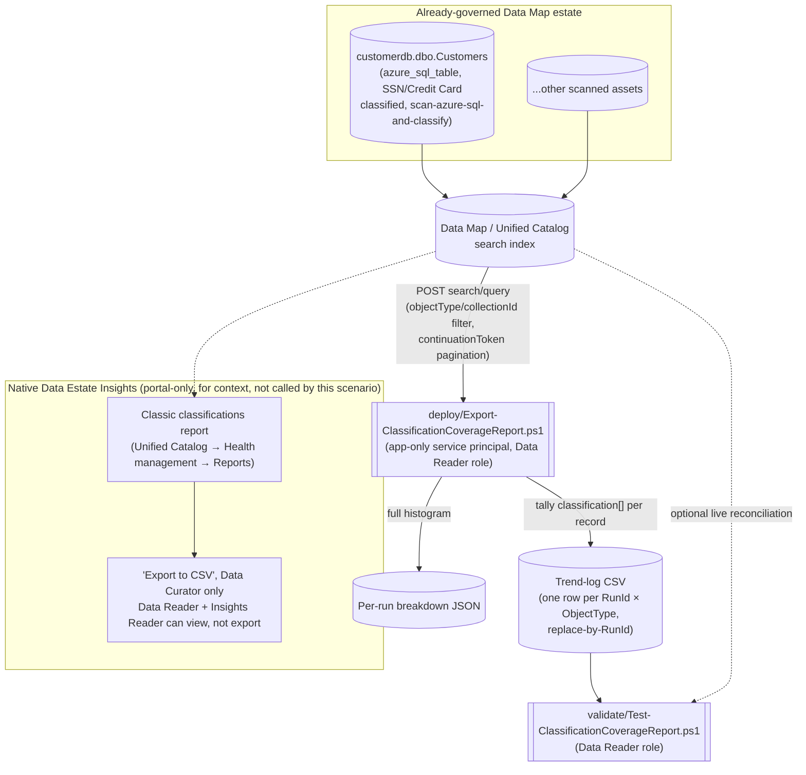

## 1. Scenario summary

Microsoft Purview's native **Data Estate Insights** classification report is a real, automatically-
generated dashboard, but it lives only in the portal, has no REST API, gates its own "Export to
CSV" button behind a more privileged role than a read-only automation identity needs, and shows a
rolling 30-day activity window rather than a durable, diffable history. This scenario scripts an
equivalent, exportable **classification coverage report**, total/classified/unclassified asset
counts and a full classification-value breakdown, per object type, using the Purview Data Map
**Discovery - Query** REST API this repo's other Data Governance scenarios already treat as
automation surface 4, and appends the result to a source-controllable trend log so the history the
native report discards after 30 days is actually kept.

**Who it's for:** a Chief Data Officer's or data-governance team's reporting/ops function that
needs classification-coverage numbers *outside* the portal, a board deck, a GRC tool, a SIEM, or
an audit-evidence trail with real point-in-time history, without granting the automation identity
more privilege than the native report's own export feature would require. (Role terminology below
follows Microsoft's own Data Reader/Data Curator/Data Estate Insights glossary definitions
.)

## 2. Business/regulatory driver

Classification coverage is the concrete, measurable proxy governance stakeholders and auditors use
to answer "do you actually know where your sensitive data is": GDPR Art. 30 records-of-processing
and Art. 5(2) accountability both depend on being able to demonstrate what personal data exists and
where, not just assert it; PCI DSS requires an accurate, current inventory of where cardholder data
lives; and a SOC 2 / ISO 27001 auditor evaluating a data-classification control expects evidence of
coverage *trending in the right direction over time*, not a single screenshot. Microsoft's own
framing of the native report makes the same point: it "enables data quality and data security
focused users like data stewards, data curators, and security administrators to understand the
types of information found in their organization's data estate" so they can "identify content with
specific classifications and understand required actions". This scenario doesn't
change what's being measured, it makes the measurement exportable, historical, and obtainable at a
lower privilege level than the native path requires.

This scenario also ties directly into this repo's existing Data Governance narrative: the worked
example scopes to `customerdb.dbo.Customers`, the same asset
`scenarios/data-map/scan-azure-sql-and-classify/` scans and classifies (SSN, Credit Card Number).
This report is the natural "what did all that scanning actually produce, in board-deck-ready
numbers, over time" companion to that scenario.

## 3. Prerequisites

Full licensing detail and citations: [Licensing matrix](/docs/licensing-matrix/). Summary for this scenario:

| Requirement | Minimum | Notes |
|---|---|---|
| Microsoft Purview account + Data Map | Active Azure subscription, Purview account with Data Map enabled | Discovery - Query rides the same Data Map/Unified Catalog PAYG metering as this repo's other surface-4 scenarios, see [Licensing matrix §1](/docs/licensing-matrix/#1-the-two-billing-models-read-this-first), 2 |
| At least one completed scan in scope | Assets already registered and scanned via Data Map (e.g. `scenarios/data-map/scan-azure-sql-and-classify/`) | This scenario does not register or scan any source, see §6/`design.md` §6 |
| Run this scenario's report script | **Data Reader** role on the collection(s) in scope | Discovery - Query is a Catalog Data-plane **read** operation, deliberately narrower than what viewing the native report through "Export to CSV" requires (next row). A credential with this role can already read every classified value in scope one asset at a time via the portal; this scenario changes *how conveniently* that data can be aggregated, not the underlying read boundary, see §11's report-sensitivity note before deciding where the output may be stored |
| View **and export** the *native* Data Estate Insights classification report (for comparison, not required by this scenario) | **Insights Reader** role (assignable only by the root collection's Data Curator) *plus* Data Reader, and even then, **only a Data Curator can select "Export to CSV"**; a Data Reader + Insights Reader can view but not export | This scenario's own script needs none of this, see design.md §2 goal 2 |
| Grant the automation identity a Purview role at all | **Collection Admin** role at root (or the relevant sub-collection) to perform the role assignment | Only a Collection Admin can assign Data Reader to a service principal |
| Automation identity for the REST calls | App registration with **Data Reader** Purview role on the collection(s) in scope | Client-secret app-only OAuth2, same token endpoint as this repo's other surface-4 scripts, [Automation surface §3](/docs/automation-surface/#3-authentication-patterns-interactive-vs-unattended) |
| Somewhere to persist the trend-log CSV between runs | A repo path, mounted file share, or blob storage | Not provisioned by this scenario, see §6/§9 |

> Verify current entitlement names against [Licensing matrix](/docs/licensing-matrix/) (dated 2026-09-02) before a
> sales commitment, SKU names and billing meters change.

## 4. Architecture



The report script never calls, scrapes, or automates the native Insights application shown above, 
it queries the same underlying Data Map search index directly, at a lower privilege level than the
native report's own export path requires. Full design rationale: `design.md`.

## 5. Step-by-step implementation

### Portal path (view the native report first, to understand what this scenario reproduces)

1. Open the Microsoft Purview portal → **Unified Catalog** → **Health management** → **Reports**
 (or, on the classic portal, **Data Estate Insights**) → select the **Classic classifications**
 report.
2. Note the KPIs shown, classified sources/files/tables, top classification categories, a 30-day
 classification-activity trend, and, if you hold Data Curator, try **Export to CSV**. A Data
 Reader with only the Insights Reader role will see the report but not the export option
, this is the specific gap this scenario's script closes at a lower privilege
 level.
3. Confirm the target collection(s) already have at least one completed scan (e.g.
 `scenarios/data-map/scan-azure-sql-and-classify/`'s own output for `customerdb.dbo.Customers`).
4. Assign the automation identity's service principal the **Data Reader** role on the collection(s)
 in scope: **Data Map** → **Collections** → select the collection → **Role assignments** → add
 under **Data readers**.

### Script path (idempotent by RunId, parameterized, dry-run capable)

```powershell
# 1. Dry run, queries live data and prints the computed KPIs, writes nothing to disk
./deploy/Export-ClassificationCoverageReport.ps1 `
    -PurviewAccountEndpoint 'https://api.purview-service.microsoft.com' `
    -TenantId $TenantId -AppId $AppId -ClientSecret $ClientSecret `
    -ObjectTypes 'Tables','Files' -CollectionId 'customerdb' `
    -TrendLogPath './deploy/out/classification-coverage-trend.csv' `
    -BreakdownOutputDirectory './deploy/out/breakdowns' -WhatIf

# 2. Run for real, writes/replaces today's row(s) in the trend log and a breakdown file per object type
./deploy/Export-ClassificationCoverageReport.ps1 `
    -PurviewAccountEndpoint 'https://api.purview-service.microsoft.com' `
    -TenantId $TenantId -AppId $AppId -ClientSecret $ClientSecret `
    -ObjectTypes 'Tables','Files' -CollectionId 'customerdb' `
    -TrendLogPath './deploy/out/classification-coverage-trend.csv' `
    -BreakdownOutputDirectory './deploy/out/breakdowns'

# 3. Validate, file-integrity checks, plus an optional live reconciliation against current data
./validate/Test-ClassificationCoverageReport.ps1 `
    -TrendLogPath './deploy/out/classification-coverage-trend.csv' `
    -PurviewAccountEndpoint 'https://api.purview-service.microsoft.com' `
    -TenantId $TenantId -AppId $AppId -ClientSecret $ClientSecret
```

Both scripts use the **Microsoft Purview Data Map / Discovery REST API**, automation surface 4 per
[Automation surface §1](/docs/automation-surface/#1-five-automation-surfaces-not-one-read-this-first), the same surface this repo's Data Map, Unified Catalog, and Data
Lineage scenarios already use. Token acquisition follows the same client-credentials pattern already
established by this repo's other surface-4 scripts.

**Scheduling:** this scenario ships no scheduler-specific code, wire
`deploy/Export-ClassificationCoverageReport.ps1` into whatever recurring-execution mechanism the
buyer already runs other PowerShell automation on (Azure Automation runbook, a scheduled Azure
Function, cron, or Windows Task Scheduler), pointing `-TrendLogPath`/`-BreakdownOutputDirectory` at
persistent storage (a repo path that gets committed, a mounted share, or blob storage). One run per
day (the default `-RunId` grain) is the right cadence for a board/GRC reporting use case; a
higher-frequency SIEM feed should pass an explicit `-RunId` per invocation instead.

## 6. Configuration reference

| Setting | Value this scenario uses | Notes |
|---|---|---|
| Object types reported by default | `Tables`, `Files` | Mirrors the native Classic classifications report's own classified-files/classified-tables split. Other confirmed valid values: `Folders`, `Glossary terms`, `Dashboards`, `Data pipelines`, `Reports`, `Stored procedures` |
| Classified/unclassified computation | Client-side tally of each `SearchResultValue.classification[]` array (empty vs. non-empty), from paginated `-Mode Full` results | Matches the native "Unclassified assets" KPI's own definition, "Assets with no system or custom classification on the entity or its columns", computed from a different, scriptable primitive. No documented Discovery - Query request filter exists for "has any/no classification", see §11 |
| Total-count source | The same query's own `@search.count` field | Documented as authoritative, "the total number of search results, not the number of documents in a single page" |
| Pagination | `continuationToken`, page size 1000 (the documented maximum) | Every page's record count is reconciled against `@search.count`; a mismatch is a warning, not a silent gap, see §11 |
| Fast-path alternative | `-Mode Facets`, one faceted query per object type, top-N classification counts only | Matches the native "Top classifications" chart's own double-counting behavior for multi-classified assets; cannot compute an unclassified count, see §11 |
| Report role | **Data Reader** | Catalog Data-plane read access, narrower than the native report's own Data-Curator-only export gate |
| API version pinned by both scripts | `2023-09-01` | Confirmed current via direct fetch of the Discovery - Query REST reference page |
| `-PurviewAccountEndpoint` accepted values | `https://api.purview-service.microsoft.com` (new portal) or `https://<account>.purview.azure.com` (classic portal) | Both explicitly confirmed valid for this `/datamap/api/...` path family, same dual-endpoint precedent as `scenarios/data-lineage/end-to-end-lineage-validation/` |
| Idempotency key | `-RunId` (default: current UTC date, `yyyy-MM-dd`) | Re-running for the same `RunId` **replaces** that RunId's trend-log row(s) rather than duplicating, see `design.md` §5 |

Full REST-body grounding: `deploy/Export-ClassificationCoverageReport.ps1` and
`validate/Test-ClassificationCoverageReport.ps1` inline comments and their `.NOTES` blocks cite the
exact Microsoft Learn reference pages.

## 7. Validation / how to prove it works

1. **Automated file-integrity check**, `./validate/Test-ClassificationCoverageReport.ps1` confirms
 the trend log's schema, that no `(RunId, ObjectType)` row is duplicated (proof the replace-by-
 RunId idempotency design is holding), and that `ClassifiedAssets + UnclassifiedAssets` equals
 `TotalAssets` for every Full-mode row. Runs without any tenant credentials, safe to wire into a
 CI-style check on the trend-log file itself.
2. **Live reconciliation (optional)**, supplying tenant credentials adds a check that the most
 recent run's `TotalAssets` is still within a configurable threshold of the *current*
 `@search.count` for that scope, catching a stale report (one that hasn't been re-run since a
 rescan or bulk deletion) as a `[WARN]`, distinct from a hard `[FAIL]`.
3. **Cross-check against the native report**, open the same collection's **Classic classifications**
 report in the portal (§5) and compare the top classification values and their relative order
 against this scenario's breakdown JSON for the same object type. Exact counts may differ slightly
 (the native report's own refresh cadence is weekly by default; this scenario's
 script queries live), but the same classification values should appear with a broadly consistent
 ranking.
4. **Idempotency proof**, re-run `deploy/Export-ClassificationCoverageReport.ps1` a second time with
 the same `-RunId` and confirm the trend log still has exactly one row per `(RunId, ObjectType)`, 
 never two.

## 8. Operations & tuning

**KPIs to watch (first 30 days):**
- **Percent classified, trended over time, per object type.** A flat or declining trend after new
 sources are onboarded is the signal this report exists to surface, Microsoft's own guidance
 frames the equivalent native metric the same way, as something to act on ("identify content...
 and understand required actions, such as adding extra security... or moving content to a more
 secure location").
- **Distinct classification values observed, per run.** A sudden drop can mean a scan failed
 silently or a scan rule set was narrowed; a sudden rise can mean a new, unreviewed data pattern
 entered the estate.
- **`[WARN]` frequency from the live-reconciliation check**, a `[WARN]` that clears on the next
 scheduled run is expected drift (a rescan happened between runs); one that persists across two or
 more runs is worth investigating as a possible stale trend log or a scope (`-CollectionId`)
 mismatch.

**Alert routing:** this scenario produces flat files (CSV/JSON), not a Purview-native alert or a
`GenerateAlert`-style action, there is nothing to wire into a native Purview alert channel. Route
`validate/Test-ClassificationCoverageReport.ps1`'s non-zero exit code into whatever CI/ops alerting
the buyer already uses for scheduled scripts, the same pattern this repo's Data Quality and Data
Lineage scenarios recommend for their own validate scripts. For a SIEM feed, ingest the trend-log
CSV or per-run breakdown JSON directly, this scenario deliberately does not build a bespoke
Sentinel/Log Analytics sink (see `design.md` §7).

**Incident-response runbook (a `[WARN]`/`[FAIL]` appears):** the validate script's two check
categories map to two different severities and two different remediations, a pipeline's alerting
should be built to treat them differently, not react identically to every non-`[PASS]` line.
1. **Triage**, a **file-integrity `[FAIL]`** (arithmetic or duplicate-row check) points at the trend
 log itself, not live data: check for manual edits to the CSV, or a version of this script older
 than the one that introduced the replace-by-RunId behavior. This category is always a hard
 failure worth blocking on.
2. **A live-reconciliation `[WARN]`** most often means the report is stale relative to a rescan or
 bulk change, re-run `deploy/Export-ClassificationCoverageReport.ps1` and re-validate before
 assuming anything is actually wrong. This category is a soft signal, not a block.
3. **A `Write-Warning` from the deploy script itself** ("paged N record(s) but @search.count
 reported M") means the pagination loop's tally and the API's own reported total disagree.
 `Write-Warning` output is on PowerShell's warning stream, not the `Write-Host` console summary a
 human glancing at scheduled-job output might see, a scheduled/unattended pipeline must capture
 the warning stream explicitly (e.g. `-WarningVariable`, or redirecting stream 3) to not miss this
 signal. Re-run before trusting that run's classified/unclassified split; if it recurs, treat it as
 a signal worth raising with Microsoft support rather than silently trusting either number (see
 §11).

**Review cadence:** re-run on whatever cadence the consuming report (board deck, GRC tool, SIEM)
needs, daily is the default grain this scenario's `-RunId` assumes; review the trend for
unexpected drops in coverage at least monthly regardless of automation cadence.

## 9. Rollback / decommission

See `rollback.md` for the full procedure. Quick reference: this scenario creates **no Purview
object**, there is nothing in the Purview account itself to roll back. Decommissioning means
stopping the scheduled execution of `deploy/Export-ClassificationCoverageReport.ps1`, removing the
Data Reader role assignment for the reporting service principal, and deciding what to do with the
already-produced trend-log/breakdown files per the buyer's own data-retention policy.

## 10. Cost & licensing notes

- **PAYG, not per-user, and lightweight at this scenario's scale.** Discovery - Query calls bill
 through the same Data Map / Unified Catalog PAYG metering as `scenarios/data-map/
 scan-azure-sql-and-classify/` and `scenarios/data-lineage/end-to-end-lineage-validation/`, see
 [Licensing matrix §1](/docs/licensing-matrix/#1-the-two-billing-models-read-this-first), 2. This scenario's calls are read-only search queries, not a scan, 
 cost impact is negligible relative to the scanning this scenario depends on as a prerequisite, with
 the caveat that `-Mode Full` at very large estate scale makes materially more calls than a single
 facet query (see §11).
- **No M365 per-user license required**, same PAYG/Azure-consumption model as this repo's other
 Data Map scenarios.
- **The native Data Estate Insights application itself carries no separate bill**, Microsoft states
 that disabling it removes it from billing entirely, implying it is not separately metered while
 enabled; this scenario's report is an *adjunct* to that free capability, not a
 paid replacement for it.
- **The real cost driver is storage/retention for the trend log**, and the engineering time to wire
 this script into a scheduler and a downstream consumer (board deck template, GRC tool, SIEM), not
 incremental Azure spend from the queries themselves.

## 11. Known limitations & gotchas

- **This report is itself a sensitive artifact and must be protected accordingly.** A trend-log row
 or breakdown file that says "customerdb.dbo.Customers: 2 classified assets (SSN, Credit Card
 Number)" is, by construction, a curated index of where an organization's most sensitive data
 lives, more convenient to exfiltrate than the same information locked inside Purview's own
 collection-scoped RBAC, since a flat CSV/JSON file carries no access control at all once it leaves
 the script's memory. Store `-TrendLogPath`/`-BreakdownOutputDirectory` output in access-controlled
 storage (a private repository, a permissioned file share or blob container), never an open share, 
 and apply the same handling discipline to it that governs the source classifications it summarizes.
 See `rollback.md` §3 for the same consideration at decommission time, and §3's Data Reader row
 above: a Data Reader credential that can read this report can, by definition, already read every
 classified value it aggregates, this scenario's aggregation makes bulk extraction a single script
 run rather than manual portal browsing, which is precisely why the report artifact itself needs
 this protection.
- **No documented Discovery - Query filter for "has any classification" / "has no classification"
 exists.** Microsoft's own REST reference for this operation documents only an exact-value
 classification filter (`"classification": "<value>", "includeSubClassifications": true`)
, and a Microsoft Q&A thread on exactly this question confirms no broader filter
 is exposed. Rather than approximate one with an unconfirmed expression (e.g. a
 `prefix` match against `"MICROSOFT."`), this scenario computes the classified/unclassified split by
 paging through every record and testing its documented `classification` array field client-side.
 This is the one design choice in this scenario that trades API-call cost for correctness, see
 `design.md` §5 for the alternative `-Mode Facets` trade-off.
- **`-Mode Full` does not scale to unbounded estate sizes without cost.** Paging through every record
 of an object type with several hundred thousand+ assets is a real, non-trivial number of API calls
 (records ÷ 1000, rounded up). This scenario does not implement incremental/delta tallying (e.g.
 only re-tallying assets modified since the last run), see `design.md` §7. `-Mode Facets` is the
 documented cheaper alternative, with its own named trade-off (no unclassified count; double-counts
 a multi-classified asset under every value it carries, exactly like the native "Top classifications"
 chart does).
- **`-Mode Facets`' classification counts double-count multi-classified assets, this matches, not
 diverges from, the native report's own behavior**, but is worth stating plainly so a report
 consumer doesn't sum facet counts and expect them to equal a distinct-asset total.
 `-Mode Full`'s `ClassifiedAssets`/`UnclassifiedAssets` counts do not have this problem, they tally
 distinct assets, not distinct (asset, classification-value) pairs.
- **`-Mode Facets` is top-N-truncated, not exhaustive, and silently so.** `-FacetTopN` (default 25)
 caps how many classification values come back per object type; a classification present on only a
 handful of assets, below that cutoff, disappears from the output entirely with no "and N more"
 indicator. A reader building a compliance narrative on `-Mode Facets` output needs to know it may
 be an incomplete list, not a full one, `-Mode Full` reports every distinct classification value
 observed, with no truncation.
- **This scenario reports on classifications only, not sensitivity labels or glossary/curation
 rates**, the native Insights application's two other "Curation and governance" report families
. Both are natural sibling fragments (the `label` field on the same
 `SearchResultValue` schema would extend this same pattern to sensitivity-label coverage); tracked
 as follow-ups in `PROGRESS.md` rather than built speculatively here.
- **A paged-record-count vs. `@search.count` mismatch is possible and undocumented as either an
 error or a non-issue.** This scenario's deploy script treats it as a `Write-Warning`, never a hard
 failure, and flags the affected run's classified/unclassified split as worth double-checking, see
 the script's `.NOTES`.
- **This scenario does not push results anywhere**, no built-in Log Analytics/Sentinel/Power BI
 sink. The trend-log CSV and per-run breakdown JSON are the deliverable; routing them into a SIEM or
 BI tool is the buyer's own integration, consistent with this repo's DLP/Data Quality scenarios'
 treatment of "bring your own SIEM."
- **This is not a replacement for the native Data Estate Insights application** for a human who
 simply wants to browse coverage interactively, drill into specific assets, or use the portal's own
 filter/sort UI, this scenario exists specifically for the export/schedule/history/least-privilege
 gaps the native report leaves, not as a general substitute (`design.md` §1).

## 12. References

1. Understand the Microsoft Purview Data Estate Insights application (report categories: Health,
 Inventory and ownership, Curation and governance), <https://learn.microsoft.com/purview/legacy/concept-insights>
2. Understand the classic classifications report in Unified Catalog (report contents, prerequisites,
 permissions, drilldown), <https://learn.microsoft.com/purview/unified-catalog-reports-classic-classifications>
3. Understand the classic assets report in Unified Catalog ("Unclassified assets" KPI definition), <https://learn.microsoft.com/purview/unified-catalog-reports-classic-assets>
4. Disable Data Estate Insights or report refresh (weekly default refresh cadence; no separate
 billing), <https://learn.microsoft.com/purview/legacy/disable-data-estate-insights>
5. Discovery - Query REST reference (API version 2023-09-01), request/response shape, facets,
 continuationToken pagination, @search.count semantics, worked filter/facet examples, <https://learn.microsoft.com/rest/api/purview/datamapdataplane/discovery/query>
6. Access control in the classic Microsoft Purview governance portal (Data reader/Data curator/
 Insights reader/Collection administrator role definitions), <https://learn.microsoft.com/purview/data-gov-classic-permissions>
7. Access control in Data Estate Insights within Microsoft Purview (Insights Reader role assignment;
 confirms a Data Reader can view but not export the native report), <https://learn.microsoft.com/purview/legacy/insights-permissions>
8. [Microsoft Purview] How to filter Entity by classification, Microsoft Q&A (corroborates that no
 "has any/no classification" Discovery - Query filter is documented), <https://learn.microsoft.com/answers/a/12132915>
9. Tutorial: Authenticate for Microsoft Purview data-plane APIs (service principal setup, Data Reader
 role for the Catalog Data plane, token acquisition), <https://learn.microsoft.com/purview/data-gov-api-rest-data-plane>
10. Microsoft Purview data governance glossary (Data reader, Data curator, Data Estate Insights, Data
 Map definitions), <https://learn.microsoft.com/purview/data-governance-glossary>
11. GraphQL API with Microsoft Purview (preview), confirms both `api.purview-service.microsoft.com`
 (new portal) and `{account}.purview.azure.com` (classic portal) as valid endpoint hosts for the
 `/datamap/api/...` path family, <https://learn.microsoft.com/purview/data-gov-api-graphql>

> Re-verify all links and the §11 limitations against current Microsoft Learn before a
> customer-facing deployment, Microsoft's own Data Map REST surface is explicitly called out
> elsewhere in this repo (`scenarios/data-map/scan-azure-sql-and-classify/README.md` §11) as
> evolving.
