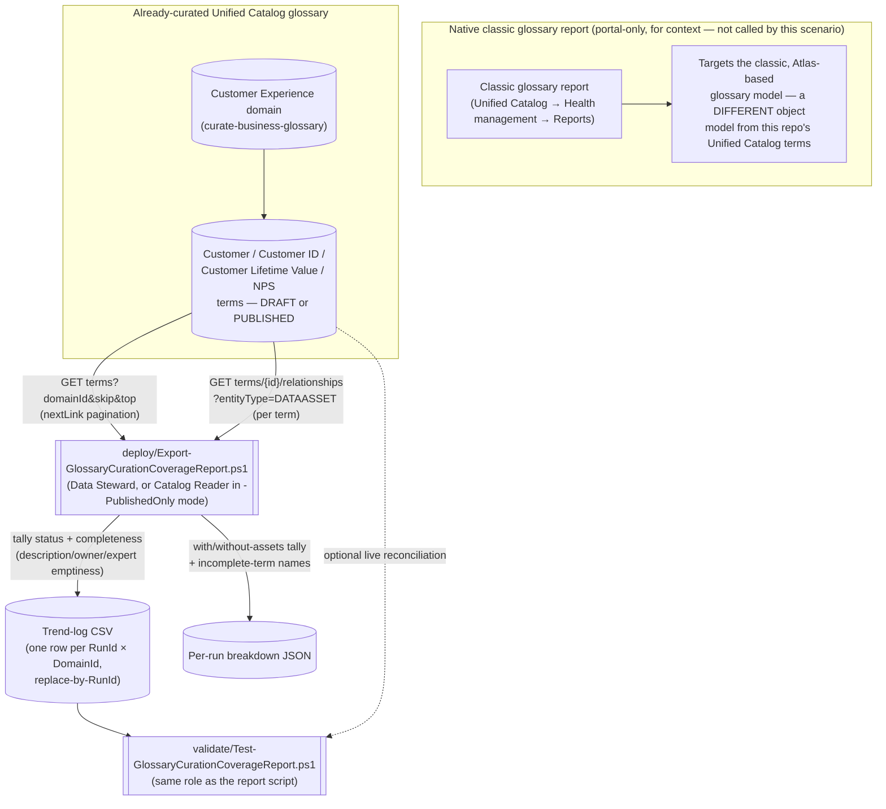

## 1. Scenario summary

Microsoft Purview's native **Data Estate Insights** application ships a **Classic glossary** report
with genuinely useful KPIs — total terms, approved terms without assets, expired terms with assets,
a status/asset-attachment snapshot, and an incomplete-terms breakdown — but it targets the classic,
Atlas-based glossary model, has no REST API of its own, and keeps no durable history beyond its own
refresh cadence. This scenario scripts the *same category* of KPIs against the object model this
repo's own glossary scenario actually uses — the current **Unified Catalog Terms REST API**
(`scenarios/unified-catalog/curate-business-glossary/`) — and appends the result to a
source-controllable trend log, using the Terms operation group's documented `List` and
`List Related Entities` operations.

**Who it's for:** a Chief Data Officer's or data-governance team's reporting/ops function that wants
glossary-health numbers (curation completeness, asset-attachment rate, status distribution) outside
the portal, trended over time, computed from the same term model their glossary-as-code pipeline
(`curate-business-glossary`) already writes to — not the legacy classic-glossary model the native
report was built for.

## 2. Business/regulatory driver

A glossary that exists but isn't curated or attached to any data asset provides none of the
governance value Microsoft's own guidance assigns it: "populate the glossary" is step two of the
Purview data-visibility baseline specifically so terms like *Customer* or *Revenue* carry a shared
meaning teams can build on
(`scenarios/unified-catalog/curate-business-glossary/README.md` §2). A term sitting in `DRAFT` with
no owner, no expert, and no linked asset is measurably incomplete — and without a report, that
incompleteness is invisible until someone happens to click into the term in the portal.

This scenario ties the same governance-maturity narrative to concrete, exportable evidence:
- **SOC 2 / ISO 27001 change-management and control-maturity evidence** — a trended
  "percent of published terms actually attached to an asset" number is a citable, board-deck-ready
  proxy for whether the glossary is a living control or an abandoned one-time exercise.
- **GDPR/CCPA data-mapping accountability** — an incomplete term (no owner, no expert) is a term
  nobody is accountable for; this report surfaces exactly which terms need that gap closed, the
  same "identify and act" framing Microsoft uses for its own classification/glossary insights
  (`scenarios/data-estate-insights/classification-coverage-report/README.md` §2).
- **CDMC (Cloud Data Management Capabilities)** — ownership and business-context completeness are
  direct inputs to Unified Catalog's own CDMC control-maturity tracking
  (`scenarios/unified-catalog/curate-business-glossary/README.md` §2).

This scenario also ties directly into this repo's existing narrative: the worked example reports on
the exact `Customer Experience` domain and four terms `curate-business-glossary` creates — the
natural "how healthy is the glossary we just curated, over time" companion to that scenario.

## 3. Prerequisites

Full licensing detail and citations: `docs/licensing-matrix.md`. Summary for this scenario:

| Requirement | Minimum | Notes |
|---|---|---|
| Unified Catalog data governance | **Pay-as-you-go (PAYG)** Purview account, Unified Catalog enabled | See §10 — this scenario only reads existing domain/term metadata; it creates no billable governed asset |
| A populated governance domain | At least one domain with glossary terms (e.g. `scenarios/unified-catalog/curate-business-glossary/`'s `Customer Experience` domain) | This scenario does not create or curate terms — see §6/`design.md` §7 |
| Report role (default mode, full status coverage) | **Data Steward** on every `-DomainIds` value | Only documented role that can see `DRAFT`-status terms [[6]](#12-references) — more privileged than this report's own `-PublishedOnly` mode, see next row |
| Report role (`-PublishedOnly` mode) | **Global Catalog Reader** or **Local Catalog Reader** | Documented as reading only **published** artifacts across (Global) or within (Local) governance domains [[8]](#12-references) — Draft/Expired-dependent KPIs are reported as `N/A` in this mode, never a false zero |
| Grant the automation identity a Unified Catalog role at all | A **Governance Domain Owner** (or a Data Governance Administrator delegating one) assigns roles on the domain's **Roles** tab | Same assignment path `curate-business-glossary/README.md` §3 already documents |
| Automation identity for the REST calls | App registration assigned the role above, client-credentials OAuth2 against resource `https://purview.azure.net` | Same pattern as `docs/automation-surface.md` §3 and `curate-business-glossary`'s own script |
| Somewhere to persist the trend-log CSV between runs | A repo path, mounted file share, or blob storage | Not provisioned by this scenario — see §6/§9 |

> Verify current entitlement names against `docs/licensing-matrix.md` (dated 2026-09-02) before a
> sales commitment — SKU names and role names change, and this scenario targets a **public preview**
> REST API surface (`2026-03-20-preview`) that Microsoft explicitly documents as subject to change
> before general availability [[5]](#12-references).

## 4. Architecture



The report script never calls, scrapes, or automates the classic glossary report shown above — it
queries the Unified Catalog Terms REST API directly, the same object model
`curate-business-glossary` already authors into. Full design rationale: `design.md`.

## 5. Step-by-step implementation

### Portal path (view the classic report first, to understand the gap this scenario closes)

1. Open the Microsoft Purview portal → **Unified Catalog** → **Health management** → **Reports**
   (or, on the classic portal, **Data Estate Insights**) → select the **Classic glossary** report
   [[1]](#12-references). Note this report's status vocabulary (Draft/Approved/Alert/Expired) is
   from the classic glossary model, not the Unified Catalog Terms model this scenario reports on
   (§11, `design.md` §1 point 4).
2. Confirm the target domain(s) already have glossary terms authored (e.g.
   `scenarios/unified-catalog/curate-business-glossary/`'s `Customer Experience` domain).
3. On each domain's **Roles** tab, assign the automation identity's service principal the
   **Data Steward** role (for full status coverage) or **Local Catalog Reader** (for
   `-PublishedOnly` mode) [[6]](#12-references)[[8]](#12-references).

### Script path (idempotent by RunId, parameterized, dry-run capable)

```powershell
# 1. Dry run — queries live data and prints the computed KPIs, writes nothing to disk
./deploy/Export-GlossaryCurationCoverageReport.ps1 `
    -PurviewAccountEndpoint 'https://api.purview-service.microsoft.com' `
    -TenantId $TenantId -AppId $AppId -ClientSecret $ClientSecret `
    -DomainIds $CustomerExperienceDomainId `
    -TrendLogPath './deploy/out/glossary-curation-trend.csv' `
    -BreakdownOutputDirectory './deploy/out/breakdowns' -WhatIf

# 2. Run for real — full status coverage, requires Data Steward on each domain
./deploy/Export-GlossaryCurationCoverageReport.ps1 `
    -PurviewAccountEndpoint 'https://api.purview-service.microsoft.com' `
    -TenantId $TenantId -AppId $AppId -ClientSecret $ClientSecret `
    -DomainIds $CustomerExperienceDomainId `
    -TrendLogPath './deploy/out/glossary-curation-trend.csv' `
    -BreakdownOutputDirectory './deploy/out/breakdowns'

# 3. Lower-privilege alternative — Global/Local Catalog Reader only, published terms only
./deploy/Export-GlossaryCurationCoverageReport.ps1 `
    -PurviewAccountEndpoint 'https://api.purview-service.microsoft.com' `
    -TenantId $TenantId -AppId $AppId -ClientSecret $ClientSecret `
    -DomainIds $CustomerExperienceDomainId -PublishedOnly `
    -TrendLogPath './deploy/out/glossary-curation-trend.csv' `
    -BreakdownOutputDirectory './deploy/out/breakdowns'

# 4. Validate
./validate/Test-GlossaryCurationCoverageReport.ps1 `
    -TrendLogPath './deploy/out/glossary-curation-trend.csv' `
    -PurviewAccountEndpoint 'https://api.purview-service.microsoft.com' `
    -TenantId $TenantId -AppId $AppId -ClientSecret $ClientSecret -DomainIds $CustomerExperienceDomainId
```

Both scripts use the **Microsoft Purview Unified Catalog REST API** (`Invoke-RestMethod`) —
automation surface 4 per `docs/automation-surface.md` §1, API version `2026-03-20-preview` — the
same surface and version `curate-business-glossary` already establishes. There is no PowerShell
cmdlet module for Unified Catalog term reads today.

**Scheduling:** this scenario ships no scheduler-specific code — wire
`deploy/Export-GlossaryCurationCoverageReport.ps1` into whatever recurring-execution mechanism the
buyer already runs other PowerShell automation on, pointing `-TrendLogPath`/
`-BreakdownOutputDirectory` at persistent storage. Daily (the default `-RunId` grain) is the right
cadence for a board/GRC reporting use case.

## 6. Configuration reference

| Setting | Value this scenario uses | Notes |
|---|---|---|
| Scope parameter | `-DomainIds` (one or more governance-domain GUIDs, required) | Unified Catalog domains are this API's native scoping unit — mirrors `curate-business-glossary`'s own domain-scoped model |
| Status values reported | `DRAFT`, `PUBLISHED`, `EXPIRED` | Confirmed `CatalogModelStatus` enum on the `Term` object [[4]](#12-references) — the classic report's fourth value, `Alert`, has no analog here (§11, `design.md` §4/§8) |
| "Approved" mapping | `PUBLISHED` status | Closest documented correspondence to the classic report's "Approved" term — not a Microsoft-stated equivalence (`design.md` §4) |
| Completeness checks | Empty/whitespace `description` ("missing definition"); empty `contacts.owner` ("missing steward" analog); empty `contacts.expert` ("missing expert"); 2+ of these = "missing multiple" | Client-side test of documented `Term`/`ContactsMap` fields [[4]](#12-references) — no unconfirmed facet/filter used (`design.md` §6) |
| Asset-attachment check | Per-term `GET terms/{id}/relationships?entityType=DATAASSET` — non-empty `value[]` = "has assets" | Only documented relationship-read primitive for this question [[7]](#12-references); an N+1 cost, opt out via `-SkipAssetLinkCheck` |
| Pagination | `skip`/`top` query parameters, `nextLink`-style paging | `PagedTerm` response shape [[4]](#12-references) — a different primitive from Discovery - Query's `continuationToken` (used by this scenario's `classification-coverage-report` sibling); `-PageSize` defaults to 100 since Microsoft documents no maximum `top` value — see §11 |
| Report role | **Data Steward** (default) or **Global/Local Catalog Reader** (`-PublishedOnly`) | §3 — the one place this scenario is *more* privileged than its `classification-coverage-report` sibling, disclosed rather than glossed over |
| API version pinned by both scripts | `2026-03-20-preview` | Same version `curate-business-glossary` and `docs/automation-surface.md` §4 already pin — confirmed current via direct fetch of the Terms operation-group reference [[4]](#12-references)[[7]](#12-references) |
| `-PurviewAccountEndpoint` accepted values | `https://api.purview-service.microsoft.com` (new portal) or `https://<account>.purview.azure.com` (classic portal) | Same dual-endpoint precedent as `curate-business-glossary` and `classification-coverage-report` |
| Idempotency key | `-RunId` (default: current UTC date, `yyyy-MM-dd`) | Re-running for the same `RunId` **replaces** that RunId's trend-log row(s) — see `design.md` §5 |

Full REST-body grounding: `deploy/Export-GlossaryCurationCoverageReport.ps1` and
`validate/Test-GlossaryCurationCoverageReport.ps1` inline comments and their `.NOTES` blocks cite the
exact Microsoft Learn reference pages.

## 7. Validation / how to prove it works

1. **Automated file-integrity check** — `./validate/Test-GlossaryCurationCoverageReport.ps1`
   confirms the trend log's schema, that no `(RunId, DomainId)` row is duplicated (proof the
   replace-by-RunId idempotency design is holding), and that the status counts and the
   with-assets/without-assets counts each sum to `TotalTerms` for every row where the corresponding
   check ran. Runs without any tenant credentials — safe to wire into a CI-style check on the
   trend-log file itself.
2. **Live reconciliation (optional)** — supplying tenant credentials adds a check that the most
   recent run's `TotalTerms` for a domain is still consistent with a fresh `List` call for that
   domain, catching a stale report as a `[WARN]`, distinct from a hard `[FAIL]`.
3. **Cross-check against the portal** — open the domain in **Unified Catalog** → **Governance
   domains** → the domain → **Glossary terms** → **View all**, and compare the Draft/Published/
   Expired counts and which terms show a **Governance** tab asset link against this scenario's
   breakdown JSON for the same domain [[9]](#12-references). Do **not** cross-check against the
   classic glossary report — it reads a different object model entirely (§11).
4. **Idempotency proof** — re-run `deploy/Export-GlossaryCurationCoverageReport.ps1` a second time
   with the same `-RunId` and confirm the trend log still has exactly one row per
   `(RunId, DomainId)` — never two.

## 8. Operations & tuning

**KPIs to watch (first 30 days):**
- **Percent of `PUBLISHED` terms with at least one linked asset, trended over time, per domain.** A
  flat or declining trend after new terms are published is the same "curated but unused" signal the
  classic report's "Approved terms without assets" KPI exists to surface [[1]](#12-references).
- **Percent of terms with zero incompleteness flags, trended over time.** A term missing an owner is
  a term nobody is accountable for — this repo's `curate-business-glossary/README.md` §8 already
  recommends folding glossary-owner review into offboarding/access-review; this KPI is the
  measurable version of that recommendation.
- **`DRAFT` terms aging past a buyer-defined threshold** (this report doesn't compute an age itself
  — `systemData.createdAt` is available in the per-run breakdown JSON for a consuming report/BI tool
  to compute it) — a `DRAFT` term sitting unreviewed for months signals a stalled curation workflow.

**Alert routing:** this scenario produces flat files (CSV/JSON), not a Purview-native alert — there
is nothing to wire into a native Purview alert channel. Route
`validate/Test-GlossaryCurationCoverageReport.ps1`'s non-zero exit code into whatever CI/ops
alerting the buyer already uses for scheduled scripts, the same pattern
`classification-coverage-report/README.md` §8 recommends for its own validate script. This scenario
deliberately does not build a bespoke Sentinel/Log Analytics sink — ingest the trend-log CSV or
per-run breakdown JSON directly.

**Incident-response runbook (a `[WARN]`/`[FAIL]` appears):**
1. **Triage** — a **file-integrity `[FAIL]`** (arithmetic or duplicate-row check) points at the
   trend log itself, not live data: check for manual edits to the CSV, or a version of this script
   older than the one that introduced replace-by-RunId behavior. Always a hard failure worth
   blocking on.
2. **A live-reconciliation `[WARN]`** most often means the report is stale relative to newly created
   or expired terms since the last run — re-run `deploy/Export-GlossaryCurationCoverageReport.ps1`
   and re-validate before assuming anything is actually wrong. A soft signal, not a block.
3. **A `Write-Warning` for a role-permission mismatch** (e.g. the automation identity can't see
   `DRAFT` terms because it only holds Catalog Reader, not Data Steward, despite `-PublishedOnly`
   not being set) surfaces on PowerShell's warning stream — a scheduled/unattended pipeline must
   capture it explicitly (`-WarningVariable`, or redirecting stream 3) to not silently under-report
   Draft-term counts as zero when the real cause is a permission gap, not an empty glossary.

**Review cadence:** re-run on whatever cadence the consuming report needs — daily is the default
grain this scenario's `-RunId` assumes; review the trend for stalled Draft terms or declining
asset-attachment rates at least monthly regardless of automation cadence.

## 9. Rollback / decommission

See `rollback.md` for the full procedure. Quick reference: this scenario creates **no Purview
object** — there is nothing in the Purview account itself to roll back. Decommissioning means
stopping the scheduled execution of `deploy/Export-GlossaryCurationCoverageReport.ps1`, removing the
Data Steward/Catalog Reader role assignment for the reporting service principal, and deciding what
to do with the already-produced trend-log/breakdown files.

## 10. Cost & licensing notes

- **This scenario, by itself, incurs no incremental PAYG charge.** It only reads terms and existing
  term-to-asset relationships — it links no new data asset to anything. Unified Catalog's governed-
  assets billing meter is driven by assets actively linked to a governance concept
  (`curate-business-glossary/README.md` §10 [[10]](#12-references)); a read of an existing
  relationship doesn't create a new governed-asset-day.
- **No M365 per-user license required** — same PAYG-only model as `curate-business-glossary` and
  `classification-coverage-report` (`docs/licensing-matrix.md` §2).
- **The classic Data Estate Insights application itself carries no separate bill**, and this
  scenario doesn't call it at all — see `classification-coverage-report/README.md` §10 for the
  citation; not repeated here since this scenario's KPIs come from a different API entirely.
- **The real cost driver is the per-term `List Related Entities` call volume at scale** (§6, §11) —
  a domain with several thousand terms makes several thousand additional API calls per run unless
  `-SkipAssetLinkCheck` is set — and the engineering time to wire this script into a scheduler and a
  downstream consumer, not incremental Azure spend from the queries themselves.

## 11. Known limitations & gotchas

- **This report targets the Unified Catalog Terms model, not the classic glossary model the native
  report reads — they are not interchangeable, and this scenario's numbers will not match the
  classic glossary report's numbers for a tenant still on the classic Data Catalog glossary.**
  A buyer who hasn't migrated to Unified Catalog terms will see this scenario report zero terms
  against a non-zero classic-glossary count. This is a disclosed scope boundary
  (`design.md` §1 point 4, §8), not a bug — confirm which glossary model a given tenant actually
  uses before pointing this scenario at it.
- **No `Alert`-status equivalent is computed.** The classic report's four-value status vocabulary
  (`Draft`/`Approved`/`Alert`/`Expired`) has no `Alert` analog on the Unified Catalog `Term` object's
  three-value `CatalogModelStatus` enum (`DRAFT`/`PUBLISHED`/`EXPIRED`) — this scenario reports three
  statuses and states why, rather than fabricating a fourth (`design.md` §4).
- **"Missing steward" is an interpretive mapping to `contacts.owner`, not a Microsoft-confirmed term
  equivalence.** The new `ContactsMap` schema's contact types are `owner`/`expert`/`databaseAdmin` —
  there is no field literally named `steward`. This scenario treats `owner` as the closest documented
  analog and says so in `design.md` §4 rather than asserting the classic report's "steward" and the
  new model's "owner" are formally the same Microsoft-defined concept.
- **Weekly/monthly active-user counts (the native Data Stewardship/Catalog Adoption dashboards'
  usage-telemetry metric) are out of scope and not approximated.** No documented REST operation on
  any Unified Catalog operation group exposes portal search/view telemetry — this was the specific
  gap the originating `PROGRESS.md` follow-up flagged as needing "a different REST primitive," and
  this build's grounding pass confirms none exists rather than guessing a proxy metric
  (`design.md` §8).
- **The per-term asset-attachment check does not scale to unbounded glossary sizes without cost.**
  One `List Related Entities` call per term, every run (records ÷ 1, not batched — no documented
  bulk "which of these N terms have assets" operation exists). `-SkipAssetLinkCheck` is the
  documented opt-out, at the cost of leaving with/without-assets KPIs as `Skipped` in that run's
  output rather than computed.
- **No documented maximum `top` value for Terms - List.** This scenario defaults `-PageSize` to a
  conservative 100 and always follows `nextLink` until absent, so an unconfirmed server-side cap
  cannot cause a silently truncated pull — but a tenant with a very large single domain should
  confirm actual page-size behavior in a pilot tenant before assuming 100 is optimal for runtime.
- **`Terms - Get Facets`' `facets[].name` values are not enumerated in Microsoft's reference** —
  only a worked `owner` example exists. This scenario deliberately does not attempt an unconfirmed
  `status` or `hasAssets` facet request to short-circuit the client-side tally (`design.md` §6) —
  a future revision could adopt a facets-based fast path once Microsoft documents valid facet names,
  the same class of "wait for documentation, don't guess the shape" discipline
  `classification-coverage-report/README.md` §11 already applies to its own `-Mode Facets`.
- **`-PublishedOnly` mode reports `N/A`, not `0`, for Draft/Expired-dependent KPIs** — a consuming
  report or dashboard must handle that distinction explicitly (an `N/A` means "not measured due to
  role," not "there are none").
- **This scenario does not push results anywhere** — no built-in Log Analytics/Sentinel/Power BI
  sink, consistent with `classification-coverage-report/README.md` §11's own treatment of
  "bring your own SIEM."
- **This report is a sensitivity-adjacent artifact** — a lower sensitivity tier than
  `classification-coverage-report`'s output (glossary metadata, not classified-data locations), but
  still an index of business terminology, ownership, and which business concepts are actively
  governed. Store `-TrendLogPath`/`-BreakdownOutputDirectory` output in access-controlled storage,
  consistent with this repo's general handling discipline for reporting-scenario output.

## 12. References

1. Understand the classic glossary report in Unified Catalog (KPIs, status snapshot, incomplete-term
   breakdown) — <https://learn.microsoft.com/purview/unified-catalog-reports-classic-glossary>
2. Understand the Microsoft Purview Data Estate Insights application (Health/Data stewardship and
   Catalog adoption dashboards — active-user and search-activity telemetry) — <https://learn.microsoft.com/purview/legacy/concept-insights>
3. Disable Data Estate Insights or report refresh (weekly default refresh cadence; no separate
   billing) — <https://learn.microsoft.com/purview/legacy/disable-data-estate-insights>
4. Purview Unified Catalog REST API — Terms - List / Terms - Get (Term object schema:
   `status` enum `DRAFT`/`PUBLISHED`/`EXPIRED`, `ContactsMap` `owner`/`expert`/`databaseAdmin`,
   `PagedTerm` `nextLink` pagination) — <https://learn.microsoft.com/rest/api/purview/purview-unified-catalog/terms/list?view=rest-purview-purview-unified-catalog-2026-03-20-preview>
5. Unified Catalog API (Public Preview) overview (GA-only coverage, preview API version status) — <https://learn.microsoft.com/rest/api/purview/unified-catalog-api-overview>
6. Create and manage glossary terms (DRAFT visibility limited to Data Stewards/Governance Domain
   Owners) — <https://learn.microsoft.com/purview/unified-catalog-glossary-terms-create-manage>
7. Purview Unified Catalog REST API — Terms - List Related Entities / Terms - Get Facets (asset-
   relationship read primitive; facet name enumeration gap) — <https://learn.microsoft.com/rest/api/purview/purview-unified-catalog/terms/list-related-entities?view=rest-purview-purview-unified-catalog-2026-03-20-preview>
8. Data governance roles and permissions in Microsoft Purview (Global Catalog Reader/Local Catalog
   Reader read only published artifacts; Data Steward reads/writes within its own domain) — <https://learn.microsoft.com/purview/data-governance-roles-permissions>
9. Search for data assets (governed-asset search, the **Governance** tab showing linked glossary
   terms per asset — the portal-side cross-check for this scenario's asset-attachment tally) — <https://learn.microsoft.com/purview/unified-catalog-data-assets-search>
10. Learn about data governance billing (governed assets, what counts, what doesn't) — <https://learn.microsoft.com/purview/data-governance-billing>
11. Tutorial: Authenticate for APIs (service principal setup, Unified Catalog role assignment,
    client-credentials token flow) — <https://learn.microsoft.com/purview/data-gov-api-rest-data-plane>

> Re-verify all links against current Microsoft Learn before a customer-facing engagement — this
> scenario targets Unified Catalog's **preview** REST API surface (`2026-03-20-preview`), which
> Microsoft explicitly documents as covering only GA Unified Catalog features and subject to change
> before general availability [[5]](#12-references).
