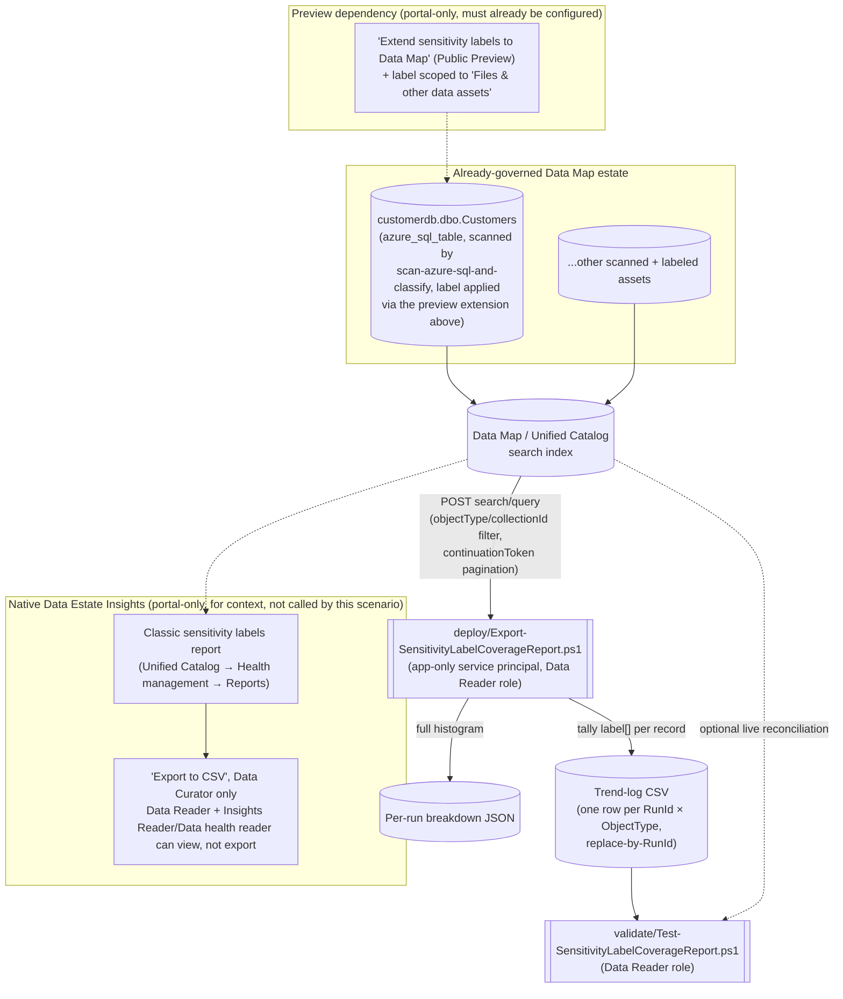

> **Public Preview dependency.** This scenario reads labels applied via "Extend sensitivity labels to
> assets in Microsoft Purview Data Map," which is itself a Microsoft-labeled **preview** capability as
> of this build. Re-check GA status before a production-facing
> deployment, see §11.

## 1. Scenario summary

Microsoft Purview's native **Data Estate Insights** classification report family includes a **Classic
sensitivity labels** report, a real, automatically-generated dashboard, but, like its sibling
**Classic classifications** report, it lives only in the portal, has no REST API, gates its own
"Export to CSV" button behind a more privileged role than a read-only automation identity needs, and
shows a rolling 30-day activity window rather than a durable, diffable history. This scenario scripts
an equivalent, exportable **sensitivity-label coverage report**, total/labeled/unlabeled asset counts
and a full label-value breakdown, per object type, using the same Purview Data Map **Discovery -
Query** REST API this repo's other Data Governance scenarios already treat as automation surface 4,
and appends the result to a source-controllable trend log so the history the native report discards
after 30 days is actually kept. It is the direct sibling of
`scenarios/data-estate-insights/classification-coverage-report/`, applying the identical,
already-reviewed design to the `label` field instead of `classification`.

**Who it's for:** a security-administrator or data-governance reporting function that needs
sensitivity-label coverage numbers *outside* the portal, a board deck, a GRC tool, a SIEM, or an
audit-evidence trail with real point-in-time history, without granting the automation identity more
privilege than the native report's own export feature would require. (Role terminology below follows
Microsoft's own Data Reader/Data Curator/Data Estate Insights glossary definitions
.)

## 2. Business/regulatory driver

Sensitivity labels are the mechanism Microsoft Purview uses to state *how sensitive* certain data is
and to drive the handling/protection actions that follow from that, Microsoft's own framing of the
native report makes this precise: it "enables security administrators to ensure the security of the
data found in their organization's data estate by identifying where sensitive data is stored," so they
can "identify the sensitivity labels found in your content and understand required actions, such as
managing access to specific repositories or files". Where the sibling
`classification-coverage-report` scenario answers "do we know what kinds of sensitive data exist and
where," this scenario answers the adjacent, security-operations question: "is the protection posture
(the label) we've decided on for that data actually applied, and is coverage trending in the right
direction." A GDPR Art. 32 (security of processing) or SOC 2 / ISO 27001 access-control auditor
evaluating a data-protection control expects evidence that protective labeling is both applied and
*trending*, not asserted from a single screenshot, the same historical-evidence gap the sibling
scenario's driver names for classifications.

This scenario ties directly into this repo's existing Data Governance narrative and its own sibling
report: the worked example scopes to the same `customerdb` collection
`scenarios/data-map/scan-azure-sql-and-classify/` scans and
`scenarios/data-estate-insights/classification-coverage-report/` already reports classification
coverage for. A buyer who wants the full "what's classified, and separately, what's actually
protected-by-label" picture runs both sibling scripts against the same estate.

> **A high `PercentLabeled` number is not, by itself, evidence that the underlying data is
> encrypted, access-restricted, or otherwise protected.** Microsoft documents plainly that a
> sensitivity label surfaced in the Data Map is applied **only as metadata**, "these sensitivity
> labels don't modify your files and databases in any way," and Data Map does not currently support
> encryption, content marking, or DLP enforcement for the files/tables it labels
>. This report measures **labeling coverage**, i.e. "is
> sensitivity known and recorded," not **protection coverage**, i.e. "is access to this data actually
> restricted." Do not present this scenario's output as proof of enforced protection, see §11.

## 3. Prerequisites

Full licensing detail and citations: [Licensing matrix](/docs/licensing-matrix/). Summary for this scenario:

| Requirement | Minimum | Notes |
|---|---|---|
| Microsoft Purview account + Data Map | Active Azure subscription, Purview account with Data Map enabled | Discovery - Query rides the same Data Map/Unified Catalog PAYG metering as this repo's other surface-4 scenarios, see [Licensing matrix §1](/docs/licensing-matrix/#1-the-two-billing-models-read-this-first), 2 |
| **"Extend sensitivity labels to Data Map" turned on**, with at least one asset already labeled | A Microsoft 365 E5/A5/G5 (or E5/A5/G5 Compliance, or E5/A5/G5 Information Protection and Governance, or Office 365 E5 + EMS E5/A5/G5 + AIP Plan 2) license in the same Entra tenant as the Purview account **or**, for non-Microsoft-365 sources, PAYG billing enabled | This is a **Public Preview** capability and a separate licensing dependency from Data Map scanning itself, see §11. This scenario does not turn this on or apply any label, see §6/`design.md` §7 |
| At least one completed scan in scope | Assets already registered and scanned via Data Map | This scenario does not register or scan any source, see §6/`design.md` §6 |
| Run this scenario's report script | **Data Reader** role on the collection(s) in scope | Discovery - Query is a Catalog Data-plane **read** operation, deliberately narrower than what viewing the native report through "Export to CSV" requires (next row). A credential with this role can already read every label value in scope one asset at a time via the portal; this scenario changes *how conveniently* that data can be aggregated, not the underlying read boundary, see §11's report-sensitivity note before deciding where the output may be stored |
| View **and export** the *native* Data Estate Insights sensitivity-labels report (for comparison, not required by this scenario) | **Insights Reader** role (assignable only by the root collection's Data Curator) *plus* Data Reader on the classic experience, or **Data health reader** on the new Unified Catalog experience, and even then, **only a Data Curator can select "Export to CSV"**; a Data Reader + Insights Reader can view but not export | This scenario's own script needs none of this, see `design.md` §2 goal 2 |
| Grant the automation identity a Purview role at all | **Collection Admin** role at root (or the relevant sub-collection) to perform the role assignment | Only a Collection Admin can assign Data Reader to a service principal |
| Automation identity for the REST calls | App registration with **Data Reader** Purview role on the collection(s) in scope | Client-secret app-only OAuth2, same token endpoint as this repo's other surface-4 scripts, [Automation surface §3](/docs/automation-surface/#3-authentication-patterns-interactive-vs-unattended) |
| Somewhere to persist the trend-log CSV between runs | A repo path, mounted file share, or blob storage | Not provisioned by this scenario, see §6/§9 |

> Verify current entitlement names against [Licensing matrix](/docs/licensing-matrix/) (dated 2026-09-02) before a
> sales commitment, SKU names and billing meters change, and this scenario's own preview dependency
> (row 2) is especially likely to change before GA.

## 4. Architecture



The report script never calls, scrapes, or automates the native Insights application shown above, it
queries the same underlying Data Map search index directly, at a lower privilege level than the native
report's own export path requires. Full design rationale: `design.md`.

## 5. Step-by-step implementation

### Portal path (view the native report first, to understand what this scenario reproduces)

1. Confirm "Extend sensitivity labels to Data Map" is turned on for the tenant and at least one
 asset already carries a label, **Microsoft Purview portal → Information Protection →
 Sensitivity labels**, confirm the label(s) in scope are scoped to **Files & other data assets**,
 then re-scan (or wait for the next scheduled scan of) the target source
. This is a manual, licensed, preview-capability prerequisite, 
 see §3/§11, not something this scenario's scripts configure.
2. Open the Microsoft Purview portal → **Unified Catalog** → **Health management** → **Reports** (or,
 on the classic portal, **Data Estate Insights**) → select the **Classic sensitivity labels** report
.
3. Note the KPIs shown, number of subscriptions, unique labels applied, sources/files/tables
 labeled, top labels applied, a 30-day labeling-activity trend, and, if you hold Data Curator, try
 **Export to CSV**. A Data Reader with only the Insights Reader (or Data health reader) role will
 see the report but not the export option, this is the specific gap this
 scenario's script closes at a lower privilege level.
4. Confirm the target collection(s) already have at least one completed scan and at least one labeled
 asset (step 1).
5. Assign the automation identity's service principal the **Data Reader** role on the collection(s) in
 scope: **Data Map** → **Collections** → select the collection → **Role assignments** → add under
 **Data readers**.

### Script path (idempotent by RunId, parameterized, dry-run capable)

```powershell
# 1. Dry run, queries live data and prints the computed KPIs, writes nothing to disk
./deploy/Export-SensitivityLabelCoverageReport.ps1 `
    -PurviewAccountEndpoint 'https://api.purview-service.microsoft.com' `
    -TenantId $TenantId -AppId $AppId -ClientSecret $ClientSecret `
    -ObjectTypes 'Tables','Files' -CollectionId 'customerdb' `
    -TrendLogPath './deploy/out/sensitivity-label-coverage-trend.csv' `
    -BreakdownOutputDirectory './deploy/out/breakdowns' -WhatIf

# 2. Run for real, writes/replaces today's row(s) in the trend log and a breakdown file per object type
./deploy/Export-SensitivityLabelCoverageReport.ps1 `
    -PurviewAccountEndpoint 'https://api.purview-service.microsoft.com' `
    -TenantId $TenantId -AppId $AppId -ClientSecret $ClientSecret `
    -ObjectTypes 'Tables','Files' -CollectionId 'customerdb' `
    -TrendLogPath './deploy/out/sensitivity-label-coverage-trend.csv' `
    -BreakdownOutputDirectory './deploy/out/breakdowns'

# 3. Validate, file-integrity checks, plus an optional live reconciliation against current data
./validate/Test-SensitivityLabelCoverageReport.ps1 `
    -TrendLogPath './deploy/out/sensitivity-label-coverage-trend.csv' `
    -PurviewAccountEndpoint 'https://api.purview-service.microsoft.com' `
    -TenantId $TenantId -AppId $AppId -ClientSecret $ClientSecret
```

Both scripts use the **Microsoft Purview Data Map / Discovery REST API**, automation surface 4 per
[Automation surface §1](/docs/automation-surface/#1-five-automation-surfaces-not-one-read-this-first), the same surface this repo's Data Map, Unified Catalog, Data
Lineage, and sibling `classification-coverage-report` scenarios already use. Token acquisition follows
the same client-credentials pattern already established by this repo's other surface-4 scripts.

**Scheduling:** this scenario ships no scheduler-specific code, wire
`deploy/Export-SensitivityLabelCoverageReport.ps1` into whatever recurring-execution mechanism the
buyer already runs other PowerShell automation on (Azure Automation runbook, a scheduled Azure
Function, cron, or Windows Task Scheduler), pointing `-TrendLogPath`/`-BreakdownOutputDirectory` at
persistent storage. Run it alongside (never in place of) the sibling
`classification-coverage-report/deploy/Export-ClassificationCoverageReport.ps1`, the two scripts
write distinct file names and never collide. One run per day (the default `-RunId` grain) is the right
cadence for a board/GRC reporting use case; a higher-frequency SIEM feed should pass an explicit
`-RunId` per invocation instead.

## 6. Configuration reference

| Setting | Value this scenario uses | Notes |
|---|---|---|
| Object types reported by default | `Tables`, `Files` | Mirrors both the native Classic sensitivity labels report's own files/tables-labeled split and the sibling `classification-coverage-report` scenario's default |
| Labeled/unlabeled computation | Client-side tally of each `SearchResultValue.label[]` array (empty vs. non-empty), from paginated `-Mode Full` results | No documented Discovery - Query request filter exists for "has any/no label" (only a documented `classification`-value filter), see §11 |
| Total-count source | The same query's own `@search.count` field | Documented as authoritative, "the total number of search results, not the number of documents in a single page" |
| Pagination | `continuationToken`, page size 1000 (the documented maximum) | Every page's record count is reconciled against `@search.count`; a mismatch is a warning, not a silent gap, see §11 |
| Fast-path alternative | `-Mode Facets`, one faceted query per object type, using the confirmed `label` facet, top-N label counts only | Matches the native "Top labels applied across sources/files/tables" charts' own double-counting behavior for multi-labeled assets; cannot compute an unlabeled count, see §11 |
| Report role | **Data Reader** | Catalog Data-plane read access, narrower than the native report's own Data-Curator-only export gate |
| API version pinned by both scripts | `2023-09-01` | Same Discovery - Query REST reference page and version already confirmed current for the sibling `classification-coverage-report` scenario, re-confirmed via direct fetch for this build |
| `-PurviewAccountEndpoint` accepted values | `https://api.purview-service.microsoft.com` (new portal) or `https://<account>.purview.azure.com` (classic portal) | Both explicitly confirmed valid for this `/datamap/api/...` path family, same dual-endpoint precedent as the sibling scenario and `scenarios/data-lineage/end-to-end-lineage-validation/` |
| Idempotency key | `-RunId` (default: current UTC date, `yyyy-MM-dd`) | Re-running for the same `RunId` **replaces** that RunId's trend-log row(s) rather than duplicating, see `design.md` §5 |

Full REST-body grounding: `deploy/Export-SensitivityLabelCoverageReport.ps1` and
`validate/Test-SensitivityLabelCoverageReport.ps1` inline comments and their `.NOTES` blocks cite the
exact Microsoft Learn reference pages.

## 7. Validation / how to prove it works

1. **Automated file-integrity check**, `./validate/Test-SensitivityLabelCoverageReport.ps1` confirms
 the trend log's schema, that no `(RunId, ObjectType)` row is duplicated (proof the replace-by-RunId
 idempotency design is holding), and that `LabeledAssets + UnlabeledAssets` equals `TotalAssets` for
 every Full-mode row. Runs without any tenant credentials, safe to wire into a CI-style check on the
 trend-log file itself.
2. **Live reconciliation (optional)**, supplying tenant credentials adds a check that the most recent
 run's `TotalAssets` is still within a configurable threshold of the *current* `@search.count` for
 that scope, catching a stale report (one that hasn't been re-run since a rescan, bulk relabeling, or
 bulk deletion) as a `[WARN]`, distinct from a hard `[FAIL]`.
3. **Cross-check against the native report**, open the same collection's **Classic sensitivity
 labels** report in the portal (§5) and compare the top label values and their relative order
 against this scenario's breakdown JSON for the same object type. Exact counts may differ slightly
 (the native report's own refresh cadence vs. this scenario's live query), but the same label values
 should appear with a broadly consistent ranking.
4. **Idempotency proof**, re-run `deploy/Export-SensitivityLabelCoverageReport.ps1` a second time
 with the same `-RunId` and confirm the trend log still has exactly one row per `(RunId, ObjectType)`
, never two.

## 8. Operations & tuning

**KPIs to watch (first 30 days):**
- **Percent labeled, trended over time, per object type.** A flat or declining trend after new
 sources are onboarded is the signal this report exists to surface, Microsoft's own guidance frames
 the equivalent native purpose the same way: "identify the sensitivity labels found in your content
 and understand required actions, such as managing access to specific repositories or files"
.
- **Distinct label values observed, per run.** A sudden drop can mean the "extend sensitivity labels
 to Data Map" capability was disabled, a scoped label's scope was changed away from "Files & other
 data assets," or a scan failed silently; a sudden rise can mean a new, unreviewed label taxonomy
 entered the estate.
- **`PercentLabeled` broken out by `-ObjectTypes`/`-CollectionId`, not read as one blended estate-wide
 number.** Onboarding a new collection or object type that is on Microsoft's documented list of Data
 Map sensitivity-label sources (Azure Blob Storage, ADLS Gen1/Gen2, SQL Server, Azure SQL Database,
 Azure SQL Managed Instance, Amazon S3, Amazon RDS (preview), Power BI) but has not yet had
 autolabeling run against it will show as 0% labeled, a coverage gap worth acting on. Onboarding a
 collection whose source type is *not* on that list will also show as 0% labeled, for a structurally
 different reason (labeling isn't available there yet, not that it was skipped), see §11. Tune
 `-ObjectTypes`/`-CollectionId` scope, or read the per-run breakdown JSON, before treating a blended
 drop as a single incident.
- **The gap between this report's `PercentLabeled` and the sibling `classification-coverage-report`'s
 `PercentClassified`, for the same collection.** A collection with high classification coverage but
 low label coverage is a concrete signal that sensitive data has been *found* but not yet *protected*
, the specific security-operations gap this report exists to surface, distinct from the sibling
 report's discovery-focused narrative (§2).
- **`[WARN]` frequency from the live-reconciliation check**, a `[WARN]` that clears on the next
 scheduled run is expected drift; one that persists across two or more runs is worth investigating as
 a possible stale trend log or a scope (`-CollectionId`) mismatch.

**Alert routing:** identical to the sibling scenario, this scenario produces flat files (CSV/JSON),
not a Purview-native alert. Route `validate/Test-SensitivityLabelCoverageReport.ps1`'s non-zero exit
code into whatever CI/ops alerting the buyer already uses for scheduled scripts. For a SIEM feed,
ingest the trend-log CSV or per-run breakdown JSON directly, this scenario deliberately does not
build a bespoke Sentinel/Log Analytics sink (see `design.md` §7).

**Incident-response runbook (a `[WARN]`/`[FAIL]` appears):** identical two-severity treatment to the
sibling scenario's own runbook, reproduced here for self-containment.
1. **Triage**, a **file-integrity `[FAIL]`** (arithmetic or duplicate-row check) points at the trend
 log itself, not live data: check for manual edits to the CSV, or a version of this script older
 than the one that introduced the replace-by-RunId behavior. This category is always a hard failure
 worth blocking on.
2. **A live-reconciliation `[WARN]`** most often means the report is stale relative to a rescan, a
 bulk relabeling, or a bulk change, re-run `deploy/Export-SensitivityLabelCoverageReport.ps1` and
 re-validate before assuming anything is actually wrong. This category is a soft signal, not a
 block.
3. **A `Write-Warning` from the deploy script itself** ("paged N record(s) but @search.count reported
 M") means the pagination loop's tally and the API's own reported total disagree. `Write-Warning`
 output is on PowerShell's warning stream, not the `Write-Host` console summary a human glancing at
 scheduled-job output might see, a scheduled/unattended pipeline must capture the warning stream
 explicitly (e.g. `-WarningVariable`, or redirecting stream 3) to not miss this signal. Re-run
 before trusting that run's labeled/unlabeled split.

**Review cadence:** re-run on whatever cadence the consuming report needs, daily is the default grain
this scenario's `-RunId` assumes; review the trend for unexpected drops in label coverage at least
monthly regardless of automation cadence, and specifically after any change to the upstream
"extend sensitivity labels to Data Map" configuration (§3/§11).

## 9. Rollback / decommission

See `rollback.md` for the full procedure. Quick reference: this scenario creates **no Purview
object**, there is nothing in the Purview account itself to roll back. Decommissioning means
stopping the scheduled execution of `deploy/Export-SensitivityLabelCoverageReport.ps1`, removing the
Data Reader role assignment for the reporting service principal, and deciding what to do with the
already-produced trend-log/breakdown files per the buyer's own data-retention policy.

## 10. Cost & licensing notes

- **PAYG for the Discovery - Query calls themselves, not per-user, and lightweight at this scenario's
 scale.** Calls bill through the same Data Map / Unified Catalog PAYG metering as
 `scenarios/data-estate-insights/classification-coverage-report/`, see [Licensing matrix](/docs/licensing-matrix/)
 §1-2. This scenario's calls are read-only search queries, not a scan, cost impact is negligible
 relative to the scanning this scenario depends on as a prerequisite.
- **A separate, real license cost sits upstream of this scenario and is easy to miss:** the "extend
 sensitivity labels to Data Map" capability itself requires at least one Microsoft 365 E5/A5/G5-tier
 (or equivalent Compliance/Information Protection and Governance) license in the tenant, or PAYG
 billing for non-Microsoft-365 sources, this is a licensing gate the sibling
 `classification-coverage-report` scenario does not have (classifications require only Data Map
 scanning, not a Microsoft 365 label license). Confirm this license already exists in the buyer's
 tenant before quoting this scenario as a drop-in addition to the classification-coverage report.
- **No additional M365 per-user license required for this scenario's own script** beyond whatever
 license already satisfies the upstream label-extension prerequisite above, the report script itself
 rides the same PAYG Data Map metering as every other surface-4 scenario in this repo.
- **The native Data Estate Insights application itself carries no separate bill**, same as the
 sibling scenario's own note; this scenario's report is an *adjunct* to that free
 capability, not a paid replacement for it.
- **The real cost driver is storage/retention for the trend log**, and the engineering time to wire
 this script into a scheduler and a downstream consumer, not incremental Azure spend from the
 queries themselves.

## 11. Known limitations & gotchas

- **A high `PercentLabeled` is a labeling-coverage metric, not a protection-coverage metric, do not
 conflate the two in a board or auditor narrative.** Microsoft documents that a sensitivity label
 surfaced through the Data Map extension is applied **only as metadata**: "these sensitivity labels
 don't modify your files and databases in any way," Data Map does not currently support encryption or
 content marking for the files/tables it labels, and Data Map does not provide DLP enforcement at all
, DLP is supported only for Microsoft 365 apps and services.
 This report proves an asset's sensitivity was *identified and recorded*; it says nothing about
 whether access to that asset is actually restricted. A reader who needs evidence of *enforced*
 protection (encryption, access control, DLP) needs this repo's DLP/Information Protection module
 scenarios (`scenarios/dlp/`, `scenarios/information-protection/`), not this report.
- **`0% labeled` for a collection or object type is ambiguous between two structurally different
 causes, and this scenario's script cannot currently distinguish them.** Microsoft's supported-source
 list for the Data Map sensitivity-label extension is a specific, named set (Azure Blob Storage, ADLS
 Gen1/Gen2, SQL Server, Azure SQL Database, Azure SQL Managed Instance, Amazon S3, Amazon RDS
 (public preview), Power BI), a source type outside that list will always read
 0% labeled regardless of how sensitive its data actually is, because labeling isn't available there
 at all, not because coverage was skipped. Before treating a low `PercentLabeled` number as a
 governance gap to close, confirm the scoped object type/collection is actually a supported source, 
 this scenario's script does not perform that check itself (a candidate follow-up, tracked in
 `PROGRESS.md`).
- **"Extend sensitivity labels to Data Map" is a Public Preview capability as of this build**
, everything this scenario reports on depends on it. Re-check
 GA status, licensing terms, and whether the `label` field/facet semantics documented in the
 Discovery - Query reference still hold once (if) it reaches GA, before a production-facing
 deployment.
- **This report is itself a sensitive artifact and must be protected accordingly**, identical
 reasoning to the sibling `classification-coverage-report` scenario's own §11 note, reproduced here
 for self-containment: a trend-log row or breakdown file that says "customerdb.dbo.Customers:
 Confidential" is, by construction, a curated index of where an organization's most sensitively
 *labeled*, i.e. already flagged as requiring protection, data lives, more convenient to exfiltrate
 than the same information locked inside Purview's own collection-scoped RBAC. Store
 `-TrendLogPath`/`-BreakdownOutputDirectory` output in access-controlled storage, never an open
 share, and apply the same handling discipline to it that governs the source labels it summarizes.
 See `rollback.md` §3 for the same consideration at decommission time.
- **No documented Discovery - Query filter for "has any label" / "has no label" exists.** Microsoft's
 own REST reference for this operation documents only an exact-value `classification` filter, with no
 analogous worked example for `label`, see `design.md` §2 goal 3. Rather than
 approximate one, this scenario computes the labeled/unlabeled split by paging through every record
 and testing its documented `label` array field client-side, the same trade-off (API-call cost for
 correctness) the sibling scenario already accepts for `classification`.
- **`-Mode Full` does not scale to unbounded estate sizes without cost**, for the same reason as the
 sibling scenario, see `design.md` §7. `-Mode Facets` is the documented cheaper alternative, with
 its own named trade-off (no unlabeled count; double-counts a multi-labeled asset under every value
 it carries, exactly like the native "Top labels" charts do).
- **`-Mode Facets` is top-N-truncated, not exhaustive, and silently so**, identical caveat to the
 sibling scenario (`-FacetTopN`, default 25).
- **No official Microsoft-named "Unlabeled assets" KPI exists for this scenario to reproduce**, unlike
 the sibling `classification-coverage-report` scenario, which reproduces the native Classic assets
 report's own explicitly-defined "Unclassified assets" KPI verbatim. This scenario's "unlabeled"
 metric, an asset whose `label` array is empty, is this repo's own designed analog to that KPI, not
 a term Microsoft itself defines and publishes. A reader building a compliance narrative on this
 number should describe it as such, not attribute it to Microsoft's own reporting language. See
 `design.md` §7.
- **A paged-record-count vs. `@search.count` mismatch is possible and undocumented as either an error
 or a non-issue**, identical treatment (`Write-Warning`, never a hard failure) to the sibling
 scenario.
- **This scenario does not push results anywhere**, no built-in Log Analytics/Sentinel/Power BI
 sink, identical scope to the sibling scenario.
- **This is not a replacement for the native Data Estate Insights application** for a human who simply
 wants to browse label coverage interactively, drill into specific assets, or use the portal's own
 filter/sort UI, this scenario exists specifically for the export/schedule/history/least-privilege
 gaps the native report leaves, not as a general substitute (`design.md` §1).
- **This scenario does not extend, apply, or manage sensitivity labels or the Data Map extension
 capability itself**, it only reads whatever is already labeled. See `design.md` §7.

## 12. References

1. Understand the classic sensitivity labels report in Unified Catalog (report contents, prerequisites
 including the "data curator role or insight reader role" / "data health reader" permission split,
 drilldown), <https://learn.microsoft.com/purview/unified-catalog-reports-classic-sensitivity-labels>
2. Discovery - Query REST reference (API version 2023-09-01), request/response shape, the `label`
 response field (`string[]`, "The labels of the asset"), the `label` facet (one of exactly four
 documented facets: `assetType`, `classification`, `contactId`, `label`), `continuationToken`
 pagination, `@search.count` semantics, and the operation's only documented worked exact-value filter
 example (`Discovery_Query_Classification`, for `classification`, no equivalent for `label`), <https://learn.microsoft.com/rest/api/purview/datamapdataplane/discovery/query>
3. Access control in the classic Microsoft Purview governance portal (Data reader/Data curator/
 Insights reader/Collection administrator role definitions), <https://learn.microsoft.com/purview/data-gov-classic-permissions>
4. Access control in Data Estate Insights within Microsoft Purview (Insights Reader role assignment;
 confirms a Data Reader can view but not export the native report, generic to every Data Estate
 Insights report, including sensitivity labels), <https://learn.microsoft.com/purview/legacy/insights-permissions>
5. Understand the Microsoft Purview Data Estate Insights application (report categories; the
 "Sensitivity Labels" report's own stated purpose, "enables security administrators to ensure the
 security of the data... by identifying where sensitive data is stored"), <https://learn.microsoft.com/purview/legacy/concept-insights>
6. Learn about sensitivity labels in Data Map (preview), the "extend sensitivity labels to Data Map"
 capability this scenario depends on, its preview status, and supported data sources, <https://learn.microsoft.com/purview/data-map-sensitivity-labels>
7. Sensitivity labels in Data Map FAQ (preview), licensing requirements (M365 E5/A5/G5-tier license
 or PAYG for non-Microsoft-365 sources), <https://learn.microsoft.com/purview/data-map-sensitivity-labels-faq>
8. Tutorial: Authenticate for Microsoft Purview data-plane APIs (service principal setup, Data Reader
 role for the Catalog Data plane, token acquisition), <https://learn.microsoft.com/purview/data-gov-api-rest-data-plane>
9. Microsoft Purview data governance glossary (Data reader, Data curator, Data Estate Insights, Data
 Map definitions), <https://learn.microsoft.com/purview/data-governance-glossary>
10. GraphQL API with Microsoft Purview (preview), confirms both `api.purview-service.microsoft.com`
 (new portal) and `{account}.purview.azure.com` (classic portal) as valid endpoint hosts for the
 `/datamap/api/...` path family, <https://learn.microsoft.com/purview/data-gov-api-graphql>

> Re-verify all links, the preview-status callout, and the §11 limitations against current Microsoft
> Learn before a customer-facing deployment, both this scenario's own upstream dependency (reference
> 6/7) and Microsoft's Data Map REST surface generally are explicitly called out elsewhere in this
> repo (`scenarios/data-map/scan-azure-sql-and-classify/README.md` §11) as evolving.
