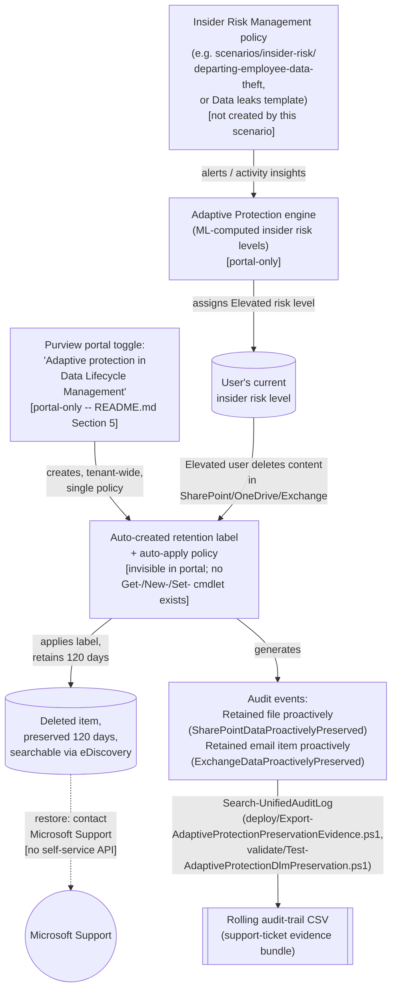

## 1. Problem statement

`scenarios/adaptive-protection/dynamic-risk-dlp-enforcement/` builds the DLP half of Adaptive
Protection (block/audit an Elevated-risk user's *outbound sharing*). That scenario's own §7
(Non-goals) explicitly deferred a second, independent Adaptive Protection integration: a **Data
Lifecycle Management** control that answers a different question entirely, not "can this risky
user share data out," but *"if this risky user deletes something (to cover their tracks, or by
accident), do we still have it?"* This fragment closes that deferred item
(`PROGRESS.md`, "Follow-ups discovered while building the Adaptive Protection dynamic-risk-DLP
scenario").

The control itself, once turned on, needs no configuration and has **no deploy-time object this
library's code can create**, Microsoft states plainly that "you don't need to create or manage
the retention label or auto-labeling retention policy.... The single retention label and
auto-labeling retention policy for your tenant aren't visible in the Microsoft Purview portal"
. This fragment is therefore shaped differently from most of this library's
scenarios: it documents a portal-only opt-in precisely (no fabricated cmdlet or Graph call, see
§4), and ships the code that **is** genuinely scriptable around it, proving the control fired,
and assembling the evidence a Microsoft Support restore request needs, since self-service restore
does not exist for this control (§6).

## 2. Design goals

1. **Do not fabricate an enablement API.** A dedicated grounding pass (Microsoft Learn MCP,
 `microsoft_docs_search`/`microsoft_docs_fetch`, this run) found no `Get-`/`New-`/`Set-` cmdlet
 and no Microsoft Graph resource for this specific opt-in, not a gap in this library's
 research, a genuine absence in Microsoft's own published surface. The single toggle is
 **Microsoft Purview portal → Solutions → Settings → Solution settings → Data lifecycle
 management → Adaptive protection → "Adaptive protection in Data Lifecycle Management"**
. `README.md` §5 documents the exact click path; no script pretends to
 automate it.
2. **Script the part that is genuinely scriptable: proof and evidence, not enablement.** Two
 audit friendly names are documented specifically for this control, **Retained file
 proactively** (`SharePointDataProactivelyPreserved`) for SharePoint/OneDrive and **Retained
 email item proactively** (`ExchangeDataProactivelyPreserved`) for Exchange
, queryable via `Search-UnifiedAuditLog`
, the same automation surface (1) this library's other no-native-API audit
 scenarios already use (`scenarios/ediscovery/premium-legal-hold-and-export/deploy/
 Export-EdiscoveryAuditTrail.ps1`, `scenarios/communication-compliance/
 harassment-and-code-of-conduct/deploy/Export-CommunicationComplianceAuditTrail.ps1`). This
 fragment's own script reuses that exact rolling-CSV, de-duplicated pattern rather than
 inventing a new one.
3. **Treat "restore" as a Microsoft Support workflow, not a self-service one, and design the
 deliverable around that.** Microsoft states admins "contact Microsoft support to restore any
 preserved content", there is no `Restore-` cmdlet, no exposed item ID, and
 the underlying label/policy objects are not queryable. `deploy/Export-
 AdaptiveProtectionPreservationEvidence.ps1`'s output, the rolling audit CSV, is deliberately
 shaped to be the artifact an investigator attaches to that support ticket (who, what workload,
 when, which item path where the audit record carries one), not a restore mechanism this
 library can't build.
4. **Distinguish "the control exists and is on" from "the control just fired for a specific
 user."** Because Microsoft does not expose a status cmdlet, this fragment cannot answer "is
 the toggle currently on" with certainty from PowerShell alone, only "has it visibly fired at
 least once" (a positive signal, not proof either way when the query window is empty, since
 silence is also what "on but no Elevated-risk user has deleted anything yet" looks like).
 `validate/Test-AdaptiveProtectionDlmPreservation.ps1` and `README.md` §7/§11 state this
 distinction explicitly rather than overclaiming a definitive status check.

## 3. Why this belongs in Data Lifecycle Management, not Adaptive Protection or Insider Risk

This library taxonomizes scenarios by the Purview module the *deployed control* lives in
(`AGENTS.md` §2), the same reasoning `scenarios/dlp/exchange-pii-exfil-block/README.md` §11
already used to place a different Adaptive-Protection-adjacent scenario under `dlp/` rather than
`information-protection/`. The mechanism here is a retention label + auto-apply retention policy
, a Data Lifecycle Management object type, even though the trigger condition (Elevated insider
risk level) is computed by Insider Risk Management/Adaptive Protection. `scenarios/
adaptive-protection/dynamic-risk-dlp-enforcement/README.md`'s architecture table and this
scenario cross-link each other rather than duplicate content.

## 4. What's deployed where

| Component | Mechanism | Scriptable? |
|---|---|---|
| Feeder IRM policy + Adaptive Protection insider risk levels | Built/enabled elsewhere, see `scenarios/adaptive-protection/dynamic-risk-dlp-enforcement/design.md` §4 | No, out of scope for this fragment |
| "Adaptive protection in Data Lifecycle Management" opt-in toggle | Purview portal → Solutions → Settings → Solution settings → Data lifecycle management → Adaptive protection | **No**, portal-only; no Graph/PowerShell write surface found during this build |
| The retention label + auto-apply policy itself | Auto-created by the toggle; invisible in the portal, no PowerShell/Graph object to query | **No**, by Microsoft's own design, not a research gap |
| Proof the control fired (audit evidence) | `Search-UnifiedAuditLog -Operations SharePointDataProactivelyPreserved,ExchangeDataProactivelyPreserved` | **Yes**, this scenario's code |
| Restoring preserved content | Contact Microsoft Support | No self-service API, this scenario's code prepares the evidence bundle for that request, not a restore call |

## 5. Data flow

There is no polling, webhook, or export on the *enforcement* side, identical in shape to
`dynamic-risk-dlp-enforcement/design.md` §5: the coupling between Adaptive Protection's risk-level
computation and the retention label's application happens entirely inside the Purview service.
This fragment's own code only ever reads the **audit trail** the service emits as a side effect,
on a schedule the operator chooses (README.md §8 recommends daily, matching the cadence risky
deletions should be triaged on), it never touches the preservation mechanism itself.

**Timing:** up to 36 hours after Adaptive Protection is first turned on before any of its
downstream actions (DLP, Conditional Access, and this DLM control alike) apply to activity
, the same figure `dynamic-risk-dlp-enforcement/design.md` §5 already carries
for the DLP side, since it is a property of the shared Adaptive Protection engine, not of any one
downstream control.

## 6. Key decisions

| Decision | Choice | Rationale |
|---|---|---|
| Deploy-time script that flips the toggle | **None built.** README.md §5 documents the exact manual steps instead. | No Graph/PowerShell surface exists for this action (§2, item 1), fabricating one would violate `AGENTS.md` §4's explicit prohibition on invented cmdlets. |
| What `deploy/` ships instead | `Export-AdaptiveProtectionPreservationEvidence.ps1`, a rolling, de-duplicated audit-trail export scoped to this control's two operations, optionally filtered to one user (for a specific support-ticket evidence pull) | Mirrors this library's established pattern for portal-only controls with a real audit surface (`Export-EdiscoveryAuditTrail.ps1`, `Export-CommunicationComplianceAuditTrail.ps1`), reuses proven idempotency/de-duplication logic rather than inventing a new shape. |
| Audit query surface | `Search-UnifiedAuditLog -Operations SharePointDataProactivelyPreserved,ExchangeDataProactivelyPreserved`, no `-RecordType` | Microsoft's own "Audit log activities" reference lists these two Operations under "Retention policy and retention label activities" without a documented `RecordType` value for them specifically, omitting `-RecordType` rather than guessing one avoids silently under-matching real events (the parameter is optional per the cmdlet's own syntax). |
| Validation approach | `validate/Test-AdaptiveProtectionDlmPreservation.ps1` reports **evidence found / not found** in the lookback window, never **enabled / disabled** | No status cmdlet exists (§2, item 4), asserting a definitive on/off state from an audit-log absence would be a false claim of certainty; a zero-row result is explicitly reported as inconclusive, not `[FAIL]`. |
| Restore workflow | Documented as a Microsoft Support engagement (README.md §9/§11); the evidence script's per-user filter is designed to produce exactly the detail a support ticket needs | Matches Microsoft's own documented recovery path exactly, no restore API exists to script against. |
| Priority Cleanup override mechanism | Out of scope (§7) | A different, unrelated Data Lifecycle Management feature that happens to also apply retention labels "under the covers" and can override holds, mentioned only as a non-goal so a reader doesn't confuse the two. |

## 7. Non-goals

- **This scenario does not enable Adaptive Protection itself, configure Insider Risk Management
 policies, or define insider risk level thresholds.** All portal-only, built/documented
 elsewhere in this library, see `scenarios/adaptive-protection/dynamic-risk-dlp-enforcement/
 design.md` §7 and `scenarios/insider-risk/`.
- **This scenario does not configure the DLP or Conditional Access halves of Adaptive
 Protection.** Those are `scenarios/adaptive-protection/dynamic-risk-dlp-enforcement/` and
 `scenarios/adaptive-protection/conditional-access-insider-risk-block/` respectively.
- **This scenario does not build a restore mechanism.** No self-service restore API is documented
 for content preserved by this control, `README.md` §9 documents the
 Microsoft Support path instead of fabricating one.
- **This scenario does not cover Priority Cleanup.** A separate Data Lifecycle Management feature
 that also applies retention labels internally and can override holds, out
 of scope, tracked as a possible future fragment in `PROGRESS.md` if a buyer need surfaces.
- **Preview status.** Directly re-confirmed via `microsoft_docs_fetch` against the live page
 during this build (not carried over from a stale citation): Microsoft's own retention
 documentation still states *"In preview, you can use this solution with Insider Risk
 Management..."* for this specific integration as of this writing, unlike
 the Conditional Access insider-risk integration this library already re-verified as GA
 (`scenarios/adaptive-protection/conditional-access-insider-risk-block/design.md` §8), this one
 has **not** graduated. `README.md` §11 states this plainly; re-check before a customer-facing
 commitment that depends on GA support terms.

## References

1. Help dynamically mitigate risks with Adaptive Protection (opt-in toggle path, disable behavior,
 36-hour timing, permissions link, Priority Cleanup), <https://learn.microsoft.com/purview/insider-risk-management-adaptive-protection>
2. Learn about retention policies and retention labels, "Dynamically mitigate the risk of
 accidental or malicious deletes" (preview status, 120-day mechanics, not visible in portal,
 restore via Microsoft Support, opt-in/opt-out steps), <https://learn.microsoft.com/purview/retention#retention-policies-and-retention-labels>
, directly re-fetched (not search-snippet-only) during this build.
3. Audit log activities, Retention policy and retention label activities (Operation names
 `SharePointDataProactivelyPreserved` / `ExchangeDataProactivelyPreserved`), <https://learn.microsoft.com/purview/audit-log-activities#retention-policy-and-retention-label-activities>
4. Learn about retention policies and retention labels, "Auditing retention configuration and
 actions" (confirms these are the only two Adaptive-Protection-specific retention-action audit
 events), <https://learn.microsoft.com/purview/retention#auditing-retention-configuration-and-actions>
5. Search-UnifiedAuditLog reference, <https://learn.microsoft.com/powershell/module/exchangepowershell/search-unifiedauditlog>
6. Insider Risk Management permissions (role groups referenced for the Adaptive Protection
 configuration permission this toggle's own page links to), <https://learn.microsoft.com/purview/insider-risk-management-permissions>
