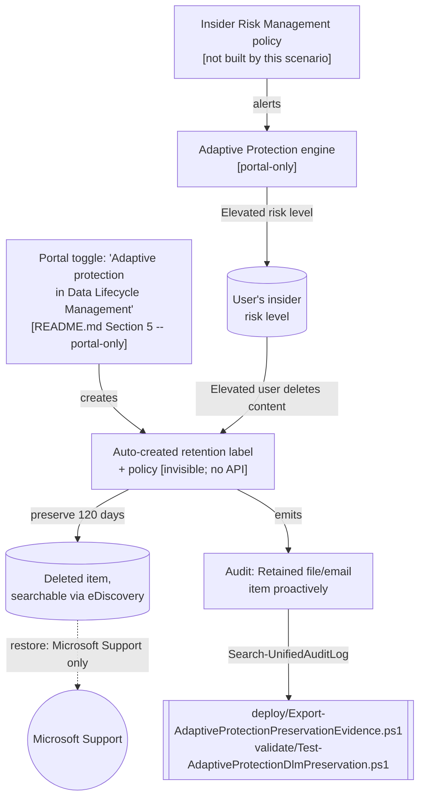

## 1. Scenario summary

Documents and instruments Adaptive Protection's built-in Data Lifecycle Management control: when
Insider Risk Management assigns a user the **Elevated** risk level, any content that user deletes
from SharePoint, OneDrive, or Exchange Online is **automatically preserved for 120 days** —
without an admin having to react in time to place a hold [[1]](#references). The control itself is
a single tenant-wide portal toggle with **no PowerShell or Graph API** — this scenario documents
the exact enablement path precisely (no invented cmdlet) and ships the code that genuinely is
scriptable around it: a rolling audit-trail export that proves the control fired and builds the
evidence bundle a Microsoft Support restore request needs, since self-service restore doesn't
exist.

**Who it's for:** an insider risk / records-management / compliance team that has already
deployed (or is evaluating) `scenarios/adaptive-protection/dynamic-risk-dlp-enforcement/` and
wants the matching "don't lose the evidence if the risky user tries to delete it" control, plus a
way to prove it's working and to prepare for the one recovery path Microsoft supports.

## 2. Business/regulatory driver

Insider risk investigations and litigation both depend on evidence surviving long enough to be
reviewed — an employee who is exfiltrating data or destroying evidence of misconduct has an
obvious incentive to delete the content first. A human analyst reacting after the fact (placing a
hold once a case is escalated) is too slow for the exact window this control exists to close:
Microsoft's own framing is that this proactively preserves content **the moment** a user is
already flagged Elevated-risk, not after an investigator has caught up [[1]](#references). This
complements — and does not replace — `scenarios/insider-risk/departing-employee-data-theft/` (the
detection) and `scenarios/adaptive-protection/dynamic-risk-dlp-enforcement/` (the outbound-sharing
enforcement): together the three form detect → block-sharing → preserve-deletions.

## 3. Prerequisites

Full licensing detail: `docs/licensing-matrix.md`. RBAC: `docs/rbac-model.md`. Automation surface:
`docs/automation-surface.md` (surface 1 — Exchange Online PowerShell, for the audit-evidence
scripts only). Summary:

| Requirement | Minimum | Notes |
|---|---|---|
| Licensing | **Microsoft 365 E5** or **Suite** (Adaptive Protection — built on Insider Risk Management + Data Lifecycle Management) | Same entitlement row as `dynamic-risk-dlp-enforcement` — `docs/licensing-matrix.md` §2, "Adaptive Protection" row. Not a new license requirement if that scenario is already deployed. |
| Feature status | **Preview** as of this writing | Directly re-confirmed via `microsoft_docs_fetch` against the live page during this build: *"In preview, you can use this solution with Insider Risk Management..."* [[1]](#references). Unlike the Conditional Access insider-risk integration (re-verified GA elsewhere in this library), this one has **not** graduated — see §11. |
| Pre-existing dependency | Adaptive Protection already turned on, with Elevated risk level defined and at least one IRM policy in scope | This scenario does not enable Adaptive Protection or configure IRM — see `scenarios/adaptive-protection/dynamic-risk-dlp-enforcement/README.md` §3/§5. |
| Role to enable/disable the toggle | **Insider Risk Management** or **Insider Risk Management Admins** Purview role group | The toggle's own documentation page links to the Adaptive Protection permissions table for "Configure Adaptive Protection and update settings" [[1]](#references)[[3]](#references) — `docs/rbac-model.md` §4. VERIFY: whether the Data Lifecycle Management/Records Management role group is *also* accepted for this specific toggle (it lives under the Data Lifecycle Management solution settings UI, not the Insider Risk Management app) is not stated either way — see §11. |
| Role for the audit-evidence scripts | **View-Only Audit Logs** or **Audit Logs** Exchange Online role | `Search-UnifiedAuditLog` is an Exchange Online cmdlet, not a Purview role group — `docs/rbac-model.md` §6. |
| Auth (scripts only) | `Connect-ExchangeOnline` (certificate app-only preferred) | `docs/automation-surface.md` §3 |

> Verify current entitlement names against `docs/licensing-matrix.md` (dated 2026-09-02) before a
> sales commitment — SKU names change, and preview features can change terms or be withdrawn.

## 4. Architecture



Full rationale, the component-scriptability table, and the timing model: `design.md`.

## 5. Step-by-step implementation

### Enable the control (portal-only — no script exists for this step)

1. Confirm Adaptive Protection is already on for the tenant (`scenarios/adaptive-protection/
   dynamic-risk-dlp-enforcement/README.md` §5). If it was turned on **before** this Data Lifecycle
   Management integration existed in your tenant, the auto-labeling policy is **not** created
   automatically — you must opt in explicitly, which is exactly what the next step does either
   way [[1]](#references).
2. Sign in to the [Microsoft Purview portal](https://purview.microsoft.com/) → **Solutions** →
   **Settings** → **Solution settings** → **Data lifecycle management** → **Adaptive protection**.
3. Turn **"Adaptive protection in Data Lifecycle Management"** **on**, and select **Save**
   [[2]](#references). You will not be able to turn this on unless Adaptive Protection is already
   on for the tenant [[2]](#references).
4. Confirm: the **Adaptive Protection** dashboard's summary tab shows the message *"Your
   organization is also being dynamically protected from users who might potentially delete
   critical data"* [[1]](#references) — the only in-portal confirmation surface; there is no
   dedicated metrics widget for this control [[1]](#references).
5. Allow up to **36 hours** before expecting the control to actually apply to activity
   [[1]](#references).

### PowerShell path (evidence and verification, not enablement)

```powershell
# Connect (certificate app-only preferred - docs/automation-surface.md Section 3)
Connect-ExchangeOnline -AppId $AppId -Certificate $Cert -Organization 'contoso.onmicrosoft.com'

# Prove the control has fired (health check — never asserts a definitive on/off status; see Section 7)
./validate/Test-AdaptiveProtectionDlmPreservation.ps1 -LookbackDays 30

# Build/maintain the rolling audit-evidence trail (dry run first)
./deploy/Export-AdaptiveProtectionPreservationEvidence.ps1 -OutputCsvPath ./out/ap-dlm-preservation.csv -WhatIf
./deploy/Export-AdaptiveProtectionPreservationEvidence.ps1 -OutputCsvPath ./out/ap-dlm-preservation.csv
```

## 6. Configuration reference

| Setting | Value | Notes |
|---|---|---|
| Preservation duration | **120 days**, fixed | Cannot be changed, cannot vary by risk level or location [[1]](#references) |
| Scope | Tenant-wide, single policy | Not a per-user or per-location object; can't be narrowed [[1]](#references) |
| Locations covered | SharePoint, OneDrive, Exchange Online | Not Teams chat, not other workloads [[1]](#references) |
| Trigger | User currently assigned **Elevated** insider risk level by Adaptive Protection, deletes content | Moderate/Minor risk levels do **not** trigger this control [[1]](#references) |
| Enable/disable cmdlet | **None** | Portal-only — §5 |
| Audit Operations | `SharePointDataProactivelyPreserved` ("Retained file proactively"), `ExchangeDataProactivelyPreserved` ("Retained email item proactively") | `Search-UnifiedAuditLog -Operations <these>`, no `-RecordType` value documented specifically for them [[4]](#references)[[5]](#references) |
| Restore path | **Contact Microsoft Support** | No self-service restore cmdlet/API; the evidence CSV this scenario produces is the artifact for that request [[1]](#references) |
| Disable consequence | Releases **all currently-preserved items**, tenant-wide, immediately | Not a pause — see `rollback.md` |

Exact cmdlet syntax and Learn sources are cited in each script's `.NOTES`.

## 7. Validation / how to prove it works

1. **Automated** — `./validate/Test-AdaptiveProtectionDlmPreservation.ps1` searches for the two
   documented audit Operations in a lookback window and reports `[PASS]` if evidence is found.
   **A `[INCONCLUSIVE]` result on zero rows is expected and does not mean the control is off** —
   no status cmdlet exists to check that directly (`design.md` §2, item 4). Confirm the portal
   toggle state directly (§5, step 2–3) if you need a definitive answer.
2. **Portal confirmation** — the Adaptive Protection dashboard's banner message (§5, step 4) is
   the only in-portal signal; there is no dedicated metrics widget [[1]](#references).
3. **End-to-end proof (lab tenant only)** — as a test user assigned the Elevated risk level,
   delete a test file from SharePoint/OneDrive or a test email from Exchange. Wait, then confirm
   (a) an audit event appears via `validate/Test-AdaptiveProtectionDlmPreservation.ps1`, and (b)
   the item is still discoverable via Content Search/eDiscovery from that location, despite being
   user-deleted [[2]](#references). **Do not run this against a real user's content or a
   production tenant** — see §11 on the irreversible consequence of the underlying label.
4. **Evidence export idempotency** — re-run `deploy/Export-AdaptiveProtectionPreservationEvidence.ps1`
   with the same window twice; the CSV row count is unchanged on the second run (de-duplicated by
   composite key), matching this library's other audit-trail export scripts.

## 8. Operations & tuning

**KPIs / signals:** count of preservation events per rolling window (`deploy/
Export-AdaptiveProtectionPreservationEvidence.ps1`'s row count over time) — a sudden spike
correlates with a spike in Elevated-risk-user deletions and should route to the same insider risk
triage process as the feeder IRM policy's own alerts, not be treated as a separate signal.

**Recommended cadence:** run `validate/Test-AdaptiveProtectionDlmPreservation.ps1` and `deploy/
Export-AdaptiveProtectionPreservationEvidence.ps1` **daily** — the daily-scheduled pattern this
scenario's sibling scripts elsewhere in this library already use for rolling audit trails.
Standard Audit's 180-day retention means a daily/weekly cadence keeps the rolling CSV as the
durable record well past the audit log's own retention window (`deploy/
Export-AdaptiveProtectionPreservationEvidence.ps1`'s own `.NOTES`).

**Change management:** because turning the control off releases everything currently preserved
(§6, `rollback.md`), treat any change to this toggle — on or off — as a reviewed, deliberate
action, not routine tuning. There is nothing to "tune" in the control itself (§6, fixed 120 days,
fixed scope). Keep **Insider Risk Management**/**Insider Risk Management Admins** role-group
membership minimal (§11) — that membership is also who can disable this control.

**Alerting:** forward the two audit Operations to your SIEM for near-real-time notification (§11)
rather than relying solely on the daily export/validate cadence above for time-sensitive
investigations. Once a specific user becomes the subject of an actual investigation, escalate to a
real eDiscovery hold (§11) — don't rely on this control alone past that point.

## 9. Rollback / decommission

See `rollback.md`. Quick reference: this scenario's own code has nothing to roll back (read-only).
Disabling the underlying control is a portal action that **immediately releases all currently-
preserved content** — not a pause. Capture a final evidence export and secure anything still
relevant (independent hold or a Microsoft Support restore request) **before** disabling.

## 10. Cost & licensing notes

- **No incremental license** beyond what `scenarios/adaptive-protection/
  dynamic-risk-dlp-enforcement/` already requires (Adaptive Protection = M365 E5/Suite, built on
  Insider Risk Management + Data Lifecycle Management — `docs/licensing-matrix.md` §2).
- **No Azure consumption meter, no per-item cost.** Storage impact is bounded (120-day preservation
  of only what Elevated-risk users actually delete — typically a small fraction of total content,
  unlike an org-wide retention policy).
- **The real cost is the missing self-service restore.** Any recovery requires a Microsoft Support
  engagement — budget the operational lead time for that path, not a self-service SLA.

## 11. Known limitations & gotchas

- **Still in preview.** Directly re-confirmed via `microsoft_docs_fetch` against the live page
  during this build — see §3 and `design.md` §7. Preview features can change behavior or terms
  before GA; do not present this as a fully committed, long-term-supported control in a
  customer-facing SOW without a re-check at deployment time.
- **No enablement API, by Microsoft's own design — not a research gap.** `New-`/`Set-` cmdlets and
  Graph resources were searched for and not found during this build; the underlying label/policy
  are explicitly documented as invisible in the portal and not meant to be created/managed
  directly [[1]](#references).
- **A zero-row evidence check does not mean the control is off.** See §7 — this is the single most
  important caveat in this scenario; do not let an automated `[INCONCLUSIVE]` result be silently
  read as `[PASS]` for "definitely on" or `[FAIL]` for "definitely off" in a dashboard downstream
  of this script's output.
- **No self-service restore.** Recovering preserved content requires contacting Microsoft Support
  [[1]](#references) — plan the operational lead time for an active investigation accordingly.
- **Disabling the toggle is not a pause — it releases everything immediately.** See `rollback.md`.
  This is the opposite behavior from every other retention-policy disable in this library
  (compare `scenarios/data-lifecycle-management/retention-labels-financial-records/rollback.md`
  Stage 1, which explicitly preserves already-labeled content).
- **This control preserves deleted content — it does not stop exfiltration, and it does not cover
  every location.** An Elevated-risk user who copies/uploads content elsewhere *before* deleting
  the local copy has already exfiltrated it; this control only ensures the deletion itself doesn't
  destroy the evidence. It also only covers SharePoint, OneDrive, and Exchange Online (§6) — Teams
  chat messages, Viva Engage, and other workloads are not in scope. Pair this with
  `scenarios/adaptive-protection/dynamic-risk-dlp-enforcement/` (blocks/audits the outbound share
  itself) rather than treating either scenario as sufficient alone.
- **A privileged user who is also the risky user can destroy the evidence by turning the control
  off.** Disabling the toggle releases everything currently preserved, immediately and tenant-wide
  (`rollback.md`) — an Elevated-risk user who also holds the **Insider Risk Management** or
  **Insider Risk Management Admins** role group could disable proactive preservation to cover
  their own tracks. Keep membership in those role groups minimal and separate from the population
  Adaptive Protection monitors — standard least-privilege practice (`docs/rbac-model.md` §2), but
  worth stating explicitly here given the direct consequence. Whether this specific configuration
  change is captured in Insider Risk Management's own internal audit log (viewable by the
  **Insider Risk Management Auditors** role [[3]](#references)) is not confirmed — that log has no
  documented Graph/REST query API this library has found (a known, tracked gap — see
  `PROGRESS.md`), so it cannot be folded into this scenario's own audit-evidence script even if it
  does capture the event.
- **No real-time alert fires when this control preserves an item.** Unlike a DLP incident report,
  there is no push notification — an analyst only learns about it by querying the audit log (§7)
  or reviewing the evidence CSV. For anything beyond periodic review, forward
  `SharePointDataProactivelyPreserved`/`ExchangeDataProactivelyPreserved` unified-audit-log events
  to your SIEM (Microsoft Sentinel or equivalent — `docs/automation-surface.md`'s general
  SIEM-integration guidance) for near-real-time alerting, rather than relying solely on the daily
  scheduled export (§8).
- **Do not treat this as a substitute for an eDiscovery hold on a known, active matter.** This
  control is a tenant-wide safety net that catches deletions *before* anyone has reacted — once an
  investigation is actually opened (e.g. via `scenarios/insider-risk/
  irm-case-escalation-to-ediscovery/`), place a real hold on the specific custodian immediately.
  A preview feature with a fixed 120-day window and no self-service restore is not an adequate
  sole preservation mechanism for content with real litigation exposure.
- **`Search-UnifiedAuditLog`'s `-RecordType`** was deliberately **not** set for the two Operations
  this scenario queries — Microsoft's own "Audit log activities" reference does not document one
  specifically for them (`design.md` §6). If a future grounding pass finds one, adding it would
  only narrow (not change) the result set.
- **VERIFY (pilot tenant, before assuming only Insider Risk Management role members can toggle
  this setting):** whether the Data Lifecycle Management/Records Management Purview role group is
  *also* accepted for the toggle itself, since the control surfaces under the Data Lifecycle
  Management solution settings UI rather than the Insider Risk Management app — Microsoft's own
  page links only to the Adaptive Protection permissions table, which is framed around
  *enabling Adaptive Protection*, not this specific downstream setting (§3).
- **VERIFY (pilot tenant):** the exact `AuditData` field names (`Workload`, `ObjectId`,
  `SourceFileName`) `deploy/Export-AdaptiveProtectionPreservationEvidence.ps1` extracts are
  populated best-effort from the general Search-UnifiedAuditLog schema, not confirmed by a worked
  Microsoft example for these two specific Operations — the raw `AuditData` JSON column is always
  preserved as the ground truth regardless.

## 12. References

1. Help dynamically mitigate risks with Adaptive Protection (120-day mechanic, Elevated-risk
   trigger, toggle path, disable consequence, 36-hour timing, dashboard banner, permissions link,
   no self-service restore) — <https://learn.microsoft.com/purview/insider-risk-management-adaptive-protection>
2. Learn about retention policies and retention labels — "Dynamically mitigate the risk of
   accidental or malicious deletes" (preview status, opt-in requirement, exact turn-on/off portal
   steps, "not visible in the Microsoft Purview portal", eDiscovery-searchable) — <https://learn.microsoft.com/purview/retention#retention-policies-and-retention-labels>
   — directly re-fetched (not search-snippet-only) during this build.
3. Insider Risk Management permissions (role groups) — <https://learn.microsoft.com/purview/insider-risk-management-permissions>
4. Audit log activities — Retention policy and retention label activities (Operation names) — <https://learn.microsoft.com/purview/audit-log-activities#retention-policy-and-retention-label-activities>
5. Search-UnifiedAuditLog reference — <https://learn.microsoft.com/powershell/module/exchangepowershell/search-unifiedauditlog>
6. `docs/licensing-matrix.md` §2 (Adaptive Protection licensing row)
7. `docs/rbac-model.md` §4 (Insider Risk Management/Adaptive Protection role groups), §6 (Exchange
   Online audit-search role dependency)

> Re-verify all links, the preview status, and the permissions VERIFY item against current
> Microsoft Learn before a customer-facing deployment.
