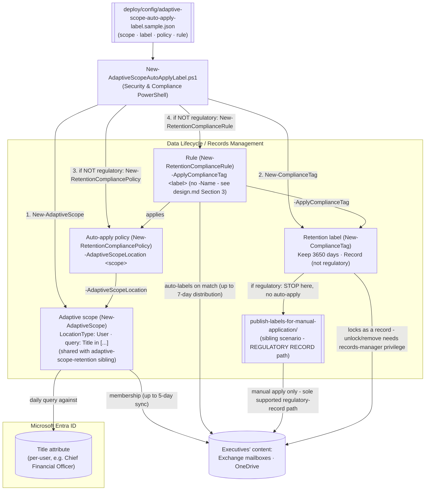

## 1. Scenario summary

Locks executives' Exchange email and OneDrive content as a formal **record** using an **adaptive
scope**, the same daily-refreshed query against the Entra `Title` attribute used by the sibling
`scenarios/data-lifecycle-management/adaptive-scope-retention/` scenario, instead of a Keep-only
retention action or a static SharePoint site. Deployed as code via Security & Compliance PowerShell:
one `New-AdaptiveScope` call (shared with the Keep-only sibling by name), one `New-ComplianceTag`
call (the record label), one `New-RetentionCompliancePolicy -AdaptiveScopeLocation` call, one
`New-RetentionComplianceRule -ApplyComplianceTag` call.

**Who it's for:** a records-management / compliance / IT team that needs a **record**-strength
control (not just retention) for a population defined by an attribute rather than a fixed list, the
auto-apply-label variant explicitly flagged as a follow-up in both sibling scenarios: `adaptive-
scope-retention/design.md` §7 ("An adaptive-scope *auto-apply retention label* policy... the
identical `-AdaptiveScopeLocation` parameter set... supports it directly") and `retention-labels-
financial-records/README.md` §11 ("Adaptive scopes out of scope... large/dynamic estates should use
adaptive scopes").

## 2. Business/regulatory driver

Executive communications are disproportionately relevant to litigation holds, regulatory inquiries,
and internal investigations. A **Keep**-only policy (the sibling scenario) retains them but doesn't
prevent deletion attempts or edits; a **record** label locks the content, it can't be edited or
deleted while the label applies, and can only be unlocked or removed by a user with records-manager
privilege. Combining that record strength with an **adaptive scope** removes the
maintenance burden a static distribution list carries as executives are promoted, hired, or leave, 
Microsoft's own adaptive-scopes guidance uses this exact "executives" example, and its "Automatically
apply a retention label" guidance separately documents adaptive scopes as a supported, production-
recommended input to a retention label policy: "If you decide to use an adaptive policy, you must
create one or more adaptive scopes before you create your retention label policy, and then select
them during the create retention label policy process".

> ⚠️ **Higher irreversibility than the Keep-only sibling, read before deploying.** Removing this
> scenario's policy/rule stops **future** auto-apply only; it does **not** unlock or remove the
> record label from content already labeled (only a records manager can do that; see `rollback.md`).
> Combined with an adaptively-changing population, an over-broad or stale `Title` query now locks the
> **wrong** content as records, not just retains it. Test in a lab tenant, review with `-DryRun`, and
> get Records/Legal sign-off before deploying. See §11.

> ⚠️ **Grounding correction found while building this scenario.** The sibling `retention-labels-
> financial-records/deploy/New-FinancialRecordsRetention.ps1` script passes both `-Name` and
> `-ApplyComplianceTag` to `New-RetentionComplianceRule` in the same call, Microsoft's own reference
> documents these as mutually exclusive ("You can't use this parameter with the ApplyComplianceTag or
> PublishComplianceTag parameters"). This scenario's own deploy script does **not**
> repeat that combination (`design.md` §3); the sibling's defect is tracked as an open follow-up in
> `PROGRESS.md` rather than fixed in this fragment.

## 3. Prerequisites

Full licensing detail: [Licensing matrix](/docs/licensing-matrix/). RBAC: [RBAC model](/docs/rbac-model/). Automation surface:
[Automation surface](/docs/automation-surface/) (surface 2, Security & Compliance PowerShell). Summary:

| Requirement | Minimum | Notes |
|---|---|---|
| Licensing | Adaptive scopes, records management, auto-apply: **M365 E5** (or Information Protection & Governance / Records Management add-on) | This library's own [Licensing matrix](/docs/licensing-matrix/), records management and adaptive scopes are both E5-gated capabilities, unlike basic E3 retention |
| Role | **Scope Manager** role to create the adaptive scope; **Records Management** or **Retention Management** role group to create the label, policy, and rule | [RBAC model](/docs/rbac-model/) |
| Auth | `Connect-IPPSSession` (certificate app-only preferred) | Security & Compliance PowerShell, [Automation surface §3](/docs/automation-surface/#3-authentication-patterns-interactive-vs-unattended) |
| Entra attribute | `Title` (Job title) populated for the target population | Adaptive scopes query existing Entra attributes, no separate group to maintain |
| Records-manager access (for eventual unlock/removal) | **Records Management** role group | Only a records manager can unlock/remove an applied record label, plan for this before deploying, not after |

> Verify current entitlement names against [Licensing matrix](/docs/licensing-matrix/) (dated 2026-09-10) before a
> sales commitment, SKU names change.

## 4. Architecture



Four objects instead of the Keep-only sibling's three: the scope decides **who** (re-evaluated
daily), the label decides **how strong** (record, not just Keep), the policy/rule decide **where and
under what match** the label gets applied. Two independent delays stack, scope population (5 days)
and auto-apply distribution (7 days), so "just deployed" is materially further from "already
covering the intended population" than either sibling alone. Full rationale: `design.md` §4.

## 5. Step-by-step implementation

### PowerShell path

```powershell
# Connect (certificate app-only preferred - docs/automation-surface.md §3)
Connect-IPPSSession -AppId $AppId -Certificate $Cert -Organization 'contoso.onmicrosoft.com'

# 1. Dry run, prints the exact New-AdaptiveScope / New-ComplianceTag / New-RetentionCompliancePolicy / -Rule cmdlets
./deploy/New-AdaptiveScopeAutoApplyLabel.ps1 -ConfigPath ./deploy/config/adaptive-scope-auto-apply-label.json -DryRun

# 2. Deploy the scope + label + policy + rule (after lab test + Records/Legal sign-off)
./deploy/New-AdaptiveScopeAutoApplyLabel.ps1 -ConfigPath ./deploy/config/adaptive-scope-auto-apply-label.json

# 3. Validate (structure now; allow up to 5+7 days before coverage is meaningful)
./validate/Test-AdaptiveScopeAutoApplyLabel.ps1 -ConfigPath ./deploy/config/adaptive-scope-auto-apply-label.json
```

### Portal reference

The scope is visible under **Settings** > **Roles and scopes** > **Adaptive scopes**; the label under
**Records Management** (or **Data Lifecycle Management**) > **File plan**; the policy under **Label
policies**. The portal's create-label-policy flow lets you
select an adaptive scope directly on its own **Choose adaptive policy scopes and locations** step, the
same documented flow the Keep-only sibling's README cites for plain retention policies
, the PowerShell path used here does not expose an equivalent narrower-location
parameter (§11, `design.md` §4). `-WhatIf` is non-functional in S&C PowerShell, so the deploy/remove
scripts ship a `-DryRun` instead.

## 6. Configuration reference

| Setting | Value this scenario uses | Notes |
|---|---|---|
| Scope cmdlet | `New-AdaptiveScope` | Same shape as the Keep-only sibling; reused by name if it already exists |
| Label cmdlet | `New-ComplianceTag` | `-RetentionAction Keep -RetentionDuration 3650 -RetentionType CreationAgeInDays -IsRecordLabel $true` |
| `Regulatory` | `$false` (default) | `$true` creates the label but skips policy/rule creation entirely, auto-apply doesn't support regulatory records |
| Policy cmdlet | `New-RetentionCompliancePolicy -AdaptiveScopeLocation` | Same `AdaptiveScopeLocation` parameter set as the Keep-only sibling, no separate `-ExchangeLocation`/`-OneDriveLocation` toggle (§11) |
| Rule cmdlet | `New-RetentionComplianceRule -Policy -ApplyComplianceTag [-ContentMatchQuery]` | `ComplianceTag` parameter set, **no `-Name`** (documented mutually exclusive with `-ApplyComplianceTag`; §2, `design.md` §3) |
| `ContentMatchQuery` | Empty by default | This scenario targets purely by adaptive scope (population), not a content signal, unlike the financial-records sibling |
| Adaptive scope population | Up to **5 days** | Daily query re-evaluation |
| Auto-apply distribution | Up to **7 days** | Backend batch process, independent of the scope's own delay |
| Membership inspection | `Get-AdaptiveScopeMembers -Identity <scope> -State Added` | Paged; don't use `-PageResultSize Unlimited` on large scopes |

Exact cmdlet syntax and Learn sources are cited in each script's `.NOTES`.

## 7. Validation / how to prove it works

1. **Automated**, `./validate/Test-AdaptiveScopeAutoApplyLabel.ps1` confirms the scope, label exist
 with expected settings; for a non-regulatory label, also that the policy/rule exist, the policy
 references the scope, and the rule applies the expected label. For a regulatory-record config, it
 confirms the policy was correctly **not** created rather than treating its absence as a failure.
 Exits non-zero on hard failure.
2. **Membership sample**, the validate script also prints (informational, non-failing) a small
 `Get-AdaptiveScopeMembers` sample so you can sanity-check actual population coverage.
3. **Idempotency proof**, re-run the deploy; every object reports `exists` (not `created`) and
 nothing is duplicated or silently mutated.
4. **Population + distribution timing**, allow up to 5 days for the adaptive scope's query to
 populate, **then** up to a further 7 days for auto-apply distribution to actually label matching
 content, these are independent, stacking delays; do not
 expect same-week coverage.
5. **Lock test (lab tenant)**, apply the label to a test item in a location the scope covers, then
 confirm you **cannot** edit or delete it while it's a record; confirm a records manager (and only a
 records manager) can unlock/remove it.
6. **Query correctness (lab tenant)**, validate the equivalent OPATH filter directly against Exchange
 Online PowerShell before deploying, e.g.
 `Get-Recipient -RecipientTypeDetails UserMailbox,MailUser -Filter {Title -eq "Chief Financial Officer"} -ResultSize Unlimited`.

## 8. Operations & tuning

**KPIs / signals:** policy **DistributionStatus**; adaptive scope member count over time
(`Get-AdaptiveScopeMembers` or the portal's Scope details export); count of items labeled over time
(content search, or Data Lifecycle/Records Management reports); count of `Title` values that don't
map cleanly to "executive" (an upstream HR/Entra data-quality signal, same as the Keep-only sibling).
**Tuning:** review the `Title` value list periodically, the consequence of a stale query is now
record-strength, not just retention-strength, so treat this review as higher-priority than the
Keep-only sibling's equivalent task. Keep the auto-apply targeting scope-only (no content query) or,
if you add one, keep it narrow, precision matters more than recall once matches get locked as
records.

**Change management:** the scope's query, the label's settings, and the policy/rule are all
version-controlled in the config file, treat any change as deliberate and reviewed, never edited ad
hoc in the portal, and route label/policy changes through Records/Legal given the record-strength
consequence.

**Audit signal for scope or policy tampering (Blue Team, see `reviews.md`):** the unified audit log
records adaptive-scope changes (`NewAdaptiveScope`, `SetAdaptiveScope`, `RemoveAdaptiveScope`,
`ApplicableAdaptiveScopeChange`) and retention-policy/rule changes
(`NewRetentionCompliancePolicy`/`SetRetentionCompliancePolicy`/`RemoveRetentionCompliancePolicy` and
the matching `*RetentionComplianceRule` operations) as distinct, named operations, the same set the
Keep-only sibling's README §8 cites. Alert on `SetAdaptiveScope` against this
scenario's scope name outside a known change window, the same detection this scenario's scope-
sharing design makes doubly important, since a tampered query now affects **two** scenarios' worth of
coverage (Keep-only retention and record-strength labeling) if both are deployed. The exact
`RecordType` value to pre-filter the same `Search-UnifiedAuditLog` query is not asserted here, VERIFY
before building a saved query, rather than guessing one, same disclosure as the Keep-only sibling.

## 9. Rollback / decommission

See `rollback.md`. Quick reference: `./deploy/Remove-AdaptiveScopeAutoApplyLabel.ps1` **disables** the
policy by default (stops new content from being auto-labeled); `-Delete` removes the policy+rule
(future auto-apply stops; content already labeled as a record is **unchanged**, this is the key
difference from the Keep-only sibling, whose rollback genuinely releases retention);
`-Delete -TryRemoveScope` also attempts to remove the adaptive scope, but only if nothing else
references it (including the Keep-only sibling, if both share this scope name in your tenant). The
label definition and any already-labeled content are never touched by this script, unlocking or
removing an applied record label is a deliberate records-manager action, out of scope here.

## 10. Cost & licensing notes

- **Per-user E5 entitlement** for both adaptive scopes and records management specifically, neither
 is covered by the E3 baseline. No separate Azure consumption meter.
- **Cost is licensing + governance discipline + eventual unlock/removal overhead**, more so than the
 Keep-only sibling: locked records that later need correcting (e.g., a person was wrongly matched by
 the query) require a records manager's time to unlock/remove, not just a policy edit.
- **The expensive mistake compounds with the adaptive combination specifically:** a stale or
 over-broad query doesn't just under/over-retain (Keep-only sibling), it locks the wrong content as
 records, which is materially more expensive to walk back. Budget records-manager review time
 proportional to how aggressively the `Title` query is scoped.

## 11. Known limitations & gotchas

- **Corrected grounding defect vs. the financial-records sibling (see §2 and `design.md` §3):**
 `New-RetentionComplianceRule`'s `-Name` parameter is documented mutually exclusive with
 `-ApplyComplianceTag`. The sibling `retention-labels-financial-records/deploy/
 New-FinancialRecordsRetention.ps1` passes both together, a defect, tracked as an open follow-up in
 `PROGRESS.md`, not fixed in this fragment. This scenario's own script does not repeat it.
- **Genuine parameter-surface gap, disclosed rather than guessed (VERIFY, pilot tenant), same as the
 Keep-only sibling:** `New-RetentionCompliancePolicy`'s `AdaptiveScopeLocation` parameter set has no
 documented `-ExchangeLocation`/`-OneDriveLocation`/`-SharePointLocation` equivalent. Which of the
 scope's covered locations the policy actually applies to is not exposed as a documented parameter, 
 confirm in a pilot tenant before a customer-facing deployment (`design.md` §4).
- **Two delays stack, not one.** Adaptive scope population (up to 5 days) and auto-apply distribution
 (up to 7 days) are independent processes, a newly deployed config can look fully configured while
 genuinely covering zero content for up to (roughly) two weeks. Don't mistake "validate passes" for
 "content is labeled."
- **Rollback does not undo labeling.** Disabling or deleting the policy/rule stops **future** auto-
 apply only. Content already locked as a record stays locked; only a records manager can unlock or
 remove it (`rollback.md`).
- **Whoever can edit the `Title` attribute controls who gets record-locked (see `reviews.md` Red Team
 finding).** Same attribute-tampering exposure as the Keep-only sibling, but the consequence here is
 stronger: a manipulated `Title` value can cause the wrong person's content to be locked as a record,
 not just retained. Source `Title` from an authoritative HR feed, and monitor
 `SetAdaptiveScope`/`ApplicableAdaptiveScopeChange` (§8).
- **`Get-AdaptiveScopeMembers`'s result-metadata property names aren't documented**, same disclosed
 gap as the Keep-only sibling; the validate script prints them generically (`Format-List`).
- **`-WhatIf` is non-functional in S&C PowerShell**, the scripts ship a `-DryRun` instead.
- **Idempotency is create-or-report, not create-or-update.** No object here is silently modified on
 re-run, edit deliberately (`Set-AdaptiveScope`/`Set-ComplianceTag`/`Set-RetentionCompliancePolicy`)
 if settings must change.
- **Adaptive scopes are shared objects.** Removing the scope can affect the Keep-only sibling (and any
 Insider Risk Management or Communication Compliance policy) if they reference the same scope name, 
 check before `-TryRemoveScope`.
- **This is a governance/records baseline, not a litigation hold.** For a matter-specific hold, use
 `scenarios/ediscovery/`, complementary, not a substitute, same distinction the Keep-only sibling
 draws.
- **Illustrative values.** The executive `Title` list, the 10-year duration, the record-vs-regulatory
 choice, and the object names are placeholders, validate against your actual executive-role
 taxonomy and records-retention obligation with HR/Legal/Records before deploying.

## 12. References

1. Declare records by using retention labels (record vs. regulatory record; removal requires records-manager privilege for a record, impossible for anyone for a regulatory record), <https://learn.microsoft.com/purview/declare-records>
2. Automatically apply a retention label to retain or delete content (adaptive scopes explicitly documented as a supported, recommended input to a retention label policy; up to 7-day auto-apply latency; "isn't supported for regulatory records... require a published retention label policy"), <https://learn.microsoft.com/purview/apply-retention-labels-automatically>
3. Adaptive scopes, configuration, attributes, and up to 5-day population delay, <https://learn.microsoft.com/purview/purview-adaptive-scopes>
4. Adaptive scopes, portal location (Settings > Roles and scopes > Adaptive scopes), <https://learn.microsoft.com/purview/purview-adaptive-scopes#how-to-configure-an-adaptive-scope>
5. Get started with records management in Microsoft 365 (File plan / Label policies portal location), <https://learn.microsoft.com/purview/get-started-with-records-management>
6. New-ComplianceTag (retention label; -RetentionAction/-RetentionDuration/-RetentionType/-IsRecordLabel/-Regulatory), <https://learn.microsoft.com/powershell/module/exchangepowershell/new-compliancetag>
7. Microsoft Purview service description, records management / adaptive scopes licensing (E5), this repo's [Licensing matrix](/docs/licensing-matrix/), grounded from <https://learn.microsoft.com/office365/servicedescriptions/microsoft-365-service-descriptions/microsoft-365-tenantlevel-services-licensing-guidance/microsoft-purview-service-description>
8. New-RetentionComplianceRule (`-Name` documented mutually exclusive with `-ApplyComplianceTag`/`-PublishComplianceTag`; `ComplianceTag` parameter set), <https://learn.microsoft.com/powershell/module/exchangepowershell/new-retentioncompliancerule>
9. New-RetentionCompliancePolicy (`AdaptiveScopeLocation` parameter set), <https://learn.microsoft.com/powershell/module/exchangepowershell/new-retentioncompliancepolicy>
10. Audit log activities, retention policy and retention label activities, <https://learn.microsoft.com/purview/audit-log-activities#retention-policy-and-retention-label-activities>

> Re-verify all links, cmdlet parameters, and licensing against current Microsoft Learn before a
> customer-facing deployment, the location-granularity gap (§11) and the `-Name`/`-ApplyComplianceTag`
> correction (§2, `design.md` §3) in particular should be confirmed in a pilot tenant, not assumed.
