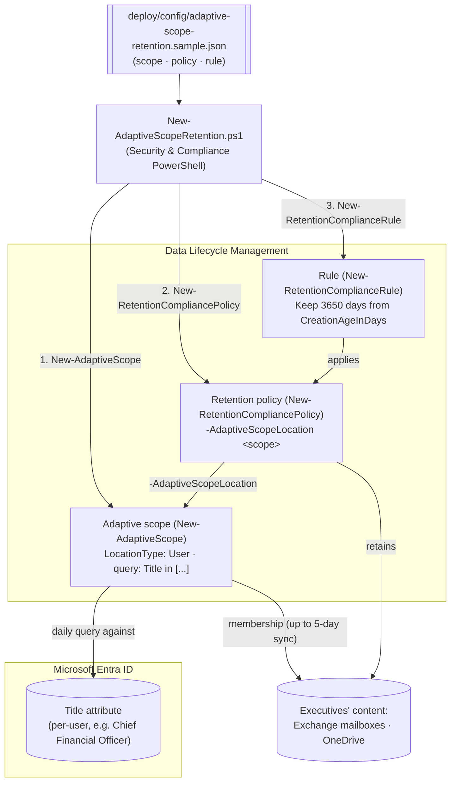

## 1. Scenario summary

Retains executives' Exchange email and OneDrive content for a fixed period using an **adaptive
scope**, a daily-refreshed query against the Entra `Title` attribute, instead of a static
distribution list or SharePoint site that someone has to maintain by hand as people are promoted,
hired, or leave. Deployed as code via Security & Compliance PowerShell: one `New-AdaptiveScope`
call, one `New-RetentionCompliancePolicy -AdaptiveScopeLocation` call, one `Keep`-only
`New-RetentionComplianceRule`.

**Who it's for:** a records-management / compliance / IT team at a large or fast-changing
organization that needs different retention settings for a population defined by an attribute
(job title, department, country/region) rather than a fixed list, the follow-up pattern flagged in
the sibling `scenarios/data-lifecycle-management/retention-labels-financial-records/` scenario for
"large/dynamic estates."

## 2. Business/regulatory driver

Executives' communications are disproportionately relevant to litigation holds, regulatory
inquiries, and internal investigations, many organizations retain them longer than the standard
population as a corporate-governance and litigation-readiness baseline. The operational problem
with a static scope for this population is turnover: a distribution list or explicit mailbox list
requires someone to notice every promotion, hire, and departure and edit the policy. Microsoft's
own documented adaptive-scopes guidance uses this exact scenario as its worked example: "For new
executives, there's no need to reconfigure the retention policy because these new users... are
automatically picked up". This scenario builds that pattern as reproducible
code, generalizable to any attribute-driven population (department, country/region, a
custom Entra extension attribute).

> ⚠️ **Lower irreversibility than a record label, but not zero risk.** This scenario is `Keep`-only
>, not a record or regulatory record, so rollback genuinely releases retention rather than
> leaving content locked (see `rollback.md`). The real risk here is **scope precision**: an
> over-broad or stale `Title` query retains (or fails to retain) the wrong population. Validate
> actual scope membership (`Get-AdaptiveScopeMembers`) before relying on this operationally, and
> allow up to 5 days for the query to populate after any change.

## 3. Prerequisites

Full licensing detail: [Licensing matrix](/docs/licensing-matrix/). RBAC: [RBAC model](/docs/rbac-model/). Automation surface:
[Automation surface](/docs/automation-surface/) (surface 2, Security & Compliance PowerShell). Summary:

| Requirement | Minimum | Notes |
|---|---|---|
| Licensing | Adaptive scopes, auto-apply, trainable-classifier retention: **M365 E5** (or Information Protection & Governance add-on) | This library's own [Licensing matrix](/docs/licensing-matrix/), basic Data Lifecycle Management is E3, but adaptive scopes specifically require E5/IP&G |
| Role | **Scope Manager** role (included in the Records Management, Compliance Administrator, Compliance Data Administrator, Organization Management, Communication Compliance / Communication Compliance Admins role groups) to create the scope; **Retention Management**/**Records Management** role group to create the policy/rule | [RBAC model](/docs/rbac-model/) |
| Auth | `Connect-IPPSSession` (certificate app-only preferred) | Security & Compliance PowerShell, [Automation surface §3](/docs/automation-surface/#3-authentication-patterns-interactive-vs-unattended) |
| Entra attribute | `Title` (Job title) populated for the target population | Adaptive scopes query existing Entra attributes, no separate group to maintain |
| Administrative units (optional) | Entra ID P1/P2, if restricting the scope to a delegated boundary | Not exercised in the sample config, `design.md` §7 |

> Verify current entitlement names against [Licensing matrix](/docs/licensing-matrix/) (dated 2026-09-10) before a
> sales commitment, SKU names change.

## 4. Architecture



The scope's query decides **who** (re-evaluated daily against Entra); the policy/rule decide **how
long and what happens** (`Keep`, 3650 days). Unlike a static-scope policy, no location list or
mailbox list is maintained by hand. Full rationale, including the disclosed parameter-surface gap
on which *locations* an adaptive-scope policy actually covers: `design.md` §4.

## 5. Step-by-step implementation

### PowerShell path

```powershell
# Connect (certificate app-only preferred - docs/automation-surface.md §3)
Connect-IPPSSession -AppId $AppId -Certificate $Cert -Organization 'contoso.onmicrosoft.com'

# 1. Dry run, prints the exact New-AdaptiveScope / New-RetentionCompliancePolicy / -Rule cmdlets
./deploy/New-AdaptiveScopeRetention.ps1 -ConfigPath ./deploy/config/adaptive-scope-retention.json -DryRun

# 2. Deploy the scope + policy + rule
./deploy/New-AdaptiveScopeRetention.ps1 -ConfigPath ./deploy/config/adaptive-scope-retention.json

# 3. Validate (structure now; allow up to 5 days before membership/distribution are meaningful)
./validate/Test-AdaptiveScopeRetention.ps1 -ConfigPath ./deploy/config/adaptive-scope-retention.json
```

### Portal reference

The scope is visible under **Settings** > **Roles and scopes** > **Adaptive scopes**; the policy
under **Data Lifecycle Management** > **Policies** > **Retention policies**
. The portal's create-policy flow also lets you pick which
locations an adaptive-scope policy covers on a **Choose adaptive policy scopes and locations**
page, the PowerShell path used here does not expose an equivalent parameter
(§11, `design.md` §4). `-WhatIf` is non-functional in S&C PowerShell, so the deploy/remove scripts
ship a `-DryRun` instead.

## 6. Configuration reference

| Setting | Value this scenario uses | Notes |
|---|---|---|
| Scope cmdlet | `New-AdaptiveScope` | Adaptive scope |
| `LocationType` | `User` | Also `Group` (M365 Groups) or `Site` (SharePoint); each supports different attributes |
| `FilterConditions` | Hashtable: `Conditions` (`Name`/`Operator`/`Value`) + `Conjunction` | Simple-query-builder shape; `Operator`: `Equals`/`NotEquals`/`StartsWith`/`NotStartsWith`. `-RawQuery` (OPATH for User/Group, KeyQL for Site) is the advanced-query alternative, not used by default |
| Policy cmdlet | `New-RetentionCompliancePolicy -AdaptiveScopeLocation` | AdaptiveScopeLocation parameter set, no separate `-ExchangeLocation`/`-OneDriveLocation` toggles (§11) |
| Rule cmdlet | `New-RetentionComplianceRule` | `-RetentionDuration`/`-RetentionComplianceAction`/`-ExpirationDateOption`, no `-ApplyComplianceTag` (this is a plain retention rule, not a label) |
| `RetentionComplianceAction` | `Keep` | `Keep` / `Delete` / `KeepAndDelete` |
| `RetentionDuration` | `3650` (~10 years) | Illustrative litigation-readiness baseline; tune to your obligation |
| `ExpirationDateOption` | `CreationAgeInDays` | When the clock starts |
| Adaptive scope population | Up to **5 days** | Daily query re-evaluation; changes aren't immediate |
| Membership inspection | `Get-AdaptiveScopeMembers -Identity <scope> -State Added` | Paged; don't use `-PageResultSize Unlimited` on large scopes |

Exact cmdlet syntax and Learn sources are cited in each script's `.NOTES`.

## 7. Validation / how to prove it works

1. **Automated**, `./validate/Test-AdaptiveScopeRetention.ps1` confirms the scope exists with the
 expected `LocationType`, the policy exists/enabled and references the scope, and the rule
 applies the expected duration/action. Exits non-zero on failure.
2. **Membership sample**, the validate script also prints (informational, non-failing) a small
 `Get-AdaptiveScopeMembers` sample so you can sanity-check actual coverage.
3. **Idempotency proof**, re-run the deploy; the scope/policy/rule report `exists` (not `created`)
 and nothing is duplicated or silently mutated.
4. **Population/distribution timing**, allow up to 5 days for the adaptive scope's query to
 populate, then confirm actual scope membership in the portal (**Adaptive
 scopes** > select the scope > **Scope details**) or via
 `Get-AdaptiveScopeMembers -Identity <scope> -State Added` before treating retention as "live"
 for the intended population.
5. **Query correctness (lab tenant)**, before deploying, validate the equivalent OPATH filter
 directly against Exchange Online PowerShell, e.g.
 `Get-Recipient -RecipientTypeDetails UserMailbox,MailUser -Filter {Title -eq "Chief Financial Officer"} -ResultSize Unlimited`,
 and compare the result to what you expect the scope to match.

## 8. Operations & tuning

**KPIs / signals:** policy **DistributionStatus**; adaptive scope member count over time (via the
portal's Scope details export, or `Get-AdaptiveScopeMembers`); count of `Title` values that don't
map cleanly to "executive" (a data-quality signal upstream in Entra/HR, not a Purview problem).
**Tuning:** review the `Title` value list periodically, job-title strings drift (new titles,
localized variants) and a scope query that isn't updated silently under-covers the intended
population; this is the adaptive-scope equivalent of "the distribution list went stale," just
quieter. Widening the query (`StartsWith` instead of exact `Equals`, or adding synonyms) trades
precision for recall, validate before widening.

**Change management:** the scope's query and the policy's retention settings are both
version-controlled in the config file, treat any change the same as any other retention-object
change: deliberate, reviewed, and re-deployed rather than edited ad hoc in the portal.

**Audit signal for scope tampering (Blue Team, see `reviews.md`):** the unified audit log records
adaptive-scope and retention-policy configuration changes as distinct, named operations, 
`NewAdaptiveScope`, `SetAdaptiveScope` ("Administrator changed the description or query for an
existing adaptive scope"), `RemoveAdaptiveScope`, and `ApplicableAdaptiveScopeChange` ("Users,
sites, or groups were added to or removed from the adaptive scope... Because the changes are
system-initiated, the reported user displays as a GUID rather than a user account"), alongside
`NewRetentionCompliancePolicy`/`SetRetentionCompliancePolicy`/`RemoveRetentionCompliancePolicy`
and the matching `*RetentionComplianceRule` operations. Alert on
`SetAdaptiveScope` against this scenario's scope name outside a known change window, a query
edit is the mechanism by which someone could narrow coverage (see `reviews.md` Red Team finding
2). `Search-UnifiedAuditLog -Operations SetAdaptiveScope,RemoveAdaptiveScope` (add
`-UserIds`/date range as needed) surfaces these; the exact `RecordType` value to pre-filter the
same query is not asserted here, VERIFY against `Search-UnifiedAuditLog`'s supported record
types before building a saved query, rather than guessing one.

## 9. Rollback / decommission

See `rollback.md`. Quick reference: `./deploy/Remove-AdaptiveScopeRetention.ps1` **disables** the
policy by default (stops new/changed content from being retained); `-Delete` removes the
policy+rule and, because this is `Keep`-only, not a record, genuinely **releases** the retention
already in force; `-Delete -TryRemoveScope` also attempts to remove the
adaptive scope itself, but only if nothing else references it (adaptive scopes are shared,
reusable objects across retention, Insider Risk Management, and Communication Compliance policies).

## 10. Cost & licensing notes

- **Per-user E5 entitlement** (or the Information Protection & Governance add-on), adaptive
 scopes specifically require E5, not just the E3 baseline that covers static-scope Data Lifecycle
 Management. No separate Azure consumption meter.
- **Cost is licensing + governance discipline, not storage growth** for this scenario in
 particular: a 10-year `Keep`-only policy on a small executive population is a modest storage
 delta compared to org-wide retention, the real cost driver is keeping the query accurate over
 time (§8), not infrastructure.
- **The expensive mistake is a stale or over-broad query**, not over-scoping a static list, the
 failure mode moves from "someone forgot to update the distribution list" to "the query no longer
 matches reality," which is easier to miss because nothing visibly breaks (§11).

## 11. Known limitations & gotchas

- **Genuine parameter-surface gap, disclosed rather than guessed (VERIFY, pilot tenant):**
 `New-RetentionCompliancePolicy`'s `AdaptiveScopeLocation` parameter set exposes
 `-AdaptiveScopeLocation` and `-Applications` only, no documented `-ExchangeLocation`/
 `-OneDriveLocation`/`-SharePointLocation` equivalent the way the static parameter set has. Which
 of the scope's covered `User`-type locations (Exchange mailboxes, OneDrive, Teams chats, Copilot
 experiences, etc.) the policy actually applies to is not exposed as a documented parameter on
 this cmdlet, even though the portal's own flow implies per-policy location selection. Confirm the
 actual applied-locations behavior in a pilot tenant before a customer-facing deployment, 
 `design.md` §4.
- **`Get-AdaptiveScopeMembers`'s result-metadata property names aren't documented.** Microsoft's
 reference describes the first returned element as carrying total-count/paging metadata but
 doesn't name its properties; `validate/Test-AdaptiveScopeRetention.ps1`'s membership sample prints
 it generically (`Format-List`) rather than guessing a property name.
- **Up to 5-day population delay, and it's not instant to change either.** A newly created or
 edited adaptive scope's membership isn't immediate, don't expect a same-day roster, and don't
 assume the portal's Scope details view and a live `Get-AdaptiveScopeMembers` query will agree
 within that window.
- **`-WhatIf` is non-functional in S&C PowerShell**, the scripts ship a `-DryRun` instead.
- **Idempotency is create-or-report, not create-or-update.** The deploy locates objects by name
 and does **not** silently modify an existing scope/policy/rule, edit deliberately (`Set-
 AdaptiveScope`/`Set-RetentionCompliancePolicy`) if the query or retention settings must change.
- **Adaptive scopes are shared objects.** The same scope can be reused by other retention
 policies, Insider Risk Management policies, and Communication Compliance policies, don't remove
 one without checking what else references it (`rollback.md`).
- **`Skype for Business` and `Exchange public folders` don't support adaptive scopes at all**, use
 a static scope for those locations.
- **Whoever can edit the `Title` attribute controls who's in scope (see `reviews.md` Red Team
 finding 2).** Because membership is entirely attribute-driven, anyone who can write a user's
 `Title` in Entra ID (self-service profile edit, an HR system sync with lax field ownership, or an
 admin) can add or remove that user from retention within the scope's own re-evaluation window.
 Source `Title` from an authoritative HR feed rather than self-service profile edit, and monitor
 `SetAdaptiveScope`/`ApplicableAdaptiveScopeChange` (§8), this scenario does not otherwise defend
 against it.
- **This is `Keep`-only by design**, no record/regulatory-record semantics here; pair with
 `scenarios/data-lifecycle-management/retention-labels-financial-records/` if immutability is
 also required for part of this population.
- **This is a governance baseline, not a litigation hold.** A `Keep`-only retention policy retains
 content on a schedule the org set in advance; it is not scoped to a matter, does not notify
 custodians, and is not the control an active investigation or legal matter should rely on. For a
 specific matter, use an eDiscovery hold (`scenarios/ediscovery/`), the two are complementary,
 not substitutes.
- **Illustrative values.** The executive `Title` list, the 10-year duration, and the policy/scope
 names are placeholders, set them to your actual executive-role taxonomy and retention
 obligation, validated by HR/Legal, before deploying.

## 12. References

1. Learn about retention policies and retention labels, adaptive-scope "executives" example, <https://learn.microsoft.com/purview/retention#adaptive-or-static-policy-scopes-for-retention>
2. Adaptive scopes, up to 5 days for queries to populate/reflect changes, <https://learn.microsoft.com/purview/purview-adaptive-scopes#how-to-configure-an-adaptive-scope>
3. Microsoft Purview service description, Data Lifecycle Management adaptive scopes/auto-apply licensing (E5/IP&G), this repo's [Licensing matrix](/docs/licensing-matrix/), grounded from <https://learn.microsoft.com/office365/servicedescriptions/microsoft-365-service-descriptions/microsoft-365-tenantlevel-services-licensing-guidance/microsoft-purview-service-description>
4. Adaptive scopes, scope types and supported attributes/properties table, <https://learn.microsoft.com/purview/purview-adaptive-scopes#configure-adaptive-scopes>
5. Adaptive scopes, portal location (Settings > Roles and scopes > Adaptive scopes), <https://learn.microsoft.com/purview/purview-adaptive-scopes#how-to-configure-an-adaptive-scope>
6. Create and configure retention policies, adaptive policy scope/location selection in the portal, <https://learn.microsoft.com/purview/create-retention-policies#create-and-configure-a-retention-policy>
7. New-AdaptiveScope (-Name/-LocationType/-FilterConditions/-RawQuery), <https://learn.microsoft.com/powershell/module/exchangepowershell/new-adaptivescope>
8. New-RetentionCompliancePolicy (AdaptiveScopeLocation parameter set), <https://learn.microsoft.com/powershell/module/exchangepowershell/new-retentioncompliancepolicy>
9. New-RetentionComplianceRule (-RetentionDuration/-RetentionComplianceAction/-ExpirationDateOption), <https://learn.microsoft.com/powershell/module/exchangepowershell/new-retentioncompliancerule>
10. Get-AdaptiveScopeMembers (-Identity/-State/-PageResultSize; paging, don't use Unlimited on large scopes), <https://learn.microsoft.com/powershell/module/exchangepowershell/get-adaptivescopemembers>
11. Adaptive scopes, validating advanced queries via PowerShell (Get-Recipient/Get-Mailbox/Get-User with -Filter), <https://learn.microsoft.com/purview/purview-adaptive-scopes#to-run-a-query-by-using-powershell>
12. Remove-RetentionComplianceRule ("causes the release of all Exchange mailbox and SharePoint site retentions that are associated with the rule"), <https://learn.microsoft.com/powershell/module/exchangepowershell/remove-retentioncompliancerule>
13. Learn about retention policies and retention labels, Skype for Business / Exchange public folders don't support adaptive scopes, <https://learn.microsoft.com/purview/retention#adaptive-or-static-policy-scopes-for-retention>
14. Audit log activities, retention policy and retention label activities, incl. `SetAdaptiveScope`/`ApplicableAdaptiveScopeChange`/`NewAdaptiveScope`/`RemoveAdaptiveScope`, <https://learn.microsoft.com/purview/audit-log-activities#retention-policy-and-retention-label-activities>

> Re-verify all links, cmdlet parameters, and licensing against current Microsoft Learn before a
> customer-facing deployment, the AdaptiveScopeLocation location-granularity gap in particular
> (§11) should be confirmed in a pilot tenant, not assumed.
