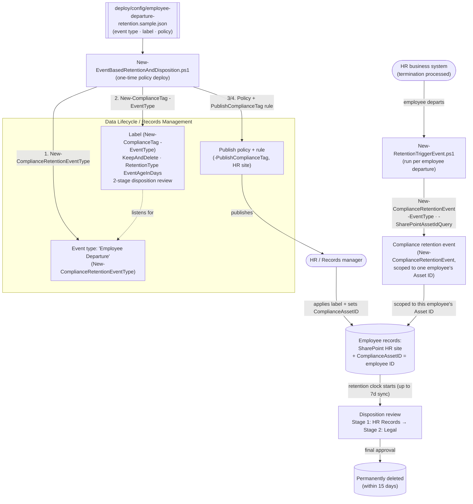

## 1. Scenario summary

Creates a **retention event type**, an **event-based retention label** (`KeepAndDelete`, retention
clock starts on an *event* rather than content creation/modification date, with a **two-stage
disposition review**), and a **publish** label policy so HR/Records can manually apply the label —
plus an operational script that fires the triggering event for one departed employee, as code, via
Security & Compliance PowerShell. This is the event-driven, human-reviewed sibling to this module's
`retention-labels-financial-records` starter (which auto-applies a `Keep`-only regulatory record
label from content signals).

**Who it's for:** an HR / records-management / compliance team that must retain a departed
employee's personnel, hiring, performance, and termination records for a fixed period **measured
from the date they leave** — not from when each document was created — and requires human sign-off
(HR, then Legal) before those records are ever permanently deleted.

## 2. Business/regulatory driver

Employee-record retention obligations are typically expressed as a period **after separation**, not
after document creation — Microsoft's own event-based-retention guidance uses this exact shape as
its lead example: *"employee records must be retained for 10 years from the time an employee leaves
the organization... the event that triggers the... retention period is the employee leaving the
organization"* [[1]](#references). A creation-age or modification-age retention clock can't express
that; only an **event-based** retention label can, because the clock starts when you tell Purview
the event happened — which can be a past, present, or future date [[1]](#references).

The second half of the driver is **defensible disposition**: many jurisdictions' employment-records
obligations, and most internal records-governance policies, expect a **human review** before
terminated-employee records are permanently destroyed — not silent auto-deletion — so that legal
hold, active dispute, or a data-subject request can intercept the deletion. Microsoft's disposition
review mechanism, with up to five stages and up to 10 reviewers per stage (individual users and/or
mail-enabled security groups — Microsoft 365 groups aren't supported for this option), is built for
exactly this [[3]](#references). This scenario models a realistic two-stage chain (HR Records, then
Legal) rather than the sibling scenario's single-approver `Keep`-only pattern.

> ⚠️ **Set the real retention duration and the real reviewers before deploying.** The 10-year
> duration mirrors Microsoft's own illustrative example [[1]](#references), not a specific statute —
> your organization's actual post-departure employee-record retention obligation (which varies by
> jurisdiction, record type, and whether benefits/tax records are involved) must come from your
> Legal/HR compliance function, not this repo. See §11.

## 3. Prerequisites

Full licensing detail: `docs/licensing-matrix.md`. RBAC: `docs/rbac-model.md`. Automation surface:
`docs/automation-surface.md` (surface 2 — Security & Compliance PowerShell). Summary:

| Requirement | Minimum | Notes |
|---|---|---|
| Licensing | Retention labels/policies: **M365 E3**; records management (event-based retention, disposition review, record labels): **M365 E5 / E5 Compliance / Purview Suite** | Event-based retention and disposition review are Records Management (E5) capabilities [[8]](#references) |
| Role | **Records Management** role group (RecordManagement, Retention Management, Disposition Management, Scope Manager roles) | To create event types, labels, policies, rules, and to fire events — `docs/rbac-model.md` |
| Auth | `Connect-IPPSSession` (certificate app-only preferred) | Security & Compliance PowerShell — `docs/automation-surface.md` §3 |
| Disposition reviewer permissions | Reviewers named in the label (or added later) need Disposition Management-equivalent access | Adding a reviewer via the portal's "Add reviewers" action does **not** automatically grant permissions [[3]](#references) |
| Asset ID property | SharePoint/OneDrive `ComplianceAssetID` document property populated on target content | How an event is scoped to one employee's records instead of everyone's [[1]](#references) |
| Target locations | HR SharePoint site(s) (and/or HR mailboxes) | Publish policy needs ≥1 location |

> Verify current entitlement names against `docs/licensing-matrix.md` before a sales commitment —
> SKU names change.

## 4. Architecture



Four objects, two operators: the **event type** and **label** (deployed once, by Records
Management), and the recurring **event** (fired by HR/an integration, per departing employee). The
label only starts counting down for an item once (a) the label + Asset ID are on it and (b) a
matching event has been fired for that Asset ID. Full rationale: `design.md`.

## 5. Step-by-step implementation

### PowerShell path

```powershell
# Connect (certificate app-only preferred - docs/automation-surface.md §3)
Connect-IPPSSession -AppId $AppId -Certificate $Cert -Organization 'contoso.onmicrosoft.com'

# 1. One-time: dry run then deploy the event type, label, and publish policy/rule
./deploy/New-EventBasedRetentionAndDisposition.ps1 -ConfigPath ./deploy/config/employee-departure-retention.json -DryRun
./deploy/New-EventBasedRetentionAndDisposition.ps1 -ConfigPath ./deploy/config/employee-departure-retention.json

# 2. Validate the policy deployment
./validate/Test-EventBasedRetentionAndDisposition.ps1 -ConfigPath ./deploy/config/employee-departure-retention.json

# 3. Ongoing: HR/records manager applies the published label to the departed employee's
#    records (portal), sets that content's ComplianceAssetID to the employee ID, then:
./deploy/New-RetentionTriggerEvent.ps1 -EventName 'Employee Departure - 123456' -EmployeeId '123456' -EventDate '2026-09-01' -DryRun
./deploy/New-RetentionTriggerEvent.ps1 -EventName 'Employee Departure - 123456' -EmployeeId '123456' -EventDate '2026-09-01'
```

### Portal reference

The event type, label, and policy are visible in the
[Microsoft Purview portal](https://purview.microsoft.com) under **Records Management** →
**File plan** (labels) and **Label policies**, and events under **Records Management** → **Events**
[[2]](#references). Applying the published label to content, and setting each item's Asset ID, is
normally a manual, portal-driven records-manager action [[2]](#references) — this scenario doesn't
script that step (it's per-item, human judgment about which records belong to which employee).
`-WhatIf` is non-functional in S&C PowerShell, so the deploy/remove/trigger scripts ship a `-DryRun`
instead.

> **Apply the label at hire, not at departure.** Applying the label (and setting `ComplianceAssetID`)
> to an employee's personnel folder as part of onboarding — not as a rushed step during
> offboarding — means the only action needed at departure is firing the event. It also closes the
> gap where an as-yet-unlabeled record isn't a locked record yet and could be edited or deleted
> before anyone gets to it (§11, `reviews.md` Red Team).

## 6. Configuration reference

| Setting | Value this scenario uses | Notes |
|---|---|---|
| Event type cmdlet | `New-ComplianceRetentionEventType` | Creates the named event type a label listens for [[4]](#references) |
| Label cmdlet | `New-ComplianceTag -EventType <type>` | Binds the label to the event type; **can't be changed after the label is saved** [[1]](#references) |
| `RetentionAction` | `KeepAndDelete` | Required (with `Delete`) to use `-ReviewerEmail`/`-MultiStageReviewProperty` [[5]](#references) |
| `RetentionType` | `EventAgeInDays` | Clock starts from the fired event's date, not creation/modification [[5]](#references) |
| `RetentionDuration` | `3650` (~10 years, illustrative) | Set to your actual obligation — see §2/§11 |
| `IsRecordLabel` | `$true` | Locks labeled content as a record; mirrors Microsoft's own worked event-based example [[9]](#references). Not a *regulatory* record — see `retention-labels-financial-records` for that stronger control |
| `MultiStageReviewProperty` | 2-stage JSON: HR Records Review → Legal Review | `'{"MultiStageReviewSettings":[{"StageName":"...","Reviewers":[...]},...]}'` [[5]](#references) |
| `AutoApprovalPeriod` | disabled (`null`) by default | If set: 7–365 days, default 14, per the disposition-review article — VERIFY the exact cmdlet-parameter mapping, see §11 |
| Policy cmdlet | `New-RetentionCompliancePolicy` | Publish policy; needs ≥1 location [[6]](#references) |
| Rule cmdlet | `New-RetentionComplianceRule -PublishComplianceTag` | **Publish**, not auto-apply — event-based labels are normally hand-applied per employee with an Asset ID [[6]](#references) |
| Event cmdlet | `New-ComplianceRetentionEvent -EventType -SharePointAssetIdQuery -EventDateTime` | Fired per employee by `deploy/New-RetentionTriggerEvent.ps1`; **cannot be canceled once created** [[1]](#references) |
| Asset scope | `ComplianceAssetID:<employeeId>` (SharePoint/OneDrive document property) | Omitting it retains **all** content of that event type tenant-wide [[1]](#references) — the trigger script requires `-EmployeeId` or an explicit `-Force` |

Exact cmdlet syntax and Learn sources are cited in each script's `.NOTES`.

## 7. Validation / how to prove it works

1. **Automated** — `./validate/Test-EventBasedRetentionAndDisposition.ps1` confirms the event type,
   label (action/type/duration/event-binding/record flag/review configuration), policy
   (enabled + location), and rule (publishes the expected label) all exist as configured. Exits
   non-zero on failure.
2. **Event scoping test (lab tenant)** — apply the label to two test items with different
   `ComplianceAssetID` values, fire an event scoped to only one Asset ID, and confirm (via
   Content Search on the `ComplianceAssetID` property, or the item's retention date once synced)
   that only the matching item's retention period started [[1]](#references).
3. **Disposition review test (lab tenant)** — let (or force, in a lab, by using a short test
   duration) an item reach the end of its retention period and confirm the Stage 1 (HR) reviewer
   receives the disposition email, that **Approve disposal** at Stage 1 moves it to Stage 2 (Legal)
   rather than deleting it, and that only the Stage 2 approval marks it eligible for permanent
   deletion (within 15 days) [[3]](#references).
4. **Idempotency proof** — re-run the deploy; the event type/label/policy/rule report `exists` (not
   `created`) and nothing is duplicated. Re-running the trigger script with the same `-EventName`
   reports the existing event rather than firing a duplicate.
5. **Unscoped-event guard** — confirm `New-RetentionTriggerEvent.ps1` without `-EmployeeId` refuses
   to run unless `-Force` is passed.

## 8. Operations & tuning

**KPIs / signals:** publish policy **DistributionStatus**; count of retention events fired vs. count
of departed employees (an HR feed reconciliation, not scripted here — see §11); disposition-review
backlog (pending Stage 1 / Stage 2 items, and how close any are to the optional auto-approval
timeout); events fired with no matching Asset ID content (a records-hygiene signal that Asset IDs
weren't set before the event fired). **Tuning:** treat `-EventName` as a durable, greppable key (this
scenario's convention: `<event type> - <employee ID>`) so a Records/HR audit can trace which event
covers which employee; keep the reviewer distribution list current in both the label's multi-stage
JSON and in your HR/Legal team rosters (Purview doesn't validate the mailboxes exist).

**Change management:** the event type **cannot be changed on a label after it's saved** [[1]](#references)
— retiring or renaming an event type means creating a new label bound to the new type, not editing
the old one. Treat the reviewer list and retention duration as controlled, HR/Legal-reviewed changes.

## 9. Rollback / decommission

See `rollback.md`. Quick reference: `./deploy/Remove-EventBasedRetentionAndDisposition.ps1`
**disables** the publish policy (records managers can no longer apply the label to new content);
`-Delete` removes the policy + rule. The label, event type, and any already-fired events are **not**
force-removed — a fired event's retention clock keeps running regardless of what happens to the
policy, and a record-labeled item stays locked until disposition, by design.

## 10. Cost & licensing notes

- **Per-user E5 entitlement**, no Azure consumption meter. Event-based retention, disposition review,
  and record labels are **E5 / E5 Compliance / Purview Suite** capabilities; plain retention
  labels/policies are E3 [[8]](#references).
- **Cost is licensing + storage + review workload**, not a metered service. The review workload is
  the real operational cost here: every departed employee whose records reach end-of-retention
  generates a two-stage human review — budget HR/Legal reviewer time for this, not just the
  Purview entitlement.
- **The expensive mistake is an unscoped event.** Firing an event with no Asset ID starts the
  retention clock — and eventual disposition review, and eventual deletion — for **every** item
  under that event type, tenant-wide, not just one employee's [[1]](#references). This is the
  dominant risk this scenario guards against (§11, and the trigger script's `-Force` gate).

## 11. Known limitations & gotchas

- **Retention events cannot be canceled once created.** [[1]](#references) `New-RetentionTriggerEvent.ps1`
  checks for an existing event with the same `-Name` and refuses to re-fire it, but it has **no way
  to detect** whether a *different-named* event was already fired for the same employee (no
  documented query-by-Asset-ID cmdlet was found) — naming discipline (`<event type> - <employee ID>`)
  is the only guard against an accidental duplicate/redundant event under a different name.
- **Firing an event with no Asset ID retains everything of that event type.** [[1]](#references) The
  trigger script requires `-EmployeeId` unless you explicitly pass `-Force`.
- **The event type binding is permanent once the label is saved.** [[1]](#references) Plan the event
  type taxonomy (this scenario uses one: "Employee Departure") before deploying labels against it.
- **`-AutoApprovalPeriod`'s parameter description is an unfilled Microsoft documentation stub** on
  the `New-ComplianceTag` reference page; the 7–365 day range and 14-day default cited here come from
  the separate, conceptual disposition-review article, not a confirmed mapping to this exact cmdlet
  parameter. Left disabled (`null`) in the sample config for this reason — VERIFY (pilot tenant)
  before relying on it.
- **Read-back of `MultiStageReviewProperty`/`ReviewerEmail` on `Get-ComplianceTag` is undocumented.**
  Neither parameter's exact returned property name/shape is confirmed by Microsoft's reference pages
  (both parameter descriptions are stubs); `validate/Test-EventBasedRetentionAndDisposition.ps1`
  checks for **either** property being non-null and reports `[WARN]`, not `[FAIL]`, per `AGENTS.md`
  §4 rather than asserting an unconfirmed shape. VERIFY (pilot tenant).
- **Whether `-ReviewerEmail` and `-MultiStageReviewProperty` can coexist, or are mutually
  exclusive, is undocumented.** This scenario always uses one or the other (never both) for exactly
  this reason — VERIFY (pilot tenant) before combining them.
- **`-WhatIf` is non-functional in S&C PowerShell** — the scripts ship a `-DryRun` instead.
- **No scripted reconciliation between HR terminations and fired events.** `New-RetentionTriggerEvent.ps1`
  is a wrapper you call per departure (by hand, or from an HR system integration you build); this
  scenario does not ship an HR-feed connector or a "which departed employees are missing an event"
  report — a documented follow-up (`PROGRESS.md`).
- **The protection window before a record is labeled.** Content isn't locked as a record until the
  label is actually applied to it — if that only happens at offboarding time (rather than at hire,
  per the recommendation above), a departing employee's records are editable/deletable like any
  other content right up until a records manager gets to them. Applying the label proactively, early
  in the employee lifecycle, is the mitigation this scenario recommends rather than a technical
  control this scenario can enforce (`reviews.md` Red Team).
- **No audit-trail export script.** This scenario doesn't ship a dedicated `Search-UnifiedAuditLog`
  export for event creation / label application / disposition actions (the pattern several other
  scenarios in this repo use) — the exact `RecordType`/`Operations` values for these specific
  records-management actions weren't grounded in this build. A documented follow-up (`PROGRESS.md`).
- **Idempotency is create-or-report, not create-or-update**, for the event type/label/policy/rule —
  the deploy locates objects by name and does **not** silently modify an existing one; edit
  deliberately, with review, if settings must change.
- **Illustrative values.** The 10-year duration, event type name, HR site URL, and reviewer addresses
  are placeholders — set them to your actual obligation and org structure, validated by HR/Legal,
  before deploying.

## 12. References

1. Start retention when an event occurs (event types, asset IDs, can't be changed/canceled once set/fired, unscoped-event behavior, 10-year employee-departure example) — <https://learn.microsoft.com/purview/event-driven-retention>
2. Learn about records management (labeling, file plan, event-based retention, disposition review overview) — <https://learn.microsoft.com/purview/records-management>
3. Disposition of content (disposition review workflow, timelines, auto-approval 7-365/default 14, reviewer permissions not auto-granted, stage/reviewer limits) — <https://learn.microsoft.com/purview/disposition> ; limits detail — <https://learn.microsoft.com/purview/retention-limits#maximum-numbers-for-disposition-review>
4. New-ComplianceRetentionEventType — <https://learn.microsoft.com/powershell/module/exchangepowershell/new-complianceretentioneventtype>
5. New-ComplianceTag (-EventType/-RetentionAction/-RetentionDuration/-RetentionType/-IsRecordLabel/-MultiStageReviewProperty/-ReviewerEmail/-AutoApprovalPeriod) — <https://learn.microsoft.com/powershell/module/exchangepowershell/new-compliancetag>
6. New-RetentionCompliancePolicy / New-RetentionComplianceRule (-PublishComplianceTag) — <https://learn.microsoft.com/powershell/module/exchangepowershell/new-retentioncompliancepolicy> / <https://learn.microsoft.com/powershell/module/exchangepowershell/new-retentioncompliancerule>
7. New-ComplianceRetentionEvent (-EventType/-AssetId/-SharePointAssetIdQuery/-ExchangeAssetIdQuery/-EventDateTime; disposition review stage limits) — <https://learn.microsoft.com/powershell/module/exchangepowershell/new-complianceretentionevent>
8. Microsoft Purview service description — Records Management / Data Lifecycle Management licensing — <https://learn.microsoft.com/office365/servicedescriptions/microsoft-365-service-descriptions/microsoft-365-tenantlevel-services-licensing-guidance/microsoft-purview-service-description>
9. Use retention labels to manage the lifecycle of documents stored in SharePoint (worked event-based example marking content as a record) — <https://learn.microsoft.com/purview/auto-apply-retention-labels-scenario>
10. Use the Microsoft Graph records management APIs (event-based retention object model; alternative automation surface not used by this scenario) — <https://learn.microsoft.com/graph/api/resources/security-recordsmanagement-overview>

> Re-verify all links, cmdlet parameters, licensing, and the disposition-review behavior against
> current Microsoft Learn before a customer-facing deployment. Retention events can't be canceled
> once fired — the trigger script is deliberately conservative (asset-scope required, no re-fire on
> a repeated name).
