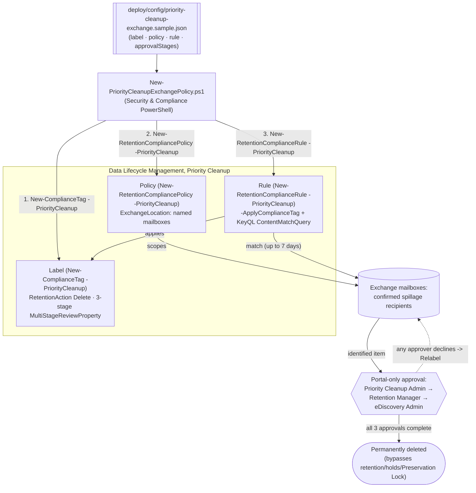

## 1. Scenario summary

Deploys a Microsoft Purview **Priority cleanup** label, policy, and rule for Exchange mailboxes, as
code, via Security & Compliance PowerShell's official `-PriorityCleanup` parameter set. Priority
cleanup **permanently deletes** matching mail content even when a retention policy, litigation hold,
eDiscovery hold, or Preservation Lock (delete-only) would otherwise keep it, the one Data Lifecycle
Management control in this repo explicitly designed to override every other retention control.

**Who it's for:** a compliance/legal/security team responding to a data-spillage or privacy incident
(sensitive content sent to the wrong mailboxes) who needs it gone now, cannot wait for retention or a
hold to lapse, and needs the deployment, approval requirements, and audit trail to be reproducible and
reviewable, not a one-off portal click-through.

## 2. Business/regulatory driver

Data spillage, an employee accidentally emails sensitive information (M&A plans, PII, regulated
data) to the wrong recipients, is a named Microsoft use case for this feature, alongside privacy
deletion requests for departed employees whose mailboxes sit under a multi-year retention policy
[[1]](#references). Waiting out a 2-year retention period, or a pending eDiscovery hold, is not an
option when the exposure is active today. Priority cleanup exists precisely to let an organization
**compliantly override its own holds** for a specific, approved, audited reason, but that is also
exactly why it is the most dangerous control in this repo: it is a **documented spoliation risk** if
used to destroy content relevant to litigation, and Microsoft's own guidance to highly regulated
organizations using Preservation Lock is that they *"might want the additional safeguard of turning
off priority cleanup at the tenant level"* [[1]](#references) rather than relying on approvals alone.

> ⚠️ **This is not a normal retention control.** Once every required approval completes, matching
> items are **permanently deleted and cannot be restored by users, by admins, or by Microsoft**
> [[5]](#references). Get Legal sign-off, not just Compliance sign-off, before deploying, and treat
> every use as a documented, individually-justified exception, never a standing policy. Priority
> cleanup is also, as of this writing, a Microsoft-labeled **preview** capability, "subject to change"
> [[1]](#references). See §11.

## 3. Prerequisites

Full licensing detail: `docs/licensing-matrix.md` §2. RBAC: `docs/rbac-model.md` §4. Automation
surface: `docs/automation-surface.md` §3 (Security & Compliance PowerShell). Summary:

| Requirement | Minimum | Notes |
|---|---|---|
| Licensing | **M365 E5/A5/G5**, **Microsoft Purview Suite**, **E5/A5/F5/G5 Information Protection and Governance**, or **Office 365 E5/A5/G5** | Same tier as Records Management; confirmed by the Purview service description [[6]](#references) |
| Creator role | **Priority Cleanup Admin** (not included by default in Compliance Administrator; add manually) | `docs/rbac-model.md` §4 |
| Approver roles (3 stages, Exchange) | Priority Cleanup Admin (+Data Classification Content/List Viewer, Disposition Management); Retention Management (+ same 3); Search And Purge + Hold + Review (+ same 3) for eDiscovery | Policy creation **fails with an error** if any listed reviewer lacks their stage's roles [[5]](#references) |
| Approvers | 3 distinct individual users (not groups), one per stage, in addition to the creator | Mail-enabled security groups aren't supported as approvers [[5]](#references) |
| Auditing | Enabled ≥1 day before first use | Required to view simulation results and monitor via Cleanup ID [[5]](#references) |
| Mailbox size | ≥10 MB per mailbox | Smaller mailboxes aren't supported by priority cleanup [[5]](#references) |
| Auth | `Connect-IPPSSession` (certificate app-only preferred) | `docs/automation-surface.md` §3 |
| Feature toggle | Enabled tenant-wide by default; can be turned off entirely | Portal: Data Lifecycle Management → Priority cleanup settings [[1]](#references), no confirmed PowerShell equivalent found (§11) |

> Verify current entitlement names against `docs/licensing-matrix.md` before a sales commitment.

## 4. Architecture



Same three-object shape (label / policy / rule) as every other retention scenario in this repo, but
every cmdlet call uses the official `-PriorityCleanup` parameter set, and a fourth stage, portal-only
multi-party approval, sits between "matched" and "deleted." Full rationale: `design.md`.

## 5. Step-by-step implementation

### PowerShell path

```powershell
# Connect (certificate app-only preferred - docs/automation-surface.md Section 3)
Connect-IPPSSession -AppId $AppId -Certificate $Cert -Organization 'contoso.onmicrosoft.com'

# 1. Dry run - prints the exact New-ComplianceTag / New-RetentionCompliancePolicy / -Rule cmdlets
./deploy/New-PriorityCleanupExchangePolicy.ps1 -ConfigPath ./deploy/config/priority-cleanup-exchange.json -Simulate -DryRun

# 2. Deploy in SIMULATION mode (recommended default - not required for Exchange, but Microsoft's
#    own guidance, and this scenario's default posture for a hold-overriding control)
./deploy/New-PriorityCleanupExchangePolicy.ps1 -ConfigPath ./deploy/config/priority-cleanup-exchange.json -Simulate

# 3. Review simulation sample results in the portal (Data Lifecycle Management > Priority cleanup >
#    View simulation details) - a SECOND priority cleanup admin must do this review.

# 4. That second admin enforces the reviewed simulation, turning the policy live:
./deploy/New-PriorityCleanupExchangePolicy.ps1 -ConfigPath ./deploy/config/priority-cleanup-exchange.json -EnforceSimulation

# 5. Validate the deployed objects (not approvals - see Section 7)
./validate/Test-PriorityCleanupExchangePolicy.ps1 -ConfigPath ./deploy/config/priority-cleanup-exchange.json
```

Skipping simulation (`-Enabled` instead of `-Simulate`) is supported, Microsoft states simulation is
*"No (but recommended)"* for Exchange, unlike SharePoint/OneDrive where it's mandatory
[[2]](#references), but this scenario's scripts still refuse to deploy with **no** explicit choice at
all (`-Simulate`, `-Enabled`, or `-DryRun`); see `design.md` §5. The SharePoint/OneDrive sibling
(`scenarios/data-lifecycle-management/priority-cleanup-sharepoint-onedrive/`) has no `-Enabled` path
at all, for exactly this reason.

### Portal reference

The label, policy, and rule are visible under **Data Lifecycle Management → Priority cleanup** in the
[Microsoft Purview portal](https://purview.microsoft.com) [[1]](#references). **Approving pending
deletions happens only in the portal**, Data Lifecycle Management → Priority cleanup → Pending
cleanups, there is no PowerShell or Graph cmdlet for this step (§7). `-WhatIf` is non-functional in
S&C PowerShell; the scripts ship `-DryRun` instead.

## 6. Configuration reference

| Setting | Value this scenario uses | Notes |
|---|---|---|
| Label cmdlet | `New-ComplianceTag -PriorityCleanup` | Mandatory in this parameter set: `-RetentionAction`, `-RetentionDuration`, `-RetentionType`, `-MultiStageReviewProperty` [[7]](#references) |
| `RetentionAction` | `Delete` | Required value for priority cleanup |
| `RetentionDuration` / `RetentionType` | `0` / `TaggedAgeInDays` | This scenario's best-effort mapping of "delete as soon as possible", **VERIFY**, see `design.md` §4 |
| `MultiStageReviewProperty` | 3-stage JSON: `PriorityCleanupAdmin` → `RetentionManager` → `EDiscoveryAdmin` | This scenario's construction from the documented parameter shape, **VERIFY** stage naming/order, see `design.md` §4 |
| Policy cmdlet | `New-RetentionCompliancePolicy -PriorityCleanup -SkipPriorityCleanupConfirmation` | Needs ≥1 `-ExchangeLocation` [[8]](#references) |
| Simulation | `-IsSimulation` at create; `Set-RetentionCompliancePolicy -StartSimulation $true` to run it; `-EnforceSimulationPolicy $true` to go live | Recommended, not required, for Exchange [[2]](#references) |
| Rule cmdlet | `New-RetentionComplianceRule -PriorityCleanup -ApplyComplianceTag -ContentMatchQuery` | KeyQL; excludes `SenderAuthor`, `SubjectTitle`, `(c:c)`, `(c:s)`, **not** supported for priority cleanup even though eDiscovery search otherwise allows them [[5]](#references) |
| Classification check | `Get-ComplianceTag`/`Get-RetentionCompliancePolicy`/`Get-RetentionComplianceRule -PriorityCleanup` | Official filter switch; used instead of guessing an unconfirmed boolean property name [[9]](#references)[[10]](#references) |
| Redistribute a stuck policy | `Set-RetentionCompliancePolicy -RetryDistribution` | Same mechanism as ordinary retention policies |

Exact cmdlet syntax and Learn sources are cited in each script's `.NOTES`.

## 7. Validation / how to prove it works

1. **Automated (object-level)**, `./validate/Test-PriorityCleanupExchangePolicy.ps1` confirms the
   label/policy/rule exist and are classified as priority cleanup objects (via the `-PriorityCleanup`
   filter switch), the rule applies the expected label, and reports the policy's Enabled/Mode/
   DistributionStatus. Exits non-zero on failure. **This does not, and cannot, confirm anything about
   approvals or deletions**, see the next two items.
2. **Approval-queue check (portal only)**, Data Lifecycle Management → Priority cleanup → Pending
   cleanups. No PowerShell/Graph read API exists for this queue.
3. **Deletion proof (auditing)**, search the audit log using the policy's **Cleanup ID** (shown after
   creation) as the keyword; look for `PriorityCleanupTagApplied` (item identified/labeled) and
   `PriorityCleanupDelete` (item permanently deleted) operations, neither has a friendly name in the
   portal's audit UI yet, so search by raw operation name [[3]](#references).
4. **Idempotency proof**, re-run the deploy; the label/policy/rule report `exists` (not `created`)
   and nothing is duplicated or silently mutated.
5. **Simulation-mode sanity check**, if deployed with `-Simulate`, confirm status shows **In
   simulation** before `-EnforceSimulation`, and **Enabled (Success)** (not stuck at **Enabled
   (Pending)**) after.

## 8. Operations & tuning

**KPIs / signals:** count of `PriorityCleanupTagApplied`/`PriorityCleanupDelete` audit events per
Cleanup ID; time-to-approval per stage (email reminders fire weekly [[5]](#references), so a stalled
approval is visible within a week); policy `DistributionStatus`. **Tuning:** the `ContentMatchQuery`
is the single highest-leverage control, an over-broad query destroys content permanently and without
recourse, so start as narrow as the confirmed spillage evidence allows (specific attachment name +
date range, as in this scenario's sample config) and widen only with sign-off. **Change management:**
every deployment of this control should be a one-off, individually justified incident response, not a
standing policy, disable or delete it (§9) once the specific incident is closed, rather than leaving
it live "just in case." **SIEM integration:** forward `PriorityCleanupTagApplied`/`PriorityCleanupDelete`
audit events to Sentinel/SIEM given their severity and the lack of friendly portal names, see
`reviews.md` (Blue Team).

## 9. Rollback / decommission

See `rollback.md`. Quick reference: `./deploy/Remove-PriorityCleanupExchangePolicy.ps1` disables the
policy (stops identifying *new* items); `-Delete` removes the policy + rule. **Neither undoes an
approval that has already completed**, Microsoft states items may still be permanently deleted even
after the policy is deleted, if the approval process for them was already complete [[5]](#references).
The label is not force-removed by default.

## 10. Cost & licensing notes

- **Per-user E5-tier entitlement**, no separate Azure meter, same licensing family as Records
  Management [[6]](#references).
- **The real cost is process, not the meter**: 3 named approvers with the correct role assignments,
  auditing enabled in advance, and a Legal/Compliance sign-off workflow around every use.
- **The expensive mistake is scope creep on `ContentMatchQuery`**, an over-broad query permanently
  destroys content with no possibility of recovery, unlike every other retention mistake in this repo
  (which can usually be caught and reversed before the retention period ends).

## 11. Known limitations & gotchas

- **PREVIEW.** Microsoft's own note: *"Priority cleanup is rolling out in preview and subject to
  change"* [[1]](#references). Re-verify current status before a customer-facing commitment.
- **IRREVERSIBLE and HOLD-OVERRIDING.** This is the one control in this repo that is explicitly
  designed to defeat retention policies, litigation holds, eDiscovery holds, and Preservation Lock
  (delete-only). Once approved, deletion "cannot be restored by users, by admins, or by Microsoft"
  [[5]](#references). Highly regulated organizations using Preservation Lock may prefer to leave the
  tenant-wide toggle **off** entirely, Microsoft says so explicitly [[1]](#references).
- **No PowerShell/Graph approval API.** Approving or declining pending items is portal-only. This
  scenario's scripts stop at provisioning and validation; they cannot drive or observe the approval
  workflow itself.
- **`-MultiStageReviewProperty` stage shape is this scenario's construction, not a confirmed one.**
  See `design.md` §4, flagged as VERIFY, not asserted.
- **`RetentionDuration 0` / `TaggedAgeInDays` for "as soon as possible" is inferred, not confirmed.**
  See `design.md` §4, VERIFY before production reliance.
- **No confirmed cmdlet for the tenant-wide on/off toggle.** The portal's "Priority cleanup settings"
  page has no PowerShell/Graph equivalent found during this build's grounding pass across official
  Microsoft Learn sources.
- **KeyQL exclusions.** `SenderAuthor`, `SubjectTitle`, `(c:c)`, `(c:s)` are **not** supported in a
  priority cleanup `ContentMatchQuery`, even though ordinary eDiscovery search allows them
  [[5]](#references), don't reuse an eDiscovery query unmodified.
- **Records exception.** Priority cleanup cannot delete content already marked as a record or
  regulatory record [[1]](#references), it does not override the strongest retention control in this
  repo's own `retention-labels-financial-records` sibling.
- **eDiscovery review-set exception.** Content already copied into an eDiscovery review set survives
  priority cleanup until the entire case is deleted by an eDiscovery admin [[1]](#references).
- **Approving a decline does not undo the label.** If an approver declines ("Relabel"), they must pick
  an *existing* retention label to apply instead, approvers need to know in advance which labels are
  appropriate [[5]](#references); this scenario's deploy does not provision that fallback label.
- **`-WhatIf` is non-functional in S&C PowerShell**, the scripts ship `-DryRun` instead.
- **Illustrative values.** The mailbox addresses, attachment name, and approver email addresses in the
  sample config are placeholders, replace with the real, confirmed spillage recipients and named
  approvers, validated by Legal, before deploying.

## 12. References

1. Expedite the permanent deletion of sensitive information from mailboxes (priority cleanup for Exchange; preview note; data-spillage use case; Preservation Lock guidance; records/review-set exceptions), <https://learn.microsoft.com/purview/priority-cleanup-exchange>
2. Override holds to clean up files for Copilot and reclaim storage (SharePoint/OneDrive comparison table), <https://learn.microsoft.com/purview/priority-cleanup-onedrive-sharepoint>
3. Permanently delete files with Microsoft Purview Priority Cleanup (SharePoint/OneDrive permanent-deletion sub-feature; public preview from 2026-08-24), <https://learn.microsoft.com/purview/priority-cleanup-permanent-deletion>
4. New-ComplianceTag (`-PriorityCleanup` parameter set; `-MultiStageReviewProperty` JSON shape), <https://learn.microsoft.com/powershell/module/exchangepowershell/new-compliancetag>
5. Expedite the permanent deletion of sensitive information from mailboxes, prerequisites, approver roles, approval process, limitations, <https://learn.microsoft.com/purview/priority-cleanup-exchange#prerequisites-for-priority-cleanup>
6. Microsoft Purview service description, Priority cleanup licensing (same tier as Data Lifecycle & Records Management), <https://learn.microsoft.com/office365/servicedescriptions/microsoft-365-service-descriptions/microsoft-365-tenantlevel-services-licensing-guidance/microsoft-purview-service-description>
7. New-ComplianceTag full parameter reference, <https://learn.microsoft.com/powershell/module/exchangepowershell/new-compliancetag>
8. New-RetentionCompliancePolicy (`-PriorityCleanup`, `-SkipPriorityCleanupConfirmation`, `-IsSimulation`), <https://learn.microsoft.com/powershell/module/exchangepowershell/new-retentioncompliancepolicy>
9. Get-ComplianceTag (`-PriorityCleanup` filter switch), <https://learn.microsoft.com/powershell/module/exchangepowershell/get-compliancetag>
10. Get-RetentionCompliancePolicy / Get-RetentionComplianceRule (`-PriorityCleanup` filter switch), <https://learn.microsoft.com/powershell/module/exchangepowershell/get-retentioncompliancepolicy>
11. Set-RetentionCompliancePolicy (`-StartSimulation`, `-EnforceSimulationPolicy`, `-RetryDistribution`), <https://learn.microsoft.com/powershell/module/exchangepowershell/set-retentioncompliancepolicy>
12. New-RetentionComplianceRule (`-PriorityCleanup`, `-ApplyComplianceTag`, `-ContentMatchQuery`), <https://learn.microsoft.com/powershell/module/exchangepowershell/new-retentioncompliancerule>

> Re-verify all links, cmdlet parameters, licensing, and, especially, the `-MultiStageReviewProperty`
> stage shape and preview status against current Microsoft Learn before a customer-facing deployment.
> This scenario is deliberately conservative (no default-on path, create-or-report, explicit
> "cannot recall a completed approval" rollback warning) because priority cleanup is irreversible by
> design.
