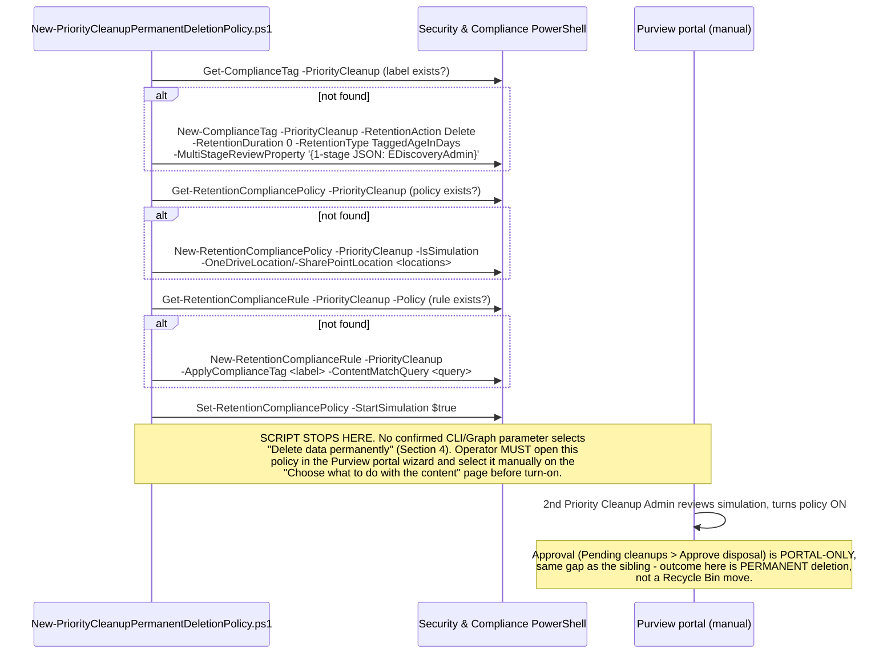

## 1. Problem statement

The `priority-cleanup-sharepoint-onedrive` sibling scenario's deletion mechanism moves matching
items to the **second-stage Recycle Bin**, real remediation, but not final: an item is still
technically recoverable within the Recycle Bin's retention window, still occupies storage until
that window lapses, and (until it lapses) is not guaranteed absent from every downstream index. For
a genuine data-exposure incident, most concretely, a file identified by a **DSPM for AI oversharing
assessment** (`scenarios/dspm-for-ai/copilot-sensitive-data-exposure`) as broadly shared and already
summarizable by Microsoft 365 Copilot, "recoverable for up to N days" is not an acceptable answer;
the requirement is content that is immediately no longer discoverable in SharePoint search, Copilot,
or eDiscovery, with no recovery path at all [[1]](#references). Microsoft's **permanent deletion**
sub-feature of Priority Cleanup, rolling out to public preview from 2026-08-24, is built for exactly
this: it bypasses the SharePoint/OneDrive Recycle Bins entirely [[1]](#references). This scenario
scripts what is scriptable of that feature and documents, honestly, what currently is not.

## 2. Design goals

Same five goals as both priority-cleanup siblings (script the real documented mechanism; never
deploy live by accident; be honest about where the paper trail ends; disclose every judgment call;
match the irreversibility with the guardrail), with one goal weighted higher than in either
sibling: **do not overstate what this scenario's code can configure.** The feature's own
Microsoft Learn procedure page describes the one property that actually matters, selecting
**"Delete data permanently"** instead of the default Recycle-Bin outcome, as a portal-wizard-only
step, and this design grounds why that limitation is treated as load-bearing rather than glossed
over (§4).

## 3. Why this is a separate fragment, not a flag on the sibling scenario

| | `priority-cleanup-sharepoint-onedrive` (sibling) | This fragment |
|---|---|---|
| Terminal state | Second-stage Recycle Bin | **Permanently deleted, bypasses both Recycle Bins** [[1]](#references) |
| Recoverability | Yes, within the Recycle Bin's retention window | **None** |
| Typical driver | Storage reclamation (stale Teams recordings), post-departure OneDrive cleanup | **Confirmed data-exposure/privacy incident** requiring guaranteed non-recoverable removal, e.g. a DSPM for AI oversharing finding |
| Audit operation on disposal | `PriorityCleanupFileRecycled` | **`PriorityCleanupFileDeleted`** [[2]](#references), a different operation name, not a renamed duplicate |
| Content-disposition selection | N/A (recycle-bin is the only outcome) | **"Delete data permanently", a portal-wizard-only choice** with no confirmed PowerShell/Graph parameter (§4) |
| Preview rollout | Already generally available under the base priority-cleanup preview | **Public preview rollout begins 2026-08-24** [[1]](#references), separately gated, re-verify tenant availability before use |

The two scenarios also share nearly everything else (roles, approver model, mandatory simulation,
the underlying `-PriorityCleanup` cmdlet family), this fragment cross-links the sibling's `README.md`
§3 for that shared material rather than repeating it, and focuses on what's actually different.

## 4. The central construction gap: "Delete data permanently" has no confirmed CLI parameter

Microsoft's "Configure permanent deletion" procedure is described **entirely in portal terms**
[[1]](#references): create the policy through the Purview portal wizard, and on the **"Choose what
to do with the content"** page, select **"Delete data permanently"** instead of the default. No
PowerShell or Graph example accompanies this step, unlike the base priority-cleanup feature page,
which does document the underlying `New-ComplianceTag`/`New-RetentionCompliancePolicy`/
`New-RetentionComplianceRule` cmdlets. This scenario's own grounding pass confirmed the gap is real,
not an oversight of this build: `New-ComplianceTag`'s `-RetentionAction` parameter accepts exactly
three values, `Delete`, `Keep`, `KeepAndDelete`, with no fourth "permanent" variant, for both its
`Default` and `PriorityCleanup` parameter sets [[3]](#references). There is no other parameter on
`New-ComplianceTag`, `New-RetentionCompliancePolicy`, or `New-RetentionComplianceRule` that
plausibly encodes "bypass the Recycle Bin" either.

Two readings are both consistent with what Microsoft publishes, and neither is confirmed:

- **(a)** A policy provisioned via this scenario's `-PriorityCleanup` cmdlets (identical shape to
  the sibling's) can later be switched to permanent-deletion mode by an operator completing the
  portal wizard's content-disposition page against that same policy.
- **(b)** Permanent-deletion policies must be created **end-to-end through the portal wizard**, and
  a policy provisioned first via PowerShell is not a valid starting point for that wizard at all.

This scenario's script (§5) provisions the same underlying label/policy/rule as the sibling, that
part is confirmed, reusable machinery, and then **stops and prints a mandatory manual step**
rather than guessing which of (a) or (b) is true. `README.md` §11 and the deploy script's `.NOTES`
carry this as an explicit VERIFY (pilot tenant): attempt the portal wizard's permanent-deletion
option against a PowerShell-provisioned policy and record which reading holds.

A second, equally real gap follows from the first: because no PowerShell property is confirmed to
*set* permanent-deletion mode, none is confirmed to **read it back** either. `validate/` (§6) cannot
confirm a policy is actually configured for permanent deletion, only that the shared underlying
objects exist. Post-hoc confirmation that permanent deletion is actually happening relies entirely
on auditing the `PriorityCleanupFileDeleted` operation (§6), which is scriptable and reliable.

## 5. Object model, what's confirmed vs. manual

This is the same three-object shape as both priority-cleanup scenarios in this repo, because that
part of the mechanism genuinely is shared ("under the covers, priority cleanup uses retention
labels with auto-apply policies" [[4]](#references)), the difference this fragment scripts
honestly is that its own defining step is not confirmed to be scriptable at all.

## 6. Idempotency and safety posture

Idempotency is create-or-report, identical in mechanism to both sibling scenarios: each object is
located via the official `-PriorityCleanup` filter switch and, if present, reported rather than
mutated. Safety posture is **stricter than both siblings** in two respects:

1. Like the SharePoint/OneDrive sibling (and unlike the Exchange sibling), there is no
   `-Enabled`-at-creation path, simulation is mandatory for this workload regardless of
   content-disposition mode [[5]](#references).
2. Unique to this fragment: the deploy script refuses to claim success at the point most operators
   would expect it, it explicitly prints that the permanent-deletion selection is unconfirmed and
   unautomated, rather than silently completing and letting an operator assume the policy is fully
   configured for irreversible deletion when it may still default to a Recycle Bin move.

`validate/` reports the shared object state and explicitly flags that it **cannot** confirm
permanent-deletion mode is active (§4), the only reliable confirmation is post-hoc, via the
`PriorityCleanupFileDeleted` audit operation once at least one item has actually been disposed.

## 7. Key decisions

| Decision | Choice | Rationale |
|---|---|---|
| Reuse vs. new object shape | Reuse the sibling's confirmed `-PriorityCleanup` label/policy/rule cmdlets | That part of the mechanism is shared and already grounded; re-deriving it would add risk with no benefit |
| Content-disposition selection | **Not scripted**, printed as a mandatory manual portal step | No confirmed CLI/Graph parameter exists (§4); AGENTS.md §4 requires disclosure over invention |
| Driving use case | Confirmed data-exposure/privacy incident (e.g. DSPM for AI oversharing finding), not routine storage reclamation | Matches Microsoft's own stated rationale ("reduce data exposure risk from rapidly growing Copilot-related content") and justifies why irreversibility, not Recycle-Bin softness, is the correct tool |
| Approver model | Same as the SharePoint/OneDrive sibling (eDiscovery admin, conditional on a hold) | Both pages point to the same base prerequisites article; no additional approver role is documented specifically for permanent deletion |
| Audit verification | `PriorityCleanupFileDeleted`, not the sibling's `PriorityCleanupFileRecycled` | Confirmed distinct operation name [[2]](#references), the only scriptable way to confirm permanent-deletion mode actually fired |
| Rollback | None once deleted (like the Exchange sibling, unlike the SharePoint/OneDrive sibling) | Matches the platform's own irreversibility claim, "no longer discoverable... after deletion" [[1]](#references) |
| Tenant availability | Treated as a pre-flight check, not assumed | Public preview rollout begins 2026-08-24 per the feature's own prerequisite; re-verify per-tenant before relying on this scenario |

## 8. Non-goals

- **Scripting the "Delete data permanently" selection itself**, no confirmed parameter exists;
  re-open once Microsoft publishes one (§4).
- **Scripting the approval workflow**, portal-only, same gap as both sibling scenarios.
- **A companion scenario chaining eDiscovery search-and-purge with this feature**, a related but
  distinct control (purging mailbox/site content found via an eDiscovery content search, not a
  standing priority-cleanup policy); out of scope here.
- **GCC/GCC High/DoD availability timing**, this fragment targets Worldwide multi-tenant; separate,
  later government-cloud rollout timing is not modeled (§ README.md §11).

## References

See `README.md` §12 for the full, numbered source list shared with this file.
