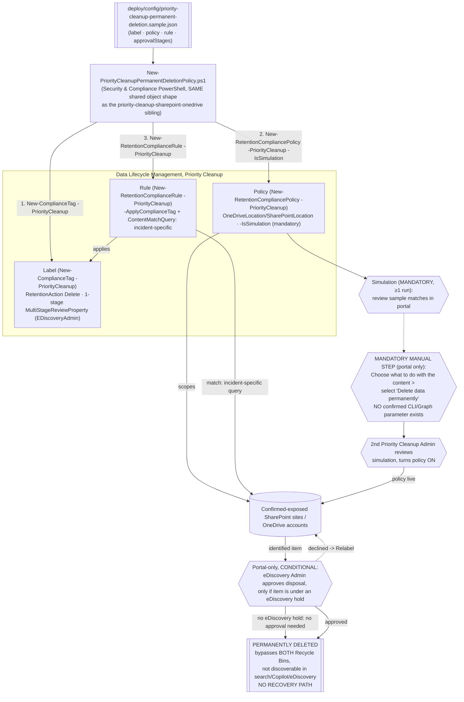

## 1. Scenario summary

Provisions the Microsoft Purview **Priority cleanup** label/policy/rule (Security & Compliance
PowerShell) that underlies the **permanent deletion** sub-feature for SharePoint and OneDrive, 
which bypasses both Recycle Bins entirely, leaving content unrecoverable and no longer discoverable
in SharePoint search, Microsoft 365 Copilot, or eDiscovery. This is the sibling of
`priority-cleanup-sharepoint-onedrive` for the case where that scenario's Recycle-Bin outcome is not
final enough. Rolling out to **public preview from 2026-08-24**.

**Who it's for:** a compliance/security team that has a **confirmed data-exposure incident**, 
typically a file identified by a DSPM for AI oversharing assessment
(`scenarios/dspm-for-ai/copilot-sensitive-data-exposure`) as broadly shared and already
summarizable by Copilot, or a DLP alert on a specific SharePoint/OneDrive location, and needs
guaranteed, non-recoverable removal, not a time-bounded Recycle Bin window.

## 2. Business/regulatory driver

Microsoft's own stated rationale for this feature is reducing "data exposure risk from rapidly
growing Copilot-related content" while preserving compliance through required eDiscovery-admin
review [[1]](#references). Once a file is confirmed to be broadly, improperly shared and already
indexed for Copilot, moving it to a Recycle Bin (the sibling scenario's outcome) leaves a
time-bounded window during which the exposure, or at minimum the storage and index footprint, is
not fully closed. Regulatory drivers: GDPR/data-minimization "right to erasure"-adjacent operational
need for verifiably complete deletion; incident-response requirements that call for irreversible
remediation, not merely reversible remediation, once a confirmed leak has been contained.

> ⚠️ **This is not a routine storage-reclamation tool.** Use the `priority-cleanup-sharepoint-onedrive`
> sibling scenario (Recycle Bin outcome, recoverable) for stale Teams recordings, departed-employee
> OneDrive cleanup, or any use case where irreversibility is not specifically required. Reach for
> this scenario only when a Recycle Bin recovery window is itself an unacceptable residual risk.

## 3. Prerequisites

Full licensing detail: `docs/licensing-matrix.md` §7. RBAC: `docs/rbac-model.md` §4. Automation
surface: `docs/automation-surface.md` §3 (Security & Compliance PowerShell). This feature shares
**all** base prerequisites, roles, and the approver model with the `priority-cleanup-sharepoint-onedrive`
sibling, see that scenario's `README.md` §3 for the full breakdown (Priority Cleanup Admin role,
two-person rule, conditional eDiscovery Admin approval, mandatory simulation, auditing enabled ≥1
day in advance). This table covers only what's **additional or different** for permanent deletion:

| Requirement | Minimum | Notes |
|---|---|---|
| Tenant availability | Confirm the option is present before use | **Public preview rollout begins 2026-08-24** [[1]](#references), Worldwide multi-tenant only is confirmed by this Learn page; **VERIFY (pilot tenant)** current availability and any GCC/GCC High/DoD timing difference before a customer-facing commitment (§11) |
| Content-disposition selection | Portal only | Selecting **"Delete data permanently"** on the policy wizard's "Choose what to do with the content" page has **no confirmed PowerShell/Graph parameter**, see §5 and `design.md` §4 |
| Review-set exception | Always applies, restated specifically on this feature's own page | Items **already copied to an eDiscovery review set** are **not** deleted by Priority Cleanup, permanent-deletion mode included [[1]](#references), do not assume a "permanent" policy is exhaustive if a review set copy exists |
| Records exception | Same as base feature | Content marked as a **record or regulatory record** cannot be targeted by priority cleanup at all [[2]](#references) |

> Verify current entitlement names against `docs/licensing-matrix.md` before a sales commitment.

## 4. Architecture



Same three-object shape as every retention scenario in this repo. The one node with no scriptable
path is **Manual**, Microsoft's own procedure for selecting the permanent-deletion outcome is
portal-wizard-only, with no PowerShell/Graph equivalent found during this build's grounding pass.
Full rationale: `design.md` §4.

## 5. Step-by-step implementation

### PowerShell path

```powershell
# Connect (certificate app-only preferred - docs/automation-surface.md Section 3)
Connect-IPPSSession -AppId $AppId -Certificate $Cert -Organization 'contoso.onmicrosoft.com'

# 1. Dry run - prints the exact New-ComplianceTag / New-RetentionCompliancePolicy / -Rule cmdlets
./deploy/New-PriorityCleanupPermanentDeletionPolicy.ps1 -ConfigPath ./deploy/config/priority-cleanup-permanent-deletion.json -Simulate -DryRun

# 2. Deploy the SHARED base objects in SIMULATION mode (mandatory for this workload)
./deploy/New-PriorityCleanupPermanentDeletionPolicy.ps1 -ConfigPath ./deploy/config/priority-cleanup-permanent-deletion.json -Simulate

# 3. MANDATORY MANUAL STEP - no CLI/Graph equivalent (see Section 3/4/11):
#    Purview portal > Data Lifecycle Management > Priority cleanup > open the policy >
#    "Choose what to do with the content" > select "Delete data permanently".
#    VERIFY (pilot tenant) this is even a valid action against a PowerShell-provisioned policy -
#    design.md Section 4 documents the two open readings.

# 4. Review simulation sample results in the portal - a SECOND, DIFFERENT Priority Cleanup Admin
#    must do this review.

# 5. That second admin turns the policy on:
./deploy/New-PriorityCleanupPermanentDeletionPolicy.ps1 -ConfigPath ./deploy/config/priority-cleanup-permanent-deletion.json -EnforceSimulation

# 6. Validate the deployed base objects (does NOT confirm permanent-deletion mode - see Section 7)
./validate/Test-PriorityCleanupPermanentDeletionPolicy.ps1 -ConfigPath ./deploy/config/priority-cleanup-permanent-deletion.json
```

### Portal reference

The full policy-creation wizard, including the content-disposition selection, is described end to
end by Microsoft as a portal flow: **Data Lifecycle Management → Priority cleanup → + Create a
priority cleanup**, through name/description, scope, query, **"Choose what to do with the content"
(select "Delete data permanently")**, approvers, and simulation mode [[1]](#references). Approving
pending disposals happens only in the portal, **Pending cleanups → select items → Approve disposal**
, there is no PowerShell or Graph cmdlet for this step, same gap as the sibling scenario.

## 6. Configuration reference

| Setting | Value this scenario uses | Notes |
|---|---|---|
| Label cmdlet | `New-ComplianceTag -PriorityCleanup` | Identical parameter shape to the sibling scenario, `-RetentionAction`, `-RetentionDuration`, `-RetentionType`, `-MultiStageReviewProperty` [[3]](#references) |
| `RetentionAction` | `Delete` | Only value that applies, confirmed the parameter accepts exactly `Delete`/`Keep`/`KeepAndDelete`, **no fourth "permanent" value exists** [[3]](#references) |
| Content-disposition mode | **Not scriptable** | "Delete data permanently" vs. default Recycle-Bin outcome, portal-wizard-only, see §5/§11 |
| Policy cmdlet | `New-RetentionCompliancePolicy -PriorityCleanup -IsSimulation` | Same as sibling; needs ≥1 of `-OneDriveLocation`/`-SharePointLocation` [[4]](#references) |
| Scope | Deliberately **narrow, static, incident-specific** (named sites/accounts) | Unlike the sibling's broad/continual scope, see `design.md` §7 |
| Rule cmdlet | `New-RetentionComplianceRule -PriorityCleanup -ApplyComplianceTag -ContentMatchQuery` | Query is **incident-specific**, not a generic worked example like the sibling's `ProgID:Media AND ProgID:Meeting`, construct per §config `_ruleNote` |
| Audit operation (disposal) | **`PriorityCleanupFileDeleted`** | Distinct from the sibling's `PriorityCleanupFileRecycled` [[5]](#references), the only scriptable confirmation that permanent deletion occurred |
| Classification check | `Get-ComplianceTag`/`Get-RetentionCompliancePolicy`/`Get-RetentionComplianceRule -PriorityCleanup` | Same filter switch as the sibling; **cannot** distinguish permanent-deletion mode (§7) |

Exact cmdlet syntax and Learn sources are cited in each script's `.NOTES`.

## 7. Validation / how to prove it works

1. **Automated (object-level)**, `./validate/Test-PriorityCleanupPermanentDeletionPolicy.ps1`
   confirms the label/policy/rule exist and are classified as priority cleanup objects, and reports
   the policy's Enabled/Mode/DistributionStatus. **This cannot confirm permanent-deletion mode is
   active**, no documented property exposes it (`design.md` §4).
2. **Manual confirmation (portal)**, open the policy and confirm "Delete data permanently" is
   selected on the content-disposition page.
3. **Deletion proof (auditing), the only reliable, scriptable confirmation**, search the audit
   log using the policy's **Cleanup ID** as the keyword; look for **`PriorityCleanupFileDeleted`**
   (item permanently deleted, this scenario's intended outcome) [[5]](#references). A
   **`PriorityCleanupFileRecycled`** event instead means the item went to the Recycle Bin, the
   manual step was likely not completed, or the policy is not actually in permanent-deletion mode.
4. **Idempotency proof**, re-run the deploy script; the label/policy/rule report `exists` (not
   `created`) and nothing is duplicated or silently mutated.
5. **Review-set exception sanity check**, for any item you expect to be deleted, confirm it has
   **not** already been copied to an eDiscovery review set; if it has, priority cleanup (any mode)
   will not delete it [[1]](#references), do not treat a missing `PriorityCleanupFileDeleted` event
   for such an item as a scenario failure.

## 8. Operations & tuning

**KPIs / signals:** count of `PriorityCleanupFileDeleted` events per Cleanup ID (the true measure of
this scenario's effect, `PriorityCleanupTagApplied`/`PriorityCleanupFileRecycled` indicate the
weaker sibling outcome instead); time-to-approval for the conditional eDiscovery-admin stage.
**Change management:** because this is an incident-driven, narrow-scope control rather than a
standing policy, do not leave a permanent-deletion-configured policy running indefinitely after the
triggering incident is resolved, disable it (rollback.md Stage 1) once the confirmed-exposed set is
fully disposed of, and re-provision fresh per incident rather than widening an existing one. **SIEM
integration:** forward `PriorityCleanupFileDeleted` events to Sentinel/SIEM as the authoritative,
high-severity signal that irreversible deletion occurred, treat every such event as requiring an
audit trail entry in the incident record, not routine telemetry. **Query discipline:** because there
is no generic worked-example query for this use case (unlike the sibling's Teams-recording pattern),
every deployment's `contentMatchQuery` is bespoke, require a second reviewer on the query itself,
not just on the simulation results, before ever proceeding past simulation.

## 9. Rollback / decommission

See `rollback.md`. Quick reference: `./deploy/Remove-PriorityCleanupPermanentDeletionPolicy.ps1`
disables the policy (stops identifying *new* items); `-Delete` removes the policy + rule. **Nothing
in this scenario undoes an item that has already been permanently deleted**, unlike the
`priority-cleanup-sharepoint-onedrive` sibling's Recycle Bin recourse, there is **no recovery path**
once `PriorityCleanupFileDeleted` has fired for an item. Rollback here only stops *further* items
from being identified and disposed of.

## 10. Cost & licensing notes

- **Same per-user E5-tier entitlement and shared tenant-wide toggle** as both priority-cleanup
  siblings, no separate meter for permanent-deletion mode specifically [[6]](#references).
- **The real cost is governance discipline, not the meter:** a bespoke, reviewed query per incident,
  mandatory simulation, and a manual portal step that cannot be automated away, budget operator time
  per incident, not a one-time setup.
- **The financial case is risk-avoidance, not storage reclamation**, the opposite framing from the
  sibling scenario's cost-avoidance narrative; the value here is closing a confirmed exposure
  verifiably, which is a compliance/incident-response cost avoided (breach notification scope,
  regulatory exposure), not a storage bill reduced.

## 11. Known limitations & gotchas

- **PREVIEW.** Public preview rollout begins 2026-08-24 [[1]](#references), today's date for this
  build is 2026-09-09, so Worldwide multi-tenant rollout should be underway, but **VERIFY (pilot
  tenant)** actual availability before relying on this scenario; do not assume GCC/GCC High/DoD
  timing matches Worldwide multi-tenant (unconfirmed by this Learn page, community reporting
  suggests a later, separate timeline for those environments, not independently verified by this
  build against an official Microsoft source).
- **No confirmed CLI/Graph parameter selects "Delete data permanently."** This is this scenario's
  central, disclosed gap, see `design.md` §4. `New-ComplianceTag -RetentionAction` was directly
  confirmed to accept only `Delete`/`Keep`/`KeepAndDelete` during this build's grounding pass.
- **VERIFY (pilot tenant):** whether a policy provisioned via this scenario's PowerShell script is
  even a valid starting point for the portal's permanent-deletion wizard step, or whether such
  policies must be created end-to-end through the portal (`design.md` §4, two open readings).
- **No read-back property for content-disposition mode.** `validate/` cannot confirm permanent
  deletion is configured, only post-hoc audit search (`PriorityCleanupFileDeleted`) confirms it
  actually happened.
- **Items already in an eDiscovery review set are never deleted by Priority Cleanup**, in any mode
  [[1]](#references), do not assume "permanent deletion" is exhaustive against a review-set copy.
- **Records/regulatory records are out of scope entirely**, same exception as the base feature
  [[2]](#references).
- **No recovery path whatsoever once deleted**, see rollback.md. This is by far this scenario's
  highest-consequence property; do not deploy against a broad or untested query.
- **`-MultiStageReviewProperty` single-stage shape and the `RetentionDuration 0`/`TaggedAgeInDays`
  "as soon as possible" mapping are carried over, unverified constructions from the sibling
  scenario**, same open VERIFY items, see the sibling's `README.md` §11 and this scenario's
  `design.md` §7.
- **`-WhatIf` is non-functional in S&C PowerShell**, the scripts ship `-DryRun` instead.
- **Illustrative values.** The SharePoint site URL, approver email address, and `contentMatchQuery`
  placeholder in the sample config are not usable as-is, replace with real, incident-specific
  values before deploying (the deploy script refuses to run against the placeholder query).

## 12. References

1. Permanently delete files with Microsoft Purview Priority Cleanup (feature overview; prerequisites; public preview rollout date; portal configuration steps; PriorityCleanupFileDeleted audit operation; review-set exception), <https://learn.microsoft.com/purview/priority-cleanup-permanent-deletion>
2. Override holds to clean up files for Copilot and reclaim storage, records/regulatory-record exception; shared base prerequisites and approver model, <https://learn.microsoft.com/purview/priority-cleanup-onedrive-sharepoint>
3. New-ComplianceTag (`-PriorityCleanup` parameter set; `-RetentionAction` accepts only Delete/Keep/KeepAndDelete, confirmed directly against this reference during this build), <https://learn.microsoft.com/powershell/module/exchangepowershell/new-compliancetag>
4. New-RetentionCompliancePolicy (`-OneDriveLocation`, `-SharePointLocation`, `-PriorityCleanup`, `-IsSimulation`), <https://learn.microsoft.com/powershell/module/exchangepowershell/new-retentioncompliancepolicy>
5. Permanently delete files with Microsoft Purview Priority Cleanup, monitoring section (`PriorityCleanupFileDeleted` operation, distinct from the sibling's `PriorityCleanupFileRecycled`), <https://learn.microsoft.com/purview/priority-cleanup-permanent-deletion#monitor-permanent-deletion>
6. Turn off priority cleanup for the tenant (shared toggle and licensing across all priority cleanup workloads), <https://learn.microsoft.com/purview/priority-cleanup-onedrive-sharepoint#turn-off-priority-cleanup-for-the-tenant>
7. New-RetentionComplianceRule (`-PriorityCleanup`, `-ApplyComplianceTag`, `-ContentMatchQuery`), <https://learn.microsoft.com/powershell/module/exchangepowershell/new-retentioncompliancerule>
8. Set-RetentionCompliancePolicy (`-StartSimulation`, `-EnforceSimulationPolicy`), <https://learn.microsoft.com/powershell/module/exchangepowershell/set-retentioncompliancepolicy>
9. Get-ComplianceTag / Get-RetentionCompliancePolicy / Get-RetentionComplianceRule (`-PriorityCleanup` filter switch), <https://learn.microsoft.com/powershell/module/exchangepowershell/get-compliancetag>

> Re-verify all links, cmdlet parameters, licensing, tenant-availability timing, and, especially, 
> whether a confirmed CLI/Graph path for "Delete data permanently" has since been published, before
> a customer-facing deployment.
