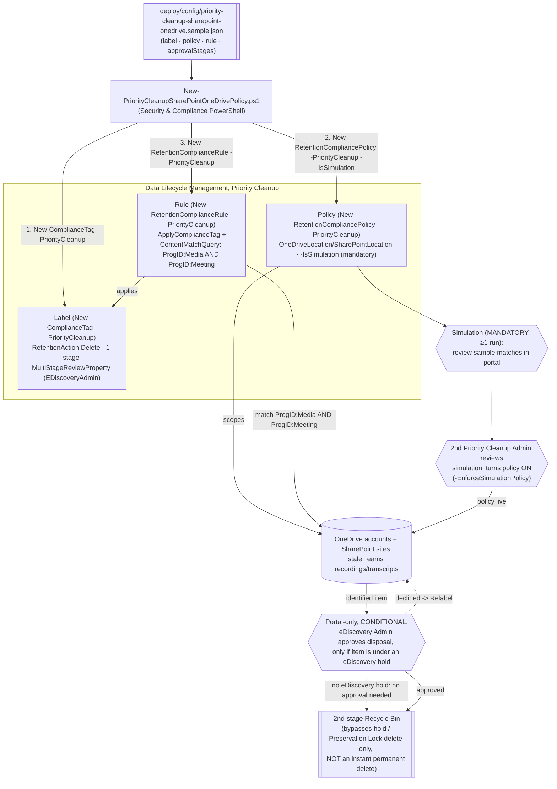

## 1. Scenario summary

Deploys a Microsoft Purview **Priority cleanup** label, policy, and rule for OneDrive and
SharePoint, as code, via Security & Compliance PowerShell's official `-PriorityCleanup` parameter
set. Unlike the Exchange sibling scenario (`priority-cleanup-exchange-data-spillage`), this is a
**continual, standing control**: it targets stale Microsoft Teams meeting recordings and
transcripts that Copilot recap no longer needs, overriding retention settings to move them into
the second-stage Recycle Bin instead of waiting out a retention policy.

**Who it's for:** a compliance/IT team managing SharePoint/OneDrive storage growth from Teams
recordings and transcripts (or cleaning up a departed employee's Preservation Hold library so their
OneDrive site can finally be deleted), who wants this run as an ongoing, reviewable policy rather
than a one-off portal click-through.

## 2. Business/regulatory driver

Teams meeting recordings and transcripts saved for Copilot recap are large and typically have
little business value after 1-3 months, but a retention policy or hold can keep them indefinitely
[[1]](#references). Priority cleanup lets an organization reclaim that storage on a standing basis.
The second named use case, deleting Preservation Hold library items so a departed employee's
OneDrive site can finally be removed, is incident-driven (triggered per departure) but still uses
the same continual-policy mechanism [[1]](#references).

> ⚠️ **Materially different risk profile from the Exchange sibling.** For SharePoint/OneDrive,
> priority cleanup moves matching items to the **second-stage Recycle Bin**, it does **not**
> instantly, permanently delete them the way the Exchange variant does. From there, items follow
> the same SharePoint/OneDrive Recycle Bin retention timers as any other deletion
> [[2]](#references). Preservation Lock is overridden **only if** the underlying retention setting
> is delete-only, not unconditionally, as with Exchange [[3]](#references). A separate, still
> **public-preview** sub-feature (**permanent deletion**, bypassing the Recycle Bin entirely,
> rollout beginning 2026-08-24) is explicitly **out of scope** for this fragment, see §11 and the
> dedicated sibling scenario, `scenarios/data-lifecycle-management/priority-cleanup-permanent-deletion/`.

## 3. Prerequisites

Full licensing detail: `docs/licensing-matrix.md` §7. RBAC: `docs/rbac-model.md` §4. Automation
surface: `docs/automation-surface.md` §3 (Security & Compliance PowerShell). Summary:

| Requirement | Minimum | Notes |
|---|---|---|
| Licensing | **M365 E5/A5/G5**, **Microsoft Purview Suite**, **E5/A5/F5/G5 Information Protection and Governance**, or **Office 365 E5/A5/G5** | Same tier and same tenant-wide feature toggle as the Exchange sibling, turning priority cleanup off turns it off for **both** workloads [[4]](#references) |
| Creator/first-stage role | **Priority Cleanup Admin** (not included by default in Compliance Administrator; add manually) | `docs/rbac-model.md` §4 |
| Two-person rule (Priority Cleanup Admin) | A **second, different** Priority Cleanup Admin, included in the policy configuration flow **before** the policy is turned on, reviews simulation results and turns the policy on | Different mechanism from Exchange's post-turn-on approval stage, see design.md §3 |
| Conditional approver (eDiscovery Admin) | **eDiscovery Administrator** role; approval required **only if** an identified item is under one or more eDiscovery holds | `docs/rbac-model.md` §4; policy creation fails with an error if this reviewer lacks the role [[5]](#references) |
| Approver roles, exact set | eDiscovery admins: Search And Purge + Hold + Review + Data Classification Content/List Viewer + Disposition Management. Priority Cleanup admins: Priority Cleanup Admin + Data Classification Content/List Viewer + Retention Management | Note the **Retention Management** role appears on the *Priority Cleanup Admin* row here, different from the Exchange sibling's table, where it's *Disposition Management* [[5]](#references) |
| Approvers | Individual users only (not groups); one eDiscovery approver is sufficient even if multiple are named | Mail-enabled security groups aren't supported as approvers [[5]](#references) |
| Simulation | **Mandatory**, required to initially set up the policy, and again for any change other than the description | Unlike Exchange, where it's recommended but optional [[1]](#references) |
| Auditing | Enabled ≥1 day before first use | Required to view simulation results [[5]](#references) |
| Auth | `Connect-IPPSSession` (certificate app-only preferred) | `docs/automation-surface.md` §3 |
| Feature toggle | Enabled tenant-wide by default; can be turned off entirely, same switch as Exchange | Portal: Data Lifecycle Management → Priority cleanup settings [[4]](#references), no confirmed PowerShell equivalent found (§11) |
| SharePoint site indexing | Sites can't be added until indexed | `New-RetentionCompliancePolicy`'s own `-SharePointLocation` parameter note [[6]](#references) |

> Verify current entitlement names against `docs/licensing-matrix.md` before a sales commitment.

## 4. Architecture



Same three-object shape (label / policy / rule) as every other retention scenario in this repo and
as the Exchange sibling, but the policy's location parameters are `-OneDriveLocation`/
`-SharePointLocation`, simulation is mandatory rather than optional, and the terminal state is the
Recycle Bin, not permanent deletion. Full rationale: `design.md`.

## 5. Step-by-step implementation

### PowerShell path

```powershell
# Connect (certificate app-only preferred - docs/automation-surface.md Section 3)
Connect-IPPSSession -AppId $AppId -Certificate $Cert -Organization 'contoso.onmicrosoft.com'

# 1. Dry run - prints the exact New-ComplianceTag / New-RetentionCompliancePolicy / -Rule cmdlets
./deploy/New-PriorityCleanupSharePointOneDrivePolicy.ps1 -ConfigPath ./deploy/config/priority-cleanup-sharepoint-onedrive.json -Simulate -DryRun

# 2. Deploy in SIMULATION mode - the ONLY supported creation path for this workload (mandatory, not
#    merely recommended)
./deploy/New-PriorityCleanupSharePointOneDrivePolicy.ps1 -ConfigPath ./deploy/config/priority-cleanup-sharepoint-onedrive.json -Simulate

# 3. Review simulation sample results in the portal (Data Lifecycle Management > Priority cleanup >
#    View simulation details) - a SECOND, DIFFERENT Priority Cleanup Admin must do this review.

# 4. That second admin turns the policy on:
./deploy/New-PriorityCleanupSharePointOneDrivePolicy.ps1 -ConfigPath ./deploy/config/priority-cleanup-sharepoint-onedrive.json -EnforceSimulation

# 5. Validate the deployed objects (not approvals - see Section 7)
./validate/Test-PriorityCleanupSharePointOneDrivePolicy.ps1 -ConfigPath ./deploy/config/priority-cleanup-sharepoint-onedrive.json
```

A simulation-mode policy can run for up to 7 days before it must be restarted [[1]](#references).
Microsoft also states **"the last person to edit the policy can't also turn it on"**, the operator
running step 4 must be a different admin from whoever ran step 2 against this same policy; this
script cannot verify that itself (no documented API exposes "who last edited this policy").

### Portal reference

The label, policy, and rule are visible under **Data Lifecycle Management → Priority cleanup** in
the [Microsoft Purview portal](https://purview.microsoft.com) [[1]](#references). **Approving
pending disposals happens only in the portal**, Data Lifecycle Management → Priority cleanup →
Pending cleanups, there is no PowerShell or Graph cmdlet for this step (§7). `-WhatIf` is
non-functional in S&C PowerShell; the scripts ship `-DryRun` instead.

## 6. Configuration reference

| Setting | Value this scenario uses | Notes |
|---|---|---|
| Label cmdlet | `New-ComplianceTag -PriorityCleanup` | Same mandatory parameter set as the Exchange sibling: `-RetentionAction`, `-RetentionDuration`, `-RetentionType`, `-MultiStageReviewProperty` [[7]](#references) |
| `RetentionAction` | `Delete` | Required value for priority cleanup |
| `RetentionDuration` / `RetentionType` | `0` / `TaggedAgeInDays` | Carried over from the Exchange sibling's best-effort mapping of "delete as soon as possible", **VERIFY**, see `design.md` §4 |
| `MultiStageReviewProperty` | 1-stage JSON: `EDiscoveryAdmin` only | **Fewer stages than Exchange**, no separate retention-manager stage for this workload. Whether a `PriorityCleanupAdmin` stage entry is also needed for the pre-turn-on two-person check is this scenario's own open construction gap, **VERIFY**, see `design.md` §4 |
| Policy cmdlet | `New-RetentionCompliancePolicy -PriorityCleanup -IsSimulation` | Needs ≥1 of `-OneDriveLocation`/`-SharePointLocation` [[6]](#references); no `-Enabled`-at-creation path (simulation mandatory) |
| Simulation | `-IsSimulation` at create; `Set-RetentionCompliancePolicy -StartSimulation $true` to run it; `-EnforceSimulationPolicy $true` to turn on | **Required**, not optional, for SharePoint/OneDrive [[1]](#references) |
| Rule cmdlet | `New-RetentionComplianceRule -PriorityCleanup -ApplyComplianceTag -ContentMatchQuery` | `ProgID:Media AND ProgID:Meeting`, Microsoft's own verbatim worked example for Teams recordings/transcripts [[1]](#references) |
| Classification check | `Get-ComplianceTag`/`Get-RetentionCompliancePolicy`/`Get-RetentionComplianceRule -PriorityCleanup` | Official filter switch; same pattern as the Exchange sibling [[9]](#references)[[10]](#references) |
| Redistribute a stuck policy | `Set-RetentionCompliancePolicy -RetryDistribution` | Same mechanism as ordinary retention policies |

Exact cmdlet syntax and Learn sources are cited in each script's `.NOTES`.

## 7. Validation / how to prove it works

1. **Automated (object-level)**, `./validate/Test-PriorityCleanupSharePointOneDrivePolicy.ps1`
   confirms the label/policy/rule exist and are classified as priority cleanup objects, the rule
   applies the expected label, and reports the policy's Enabled/Mode/DistributionStatus (a policy
   still `Enabled: $false` / `Mode: In simulation` is the **expected** starting state here, not a
   failure). **This does not, and cannot, confirm anything about approvals or Recycle Bin moves**
, see the next two items.
2. **Approval-queue check (portal only)**, Data Lifecycle Management → Priority cleanup → Pending
   cleanups. No PowerShell/Graph read API exists for this queue.
3. **Deletion proof (auditing)**, search the audit log using the policy's **Cleanup ID** (shown
   after creation) as the keyword; look for `PriorityCleanupTagApplied` (item identified/labeled)
   and `PriorityCleanupFileRecycled` (item moved to the second-stage Recycle Bin), neither has a
   friendly name in the portal's audit UI yet, so search by raw operation name [[2]](#references).
   Note this is a **different** operation name from the Exchange sibling's `PriorityCleanupDelete`.
4. **Idempotency proof**, re-run the deploy; the label/policy/rule report `exists` (not `created`)
   and nothing is duplicated or silently mutated.
5. **Simulation-mode sanity check**, confirm status shows **In simulation** before
   `-EnforceSimulation`, and **Enabled (Success)** (not stuck at **Enabled (Pending)**) after.

## 8. Operations & tuning

**KPIs / signals:** count of `PriorityCleanupTagApplied`/`PriorityCleanupFileRecycled` audit events
per Cleanup ID; time-to-approval for the conditional eDiscovery-admin stage (email reminders fire
weekly [[5]](#references)); policy `DistributionStatus`. **Tuning, the "stale" query has no
built-in age filter:** `ProgID:Media AND ProgID:Meeting` matches **all** Teams recordings/
transcripts, not just old ones, no confirmed relative-date ("older than 90 days") operator exists
for this KeyQL surface. Running it as a standing, continual policy (as Microsoft's own guidance
recommends for this use case [[1]](#references)) means every matching recording is moved to the
Recycle Bin, relying on the Recycle Bin's own retention window as the real age buffer rather than
the query itself. If a harder age cutoff is required, review and narrow the query on a recurring
schedule instead, this scenario does not script that review. **Change management:** because
simulation is mandatory for **any** change other than the description, budget for a review cycle
(hours, per Microsoft) before every meaningful edit, not just at initial setup. **SIEM
integration:** forward `PriorityCleanupTagApplied`/`PriorityCleanupFileRecycled` audit events to
Sentinel/SIEM given the lack of friendly portal names, see `reviews.md` (Blue Team).

## 9. Rollback / decommission

See `rollback.md`. Quick reference: `./deploy/Remove-PriorityCleanupSharePointOneDrivePolicy.ps1`
disables the policy (stops identifying *new* items); `-Delete` removes the policy + rule. **Neither
undoes an approval that has already completed**, Microsoft states items may still move to the
Recycle Bin even after the policy is deleted, if the approval process for them was already complete
[[5]](#references). Items already in the Recycle Bin can still be recovered from there within its
own retention window, this is a materially softer rollback story than the Exchange sibling's
irreversible permanent deletion. The label is not force-removed by default.

## 10. Cost & licensing notes

- **Per-user E5-tier entitlement**, no separate Azure meter, same licensing family and same
  tenant-wide toggle as the Exchange sibling [[4]](#references).
- **The real cost is the mandatory review cycle**, not the meter: every initial setup and every
  meaningful edit requires a simulation run plus a second admin's review before it can go live, 
  budget recurring admin time for this, not just a one-time setup cost.
- **Storage reclamation is the direct financial upside** unique to this workload, unlike the
  Exchange sibling's data-spillage framing, this scenario's lead use case (stale Teams recordings)
  is itself a cost-avoidance play against SharePoint/OneDrive storage growth.

## 11. Known limitations & gotchas

- **PREVIEW.** Same tenant-wide preview status as the Exchange sibling: *"Priority cleanup is
  rolling out in preview and subject to change"* [[1]](#references). Re-verify before a
  customer-facing commitment.
- **NOT an instant permanent delete.** Matching items move to the second-stage Recycle Bin, then
  follow ordinary SharePoint/OneDrive Recycle Bin retention timers [[2]](#references), a
  materially different (softer) mechanism than the Exchange sibling. The separate **permanent
  deletion** sub-feature (bypasses the Recycle Bin; public preview from 2026-08-24) is explicitly
  out of scope for this fragment, built as its own sibling scenario,
  `scenarios/data-lifecycle-management/priority-cleanup-permanent-deletion/`.
- **Preservation Lock override is conditional, not unconditional.** Only overridden if the
  underlying retention setting is delete-only [[3]](#references), do not assume this scenario
  overrides every locked policy the way the Exchange sibling does.
- **`-MultiStageReviewProperty` single-stage shape is this scenario's construction, not a confirmed
  one.** See `design.md` §4, flagged as VERIFY, not asserted. Specifically unconfirmed: whether a
  `PriorityCleanupAdmin` stage entry is also required for the pre-turn-on two-person check to
  register, beyond the `EDiscoveryAdmin` stage this scenario includes.
- **`RetentionDuration 0` / `TaggedAgeInDays` for "as soon as possible" is inferred, not confirmed**
, carried over from the Exchange sibling's same open gap. See `design.md` §4.
- **KeyQL exclusions for this workload are unconfirmed either way.** Microsoft's Exchange-specific
  page documents that `SenderAuthor`, `SubjectTitle`, `(c:c)`, and `(c:s)` are unsupported in a
  priority cleanup `ContentMatchQuery`, its SharePoint/OneDrive-specific page does not repeat or
  contradict this list. Not assumed to apply or not apply here.
- **No built-in query age filter.** `ProgID:Media AND ProgID:Meeting` matches all Teams recordings/
  transcripts, not just stale ones, see §8.
- **No confirmed cmdlet for the tenant-wide on/off toggle.** Same gap as the Exchange sibling, the
  portal's "Priority cleanup settings" page has no PowerShell/Graph equivalent found during this
  build's grounding pass, and the toggle is shared between both workloads [[4]](#references).
- **Approving a decline does not undo the label.** If the eDiscovery approver declines ("Relabel"),
  they must pick an *existing* retention label to apply instead [[5]](#references); this scenario's
  deploy does not provision that fallback label.
- **`-WhatIf` is non-functional in S&C PowerShell**, the scripts ship `-DryRun` instead.
- **Illustrative values.** The SharePoint site URL and approver email address in the sample config
  are placeholders, replace with real, confirmed values before deploying.

## 12. References

1. Override holds to clean up files for Copilot and reclaim storage (SharePoint/OneDrive priority cleanup; typical use cases; mandatory simulation; create-a-policy walkthrough), <https://learn.microsoft.com/purview/priority-cleanup-onedrive-sharepoint>
2. Override holds to clean up files for Copilot and reclaim storage, monitoring, audit operations (`PriorityCleanupTagApplied`/`PriorityCleanupFileRecycled`), Recycle Bin mechanism, <https://learn.microsoft.com/purview/priority-cleanup-onedrive-sharepoint#how-to-monitor-priority-cleanup>
3. Expedite the permanent deletion of sensitive information from mailboxes (Exchange vs. SharePoint/OneDrive comparison table, Preservation Lock override conditionality), <https://learn.microsoft.com/purview/priority-cleanup-exchange#comparing-priority-cleanup-for-different-workloads>
4. Turn off priority cleanup for the tenant (shared toggle across Exchange and SharePoint/OneDrive), <https://learn.microsoft.com/purview/priority-cleanup-onedrive-sharepoint#turn-off-priority-cleanup-for-the-tenant>
5. Override holds to clean up files for Copilot and reclaim storage, prerequisites, approver roles, approval process, limitations, <https://learn.microsoft.com/purview/priority-cleanup-onedrive-sharepoint#prerequisites-for-priority-cleanup>
6. New-RetentionCompliancePolicy (`-OneDriveLocation`, `-SharePointLocation`, `-PriorityCleanup`, `-IsSimulation`), <https://learn.microsoft.com/powershell/module/exchangepowershell/new-retentioncompliancepolicy>
7. New-ComplianceTag (`-PriorityCleanup` parameter set; `-MultiStageReviewProperty` JSON shape), <https://learn.microsoft.com/powershell/module/exchangepowershell/new-compliancetag>
8. New-RetentionComplianceRule (`-PriorityCleanup`, `-ApplyComplianceTag`, `-ContentMatchQuery`), <https://learn.microsoft.com/powershell/module/exchangepowershell/new-retentioncompliancerule>
9. Get-ComplianceTag (`-PriorityCleanup` filter switch), <https://learn.microsoft.com/powershell/module/exchangepowershell/get-compliancetag>
10. Get-RetentionCompliancePolicy / Get-RetentionComplianceRule (`-PriorityCleanup` filter switch), <https://learn.microsoft.com/powershell/module/exchangepowershell/get-retentioncompliancepolicy>
11. Set-RetentionCompliancePolicy (`-StartSimulation`, `-EnforceSimulationPolicy`, `-RetryDistribution`), <https://learn.microsoft.com/powershell/module/exchangepowershell/set-retentioncompliancepolicy>
12. Permanently delete files with Microsoft Purview Priority Cleanup (the separate permanent-deletion sub-feature, out of scope for this fragment and built as its own sibling scenario; public preview from 2026-08-24), <https://learn.microsoft.com/purview/priority-cleanup-permanent-deletion>

> Re-verify all links, cmdlet parameters, licensing, and, especially, the `-MultiStageReviewProperty`
> single-stage shape and preview status against current Microsoft Learn before a customer-facing
> deployment.
