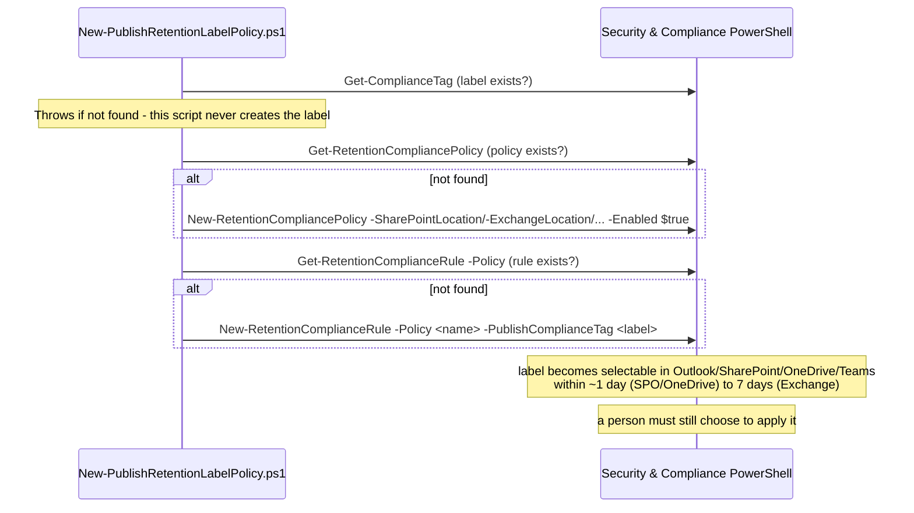

## 1. Problem statement

An existing retention label needs to reach people so they can apply it themselves, in Outlook,
SharePoint, OneDrive, or a Teams group-connected site. For a **regulatory record** label this isn't
optional: Microsoft's auto-apply retention label policies **do not support regulatory records at
all**, publishing is the *only* supported way to make one available, to anyone. For a plain record
or standard label, publishing is a deliberate **complement** to auto-apply (immediate, precise,
human-driven), not a substitute for it. This scenario builds the publish policy + rule as code,
and never touches the label itself.

## 2. Design goals

1. **Close the regulatory-record distribution gap.** Give this repo a scripted, grounded way to
   make a regulatory record label actually usable, the sibling `retention-labels-financial-
   records` scenario creates the label, but (per the correction below) can no longer wire a
   regulatory label into an auto-apply rule.
2. **Never create or edit the label.** This scenario only publishes an *existing* label
   (`Get-ComplianceTag` read-only check), label creation stays the sibling's job.
3. **Reproducible as code, safe to re-run.** Same create-or-report idempotency posture as the
   sibling: locate the policy/rule by name, report if present, never silently mutate.
4. **Honest about what publishing does and doesn't do.** Publishing makes a label *selectable*; it
   depends on a person actually choosing it. That's a different (and, for coverage, weaker)
   guarantee than auto-apply, and the docs/reviews say so plainly.

## 3. Correction: auto-apply does not support regulatory records

While grounding this scenario, a fresh Microsoft Learn pass found a page-level note on "Automatically
apply a retention label to retain or delete content" that this repo's existing
`retention-labels-financial-records` scenario had not accounted for:

> "This scenario isn't supported for regulatory records or default labels for an organizing
> structure... These scenarios require a published retention label policy."

Independently corroborated by "Declare records by using retention labels": "...for labels that mark
items as records (**but not regulatory records**), auto-apply those labels...", and by the "Will a
label be overridden?" table in `retention`, whose **Applied with auto-apply retention label policy**
row is **"Not applicable"** for labels that mark items as regulatory records.

`retention-labels-financial-records` (built before this scenario, and before this specific note was
independently re-checked) auto-applies its label with `regulatory: true` by default, a combination
Microsoft's own documentation says isn't supported. This scenario's build backports a targeted
correction into that sibling (not a new four-lens round, see its `reviews.md` correction addendum):

- The sibling's sample config now defaults to `regulatory: false` / `isRecordLabel: true` (a plain
  **record** label), which auto-apply *does* support.
- The sibling's deploy script now detects `label.regulatory: true` and **skips** policy/rule
  creation with a clear message pointing here, instead of silently building an unsupported
  configuration. Label creation itself is unaffected, `New-ComplianceTag -Regulatory $true` is a
  perfectly valid, standalone call; it just can't feed an auto-apply rule.
- This scenario becomes the sibling's documented completion for the regulatory case: create the
  label there, publish it here.

## 4. Object model

Two objects only: the **policy** (locations) and the **rule** (`-PublishComplianceTag`, no match
condition, publishing has no content-matching concept; that's what makes it structurally simpler,
and behaviorally weaker for coverage, than auto-apply).

## 5. Idempotency and safety posture

Same posture as the sibling: create-or-report, never silent update. The label is read-only here, 
this script has no code path that can create, edit, or delete a retention label, which removes an
entire class of risk (a typo here can misconfigure a *policy*, but it can never touch the label's
retention settings). Rollback disables/deletes the policy only; it never attempts to remove the
label (no `-TryRemoveLabel`-equivalent flag exists in this scenario at all, unlike the sibling).

## 6. Key decisions

| Decision | Choice | Rationale |
|---|---|---|
| Scope | Publish only, never create/edit the label | Keeps a hard boundary against label-side risk; label lifecycle stays the sibling's responsibility |
| Rule type | `-PublishComplianceTag` (no match condition) | The only cmdlet parameter set for publishing; no KQL/SIT condition exists for this rule type |
| Default worked example | Publish the sibling's "Financial Records - 7yr Regulatory" label | Makes the regulatory-record distribution gap concrete, not abstract |
| Locations | Static SharePoint + Exchange (+ optional OneDrive/Modern Group) | Matches the documented location support for publish; adaptive scopes remain a cross-cutting follow-up |
| Rollback | Disable/delete policy; never touch the label | Symmetric with the sibling's non-destructive posture; unpublishing never recalls an already-applied label |

## 7. Non-goals

- **Creating or editing the retention label.** Entirely the sibling scenario's job.
- **Default labels for SharePoint/Outlook** (library/folder-level auto-inheritance), a related,
  portal-only capability layered on top of a published label; no PowerShell/Graph cmdlet was found
  for setting it during this build's grounding pass (`README.md` §11).
- **Auto-apply for the same label.** A *different*, non-regulatory label could legitimately be both
  auto-applied and published (Microsoft: "a single retention label can be included in multiple
  retention label policies"), but that's a second, standalone deployment of the sibling scenario
  against a plain record label, not something this scenario builds.
- **Outlook rules / Power Automate relabeling**, other documented ways a label becomes applied;
  out of scope for this fragment's PowerShell-first automation focus.
- **Adaptive scopes**, static locations only, consistent with the sibling.
