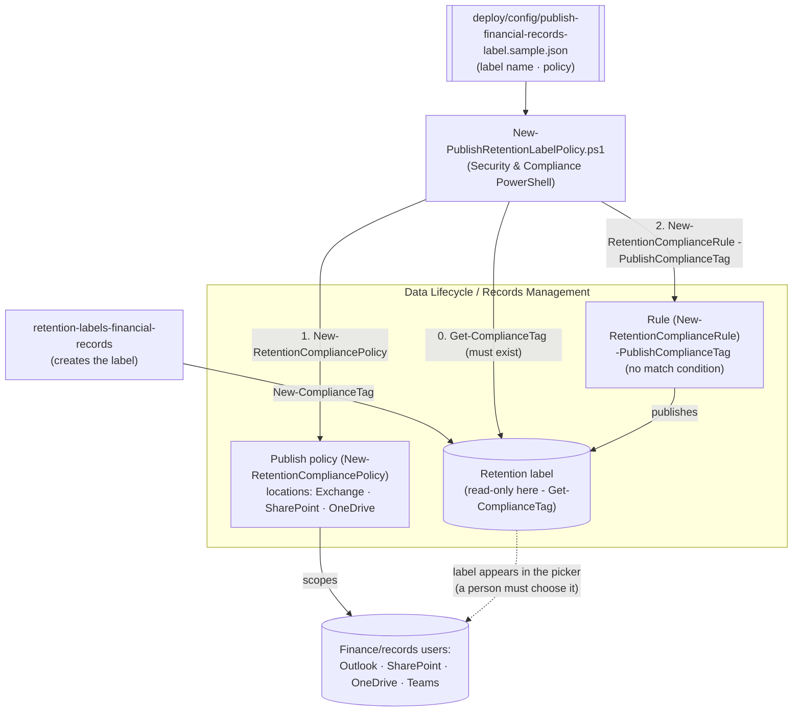

## 1. Scenario summary

Publishes an **existing** retention label to Exchange, SharePoint, and OneDrive so admins and end
users can manually apply it, in Outlook, SharePoint, OneDrive, and Teams group-connected sites, as
code, via Security & Compliance PowerShell. This scenario never creates or edits the label itself;
it only makes an already-created label selectable.

**Who it's for:** a records-management / compliance / IT team that has already created a retention
label (e.g. via the sibling `retention-labels-financial-records` scenario) and now needs people to
be able to apply it to specific emails or documents, either because the label marks items as a
**regulatory record** (for which publishing is the *only* supported distribution mechanism), or as a
precise, immediate complement to a slower, query-based auto-apply policy.

## 2. Business/regulatory driver

Two distinct, real needs converge on the same mechanism:

1. **Regulatory records have no other path.** Microsoft's auto-apply retention label policies
 explicitly **do not support regulatory records**, the docs state this as a scenario-level
 limitation, not a corner case: *"This scenario isn't supported for regulatory records... These
 scenarios require a published retention label policy"*, corroborated by
 *"...for labels that mark items as records (but not regulatory records), auto-apply those
 labels"*. If your obligation (SEC 17a-4, FINRA 4511, SOX, MiFID II, see the
 sibling scenario) requires full WORM regulatory immutability, **this scenario is not optional**, 
 it is the mechanism, not a variant.
2. **Precision and immediacy for everything else.** Auto-apply is asynchronous (up to 7 days) and
 only as good as its match query. Publishing lets a person who *knows* an item is a financial
 record apply the label the moment they create or receive it, a genuine complement, not a
 duplicate, of auto-apply for standard and record (non-regulatory) labels.

> ⚠️ **This scenario corrects a gap in the sibling scenario.** `retention-labels-financial-records`
> originally auto-applied its label with `regulatory: true` by default, a configuration Microsoft's
> documentation says isn't supported. That sibling has been corrected (see its `reviews.md`
> correction addendum) to default to a plain **record** label for auto-apply, and to stop before
> policy/rule creation if `regulatory: true` is set. This scenario is what completes the regulatory
> case: create the label there, publish it here. See `design.md` §3 for the full grounding.

## 3. Prerequisites

Full licensing detail: [Licensing matrix](/docs/licensing-matrix/). RBAC: [RBAC model](/docs/rbac-model/). Automation surface:
[Automation surface](/docs/automation-surface/) (surface 2, Security & Compliance PowerShell). Summary:

| Requirement | Minimum | Notes |
|---|---|---|
| Licensing | Retention labels/policies: **M365 E3**; records management (record/regulatory record labels, publishing them, disposition): **M365 E5 / E5 Compliance / Purview Suite** | Same licensing the label itself required, publishing adds no new SKU |
| Role | **Retention Management** or **Records Management** role group (Compliance Administrator / Organization Management include it) | Same role group as the sibling, [RBAC model](/docs/rbac-model/) |
| Auth | `Connect-IPPSSession` (certificate app-only preferred) | Security & Compliance PowerShell, [Automation surface §3](/docs/automation-surface/#3-authentication-patterns-interactive-vs-unattended) |
| Pre-existing label | The retention label named in the config **must already exist** | This scenario never creates or edits a label, `retention-labels-financial-records` (or any label source) creates it first |
| Target locations | Finance SharePoint site(s) / Exchange mailboxes or DG / OneDrive / Microsoft 365 Group | Policy needs ≥1 location |

> Verify current entitlement names against [Licensing matrix](/docs/licensing-matrix/) before a sales commitment, 
> SKU names change.

## 4. Architecture



Only two objects here (the **policy** and the **rule**), the label is a read-only dependency
created elsewhere. Full rationale, including the auto-apply/regulatory-record correction: `design.md`.

## 5. Step-by-step implementation

### PowerShell path

```powershell
# Connect (certificate app-only preferred - docs/automation-surface.md §3)
Connect-IPPSSession -AppId $AppId -Certificate $Cert -Organization 'contoso.onmicrosoft.com'

# 0. Prerequisite: the label must already exist (see retention-labels-financial-records)
Get-ComplianceTag -Identity 'Financial Records - 7yr Regulatory'

# 1. Dry run, prints the exact New-RetentionCompliancePolicy / -Rule cmdlets
./deploy/New-PublishRetentionLabelPolicy.ps1 -ConfigPath ./deploy/config/publish-financial-records-label.json -DryRun

# 2. Deploy the publish policy + rule
./deploy/New-PublishRetentionLabelPolicy.ps1 -ConfigPath ./deploy/config/publish-financial-records-label.json

# 3. Validate
./validate/Test-PublishRetentionLabelPolicy.ps1 -ConfigPath ./deploy/config/publish-financial-records-label.json
```

### Portal reference

The policy is visible in the [Microsoft Purview portal](https://purview.microsoft.com) under
**Records Management** (or **Data Lifecycle Management**) → **Policies** → **Label policies**, listed
with policy type **Publish**. `-WhatIf` is non-functional in S&C PowerShell, so
the deploy/remove scripts ship a `-DryRun` instead.

### How users actually apply the published label

Once published, users select the label themselves, this scenario doesn't (and can't) force
application:

- **Outlook / Outlook on the web:** select the item → **Assign Policy** (ribbon or right-click) →
 choose the label.
- **SharePoint / OneDrive:** select the item → details pane → **Apply label** (new experience only,
 not classic).
- **Teams group-connected sites:** **Files** tab, same experience as SharePoint, once the label is
 published to the **Microsoft 365 Groups** location.

## 6. Configuration reference

| Setting | Value this scenario uses | Notes |
|---|---|---|
| Label | Read-only prerequisite (`Get-ComplianceTag`) | This scenario never runs `New-/Set-ComplianceTag` |
| Policy cmdlet | `New-RetentionCompliancePolicy` | Publish label policy; needs ≥1 location |
| Locations | `SharePointLocation`, `ExchangeLocation` | Also `OneDriveLocation`, `ModernGroupLocation` |
| Rule cmdlet | `New-RetentionComplianceRule -PublishComplianceTag` | One rule per policy; **no** `-ContentMatchQuery`/`-ContentContainsSensitiveInformation`, those parameters belong to the `-ApplyComplianceTag` parameter set only |
| Retry stuck distribution | `Set-RetentionCompliancePolicy -RetryDistribution` | If the policy status shows Off (Error) |
| Supported for regulatory records | **Yes, the only supported path** | Contrast: auto-apply explicitly does **not** support regulatory records |

Exact cmdlet syntax and Learn sources are cited in each script's `.NOTES`.

## 7. Validation / how to prove it works

1. **Automated**, `./validate/Test-PublishRetentionLabelPolicy.ps1` confirms the label exists, the
 policy exists/enabled with ≥1 location, and the rule publishes the expected label. Exits
 non-zero on failure.
2. **Publish timing**, SharePoint/OneDrive typically surface the label within a day (allow up to 7);
 Exchange can take up to 7 days and needs the mailbox to hold ≥10 MB of data.
3. **Manual-apply test**, in a lab tenant, confirm the label actually appears in Outlook's **Assign
 Policy** menu and SharePoint/OneDrive's **Apply label** picker, then apply it to a test item and
 confirm the expected retention/record behavior.
4. **Idempotency proof**, re-run the deploy; the policy/rule report `exists` (not `created`) and
 nothing is duplicated or silently mutated.
5. **If stuck (Off (Error))**, run `Set-RetentionCompliancePolicy -Identity <policy> -RetryDistribution`
.

## 8. Operations & tuning

**KPIs / signals:** policy **DistributionStatus** (should reach a healthy state); count of items
manually labeled over time (content search / activity explorer) as a coverage signal against how
much *should* be labeled. **Tuning:** publishing has no query to tune, the lever here is **user
awareness**, not policy configuration. Pair this with clear guidance to the target audience (what
the label means, when to apply it) and, where the label isn't a regulatory record, an auto-apply
policy for the content people forget to label.

**Change management:** adding/removing locations is a straightforward, low-risk change (unlike the
sibling's irreversible auto-apply of a regulatory label), publishing doesn't retroactively affect
already-labeled content and unpublishing doesn't recall it either.

## 9. Rollback / decommission

See `rollback.md`. Quick reference: `./deploy/Remove-PublishRetentionLabelPolicy.ps1` **disables**
the publish policy (stops offering the label to *new* selections); `-Delete` removes the policy +
rule. The retention **label itself is never touched** by this scenario's scripts, there's no
`-TryRemoveLabel`-equivalent here at all, unlike the sibling. Removing the policy never un-labels
content a user already labeled.

## 10. Cost & licensing notes

- **No incremental licensing cost.** Publishing uses the same records-management/E5-tier entitlement
 the label itself already required, there's no separate "publish" SKU.
- **The real cost is human, not technical.** Publishing depends on people choosing to apply the
 label; the cost of under-coverage is a training/process problem, not a licensing one, factor
 operator/user training into the rollout plan, especially where (as with regulatory records) this
 is the *only* mechanism available.
- **No storage-growth risk from this scenario alone**, publishing doesn't retain anything by
 itself; the label's own retention action (created by the sibling) does that.

## 11. Known limitations & gotchas

- **Human-dependent coverage.** A published label is only as effective as people choosing to apply
 it. For regulatory records this is unavoidable (auto-apply isn't an option); for other labels,
 pair this with the sibling's auto-apply scenario rather than relying on publishing alone.
- **No content-matching for publish rules.** `-PublishComplianceTag` accepts no
 `-ContentMatchQuery`/`-ContentContainsSensitiveInformation`, there's nothing to "tune" beyond
 locations, unlike the auto-apply sibling.
- **Publish latency.** Up to 7 days for both SharePoint/OneDrive and Exchange in the worst case
 (SharePoint/OneDrive usually appears within a day); Exchange mailboxes need ≥10 MB of data
.
- **This scenario never creates the label.** If `Get-ComplianceTag` finds nothing, the deploy script
 throws rather than guessing a definition, create the label first.
- **`Get-RetentionComplianceRule`'s `PublishComplianceTag` read-back property is not explicitly
 documented**, Microsoft's reference lists only Name/Disabled/Mode/Comment as the cmdlet's
 documented default-display properties. This repo's sibling scenario already
 reads the parallel `ApplyComplianceTag` property directly without flagging it as unconfirmed;
 `validate/Test-PublishRetentionLabelPolicy.ps1` follows the same established convention for
 `PublishComplianceTag` rather than introducing an inconsistent hedge. **VERIFY (pilot tenant)**
 before relying on this in an unattended pipeline.
- **Default labels for SharePoint/Outlook are a related but separate capability.** After
 publishing, an admin can set the label as a *default* for a document library or Outlook folder so
 unlabeled items inherit it automatically, a portal-only step; no
 PowerShell/Graph cmdlet for it was found during this build's grounding pass. Out of scope here
 (`design.md` §7).
- **A label can be in more than one label policy.** Microsoft confirms *"a single retention label can
 be included in multiple retention label policies"*, so a non-regulatory record
 label could legitimately be both auto-applied (sibling scenario) and published (this scenario) at
 the same time. This scenario's default worked example targets the sibling's regulatory label,
 which by definition can only ever be published.
- **Illustrative values.** The policy name, locations, and Exchange distribution-group name are
 placeholders, set them to your actual finance locations before deploying.

## 12. References

1. Publish retention labels and apply them in apps (publish steps; timing; manual-apply UX per app; supported for all label configurations incl. regulatory records), <https://learn.microsoft.com/purview/create-apply-retention-labels>
2. New-RetentionCompliancePolicy (locations; ≥1 location required; policy not valid until a rule is added), <https://learn.microsoft.com/powershell/module/exchangepowershell/new-retentioncompliancepolicy>
3. New-RetentionComplianceRule (`-PublishComplianceTag` parameter set: mandatory, mutually exclusive with `-ApplyComplianceTag`/`-Name`, no content-match parameters), <https://learn.microsoft.com/powershell/module/exchangepowershell/new-retentioncompliancerule>
4. Automatically apply a retention label to retain or delete content ("isn't supported for regulatory records... require a published retention label policy"; `Set-RetentionCompliancePolicy -RetryDistribution`), <https://learn.microsoft.com/purview/apply-retention-labels-automatically>
5. Declare records by using retention labels ("...for labels that mark items as records (but not regulatory records), auto-apply those labels..."), <https://learn.microsoft.com/purview/declare-records>
6. Get-RetentionComplianceRule (documented default-display properties: Name, Disabled, Mode, Comment), <https://learn.microsoft.com/powershell/module/exchangepowershell/get-retentioncompliancerule>
7. Learn about retention policies and retention labels ("a single retention label can be included in multiple retention label policies"; "Will a label be overridden?" table, auto-apply is "Not applicable" for regulatory records), <https://learn.microsoft.com/purview/retention>
8. PowerShell cmdlets for retention policies and retention labels, <https://learn.microsoft.com/purview/retention-cmdlets>
9. Microsoft Purview service description, Records Management / Data Lifecycle Management licensing, <https://learn.microsoft.com/office365/servicedescriptions/microsoft-365-service-descriptions/microsoft-365-tenantlevel-services-licensing-guidance/microsoft-purview-service-description>

> Re-verify all links, cmdlet parameters, and licensing against current Microsoft Learn before a
> customer-facing deployment. This scenario deliberately never creates or edits a retention label, 
> confirm the target label already exists before running the deploy script.
