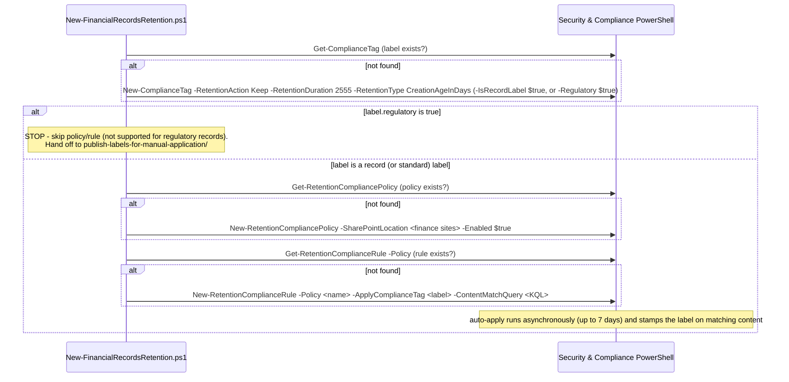

## 1. Problem statement

A regulated firm must retain financial books-and-records **immutably** for a fixed period (SEC 17a-4,
FINRA 4511, SOX, MiFID II) and prove it. The control has two parts that must be right and reproducible:
the **retention/immutability settings** (how long, and that it truly can't be altered or deleted) and
the **targeting** (which content gets it, automatically). This scenario builds both as code, a
regulatory record retention label plus an auto-apply policy, with heavy guardrails because the label
is irreversible once applied.

## 2. Design goals

1. **Immutability that satisfies WORM obligations.** Use a **regulatory record** label so content
 becomes non-rewriteable/non-erasable and the label/retention can't be weakened by anyone.
2. **Reproducible as code.** One config → label + policy + rule; re-running is safe and reports rather
 than silently mutates high-consequence objects.
3. **Guardrails proportional to irreversibility.** `-DryRun` by intent (S&C `-WhatIf` doesn't work),
 create-or-report (never auto-edit an existing retention object), loud warnings, and a rollback that
 refuses to pretend records can be released.
4. **PowerShell-first, honestly.** Regulatory records can only be created in PowerShell, so this is a
 real automation requirement, not a portal shortcut, and the scenario says so.
5. **Narrow targeting.** Encourage a tightly-scoped location + match query, because over-scoping an
 irreversible label is the dominant risk.

## 3. Why a record label by default, and the auto-apply/regulatory-record correction

Purview offers a ladder of retention strength:
- **Retention label (Keep)**, retains content but an admin can still remove the label / change
 retention.
- **Record label (`-IsRecordLabel`)**, locks the item (can't edit/delete while locked) but a record
 can be **unlocked** and the label can be removed by a records manager, reversible with privilege.
- **Regulatory record (`-Regulatory`)**, the strongest: **cannot** be removed, relabeled, unlocked, or
 shortened, and content **cannot** be edited/deleted, by anyone, for the full period.

**Correction (this build's grounding pass):** this scenario originally defaulted to **regulatory
record** and auto-applied it, matching the SEC 17a-4-class obligation's ideal strength, but a
combination Microsoft's documentation does not support. A fresh Microsoft Learn pass found:

> "This scenario isn't supported for regulatory records or default labels for an organizing
> structure... These scenarios require a published retention label policy.", [Automatically apply a
> retention label to retain or delete content](https://learn.microsoft.com/purview/apply-retention-labels-automatically)

Corroborated by [Declare records by using retention labels](https://learn.microsoft.com/purview/declare-records):
"...for labels that mark items as records (**but not regulatory records**), auto-apply those labels
to content that you want to declare a record", and by the "Will a label be overridden?" table in
[Learn about retention policies and retention labels](https://learn.microsoft.com/purview/retention),
whose **Applied with auto-apply retention label policy** row is **"Not applicable"** for labels that
mark items as regulatory records.

**Resulting design:** this scenario now defaults to a plain **record** label for its auto-apply path
(fully supported), and still supports creating a **regulatory record** label via the same script, but
the script detects `regulatory: true` and stops after label creation, never attempting the unsupported
auto-apply combination. The sibling scenario `scenarios/data-lifecycle-management/
publish-labels-for-manual-application/` is the documented, only-supported completion for that case.
This preserves the original SEC 17a-4 driver honestly: a buyer who genuinely needs full WORM
immutability still gets it, just via publish + manual application rather than auto-apply, which is
what Microsoft's product actually requires, not a workaround this repo invented.

## 4. Object model

A policy is invalid until it has a rule; only **one rule per policy**. The label carries the durable
settings; the policy/rule decide where and how it's auto-applied, but only ever get created for a
record or standard label, never a regulatory record (§3).

**Grounding correction (2026-09-16):** the `New-RetentionComplianceRule` call above passes only
`-Policy`/`-ApplyComplianceTag`/`-ContentMatchQuery`. An earlier draft also passed `-Name`; Microsoft's
current reference documents `-Name` as mutually exclusive with `-ApplyComplianceTag`/
`-PublishComplianceTag`, the `ComplianceTag` parameter set `-ApplyComplianceTag` belongs to has no
`-Name` parameter, so that combination would not have resolved at runtime. Found and corrected while
grounding the sibling `scenarios/data-lifecycle-management/adaptive-scope-auto-apply-label/` scenario,
whose own rule call never included `-Name`. The existing idempotency check
(`Get-RetentionComplianceRule -Policy`) already locates the rule by policy, so dropping the name has no
other effect. See `README.md` §6/§11 and `reviews.md`'s correction addendum.

## 5. Idempotency and safety posture

Idempotency here is deliberately **create-or-report**, not create-or-update: the deploy locates each
object by name and, if it exists, reports it and moves on rather than mutating it. Retention objects, 
especially a record or regulatory record label, are too consequential to silently reconcile from a
file; a settings change must be a deliberate, reviewed action. Combined with `-DryRun`, loud
warnings, a hard product-constraint guard against the unsupported regulatory-record/auto-apply
combination, and a rollback that never force-removes records, the safety posture is proportional to
the irreversibility of the control.

## 6. Key decisions

| Decision | Choice | Rationale |
|---|---|---|
| Immutability level | **Record** (`-IsRecordLabel $true`) by default | The strongest level auto-apply actually supports; `regulatory: true` is available but stops the script before policy/rule creation (§3) |
| Surface | Security & Compliance PowerShell | Regulatory records are PowerShell-only to create; DLM/RM cmdlets are the native surface either way |
| Dry-run | Custom `-DryRun` | `-WhatIf` is non-functional in S&C PowerShell |
| Idempotency | Create-or-report (no silent update) | Retention objects are high-consequence; edits must be deliberate |
| Retention clock | `CreationAgeInDays`, 2555 days (~7y) | Common financial-records baseline; tune to the obligation |
| Targeting | Static SharePoint location + narrow KQL | Precision over recall for a lockable label; adaptive scopes are a follow-up |
| Regulatory-record guard | Skip policy/rule creation; hand off to the publish sibling | Auto-apply is not supported for regulatory records, a hard Microsoft product constraint, not a style choice (§3) |
| Rollback | Disable/delete policy; never force-remove records | A record label needs a records manager to release; a regulatory record label can't be released at all, the script refuses to pretend otherwise |

## 7. Non-goals

- **Publishing labels for manual application** (`-PublishComplianceTag`), **built** as the sibling
 `scenarios/data-lifecycle-management/publish-labels-for-manual-application/` scenario, which is now
 the *required* completion for the regulatory-record case (§3), not merely an optional variant.
- **Event-based retention / disposition review workflows** (`-EventType`, `KeepAndDelete`,
 `-ReviewerEmail`), powerful RM features layered on the same cmdlets; candidate follow-ups.
- **Adaptive scopes**, used for large/dynamic estates; this scenario uses static locations.
- **File plan descriptors** (`-FilePlanProperty`: categories, citations, authorities), valuable for
 formal file plans; out of scope for the starter.
- **Editing/strengthening an existing label**, the deploy reports and does not mutate; changes are a
 deliberate, reviewed action.
- **Releasing existing records**, impossible for a regulatory record by design, and requires
 records-manager privilege for a plain record; rollback only stops future auto-labeling.
