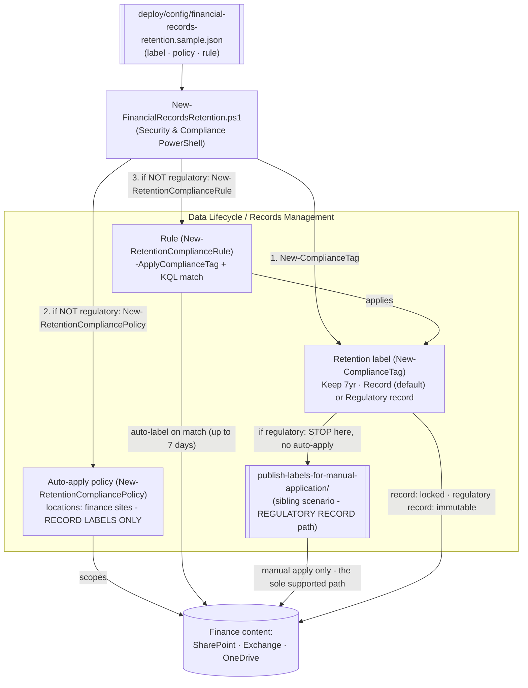

## 1. Scenario summary

Creates a **record** retention label for financial books-and-records (SEC 17a-4-style immutability)
and an **auto-apply** retention label policy that stamps it onto finance content — as code, via
Security & Compliance PowerShell. The label keeps content for 7 years and locks it as a **record**
(can't be edited/deleted, can only be unlocked or removed by a records manager); the auto-apply
policy targets the finance SharePoint site(s) and matches financial-record signals with a KQL query.
The same script can also create a stronger **regulatory record** label (`-Regulatory $true`,
PowerShell-only — the portal hides the option by default) — but Microsoft does **not** support
auto-applying a regulatory record, so for that case this script creates the label only and hands off
to the sibling `publish-labels-for-manual-application/` scenario to distribute it. See §2.

**Who it's for:** a records-management / compliance / IT team at a regulated organization (broker-
dealer, bank, insurer) that must retain financial records for a fixed period — either as a lockable
record (auto-applied, this scenario end-to-end) or as a full WORM regulatory record (created here,
distributed by the sibling scenario) — and wants it defined, reviewed, and deployed as reproducible
code.

## 2. Business/regulatory driver

Financial-services firms face prescriptive records-retention rules: **SEC Rule 17a-4** requires
broker-dealers to preserve specified records for defined periods (many for 6 years, the first 2
readily accessible), for the strictest records in a **non-rewriteable, non-erasable (WORM)** format;
**FINRA Rule 4511**, **CFTC 1.31**, **Sarbanes-Oxley**, and **MiFID II** impose parallel obligations.
Microsoft Purview offers two strengths of control for this: a **record** label (locks the item; a
records manager can still unlock/remove it) and a **regulatory record** label (the label **can't be
removed, relabeled, or unlocked, its retention can't be shortened, and the content can't be edited or
deleted** — for anyone, including admins — until the retention period expires) [[1]](#references).

> ⚠️ **Correction (this build's grounding pass): auto-apply does not support regulatory records.**
> Microsoft's own documentation states plainly that automatically applying a retention label "isn't
> supported for regulatory records... These scenarios require a published retention label policy"
> [[3]](#references), corroborated by "...for labels that mark items as records (**but not
> regulatory records**), auto-apply those labels" [[2]](#references). This scenario's earlier draft
> auto-applied a regulatory record label by default — a configuration Microsoft doesn't support. It
> now defaults to a plain **record** label for auto-apply (fully supported), and creates but does
> **not** auto-apply a regulatory record label if you configure one — see the sibling
> `scenarios/data-lifecycle-management/publish-labels-for-manual-application/` scenario, which is the
> *only* Microsoft-supported way to distribute a regulatory record label. Full grounding: that
> scenario's `design.md` §3 and this scenario's `reviews.md` correction addendum.

> ⚠️ **Irreversibility is still real for a record label, just not absolute.** Over-scoping the
> auto-apply query locks the wrong content as a record, which then only a records manager can unlock
> or remove — and a regulatory record, if you create one, can never be removed once applied by
> anyone. Test in a lab tenant, review with `-DryRun`, and get Records/Legal sign-off before
> deploying. See §11.

## 3. Prerequisites

Full licensing detail: `docs/licensing-matrix.md`. RBAC: `docs/rbac-model.md`. Automation surface:
`docs/automation-surface.md` (surface 2 — Security & Compliance PowerShell). Summary:

| Requirement | Minimum | Notes |
|---|---|---|
| Licensing | Retention labels/policies: **M365 E3**; **records management** (record + regulatory record labels, auto-apply, event-based, disposition review): **M365 E5 / E5 Compliance / Purview Suite** | Records are a Records Management (E5) capability [[6]](#references) |
| Role | **Retention Management** or **Records Management** role group (Compliance Administrator / Organization Management include it) | To create labels, policies, and rules — `docs/rbac-model.md` |
| Auth | `Connect-IPPSSession` (certificate app-only preferred) | Security & Compliance PowerShell — `docs/automation-surface.md` §3 |
| Regulatory record option | Enabled **only via PowerShell** (`New-ComplianceTag -Regulatory $true`) | The portal hides regulatory records by default [[1]](#references) |
| Target locations | Finance SharePoint site(s) / mailboxes / OneDrive | Auto-apply policy needs ≥1 location |

> Verify current entitlement names against `docs/licensing-matrix.md` (dated 2026-09-02) before a
> sales commitment — SKU names change.

## 4. Architecture



Three objects: the **label** (the retention + record/regulatory settings), the **policy** (where to
look), and the **rule** (which label to apply and the match query) — but the policy/rule are only
created when the label is **not** a regulatory record. Full rationale: `design.md` §3.

## 5. Step-by-step implementation

### PowerShell path

```powershell
# Connect (certificate app-only preferred - docs/automation-surface.md §3)
Connect-IPPSSession -AppId $AppId -Certificate $Cert -Organization 'contoso.onmicrosoft.com'

# 1. Dry run — prints the exact New-ComplianceTag / New-RetentionCompliancePolicy / -Rule cmdlets
./deploy/New-FinancialRecordsRetention.ps1 -ConfigPath ./deploy/config/financial-records-retention.json -DryRun

# 2. Deploy the label + auto-apply policy + rule (after lab test + Records/Legal sign-off)
./deploy/New-FinancialRecordsRetention.ps1 -ConfigPath ./deploy/config/financial-records-retention.json

# 3. Validate
./validate/Test-FinancialRecordsRetention.ps1 -ConfigPath ./deploy/config/financial-records-retention.json
```

### Portal reference

The label, policy, and rule are visible in the [Microsoft Purview portal](https://purview.microsoft.com)
under **Records Management** (or **Data Lifecycle Management**) → **File plan / Labels** and →
**Label policies** [[2]](#references)[[3]](#references). The **regulatory record** option is hidden in
the portal by default, which is why *label creation* is PowerShell-first [[1]](#references) — though,
per the correction in §2, *distributing* a regulatory record label is never done by this scenario's
own policy/rule at all; see the sibling scenario. `-WhatIf` is non-functional in S&C PowerShell, so
the deploy/remove scripts ship a `-DryRun` instead.

## 6. Configuration reference

| Setting | Value this scenario uses | Notes |
|---|---|---|
| Label cmdlet | `New-ComplianceTag` | Retention label [[4]](#references) |
| `RetentionAction` | `Keep` | `Keep` / `Delete` / `KeepAndDelete` |
| `RetentionDuration` | `2555` (≈7 years) | Days, or `Unlimited` |
| `RetentionType` | `CreationAgeInDays` | When the clock starts: `CreationAgeInDays` / `ModificationAgeInDays` / `TaggedAgeInDays` / `EventAgeInDays` |
| `Regulatory` | `$false` (default) | Set `$true` only if you intend to hand off to the publish sibling — auto-apply is skipped when true [[3]](#references) |
| `IsRecordLabel` | `$true` (default) | A plain **record** label — lockable, and the only one of the two auto-apply supports [[2]](#references) |
| Policy cmdlet | `New-RetentionCompliancePolicy` | Auto-apply label policy; needs ≥1 location; **only created when `Regulatory` is false** [[5]](#references) |
| Locations | `SharePointLocation` (finance site) | Also `ExchangeLocation`, `OneDriveLocation`, etc. |
| Rule cmdlet | `New-RetentionComplianceRule -ApplyComplianceTag` | One rule per policy; `-ContentMatchQuery` (KQL) or `-ContentContainsSensitiveInformation`; **no `-Name`** — documented mutually exclusive with `-ApplyComplianceTag` [[7]](#references) |
| Retry stuck distribution | `Set-RetentionCompliancePolicy -RetryDistribution` | If the policy status shows Off (Error) [[3]](#references) |

Exact cmdlet syntax and Learn sources are cited in each script's `.NOTES`.

## 7. Validation / how to prove it works

1. **Automated** — `./validate/Test-FinancialRecordsRetention.ps1` confirms the label exists with the
   expected action/duration and record flags; if the label is **not** a regulatory record, also that
   the policy exists and is enabled with ≥1 location, and the rule applies the expected label. Exits
   non-zero on failure.
2. **Lock test (lab tenant)** — apply the label to a test document, then confirm you **cannot** edit
   or delete it while it's a record; a records manager can unlock/remove a plain record label, but
   **no one** can if you configured a regulatory record instead [[1]](#references).
3. **Auto-apply test (record label only)** — place matching content in a finance location, wait up to
   **7 days** [[3]](#references), and confirm the label is applied (portal, or `Get-` on the item's
   compliance tag). If stuck, run `Set-RetentionCompliancePolicy -RetryDistribution`. **Not applicable
   for a regulatory record** — see the publish sibling scenario instead.
4. **Idempotency proof** — re-run the deploy; the label (and, for a record label, the policy/rule)
   reports `exists` (not `created`) and nothing is duplicated or silently mutated.
5. **Disposition (if configured)** — for `KeepAndDelete` labels with disposition review, confirm the
   reviewer receives a disposition item at end-of-retention (out of scope for the `Keep`-only default).

## 8. Operations & tuning

**KPIs / signals:** policy **DistributionStatus** (should reach a healthy state; Off (Error) → retry);
count of items labeled over time (via content search / Data Lifecycle reports); disposition backlog
(if using KeepAndDelete). **Tuning:** keep the auto-apply **match query narrow** — precision matters
far more than recall when the label locks content as a record; start with a tightly-scoped location +
query, validate, then widen. Auto-apply latency is up to 7 days; don't expect instant labeling.

**Change management:** treat any change to the label or its scope as a controlled, Records/Legal-
reviewed change — a record label needs a records manager to walk back, and a regulatory record can
never be walked back at all. Keep the config file under version control as the record of what was
deployed and why.

## 9. Rollback / decommission

See `rollback.md`. Quick reference: `./deploy/Remove-FinancialRecordsRetention.ps1` **disables** the
auto-apply policy (stops labeling *new* content, and only exists at all for a record label — see §2);
`-Delete` removes the policy + rule. The **label is not force-removed**: a record label that's been
applied can only be unlocked/removed by a records manager, and a regulatory record label that's been
applied **cannot** be removed by anyone and its retention **cannot** be shortened. Removing the policy
never releases content already labeled.

## 10. Cost & licensing notes

- **Per-user E5 entitlement**, no Azure consumption meter. Records management (record/regulatory
  record labels, auto-apply, disposition) is an **E5 / E5 Compliance / Purview Suite** capability;
  plain retention labels/policies are E3 [[6]](#references).
- **Cost is licensing + storage + governance discipline.** Content locked as a record (or regulatory
  record) can't be deleted early, so storage grows for the full retention term — factor 7-year (or
  longer) growth into SharePoint/Exchange capacity planning.
- **The expensive mistake is over-scoping.** An over-broad auto-apply query locks vast amounts of
  content as records that then need a records manager (or, for a regulatory record, no one at all) to
  release — the dominant risk to manage (§11).

## 11. Known limitations & gotchas

- **Fixed grounding defect (2026-09-16):** the deploy script's `New-RetentionComplianceRule` call
  previously passed both `-Name` and `-ApplyComplianceTag`. Microsoft's current reference documents
  `-Name` as mutually exclusive with `-ApplyComplianceTag`/`-PublishComplianceTag` — the `ComplianceTag`
  parameter set `-ApplyComplianceTag` belongs to has no `-Name` parameter at all — so that combination
  would not have resolved at runtime. `deploy/New-FinancialRecordsRetention.ps1` now omits `-Name`; the
  existing idempotency check (`Get-RetentionComplianceRule -Policy`) already locates the rule by policy,
  not by name, so nothing else depended on it. Found while grounding the sibling
  `scenarios/data-lifecycle-management/adaptive-scope-auto-apply-label/` scenario, whose own script
  never repeated the defect. See §6 and `reviews.md`'s correction addendum.
- **Auto-apply does not support regulatory records — this is a hard product limitation, not a bug in
  this scenario.** Microsoft: "This scenario isn't supported for regulatory records... These scenarios
  require a published retention label policy" [[3]](#references). This script creates the label
  either way, but skips policy/rule creation and tells you to use
  `scenarios/data-lifecycle-management/publish-labels-for-manual-application/` instead when
  `regulatory: true`. See §2's correction note and `design.md` §3/§6.
- **A record label is lockable, not irreversible; a regulatory record is irreversible.** Only pick
  `Regulatory: true` if your obligation genuinely needs WORM immutability that even admins can't
  override — otherwise the default record label (still locked; a records manager can unlock/remove
  it) is the less-restrictive, equally-automatable choice. **Test in a lab tenant, review with
  `-DryRun`, and get Records/Legal sign-off before deploying either** [[1]](#references).
- **Regulatory records are PowerShell-only to create.** `New-ComplianceTag -Regulatory $true` is the
  only supported way; the portal hides the option by default [[1]](#references). That's independent
  of the auto-apply limitation above — label creation and label distribution are two different
  product surfaces with two different constraints.
- **`-WhatIf` is non-functional in S&C PowerShell** — the scripts ship a `-DryRun` instead.
- **Auto-apply latency & scope (record label only).** Auto-apply can take up to 7 days; can't label
  SharePoint/OneDrive items older than 6 months for trainable-classifier conditions; SharePoint/
  mailboxes need ≥10 MB for classifier-based apply. This scenario uses a KQL `-ContentMatchQuery`,
  which is not subject to the classifier age/size limits, but still has the 7-day latency
  [[3]](#references).
- **Idempotency is create-or-report, not create-or-update.** The deploy locates objects by name and
  does **not** silently modify an existing label/policy (retention objects are high-consequence) — edit
  deliberately, with review, if settings must change.
- **Adaptive scopes out of scope.** This scenario uses static SharePoint locations; large/dynamic
  estates should use adaptive scopes (a documented follow-up) [[3]](#references).
- **Locking behavior of the policy vs. records.** Disabling/deleting the auto-apply policy stops future
  labeling only — it never releases content already locked as a record (`rollback.md`).
- **Illustrative values.** The 7-year duration, the finance site URL, and the match query are
  placeholders — set them to your actual regulatory obligation and record signals, validated by Records/
  Legal, before deploying.

## 12. References

1. Learn about records management / regulatory records (immutability: can't remove/relabel/unlock/shorten; PowerShell-only creation) — <https://learn.microsoft.com/purview/records-management>
2. Declare records by using retention labels ("...for labels that mark items as records (but not regulatory records), auto-apply those labels...") — <https://learn.microsoft.com/purview/declare-records>
3. Automatically apply a retention label to retain or delete content (auto-apply policy, up to 7-day latency, RetryDistribution, classifier limits; "isn't supported for regulatory records... require a published retention label policy") — <https://learn.microsoft.com/purview/apply-retention-labels-automatically>
4. New-ComplianceTag (retention label; RetentionAction/Duration/Type, IsRecordLabel, Regulatory) — <https://learn.microsoft.com/powershell/module/exchangepowershell/new-compliancetag>
5. New-RetentionCompliancePolicy (retention label policy; locations) — <https://learn.microsoft.com/powershell/module/exchangepowershell/new-retentioncompliancepolicy>
6. Microsoft Purview service description — Records Management / Data Lifecycle Management licensing — <https://learn.microsoft.com/office365/servicedescriptions/microsoft-365-service-descriptions/microsoft-365-tenantlevel-services-licensing-guidance/microsoft-purview-service-description>
7. New-RetentionComplianceRule (-ApplyComplianceTag / -PublishComplianceTag, -ContentMatchQuery, -ContentContainsSensitiveInformation) — <https://learn.microsoft.com/powershell/module/exchangepowershell/new-retentioncompliancerule>
8. PowerShell cmdlets for retention policies and retention labels — <https://learn.microsoft.com/purview/retention-cmdlets>
9. Bulk create and publish retention labels by using PowerShell — <https://learn.microsoft.com/purview/bulk-create-publish-labels-using-powershell>

> Re-verify all links, cmdlet parameters, licensing, and the regulatory-record behavior against
> current Microsoft Learn before a customer-facing deployment. Regulatory records are irreversible —
> the scenario is deliberately conservative (dry-run, create-or-report, no force-remove of records).
